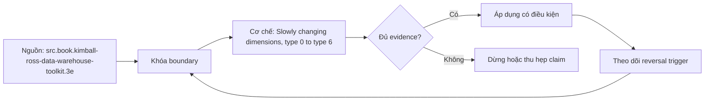

# Slowly changing dimensions, type 0 to type 6

> [!abstract] Câu hỏi trung tâm
> Chọn và cài SCD response theo câu hỏi lịch sử như thế nào, đặc biệt khi late-arriving change, correction và hai cách nhìn cùng tồn tại?

## 1. Type 0, 1 và ranh giới correction

Type 0 giữ nguyên giá trị ban đầu; Type 1 overwrite và không giữ prior value. Type 1 hợp với sửa lỗi hoặc thuộc tính không cần lịch sử, nhưng sẽ restate toàn bộ facts cũ theo giá trị mới khi join. Quyết định correction hay business change thuộc data contract, không thể suy chỉ từ việc source gửi UPDATE.

## 2. Type 2 và hai bất biến

Type 2 thêm version row với surrogate key mới; fact mới trỏ version có hiệu lực, fact cũ không rewrite. Hai bất biến tối thiểu là không overlap valid interval cho cùng business key và tối đa một current row. Half-open interval [from,to) giúp hai version kề nhau không overlap. Cần transaction/merge semantics để close old và insert new một cách atomic.

## 3. Type 3 và alternate reality

Type 3 thêm cột prior/alternate value trên cùng row, cho phép xem facts theo cả cấu trúc cũ và mới trong một số change hữu hạn. Nó không lưu chuỗi vô hạn và phải đặt tên cột rõ current/prior/as-was/as-is. Dùng cho reorganization cần hai cách roll-up, không phải thay Type 2 cho mọi change.

## 4. Type 4–6 và cảnh báo taxonomy

Sau ba type cơ bản, cách đánh số không hoàn toàn thống nhất giữa tài liệu. Trong hệ Kimball hiện đại, Type 4 thường là mini-dimension cho rapidly changing attributes; Type 5 ghép mini-dimension với current profile; Type 6 ghép Type 1+2+3 để hỗ trợ as-was và as-is. Thiết kế phải mô tả behavior thay vì chỉ ghi con số type.

## 5. Late arriving, idempotency và fact lookup

Change đến muộn có thể phải chèn version giữa hai interval, tách interval cũ và xác định facts cần restate theo policy. Hash-diff chỉ phát hiện row khác; nó không quyết định attribute nào Type 1/2. Rerun cùng batch phải không sinh thêm version; lookup surrogate key phải dùng business key cùng effective time/cutoff.

## 6. Ma trận kiểm chứng từng mệnh đề

Mỗi mệnh đề phải chuyển thành fixture, invariant và phép đối chiếu tái chạy được. Tên pattern, sơ đồ hoặc một query chạy không lỗi không tự chứng minh đúng grain và semantics.

### 6.1. Type 0 giữ original value

**Mệnh đề cần kiểm.** Type 0 giữ original value. **Thiết kế phép kiểm.** Tạo timeline gồm normal change, correction, late-arriving change và rerun. Kiểm no-overlap, exactly-one-current, stable business key, surrogate lookup theo effective time và report as-was/as-is. Chạy lại cùng batch để bắt version trùng. **Bằng chứng đạt cho `wiki.data-modeling.scd-types`.** Lưu model/metric contract, seed data, SQL/notebook, raw output, row counts, distinct keys, unmatched rate và control totals. Nếu kết quả phụ thuộc engine, cutoff hoặc business policy, phải ghi điều kiện đó cùng phản ví dụ.

### 6.2. Type 1 overwrite làm lịch sử facts mang current label

**Mệnh đề cần kiểm.** Type 1 overwrite làm lịch sử facts mang current label. **Thiết kế phép kiểm.** Tạo timeline gồm normal change, correction, late-arriving change và rerun. Kiểm no-overlap, exactly-one-current, stable business key, surrogate lookup theo effective time và report as-was/as-is. Chạy lại cùng batch để bắt version trùng. **Bằng chứng đạt cho `wiki.data-modeling.scd-types`.** Lưu model/metric contract, seed data, SQL/notebook, raw output, row counts, distinct keys, unmatched rate và control totals. Nếu kết quả phụ thuộc engine, cutoff hoặc business policy, phải ghi điều kiện đó cùng phản ví dụ.

### 6.3. Type 2 tạo surrogate key mới

**Mệnh đề cần kiểm.** Type 2 tạo surrogate key mới. **Thiết kế phép kiểm.** Tạo timeline gồm normal change, correction, late-arriving change và rerun. Kiểm no-overlap, exactly-one-current, stable business key, surrogate lookup theo effective time và report as-was/as-is. Chạy lại cùng batch để bắt version trùng. **Bằng chứng đạt cho `wiki.data-modeling.scd-types`.** Lưu model/metric contract, seed data, SQL/notebook, raw output, row counts, distinct keys, unmatched rate và control totals. Nếu kết quả phụ thuộc engine, cutoff hoặc business policy, phải ghi điều kiện đó cùng phản ví dụ.

### 6.4. Type 2 không được overlap intervals

**Mệnh đề cần kiểm.** Type 2 không được overlap intervals. **Thiết kế phép kiểm.** Tạo timeline gồm normal change, correction, late-arriving change và rerun. Kiểm no-overlap, exactly-one-current, stable business key, surrogate lookup theo effective time và report as-was/as-is. Chạy lại cùng batch để bắt version trùng. **Bằng chứng đạt cho `wiki.data-modeling.scd-types`.** Lưu model/metric contract, seed data, SQL/notebook, raw output, row counts, distinct keys, unmatched rate và control totals. Nếu kết quả phụ thuộc engine, cutoff hoặc business policy, phải ghi điều kiện đó cùng phản ví dụ.

### 6.5. mỗi business key có tối đa một current row

**Mệnh đề cần kiểm.** mỗi business key có tối đa một current row. **Thiết kế phép kiểm.** Tạo timeline gồm normal change, correction, late-arriving change và rerun. Kiểm no-overlap, exactly-one-current, stable business key, surrogate lookup theo effective time và report as-was/as-is. Chạy lại cùng batch để bắt version trùng. **Bằng chứng đạt cho `wiki.data-modeling.scd-types`.** Lưu model/metric contract, seed data, SQL/notebook, raw output, row counts, distinct keys, unmatched rate và control totals. Nếu kết quả phụ thuộc engine, cutoff hoặc business policy, phải ghi điều kiện đó cùng phản ví dụ.

### 6.6. Type 3 chỉ giữ số alternate values hữu hạn

**Mệnh đề cần kiểm.** Type 3 chỉ giữ số alternate values hữu hạn. **Thiết kế phép kiểm.** Tạo timeline gồm normal change, correction, late-arriving change và rerun. Kiểm no-overlap, exactly-one-current, stable business key, surrogate lookup theo effective time và report as-was/as-is. Chạy lại cùng batch để bắt version trùng. **Bằng chứng đạt cho `wiki.data-modeling.scd-types`.** Lưu model/metric contract, seed data, SQL/notebook, raw output, row counts, distinct keys, unmatched rate và control totals. Nếu kết quả phụ thuộc engine, cutoff hoặc business policy, phải ghi điều kiện đó cùng phản ví dụ.

### 6.7. Type 4–6 phải mô tả behavior vì taxonomy có thể khác

**Mệnh đề cần kiểm.** Type 4–6 phải mô tả behavior vì taxonomy có thể khác. **Thiết kế phép kiểm.** Tạo timeline gồm normal change, correction, late-arriving change và rerun. Kiểm no-overlap, exactly-one-current, stable business key, surrogate lookup theo effective time và report as-was/as-is. Chạy lại cùng batch để bắt version trùng. **Bằng chứng đạt cho `wiki.data-modeling.scd-types`.** Lưu model/metric contract, seed data, SQL/notebook, raw output, row counts, distinct keys, unmatched rate và control totals. Nếu kết quả phụ thuộc engine, cutoff hoặc business policy, phải ghi điều kiện đó cùng phản ví dụ.

### 6.8. mini-dimension tách rapidly changing profile

**Mệnh đề cần kiểm.** mini-dimension tách rapidly changing profile. **Thiết kế phép kiểm.** Tạo timeline gồm normal change, correction, late-arriving change và rerun. Kiểm no-overlap, exactly-one-current, stable business key, surrogate lookup theo effective time và report as-was/as-is. Chạy lại cùng batch để bắt version trùng. **Bằng chứng đạt cho `wiki.data-modeling.scd-types`.** Lưu model/metric contract, seed data, SQL/notebook, raw output, row counts, distinct keys, unmatched rate và control totals. Nếu kết quả phụ thuộc engine, cutoff hoặc business policy, phải ghi điều kiện đó cùng phản ví dụ.

### 6.9. Type 6 hỗ trợ as-was và as-is với chi phí cao hơn

**Mệnh đề cần kiểm.** Type 6 hỗ trợ as-was và as-is với chi phí cao hơn. **Thiết kế phép kiểm.** Tạo timeline gồm normal change, correction, late-arriving change và rerun. Kiểm no-overlap, exactly-one-current, stable business key, surrogate lookup theo effective time và report as-was/as-is. Chạy lại cùng batch để bắt version trùng. **Bằng chứng đạt cho `wiki.data-modeling.scd-types`.** Lưu model/metric contract, seed data, SQL/notebook, raw output, row counts, distinct keys, unmatched rate và control totals. Nếu kết quả phụ thuộc engine, cutoff hoặc business policy, phải ghi điều kiện đó cùng phản ví dụ.

### 6.10. late change có thể tách interval

**Mệnh đề cần kiểm.** late change có thể tách interval. **Thiết kế phép kiểm.** Tạo timeline gồm normal change, correction, late-arriving change và rerun. Kiểm no-overlap, exactly-one-current, stable business key, surrogate lookup theo effective time và report as-was/as-is. Chạy lại cùng batch để bắt version trùng. **Bằng chứng đạt cho `wiki.data-modeling.scd-types`.** Lưu model/metric contract, seed data, SQL/notebook, raw output, row counts, distinct keys, unmatched rate và control totals. Nếu kết quả phụ thuộc engine, cutoff hoặc business policy, phải ghi điều kiện đó cùng phản ví dụ.

### 6.11. correction khác business change

**Mệnh đề cần kiểm.** correction khác business change. **Thiết kế phép kiểm.** Tạo timeline gồm normal change, correction, late-arriving change và rerun. Kiểm no-overlap, exactly-one-current, stable business key, surrogate lookup theo effective time và report as-was/as-is. Chạy lại cùng batch để bắt version trùng. **Bằng chứng đạt cho `wiki.data-modeling.scd-types`.** Lưu model/metric contract, seed data, SQL/notebook, raw output, row counts, distinct keys, unmatched rate và control totals. Nếu kết quả phụ thuộc engine, cutoff hoặc business policy, phải ghi điều kiện đó cùng phản ví dụ.

### 6.12. hash-diff không thay attribute policy

**Mệnh đề cần kiểm.** hash-diff không thay attribute policy. **Thiết kế phép kiểm.** Tạo timeline gồm normal change, correction, late-arriving change và rerun. Kiểm no-overlap, exactly-one-current, stable business key, surrogate lookup theo effective time và report as-was/as-is. Chạy lại cùng batch để bắt version trùng. **Bằng chứng đạt cho `wiki.data-modeling.scd-types`.** Lưu model/metric contract, seed data, SQL/notebook, raw output, row counts, distinct keys, unmatched rate và control totals. Nếu kết quả phụ thuộc engine, cutoff hoặc business policy, phải ghi điều kiện đó cùng phản ví dụ.

### 6.13. rerun không được sinh version trùng

**Mệnh đề cần kiểm.** rerun không được sinh version trùng. **Thiết kế phép kiểm.** Tạo timeline gồm normal change, correction, late-arriving change và rerun. Kiểm no-overlap, exactly-one-current, stable business key, surrogate lookup theo effective time và report as-was/as-is. Chạy lại cùng batch để bắt version trùng. **Bằng chứng đạt cho `wiki.data-modeling.scd-types`.** Lưu model/metric contract, seed data, SQL/notebook, raw output, row counts, distinct keys, unmatched rate và control totals. Nếu kết quả phụ thuộc engine, cutoff hoặc business policy, phải ghi điều kiện đó cùng phản ví dụ.

### 6.14. fact lookup cần effective time

**Mệnh đề cần kiểm.** fact lookup cần effective time. **Thiết kế phép kiểm.** Tạo timeline gồm normal change, correction, late-arriving change và rerun. Kiểm no-overlap, exactly-one-current, stable business key, surrogate lookup theo effective time và report as-was/as-is. Chạy lại cùng batch để bắt version trùng. **Bằng chứng đạt cho `wiki.data-modeling.scd-types`.** Lưu model/metric contract, seed data, SQL/notebook, raw output, row counts, distinct keys, unmatched rate và control totals. Nếu kết quả phụ thuộc engine, cutoff hoặc business policy, phải ghi điều kiện đó cùng phản ví dụ.

### 6.15. report Type 1 và Type 2 phải định lượng chênh lệch

**Mệnh đề cần kiểm.** report Type 1 và Type 2 phải định lượng chênh lệch. **Thiết kế phép kiểm.** Tạo timeline gồm normal change, correction, late-arriving change và rerun. Kiểm no-overlap, exactly-one-current, stable business key, surrogate lookup theo effective time và report as-was/as-is. Chạy lại cùng batch để bắt version trùng. **Bằng chứng đạt cho `wiki.data-modeling.scd-types`.** Lưu model/metric contract, seed data, SQL/notebook, raw output, row counts, distinct keys, unmatched rate và control totals. Nếu kết quả phụ thuộc engine, cutoff hoặc business policy, phải ghi điều kiện đó cùng phản ví dụ.

## 7. Quy trình phản biện

1. Viết business question, grain, identity, time semantics và aggregation contract.
2. Tách source fact, quyết định thiết kế và synthesis của giáo trình.
3. Dựng ca biên nhỏ nhất có thể làm query đúng cú pháp nhưng sai số.
4. Kiểm key, interval, cardinality và control total trước–sau transform/join.
5. Chạy replay, late data hoặc schema change phù hợp với bài; lưu failed run.
6. Phân biệt correctness, usability, performance và governance; một trục đạt không che lấp trục khác.
7. Ghi owner, version, policy và điều kiện làm lựa chọn hiện tại không còn đúng.

## 8. Câu hỏi tự kiểm tra

1. Pattern trong bài giải failure mode nào và không giải failure mode nào?
2. Row đại diện điều gì, có hiệu lực khi nào và được nhận dạng bằng gì?
3. Ca biên nào làm SUM, current-state lookup hoặc history query sai âm thầm?
4. Constraint/test nào bắt lỗi cấu trúc; phần ngữ nghĩa nào cần owner xác nhận?
5. Late data, correction, replay hoặc model change ảnh hưởng output đã công bố ra sao?
6. Nguồn nào hỗ trợ trực tiếp và phần nào là synthesis của bài?

## 9. Giới hạn và điều chưa cho phép kết luận

- Chưa chạy modeling lab, benchmark, late-data replay hay reconciliation; phép kiểm là protocol, không phải kết quả đã đo.
- Type number sau SCD Type 3 không hoàn toàn thống nhất giữa mọi tài liệu; implementation phải mô tả behavior.
- BigQuery guidance là engine-specific; không suy OBT luôn nhanh hoặc rẻ hơn.
- SQL Server system-versioned temporal table quản system time; business-valid time là trục khác.
- Bài Data Vault chỉ xác nhận khả năng nhận diện và đánh giá bối cảnh, không xác nhận năng lực triển khai DV2.

## Reference
1. [[SRC-KIMBALL-ROSS-DW-TOOLKIT-3E]]
2. [[SRC-ADAMSON-STAR-SCHEMA-COMPLETE-REFERENCE]]
3. [[SRC-SILBERSCHATZ-DATABASE-SYSTEM-CONCEPTS-7E]]

## Source coverage

| Source slice | Nội dung sử dụng | Trạng thái |
|---|---|---|
| [[SRC-KIMBALL-ROSS-DW-TOOLKIT-3E]] | Khái niệm, ranh giới và phản ví dụ liên quan đến bài | Đã đọc phạm vi có locator; không suy ngoài phạm vi |
| [[SRC-ADAMSON-STAR-SCHEMA-COMPLETE-REFERENCE]] | Khái niệm, ranh giới và phản ví dụ liên quan đến bài | Đã đọc phạm vi có locator; không suy ngoài phạm vi |
| [[SRC-SILBERSCHATZ-DATABASE-SYSTEM-CONCEPTS-7E]] | Khái niệm, ranh giới và phản ví dụ liên quan đến bài | Đã đọc phạm vi có locator; không suy ngoài phạm vi |

## Key takeaways
- Chọn pattern theo failure mode, grain, time và workload; không chọn theo tên gọi.
- Key/interval/cardinality đúng về cấu trúc vẫn cần business semantics và owner.
- History và restatement là data contract có tác động tới người dùng, không chỉ là ETL technique.
- Layout physical phải được so trên cùng workload và semantic output.
- Chưa chạy lab thì note là tài liệu học thuật đã truy nguồn, không phải chứng nhận production.

<!-- ATOMIC-EXECUTION-CAPSULE:START -->

## Execution capsule — kiểm chứng `wiki.data-modeling.scd-types`

> [!important] Phân loại mệnh đề
> Với `wiki.data-modeling.scd-types`, sơ đồ, ví dụ và artifact về **Slowly changing dimensions, type 0 to type 6** là **synthesis để kiểm chứng**; chúng không phải trích dẫn hay case nguyên văn của nguồn.

### Sơ đồ cơ chế và điểm kiểm soát



Đọc sơ đồ `wiki.data-modeling.scd-types` từ trái sang phải: source chỉ cung cấp claim ban đầu cho **Slowly changing dimensions, type 0 to type 6**; quyết định chỉ được đi tiếp sau khi boundary, evidence và điều kiện đảo quyết định đã hiện hữu.

### Artifact thực thi tối thiểu

```sql
-- Verification harness for: Slowly changing dimensions, type 0 to type 6
WITH evidence AS (
    SELECT 'wiki.data-modeling.scd-types' AS concept_id,
           'boundary_declared' AS check_name, 1 AS passed
    UNION ALL
    SELECT 'wiki.data-modeling.scd-types', 'independent_oracle', 1
    UNION ALL
    SELECT 'wiki.data-modeling.scd-types', 'reversal_trigger_recorded', 1
)
SELECT concept_id,
       MIN(passed) AS all_hard_checks_pass,
       COUNT(*) AS evidence_items
FROM evidence
GROUP BY concept_id
HAVING MIN(passed) = 1;
```

Artifact của `wiki.data-modeling.scd-types` buộc người dùng ghi boundary, oracle và reversal trigger cho **Slowly changing dimensions, type 0 to type 6**. Các giá trị minh họa phải được thay bằng evidence thật trước khi dùng cho quyết định.

### Tự kiểm tra trước khi tái sử dụng

1. Bạn có thể trả lời `Chọn và cài SCD response theo câu hỏi lịch sử như thế nào, đặc biệt khi late-arriving change, correction và hai cách nhìn cùng tồn tại?` bằng một câu mà không kéo thêm concept thứ hai không?
2. Source locator nào đỡ cho claim, và phần nào chỉ là synthesis trong note?
3. Observation nào khiến bạn dừng, thu hẹp hoặc đảo quyết định?
4. Artifact nào cho phép một reviewer độc lập tái hiện kết quả?

<!-- ATOMIC-EXECUTION-CAPSULE:END -->
