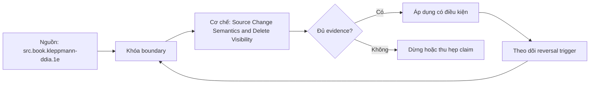

# Source Change Semantics and Delete Visibility

> [!abstract] Câu hỏi trung tâm
> Chứng minh insert, update, hard delete và soft delete semantics của từng entity bằng thực nghiệm thế nào?

## 1. Change là per entity

Một source có thể append-only cho events nhưng mutable cho customers và soft-delete cho orders. Không gán semantics toàn database/API. Với mỗi entity ghi operation set, key, ordering, before/after availability, delete representation, restore và retention. Documentation là hypothesis; behavior probe và log/snapshot evidence xác nhận.

## 2. Insert và update

Insert tạo key mới theo source identity; duplicate delivery không nhất thiết duplicate source row. Update có thể replace full row, patch fields, append new version hoặc emit before/after. CDC SQL Server minh họa update bằng two change rows với commit LSN/sequence. Timestamp column chỉ reliable nếu every relevant mutation updates it atomically and resolution/tie semantics đủ.

## 3. Hard delete

Hard-deleted row biến mất khỏi current snapshot nên two-snapshot diff có thể phát hiện key loss only when snapshots cover same universe and boundary. Timestamp query trên live table thường không thấy deletion. Log CDC/tombstone/audit feed hoặc periodic full reconciliation needed. Retention expiry can erase delete evidence; extraction checkpoint must remain within source validity interval.

## 4. Soft delete và restore

Soft delete is an update to marker/status/date, nhưng marker values and filtering can vary. Downstream needs whether retain row, mask, exclude current view or propagate erasure. Restore may clear marker or create new identity. Treating soft delete as hard delete can lose audit; ignoring it leaves stale active records. Fixture includes delete, restore and repeated delivery.

## 5. Experimental probes

Take consistent snapshots S0/S1 around controlled insert/update/delete/restore where allowed, or use synthetic environment. Compare key sets and per-field hashes; inspect audit/CDC/API outputs and ordering tokens. Verify documentation against observation. For uncontrolled real source, observe naturally occurring cases without mutation and label confidence/coverage.

## 6. Technical consequences

Append-only supports checkpointed sequence; mutable snapshot may need overlap+dedup/upsert; hard deletes need tombstones/log/full diff; late corrections require lookback or CDC; no stable key may require content identity and manual exceptions. Each conclusion maps to extraction pattern, landing metadata, reconciliation and recovery. One contradicted assumption blocks rollout or imposes explicit bounded degradation.

## 7. Ma trận kiểm chứng từng mệnh đề

Mỗi claim phải gắn source/entity boundary, exact fixture, checkpoint/input state, counterexample và independent reconciliation oracle. Connector chạy thành công hoặc API trả 2xx chưa chứng minh completeness.

### 7.1. Change-semantics probe 1: entity, operation, boundary, evidence stream và downstream consequence phải nối được

**Mệnh đề cần kiểm.** Change-semantics probe 1: entity, operation, boundary, evidence stream và downstream consequence phải nối được.

**Thiết kế phép thử cho `wiki.ingestion.source-change-semantics-delete-visibility`.** Khóa source/API version, entity, grain/key, time boundary, schema, pagination/cursor configuration và failure schedule. Tạo positive, boundary và negative fixtures; thay đổi đúng một assumption. Lưu request/query, response/raw extract hash, checkpoint trước/sau, landing objects, target state và source-at-boundary oracle.

**Điều kiện chấp nhận cho `wiki.ingestion.source-change-semantics-delete-visibility`.** Count, key set, typed field hash và delete state khớp contract; duplicates được giải thích và dedup có identity rõ. Observation, inference và unknown được báo riêng. Lab chưa chạy chỉ là protocol.

### 7.2. Change-semantics probe 2: entity, operation, boundary, evidence stream và downstream consequence phải nối được

**Mệnh đề cần kiểm.** Change-semantics probe 2: entity, operation, boundary, evidence stream và downstream consequence phải nối được.

**Thiết kế phép thử cho `wiki.ingestion.source-change-semantics-delete-visibility`.** Khóa source/API version, entity, grain/key, time boundary, schema, pagination/cursor configuration và failure schedule. Tạo positive, boundary và negative fixtures; thay đổi đúng một assumption. Lưu request/query, response/raw extract hash, checkpoint trước/sau, landing objects, target state và source-at-boundary oracle.

**Điều kiện chấp nhận cho `wiki.ingestion.source-change-semantics-delete-visibility`.** Count, key set, typed field hash và delete state khớp contract; duplicates được giải thích và dedup có identity rõ. Observation, inference và unknown được báo riêng. Lab chưa chạy chỉ là protocol.

### 7.3. Change-semantics probe 3: entity, operation, boundary, evidence stream và downstream consequence phải nối được

**Mệnh đề cần kiểm.** Change-semantics probe 3: entity, operation, boundary, evidence stream và downstream consequence phải nối được.

**Thiết kế phép thử cho `wiki.ingestion.source-change-semantics-delete-visibility`.** Khóa source/API version, entity, grain/key, time boundary, schema, pagination/cursor configuration và failure schedule. Tạo positive, boundary và negative fixtures; thay đổi đúng một assumption. Lưu request/query, response/raw extract hash, checkpoint trước/sau, landing objects, target state và source-at-boundary oracle.

**Điều kiện chấp nhận cho `wiki.ingestion.source-change-semantics-delete-visibility`.** Count, key set, typed field hash và delete state khớp contract; duplicates được giải thích và dedup có identity rõ. Observation, inference và unknown được báo riêng. Lab chưa chạy chỉ là protocol.

### 7.4. Change-semantics probe 4: entity, operation, boundary, evidence stream và downstream consequence phải nối được

**Mệnh đề cần kiểm.** Change-semantics probe 4: entity, operation, boundary, evidence stream và downstream consequence phải nối được.

**Thiết kế phép thử cho `wiki.ingestion.source-change-semantics-delete-visibility`.** Khóa source/API version, entity, grain/key, time boundary, schema, pagination/cursor configuration và failure schedule. Tạo positive, boundary và negative fixtures; thay đổi đúng một assumption. Lưu request/query, response/raw extract hash, checkpoint trước/sau, landing objects, target state và source-at-boundary oracle.

**Điều kiện chấp nhận cho `wiki.ingestion.source-change-semantics-delete-visibility`.** Count, key set, typed field hash và delete state khớp contract; duplicates được giải thích và dedup có identity rõ. Observation, inference và unknown được báo riêng. Lab chưa chạy chỉ là protocol.

### 7.5. Change-semantics probe 5: entity, operation, boundary, evidence stream và downstream consequence phải nối được

**Mệnh đề cần kiểm.** Change-semantics probe 5: entity, operation, boundary, evidence stream và downstream consequence phải nối được.

**Thiết kế phép thử cho `wiki.ingestion.source-change-semantics-delete-visibility`.** Khóa source/API version, entity, grain/key, time boundary, schema, pagination/cursor configuration và failure schedule. Tạo positive, boundary và negative fixtures; thay đổi đúng một assumption. Lưu request/query, response/raw extract hash, checkpoint trước/sau, landing objects, target state và source-at-boundary oracle.

**Điều kiện chấp nhận cho `wiki.ingestion.source-change-semantics-delete-visibility`.** Count, key set, typed field hash và delete state khớp contract; duplicates được giải thích và dedup có identity rõ. Observation, inference và unknown được báo riêng. Lab chưa chạy chỉ là protocol.

### 7.6. Change-semantics probe 6: entity, operation, boundary, evidence stream và downstream consequence phải nối được

**Mệnh đề cần kiểm.** Change-semantics probe 6: entity, operation, boundary, evidence stream và downstream consequence phải nối được.

**Thiết kế phép thử cho `wiki.ingestion.source-change-semantics-delete-visibility`.** Khóa source/API version, entity, grain/key, time boundary, schema, pagination/cursor configuration và failure schedule. Tạo positive, boundary và negative fixtures; thay đổi đúng một assumption. Lưu request/query, response/raw extract hash, checkpoint trước/sau, landing objects, target state và source-at-boundary oracle.

**Điều kiện chấp nhận cho `wiki.ingestion.source-change-semantics-delete-visibility`.** Count, key set, typed field hash và delete state khớp contract; duplicates được giải thích và dedup có identity rõ. Observation, inference và unknown được báo riêng. Lab chưa chạy chỉ là protocol.

### 7.7. Change-semantics probe 7: entity, operation, boundary, evidence stream và downstream consequence phải nối được

**Mệnh đề cần kiểm.** Change-semantics probe 7: entity, operation, boundary, evidence stream và downstream consequence phải nối được.

**Thiết kế phép thử cho `wiki.ingestion.source-change-semantics-delete-visibility`.** Khóa source/API version, entity, grain/key, time boundary, schema, pagination/cursor configuration và failure schedule. Tạo positive, boundary và negative fixtures; thay đổi đúng một assumption. Lưu request/query, response/raw extract hash, checkpoint trước/sau, landing objects, target state và source-at-boundary oracle.

**Điều kiện chấp nhận cho `wiki.ingestion.source-change-semantics-delete-visibility`.** Count, key set, typed field hash và delete state khớp contract; duplicates được giải thích và dedup có identity rõ. Observation, inference và unknown được báo riêng. Lab chưa chạy chỉ là protocol.

### 7.8. Change-semantics probe 8: entity, operation, boundary, evidence stream và downstream consequence phải nối được

**Mệnh đề cần kiểm.** Change-semantics probe 8: entity, operation, boundary, evidence stream và downstream consequence phải nối được.

**Thiết kế phép thử cho `wiki.ingestion.source-change-semantics-delete-visibility`.** Khóa source/API version, entity, grain/key, time boundary, schema, pagination/cursor configuration và failure schedule. Tạo positive, boundary và negative fixtures; thay đổi đúng một assumption. Lưu request/query, response/raw extract hash, checkpoint trước/sau, landing objects, target state và source-at-boundary oracle.

**Điều kiện chấp nhận cho `wiki.ingestion.source-change-semantics-delete-visibility`.** Count, key set, typed field hash và delete state khớp contract; duplicates được giải thích và dedup có identity rõ. Observation, inference và unknown được báo riêng. Lab chưa chạy chỉ là protocol.

### 7.9. Change-semantics probe 9: entity, operation, boundary, evidence stream và downstream consequence phải nối được

**Mệnh đề cần kiểm.** Change-semantics probe 9: entity, operation, boundary, evidence stream và downstream consequence phải nối được.

**Thiết kế phép thử cho `wiki.ingestion.source-change-semantics-delete-visibility`.** Khóa source/API version, entity, grain/key, time boundary, schema, pagination/cursor configuration và failure schedule. Tạo positive, boundary và negative fixtures; thay đổi đúng một assumption. Lưu request/query, response/raw extract hash, checkpoint trước/sau, landing objects, target state và source-at-boundary oracle.

**Điều kiện chấp nhận cho `wiki.ingestion.source-change-semantics-delete-visibility`.** Count, key set, typed field hash và delete state khớp contract; duplicates được giải thích và dedup có identity rõ. Observation, inference và unknown được báo riêng. Lab chưa chạy chỉ là protocol.

### 7.10. Change-semantics probe 10: entity, operation, boundary, evidence stream và downstream consequence phải nối được

**Mệnh đề cần kiểm.** Change-semantics probe 10: entity, operation, boundary, evidence stream và downstream consequence phải nối được.

**Thiết kế phép thử cho `wiki.ingestion.source-change-semantics-delete-visibility`.** Khóa source/API version, entity, grain/key, time boundary, schema, pagination/cursor configuration và failure schedule. Tạo positive, boundary và negative fixtures; thay đổi đúng một assumption. Lưu request/query, response/raw extract hash, checkpoint trước/sau, landing objects, target state và source-at-boundary oracle.

**Điều kiện chấp nhận cho `wiki.ingestion.source-change-semantics-delete-visibility`.** Count, key set, typed field hash và delete state khớp contract; duplicates được giải thích và dedup có identity rõ. Observation, inference và unknown được báo riêng. Lab chưa chạy chỉ là protocol.

### 7.11. Change-semantics probe 11: entity, operation, boundary, evidence stream và downstream consequence phải nối được

**Mệnh đề cần kiểm.** Change-semantics probe 11: entity, operation, boundary, evidence stream và downstream consequence phải nối được.

**Thiết kế phép thử cho `wiki.ingestion.source-change-semantics-delete-visibility`.** Khóa source/API version, entity, grain/key, time boundary, schema, pagination/cursor configuration và failure schedule. Tạo positive, boundary và negative fixtures; thay đổi đúng một assumption. Lưu request/query, response/raw extract hash, checkpoint trước/sau, landing objects, target state và source-at-boundary oracle.

**Điều kiện chấp nhận cho `wiki.ingestion.source-change-semantics-delete-visibility`.** Count, key set, typed field hash và delete state khớp contract; duplicates được giải thích và dedup có identity rõ. Observation, inference và unknown được báo riêng. Lab chưa chạy chỉ là protocol.

### 7.12. Change-semantics probe 12: entity, operation, boundary, evidence stream và downstream consequence phải nối được

**Mệnh đề cần kiểm.** Change-semantics probe 12: entity, operation, boundary, evidence stream và downstream consequence phải nối được.

**Thiết kế phép thử cho `wiki.ingestion.source-change-semantics-delete-visibility`.** Khóa source/API version, entity, grain/key, time boundary, schema, pagination/cursor configuration và failure schedule. Tạo positive, boundary và negative fixtures; thay đổi đúng một assumption. Lưu request/query, response/raw extract hash, checkpoint trước/sau, landing objects, target state và source-at-boundary oracle.

**Điều kiện chấp nhận cho `wiki.ingestion.source-change-semantics-delete-visibility`.** Count, key set, typed field hash và delete state khớp contract; duplicates được giải thích và dedup có identity rõ. Observation, inference và unknown được báo riêng. Lab chưa chạy chỉ là protocol.

### 7.13. Change-semantics probe 13: entity, operation, boundary, evidence stream và downstream consequence phải nối được

**Mệnh đề cần kiểm.** Change-semantics probe 13: entity, operation, boundary, evidence stream và downstream consequence phải nối được.

**Thiết kế phép thử cho `wiki.ingestion.source-change-semantics-delete-visibility`.** Khóa source/API version, entity, grain/key, time boundary, schema, pagination/cursor configuration và failure schedule. Tạo positive, boundary và negative fixtures; thay đổi đúng một assumption. Lưu request/query, response/raw extract hash, checkpoint trước/sau, landing objects, target state và source-at-boundary oracle.

**Điều kiện chấp nhận cho `wiki.ingestion.source-change-semantics-delete-visibility`.** Count, key set, typed field hash và delete state khớp contract; duplicates được giải thích và dedup có identity rõ. Observation, inference và unknown được báo riêng. Lab chưa chạy chỉ là protocol.

### 7.14. Change-semantics probe 14: entity, operation, boundary, evidence stream và downstream consequence phải nối được

**Mệnh đề cần kiểm.** Change-semantics probe 14: entity, operation, boundary, evidence stream và downstream consequence phải nối được.

**Thiết kế phép thử cho `wiki.ingestion.source-change-semantics-delete-visibility`.** Khóa source/API version, entity, grain/key, time boundary, schema, pagination/cursor configuration và failure schedule. Tạo positive, boundary và negative fixtures; thay đổi đúng một assumption. Lưu request/query, response/raw extract hash, checkpoint trước/sau, landing objects, target state và source-at-boundary oracle.

**Điều kiện chấp nhận cho `wiki.ingestion.source-change-semantics-delete-visibility`.** Count, key set, typed field hash và delete state khớp contract; duplicates được giải thích và dedup có identity rõ. Observation, inference và unknown được báo riêng. Lab chưa chạy chỉ là protocol.

### 7.15. Change-semantics probe 15: entity, operation, boundary, evidence stream và downstream consequence phải nối được

**Mệnh đề cần kiểm.** Change-semantics probe 15: entity, operation, boundary, evidence stream và downstream consequence phải nối được.

**Thiết kế phép thử cho `wiki.ingestion.source-change-semantics-delete-visibility`.** Khóa source/API version, entity, grain/key, time boundary, schema, pagination/cursor configuration và failure schedule. Tạo positive, boundary và negative fixtures; thay đổi đúng một assumption. Lưu request/query, response/raw extract hash, checkpoint trước/sau, landing objects, target state và source-at-boundary oracle.

**Điều kiện chấp nhận cho `wiki.ingestion.source-change-semantics-delete-visibility`.** Count, key set, typed field hash và delete state khớp contract; duplicates được giải thích và dedup có identity rõ. Observation, inference và unknown được báo riêng. Lab chưa chạy chỉ là protocol.

## 8. Quy trình phản biện

1. Chốt entity, grain, identity và immutable boundary.
2. Tách source fact, documentation claim và observed behavior.
3. Viết delete, retry, checkpoint và replay semantics trước code.
4. Dùng key/typed-hash reconciliation, không chỉ row count.
5. Pin version, retention, timezone, ordering và rate limits.
6. Ghi assumption bị falsify và extraction pattern thay thế.

## 9. Câu hỏi tự kiểm tra

1. Source thay đổi row/entity theo những operation nào?
2. Boundary nào định nghĩa complete?
3. Delete có xuất hiện trong interface không?
4. Cursor/order có total và immutable không?
5. Crash ở checkpoint boundary gây replay hay gap?
6. Bằng chứng nào chưa được chạy?

## 10. Giới hạn và điều chưa cho phép kết luận

- Chưa chạy mutation/pagination/watermark lab trên source thật.
- Product behavior phải pin version, retention và configuration.
- Decision matrices và failure protocols là synthesis của giáo trình.
- Note giữ trạng thái `review` tới khi chủ dự án duyệt.

## Reference
1. [[SRC-KLEPPMANN-DDIA-1E]]
2. [[SRC-MICROSOFT-SQL-SERVER-CDC]]
3. [[SRC-REIS-HOUSLEY-FUNDAMENTALS-DATA-ENGINEERING]]

## Source coverage

| Source slice | Nội dung sử dụng | Trạng thái |
|---|---|---|
| [[SRC-KLEPPMANN-DDIA-1E]] | Source/change/API contract hoặc engineering context | Đã đọc locator; không suy ngoài phạm vi |
| [[SRC-MICROSOFT-SQL-SERVER-CDC]] | Source/change/API contract hoặc engineering context | Đã đọc locator; không suy ngoài phạm vi |
| [[SRC-REIS-HOUSLEY-FUNDAMENTALS-DATA-ENGINEERING]] | Source/change/API contract hoặc engineering context | Đã đọc locator; không suy ngoài phạm vi |

## Key takeaways
- Extraction pattern chỉ đúng khi source assumptions đúng.
- Completeness cần immutable boundary và reconciliation oracle.
- Retry/checkpoint ưu tiên replay có kiểm soát hơn silent gap.
- Connector không chuyển giao ownership về tính đúng.

<!-- ATOMIC-EXECUTION-CAPSULE:START -->

## Execution capsule: kiểm chứng `wiki.ingestion.source-change-semantics-delete-visibility`

> [!important] Phân loại mệnh đề
> Với `wiki.ingestion.source-change-semantics-delete-visibility`, sơ đồ, ví dụ và artifact về **Source Change Semantics and Delete Visibility** là **synthesis để kiểm chứng**; chúng không phải trích dẫn hay case nguyên văn của nguồn.

### Sơ đồ cơ chế và điểm kiểm soát



Đọc sơ đồ `wiki.ingestion.source-change-semantics-delete-visibility` từ trái sang phải: source chỉ cung cấp claim ban đầu cho **Source Change Semantics and Delete Visibility**; quyết định chỉ được đi tiếp sau khi boundary, evidence và điều kiện đảo quyết định đã hiện hữu.

### Ví dụ làm việc có thể bác bỏ

**Input.** Một đội cần trả lời: Chứng minh insert, update, hard delete và soft delete semantics của từng entity bằng thực nghiệm thế nào? cho một phạm vi nhỏ, có owner và deadline rõ.

**Decision.** Đội áp dụng **Source Change Semantics and Delete Visibility** trên control và variant chỉ khác một assumption; expected result và hard constraints được khóa trước khi chạy.

**Outcome.** Với `wiki.ingestion.source-change-semantics-delete-visibility`, nếu observation vi phạm hard constraint hoặc oracle độc lập không xác nhận **Source Change Semantics and Delete Visibility**, đội thu hẹp claim hay đảo quyết định. Nếu đạt, kết luận vẫn kèm scope, version và review date; một lần thành công không được nâng thành quy luật phổ quát.

### Artifact thực thi tối thiểu

```sql
-- Verification harness for: Source Change Semantics and Delete Visibility
WITH evidence AS (
    SELECT 'wiki.ingestion.source-change-semantics-delete-visibility' AS concept_id,
           'boundary_declared' AS check_name, 1 AS passed
    UNION ALL
    SELECT 'wiki.ingestion.source-change-semantics-delete-visibility', 'independent_oracle', 1
    UNION ALL
    SELECT 'wiki.ingestion.source-change-semantics-delete-visibility', 'reversal_trigger_recorded', 1
)
SELECT concept_id,
       MIN(passed) AS all_hard_checks_pass,
       COUNT(*) AS evidence_items
FROM evidence
GROUP BY concept_id
HAVING MIN(passed) = 1;
```

Artifact của `wiki.ingestion.source-change-semantics-delete-visibility` buộc người dùng ghi boundary, oracle và reversal trigger cho **Source Change Semantics and Delete Visibility**. Các giá trị minh họa phải được thay bằng evidence thật trước khi dùng cho quyết định.

### Tự kiểm tra trước khi tái sử dụng

1. Bạn có thể trả lời `Chứng minh insert, update, hard delete và soft delete semantics của từng entity bằng thực nghiệm thế nào?` bằng một câu mà không kéo thêm concept thứ hai không?
2. Source locator nào đỡ cho claim, và phần nào chỉ là synthesis trong note?
3. Observation nào khiến bạn dừng, thu hẹp hoặc đảo quyết định?
4. Artifact nào cho phép một reviewer độc lập tái hiện kết quả?

<!-- ATOMIC-EXECUTION-CAPSULE:END -->
