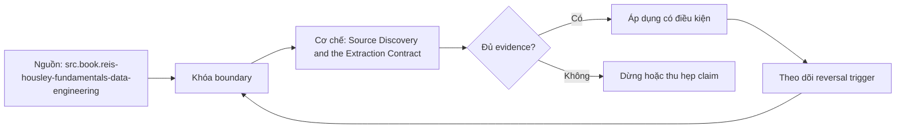

# Source Discovery and the Extraction Contract

> [!abstract] Câu hỏi trung tâm
> Một hợp đồng trích xuất cần trả lời gì trước khi chọn connector hoặc viết pipeline?

## 1. Tám nhóm bắt buộc

Hợp đồng gồm: owner/access; entities/grain/keys; schema/types/nullable semantics; change semantics; extraction interface and ordering; volume/rate/latency; quality/reconciliation; security/retention/deletion. Mỗi nhóm ghi source fact, evidence locator, verified date, unknown và owner. Tên endpoint hoặc bảng chưa phải contract. Một ô trống phải dẫn tới failure hypothesis cụ thể để ưu tiên discovery.

## 2. Owner và access boundary

Ghi system owner, business owner, read account, scopes, environments, network path, credential rotation và support/escalation. “Có quyền đọc” không chứng minh được consistent snapshot, log retention hoặc API historical access. Least privilege và production load budget là constraints. Secret value không nằm trong note; chỉ lưu secret reference và rotation procedure.

## 3. Entity grain và identity

Mỗi stream/table nêu một record đại diện gì, natural/technical key, key stability, duplicate policy, parent-child cardinality và ordering. API object ID có thể tái sử dụng hoặc scoped theo tenant. Composite keys và mutable identifiers cần fixture. Grain sai làm dedup/upsert/reconciliation vô nghĩa dù pipeline chạy xanh.

## 4. Change và time contract

Xác định insert, in-place update, backdated correction, hard delete, soft delete, restore, merge/split và schema change. Phân biệt event time, source commit time, updated_at và extraction time. Cursor phải có ordering, granularity, tie rule, timezone, mutability và retention. Unknown được dò bằng repeated snapshots/change logs, không đoán từ column name.

## 5. Capacity và quality

Đo rows/bytes distribution theo ngày/hour, peak, max record, pagination, rate limits, source query budget và expected latency. Dò sentinel values bằng full or statistically justified profile: null tokens, zero dates, magic IDs, truncation, invalid enum. Reconciliation thiết kế trước extraction: count, key set, aggregates và canonical hash at immutable boundary.

## 6. Discovery deliverable

Nộp contract versioned cùng evidence: docs locator, schema dump, sample hashes, profile queries/results, permission test và open questions. ≥6/8 groups cụ thể chưa đủ production approval; remaining unknowns có owner/deadline/containment. Chọn one representative entity để dry-run snapshot and rerun. Contract changes trigger compatibility and backfill assessment.

## 7. Ma trận kiểm chứng từng mệnh đề

Mỗi claim phải gắn source/entity boundary, exact fixture, checkpoint/input state, counterexample và independent reconciliation oracle. Connector chạy thành công hoặc API trả 2xx chưa chứng minh completeness.

### 7.1. Extraction-contract probe 1: evidence, unknown, failure mode, owner và verification test phải đủ

**Mệnh đề cần kiểm.** Extraction-contract probe 1: evidence, unknown, failure mode, owner và verification test phải đủ.

**Thiết kế phép thử cho `wiki.ingestion.source-discovery-extraction-contract`.** Khóa source/API version, entity, grain/key, time boundary, schema, pagination/cursor configuration và failure schedule. Tạo positive, boundary và negative fixtures; thay đổi đúng một assumption. Lưu request/query, response/raw extract hash, checkpoint trước/sau, landing objects, target state và source-at-boundary oracle.

**Điều kiện chấp nhận cho `wiki.ingestion.source-discovery-extraction-contract`.** Count, key set, typed field hash và delete state khớp contract; duplicates được giải thích và dedup có identity rõ. Observation, inference và unknown được báo riêng. Lab chưa chạy chỉ là protocol.

### 7.2. Extraction-contract probe 2: evidence, unknown, failure mode, owner và verification test phải đủ

**Mệnh đề cần kiểm.** Extraction-contract probe 2: evidence, unknown, failure mode, owner và verification test phải đủ.

**Thiết kế phép thử cho `wiki.ingestion.source-discovery-extraction-contract`.** Khóa source/API version, entity, grain/key, time boundary, schema, pagination/cursor configuration và failure schedule. Tạo positive, boundary và negative fixtures; thay đổi đúng một assumption. Lưu request/query, response/raw extract hash, checkpoint trước/sau, landing objects, target state và source-at-boundary oracle.

**Điều kiện chấp nhận cho `wiki.ingestion.source-discovery-extraction-contract`.** Count, key set, typed field hash và delete state khớp contract; duplicates được giải thích và dedup có identity rõ. Observation, inference và unknown được báo riêng. Lab chưa chạy chỉ là protocol.

### 7.3. Extraction-contract probe 3: evidence, unknown, failure mode, owner và verification test phải đủ

**Mệnh đề cần kiểm.** Extraction-contract probe 3: evidence, unknown, failure mode, owner và verification test phải đủ.

**Thiết kế phép thử cho `wiki.ingestion.source-discovery-extraction-contract`.** Khóa source/API version, entity, grain/key, time boundary, schema, pagination/cursor configuration và failure schedule. Tạo positive, boundary và negative fixtures; thay đổi đúng một assumption. Lưu request/query, response/raw extract hash, checkpoint trước/sau, landing objects, target state và source-at-boundary oracle.

**Điều kiện chấp nhận cho `wiki.ingestion.source-discovery-extraction-contract`.** Count, key set, typed field hash và delete state khớp contract; duplicates được giải thích và dedup có identity rõ. Observation, inference và unknown được báo riêng. Lab chưa chạy chỉ là protocol.

### 7.4. Extraction-contract probe 4: evidence, unknown, failure mode, owner và verification test phải đủ

**Mệnh đề cần kiểm.** Extraction-contract probe 4: evidence, unknown, failure mode, owner và verification test phải đủ.

**Thiết kế phép thử cho `wiki.ingestion.source-discovery-extraction-contract`.** Khóa source/API version, entity, grain/key, time boundary, schema, pagination/cursor configuration và failure schedule. Tạo positive, boundary và negative fixtures; thay đổi đúng một assumption. Lưu request/query, response/raw extract hash, checkpoint trước/sau, landing objects, target state và source-at-boundary oracle.

**Điều kiện chấp nhận cho `wiki.ingestion.source-discovery-extraction-contract`.** Count, key set, typed field hash và delete state khớp contract; duplicates được giải thích và dedup có identity rõ. Observation, inference và unknown được báo riêng. Lab chưa chạy chỉ là protocol.

### 7.5. Extraction-contract probe 5: evidence, unknown, failure mode, owner và verification test phải đủ

**Mệnh đề cần kiểm.** Extraction-contract probe 5: evidence, unknown, failure mode, owner và verification test phải đủ.

**Thiết kế phép thử cho `wiki.ingestion.source-discovery-extraction-contract`.** Khóa source/API version, entity, grain/key, time boundary, schema, pagination/cursor configuration và failure schedule. Tạo positive, boundary và negative fixtures; thay đổi đúng một assumption. Lưu request/query, response/raw extract hash, checkpoint trước/sau, landing objects, target state và source-at-boundary oracle.

**Điều kiện chấp nhận cho `wiki.ingestion.source-discovery-extraction-contract`.** Count, key set, typed field hash và delete state khớp contract; duplicates được giải thích và dedup có identity rõ. Observation, inference và unknown được báo riêng. Lab chưa chạy chỉ là protocol.

### 7.6. Extraction-contract probe 6: evidence, unknown, failure mode, owner và verification test phải đủ

**Mệnh đề cần kiểm.** Extraction-contract probe 6: evidence, unknown, failure mode, owner và verification test phải đủ.

**Thiết kế phép thử cho `wiki.ingestion.source-discovery-extraction-contract`.** Khóa source/API version, entity, grain/key, time boundary, schema, pagination/cursor configuration và failure schedule. Tạo positive, boundary và negative fixtures; thay đổi đúng một assumption. Lưu request/query, response/raw extract hash, checkpoint trước/sau, landing objects, target state và source-at-boundary oracle.

**Điều kiện chấp nhận cho `wiki.ingestion.source-discovery-extraction-contract`.** Count, key set, typed field hash và delete state khớp contract; duplicates được giải thích và dedup có identity rõ. Observation, inference và unknown được báo riêng. Lab chưa chạy chỉ là protocol.

### 7.7. Extraction-contract probe 7: evidence, unknown, failure mode, owner và verification test phải đủ

**Mệnh đề cần kiểm.** Extraction-contract probe 7: evidence, unknown, failure mode, owner và verification test phải đủ.

**Thiết kế phép thử cho `wiki.ingestion.source-discovery-extraction-contract`.** Khóa source/API version, entity, grain/key, time boundary, schema, pagination/cursor configuration và failure schedule. Tạo positive, boundary và negative fixtures; thay đổi đúng một assumption. Lưu request/query, response/raw extract hash, checkpoint trước/sau, landing objects, target state và source-at-boundary oracle.

**Điều kiện chấp nhận cho `wiki.ingestion.source-discovery-extraction-contract`.** Count, key set, typed field hash và delete state khớp contract; duplicates được giải thích và dedup có identity rõ. Observation, inference và unknown được báo riêng. Lab chưa chạy chỉ là protocol.

### 7.8. Extraction-contract probe 8: evidence, unknown, failure mode, owner và verification test phải đủ

**Mệnh đề cần kiểm.** Extraction-contract probe 8: evidence, unknown, failure mode, owner và verification test phải đủ.

**Thiết kế phép thử cho `wiki.ingestion.source-discovery-extraction-contract`.** Khóa source/API version, entity, grain/key, time boundary, schema, pagination/cursor configuration và failure schedule. Tạo positive, boundary và negative fixtures; thay đổi đúng một assumption. Lưu request/query, response/raw extract hash, checkpoint trước/sau, landing objects, target state và source-at-boundary oracle.

**Điều kiện chấp nhận cho `wiki.ingestion.source-discovery-extraction-contract`.** Count, key set, typed field hash và delete state khớp contract; duplicates được giải thích và dedup có identity rõ. Observation, inference và unknown được báo riêng. Lab chưa chạy chỉ là protocol.

### 7.9. Extraction-contract probe 9: evidence, unknown, failure mode, owner và verification test phải đủ

**Mệnh đề cần kiểm.** Extraction-contract probe 9: evidence, unknown, failure mode, owner và verification test phải đủ.

**Thiết kế phép thử cho `wiki.ingestion.source-discovery-extraction-contract`.** Khóa source/API version, entity, grain/key, time boundary, schema, pagination/cursor configuration và failure schedule. Tạo positive, boundary và negative fixtures; thay đổi đúng một assumption. Lưu request/query, response/raw extract hash, checkpoint trước/sau, landing objects, target state và source-at-boundary oracle.

**Điều kiện chấp nhận cho `wiki.ingestion.source-discovery-extraction-contract`.** Count, key set, typed field hash và delete state khớp contract; duplicates được giải thích và dedup có identity rõ. Observation, inference và unknown được báo riêng. Lab chưa chạy chỉ là protocol.

### 7.10. Extraction-contract probe 10: evidence, unknown, failure mode, owner và verification test phải đủ

**Mệnh đề cần kiểm.** Extraction-contract probe 10: evidence, unknown, failure mode, owner và verification test phải đủ.

**Thiết kế phép thử cho `wiki.ingestion.source-discovery-extraction-contract`.** Khóa source/API version, entity, grain/key, time boundary, schema, pagination/cursor configuration và failure schedule. Tạo positive, boundary và negative fixtures; thay đổi đúng một assumption. Lưu request/query, response/raw extract hash, checkpoint trước/sau, landing objects, target state và source-at-boundary oracle.

**Điều kiện chấp nhận cho `wiki.ingestion.source-discovery-extraction-contract`.** Count, key set, typed field hash và delete state khớp contract; duplicates được giải thích và dedup có identity rõ. Observation, inference và unknown được báo riêng. Lab chưa chạy chỉ là protocol.

### 7.11. Extraction-contract probe 11: evidence, unknown, failure mode, owner và verification test phải đủ

**Mệnh đề cần kiểm.** Extraction-contract probe 11: evidence, unknown, failure mode, owner và verification test phải đủ.

**Thiết kế phép thử cho `wiki.ingestion.source-discovery-extraction-contract`.** Khóa source/API version, entity, grain/key, time boundary, schema, pagination/cursor configuration và failure schedule. Tạo positive, boundary và negative fixtures; thay đổi đúng một assumption. Lưu request/query, response/raw extract hash, checkpoint trước/sau, landing objects, target state và source-at-boundary oracle.

**Điều kiện chấp nhận cho `wiki.ingestion.source-discovery-extraction-contract`.** Count, key set, typed field hash và delete state khớp contract; duplicates được giải thích và dedup có identity rõ. Observation, inference và unknown được báo riêng. Lab chưa chạy chỉ là protocol.

### 7.12. Extraction-contract probe 12: evidence, unknown, failure mode, owner và verification test phải đủ

**Mệnh đề cần kiểm.** Extraction-contract probe 12: evidence, unknown, failure mode, owner và verification test phải đủ.

**Thiết kế phép thử cho `wiki.ingestion.source-discovery-extraction-contract`.** Khóa source/API version, entity, grain/key, time boundary, schema, pagination/cursor configuration và failure schedule. Tạo positive, boundary và negative fixtures; thay đổi đúng một assumption. Lưu request/query, response/raw extract hash, checkpoint trước/sau, landing objects, target state và source-at-boundary oracle.

**Điều kiện chấp nhận cho `wiki.ingestion.source-discovery-extraction-contract`.** Count, key set, typed field hash và delete state khớp contract; duplicates được giải thích và dedup có identity rõ. Observation, inference và unknown được báo riêng. Lab chưa chạy chỉ là protocol.

### 7.13. Extraction-contract probe 13: evidence, unknown, failure mode, owner và verification test phải đủ

**Mệnh đề cần kiểm.** Extraction-contract probe 13: evidence, unknown, failure mode, owner và verification test phải đủ.

**Thiết kế phép thử cho `wiki.ingestion.source-discovery-extraction-contract`.** Khóa source/API version, entity, grain/key, time boundary, schema, pagination/cursor configuration và failure schedule. Tạo positive, boundary và negative fixtures; thay đổi đúng một assumption. Lưu request/query, response/raw extract hash, checkpoint trước/sau, landing objects, target state và source-at-boundary oracle.

**Điều kiện chấp nhận cho `wiki.ingestion.source-discovery-extraction-contract`.** Count, key set, typed field hash và delete state khớp contract; duplicates được giải thích và dedup có identity rõ. Observation, inference và unknown được báo riêng. Lab chưa chạy chỉ là protocol.

### 7.14. Extraction-contract probe 14: evidence, unknown, failure mode, owner và verification test phải đủ

**Mệnh đề cần kiểm.** Extraction-contract probe 14: evidence, unknown, failure mode, owner và verification test phải đủ.

**Thiết kế phép thử cho `wiki.ingestion.source-discovery-extraction-contract`.** Khóa source/API version, entity, grain/key, time boundary, schema, pagination/cursor configuration và failure schedule. Tạo positive, boundary và negative fixtures; thay đổi đúng một assumption. Lưu request/query, response/raw extract hash, checkpoint trước/sau, landing objects, target state và source-at-boundary oracle.

**Điều kiện chấp nhận cho `wiki.ingestion.source-discovery-extraction-contract`.** Count, key set, typed field hash và delete state khớp contract; duplicates được giải thích và dedup có identity rõ. Observation, inference và unknown được báo riêng. Lab chưa chạy chỉ là protocol.

### 7.15. Extraction-contract probe 15: evidence, unknown, failure mode, owner và verification test phải đủ

**Mệnh đề cần kiểm.** Extraction-contract probe 15: evidence, unknown, failure mode, owner và verification test phải đủ.

**Thiết kế phép thử cho `wiki.ingestion.source-discovery-extraction-contract`.** Khóa source/API version, entity, grain/key, time boundary, schema, pagination/cursor configuration và failure schedule. Tạo positive, boundary và negative fixtures; thay đổi đúng một assumption. Lưu request/query, response/raw extract hash, checkpoint trước/sau, landing objects, target state và source-at-boundary oracle.

**Điều kiện chấp nhận cho `wiki.ingestion.source-discovery-extraction-contract`.** Count, key set, typed field hash và delete state khớp contract; duplicates được giải thích và dedup có identity rõ. Observation, inference và unknown được báo riêng. Lab chưa chạy chỉ là protocol.

## 8. Quy trình phản biện

1. Chốt entity, grain, identity và immutable boundary.
2. Tách source fact, documentation claim và observed behavior.
3. Viết delete, retry, checkpoint và replay semantics trước code.
4. Dùng key/typed-hash reconciliation, không chỉ row count.
5. Pin version, retention, timezone, ordering và rate limits.
6. Ghi assumption bị falsify và extraction pattern thay thế.

## 9. Câu hỏi tự kiểm tra

1. Source thay đổi row/entity theo những operation nào?
2. Boundary nào định nghĩa complete?
3. Delete có xuất hiện trong interface không?
4. Cursor/order có total và immutable không?
5. Crash ở checkpoint boundary gây replay hay gap?
6. Bằng chứng nào chưa được chạy?

## 10. Giới hạn và điều chưa cho phép kết luận

- Chưa chạy mutation/pagination/watermark lab trên source thật.
- Product behavior phải pin version, retention và configuration.
- Decision matrices và failure protocols là synthesis của giáo trình.
- Note giữ trạng thái `review` tới khi chủ dự án duyệt.

## Reference
1. [[SRC-REIS-HOUSLEY-FUNDAMENTALS-DATA-ENGINEERING]]
2. [[SRC-KLEPPMANN-DDIA-1E]]

## Source coverage

| Source slice | Nội dung sử dụng | Trạng thái |
|---|---|---|
| [[SRC-REIS-HOUSLEY-FUNDAMENTALS-DATA-ENGINEERING]] | Source/change/API contract hoặc engineering context | Đã đọc locator; không suy ngoài phạm vi |
| [[SRC-KLEPPMANN-DDIA-1E]] | Source/change/API contract hoặc engineering context | Đã đọc locator; không suy ngoài phạm vi |

## Key takeaways
- Extraction pattern chỉ đúng khi source assumptions đúng.
- Completeness cần immutable boundary và reconciliation oracle.
- Retry/checkpoint ưu tiên replay có kiểm soát hơn silent gap.
- Connector không chuyển giao ownership về tính đúng.

<!-- ATOMIC-EXECUTION-CAPSULE:START -->

## Execution capsule — kiểm chứng `wiki.ingestion.source-discovery-extraction-contract`

> [!important] Phân loại mệnh đề
> Với `wiki.ingestion.source-discovery-extraction-contract`, sơ đồ, ví dụ và artifact về **Source Discovery and the Extraction Contract** là **synthesis để kiểm chứng**; chúng không phải trích dẫn hay case nguyên văn của nguồn.

### Sơ đồ cơ chế và điểm kiểm soát



Đọc sơ đồ `wiki.ingestion.source-discovery-extraction-contract` từ trái sang phải: source chỉ cung cấp claim ban đầu cho **Source Discovery and the Extraction Contract**; quyết định chỉ được đi tiếp sau khi boundary, evidence và điều kiện đảo quyết định đã hiện hữu.

### Ví dụ làm việc có thể bác bỏ

**Input.** Một đội cần trả lời: “Một hợp đồng trích xuất cần trả lời gì trước khi chọn connector hoặc viết pipeline?” cho một phạm vi nhỏ, có owner và deadline rõ.

**Decision.** Đội áp dụng **Source Discovery and the Extraction Contract** trên control và variant chỉ khác một assumption; expected result và hard constraints được khóa trước khi chạy.

**Outcome.** Với `wiki.ingestion.source-discovery-extraction-contract`, nếu observation vi phạm hard constraint hoặc oracle độc lập không xác nhận **Source Discovery and the Extraction Contract**, đội thu hẹp claim hay đảo quyết định. Nếu đạt, kết luận vẫn kèm scope, version và review date; một lần thành công không được nâng thành quy luật phổ quát.

### Artifact thực thi tối thiểu

```sql
-- Verification harness for: Source Discovery and the Extraction Contract
WITH evidence AS (
    SELECT 'wiki.ingestion.source-discovery-extraction-contract' AS concept_id,
           'boundary_declared' AS check_name, 1 AS passed
    UNION ALL
    SELECT 'wiki.ingestion.source-discovery-extraction-contract', 'independent_oracle', 1
    UNION ALL
    SELECT 'wiki.ingestion.source-discovery-extraction-contract', 'reversal_trigger_recorded', 1
)
SELECT concept_id,
       MIN(passed) AS all_hard_checks_pass,
       COUNT(*) AS evidence_items
FROM evidence
GROUP BY concept_id
HAVING MIN(passed) = 1;
```

Artifact của `wiki.ingestion.source-discovery-extraction-contract` buộc người dùng ghi boundary, oracle và reversal trigger cho **Source Discovery and the Extraction Contract**. Các giá trị minh họa phải được thay bằng evidence thật trước khi dùng cho quyết định.

### Tự kiểm tra trước khi tái sử dụng

1. Bạn có thể trả lời `Một hợp đồng trích xuất cần trả lời gì trước khi chọn connector hoặc viết pipeline?` bằng một câu mà không kéo thêm concept thứ hai không?
2. Source locator nào đỡ cho claim, và phần nào chỉ là synthesis trong note?
3. Observation nào khiến bạn dừng, thu hẹp hoặc đảo quyết định?
4. Artifact nào cho phép một reviewer độc lập tái hiện kết quả?

<!-- ATOMIC-EXECUTION-CAPSULE:END -->
