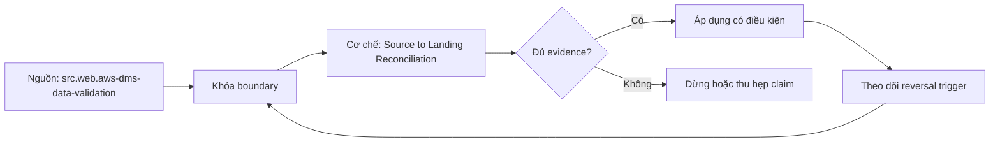

# Source to Landing Reconciliation

> [!abstract] Câu hỏi trung tâm
> Đối soát source-landing ở những tầng nào để phát hiện missing, duplicate, corruption và semantic coercion?

## 1. Boundary trước số liệu

Mọi phép đối soát cần cùng source boundary: snapshot ID, LSN/SCN, watermark tuple, API cursor window hoặc file manifest. So source đang chuyển động với landing của thời điểm khác tạo false mismatch. Ghi included/excluded scope, timezone, delete state, late-data allowance và validation delay. Không có boundary thì khớp không có nghĩa xác định.

## 2. Bốn tầng oracle

Tầng 1 control count theo entity/partition. Tầng 2 key-set và duplicate/missing direction. Tầng 3 typed canonical row/column hash sau khi chuẩn hóa có công bố. Tầng 4 business aggregates/invariants theo grain. Count có thể khớp khi một missing bù một duplicate; hash có thể lệch do canonicalization chứ không do data loss. Dùng nhiều tầng và drill-down diff.

## 3. Canonicalization

Định nghĩa null/empty, Unicode normalization, timezone, decimal scale/rounding, NaN, binary, array/map order và collation trước hash. Hash field có length-prefix hoặc structured serialization để tránh ambiguity. Không ép mọi source về string không type. Lưu algorithm/version và field inclusion; masking hoặc unsupported columns phải được báo là coverage gap.

## 4. Mismatch taxonomy

Phân biệt missing target, extra target, value diff, unvalidated/suspended, schema mismatch, late but expected và source-mutated-during-validation. Mỗi class có owner, severity, retry/revalidate, containment và escalation. Validation tool xanh chỉ trong supported scope; primary key absence hoặc concurrent mutation có thể làm coverage giảm mà không phải pipeline correctness.

## 5. Chi phí và lấy mẫu

Full row compare tốn query, network và compute; partition/range/hash tree có thể khoanh vùng. Sampling chỉ ước lượng và có risk model, không chứng minh zero loss. Validation concurrency có budget riêng để không gây sự cố nguồn. SLO gồm coverage, residual mismatch age và time-to-explain, không chỉ pass rate.

## 6. Reconciliation lab

Tạo fixed-boundary source và landing, inject one missing, one duplicate, swapped values, timezone coercion, hard delete và concurrent update. Chứng minh count-only bỏ sót ca bù trừ; key set tìm direction; typed hash tìm field diff; aggregate phát semantic error. Lưu queries, inputs, raw diffs, unresolved exclusions và signed disposition.

## 7. Ma trận kiểm chứng từng mệnh đề

Mỗi claim phải gắn source/entity boundary, exact fixture, checkpoint/input state, counterexample và independent reconciliation oracle. Connector chạy thành công hoặc API trả 2xx chưa chứng minh completeness.

### 7.1. Reconciliation probe 1: common boundary, control level, canonicalization, mismatch class và raw diff phải nối được

**Mệnh đề cần kiểm.** Reconciliation probe 1: common boundary, control level, canonicalization, mismatch class và raw diff phải nối được.

**Thiết kế phép thử cho `wiki.ingestion.source-to-landing-reconciliation`.** Khóa source/API version, entity, grain/key, time boundary, schema, pagination/cursor configuration và failure schedule. Tạo positive, boundary và negative fixtures; thay đổi đúng một assumption. Lưu request/query, response/raw extract hash, checkpoint trước/sau, landing objects, target state và source-at-boundary oracle.

**Điều kiện chấp nhận cho `wiki.ingestion.source-to-landing-reconciliation`.** Count, key set, typed field hash và delete state khớp contract; duplicates được giải thích và dedup có identity rõ. Observation, inference và unknown được báo riêng. Lab chưa chạy chỉ là protocol.

### 7.2. Reconciliation probe 2: common boundary, control level, canonicalization, mismatch class và raw diff phải nối được

**Mệnh đề cần kiểm.** Reconciliation probe 2: common boundary, control level, canonicalization, mismatch class và raw diff phải nối được.

**Thiết kế phép thử cho `wiki.ingestion.source-to-landing-reconciliation`.** Khóa source/API version, entity, grain/key, time boundary, schema, pagination/cursor configuration và failure schedule. Tạo positive, boundary và negative fixtures; thay đổi đúng một assumption. Lưu request/query, response/raw extract hash, checkpoint trước/sau, landing objects, target state và source-at-boundary oracle.

**Điều kiện chấp nhận cho `wiki.ingestion.source-to-landing-reconciliation`.** Count, key set, typed field hash và delete state khớp contract; duplicates được giải thích và dedup có identity rõ. Observation, inference và unknown được báo riêng. Lab chưa chạy chỉ là protocol.

### 7.3. Reconciliation probe 3: common boundary, control level, canonicalization, mismatch class và raw diff phải nối được

**Mệnh đề cần kiểm.** Reconciliation probe 3: common boundary, control level, canonicalization, mismatch class và raw diff phải nối được.

**Thiết kế phép thử cho `wiki.ingestion.source-to-landing-reconciliation`.** Khóa source/API version, entity, grain/key, time boundary, schema, pagination/cursor configuration và failure schedule. Tạo positive, boundary và negative fixtures; thay đổi đúng một assumption. Lưu request/query, response/raw extract hash, checkpoint trước/sau, landing objects, target state và source-at-boundary oracle.

**Điều kiện chấp nhận cho `wiki.ingestion.source-to-landing-reconciliation`.** Count, key set, typed field hash và delete state khớp contract; duplicates được giải thích và dedup có identity rõ. Observation, inference và unknown được báo riêng. Lab chưa chạy chỉ là protocol.

### 7.4. Reconciliation probe 4: common boundary, control level, canonicalization, mismatch class và raw diff phải nối được

**Mệnh đề cần kiểm.** Reconciliation probe 4: common boundary, control level, canonicalization, mismatch class và raw diff phải nối được.

**Thiết kế phép thử cho `wiki.ingestion.source-to-landing-reconciliation`.** Khóa source/API version, entity, grain/key, time boundary, schema, pagination/cursor configuration và failure schedule. Tạo positive, boundary và negative fixtures; thay đổi đúng một assumption. Lưu request/query, response/raw extract hash, checkpoint trước/sau, landing objects, target state và source-at-boundary oracle.

**Điều kiện chấp nhận cho `wiki.ingestion.source-to-landing-reconciliation`.** Count, key set, typed field hash và delete state khớp contract; duplicates được giải thích và dedup có identity rõ. Observation, inference và unknown được báo riêng. Lab chưa chạy chỉ là protocol.

### 7.5. Reconciliation probe 5: common boundary, control level, canonicalization, mismatch class và raw diff phải nối được

**Mệnh đề cần kiểm.** Reconciliation probe 5: common boundary, control level, canonicalization, mismatch class và raw diff phải nối được.

**Thiết kế phép thử cho `wiki.ingestion.source-to-landing-reconciliation`.** Khóa source/API version, entity, grain/key, time boundary, schema, pagination/cursor configuration và failure schedule. Tạo positive, boundary và negative fixtures; thay đổi đúng một assumption. Lưu request/query, response/raw extract hash, checkpoint trước/sau, landing objects, target state và source-at-boundary oracle.

**Điều kiện chấp nhận cho `wiki.ingestion.source-to-landing-reconciliation`.** Count, key set, typed field hash và delete state khớp contract; duplicates được giải thích và dedup có identity rõ. Observation, inference và unknown được báo riêng. Lab chưa chạy chỉ là protocol.

### 7.6. Reconciliation probe 6: common boundary, control level, canonicalization, mismatch class và raw diff phải nối được

**Mệnh đề cần kiểm.** Reconciliation probe 6: common boundary, control level, canonicalization, mismatch class và raw diff phải nối được.

**Thiết kế phép thử cho `wiki.ingestion.source-to-landing-reconciliation`.** Khóa source/API version, entity, grain/key, time boundary, schema, pagination/cursor configuration và failure schedule. Tạo positive, boundary và negative fixtures; thay đổi đúng một assumption. Lưu request/query, response/raw extract hash, checkpoint trước/sau, landing objects, target state và source-at-boundary oracle.

**Điều kiện chấp nhận cho `wiki.ingestion.source-to-landing-reconciliation`.** Count, key set, typed field hash và delete state khớp contract; duplicates được giải thích và dedup có identity rõ. Observation, inference và unknown được báo riêng. Lab chưa chạy chỉ là protocol.

### 7.7. Reconciliation probe 7: common boundary, control level, canonicalization, mismatch class và raw diff phải nối được

**Mệnh đề cần kiểm.** Reconciliation probe 7: common boundary, control level, canonicalization, mismatch class và raw diff phải nối được.

**Thiết kế phép thử cho `wiki.ingestion.source-to-landing-reconciliation`.** Khóa source/API version, entity, grain/key, time boundary, schema, pagination/cursor configuration và failure schedule. Tạo positive, boundary và negative fixtures; thay đổi đúng một assumption. Lưu request/query, response/raw extract hash, checkpoint trước/sau, landing objects, target state và source-at-boundary oracle.

**Điều kiện chấp nhận cho `wiki.ingestion.source-to-landing-reconciliation`.** Count, key set, typed field hash và delete state khớp contract; duplicates được giải thích và dedup có identity rõ. Observation, inference và unknown được báo riêng. Lab chưa chạy chỉ là protocol.

### 7.8. Reconciliation probe 8: common boundary, control level, canonicalization, mismatch class và raw diff phải nối được

**Mệnh đề cần kiểm.** Reconciliation probe 8: common boundary, control level, canonicalization, mismatch class và raw diff phải nối được.

**Thiết kế phép thử cho `wiki.ingestion.source-to-landing-reconciliation`.** Khóa source/API version, entity, grain/key, time boundary, schema, pagination/cursor configuration và failure schedule. Tạo positive, boundary và negative fixtures; thay đổi đúng một assumption. Lưu request/query, response/raw extract hash, checkpoint trước/sau, landing objects, target state và source-at-boundary oracle.

**Điều kiện chấp nhận cho `wiki.ingestion.source-to-landing-reconciliation`.** Count, key set, typed field hash và delete state khớp contract; duplicates được giải thích và dedup có identity rõ. Observation, inference và unknown được báo riêng. Lab chưa chạy chỉ là protocol.

### 7.9. Reconciliation probe 9: common boundary, control level, canonicalization, mismatch class và raw diff phải nối được

**Mệnh đề cần kiểm.** Reconciliation probe 9: common boundary, control level, canonicalization, mismatch class và raw diff phải nối được.

**Thiết kế phép thử cho `wiki.ingestion.source-to-landing-reconciliation`.** Khóa source/API version, entity, grain/key, time boundary, schema, pagination/cursor configuration và failure schedule. Tạo positive, boundary và negative fixtures; thay đổi đúng một assumption. Lưu request/query, response/raw extract hash, checkpoint trước/sau, landing objects, target state và source-at-boundary oracle.

**Điều kiện chấp nhận cho `wiki.ingestion.source-to-landing-reconciliation`.** Count, key set, typed field hash và delete state khớp contract; duplicates được giải thích và dedup có identity rõ. Observation, inference và unknown được báo riêng. Lab chưa chạy chỉ là protocol.

### 7.10. Reconciliation probe 10: common boundary, control level, canonicalization, mismatch class và raw diff phải nối được

**Mệnh đề cần kiểm.** Reconciliation probe 10: common boundary, control level, canonicalization, mismatch class và raw diff phải nối được.

**Thiết kế phép thử cho `wiki.ingestion.source-to-landing-reconciliation`.** Khóa source/API version, entity, grain/key, time boundary, schema, pagination/cursor configuration và failure schedule. Tạo positive, boundary và negative fixtures; thay đổi đúng một assumption. Lưu request/query, response/raw extract hash, checkpoint trước/sau, landing objects, target state và source-at-boundary oracle.

**Điều kiện chấp nhận cho `wiki.ingestion.source-to-landing-reconciliation`.** Count, key set, typed field hash và delete state khớp contract; duplicates được giải thích và dedup có identity rõ. Observation, inference và unknown được báo riêng. Lab chưa chạy chỉ là protocol.

### 7.11. Reconciliation probe 11: common boundary, control level, canonicalization, mismatch class và raw diff phải nối được

**Mệnh đề cần kiểm.** Reconciliation probe 11: common boundary, control level, canonicalization, mismatch class và raw diff phải nối được.

**Thiết kế phép thử cho `wiki.ingestion.source-to-landing-reconciliation`.** Khóa source/API version, entity, grain/key, time boundary, schema, pagination/cursor configuration và failure schedule. Tạo positive, boundary và negative fixtures; thay đổi đúng một assumption. Lưu request/query, response/raw extract hash, checkpoint trước/sau, landing objects, target state và source-at-boundary oracle.

**Điều kiện chấp nhận cho `wiki.ingestion.source-to-landing-reconciliation`.** Count, key set, typed field hash và delete state khớp contract; duplicates được giải thích và dedup có identity rõ. Observation, inference và unknown được báo riêng. Lab chưa chạy chỉ là protocol.

### 7.12. Reconciliation probe 12: common boundary, control level, canonicalization, mismatch class và raw diff phải nối được

**Mệnh đề cần kiểm.** Reconciliation probe 12: common boundary, control level, canonicalization, mismatch class và raw diff phải nối được.

**Thiết kế phép thử cho `wiki.ingestion.source-to-landing-reconciliation`.** Khóa source/API version, entity, grain/key, time boundary, schema, pagination/cursor configuration và failure schedule. Tạo positive, boundary và negative fixtures; thay đổi đúng một assumption. Lưu request/query, response/raw extract hash, checkpoint trước/sau, landing objects, target state và source-at-boundary oracle.

**Điều kiện chấp nhận cho `wiki.ingestion.source-to-landing-reconciliation`.** Count, key set, typed field hash và delete state khớp contract; duplicates được giải thích và dedup có identity rõ. Observation, inference và unknown được báo riêng. Lab chưa chạy chỉ là protocol.

### 7.13. Reconciliation probe 13: common boundary, control level, canonicalization, mismatch class và raw diff phải nối được

**Mệnh đề cần kiểm.** Reconciliation probe 13: common boundary, control level, canonicalization, mismatch class và raw diff phải nối được.

**Thiết kế phép thử cho `wiki.ingestion.source-to-landing-reconciliation`.** Khóa source/API version, entity, grain/key, time boundary, schema, pagination/cursor configuration và failure schedule. Tạo positive, boundary và negative fixtures; thay đổi đúng một assumption. Lưu request/query, response/raw extract hash, checkpoint trước/sau, landing objects, target state và source-at-boundary oracle.

**Điều kiện chấp nhận cho `wiki.ingestion.source-to-landing-reconciliation`.** Count, key set, typed field hash và delete state khớp contract; duplicates được giải thích và dedup có identity rõ. Observation, inference và unknown được báo riêng. Lab chưa chạy chỉ là protocol.

### 7.14. Reconciliation probe 14: common boundary, control level, canonicalization, mismatch class và raw diff phải nối được

**Mệnh đề cần kiểm.** Reconciliation probe 14: common boundary, control level, canonicalization, mismatch class và raw diff phải nối được.

**Thiết kế phép thử cho `wiki.ingestion.source-to-landing-reconciliation`.** Khóa source/API version, entity, grain/key, time boundary, schema, pagination/cursor configuration và failure schedule. Tạo positive, boundary và negative fixtures; thay đổi đúng một assumption. Lưu request/query, response/raw extract hash, checkpoint trước/sau, landing objects, target state và source-at-boundary oracle.

**Điều kiện chấp nhận cho `wiki.ingestion.source-to-landing-reconciliation`.** Count, key set, typed field hash và delete state khớp contract; duplicates được giải thích và dedup có identity rõ. Observation, inference và unknown được báo riêng. Lab chưa chạy chỉ là protocol.

### 7.15. Reconciliation probe 15: common boundary, control level, canonicalization, mismatch class và raw diff phải nối được

**Mệnh đề cần kiểm.** Reconciliation probe 15: common boundary, control level, canonicalization, mismatch class và raw diff phải nối được.

**Thiết kế phép thử cho `wiki.ingestion.source-to-landing-reconciliation`.** Khóa source/API version, entity, grain/key, time boundary, schema, pagination/cursor configuration và failure schedule. Tạo positive, boundary và negative fixtures; thay đổi đúng một assumption. Lưu request/query, response/raw extract hash, checkpoint trước/sau, landing objects, target state và source-at-boundary oracle.

**Điều kiện chấp nhận cho `wiki.ingestion.source-to-landing-reconciliation`.** Count, key set, typed field hash và delete state khớp contract; duplicates được giải thích và dedup có identity rõ. Observation, inference và unknown được báo riêng. Lab chưa chạy chỉ là protocol.

## 8. Quy trình phản biện

1. Chốt entity, grain, identity và immutable boundary.
2. Tách source fact, documentation claim và observed behavior.
3. Viết delete, retry, checkpoint và replay semantics trước code.
4. Dùng key/typed-hash reconciliation, không chỉ row count.
5. Pin version, retention, timezone, ordering và rate limits.
6. Ghi assumption bị falsify và extraction pattern thay thế.

## 9. Câu hỏi tự kiểm tra

1. Source thay đổi row/entity theo những operation nào?
2. Boundary nào định nghĩa complete?
3. Delete có xuất hiện trong interface không?
4. Cursor/order có total và immutable không?
5. Crash ở checkpoint boundary gây replay hay gap?
6. Bằng chứng nào chưa được chạy?

## 10. Giới hạn và điều chưa cho phép kết luận

- Chưa chạy mutation/pagination/watermark lab trên source thật.
- Product behavior phải pin version, retention và configuration.
- Decision matrices và failure protocols là synthesis của giáo trình.
- Note giữ trạng thái `review` tới khi chủ dự án duyệt.

## Reference
1. [[SRC-AWS-DMS-DATA-VALIDATION]]
2. [[SRC-REIS-HOUSLEY-FUNDAMENTALS-DATA-ENGINEERING]]
3. [[SRC-KLEPPMANN-DDIA-1E]]

## Source coverage

| Source slice | Nội dung sử dụng | Trạng thái |
|---|---|---|
| [[SRC-AWS-DMS-DATA-VALIDATION]] | Source/change/API contract hoặc engineering context | Đã đọc locator; không suy ngoài phạm vi |
| [[SRC-REIS-HOUSLEY-FUNDAMENTALS-DATA-ENGINEERING]] | Source/change/API contract hoặc engineering context | Đã đọc locator; không suy ngoài phạm vi |
| [[SRC-KLEPPMANN-DDIA-1E]] | Source/change/API contract hoặc engineering context | Đã đọc locator; không suy ngoài phạm vi |

## Key takeaways
- Extraction pattern chỉ đúng khi source assumptions đúng.
- Completeness cần immutable boundary và reconciliation oracle.
- Retry/checkpoint ưu tiên replay có kiểm soát hơn silent gap.
- Connector không chuyển giao ownership về tính đúng.

<!-- ATOMIC-EXECUTION-CAPSULE:START -->

## Execution capsule: kiểm chứng `wiki.ingestion.source-to-landing-reconciliation`

> [!important] Phân loại mệnh đề
> Với `wiki.ingestion.source-to-landing-reconciliation`, sơ đồ, ví dụ và artifact về **Source to Landing Reconciliation** là **synthesis để kiểm chứng**; chúng không phải trích dẫn hay case nguyên văn của nguồn.

### Sơ đồ cơ chế và điểm kiểm soát



Đọc sơ đồ `wiki.ingestion.source-to-landing-reconciliation` từ trái sang phải: source chỉ cung cấp claim ban đầu cho **Source to Landing Reconciliation**; quyết định chỉ được đi tiếp sau khi boundary, evidence và điều kiện đảo quyết định đã hiện hữu.

### Ví dụ làm việc có thể bác bỏ

**Input.** Một đội cần trả lời: Đối soát source-landing ở những tầng nào để phát hiện missing, duplicate, corruption và semantic coercion? cho một phạm vi nhỏ, có owner và deadline rõ.

**Decision.** Đội áp dụng **Source to Landing Reconciliation** trên control và variant chỉ khác một assumption; expected result và hard constraints được khóa trước khi chạy.

**Outcome.** Với `wiki.ingestion.source-to-landing-reconciliation`, nếu observation vi phạm hard constraint hoặc oracle độc lập không xác nhận **Source to Landing Reconciliation**, đội thu hẹp claim hay đảo quyết định. Nếu đạt, kết luận vẫn kèm scope, version và review date; một lần thành công không được nâng thành quy luật phổ quát.

### Artifact thực thi tối thiểu

```sql
-- Verification harness for: Source to Landing Reconciliation
WITH evidence AS (
    SELECT 'wiki.ingestion.source-to-landing-reconciliation' AS concept_id,
           'boundary_declared' AS check_name, 1 AS passed
    UNION ALL
    SELECT 'wiki.ingestion.source-to-landing-reconciliation', 'independent_oracle', 1
    UNION ALL
    SELECT 'wiki.ingestion.source-to-landing-reconciliation', 'reversal_trigger_recorded', 1
)
SELECT concept_id,
       MIN(passed) AS all_hard_checks_pass,
       COUNT(*) AS evidence_items
FROM evidence
GROUP BY concept_id
HAVING MIN(passed) = 1;
```

Artifact của `wiki.ingestion.source-to-landing-reconciliation` buộc người dùng ghi boundary, oracle và reversal trigger cho **Source to Landing Reconciliation**. Các giá trị minh họa phải được thay bằng evidence thật trước khi dùng cho quyết định.

### Tự kiểm tra trước khi tái sử dụng

1. Bạn có thể trả lời `Đối soát source-landing ở những tầng nào để phát hiện missing, duplicate, corruption và semantic coercion?` bằng một câu mà không kéo thêm concept thứ hai không?
2. Source locator nào đỡ cho claim, và phần nào chỉ là synthesis trong note?
3. Observation nào khiến bạn dừng, thu hẹp hoặc đảo quyết định?
4. Artifact nào cho phép một reviewer độc lập tái hiện kết quả?

<!-- ATOMIC-EXECUTION-CAPSULE:END -->
