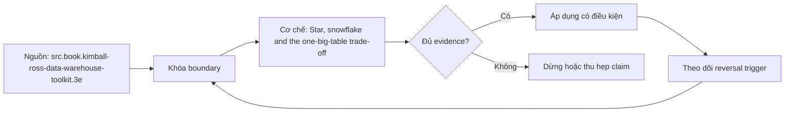

# Star, snowflake and the one-big-table trade-off

> [!abstract] Câu hỏi trung tâm
> So sánh star, snowflake và one-big-table theo workload, storage, khả năng thay đổi và mức dễ hiểu như thế nào mà không biến một engine-specific optimization thành quy tắc chung?

## 1. Star

Star giữ fact ở declared grain và dimensions rộng, descriptive, thường denormalized. Ít join hơn và vocabulary gần nghiệp vụ giúp truy vấn/BI dễ dùng; conformed dimensions hỗ trợ nhiều processes. Chi phí là repeated dimension attributes, SCD processing và cần kiểm grain/additivity. Star không có nghĩa nhét mọi measure vào một fact.

## 2. Snowflake

Snowflake chuẩn hoá một phần hierarchy/attributes của dimension thành nhiều bảng. Nó có thể giảm lặp hoặc phù hợp tool/DBMS cụ thể, nhưng thêm join, alias và ripple effect cho SCD. Tiết kiệm dung lượng dimension thường phải được so với tổng footprint fact; không được chọn snowflake chỉ vì nó trông normalized.

## 3. One big table

OBT/flat table đưa context tới cùng grain tiêu thụ để giảm join và đơn giản hoá truy cập. Trên BigQuery, nested/repeated fields có thể giữ hierarchy mà không flatten many-side thành duplicate rows. OBT phải có grain rõ; flatten order và lines sai grain làm lặp header measures. Redundancy, rebuild cost, schema width và definition drift là chi phí thật.

## 4. Bốn trục so sánh

Performance đo bytes scanned, shuffle, joins, latency p50/p95 và concurrency; storage đo compressed bytes cùng refresh cost; changeability đo artifacts/jobs/consumers bị ảnh hưởng; usability đo thời gian và error rate của người chưa biết schema. Chỉ so trên cùng data snapshot, semantic results, partition/clustering và workload. Một query nhanh không chứng minh model tốt hơn.

## 5. Lựa chọn có thể đảo ngược

Star phù hợp shared analytics và governed dimensions; snowflake có thể hợp khi engine/tool khai thác hierarchy hoặc attribute reuse; OBT hợp bounded data product/read pattern có refresh contract. Lựa chọn đảo khi workload, engine, change frequency, team skill hay governance thay đổi. Semantic layer và lineage phải giữ một định nghĩa metric qua các physical layouts.

## 6. Ma trận kiểm chứng từng mệnh đề

Mỗi mệnh đề phải chuyển thành fixture, invariant và phép đối chiếu tái chạy được. Tên pattern, sơ đồ hoặc một query chạy không lỗi không tự chứng minh đúng grain và semantics.

### 6.1. star có fact và denormalized dimensions

**Mệnh đề cần kiểm.** star có fact và denormalized dimensions. **Thiết kế phép kiểm.** Materialize cùng snapshot và metric contract thành star, snowflake và OBT/nested layout. Chạy cùng năm query sau warm-up; lưu plan, bytes, shuffle, latency, storage, refresh time, semantic diff và change-blast-radius. **Bằng chứng đạt cho `wiki.data-modeling.star-snowflake-obt`.** Lưu model/metric contract, seed data, SQL/notebook, raw output, row counts, distinct keys, unmatched rate và control totals. Nếu kết quả phụ thuộc engine, cutoff hoặc business policy, phải ghi điều kiện đó cùng phản ví dụ.

### 6.2. snowflake chuẩn hoá dimension hierarchy

**Mệnh đề cần kiểm.** snowflake chuẩn hoá dimension hierarchy. **Thiết kế phép kiểm.** Materialize cùng snapshot và metric contract thành star, snowflake và OBT/nested layout. Chạy cùng năm query sau warm-up; lưu plan, bytes, shuffle, latency, storage, refresh time, semantic diff và change-blast-radius. **Bằng chứng đạt cho `wiki.data-modeling.star-snowflake-obt`.** Lưu model/metric contract, seed data, SQL/notebook, raw output, row counts, distinct keys, unmatched rate và control totals. Nếu kết quả phụ thuộc engine, cutoff hoặc business policy, phải ghi điều kiện đó cùng phản ví dụ.

### 6.3. OBT vẫn phải có declared grain

**Mệnh đề cần kiểm.** OBT vẫn phải có declared grain. **Thiết kế phép kiểm.** Materialize cùng snapshot và metric contract thành star, snowflake và OBT/nested layout. Chạy cùng năm query sau warm-up; lưu plan, bytes, shuffle, latency, storage, refresh time, semantic diff và change-blast-radius. **Bằng chứng đạt cho `wiki.data-modeling.star-snowflake-obt`.** Lưu model/metric contract, seed data, SQL/notebook, raw output, row counts, distinct keys, unmatched rate và control totals. Nếu kết quả phụ thuộc engine, cutoff hoặc business policy, phải ghi điều kiện đó cùng phản ví dụ.

### 6.4. flatten one-to-many có thể lặp header measure

**Mệnh đề cần kiểm.** flatten one-to-many có thể lặp header measure. **Thiết kế phép kiểm.** Materialize cùng snapshot và metric contract thành star, snowflake và OBT/nested layout. Chạy cùng năm query sau warm-up; lưu plan, bytes, shuffle, latency, storage, refresh time, semantic diff và change-blast-radius. **Bằng chứng đạt cho `wiki.data-modeling.star-snowflake-obt`.** Lưu model/metric contract, seed data, SQL/notebook, raw output, row counts, distinct keys, unmatched rate và control totals. Nếu kết quả phụ thuộc engine, cutoff hoặc business policy, phải ghi điều kiện đó cùng phản ví dụ.

### 6.5. nested repeated khác flat duplication

**Mệnh đề cần kiểm.** nested repeated khác flat duplication. **Thiết kế phép kiểm.** Materialize cùng snapshot và metric contract thành star, snowflake và OBT/nested layout. Chạy cùng năm query sau warm-up; lưu plan, bytes, shuffle, latency, storage, refresh time, semantic diff và change-blast-radius. **Bằng chứng đạt cho `wiki.data-modeling.star-snowflake-obt`.** Lưu model/metric contract, seed data, SQL/notebook, raw output, row counts, distinct keys, unmatched rate và control totals. Nếu kết quả phụ thuộc engine, cutoff hoặc business policy, phải ghi điều kiện đó cùng phản ví dụ.

### 6.6. join count không phải chi phí duy nhất

**Mệnh đề cần kiểm.** join count không phải chi phí duy nhất. **Thiết kế phép kiểm.** Materialize cùng snapshot và metric contract thành star, snowflake và OBT/nested layout. Chạy cùng năm query sau warm-up; lưu plan, bytes, shuffle, latency, storage, refresh time, semantic diff và change-blast-radius. **Bằng chứng đạt cho `wiki.data-modeling.star-snowflake-obt`.** Lưu model/metric contract, seed data, SQL/notebook, raw output, row counts, distinct keys, unmatched rate và control totals. Nếu kết quả phụ thuộc engine, cutoff hoặc business policy, phải ghi điều kiện đó cùng phản ví dụ.

### 6.7. bytes scanned và shuffle phải đo

**Mệnh đề cần kiểm.** bytes scanned và shuffle phải đo. **Thiết kế phép kiểm.** Materialize cùng snapshot và metric contract thành star, snowflake và OBT/nested layout. Chạy cùng năm query sau warm-up; lưu plan, bytes, shuffle, latency, storage, refresh time, semantic diff và change-blast-radius. **Bằng chứng đạt cho `wiki.data-modeling.star-snowflake-obt`.** Lưu model/metric contract, seed data, SQL/notebook, raw output, row counts, distinct keys, unmatched rate và control totals. Nếu kết quả phụ thuộc engine, cutoff hoặc business policy, phải ghi điều kiện đó cùng phản ví dụ.

### 6.8. compressed storage phải gồm refresh cost

**Mệnh đề cần kiểm.** compressed storage phải gồm refresh cost. **Thiết kế phép kiểm.** Materialize cùng snapshot và metric contract thành star, snowflake và OBT/nested layout. Chạy cùng năm query sau warm-up; lưu plan, bytes, shuffle, latency, storage, refresh time, semantic diff và change-blast-radius. **Bằng chứng đạt cho `wiki.data-modeling.star-snowflake-obt`.** Lưu model/metric contract, seed data, SQL/notebook, raw output, row counts, distinct keys, unmatched rate và control totals. Nếu kết quả phụ thuộc engine, cutoff hoặc business policy, phải ghi điều kiện đó cùng phản ví dụ.

### 6.9. change blast radius phải được đếm

**Mệnh đề cần kiểm.** change blast radius phải được đếm. **Thiết kế phép kiểm.** Materialize cùng snapshot và metric contract thành star, snowflake và OBT/nested layout. Chạy cùng năm query sau warm-up; lưu plan, bytes, shuffle, latency, storage, refresh time, semantic diff và change-blast-radius. **Bằng chứng đạt cho `wiki.data-modeling.star-snowflake-obt`.** Lưu model/metric contract, seed data, SQL/notebook, raw output, row counts, distinct keys, unmatched rate và control totals. Nếu kết quả phụ thuộc engine, cutoff hoặc business policy, phải ghi điều kiện đó cùng phản ví dụ.

### 6.10. usability cần task test với người dùng

**Mệnh đề cần kiểm.** usability cần task test với người dùng. **Thiết kế phép kiểm.** Materialize cùng snapshot và metric contract thành star, snowflake và OBT/nested layout. Chạy cùng năm query sau warm-up; lưu plan, bytes, shuffle, latency, storage, refresh time, semantic diff và change-blast-radius. **Bằng chứng đạt cho `wiki.data-modeling.star-snowflake-obt`.** Lưu model/metric contract, seed data, SQL/notebook, raw output, row counts, distinct keys, unmatched rate và control totals. Nếu kết quả phụ thuộc engine, cutoff hoặc business policy, phải ghi điều kiện đó cùng phản ví dụ.

### 6.11. star có thể đã đủ nhanh trên BigQuery

**Mệnh đề cần kiểm.** star có thể đã đủ nhanh trên BigQuery. **Thiết kế phép kiểm.** Materialize cùng snapshot và metric contract thành star, snowflake và OBT/nested layout. Chạy cùng năm query sau warm-up; lưu plan, bytes, shuffle, latency, storage, refresh time, semantic diff và change-blast-radius. **Bằng chứng đạt cho `wiki.data-modeling.star-snowflake-obt`.** Lưu model/metric contract, seed data, SQL/notebook, raw output, row counts, distinct keys, unmatched rate và control totals. Nếu kết quả phụ thuộc engine, cutoff hoặc business policy, phải ghi điều kiện đó cùng phản ví dụ.

### 6.12. snowflake SCD có ripple effect

**Mệnh đề cần kiểm.** snowflake SCD có ripple effect. **Thiết kế phép kiểm.** Materialize cùng snapshot và metric contract thành star, snowflake và OBT/nested layout. Chạy cùng năm query sau warm-up; lưu plan, bytes, shuffle, latency, storage, refresh time, semantic diff và change-blast-radius. **Bằng chứng đạt cho `wiki.data-modeling.star-snowflake-obt`.** Lưu model/metric contract, seed data, SQL/notebook, raw output, row counts, distinct keys, unmatched rate và control totals. Nếu kết quả phụ thuộc engine, cutoff hoặc business policy, phải ghi điều kiện đó cùng phản ví dụ.

### 6.13. OBT cần definition ownership

**Mệnh đề cần kiểm.** OBT cần definition ownership. **Thiết kế phép kiểm.** Materialize cùng snapshot và metric contract thành star, snowflake và OBT/nested layout. Chạy cùng năm query sau warm-up; lưu plan, bytes, shuffle, latency, storage, refresh time, semantic diff và change-blast-radius. **Bằng chứng đạt cho `wiki.data-modeling.star-snowflake-obt`.** Lưu model/metric contract, seed data, SQL/notebook, raw output, row counts, distinct keys, unmatched rate và control totals. Nếu kết quả phụ thuộc engine, cutoff hoặc business policy, phải ghi điều kiện đó cùng phản ví dụ.

### 6.14. semantic result phải giống nhau khi benchmark

**Mệnh đề cần kiểm.** semantic result phải giống nhau khi benchmark. **Thiết kế phép kiểm.** Materialize cùng snapshot và metric contract thành star, snowflake và OBT/nested layout. Chạy cùng năm query sau warm-up; lưu plan, bytes, shuffle, latency, storage, refresh time, semantic diff và change-blast-radius. **Bằng chứng đạt cho `wiki.data-modeling.star-snowflake-obt`.** Lưu model/metric contract, seed data, SQL/notebook, raw output, row counts, distinct keys, unmatched rate và control totals. Nếu kết quả phụ thuộc engine, cutoff hoặc business policy, phải ghi điều kiện đó cùng phản ví dụ.

### 6.15. lựa chọn cần điều kiện đảo ngược

**Mệnh đề cần kiểm.** lựa chọn cần điều kiện đảo ngược. **Thiết kế phép kiểm.** Materialize cùng snapshot và metric contract thành star, snowflake và OBT/nested layout. Chạy cùng năm query sau warm-up; lưu plan, bytes, shuffle, latency, storage, refresh time, semantic diff và change-blast-radius. **Bằng chứng đạt cho `wiki.data-modeling.star-snowflake-obt`.** Lưu model/metric contract, seed data, SQL/notebook, raw output, row counts, distinct keys, unmatched rate và control totals. Nếu kết quả phụ thuộc engine, cutoff hoặc business policy, phải ghi điều kiện đó cùng phản ví dụ.

## 7. Quy trình phản biện

1. Viết business question, grain, identity, time semantics và aggregation contract.
2. Tách source fact, quyết định thiết kế và synthesis của giáo trình.
3. Dựng ca biên nhỏ nhất có thể làm query đúng cú pháp nhưng sai số.
4. Kiểm key, interval, cardinality và control total trước–sau transform/join.
5. Chạy replay, late data hoặc schema change phù hợp với bài; lưu failed run.
6. Phân biệt correctness, usability, performance và governance; một trục đạt không che lấp trục khác.
7. Ghi owner, version, policy và điều kiện làm lựa chọn hiện tại không còn đúng.

## 8. Câu hỏi tự kiểm tra

1. Pattern trong bài giải failure mode nào và không giải failure mode nào?
2. Row đại diện điều gì, có hiệu lực khi nào và được nhận dạng bằng gì?
3. Ca biên nào làm SUM, current-state lookup hoặc history query sai âm thầm?
4. Constraint/test nào bắt lỗi cấu trúc; phần ngữ nghĩa nào cần owner xác nhận?
5. Late data, correction, replay hoặc model change ảnh hưởng output đã công bố ra sao?
6. Nguồn nào hỗ trợ trực tiếp và phần nào là synthesis của bài?

## 9. Giới hạn và điều chưa cho phép kết luận

- Chưa chạy modeling lab, benchmark, late-data replay hay reconciliation; phép kiểm là protocol, không phải kết quả đã đo.
- Type number sau SCD Type 3 không hoàn toàn thống nhất giữa mọi tài liệu; implementation phải mô tả behavior.
- BigQuery guidance là engine-specific; không suy OBT luôn nhanh hoặc rẻ hơn.
- SQL Server system-versioned temporal table quản system time; business-valid time là trục khác.
- Bài Data Vault chỉ xác nhận khả năng nhận diện và đánh giá bối cảnh, không xác nhận năng lực triển khai DV2.

## Reference
1. [[SRC-KIMBALL-ROSS-DW-TOOLKIT-3E]]
2. [[SRC-ADAMSON-STAR-SCHEMA-COMPLETE-REFERENCE]]
3. [[SRC-GOOGLE-BIGQUERY-DENORMALIZATION]]

## Source coverage

| Source slice | Nội dung sử dụng | Trạng thái |
|---|---|---|
| [[SRC-KIMBALL-ROSS-DW-TOOLKIT-3E]] | Khái niệm, ranh giới và phản ví dụ liên quan đến bài | Đã đọc phạm vi có locator; không suy ngoài phạm vi |
| [[SRC-ADAMSON-STAR-SCHEMA-COMPLETE-REFERENCE]] | Khái niệm, ranh giới và phản ví dụ liên quan đến bài | Đã đọc phạm vi có locator; không suy ngoài phạm vi |
| [[SRC-GOOGLE-BIGQUERY-DENORMALIZATION]] | Khái niệm, ranh giới và phản ví dụ liên quan đến bài | Đã đọc phạm vi có locator; không suy ngoài phạm vi |

## Key takeaways
- Chọn pattern theo failure mode, grain, time và workload; không chọn theo tên gọi.
- Key/interval/cardinality đúng về cấu trúc vẫn cần business semantics và owner.
- History và restatement là data contract có tác động tới người dùng, không chỉ là ETL technique.
- Layout physical phải được so trên cùng workload và semantic output.
- Chưa chạy lab thì note là tài liệu học thuật đã truy nguồn, không phải chứng nhận production.

<!-- ATOMIC-EXECUTION-CAPSULE:START -->

## Execution capsule — kiểm chứng `wiki.data-modeling.star-snowflake-obt`

> [!important] Phân loại mệnh đề
> Với `wiki.data-modeling.star-snowflake-obt`, sơ đồ, ví dụ và artifact về **Star, snowflake and the one-big-table trade-off** là **synthesis để kiểm chứng**; chúng không phải trích dẫn hay case nguyên văn của nguồn.

### Sơ đồ cơ chế và điểm kiểm soát



Đọc sơ đồ `wiki.data-modeling.star-snowflake-obt` từ trái sang phải: source chỉ cung cấp claim ban đầu cho **Star, snowflake and the one-big-table trade-off**; quyết định chỉ được đi tiếp sau khi boundary, evidence và điều kiện đảo quyết định đã hiện hữu.

### Artifact thực thi tối thiểu

```sql
-- Verification harness for: Star, snowflake and the one-big-table trade-off
WITH evidence AS (
    SELECT 'wiki.data-modeling.star-snowflake-obt' AS concept_id,
           'boundary_declared' AS check_name, 1 AS passed
    UNION ALL
    SELECT 'wiki.data-modeling.star-snowflake-obt', 'independent_oracle', 1
    UNION ALL
    SELECT 'wiki.data-modeling.star-snowflake-obt', 'reversal_trigger_recorded', 1
)
SELECT concept_id,
       MIN(passed) AS all_hard_checks_pass,
       COUNT(*) AS evidence_items
FROM evidence
GROUP BY concept_id
HAVING MIN(passed) = 1;
```

Artifact của `wiki.data-modeling.star-snowflake-obt` buộc người dùng ghi boundary, oracle và reversal trigger cho **Star, snowflake and the one-big-table trade-off**. Các giá trị minh họa phải được thay bằng evidence thật trước khi dùng cho quyết định.

### Tự kiểm tra trước khi tái sử dụng

1. Bạn có thể trả lời `So sánh star, snowflake và one-big-table theo workload, storage, khả năng thay đổi và mức dễ hiểu như thế nào mà không biến một engine-specific optimization thành quy tắc chung?` bằng một câu mà không kéo thêm concept thứ hai không?
2. Source locator nào đỡ cho claim, và phần nào chỉ là synthesis trong note?
3. Observation nào khiến bạn dừng, thu hẹp hoặc đảo quyết định?
4. Artifact nào cho phép một reviewer độc lập tái hiện kết quả?

<!-- ATOMIC-EXECUTION-CAPSULE:END -->
