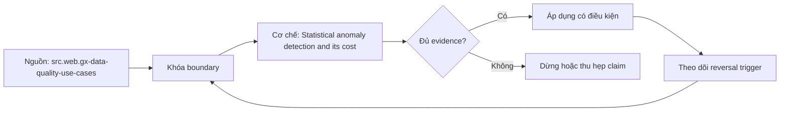

# Statistical anomaly detection and its cost

> [!abstract] Câu hỏi trung tâm
> Anomaly detector được đánh giá bằng detection value, false-positive cost và compute cost như thế nào?

## 1. Signal definition

Metric, grain, cadence, seasonality và business segmentation phải ổn định trước khi fit threshold. Đừng bắt đầu bằng tên công cụ. Hãy bắt đầu bằng đối tượng được bảo vệ, boundary quan sát được và hậu quả nếu kết luận sai. Trong bài `Statistical anomaly detection and its cost`, câu hỏi thực dụng là: Anomaly detector được đánh giá bằng detection value, false-positive cost và compute cost như thế nào? Ta ghi rõ grain, population, time window, owner và hành động sau failure; nếu một trường chưa biết thì đánh dấu unknown thay vì lấp bằng mặc định. Bằng chứng tối thiểu gồm fixture có version, cấu hình hoặc rule đã resolve, raw observation, expected result và limitation. Phần này là curriculum synthesis dựa trên các nguồn đã định danh, không phải lời hứa rằng mọi adapter hay deployment đều có cùng hành vi.

## 2. Baseline and drift

Rolling history có contamination, trend và regime change; baseline cần exclusion policy và version. Điểm khó không nằm ở cú pháp mà ở identity và scope. Hai phép đo cùng tên vẫn có thể nói về hai population hoặc hai thời điểm khác nhau. Trong bài `Statistical anomaly detection and its cost`, câu hỏi thực dụng là: Anomaly detector được đánh giá bằng detection value, false-positive cost và compute cost như thế nào? Ta ghi rõ grain, population, time window, owner và hành động sau failure; nếu một trường chưa biết thì đánh dấu unknown thay vì lấp bằng mặc định. Bằng chứng tối thiểu gồm fixture có version, cấu hình hoặc rule đã resolve, raw observation, expected result và limitation. Phần này là curriculum synthesis dựa trên các nguồn đã định danh, không phải lời hứa rằng mọi adapter hay deployment đều có cùng hành vi.

## 3. Detector choices

Static bands, robust z-score, seasonal residual và forecast interval có assumption/cost khác nhau. Một dashboard xanh chỉ là tín hiệu. Muốn biến nó thành bằng chứng phải giữ input, phiên bản, rule, trạng thái trước–sau và cách tính độc lập. Trong bài `Statistical anomaly detection and its cost`, câu hỏi thực dụng là: Anomaly detector được đánh giá bằng detection value, false-positive cost và compute cost như thế nào? Ta ghi rõ grain, population, time window, owner và hành động sau failure; nếu một trường chưa biết thì đánh dấu unknown thay vì lấp bằng mặc định. Bằng chứng tối thiểu gồm fixture có version, cấu hình hoặc rule đã resolve, raw observation, expected result và limitation. Phần này là curriculum synthesis dựa trên các nguồn đã định danh, không phải lời hứa rằng mọi adapter hay deployment đều có cùng hành vi.

## 4. Error economics

Precision, recall, delay và missed-impact phải quy về triage load, user harm và remediation value. Thiết kế tốt phải chịu được counterexample. Hãy chủ động tạo case sát boundary, case thiếu dữ liệu và case replay thay vì chỉ chạy happy path. Trong bài `Statistical anomaly detection and its cost`, câu hỏi thực dụng là: Anomaly detector được đánh giá bằng detection value, false-positive cost và compute cost như thế nào? Ta ghi rõ grain, population, time window, owner và hành động sau failure; nếu một trường chưa biết thì đánh dấu unknown thay vì lấp bằng mặc định. Bằng chứng tối thiểu gồm fixture có version, cấu hình hoặc rule đã resolve, raw observation, expected result và limitation. Phần này là curriculum synthesis dựa trên các nguồn đã định danh, không phải lời hứa rằng mọi adapter hay deployment đều có cùng hành vi.

## 5. Compute footprint

Profiling, scan, state retention và cardinality làm observability thành workload cần budget. Chi phí vận hành thuộc contract. Một rule đúng nhưng quá đắt, quá ồn hoặc không có owner sẽ nhanh chóng bị tắt và mất tác dụng. Trong bài `Statistical anomaly detection and its cost`, câu hỏi thực dụng là: Anomaly detector được đánh giá bằng detection value, false-positive cost và compute cost như thế nào? Ta ghi rõ grain, population, time window, owner và hành động sau failure; nếu một trường chưa biết thì đánh dấu unknown thay vì lấp bằng mặc định. Bằng chứng tối thiểu gồm fixture có version, cấu hình hoặc rule đã resolve, raw observation, expected result và limitation. Phần này là curriculum synthesis dựa trên các nguồn đã định danh, không phải lời hứa rằng mọi adapter hay deployment đều có cùng hành vi.

## 6. Shadow rollout

Backtest rồi chạy shadow, label outcomes, điều chỉnh threshold có review; không tune theo từng alert cho tới im lặng. Kết luận cần có điều kiện đảo chiều. Khi volume, latency, nguồn thẩm quyền hoặc topology đổi, quyết định cũ phải được xem xét lại bằng cùng một oracle. Trong bài `Statistical anomaly detection and its cost`, câu hỏi thực dụng là: Anomaly detector được đánh giá bằng detection value, false-positive cost và compute cost như thế nào? Ta ghi rõ grain, population, time window, owner và hành động sau failure; nếu một trường chưa biết thì đánh dấu unknown thay vì lấp bằng mặc định. Bằng chứng tối thiểu gồm fixture có version, cấu hình hoặc rule đã resolve, raw observation, expected result và limitation. Phần này là curriculum synthesis dựa trên các nguồn đã định danh, không phải lời hứa rằng mọi adapter hay deployment đều có cùng hành vi.

## 7. Ma trận kiểm chứng từng mệnh đề

Với `wiki.data-quality.statistical-anomaly-cost`, command thành công không tự chứng minh dữ liệu đúng. Protocol riêng của bài là: Chạy fixture gốc và biến đổi/đối chiếu độc lập, giữ seed hoặc canonicalization version và chứng minh ít nhất một negative case bị bắt. Mỗi probe dưới đây phải nối input boundary với failure signal và oracle có thể phản bác kết luận.

### 7.1. Statistical anomaly detection and its cost: kiểm `Signal definition` bằng case 1, cụ thể metric, grain, cadence, seasonality và business segmentation phải ổn định trước khi fit threshold

**Mệnh đề cần kiểm.** Statistical anomaly detection and its cost: kiểm `Signal definition` bằng case 1, cụ thể metric, grain, cadence, seasonality và business segmentation phải ổn định trước khi fit threshold.

**Thiết kế phép thử cho `wiki.data-quality.statistical-anomaly-cost`.** Trong ngữ cảnh `wiki.data-quality.statistical-anomaly-cost`, tạo positive control và negative control chỉ khác đúng một điều kiện. Khóa input snapshot, phiên bản và owner của rule; chạy đúng population được bài `Statistical anomaly detection and its cost` công bố.

**Bằng chứng cần giữ.** Đối với probe 1 của `Statistical anomaly detection and its cost`, giữ fixture, raw failing rows và lệnh tái hiện. Nếu chưa chạy lab, ghi expected evidence và giữ trạng thái review; không biến protocol thành observation.

### 7.2. Statistical anomaly detection and its cost: kiểm `Baseline and drift` bằng case 2, cụ thể rolling history có contamination, trend và regime change; baseline cần exclusion policy và version

**Mệnh đề cần kiểm.** Statistical anomaly detection and its cost: kiểm `Baseline and drift` bằng case 2, cụ thể rolling history có contamination, trend và regime change; baseline cần exclusion policy và version.

**Thiết kế phép thử cho `wiki.data-quality.statistical-anomaly-cost`.** Trong ngữ cảnh `wiki.data-quality.statistical-anomaly-cost`, đổi grain nhưng giữ tổng số dòng để lộ phép đo sai cấp. Khóa input snapshot, phiên bản và owner của rule; chạy đúng population được bài `Statistical anomaly detection and its cost` công bố.

**Bằng chứng cần giữ.** Đối với probe 2 của `Statistical anomaly detection and its cost`, báo numerator, denominator và key set ở cả hai grain. Nếu chưa chạy lab, ghi expected evidence và giữ trạng thái review; không biến protocol thành observation.

### 7.3. Statistical anomaly detection and its cost: kiểm `Detector choices` bằng case 3, cụ thể static bands, robust z-score, seasonal residual và forecast interval có assumption/cost khác nhau

**Mệnh đề cần kiểm.** Statistical anomaly detection and its cost: kiểm `Detector choices` bằng case 3, cụ thể static bands, robust z-score, seasonal residual và forecast interval có assumption/cost khác nhau.

**Thiết kế phép thử cho `wiki.data-quality.statistical-anomaly-cost`.** Trong ngữ cảnh `wiki.data-quality.statistical-anomaly-cost`, đưa một giá trị tới đúng boundary và một giá trị vượt boundary. Khóa input snapshot, phiên bản và owner của rule; chạy đúng population được bài `Statistical anomaly detection and its cost` công bố.

**Bằng chứng cần giữ.** Đối với probe 3 của `Statistical anomaly detection and its cost`, lưu hai observed values cùng rule đã resolve. Nếu chưa chạy lab, ghi expected evidence và giữ trạng thái review; không biến protocol thành observation.

### 7.4. Statistical anomaly detection and its cost: kiểm `Error economics` bằng case 4, cụ thể precision, recall, delay và missed-impact phải quy về triage load, user harm và remediation value

**Mệnh đề cần kiểm.** Statistical anomaly detection and its cost: kiểm `Error economics` bằng case 4, cụ thể precision, recall, delay và missed-impact phải quy về triage load, user harm và remediation value.

**Thiết kế phép thử cho `wiki.data-quality.statistical-anomaly-cost`.** Trong ngữ cảnh `wiki.data-quality.statistical-anomaly-cost`, kill tiến trình ngay trước rồi ngay sau durable side effect. Khóa input snapshot, phiên bản và owner của rule; chạy đúng population được bài `Statistical anomaly detection and its cost` công bố.

**Bằng chứng cần giữ.** Đối với probe 4 của `Statistical anomaly detection and its cost`, lưu checkpoint, external ledger và trạng thái sau restart. Nếu chưa chạy lab, ghi expected evidence và giữ trạng thái review; không biến protocol thành observation.

### 7.5. Statistical anomaly detection and its cost: kiểm `Compute footprint` bằng case 5, cụ thể profiling, scan, state retention và cardinality làm observability thành workload cần budget

**Mệnh đề cần kiểm.** Statistical anomaly detection and its cost: kiểm `Compute footprint` bằng case 5, cụ thể profiling, scan, state retention và cardinality làm observability thành workload cần budget.

**Thiết kế phép thử cho `wiki.data-quality.statistical-anomaly-cost`.** Trong ngữ cảnh `wiki.data-quality.statistical-anomaly-cost`, đảo thứ tự input và concurrency nhưng giữ logical population. Khóa input snapshot, phiên bản và owner của rule; chạy đúng population được bài `Statistical anomaly detection and its cost` công bố.

**Bằng chứng cần giữ.** Đối với probe 5 của `Statistical anomaly detection and its cost`, so canonical hash và business totals giữa các thứ tự. Nếu chưa chạy lab, ghi expected evidence và giữ trạng thái review; không biến protocol thành observation.

### 7.6. Statistical anomaly detection and its cost: kiểm `Shadow rollout` bằng case 6, cụ thể backtest rồi chạy shadow, label outcomes, điều chỉnh threshold có review; không tune theo từng alert cho tới im lặng

**Mệnh đề cần kiểm.** Statistical anomaly detection and its cost: kiểm `Shadow rollout` bằng case 6, cụ thể backtest rồi chạy shadow, label outcomes, điều chỉnh threshold có review; không tune theo từng alert cho tới im lặng.

**Thiết kế phép thử cho `wiki.data-quality.statistical-anomaly-cost`.** Trong ngữ cảnh `wiki.data-quality.statistical-anomaly-cost`, replay cùng identity với payload giống rồi payload xung đột. Khóa input snapshot, phiên bản và owner của rule; chạy đúng population được bài `Statistical anomaly detection and its cost` công bố.

**Bằng chứng cần giữ.** Đối với probe 6 của `Statistical anomaly detection and its cost`, tách duplicate replay khỏi identity collision bằng reason code. Nếu chưa chạy lab, ghi expected evidence và giữ trạng thái review; không biến protocol thành observation.

### 7.7. Statistical anomaly detection and its cost: kiểm `Signal definition` bằng case 7, cụ thể metric, grain, cadence, seasonality và business segmentation phải ổn định trước khi fit threshold

**Mệnh đề cần kiểm.** Statistical anomaly detection and its cost: kiểm `Signal definition` bằng case 7, cụ thể metric, grain, cadence, seasonality và business segmentation phải ổn định trước khi fit threshold.

**Thiết kế phép thử cho `wiki.data-quality.statistical-anomaly-cost`.** Trong ngữ cảnh `wiki.data-quality.statistical-anomaly-cost`, thêm record tới trễ trong horizon và ngoài horizon. Khóa input snapshot, phiên bản và owner của rule; chạy đúng population được bài `Statistical anomaly detection and its cost` công bố.

**Bằng chứng cần giữ.** Đối với probe 7 của `Statistical anomaly detection and its cost`, báo accepted-late, rejected-late và oldest outstanding timestamp. Nếu chưa chạy lab, ghi expected evidence và giữ trạng thái review; không biến protocol thành observation.

### 7.8. Statistical anomaly detection and its cost: kiểm `Baseline and drift` bằng case 8, cụ thể rolling history có contamination, trend và regime change; baseline cần exclusion policy và version

**Mệnh đề cần kiểm.** Statistical anomaly detection and its cost: kiểm `Baseline and drift` bằng case 8, cụ thể rolling history có contamination, trend và regime change; baseline cần exclusion policy và version.

**Thiết kế phép thử cho `wiki.data-quality.statistical-anomaly-cost`.** Trong ngữ cảnh `wiki.data-quality.statistical-anomaly-cost`, đổi schema theo một cách tương thích rồi một cách phá vỡ semantics. Khóa input snapshot, phiên bản và owner của rule; chạy đúng population được bài `Statistical anomaly detection and its cost` công bố.

**Bằng chứng cần giữ.** Đối với probe 8 của `Statistical anomaly detection and its cost`, giữ schema diff, classification và consumer-visible result. Nếu chưa chạy lab, ghi expected evidence và giữ trạng thái review; không biến protocol thành observation.

### 7.9. Statistical anomaly detection and its cost: kiểm `Detector choices` bằng case 9, cụ thể static bands, robust z-score, seasonal residual và forecast interval có assumption/cost khác nhau

**Mệnh đề cần kiểm.** Statistical anomaly detection and its cost: kiểm `Detector choices` bằng case 9, cụ thể static bands, robust z-score, seasonal residual và forecast interval có assumption/cost khác nhau.

**Thiết kế phép thử cho `wiki.data-quality.statistical-anomaly-cost`.** Trong ngữ cảnh `wiki.data-quality.statistical-anomaly-cost`, tạo missing và duplicate bù nhau để count tổng không đổi. Khóa input snapshot, phiên bản và owner của rule; chạy đúng population được bài `Statistical anomaly detection and its cost` công bố.

**Bằng chứng cần giữ.** Đối với probe 9 của `Statistical anomaly detection and its cost`, so key multiset và typed hashes thay vì chỉ row count. Nếu chưa chạy lab, ghi expected evidence và giữ trạng thái review; không biến protocol thành observation.

### 7.10. Statistical anomaly detection and its cost: kiểm `Error economics` bằng case 10, cụ thể precision, recall, delay và missed-impact phải quy về triage load, user harm và remediation value

**Mệnh đề cần kiểm.** Statistical anomaly detection and its cost: kiểm `Error economics` bằng case 10, cụ thể precision, recall, delay và missed-impact phải quy về triage load, user harm và remediation value.

**Thiết kế phép thử cho `wiki.data-quality.statistical-anomaly-cost`.** Trong ngữ cảnh `wiki.data-quality.statistical-anomaly-cost`, cho reviewer tái hiện chỉ từ evidence package. Khóa input snapshot, phiên bản và owner của rule; chạy đúng population được bài `Statistical anomaly detection and its cost` công bố.

**Bằng chứng cần giữ.** Đối với probe 10 của `Statistical anomaly detection and its cost`, package phải đủ để người khác dựng lại decision và limitation. Nếu chưa chạy lab, ghi expected evidence và giữ trạng thái review; không biến protocol thành observation.

### 7.11. Statistical anomaly detection and its cost: kiểm `Compute footprint` bằng case 11, cụ thể profiling, scan, state retention và cardinality làm observability thành workload cần budget

**Mệnh đề cần kiểm.** Statistical anomaly detection and its cost: kiểm `Compute footprint` bằng case 11, cụ thể profiling, scan, state retention và cardinality làm observability thành workload cần budget.

**Thiết kế phép thử cho `wiki.data-quality.statistical-anomaly-cost`.** Trong ngữ cảnh `wiki.data-quality.statistical-anomaly-cost`, so với oracle độc lập không dùng chung query hoặc parser. Khóa input snapshot, phiên bản và owner của rule; chạy đúng population được bài `Statistical anomaly detection and its cost` công bố.

**Bằng chứng cần giữ.** Đối với probe 11 của `Statistical anomaly detection and its cost`, independent result phải khớp ở grain đã công bố. Nếu chưa chạy lab, ghi expected evidence và giữ trạng thái review; không biến protocol thành observation.

### 7.12. Statistical anomaly detection and its cost: kiểm `Shadow rollout` bằng case 12, cụ thể backtest rồi chạy shadow, label outcomes, điều chỉnh threshold có review; không tune theo từng alert cho tới im lặng

**Mệnh đề cần kiểm.** Statistical anomaly detection and its cost: kiểm `Shadow rollout` bằng case 12, cụ thể backtest rồi chạy shadow, label outcomes, điều chỉnh threshold có review; không tune theo từng alert cho tới im lặng.

**Thiết kế phép thử cho `wiki.data-quality.statistical-anomaly-cost`.** Trong ngữ cảnh `wiki.data-quality.statistical-anomaly-cost`, chạy scope hẹp và population đầy đủ rồi công bố phần bị loại. Khóa input snapshot, phiên bản và owner của rule; chạy đúng population được bài `Statistical anomaly detection and its cost` công bố.

**Bằng chứng cần giữ.** Đối với probe 12 của `Statistical anomaly detection and its cost`, coverage phải nêu rõ excluded nodes, partitions hoặc incidents. Nếu chưa chạy lab, ghi expected evidence và giữ trạng thái review; không biến protocol thành observation.

### 7.13. Statistical anomaly detection and its cost: kiểm `Signal definition` bằng case 13, cụ thể metric, grain, cadence, seasonality và business segmentation phải ổn định trước khi fit threshold

**Mệnh đề cần kiểm.** Statistical anomaly detection and its cost: kiểm `Signal definition` bằng case 13, cụ thể metric, grain, cadence, seasonality và business segmentation phải ổn định trước khi fit threshold.

**Thiết kế phép thử cho `wiki.data-quality.statistical-anomaly-cost`.** Trong ngữ cảnh `wiki.data-quality.statistical-anomaly-cost`, thử timezone, precision hoặc partition ở hai phía của ranh giới. Khóa input snapshot, phiên bản và owner của rule; chạy đúng population được bài `Statistical anomaly detection and its cost` công bố.

**Bằng chứng cần giữ.** Đối với probe 13 của `Statistical anomaly detection and its cost`, UTC/local interval và rounding policy phải hiện trong output. Nếu chưa chạy lab, ghi expected evidence và giữ trạng thái review; không biến protocol thành observation.

### 7.14. Statistical anomaly detection and its cost: kiểm `Baseline and drift` bằng case 14, cụ thể rolling history có contamination, trend và regime change; baseline cần exclusion policy và version

**Mệnh đề cần kiểm.** Statistical anomaly detection and its cost: kiểm `Baseline and drift` bằng case 14, cụ thể rolling history có contamination, trend và regime change; baseline cần exclusion policy và version.

**Thiết kế phép thử cho `wiki.data-quality.statistical-anomaly-cost`.** Trong ngữ cảnh `wiki.data-quality.statistical-anomaly-cost`, đổi constraint đủ lớn để quyết định phải đảo. Khóa input snapshot, phiên bản và owner của rule; chạy đúng population được bài `Statistical anomaly detection and its cost` công bố.

**Bằng chứng cần giữ.** Đối với probe 14 của `Statistical anomaly detection and its cost`, ADR phải lưu changed constraint và reversal threshold. Nếu chưa chạy lab, ghi expected evidence và giữ trạng thái review; không biến protocol thành observation.

### 7.15. Statistical anomaly detection and its cost: kiểm `Detector choices` bằng case 15, cụ thể static bands, robust z-score, seasonal residual và forecast interval có assumption/cost khác nhau

**Mệnh đề cần kiểm.** Statistical anomaly detection and its cost: kiểm `Detector choices` bằng case 15, cụ thể static bands, robust z-score, seasonal residual và forecast interval có assumption/cost khác nhau.

**Thiết kế phép thử cho `wiki.data-quality.statistical-anomaly-cost`.** Trong ngữ cảnh `wiki.data-quality.statistical-anomaly-cost`, chạy lại từ môi trường sạch với versions và seed đã khóa. Khóa input snapshot, phiên bản và owner của rule; chạy đúng population được bài `Statistical anomaly detection and its cost` công bố.

**Bằng chứng cần giữ.** Đối với probe 15 của `Statistical anomaly detection and its cost`, canonical result phải ổn định hoặc mọi nondeterminism phải được giải thích. Nếu chưa chạy lab, ghi expected evidence và giữ trạng thái review; không biến protocol thành observation.

## 8. Quy trình phản biện

1. Viết consumer-visible invariant cho `Statistical anomaly detection and its cost` trước khi chọn query hoặc tool.
2. Khóa grain, identity, population, time window và authoritative source.
3. Phân biệt declared configuration, executed state và published state.
4. Chạy negative control, replay hoặc changed-assumption case phù hợp.
5. Đối soát bằng oracle độc lập; công bố coverage và phần không quan sát được.
6. Gắn owner, hành động, reversal trigger và hạn review cho kết luận.

## 9. Câu hỏi tự kiểm tra

1. `Statistical anomaly detection and its cost: kiểm `Signal definition` bằng case 1, cụ thể metric, grain, cadence, seasonality và business segmentation phải ổn định trước khi fit threshold` thất bại đầu tiên ở boundary nào?
2. Artifact nào mạnh nhất để trả lời `Statistical anomaly detection and its cost: kiểm `Detector choices` bằng case 3, cụ thể static bands, robust z-score, seasonal residual và forecast interval có assumption/cost khác nhau`?
3. Counterexample nhỏ nhất cho `Statistical anomaly detection and its cost: kiểm `Shadow rollout` bằng case 6, cụ thể backtest rồi chạy shadow, label outcomes, điều chỉnh threshold có review; không tune theo từng alert cho tới im lặng` gồm những state nào?
4. `Statistical anomaly detection and its cost: kiểm `Detector choices` bằng case 9, cụ thể static bands, robust z-score, seasonal residual và forecast interval có assumption/cost khác nhau` có thể xanh giả ra sao?
5. Constraint nào khiến quyết định ở `Statistical anomaly detection and its cost: kiểm `Baseline and drift` bằng case 14, cụ thể rolling history có contamination, trend và regime change; baseline cần exclusion policy và version` phải đảo?
6. Phần nào của `Statistical anomaly detection and its cost: kiểm `Detector choices` bằng case 15, cụ thể static bands, robust z-score, seasonal residual và forecast interval có assumption/cost khác nhau` mới là protocol, chưa phải observation?

## 10. Giới hạn và điều chưa cho phép kết luận

- Lab của `Statistical anomaly detection and its cost` chưa chạy trên hệ thống production; nội dung là giáo trình và expected evidence.
- Hành vi phụ thuộc phiên bản, connector, scheduler, warehouse và catalog configuration phải được kiểm lại.
- Các ma trận, ladder và threshold do giáo trình tổng hợp không được gán nguyên văn cho vendor.
- Note giữ trạng thái `review` cho tới khi owner duyệt semantics và learner artifact.

## Reference
1. [[SRC-GX-DATA-QUALITY-USE-CASES]]
2. [[SRC-GX-EXPECTATIONS]]

## Source coverage

| Source slice | Nội dung sử dụng | Trạng thái |
|---|---|---|
| [[SRC-GX-DATA-QUALITY-USE-CASES]] | Contract hoặc cơ chế liên quan trực tiếp tới `Statistical anomaly detection and its cost` | Đã đọc locator; cần pin version khi chạy lab |
| [[SRC-GX-EXPECTATIONS]] | Contract hoặc cơ chế liên quan trực tiếp tới `Statistical anomaly detection and its cost` | Đã đọc locator; cần pin version khi chạy lab |

## Key takeaways
- Detector chỉ tốt khi detection value lớn hơn false-positive và compute cost.
- Với `wiki.data-quality.statistical-anomaly-cost`, quality của kết luận phụ thuộc identity, coverage và oracle chứ không phụ thuộc màu dashboard.
- Câu hỏi `Anomaly detector được đánh giá bằng detection value, false-positive cost và compute cost như thế nào?` chỉ được trả lời trong scope và version đã ghi.
- Các source IDs `src.web.gx-data-quality-use-cases, src.web.gx-expectations` đặt ranh giới cho source fact; phần còn lại là synthesis có nhãn.
- Trước khi lab chạy, đây là note đã kiểm cấu trúc và provenance, chưa phải chứng nhận production.

<!-- ATOMIC-EXECUTION-CAPSULE:START -->

## Execution capsule — kiểm chứng `wiki.data-quality.statistical-anomaly-cost`

> [!important] Phân loại mệnh đề
> Với `wiki.data-quality.statistical-anomaly-cost`, sơ đồ, ví dụ và artifact về **Statistical anomaly detection and its cost** là **synthesis để kiểm chứng**; chúng không phải trích dẫn hay case nguyên văn của nguồn.

### Sơ đồ cơ chế và điểm kiểm soát



Đọc sơ đồ `wiki.data-quality.statistical-anomaly-cost` từ trái sang phải: source chỉ cung cấp claim ban đầu cho **Statistical anomaly detection and its cost**; quyết định chỉ được đi tiếp sau khi boundary, evidence và điều kiện đảo quyết định đã hiện hữu.

### Artifact thực thi tối thiểu

```sql
-- Verification harness for: Statistical anomaly detection and its cost
WITH evidence AS (
    SELECT 'wiki.data-quality.statistical-anomaly-cost' AS concept_id,
           'boundary_declared' AS check_name, 1 AS passed
    UNION ALL
    SELECT 'wiki.data-quality.statistical-anomaly-cost', 'independent_oracle', 1
    UNION ALL
    SELECT 'wiki.data-quality.statistical-anomaly-cost', 'reversal_trigger_recorded', 1
)
SELECT concept_id,
       MIN(passed) AS all_hard_checks_pass,
       COUNT(*) AS evidence_items
FROM evidence
GROUP BY concept_id
HAVING MIN(passed) = 1;
```

Artifact của `wiki.data-quality.statistical-anomaly-cost` buộc người dùng ghi boundary, oracle và reversal trigger cho **Statistical anomaly detection and its cost**. Các giá trị minh họa phải được thay bằng evidence thật trước khi dùng cho quyết định.

### Tự kiểm tra trước khi tái sử dụng

1. Bạn có thể trả lời `Anomaly detector được đánh giá bằng detection value, false-positive cost và compute cost như thế nào?` bằng một câu mà không kéo thêm concept thứ hai không?
2. Source locator nào đỡ cho claim, và phần nào chỉ là synthesis trong note?
3. Observation nào khiến bạn dừng, thu hẹp hoặc đảo quyết định?
4. Artifact nào cho phép một reviewer độc lập tái hiện kết quả?

<!-- ATOMIC-EXECUTION-CAPSULE:END -->
