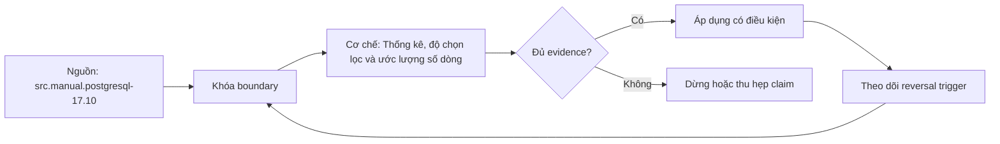

# Thống kê, độ chọn lọc và ước lượng số dòng

> [!abstract] Câu hỏi trung tâm
> Statistics nào hỗ trợ predicate, estimate được tính với giả định gì, node đầu tiên sai ở đâu, và remediation nào làm sai số giảm mà không đổi semantics?

## 1. Cardinality điều khiển plan

Planner cần dự đoán rows qua mỗi operator để tính CPU, pages, join work, groups, memory và parallel benefit. Một estimate sai ở scan/filter truyền lên joins và có thể khuếch đại. Chọn outer nhỏ giả thành lớn hoặc build side nhỏ giả thành lớn làm join order/algorithm đổi.

Cardinality estimate không cần tuyệt đối hoàn hảo; cần đủ tốt để rank candidate paths. Nhưng sai nhiều bậc tại node quan trọng là tín hiệu mạnh.

Đừng bắt đầu bằng elapsed. Bắt đầu ở plan tree, so `rows=` estimated với actual rows/loops và tìm mismatch sớm nhất.

## 2. Selectivity

Selectivity là tỷ lệ rows dự kiến qua predicate, thường từ 0 đến 1. Estimated rows ≈ base rows × selectivity, sau điều chỉnh/capping. Equality, range, null tests, pattern và joins có estimator khác.

Với nhiều predicates, nếu không có thông tin dependency, planner thường kết hợp bằng giả định gần độc lập: nhân selectivities. Nếu city và postal code tương quan mạnh, nhân hai tỷ lệ đếm cùng thông tin hai lần và underestimate.

Selectivity không phải tỷ lệ cố định của cột; phụ thuộc operator, constant, statistics, NULL và collation/type.

## 3. Base relation size

`pg_class.reltuples` và relpages là estimates được cập nhật bởi VACUUM/ANALYZE và một số operations; có thể scale theo current pages. Sau bulk load nhưng chưa analyze, base count/stats có thể stale.

Planner không chạy `count(*)` cho mỗi planning event. Statistics là sample/summary để planning nhanh. Vì thế freshness là trade-off với analyze cost.

Partitioned tables cần stats ở partitions và parent phù hợp workload/version. Data distribution khác theo partition có thể làm estimate khác.

## 4. NULL fraction và distinct count

Column stats gồm `null_frac`, `n_distinct`, average width và các distribution summaries. `n_distinct` có thể âm để biểu diễn tỷ lệ theo table size. Equality selectivity cho non-MCV có thể dựa remaining mass/remaining distinct.

NULL predicate dùng null fraction. SQL three-valued logic làm `col = value` không match NULL. Stats stale về null rate làm estimate sai.

NDV sample có uncertainty, đặc biệt high-cardinality/skew. Tăng statistics target có thể tăng sample/detail nhưng tốn analyze/planning/catalog.

## 5. Most-common values

MCV list lưu các values phổ biến và frequencies. Equality với MCV dùng frequency gần thực tế thay uniform assumption. Values ngoài list dùng phần probability còn lại chia cho distinct còn lại.

Skew nặng nhưng target thấp có thể bỏ hot values. Parameter value hot/cold sẽ có plans khác lý tưởng; generic plan khó tối ưu cả hai.

MCV list có size giới hạn. Không gọi nó full frequency table.

## 6. Histogram

Histogram bounds mô tả distribution phần không nằm MCV, thường các buckets gần equal-frequency. Range selectivity nội suy vị trí constant trong bounds, với assumptions giữa boundaries.

Outliers, spikes và distribution thay đổi có thể làm estimate lệch. Histogram không giữ mọi value. Type/operator phải có ordering/estimators phù hợp.

Xem `pg_stats` để hiểu planner thấy gì, nhưng statistics visibility/security có rules.

## 7. Correlation statistic

Correlation trong column stats mô tả tương quan giữa logical order của column và physical heap order, chủ yếu ảnh hưởng cost index scan, không phải cross-column correlation. Đừng nhầm với functional dependency extended statistics.

High physical correlation làm index range fetch pages tuần tự hơn; low correlation tăng random fetch cost. CLUSTER/rewrite có thể đổi, updates làm suy giảm.

Nó không nói hai columns liên hệ với nhau.

## 8. Stale statistics

Bulk load/update/delete lớn làm sample cũ không đại diện. Autovacuum/analyze thresholds có thể chưa trigger hoặc jobs bị chặn. Dấu hiệu: reltuples/MCV/histogram khác current data; plan đổi sau ANALYZE và estimate cải thiện.

Remediation đầu tiên thường là `ANALYZE` đúng tables/columns sau load, rồi điều chỉnh autovacuum analyze policy. Nhưng analyze trên production có I/O/CPU; schedule/monitor.

Nếu ANALYZE không cải thiện, đừng lặp vô hạn; kiểm skew/correlation/expression/model.

## 9. Skew

Skew nghĩa một số values có frequency lớn. Uniform estimator cho non-MCV hoặc generic parameter có thể sai. Tạo lab với hot value chiếm tỷ lệ lớn và many cold values; compare hot/cold plan.

Tăng per-column statistics target có thể đưa hot values vào MCV/histogram chi tiết. Partial index/partition/query-specific design có thể giúp workload, nhưng không dùng index để sửa estimate nếu root là stats thiếu.

Data drift cần refresh cadence và monitoring estimate errors.

## 10. Correlated columns

Hai columns có dependency như city→postal zone hoặc country→currency. Predicate conjunction không độc lập. Extended statistics `dependencies` giúp equality-like conditions khi planner hỗ trợ; `mcv` đa cột giữ joint common combinations; `ndistinct` giúp estimate groups/multicolumn distinct.

`CREATE STATISTICS ... (dependencies, mcv, ndistinct)` rồi ANALYZE. Chọn đúng loại theo query. Extended stats không tự tạo bởi default và không thay index.

Giới hạn quan trọng: functional dependency stats không chứng minh data constraint và không áp mọi predicate/join. Manual PostgreSQL 17 nêu examples và limitations.

## 11. Expression statistics

Predicate `lower(email)=...` không dùng raw-column distribution trực tiếp. PostgreSQL có expression statistics qua `CREATE STATISTICS` trên expression hoặc statistics từ expression index. Query expression phải match phù hợp.

Expression index vừa cung cấp access path vừa statistics, nhưng thêm write/storage cost. Nếu chỉ cần estimate, extended expression statistics có thể tránh index.

Immutable/stable semantics và collation phải được xem xét.

## 12. Join cardinality

Join estimate phụ thuộc input rows, NDV, MCV, uniqueness/constraints và predicate. PK/FK/UNIQUE giúp planner biết bounds/relationships trong phạm vi hỗ trợ. Duplicate/skew keys tạo fanout.

Cross-table correlations khó nắm bằng per-table stats. Extended statistics hiện chủ yếu trong một table và có limitations cho join selectivity. Denormalization chỉ để stats là quyết định lớn, không phải fix đầu tiên.

So actual match distribution và constraints. Query semantics/fanout đúng trước performance.

## 13. Error ratio

Dùng symmetric-ish factor: `max(actual/estimated, estimated/actual)` khi cả hai >0; xử lý zero riêng. Báo hướng under/overestimate. Một estimate 1 vs 100000 là 100000× under.

Actual rows trong node nhiều loops cần diễn giải total. Lấy machine-readable plan giúp tính. Không chỉ so root; root estimate đúng có thể do lỗi bù nhau.

Ngưỡng giảm rõ rệt phải định trước, ví dụ factor từ >100× xuống <10× cho lab; production threshold theo plan sensitivity.

## 14. Ba tình huống lab

A: bulk load lớn sau stats cũ; sửa ANALYZE. B: distribution skew với hot/cold; tăng target/MCV phù hợp. C: two correlated columns; tạo extended stats dependency/MCV. Mỗi tình huống ghi dataset seed, before plan, actual/estimate factor, chosen fix và after.

Chỉ đổi một material variable mỗi experiment. Result rows/checksum phải giống. Measure planning time/analyze cost bên cạnh execution.

Nếu remediation không giúp, giữ failure visible và giải thích limitation; không đổi threshold để pass.

## 15. Thứ tự remediation

1) xác nhận query/result; 2) refresh stats; 3) inspect pg_stats; 4) tăng target cho column quan trọng; 5) extended/expression stats; 6) schema/index/query rewrite theo requirement; 7) planner overrides/hints cuối cùng.

Query rewrite có thể làm predicate dễ estimate/sargable nhưng phải parity test. Index cải thiện access path nhưng không tự sửa join order nếu estimates vẫn sai.

Constraints đúng nên khai báo vì correctness trước, planner benefit sau.

## 16. Monitoring

Lưu representative plans, estimate-error factors, plan hash/shape, stats last analyze, data volume/skew và latency distribution. Alert khi plan regression gắn SLO, không chỉ plan đổi.

Autoanalyze settings theo table workload; append-heavy/bulk load có post-load analyze step. Statistics target có owner; tăng toàn cluster gây overhead.

Sensitive values trong MCV/pg_stats có access controls; không export bừa vào logs.

Theo dõi freshness phải gắn với tốc độ thay đổi chứ không chỉ thời gian. Một bảng tham chiếu ổn định có thể giữ statistics lâu, trong khi bảng sự kiện vừa nạp thêm một partition lớn cần analyze ngay. Ghi số rows thay đổi kể từ lần phân tích, phạm vi partition và loại truy vấn bị ảnh hưởng. Khi plan thay đổi, so đồng thời data distribution, statistics version, schema/index và planner settings; plan history thiếu các yếu tố này không đủ để quy nguyên nhân.

Một canary query có fixture cố định giúp phát hiện cấu hình hoặc version thay đổi, nhưng không thay monitoring trên dữ liệu thật. Với production query nhạy parameter, lưu các lớp parameter đại diện thay vì giá trị cá nhân; vừa tránh lộ dữ liệu vừa giữ được hot/cold distribution. Retention của plan artifacts phải có giới hạn và owner.

## 17. Anti-patterns

Các lỗi: thêm index để chữa mọi estimate; ANALYZE rồi tuyên bố mọi stats đúng; nhân selectivities dù columns correlated; nhầm physical correlation với multivariate dependency; so thời gian mà bỏ rows; ép join method; dùng extended stats như constraint; không test hot/cold parameters.

Một lỗi khác là dùng `ANALYZE` trên sample nhỏ rồi coi kết quả deterministic. Sampling có variance.

## 18. Câu hỏi tự kiểm tra

1. MCV, histogram và n_distinct trả lời gì?
2. Giả định độc lập gây lỗi ở correlated columns thế nào?
3. Correlation column stat khác dependency extended stat ra sao?
4. Ba loại extended statistics giải quyết ba việc gì?
5. Error factor phải xử lý actual/estimate zero thế nào?
6. Vì sao index không phải remediation đầu tiên cho stats stale?

## 19. Giới hạn và điều chưa cho phép kết luận

- Statistics là sample/summary; không chứng minh constraint hay exact distribution.
- Extended statistics không giải mọi join/cross-table correlation.
- Threshold/timing phụ thuộc workload và PostgreSQL version/config.
- PostgreSQL 14 Internals dùng cho mechanism, manual 17.10 là authority phiên bản.
- Ba lab chưa chạy; before/after factors thuộc `after-note.md`.

## Reference
1. [[SRC-POSTGRESQL-17-10-MANUAL]]: planner statistics và multivariate examples.
2. [[SRC-MASTERING-POSTGRESQL-17-6E]]: optimizer stats và plan examples.
3. [[SRC-ROGOV-POSTGRESQL-14-INTERNALS]]: basic/expression/multivariate statistics internals.

## Source coverage

| Source slice | Nội dung phải giữ | Vị trí trong note | Trạng thái |
|---|---|---|---|
| [[SRC-POSTGRESQL-17-10-MANUAL]], PDF 572-580, 2643-2650 | pg_stats, extended stats examples | §§2-16 | Đã giữ limitations |
| [[SRC-MASTERING-POSTGRESQL-17-6E]], PDF 223-270 | estimate/cost/plan diagnosis | §§1, 12-15 | Đã tách claim workload |
| [[SRC-ROGOV-POSTGRESQL-14-INTERNALS]], PDF 271-303 | MCV/histogram/expression/multivariate | §§3-12 | Đã đối chiếu 17.10 |
| Tổng hợp DE-L128 | stale, skew, correlation experiments | §§13-17 | Đã thành before/after protocol |

## Key takeaways
- Cardinality estimates định hình scan, join, aggregate, memory và parallel choices.
- MCV, histogram, NDV và null fraction là summaries, không phải bản sao dữ liệu.
- Correlated predicates phá giả định độc lập; extended statistics có loại và giới hạn cụ thể.
- Chẩn đoán tại node estimate/actual lệch đầu tiên, không chỉ root latency.
- Remediation phải làm error factor giảm và giữ result parity.

<!-- ATOMIC-EXECUTION-CAPSULE:START -->

## Execution capsule: kiểm chứng `wiki.database.statistics-selectivity-cardinality`

> [!important] Phân loại mệnh đề
> Với `wiki.database.statistics-selectivity-cardinality`, sơ đồ, ví dụ và artifact về **Thống kê, độ chọn lọc và ước lượng số dòng** là **synthesis để kiểm chứng**; chúng không phải trích dẫn hay case nguyên văn của nguồn.

### Sơ đồ cơ chế và điểm kiểm soát



Đọc sơ đồ `wiki.database.statistics-selectivity-cardinality` từ trái sang phải: source chỉ cung cấp claim ban đầu cho **Thống kê, độ chọn lọc và ước lượng số dòng**; quyết định chỉ được đi tiếp sau khi boundary, evidence và điều kiện đảo quyết định đã hiện hữu.

### Artifact thực thi tối thiểu

```sql
-- Verification harness for: Thống kê, độ chọn lọc và ước lượng số dòng
WITH evidence AS (
    SELECT 'wiki.database.statistics-selectivity-cardinality' AS concept_id,
           'boundary_declared' AS check_name, 1 AS passed
    UNION ALL
    SELECT 'wiki.database.statistics-selectivity-cardinality', 'independent_oracle', 1
    UNION ALL
    SELECT 'wiki.database.statistics-selectivity-cardinality', 'reversal_trigger_recorded', 1
)
SELECT concept_id,
       MIN(passed) AS all_hard_checks_pass,
       COUNT(*) AS evidence_items
FROM evidence
GROUP BY concept_id
HAVING MIN(passed) = 1;
```

Artifact của `wiki.database.statistics-selectivity-cardinality` buộc người dùng ghi boundary, oracle và reversal trigger cho **Thống kê, độ chọn lọc và ước lượng số dòng**. Các giá trị minh họa phải được thay bằng evidence thật trước khi dùng cho quyết định.

### Tự kiểm tra trước khi tái sử dụng

1. Bạn có thể trả lời `Planner ước lượng số dòng từ statistics thế nào, vì sao sai và cách chọn remediation có bằng chứng ra sao?` bằng một câu mà không kéo thêm concept thứ hai không?
2. Source locator nào đỡ cho claim, và phần nào chỉ là synthesis trong note?
3. Observation nào khiến bạn dừng, thu hẹp hoặc đảo quyết định?
4. Artifact nào cho phép một reviewer độc lập tái hiện kết quả?

<!-- ATOMIC-EXECUTION-CAPSULE:END -->
