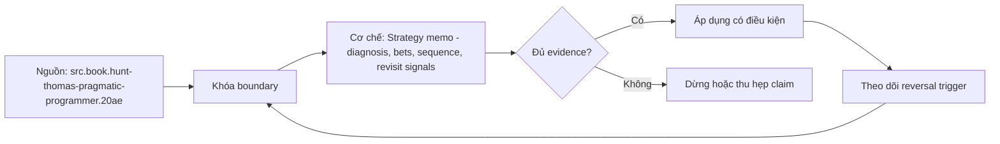

# Strategy memo - diagnosis, bets, sequence, revisit signals

> [!abstract] Câu hỏi trung tâm
> Làm thế nào thiết kế, kiểm chứng và bảo vệ strategy memo gồm diagnosis, bets, sequence và revisit signals mà không khẳng định vượt quá evidence?

## 1. Mechanism

Mô hình strategy memo gồm diagnosis, bets, sequence và revisit signals phải nêu actors, identities, state transitions và decision authority thay vì liệt kê công cụ. Đừng bắt đầu bằng tên công cụ. Hãy bắt đầu bằng đối tượng được bảo vệ, boundary quan sát được và hậu quả nếu kết luận sai. Trong bài `Strategy memo - diagnosis, bets, sequence, revisit signals`, câu hỏi thực dụng là: Làm thế nào thiết kế, kiểm chứng và bảo vệ strategy memo gồm diagnosis, bets, sequence và revisit signals mà không khẳng định vượt quá evidence? Ta ghi rõ grain, population, time window, owner và hành động sau failure; nếu một trường chưa biết thì đánh dấu unknown thay vì lấp bằng mặc định. Bằng chứng tối thiểu gồm fixture có version, cấu hình hoặc rule đã resolve, raw observation, expected result và limitation. Phần này là curriculum synthesis dựa trên các nguồn đã định danh, không phải lời hứa rằng mọi adapter hay deployment đều có cùng hành vi.

## 2. Boundary

Kết luận về strategy memo gồm diagnosis, bets, sequence và revisit signals chỉ đúng trong audience, workload, trust boundary, time window và version đã khóa. Điểm khó không nằm ở cú pháp mà ở identity và scope. Hai phép đo cùng tên vẫn có thể nói về hai population hoặc hai thời điểm khác nhau. Trong bài `Strategy memo - diagnosis, bets, sequence, revisit signals`, câu hỏi thực dụng là: Làm thế nào thiết kế, kiểm chứng và bảo vệ strategy memo gồm diagnosis, bets, sequence và revisit signals mà không khẳng định vượt quá evidence? Ta ghi rõ grain, population, time window, owner và hành động sau failure; nếu một trường chưa biết thì đánh dấu unknown thay vì lấp bằng mặc định. Bằng chứng tối thiểu gồm fixture có version, cấu hình hoặc rule đã resolve, raw observation, expected result và limitation. Phần này là curriculum synthesis dựa trên các nguồn đã định danh, không phải lời hứa rằng mọi adapter hay deployment đều có cùng hành vi.

## 3. Failure mode

Phân tích strategy memo gồm diagnosis, bets, sequence và revisit signals cần tìm earliest failure, propagation path, blast radius và state hoặc claim còn đáng tin. Một dashboard xanh chỉ là tín hiệu. Muốn biến nó thành bằng chứng phải giữ input, phiên bản, rule, trạng thái trước–sau và cách tính độc lập. Trong bài `Strategy memo - diagnosis, bets, sequence, revisit signals`, câu hỏi thực dụng là: Làm thế nào thiết kế, kiểm chứng và bảo vệ strategy memo gồm diagnosis, bets, sequence và revisit signals mà không khẳng định vượt quá evidence? Ta ghi rõ grain, population, time window, owner và hành động sau failure; nếu một trường chưa biết thì đánh dấu unknown thay vì lấp bằng mặc định. Bằng chứng tối thiểu gồm fixture có version, cấu hình hoặc rule đã resolve, raw observation, expected result và limitation. Phần này là curriculum synthesis dựa trên các nguồn đã định danh, không phải lời hứa rằng mọi adapter hay deployment đều có cùng hành vi.

## 4. Decision rule

Quyết định về strategy memo gồm diagnosis, bets, sequence và revisit signals phải nối quantified constraints với alternatives, trade-offs và reversal trigger. Thiết kế tốt phải chịu được counterexample. Hãy chủ động tạo case sát boundary, case thiếu dữ liệu và case replay thay vì chỉ chạy happy path. Trong bài `Strategy memo - diagnosis, bets, sequence, revisit signals`, câu hỏi thực dụng là: Làm thế nào thiết kế, kiểm chứng và bảo vệ strategy memo gồm diagnosis, bets, sequence và revisit signals mà không khẳng định vượt quá evidence? Ta ghi rõ grain, population, time window, owner và hành động sau failure; nếu một trường chưa biết thì đánh dấu unknown thay vì lấp bằng mặc định. Bằng chứng tối thiểu gồm fixture có version, cấu hình hoặc rule đã resolve, raw observation, expected result và limitation. Phần này là curriculum synthesis dựa trên các nguồn đã định danh, không phải lời hứa rằng mọi adapter hay deployment đều có cùng hành vi.

## 5. Evidence

Bằng chứng cho strategy memo gồm diagnosis, bets, sequence và revisit signals gồm inputs có version, stable identity, raw observations, reviewer-visible limitations và independent oracle. Chi phí vận hành thuộc contract. Một rule đúng nhưng quá đắt, quá ồn hoặc không có owner sẽ nhanh chóng bị tắt và mất tác dụng. Trong bài `Strategy memo - diagnosis, bets, sequence, revisit signals`, câu hỏi thực dụng là: Làm thế nào thiết kế, kiểm chứng và bảo vệ strategy memo gồm diagnosis, bets, sequence và revisit signals mà không khẳng định vượt quá evidence? Ta ghi rõ grain, population, time window, owner và hành động sau failure; nếu một trường chưa biết thì đánh dấu unknown thay vì lấp bằng mặc định. Bằng chứng tối thiểu gồm fixture có version, cấu hình hoặc rule đã resolve, raw observation, expected result và limitation. Phần này là curriculum synthesis dựa trên các nguồn đã định danh, không phải lời hứa rằng mọi adapter hay deployment đều có cùng hành vi.

## 6. Transfer test

Bài thực hành strategy memo gồm diagnosis, bets, sequence và revisit signals phải đổi một constraint hoặc inject counterexample rồi bảo vệ hoặc đảo quyết định bằng evidence. Kết luận cần có điều kiện đảo chiều. Khi volume, latency, nguồn thẩm quyền hoặc topology đổi, quyết định cũ phải được xem xét lại bằng cùng một oracle. Trong bài `Strategy memo - diagnosis, bets, sequence, revisit signals`, câu hỏi thực dụng là: Làm thế nào thiết kế, kiểm chứng và bảo vệ strategy memo gồm diagnosis, bets, sequence và revisit signals mà không khẳng định vượt quá evidence? Ta ghi rõ grain, population, time window, owner và hành động sau failure; nếu một trường chưa biết thì đánh dấu unknown thay vì lấp bằng mặc định. Bằng chứng tối thiểu gồm fixture có version, cấu hình hoặc rule đã resolve, raw observation, expected result và limitation. Phần này là curriculum synthesis dựa trên các nguồn đã định danh, không phải lời hứa rằng mọi adapter hay deployment đều có cùng hành vi.

## 7. Ma trận kiểm chứng từng mệnh đề

Với `wiki.staff.strategy-memo`, command thành công không tự chứng minh dữ liệu đúng. Protocol riêng của bài là: Run a version-pinned model, evaluation corpus or review simulation, change one material constraint, retain raw evidence and reconcile the recommendation against an independent rubric or invariant oracle. Mỗi probe dưới đây phải nối input boundary với failure signal và oracle có thể phản bác kết luận.

### 7.1. Strategy memo - diagnosis, bets, sequence, revisit signals: kiểm `Mechanism` bằng case 1, cụ thể mô hình strategy memo gồm diagnosis, bets, sequence và revisit signals phải nêu actors, identities, state transitions và decision authority thay vì liệt kê công cụ

**Mệnh đề cần kiểm.** Strategy memo - diagnosis, bets, sequence, revisit signals: kiểm `Mechanism` bằng case 1, cụ thể mô hình strategy memo gồm diagnosis, bets, sequence và revisit signals phải nêu actors, identities, state transitions và decision authority thay vì liệt kê công cụ.

**Thiết kế phép thử cho `wiki.staff.strategy-memo`.** Trong ngữ cảnh `wiki.staff.strategy-memo`, tạo positive control và negative control chỉ khác đúng một điều kiện. Khóa input snapshot, phiên bản và owner của rule; chạy đúng population được bài `Strategy memo - diagnosis, bets, sequence, revisit signals` công bố.

**Bằng chứng cần giữ.** Đối với probe 1 của `Strategy memo - diagnosis, bets, sequence, revisit signals`, giữ fixture, raw failing rows và lệnh tái hiện. Nếu chưa chạy lab, ghi expected evidence và giữ trạng thái review; không biến protocol thành observation.

### 7.2. Strategy memo - diagnosis, bets, sequence, revisit signals: kiểm `Boundary` bằng case 2, cụ thể kết luận về strategy memo gồm diagnosis, bets, sequence và revisit signals chỉ đúng trong audience, workload, trust boundary, time window và version đã khóa

**Mệnh đề cần kiểm.** Strategy memo - diagnosis, bets, sequence, revisit signals: kiểm `Boundary` bằng case 2, cụ thể kết luận về strategy memo gồm diagnosis, bets, sequence và revisit signals chỉ đúng trong audience, workload, trust boundary, time window và version đã khóa.

**Thiết kế phép thử cho `wiki.staff.strategy-memo`.** Trong ngữ cảnh `wiki.staff.strategy-memo`, đổi grain nhưng giữ tổng số dòng để lộ phép đo sai cấp. Khóa input snapshot, phiên bản và owner của rule; chạy đúng population được bài `Strategy memo - diagnosis, bets, sequence, revisit signals` công bố.

**Bằng chứng cần giữ.** Đối với probe 2 của `Strategy memo - diagnosis, bets, sequence, revisit signals`, báo numerator, denominator và key set ở cả hai grain. Nếu chưa chạy lab, ghi expected evidence và giữ trạng thái review; không biến protocol thành observation.

### 7.3. Strategy memo - diagnosis, bets, sequence, revisit signals: kiểm `Failure mode` bằng case 3, cụ thể phân tích strategy memo gồm diagnosis, bets, sequence và revisit signals cần tìm earliest failure, propagation path, blast radius và state hoặc claim còn đáng tin

**Mệnh đề cần kiểm.** Strategy memo - diagnosis, bets, sequence, revisit signals: kiểm `Failure mode` bằng case 3, cụ thể phân tích strategy memo gồm diagnosis, bets, sequence và revisit signals cần tìm earliest failure, propagation path, blast radius và state hoặc claim còn đáng tin.

**Thiết kế phép thử cho `wiki.staff.strategy-memo`.** Trong ngữ cảnh `wiki.staff.strategy-memo`, đưa một giá trị tới đúng boundary và một giá trị vượt boundary. Khóa input snapshot, phiên bản và owner của rule; chạy đúng population được bài `Strategy memo - diagnosis, bets, sequence, revisit signals` công bố.

**Bằng chứng cần giữ.** Đối với probe 3 của `Strategy memo - diagnosis, bets, sequence, revisit signals`, lưu hai observed values cùng rule đã resolve. Nếu chưa chạy lab, ghi expected evidence và giữ trạng thái review; không biến protocol thành observation.

### 7.4. Strategy memo - diagnosis, bets, sequence, revisit signals: kiểm `Decision rule` bằng case 4, cụ thể quyết định về strategy memo gồm diagnosis, bets, sequence và revisit signals phải nối quantified constraints với alternatives, trade-offs và reversal trigger

**Mệnh đề cần kiểm.** Strategy memo - diagnosis, bets, sequence, revisit signals: kiểm `Decision rule` bằng case 4, cụ thể quyết định về strategy memo gồm diagnosis, bets, sequence và revisit signals phải nối quantified constraints với alternatives, trade-offs và reversal trigger.

**Thiết kế phép thử cho `wiki.staff.strategy-memo`.** Trong ngữ cảnh `wiki.staff.strategy-memo`, kill tiến trình ngay trước rồi ngay sau durable side effect. Khóa input snapshot, phiên bản và owner của rule; chạy đúng population được bài `Strategy memo - diagnosis, bets, sequence, revisit signals` công bố.

**Bằng chứng cần giữ.** Đối với probe 4 của `Strategy memo - diagnosis, bets, sequence, revisit signals`, lưu checkpoint, external ledger và trạng thái sau restart. Nếu chưa chạy lab, ghi expected evidence và giữ trạng thái review; không biến protocol thành observation.

### 7.5. Strategy memo - diagnosis, bets, sequence, revisit signals: kiểm `Evidence` bằng case 5, cụ thể bằng chứng cho strategy memo gồm diagnosis, bets, sequence và revisit signals gồm inputs có version, stable identity, raw observations, reviewer-visible limitations và independent oracle

**Mệnh đề cần kiểm.** Strategy memo - diagnosis, bets, sequence, revisit signals: kiểm `Evidence` bằng case 5, cụ thể bằng chứng cho strategy memo gồm diagnosis, bets, sequence và revisit signals gồm inputs có version, stable identity, raw observations, reviewer-visible limitations và independent oracle.

**Thiết kế phép thử cho `wiki.staff.strategy-memo`.** Trong ngữ cảnh `wiki.staff.strategy-memo`, đảo thứ tự input và concurrency nhưng giữ logical population. Khóa input snapshot, phiên bản và owner của rule; chạy đúng population được bài `Strategy memo - diagnosis, bets, sequence, revisit signals` công bố.

**Bằng chứng cần giữ.** Đối với probe 5 của `Strategy memo - diagnosis, bets, sequence, revisit signals`, so canonical hash và business totals giữa các thứ tự. Nếu chưa chạy lab, ghi expected evidence và giữ trạng thái review; không biến protocol thành observation.

### 7.6. Strategy memo - diagnosis, bets, sequence, revisit signals: kiểm `Transfer test` bằng case 6, cụ thể bài thực hành strategy memo gồm diagnosis, bets, sequence và revisit signals phải đổi một constraint hoặc inject counterexample rồi bảo vệ hoặc đảo quyết định bằng evidence

**Mệnh đề cần kiểm.** Strategy memo - diagnosis, bets, sequence, revisit signals: kiểm `Transfer test` bằng case 6, cụ thể bài thực hành strategy memo gồm diagnosis, bets, sequence và revisit signals phải đổi một constraint hoặc inject counterexample rồi bảo vệ hoặc đảo quyết định bằng evidence.

**Thiết kế phép thử cho `wiki.staff.strategy-memo`.** Trong ngữ cảnh `wiki.staff.strategy-memo`, replay cùng identity với payload giống rồi payload xung đột. Khóa input snapshot, phiên bản và owner của rule; chạy đúng population được bài `Strategy memo - diagnosis, bets, sequence, revisit signals` công bố.

**Bằng chứng cần giữ.** Đối với probe 6 của `Strategy memo - diagnosis, bets, sequence, revisit signals`, tách duplicate replay khỏi identity collision bằng reason code. Nếu chưa chạy lab, ghi expected evidence và giữ trạng thái review; không biến protocol thành observation.

### 7.7. Strategy memo - diagnosis, bets, sequence, revisit signals: kiểm `Mechanism` bằng case 7, cụ thể mô hình strategy memo gồm diagnosis, bets, sequence và revisit signals phải nêu actors, identities, state transitions và decision authority thay vì liệt kê công cụ

**Mệnh đề cần kiểm.** Strategy memo - diagnosis, bets, sequence, revisit signals: kiểm `Mechanism` bằng case 7, cụ thể mô hình strategy memo gồm diagnosis, bets, sequence và revisit signals phải nêu actors, identities, state transitions và decision authority thay vì liệt kê công cụ.

**Thiết kế phép thử cho `wiki.staff.strategy-memo`.** Trong ngữ cảnh `wiki.staff.strategy-memo`, thêm record tới trễ trong horizon và ngoài horizon. Khóa input snapshot, phiên bản và owner của rule; chạy đúng population được bài `Strategy memo - diagnosis, bets, sequence, revisit signals` công bố.

**Bằng chứng cần giữ.** Đối với probe 7 của `Strategy memo - diagnosis, bets, sequence, revisit signals`, báo accepted-late, rejected-late và oldest outstanding timestamp. Nếu chưa chạy lab, ghi expected evidence và giữ trạng thái review; không biến protocol thành observation.

### 7.8. Strategy memo - diagnosis, bets, sequence, revisit signals: kiểm `Boundary` bằng case 8, cụ thể kết luận về strategy memo gồm diagnosis, bets, sequence và revisit signals chỉ đúng trong audience, workload, trust boundary, time window và version đã khóa

**Mệnh đề cần kiểm.** Strategy memo - diagnosis, bets, sequence, revisit signals: kiểm `Boundary` bằng case 8, cụ thể kết luận về strategy memo gồm diagnosis, bets, sequence và revisit signals chỉ đúng trong audience, workload, trust boundary, time window và version đã khóa.

**Thiết kế phép thử cho `wiki.staff.strategy-memo`.** Trong ngữ cảnh `wiki.staff.strategy-memo`, đổi schema theo một cách tương thích rồi một cách phá vỡ semantics. Khóa input snapshot, phiên bản và owner của rule; chạy đúng population được bài `Strategy memo - diagnosis, bets, sequence, revisit signals` công bố.

**Bằng chứng cần giữ.** Đối với probe 8 của `Strategy memo - diagnosis, bets, sequence, revisit signals`, giữ schema diff, classification và consumer-visible result. Nếu chưa chạy lab, ghi expected evidence và giữ trạng thái review; không biến protocol thành observation.

### 7.9. Strategy memo - diagnosis, bets, sequence, revisit signals: kiểm `Failure mode` bằng case 9, cụ thể phân tích strategy memo gồm diagnosis, bets, sequence và revisit signals cần tìm earliest failure, propagation path, blast radius và state hoặc claim còn đáng tin

**Mệnh đề cần kiểm.** Strategy memo - diagnosis, bets, sequence, revisit signals: kiểm `Failure mode` bằng case 9, cụ thể phân tích strategy memo gồm diagnosis, bets, sequence và revisit signals cần tìm earliest failure, propagation path, blast radius và state hoặc claim còn đáng tin.

**Thiết kế phép thử cho `wiki.staff.strategy-memo`.** Trong ngữ cảnh `wiki.staff.strategy-memo`, tạo missing và duplicate bù nhau để count tổng không đổi. Khóa input snapshot, phiên bản và owner của rule; chạy đúng population được bài `Strategy memo - diagnosis, bets, sequence, revisit signals` công bố.

**Bằng chứng cần giữ.** Đối với probe 9 của `Strategy memo - diagnosis, bets, sequence, revisit signals`, so key multiset và typed hashes thay vì chỉ row count. Nếu chưa chạy lab, ghi expected evidence và giữ trạng thái review; không biến protocol thành observation.

### 7.10. Strategy memo - diagnosis, bets, sequence, revisit signals: kiểm `Decision rule` bằng case 10, cụ thể quyết định về strategy memo gồm diagnosis, bets, sequence và revisit signals phải nối quantified constraints với alternatives, trade-offs và reversal trigger

**Mệnh đề cần kiểm.** Strategy memo - diagnosis, bets, sequence, revisit signals: kiểm `Decision rule` bằng case 10, cụ thể quyết định về strategy memo gồm diagnosis, bets, sequence và revisit signals phải nối quantified constraints với alternatives, trade-offs và reversal trigger.

**Thiết kế phép thử cho `wiki.staff.strategy-memo`.** Trong ngữ cảnh `wiki.staff.strategy-memo`, cho reviewer tái hiện chỉ từ evidence package. Khóa input snapshot, phiên bản và owner của rule; chạy đúng population được bài `Strategy memo - diagnosis, bets, sequence, revisit signals` công bố.

**Bằng chứng cần giữ.** Đối với probe 10 của `Strategy memo - diagnosis, bets, sequence, revisit signals`, package phải đủ để người khác dựng lại decision và limitation. Nếu chưa chạy lab, ghi expected evidence và giữ trạng thái review; không biến protocol thành observation.

### 7.11. Strategy memo - diagnosis, bets, sequence, revisit signals: kiểm `Evidence` bằng case 11, cụ thể bằng chứng cho strategy memo gồm diagnosis, bets, sequence và revisit signals gồm inputs có version, stable identity, raw observations, reviewer-visible limitations và independent oracle

**Mệnh đề cần kiểm.** Strategy memo - diagnosis, bets, sequence, revisit signals: kiểm `Evidence` bằng case 11, cụ thể bằng chứng cho strategy memo gồm diagnosis, bets, sequence và revisit signals gồm inputs có version, stable identity, raw observations, reviewer-visible limitations và independent oracle.

**Thiết kế phép thử cho `wiki.staff.strategy-memo`.** Trong ngữ cảnh `wiki.staff.strategy-memo`, so với oracle độc lập không dùng chung query hoặc parser. Khóa input snapshot, phiên bản và owner của rule; chạy đúng population được bài `Strategy memo - diagnosis, bets, sequence, revisit signals` công bố.

**Bằng chứng cần giữ.** Đối với probe 11 của `Strategy memo - diagnosis, bets, sequence, revisit signals`, independent result phải khớp ở grain đã công bố. Nếu chưa chạy lab, ghi expected evidence và giữ trạng thái review; không biến protocol thành observation.

### 7.12. Strategy memo - diagnosis, bets, sequence, revisit signals: kiểm `Transfer test` bằng case 12, cụ thể bài thực hành strategy memo gồm diagnosis, bets, sequence và revisit signals phải đổi một constraint hoặc inject counterexample rồi bảo vệ hoặc đảo quyết định bằng evidence

**Mệnh đề cần kiểm.** Strategy memo - diagnosis, bets, sequence, revisit signals: kiểm `Transfer test` bằng case 12, cụ thể bài thực hành strategy memo gồm diagnosis, bets, sequence và revisit signals phải đổi một constraint hoặc inject counterexample rồi bảo vệ hoặc đảo quyết định bằng evidence.

**Thiết kế phép thử cho `wiki.staff.strategy-memo`.** Trong ngữ cảnh `wiki.staff.strategy-memo`, chạy scope hẹp và population đầy đủ rồi công bố phần bị loại. Khóa input snapshot, phiên bản và owner của rule; chạy đúng population được bài `Strategy memo - diagnosis, bets, sequence, revisit signals` công bố.

**Bằng chứng cần giữ.** Đối với probe 12 của `Strategy memo - diagnosis, bets, sequence, revisit signals`, coverage phải nêu rõ excluded nodes, partitions hoặc incidents. Nếu chưa chạy lab, ghi expected evidence và giữ trạng thái review; không biến protocol thành observation.

### 7.13. Strategy memo - diagnosis, bets, sequence, revisit signals: kiểm `Mechanism` bằng case 13, cụ thể mô hình strategy memo gồm diagnosis, bets, sequence và revisit signals phải nêu actors, identities, state transitions và decision authority thay vì liệt kê công cụ

**Mệnh đề cần kiểm.** Strategy memo - diagnosis, bets, sequence, revisit signals: kiểm `Mechanism` bằng case 13, cụ thể mô hình strategy memo gồm diagnosis, bets, sequence và revisit signals phải nêu actors, identities, state transitions và decision authority thay vì liệt kê công cụ.

**Thiết kế phép thử cho `wiki.staff.strategy-memo`.** Trong ngữ cảnh `wiki.staff.strategy-memo`, thử timezone, precision hoặc partition ở hai phía của ranh giới. Khóa input snapshot, phiên bản và owner của rule; chạy đúng population được bài `Strategy memo - diagnosis, bets, sequence, revisit signals` công bố.

**Bằng chứng cần giữ.** Đối với probe 13 của `Strategy memo - diagnosis, bets, sequence, revisit signals`, UTC/local interval và rounding policy phải hiện trong output. Nếu chưa chạy lab, ghi expected evidence và giữ trạng thái review; không biến protocol thành observation.

### 7.14. Strategy memo - diagnosis, bets, sequence, revisit signals: kiểm `Boundary` bằng case 14, cụ thể kết luận về strategy memo gồm diagnosis, bets, sequence và revisit signals chỉ đúng trong audience, workload, trust boundary, time window và version đã khóa

**Mệnh đề cần kiểm.** Strategy memo - diagnosis, bets, sequence, revisit signals: kiểm `Boundary` bằng case 14, cụ thể kết luận về strategy memo gồm diagnosis, bets, sequence và revisit signals chỉ đúng trong audience, workload, trust boundary, time window và version đã khóa.

**Thiết kế phép thử cho `wiki.staff.strategy-memo`.** Trong ngữ cảnh `wiki.staff.strategy-memo`, đổi constraint đủ lớn để quyết định phải đảo. Khóa input snapshot, phiên bản và owner của rule; chạy đúng population được bài `Strategy memo - diagnosis, bets, sequence, revisit signals` công bố.

**Bằng chứng cần giữ.** Đối với probe 14 của `Strategy memo - diagnosis, bets, sequence, revisit signals`, ADR phải lưu changed constraint và reversal threshold. Nếu chưa chạy lab, ghi expected evidence và giữ trạng thái review; không biến protocol thành observation.

### 7.15. Strategy memo - diagnosis, bets, sequence, revisit signals: kiểm `Failure mode` bằng case 15, cụ thể phân tích strategy memo gồm diagnosis, bets, sequence và revisit signals cần tìm earliest failure, propagation path, blast radius và state hoặc claim còn đáng tin

**Mệnh đề cần kiểm.** Strategy memo - diagnosis, bets, sequence, revisit signals: kiểm `Failure mode` bằng case 15, cụ thể phân tích strategy memo gồm diagnosis, bets, sequence và revisit signals cần tìm earliest failure, propagation path, blast radius và state hoặc claim còn đáng tin.

**Thiết kế phép thử cho `wiki.staff.strategy-memo`.** Trong ngữ cảnh `wiki.staff.strategy-memo`, chạy lại từ môi trường sạch với versions và seed đã khóa. Khóa input snapshot, phiên bản và owner của rule; chạy đúng population được bài `Strategy memo - diagnosis, bets, sequence, revisit signals` công bố.

**Bằng chứng cần giữ.** Đối với probe 15 của `Strategy memo - diagnosis, bets, sequence, revisit signals`, canonical result phải ổn định hoặc mọi nondeterminism phải được giải thích. Nếu chưa chạy lab, ghi expected evidence và giữ trạng thái review; không biến protocol thành observation.

## 8. Quy trình phản biện

1. Viết consumer-visible invariant cho `Strategy memo - diagnosis, bets, sequence, revisit signals` trước khi chọn query hoặc tool.
2. Khóa grain, identity, population, time window và authoritative source.
3. Phân biệt declared configuration, executed state và published state.
4. Chạy negative control, replay hoặc changed-assumption case phù hợp.
5. Đối soát bằng oracle độc lập; công bố coverage và phần không quan sát được.
6. Gắn owner, hành động, reversal trigger và hạn review cho kết luận.

## 9. Câu hỏi tự kiểm tra

1. `Strategy memo - diagnosis, bets, sequence, revisit signals: kiểm `Mechanism` bằng case 1, cụ thể mô hình strategy memo gồm diagnosis, bets, sequence và revisit signals phải nêu actors, identities, state transitions và decision authority thay vì liệt kê công cụ` thất bại đầu tiên ở boundary nào?
2. Artifact nào mạnh nhất để trả lời `Strategy memo - diagnosis, bets, sequence, revisit signals: kiểm `Failure mode` bằng case 3, cụ thể phân tích strategy memo gồm diagnosis, bets, sequence và revisit signals cần tìm earliest failure, propagation path, blast radius và state hoặc claim còn đáng tin`?
3. Counterexample nhỏ nhất cho `Strategy memo - diagnosis, bets, sequence, revisit signals: kiểm `Transfer test` bằng case 6, cụ thể bài thực hành strategy memo gồm diagnosis, bets, sequence và revisit signals phải đổi một constraint hoặc inject counterexample rồi bảo vệ hoặc đảo quyết định bằng evidence` gồm những state nào?
4. `Strategy memo - diagnosis, bets, sequence, revisit signals: kiểm `Failure mode` bằng case 9, cụ thể phân tích strategy memo gồm diagnosis, bets, sequence và revisit signals cần tìm earliest failure, propagation path, blast radius và state hoặc claim còn đáng tin` có thể xanh giả ra sao?
5. Constraint nào khiến quyết định ở `Strategy memo - diagnosis, bets, sequence, revisit signals: kiểm `Boundary` bằng case 14, cụ thể kết luận về strategy memo gồm diagnosis, bets, sequence và revisit signals chỉ đúng trong audience, workload, trust boundary, time window và version đã khóa` phải đảo?
6. Phần nào của `Strategy memo - diagnosis, bets, sequence, revisit signals: kiểm `Failure mode` bằng case 15, cụ thể phân tích strategy memo gồm diagnosis, bets, sequence và revisit signals cần tìm earliest failure, propagation path, blast radius và state hoặc claim còn đáng tin` mới là protocol, chưa phải observation?

## 10. Giới hạn và điều chưa cho phép kết luận

- Lab của `Strategy memo - diagnosis, bets, sequence, revisit signals` chưa chạy trên hệ thống production; nội dung là giáo trình và expected evidence.
- Hành vi phụ thuộc phiên bản, connector, scheduler, warehouse và catalog configuration phải được kiểm lại.
- Các ma trận, ladder và threshold do giáo trình tổng hợp không được gán nguyên văn cho vendor.
- Note giữ trạng thái `review` cho tới khi owner duyệt semantics và learner artifact.

## Reference
1. [[SRC-HUNT-THOMAS-PRAGMATIC-PROGRAMMER-20AE]]
2. [[SRC-MADR-TEMPLATES]]

## Source coverage

| Source slice | Nội dung sử dụng | Trạng thái |
|---|---|---|
| [[SRC-HUNT-THOMAS-PRAGMATIC-PROGRAMMER-20AE]] | Contract hoặc cơ chế liên quan trực tiếp tới `Strategy memo - diagnosis, bets, sequence, revisit signals` | Đã đọc locator; cần pin version khi chạy lab |
| [[SRC-MADR-TEMPLATES]] | Contract hoặc cơ chế liên quan trực tiếp tới `Strategy memo - diagnosis, bets, sequence, revisit signals` | Đã đọc locator; cần pin version khi chạy lab |

## Key takeaways
- Strategy memo gồm diagnosis, bets, sequence và revisit signals phải được bảo vệ bằng explicit boundary, changed-constraint test và evidence có thể phản bác.
- Với `wiki.staff.strategy-memo`, quality của kết luận phụ thuộc identity, coverage và oracle chứ không phụ thuộc màu dashboard.
- Câu hỏi `Làm thế nào thiết kế, kiểm chứng và bảo vệ strategy memo gồm diagnosis, bets, sequence và revisit signals mà không khẳng định vượt quá evidence?` chỉ được trả lời trong scope và version đã ghi.
- Các source IDs `src.book.hunt-thomas-pragmatic-programmer.20ae, src.web.madr-templates` đặt ranh giới cho source fact; phần còn lại là synthesis có nhãn.
- Trước khi lab chạy, đây là note đã kiểm cấu trúc và provenance, chưa phải chứng nhận production.

<!-- ATOMIC-EXECUTION-CAPSULE:START -->

## Execution capsule — kiểm chứng `wiki.staff.strategy-memo`

> [!important] Phân loại mệnh đề
> Với `wiki.staff.strategy-memo`, sơ đồ, ví dụ và artifact về **Strategy memo - diagnosis, bets, sequence, revisit signals** là **synthesis để kiểm chứng**; chúng không phải trích dẫn hay case nguyên văn của nguồn.

### Sơ đồ cơ chế và điểm kiểm soát



Đọc sơ đồ `wiki.staff.strategy-memo` từ trái sang phải: source chỉ cung cấp claim ban đầu cho **Strategy memo - diagnosis, bets, sequence, revisit signals**; quyết định chỉ được đi tiếp sau khi boundary, evidence và điều kiện đảo quyết định đã hiện hữu.

### Artifact thực thi tối thiểu

```sql
-- Verification harness for: Strategy memo - diagnosis, bets, sequence, revisit signals
WITH evidence AS (
    SELECT 'wiki.staff.strategy-memo' AS concept_id,
           'boundary_declared' AS check_name, 1 AS passed
    UNION ALL
    SELECT 'wiki.staff.strategy-memo', 'independent_oracle', 1
    UNION ALL
    SELECT 'wiki.staff.strategy-memo', 'reversal_trigger_recorded', 1
)
SELECT concept_id,
       MIN(passed) AS all_hard_checks_pass,
       COUNT(*) AS evidence_items
FROM evidence
GROUP BY concept_id
HAVING MIN(passed) = 1;
```

Artifact của `wiki.staff.strategy-memo` buộc người dùng ghi boundary, oracle và reversal trigger cho **Strategy memo - diagnosis, bets, sequence, revisit signals**. Các giá trị minh họa phải được thay bằng evidence thật trước khi dùng cho quyết định.

### Tự kiểm tra trước khi tái sử dụng

1. Bạn có thể trả lời `Làm thế nào thiết kế, kiểm chứng và bảo vệ strategy memo gồm diagnosis, bets, sequence và revisit signals mà không khẳng định vượt quá evidence?` bằng một câu mà không kéo thêm concept thứ hai không?
2. Source locator nào đỡ cho claim, và phần nào chỉ là synthesis trong note?
3. Observation nào khiến bạn dừng, thu hẹp hoặc đảo quyết định?
4. Artifact nào cho phép một reviewer độc lập tái hiện kết quả?

<!-- ATOMIC-EXECUTION-CAPSULE:END -->
