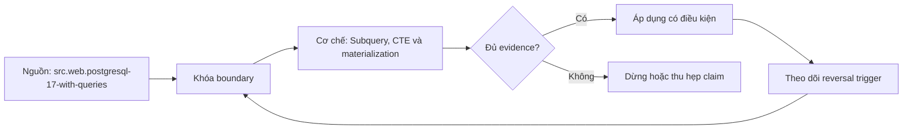

# Subquery, CTE và materialization

> [!abstract] Câu hỏi trung tâm
> Mỗi query block tạo quan hệ nào, grain nào, được optimizer gộp hay materialize ra sao, và evidence nào chứng minh bản refactor giữ nguyên kết quả lẫn đặc tính vận hành?

## 1. Query block là một ranh giới suy luận

Một subquery hoặc CTE tạo ra một quan hệ trung gian có schema, row set và grain. Giá trị lớn nhất của việc phân rã không nằm ở số dòng SQL ngắn hơn, mà ở khả năng đặt tên cho từng bước và kiểm tra invariant tại ranh giới. Tên `orders_by_customer_month` chứa nhiều thông tin hơn `t1`; tên tốt nói entity, thời gian và mức tổng hợp.

Mỗi block nên có hợp đồng: grain, key dự kiến, cột measure, điều kiện lọc, cardinality đầu ra và lý do tồn tại. Nếu không diễn đạt được hợp đồng, việc tách CTE chỉ dời sự phức tạp từ một biểu thức sang nhiều tên tạm.

Ranh giới logic không nhất thiết là ranh giới vật lý. PostgreSQL có thể fold CTE vào query cha hoặc materialize nó. Vì vậy không dùng hình dạng câu lệnh để khẳng định cách engine chạy; phải đọc plan trên phiên bản và dữ liệu cụ thể.

## 2. Scalar, row và table subquery

Scalar subquery phải trả tối đa một dòng và một cột; không dòng thường cho NULL, nhiều hơn một dòng gây lỗi. Muốn dùng an toàn, cardinality phải được chứng minh bằng unique key, aggregate hoặc predicate đủ mạnh. `LIMIT 1` không chứng minh đúng bản ghi nếu không có ordering và tie policy.

Row subquery tạo một row value để so sánh; table subquery nằm trong `FROM` và tham gia pipeline như một relation. Derived table cần alias. Correlated subquery tham chiếu cột từ query ngoài, nên nghĩa của nó phụ thuộc từng outer row; optimizer có thể decorrelate nhưng không nên giả định.

Subquery trong `SELECT` dễ tạo N lần lookup nếu không được tối ưu. Subquery trong `FROM` giúp biểu đạt grain stage. `EXISTS` phù hợp với câu hỏi tồn tại và giữ grain phía ngoài; join phù hợp khi cần cột phía trong nhưng có thể nhân dòng.

## 3. IN, EXISTS và NULL

`IN (subquery)` kiểm membership theo three-valued logic. Nếu không có equality TRUE nhưng subquery chứa NULL, kết quả có thể UNKNOWN. `NOT IN` đặc biệt nguy hiểm: một NULL ở tập phải có thể làm mọi candidate không match trở thành UNKNOWN và bị `WHERE` loại.

`NOT EXISTS` thường biểu đạt anti-semi join rõ hơn: với mỗi outer row, kiểm không tồn tại right row thỏa condition. Nó không bị một unrelated NULL trong tập phải đầu độc toàn bộ kết quả. Tuy nhiên comparison trong correlated condition vẫn cần NULL policy.

Không máy móc đổi `IN` thành `EXISTS` vì lời truyền miệng về performance. Chọn theo semantics, rồi kiểm plan. Test bắt buộc có right set rỗng, duplicate, NULL và outer key NULL.

## 4. CTE như tên cho quan hệ trung gian

`WITH` cho phép định nghĩa một hoặc nhiều auxiliary statements dùng trong primary statement. CTE giúp đặt tên theo domain, tách stages và tái sử dụng một kết quả logic. Một chuỗi CTE tốt đọc như dataflow: source → validated → enriched → aggregated → final.

Thứ tự khai báo phải phản ánh dependency. Mỗi CTE chỉ project cột cần thiết hoặc cột audit có chủ đích. `SELECT *` làm contract mờ, dễ kéo cột mới và tăng bề rộng materialized result.

CTE không tự tạo index hoặc persistence. Nó thuộc phạm vi statement. Nếu cần tái sử dụng giữa statements, statistics riêng hoặc index, cân nhắc temporary/table/materialized view với lifecycle rõ.

## 5. Đặt tên theo grain

Tên `customer_month_revenue` cho thấy mỗi row/customer-month. `filtered_orders` chỉ nói thao tác, chưa nói grain có đổi không. Có thể kết hợp state và grain: `paid_order_line`, `payment_by_order`, `customer_month_metric`.

Ngay sau tên, comment ngắn ghi key và invariant. Ví dụ `-- grain: one row per order_id; unique(order_id) expected`. Trong lab, năm CTE của truy vấn 80 dòng phải có năm grain statements. Nếu hai CTE liên tiếp cùng grain, giải thích transformation; nếu grain đổi, chỉ ra operator gây đổi.

Tránh `tmp`, `data`, `final2`. Tên sai còn nguy hiểm hơn tên ngắn vì tạo kỳ vọng cardinality sai. Review đối chiếu tên với `count(*)` và `count(distinct key)`.

## 6. Folding và materialization trong PostgreSQL 17

Một CTE không đệ quy, không side effect, được tham chiếu một lần thường có thể fold vào parent query. Optimizer khi đó nhìn xuyên ranh giới và push predicate. CTE được tham chiếu nhiều lần thường được evaluate một lần và materialize; điều này tránh tính expression đắt lặp lại nhưng có thể ngăn restriction từ từng consumer đi xuống scan gốc.

`MATERIALIZED` buộc calculation riêng; `NOT MATERIALIZED` yêu cầu merge vào parent trong các trường hợp cho phép. `NOT MATERIALIZED` có thể lặp computation nếu nhiều reference, nhưng cho phép mỗi consumer chỉ đọc phần cần. Không có lựa chọn mặc định tốt cho mọi query.

Quy tắc này là của PostgreSQL 17. SQL Server, Oracle, BigQuery, Snowflake và các phiên bản khác có optimizer semantics khác. Không viết “CTE luôn là optimization fence” hoặc “CTE luôn miễn phí”.

## 7. Ví dụ pushdown blocker

Giả sử bảng `big_table` lớn và CTE `w` được dùng hai lần trong self-join nhưng mỗi phía chỉ cần một key. Nếu `w` materialize toàn bảng rồi self-join, index/predicate pushdown có thể bị hạn chế. `NOT MATERIALIZED` có thể cho parent restrictions áp vào từng scan và giảm work.

Ngược lại, nếu CTE tính hàm rất đắt và hai consumer dùng cùng kết quả, folding có thể tính hàm lặp. Materialization một lần có lợi. Muốn kết luận phải chạy `EXPLAIN (ANALYZE, BUFFERS)` trên snapshot, so actual rows, loops, buffers, temp I/O và wall time nhiều lần sau warm-up.

Một plan khác không tự là lỗi; một time khác không tự chứng minh nguyên nhân. Giữ query result checksum giống nhau và môi trường đo ổn định.

## 8. Correlated subquery và vòng lặp lớn

Correlated subquery về logic được đánh giá theo outer row. Optimizer có thể biến nó thành semi join, join hoặc subplan. Nếu plan hiển thị subplan loops gần bằng outer rows trên tập lớn, chi phí có thể tăng mạnh.

Refactor sang pre-aggregation + join khi cần tính cùng metric cho nhiều outer rows. Nhưng phải bảo toàn semantics của empty set, duplicate và NULL. Scalar aggregate correlated subquery trả một giá trị mỗi outer row; left join pre-aggregate có thể cần `COALESCE` theo policy.

Không coi mọi correlated subquery là xấu. `EXISTS` tương quan có thể tối ưu rất tốt và thể hiện đúng existence. Plan/evidence quyết định performance; contract quyết định correctness.

## 9. Reuse và tính nhất quán snapshot

Một materialized CTE được evaluate theo statement snapshot và kết quả tái dùng. Đây có thể giúp hai nhánh nhìn cùng một intermediate result. Tuy vậy isolation/snapshot semantics đến từ transaction và statement, không phải lời hứa chung “CTE làm dữ liệu nhất quán”.

Data-modifying CTE có semantics phức tạp: sub-statements chạy trong cùng statement snapshot, thứ tự actual execution không nên dùng để truyền trạng thái ngoài `RETURNING`. Batch này tập trung read query; write CTE cần học riêng và test kỹ.

Nếu CTE chứa volatile function, folding và số lần đánh giá liên quan tới side effects. Không refactor chỉ dựa trên algebra khi expression có volatility.

## 10. Bảo toàn kết quả khi refactor

Refactor truy vấn bốn cấp lồng thành năm CTE phải chứng minh multiset equality, không chỉ row count. Dùng hai chiều `EXCEPT ALL`: old minus new và new minus old đều rỗng. `EXCEPT` không có ALL có thể che duplicate mismatch.

So schema, type, nullability quan sát được, ordering contract và numeric precision. Nếu consumer dựa vào order nhưng query không có final `ORDER BY`, đó là contract chưa được xác lập. Compare control totals và per-key counts để định vị chênh lệch.

Giữ fixture chứa duplicate, NULL, unmatched, tie và empty group. Result giống trên happy path không đủ.

## 11. Kiểm tra từng stage

Trong quá trình phát triển, materialize tạm output từng CTE hoặc chạy đến từng stage để đo row count, distinct grain key, duplicate count, null count và control sum. CTE cuối đúng nhưng stage giữa vi phạm invariant có thể là lỗi được bù trừ.

Một assertion query cho grain: nhóm theo expected key và `HAVING count(*) > 1`. Một assertion cho relationship: anti-join orphan; một assertion cho total: so với source authoritative. Lưu các assertion cạnh lab artifact.

Không đưa mọi assertion vào production query nếu làm nặng vô lý; chuyển thành data test/monitor có sampling hoặc schedule phù hợp.

## 12. Đọc execution plan

Phân biệt plan estimated với `EXPLAIN ANALYZE` actual. Tìm `CTE Scan`, `SubPlan`, số `loops`, `rows`, filter removals, scan type, join algorithm, sort/spill và buffer reads. CTE folded có thể không còn node tên CTE trong plan.

So estimated và actual cardinality. Sai số lớn có thể do statistics, correlation, skew, expression hoặc thiếu constraint. Đừng quy mọi chậm cho materialization.

Khi đo, cố định parameter, dataset snapshot, PostgreSQL version, settings, cache regime và concurrency. Chạy nhiều lần, báo distribution thay vì một số đơn lẻ.

## 13. Query dài không đồng nghĩa query xấu

Độ dài là tín hiệu, không phải metric correctness. Một query dài nhưng stages rõ, grain được ghi và tests tốt có thể dễ kiểm hơn chuỗi abstraction che khuất SQL. Ngược lại, một CTE cho mỗi dòng khiến người đọc phải nhảy tên liên tục.

Tách tại biến đổi nghĩa: filter population, deduplicate theo rule, aggregate grain, temporal join, apply business classification. Không tách chỉ để đạt một số CTE định trước ngoài lab.

Nếu logic tái dùng giữa nhiều pipeline, cân nhắc governed model/view thay vì copy CTE. Khi đó cần versioning, owner và tests.

## 14. Lab refactor 80 dòng

Chọn truy vấn bốn tầng nested có filter, join, aggregation và existence. Ghi baseline result checksum và plan. Chuyển thành năm CTE tên theo grain. Với từng CTE, ghi input/output grain và invariant. So old/new bằng `EXCEPT ALL` hai chiều.

Sau đó tạo hai biến thể: mặc định và `MATERIALIZED`/`NOT MATERIALIZED` có lý do. Dùng dữ liệu đủ lớn để plan khác biệt có thể quan sát, nhưng không tuyên bố từ toy dataset. Tạo một case materialization chặn pushdown và một case materialization tránh tính function đắt lặp.

Artifact gồm SQL, seed/fixture, PostgreSQL version/settings, plans có actual, timing distribution, buffer metrics và giải thích. Không chỉ dán ảnh plan.

## 15. Anti-patterns

Các lỗi điển hình gồm tên `t1/tmp2`; `NOT IN` trên tập nullable; correlated scalar subquery lặp trên outer set lớn mà không xem plan; giả định CTE luôn materialized; ép `NOT MATERIALIZED` như tối ưu mặc định; dùng `LIMIT 1` để che cardinality; dùng CTE để che join fanout; so kết quả bằng row count בלבד.

Một anti-pattern khác là “optimization by rewrite” trước khi có baseline. Query mới nhanh trên một run nhưng trả multiset khác không phải tối ưu.

## 16. Câu hỏi tự kiểm tra

1. Grain-named CTE khác tên thao tác ở giá trị kiểm toán nào?
2. Khi nào PostgreSQL 17 có thể fold CTE?
3. Materialization giúp và hại trong hai trường hợp nào?
4. Vì sao `NOT IN` với NULL nguy hiểm?
5. `EXCEPT ALL` hai chiều chứng minh điều gì hơn row count?
6. `SubPlan loops` cho biết gì về correlated subquery?

## 17. Giới hạn và điều chưa cho phép kết luận

- Quy tắc fold/materialize ở đây neo vào PostgreSQL 17, không chứng nhận portability.
- Plan và thời gian phụ thuộc dữ liệu, statistics, config, cache và concurrency.
- Refactor giữ output không tự chứng minh business requirement ban đầu đúng.
- Knowledge note chưa chạy lab 80 dòng; measurement phải được nộp trong `after-note.md`.
- Tên theo grain nâng khả năng review nhưng không thay constraints và data tests.

## Reference
1. [[SRC-POSTGRESQL-17-WITH-QUERIES]] — CTE, recursive CTE và materialization controls.
2. [[SRC-POSTGRESQL-17-QUERY-EXPRESSIONS]] — subquery/table-expression pipeline.
3. [[SRC-POSTGRESQL-17-NULL-COMPARISON]] — NULL/UNKNOWN cho membership predicates.

## Source coverage

| Source slice | Nội dung phải giữ | Vị trí trong note | Trạng thái |
|---|---|---|---|
| [[SRC-POSTGRESQL-17-WITH-QUERIES]] | CTE folding, reuse, MATERIALIZED/NOT MATERIALIZED | §§4–9 | Đã giới hạn theo PostgreSQL 17 |
| [[SRC-POSTGRESQL-17-QUERY-EXPRESSIONS]] | derived tables, subqueries, logical pipeline | §§1–4 | Đã gắn với grain contract |
| [[SRC-POSTGRESQL-17-NULL-COMPARISON]] | IN/NOT IN và UNKNOWN | §3 | Đã có negative fixtures |
| Tổng hợp DE-L121 | grain naming, parity, plan experiment | §§5, 10–15 | Đã chuyển thành evidence workflow |

## Key takeaways
- CTE là ranh giới logic có tên; nó không mặc định là ranh giới vật lý.
- PostgreSQL 17 có thể fold hoặc materialize tùy tính chất và số lần tham chiếu.
- `MATERIALIZED` và `NOT MATERIALIZED` là lựa chọn có trade-off, phải chứng minh bằng plan.
- Refactor cần multiset parity bằng `EXCEPT ALL` hai chiều và fixtures có NULL/duplicate.
- Tên CTE phải nói grain để review cardinality, không dùng `t1/tmp2`.

<!-- ATOMIC-EXECUTION-CAPSULE:START -->

## Execution capsule — kiểm chứng `wiki.database.subqueries-ctes-materialization`

> [!important] Phân loại mệnh đề
> Với `wiki.database.subqueries-ctes-materialization`, sơ đồ, ví dụ và artifact về **Subquery, CTE và materialization** là **synthesis để kiểm chứng**; chúng không phải trích dẫn hay case nguyên văn của nguồn.

### Sơ đồ cơ chế và điểm kiểm soát



Đọc sơ đồ `wiki.database.subqueries-ctes-materialization` từ trái sang phải: source chỉ cung cấp claim ban đầu cho **Subquery, CTE và materialization**; quyết định chỉ được đi tiếp sau khi boundary, evidence và điều kiện đảo quyết định đã hiện hữu.

### Artifact thực thi tối thiểu

```sql
-- Verification harness for: Subquery, CTE và materialization
WITH evidence AS (
    SELECT 'wiki.database.subqueries-ctes-materialization' AS concept_id,
           'boundary_declared' AS check_name, 1 AS passed
    UNION ALL
    SELECT 'wiki.database.subqueries-ctes-materialization', 'independent_oracle', 1
    UNION ALL
    SELECT 'wiki.database.subqueries-ctes-materialization', 'reversal_trigger_recorded', 1
)
SELECT concept_id,
       MIN(passed) AS all_hard_checks_pass,
       COUNT(*) AS evidence_items
FROM evidence
GROUP BY concept_id
HAVING MIN(passed) = 1;
```

Artifact của `wiki.database.subqueries-ctes-materialization` buộc người dùng ghi boundary, oracle và reversal trigger cho **Subquery, CTE và materialization**. Các giá trị minh họa phải được thay bằng evidence thật trước khi dùng cho quyết định.

### Tự kiểm tra trước khi tái sử dụng

1. Bạn có thể trả lời `Làm sao phân rã một truy vấn phức tạp thành các quan hệ trung gian có grain rõ mà không suy diễn sai về materialization và hiệu năng?` bằng một câu mà không kéo thêm concept thứ hai không?
2. Source locator nào đỡ cho claim, và phần nào chỉ là synthesis trong note?
3. Observation nào khiến bạn dừng, thu hẹp hoặc đảo quyết định?
4. Artifact nào cho phép một reviewer độc lập tái hiện kết quả?

<!-- ATOMIC-EXECUTION-CAPSULE:END -->
