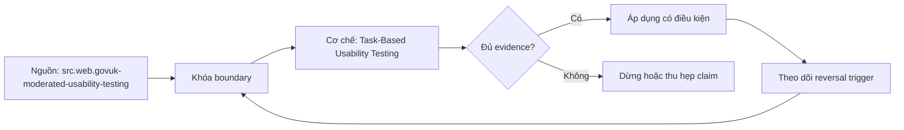

# Task-Based Usability Testing

> [!abstract] Câu hỏi trung tâm
> Thiết kế hai vòng usability test cho analytical product như thế nào để quan sát task success, time, assistance và confident-wrong outcomes mà không biến năm người thành bằng chứng thống kê giả?

## 1. Tách formative study và benchmark

Formative qualitative test nhằm phát hiện cơ chế lỗi: vocabulary, navigation, interpretation, query construction, trust signal hoặc recovery. Benchmark quantitative nhằm ước lượng/so sánh metrics của population hoặc cohort với độ chính xác xác định. Một session có thể thu số, nhưng n=5 không biến tỷ lệ thành estimate đáng tin. NN/g đặt năm người trong qualitative iterative testing và nêu ngoại lệ; GOV.UK benchmark guidance đề xuất 30–60 actual/likely users trong bối cảnh benchmark. Roadmap dùng năm người mỗi vòng nên kết quả phải gọi là observed round evidence, không là chứng minh thống kê toàn population.

## 2. Research question, participant và consent

Mỗi vòng bắt đầu bằng câu hỏi nghiên cứu và target persona. Recruit actual/likely users theo role, domain knowledge, data literacy, access context và assistive needs; distinct cohorts không được trộn rồi gọi đồng nhất. Ghi inclusion/exclusion, recruitment channel, incentive và no-show. Có informed consent cho recording, screen/data capture và retention; dùng synthetic hoặc properly governed data nếu task có thông tin nhạy cảm. Nhắc rõ kiểm product chứ không chấm người. Moderator không phải owner duy nhất chấm success nếu owner biết đáp án và muốn bảo vệ thiết kế.

## 3. Tác vụ trung tính và có oracle

Task nêu goal nghiệp vụ, context và constraints, không nêu tên menu, product, metric hoặc sequence thao tác. Nó phải thực tế, đủ thách thức và có expected answer/acceptance range từ oracle độc lập. Ba task nên phủ discovery/no-fit, correct analysis và response to degraded/ambiguous state. Pilot với người ngoài mẫu phát hiện wording gợi ý, missing data và timing lỗi. Giữ task semantics giữa hai vòng; nếu product change buộc đổi task, đánh dấu non-comparable thay vì ép so.

## 4. Protocol không cứu người dùng

Dùng introduction script và điều kiện bắt đầu nhất quán. Moderator yêu cầu think aloud cho mục tiêu định tính nhưng không chỉ đường; prompt trung tính như “bạn đang nghĩ gì?” được log riêng. Với time benchmark, think-aloud có thể làm thời gian chậm và moderator prompts tạo nhiễu, nên protocol metric phải chuẩn hóa hoặc tách. Assistance event có taxonomy: clarification về scenario, technical failure, hint, direct instruction. Stop criteria bảo vệ participant và hệ thống; downtime không được chấm thành UX failure.

## 5. Bốn số đo và denominator

Task completion rate = correct completions / valid attempts, với success definition trước session. Time-to-correct-result tính từ task start tới verified correct output; censor abandon/time limit thay vì gán tùy ý. Assistance count chỉ so khi prompt policy thống nhất. Confident-wrong count yêu cầu participant tuyên bố hoàn tất/độ tin cậy rồi oracle cho biết result sai; wrong but uncertain là category khác. Ghi partial, abandon, technical invalid và no-opportunity. Median/distribution và task-level table có ích hơn một average che outlier.

## 6. Severity và vòng sửa

Finding có observed behavior, task/step, frequency trong sample, consequence, recovery, affected cohort và evidence clip/note. Severity kết hợp impact và persistence/recovery; frequency nhỏ trong mẫu không đồng nghĩa hiếm trong population. Prioritize wrong-confident/high-stakes trước cosmetic delay. Mỗi fix nối tới mechanism hypothesis và expected metric/failure change. Vòng hai dùng người mới phù hợp cùng cohort để giảm memory; giữ environment, task oracle, moderator script và scoring. Regression task bảo đảm fix một điểm không làm hỏng path khác.

## 7. Diễn giải cải thiện trung thực

Báo từng vòng bằng numerator/denominator, task distribution, participant composition và protocol deviations. “Ít nhất ba số cải thiện” là acceptance nội bộ; không cho phép cherry-pick direction hoặc che confidence-wrong tăng. Với mẫu nhỏ, kết luận “đã quan sát cải thiện ở vòng hai trong sample/protocol này”, kèm cases không cải thiện và alternative explanations. Muốn tuyên bố population improvement phải thiết kế benchmark/power/precision phù hợp. Không lấy satisfaction thay behavior; nhưng perception-confidence gap hữu ích để phát hiện kết quả sai mà tự tin.

## 8. Ma trận kiểm chứng từng mệnh đề

Mỗi mệnh đề dưới đây cần artifact hoặc observation lưu được. Một trang tài liệu tồn tại, catalog có search box hoặc người dùng nói ‘dễ’ không tự là bằng chứng.

### 8.1. qualitative issue discovery khác quantitative benchmark

**Mệnh đề cần kiểm.** qualitative issue discovery khác quantitative benchmark.

**Cách kiểm.** Chạy protocol trên synthetic/governed data với task oracle, script và scoring khóa trước. Ghi numerator/denominator, time-to-correct, assistance taxonomy, confident-wrong và deviations cho hai vòng; không suy population significance từ mẫu nhỏ. Với mệnh đề này, ghi participant/task hoặc artifact version, điều kiện đầu vào, expected observation, failure signal và yếu tố làm kết luận không còn đúng.

**Bằng chứng đạt cho `wiki.data-product.task-based-usability-testing`.** Lưu protocol hoặc command, raw observations, numerator/denominator nếu có, exact product/docs version, reviewer và artifact hash. Nếu chưa chạy study/lab, chỉ ghi đây là protocol; không biến expected result thành kết quả quan sát.

### 8.2. năm người không tạo population estimate đáng tin

**Mệnh đề cần kiểm.** năm người không tạo population estimate đáng tin.

**Cách kiểm.** Chạy protocol trên synthetic/governed data với task oracle, script và scoring khóa trước. Ghi numerator/denominator, time-to-correct, assistance taxonomy, confident-wrong và deviations cho hai vòng; không suy population significance từ mẫu nhỏ. Với mệnh đề này, ghi participant/task hoặc artifact version, điều kiện đầu vào, expected observation, failure signal và yếu tố làm kết luận không còn đúng.

**Bằng chứng đạt cho `wiki.data-product.task-based-usability-testing`.** Lưu protocol hoặc command, raw observations, numerator/denominator nếu có, exact product/docs version, reviewer và artifact hash. Nếu chưa chạy study/lab, chỉ ghi đây là protocol; không biến expected result thành kết quả quan sát.

### 8.3. distinct user cohorts cần sampling riêng

**Mệnh đề cần kiểm.** distinct user cohorts cần sampling riêng.

**Cách kiểm.** Chạy protocol trên synthetic/governed data với task oracle, script và scoring khóa trước. Ghi numerator/denominator, time-to-correct, assistance taxonomy, confident-wrong và deviations cho hai vòng; không suy population significance từ mẫu nhỏ. Với mệnh đề này, ghi participant/task hoặc artifact version, điều kiện đầu vào, expected observation, failure signal và yếu tố làm kết luận không còn đúng.

**Bằng chứng đạt cho `wiki.data-product.task-based-usability-testing`.** Lưu protocol hoặc command, raw observations, numerator/denominator nếu có, exact product/docs version, reviewer và artifact hash. Nếu chưa chạy study/lab, chỉ ghi đây là protocol; không biến expected result thành kết quả quan sát.

### 8.4. consent bao phủ recording và retention

**Mệnh đề cần kiểm.** consent bao phủ recording và retention.

**Cách kiểm.** Chạy protocol trên synthetic/governed data với task oracle, script và scoring khóa trước. Ghi numerator/denominator, time-to-correct, assistance taxonomy, confident-wrong và deviations cho hai vòng; không suy population significance từ mẫu nhỏ. Với mệnh đề này, ghi participant/task hoặc artifact version, điều kiện đầu vào, expected observation, failure signal và yếu tố làm kết luận không còn đúng.

**Bằng chứng đạt cho `wiki.data-product.task-based-usability-testing`.** Lưu protocol hoặc command, raw observations, numerator/denominator nếu có, exact product/docs version, reviewer và artifact hash. Nếu chưa chạy study/lab, chỉ ghi đây là protocol; không biến expected result thành kết quả quan sát.

### 8.5. task wording không lộ interface path

**Mệnh đề cần kiểm.** task wording không lộ interface path.

**Cách kiểm.** Chạy protocol trên synthetic/governed data với task oracle, script và scoring khóa trước. Ghi numerator/denominator, time-to-correct, assistance taxonomy, confident-wrong và deviations cho hai vòng; không suy population significance từ mẫu nhỏ. Với mệnh đề này, ghi participant/task hoặc artifact version, điều kiện đầu vào, expected observation, failure signal và yếu tố làm kết luận không còn đúng.

**Bằng chứng đạt cho `wiki.data-product.task-based-usability-testing`.** Lưu protocol hoặc command, raw observations, numerator/denominator nếu có, exact product/docs version, reviewer và artifact hash. Nếu chưa chạy study/lab, chỉ ghi đây là protocol; không biến expected result thành kết quả quan sát.

### 8.6. task success cần independent oracle

**Mệnh đề cần kiểm.** task success cần independent oracle.

**Cách kiểm.** Chạy protocol trên synthetic/governed data với task oracle, script và scoring khóa trước. Ghi numerator/denominator, time-to-correct, assistance taxonomy, confident-wrong và deviations cho hai vòng; không suy population significance từ mẫu nhỏ. Với mệnh đề này, ghi participant/task hoặc artifact version, điều kiện đầu vào, expected observation, failure signal và yếu tố làm kết luận không còn đúng.

**Bằng chứng đạt cho `wiki.data-product.task-based-usability-testing`.** Lưu protocol hoặc command, raw observations, numerator/denominator nếu có, exact product/docs version, reviewer và artifact hash. Nếu chưa chạy study/lab, chỉ ghi đây là protocol; không biến expected result thành kết quả quan sát.

### 8.7. pilot không tính vào final sample

**Mệnh đề cần kiểm.** pilot không tính vào final sample.

**Cách kiểm.** Chạy protocol trên synthetic/governed data với task oracle, script và scoring khóa trước. Ghi numerator/denominator, time-to-correct, assistance taxonomy, confident-wrong và deviations cho hai vòng; không suy population significance từ mẫu nhỏ. Với mệnh đề này, ghi participant/task hoặc artifact version, điều kiện đầu vào, expected observation, failure signal và yếu tố làm kết luận không còn đúng.

**Bằng chứng đạt cho `wiki.data-product.task-based-usability-testing`.** Lưu protocol hoặc command, raw observations, numerator/denominator nếu có, exact product/docs version, reviewer và artifact hash. Nếu chưa chạy study/lab, chỉ ghi đây là protocol; không biến expected result thành kết quả quan sát.

### 8.8. moderator prompt được log và phân loại

**Mệnh đề cần kiểm.** moderator prompt được log và phân loại.

**Cách kiểm.** Chạy protocol trên synthetic/governed data với task oracle, script và scoring khóa trước. Ghi numerator/denominator, time-to-correct, assistance taxonomy, confident-wrong và deviations cho hai vòng; không suy population significance từ mẫu nhỏ. Với mệnh đề này, ghi participant/task hoặc artifact version, điều kiện đầu vào, expected observation, failure signal và yếu tố làm kết luận không còn đúng.

**Bằng chứng đạt cho `wiki.data-product.task-based-usability-testing`.** Lưu protocol hoặc command, raw observations, numerator/denominator nếu có, exact product/docs version, reviewer và artifact hash. Nếu chưa chạy study/lab, chỉ ghi đây là protocol; không biến expected result thành kết quả quan sát.

### 8.9. think-aloud có thể làm nhiễu time metric

**Mệnh đề cần kiểm.** think-aloud có thể làm nhiễu time metric.

**Cách kiểm.** Chạy protocol trên synthetic/governed data với task oracle, script và scoring khóa trước. Ghi numerator/denominator, time-to-correct, assistance taxonomy, confident-wrong và deviations cho hai vòng; không suy population significance từ mẫu nhỏ. Với mệnh đề này, ghi participant/task hoặc artifact version, điều kiện đầu vào, expected observation, failure signal và yếu tố làm kết luận không còn đúng.

**Bằng chứng đạt cho `wiki.data-product.task-based-usability-testing`.** Lưu protocol hoặc command, raw observations, numerator/denominator nếu có, exact product/docs version, reviewer và artifact hash. Nếu chưa chạy study/lab, chỉ ghi đây là protocol; không biến expected result thành kết quả quan sát.

### 8.10. completion denominator loại technical-invalid theo rule trước

**Mệnh đề cần kiểm.** completion denominator loại technical-invalid theo rule trước.

**Cách kiểm.** Chạy protocol trên synthetic/governed data với task oracle, script và scoring khóa trước. Ghi numerator/denominator, time-to-correct, assistance taxonomy, confident-wrong và deviations cho hai vòng; không suy population significance từ mẫu nhỏ. Với mệnh đề này, ghi participant/task hoặc artifact version, điều kiện đầu vào, expected observation, failure signal và yếu tố làm kết luận không còn đúng.

**Bằng chứng đạt cho `wiki.data-product.task-based-usability-testing`.** Lưu protocol hoặc command, raw observations, numerator/denominator nếu có, exact product/docs version, reviewer và artifact hash. Nếu chưa chạy study/lab, chỉ ghi đây là protocol; không biến expected result thành kết quả quan sát.

### 8.11. time-to-correct khác time-to-any-result

**Mệnh đề cần kiểm.** time-to-correct khác time-to-any-result.

**Cách kiểm.** Chạy protocol trên synthetic/governed data với task oracle, script và scoring khóa trước. Ghi numerator/denominator, time-to-correct, assistance taxonomy, confident-wrong và deviations cho hai vòng; không suy population significance từ mẫu nhỏ. Với mệnh đề này, ghi participant/task hoặc artifact version, điều kiện đầu vào, expected observation, failure signal và yếu tố làm kết luận không còn đúng.

**Bằng chứng đạt cho `wiki.data-product.task-based-usability-testing`.** Lưu protocol hoặc command, raw observations, numerator/denominator nếu có, exact product/docs version, reviewer và artifact hash. Nếu chưa chạy study/lab, chỉ ghi đây là protocol; không biến expected result thành kết quả quan sát.

### 8.12. confident-wrong cần self-assessed completion hoặc confidence

**Mệnh đề cần kiểm.** confident-wrong cần self-assessed completion hoặc confidence.

**Cách kiểm.** Chạy protocol trên synthetic/governed data với task oracle, script và scoring khóa trước. Ghi numerator/denominator, time-to-correct, assistance taxonomy, confident-wrong và deviations cho hai vòng; không suy population significance từ mẫu nhỏ. Với mệnh đề này, ghi participant/task hoặc artifact version, điều kiện đầu vào, expected observation, failure signal và yếu tố làm kết luận không còn đúng.

**Bằng chứng đạt cho `wiki.data-product.task-based-usability-testing`.** Lưu protocol hoặc command, raw observations, numerator/denominator nếu có, exact product/docs version, reviewer và artifact hash. Nếu chưa chạy study/lab, chỉ ghi đây là protocol; không biến expected result thành kết quả quan sát.

### 8.13. severity không đồng nhất frequency trong sample

**Mệnh đề cần kiểm.** severity không đồng nhất frequency trong sample.

**Cách kiểm.** Chạy protocol trên synthetic/governed data với task oracle, script và scoring khóa trước. Ghi numerator/denominator, time-to-correct, assistance taxonomy, confident-wrong và deviations cho hai vòng; không suy population significance từ mẫu nhỏ. Với mệnh đề này, ghi participant/task hoặc artifact version, điều kiện đầu vào, expected observation, failure signal và yếu tố làm kết luận không còn đúng.

**Bằng chứng đạt cho `wiki.data-product.task-based-usability-testing`.** Lưu protocol hoặc command, raw observations, numerator/denominator nếu có, exact product/docs version, reviewer và artifact hash. Nếu chưa chạy study/lab, chỉ ghi đây là protocol; không biến expected result thành kết quả quan sát.

### 8.14. round two giữ protocol và dùng participants mới

**Mệnh đề cần kiểm.** round two giữ protocol và dùng participants mới.

**Cách kiểm.** Chạy protocol trên synthetic/governed data với task oracle, script và scoring khóa trước. Ghi numerator/denominator, time-to-correct, assistance taxonomy, confident-wrong và deviations cho hai vòng; không suy population significance từ mẫu nhỏ. Với mệnh đề này, ghi participant/task hoặc artifact version, điều kiện đầu vào, expected observation, failure signal và yếu tố làm kết luận không còn đúng.

**Bằng chứng đạt cho `wiki.data-product.task-based-usability-testing`.** Lưu protocol hoặc command, raw observations, numerator/denominator nếu có, exact product/docs version, reviewer và artifact hash. Nếu chưa chạy study/lab, chỉ ghi đây là protocol; không biến expected result thành kết quả quan sát.

### 8.15. small-sample improvement phải giới hạn phạm vi kết luận

**Mệnh đề cần kiểm.** small-sample improvement phải giới hạn phạm vi kết luận.

**Cách kiểm.** Chạy protocol trên synthetic/governed data với task oracle, script và scoring khóa trước. Ghi numerator/denominator, time-to-correct, assistance taxonomy, confident-wrong và deviations cho hai vòng; không suy population significance từ mẫu nhỏ. Với mệnh đề này, ghi participant/task hoặc artifact version, điều kiện đầu vào, expected observation, failure signal và yếu tố làm kết luận không còn đúng.

**Bằng chứng đạt cho `wiki.data-product.task-based-usability-testing`.** Lưu protocol hoặc command, raw observations, numerator/denominator nếu có, exact product/docs version, reviewer và artifact hash. Nếu chưa chạy study/lab, chỉ ghi đây là protocol; không biến expected result thành kết quả quan sát.

## 9. Quy trình phản biện

1. Viết user need, task, persona, stakes và scope trước khi chọn catalog, tài liệu hoặc metric.
2. Tách source fact, curriculum synthesis, organizational policy và observation từ study.
3. Khóa task/protocol/oracle trước khi đo; mọi deviation phải được ghi.
4. Kiểm correct outcome và interpretation, không chỉ completion hoặc cảm nhận.
5. Phân loại lỗi theo cơ chế để sửa đúng lớp: metadata, docs, interface, trust, access hay skill.
6. Kiểm changed user group, changed task và degraded state trước khi khái quát.
7. Chưa có execution evidence thì giữ trạng thái `review`.

## 10. Câu hỏi tự kiểm tra

1. User task nào đang được hỗ trợ, và điều gì nằm ngoài scope?
2. Oracle nào xác định product hoặc kết quả đúng?
3. Số đo dùng denominator nào và loại invalid attempt theo rule nào?
4. Điểm nào cần automation, điểm nào bắt buộc human judgment?
5. Một kết quả nhanh nhưng sai nghĩa được phát hiện ở đâu?
6. Điều kiện nào làm kết luận từ sample hoặc catalog hiện tại không còn áp dụng?

## 11. Giới hạn và điều chưa cho phép kết luận

- Chưa chạy user study, catalog experiment, documentation CI hoặc support-boundary exercise; note mô tả protocol và expected evidence.
- Tài liệu web được kiểm ngày 2026-10-01; tính năng, giao diện, license và guidance có thể đổi.
- Bốn tầng documentation, bốn điều kiện self-service và bốn số đo của module là curriculum synthesis; không gán nguyên văn cho một nguồn.
- Cỡ mẫu nhỏ cho formative discovery không cho phép kết luận tỷ lệ toàn population hoặc statistical significance.
- Dữ liệu người tham gia, recording và screen capture cần consent, minimization, retention và access controls riêng.
- Note giữ trạng thái `review` cho tới khi chủ dự án duyệt semantic meaning.

## Reference
1. [[SRC-GOVUK-MODERATED-USABILITY-TESTING]]
2. [[SRC-GOVUK-USABILITY-BENCHMARKING]]
3. [[SRC-NNGROUP-USABILITY-SAMPLE-SIZE]]

## Source coverage

| Source slice | Nội dung sử dụng | Trạng thái |
|---|---|---|
| [[SRC-GOVUK-MODERATED-USABILITY-TESTING]] | Khái niệm, mechanism hoặc study boundary liên quan | Đã đọc locator trong source record; không suy ngoài phạm vi |
| [[SRC-GOVUK-USABILITY-BENCHMARKING]] | Khái niệm, mechanism hoặc study boundary liên quan | Đã đọc locator trong source record; không suy ngoài phạm vi |
| [[SRC-NNGROUP-USABILITY-SAMPLE-SIZE]] | Khái niệm, mechanism hoặc study boundary liên quan | Đã đọc locator trong source record; không suy ngoài phạm vi |

## Key takeaways
- Tách formative discovery khỏi benchmark; mẫu nhỏ mô tả observations, không chứng minh population improvement.
- Chỉ số phải gắn task, persona, product version, protocol và denominator.
- Correct completion gồm cả kết quả và cách diễn giải đúng; confident-wrong là failure nghiêm trọng.
- Công cụ catalog, docs generator và CI cung cấp mechanism, không tự chứng minh outcome.
- Chưa chạy study hoặc lab thì artifact là tài liệu học thuật đã kiểm cấu trúc, không phải chứng nhận thực tế.

<!-- ATOMIC-EXECUTION-CAPSULE:START -->

## Execution capsule — kiểm chứng `wiki.data-product.task-based-usability-testing`

> [!important] Phân loại mệnh đề
> Với `wiki.data-product.task-based-usability-testing`, sơ đồ, ví dụ và artifact về **Task-Based Usability Testing** là **synthesis để kiểm chứng**; chúng không phải trích dẫn hay case nguyên văn của nguồn.

### Sơ đồ cơ chế và điểm kiểm soát



Đọc sơ đồ `wiki.data-product.task-based-usability-testing` từ trái sang phải: source chỉ cung cấp claim ban đầu cho **Task-Based Usability Testing**; quyết định chỉ được đi tiếp sau khi boundary, evidence và điều kiện đảo quyết định đã hiện hữu.

### Ví dụ làm việc có thể bác bỏ

**Input.** Một đội cần trả lời: “Thiết kế hai vòng usability test cho analytical product như thế nào để quan sát task success, time, assistance và confident-wrong outcomes mà không biến năm người thành bằng chứng thống kê giả?” cho một phạm vi nhỏ, có owner và deadline rõ.

**Decision.** Đội áp dụng **Task-Based Usability Testing** trên control và variant chỉ khác một assumption; expected result và hard constraints được khóa trước khi chạy.

**Outcome.** Với `wiki.data-product.task-based-usability-testing`, nếu observation vi phạm hard constraint hoặc oracle độc lập không xác nhận **Task-Based Usability Testing**, đội thu hẹp claim hay đảo quyết định. Nếu đạt, kết luận vẫn kèm scope, version và review date; một lần thành công không được nâng thành quy luật phổ quát.

### Artifact thực thi tối thiểu

```sql
-- Verification harness for: Task-Based Usability Testing
WITH evidence AS (
    SELECT 'wiki.data-product.task-based-usability-testing' AS concept_id,
           'boundary_declared' AS check_name, 1 AS passed
    UNION ALL
    SELECT 'wiki.data-product.task-based-usability-testing', 'independent_oracle', 1
    UNION ALL
    SELECT 'wiki.data-product.task-based-usability-testing', 'reversal_trigger_recorded', 1
)
SELECT concept_id,
       MIN(passed) AS all_hard_checks_pass,
       COUNT(*) AS evidence_items
FROM evidence
GROUP BY concept_id
HAVING MIN(passed) = 1;
```

Artifact của `wiki.data-product.task-based-usability-testing` buộc người dùng ghi boundary, oracle và reversal trigger cho **Task-Based Usability Testing**. Các giá trị minh họa phải được thay bằng evidence thật trước khi dùng cho quyết định.

### Tự kiểm tra trước khi tái sử dụng

1. Bạn có thể trả lời `Thiết kế hai vòng usability test cho analytical product như thế nào để quan sát task success, time, assistance và confident-wrong outcomes mà không biến năm người thành bằng chứng thống kê giả?` bằng một câu mà không kéo thêm concept thứ hai không?
2. Source locator nào đỡ cho claim, và phần nào chỉ là synthesis trong note?
3. Observation nào khiến bạn dừng, thu hẹp hoặc đảo quyết định?
4. Artifact nào cho phép một reviewer độc lập tái hiện kết quả?

<!-- ATOMIC-EXECUTION-CAPSULE:END -->
