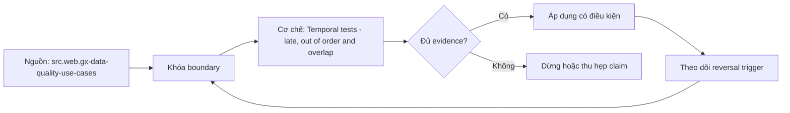

# Temporal tests - late, out of order and overlap

> [!abstract] Câu hỏi trung tâm
> Temporal tests phải mô hình late, out-of-order, overlap và correction bằng những clock và interval nào?

## 1. Multiple clocks

Event, source commit, ingestion, processing và publish time trả lời câu hỏi khác nhau; lag cần chỉ rõ cặp clock. Đừng bắt đầu bằng tên công cụ. Hãy bắt đầu bằng đối tượng được bảo vệ, boundary quan sát được và hậu quả nếu kết luận sai. Trong bài `Temporal tests - late, out of order and overlap`, câu hỏi thực dụng là: Temporal tests phải mô hình late, out-of-order, overlap và correction bằng những clock và interval nào? Ta ghi rõ grain, population, time window, owner và hành động sau failure; nếu một trường chưa biết thì đánh dấu unknown thay vì lấp bằng mặc định. Bằng chứng tối thiểu gồm fixture có version, cấu hình hoặc rule đã resolve, raw observation, expected result và limitation. Phần này là curriculum synthesis dựa trên các nguồn đã định danh, không phải lời hứa rằng mọi adapter hay deployment đều có cùng hành vi.

## 2. Watermark and lateness

Watermark là completeness claim có policy; allowed lateness quyết định sửa state hay route exception. Điểm khó không nằm ở cú pháp mà ở identity và scope. Hai phép đo cùng tên vẫn có thể nói về hai population hoặc hai thời điểm khác nhau. Trong bài `Temporal tests - late, out of order and overlap`, câu hỏi thực dụng là: Temporal tests phải mô hình late, out-of-order, overlap và correction bằng những clock và interval nào? Ta ghi rõ grain, population, time window, owner và hành động sau failure; nếu một trường chưa biết thì đánh dấu unknown thay vì lấp bằng mặc định. Bằng chứng tối thiểu gồm fixture có version, cấu hình hoặc rule đã resolve, raw observation, expected result và limitation. Phần này là curriculum synthesis dựa trên các nguồn đã định danh, không phải lời hứa rằng mọi adapter hay deployment đều có cùng hành vi.

## 3. Out-of-order behavior

Arrival order không được giả làm business order; sequence/version tie-break phải deterministic và có collision path. Một dashboard xanh chỉ là tín hiệu. Muốn biến nó thành bằng chứng phải giữ input, phiên bản, rule, trạng thái trước-sau và cách tính độc lập. Trong bài `Temporal tests - late, out of order and overlap`, câu hỏi thực dụng là: Temporal tests phải mô hình late, out-of-order, overlap và correction bằng những clock và interval nào? Ta ghi rõ grain, population, time window, owner và hành động sau failure; nếu một trường chưa biết thì đánh dấu unknown thay vì lấp bằng mặc định. Bằng chứng tối thiểu gồm fixture có version, cấu hình hoặc rule đã resolve, raw observation, expected result và limitation. Phần này là curriculum synthesis dựa trên các nguồn đã định danh, không phải lời hứa rằng mọi adapter hay deployment đều có cùng hành vi.

## 4. Interval overlap

Adjacent partitions dùng half-open boundary; correction window và replay overlap cần dedup identity. Thiết kế tốt phải chịu được counterexample. Hãy chủ động tạo case sát boundary, case thiếu dữ liệu và case replay thay vì chỉ chạy happy path. Trong bài `Temporal tests - late, out of order and overlap`, câu hỏi thực dụng là: Temporal tests phải mô hình late, out-of-order, overlap và correction bằng những clock và interval nào? Ta ghi rõ grain, population, time window, owner và hành động sau failure; nếu một trường chưa biết thì đánh dấu unknown thay vì lấp bằng mặc định. Bằng chứng tối thiểu gồm fixture có version, cấu hình hoặc rule đã resolve, raw observation, expected result và limitation. Phần này là curriculum synthesis dựa trên các nguồn đã định danh, không phải lời hứa rằng mọi adapter hay deployment đều có cùng hành vi.

## 5. Temporal invariants

Test no gap, no unintended overlap, monotonic transition và bounded outstanding lateness trên đúng grain. Chi phí vận hành thuộc contract. Một rule đúng nhưng quá đắt, quá ồn hoặc không có owner sẽ nhanh chóng bị tắt và mất tác dụng. Trong bài `Temporal tests - late, out of order and overlap`, câu hỏi thực dụng là: Temporal tests phải mô hình late, out-of-order, overlap và correction bằng những clock và interval nào? Ta ghi rõ grain, population, time window, owner và hành động sau failure; nếu một trường chưa biết thì đánh dấu unknown thay vì lấp bằng mặc định. Bằng chứng tối thiểu gồm fixture có version, cấu hình hoặc rule đã resolve, raw observation, expected result và limitation. Phần này là curriculum synthesis dựa trên các nguồn đã định danh, không phải lời hứa rằng mọi adapter hay deployment đều có cùng hành vi.

## 6. DST and calendar

Local business days có thể 23/25 giờ; fixtures phải giữ timezone rules, ambiguous fold và manual trigger. Kết luận cần có điều kiện đảo chiều. Khi volume, latency, nguồn thẩm quyền hoặc topology đổi, quyết định cũ phải được xem xét lại bằng cùng một oracle. Trong bài `Temporal tests - late, out of order and overlap`, câu hỏi thực dụng là: Temporal tests phải mô hình late, out-of-order, overlap và correction bằng những clock và interval nào? Ta ghi rõ grain, population, time window, owner và hành động sau failure; nếu một trường chưa biết thì đánh dấu unknown thay vì lấp bằng mặc định. Bằng chứng tối thiểu gồm fixture có version, cấu hình hoặc rule đã resolve, raw observation, expected result và limitation. Phần này là curriculum synthesis dựa trên các nguồn đã định danh, không phải lời hứa rằng mọi adapter hay deployment đều có cùng hành vi.

## 7. Ma trận kiểm chứng từng mệnh đề

Với `wiki.data-quality.temporal-tests`, command thành công không tự chứng minh dữ liệu đúng. Protocol riêng của bài là: Tạo positive/negative fixture ở đúng grain, chạy rule đã version hóa và so failing keys/metrics với một oracle độc lập. Mỗi probe dưới đây phải nối input boundary với failure signal và oracle có thể phản bác kết luận.

### 7.1. Temporal tests - late, out of order and overlap: kiểm `Multiple clocks` bằng case 1, cụ thể event, source commit, ingestion, processing và publish time trả lời câu hỏi khác nhau; lag cần chỉ rõ cặp clock

**Mệnh đề cần kiểm.** Temporal tests - late, out of order and overlap: kiểm `Multiple clocks` bằng case 1, cụ thể event, source commit, ingestion, processing và publish time trả lời câu hỏi khác nhau; lag cần chỉ rõ cặp clock.

**Thiết kế phép thử cho `wiki.data-quality.temporal-tests`.** Trong ngữ cảnh `wiki.data-quality.temporal-tests`, tạo positive control và negative control chỉ khác đúng một điều kiện. Khóa input snapshot, phiên bản và owner của rule; chạy đúng population được bài `Temporal tests - late, out of order and overlap` công bố.

**Bằng chứng cần giữ.** Đối với probe 1 của `Temporal tests - late, out of order and overlap`, giữ fixture, raw failing rows và lệnh tái hiện. Nếu chưa chạy lab, ghi expected evidence và giữ trạng thái review; không biến protocol thành observation.

### 7.2. Temporal tests - late, out of order and overlap: kiểm `Watermark and lateness` bằng case 2, cụ thể watermark là completeness claim có policy; allowed lateness quyết định sửa state hay route exception

**Mệnh đề cần kiểm.** Temporal tests - late, out of order and overlap: kiểm `Watermark and lateness` bằng case 2, cụ thể watermark là completeness claim có policy; allowed lateness quyết định sửa state hay route exception.

**Thiết kế phép thử cho `wiki.data-quality.temporal-tests`.** Trong ngữ cảnh `wiki.data-quality.temporal-tests`, đổi grain nhưng giữ tổng số dòng để lộ phép đo sai cấp. Khóa input snapshot, phiên bản và owner của rule; chạy đúng population được bài `Temporal tests - late, out of order and overlap` công bố.

**Bằng chứng cần giữ.** Đối với probe 2 của `Temporal tests - late, out of order and overlap`, báo numerator, denominator và key set ở cả hai grain. Nếu chưa chạy lab, ghi expected evidence và giữ trạng thái review; không biến protocol thành observation.

### 7.3. Temporal tests - late, out of order and overlap: kiểm `Out-of-order behavior` bằng case 3, cụ thể arrival order không được giả làm business order; sequence/version tie-break phải deterministic và có collision path

**Mệnh đề cần kiểm.** Temporal tests - late, out of order and overlap: kiểm `Out-of-order behavior` bằng case 3, cụ thể arrival order không được giả làm business order; sequence/version tie-break phải deterministic và có collision path.

**Thiết kế phép thử cho `wiki.data-quality.temporal-tests`.** Trong ngữ cảnh `wiki.data-quality.temporal-tests`, đưa một giá trị tới đúng boundary và một giá trị vượt boundary. Khóa input snapshot, phiên bản và owner của rule; chạy đúng population được bài `Temporal tests - late, out of order and overlap` công bố.

**Bằng chứng cần giữ.** Đối với probe 3 của `Temporal tests - late, out of order and overlap`, lưu hai observed values cùng rule đã resolve. Nếu chưa chạy lab, ghi expected evidence và giữ trạng thái review; không biến protocol thành observation.

### 7.4. Temporal tests - late, out of order and overlap: kiểm `Interval overlap` bằng case 4, cụ thể adjacent partitions dùng half-open boundary; correction window và replay overlap cần dedup identity

**Mệnh đề cần kiểm.** Temporal tests - late, out of order and overlap: kiểm `Interval overlap` bằng case 4, cụ thể adjacent partitions dùng half-open boundary; correction window và replay overlap cần dedup identity.

**Thiết kế phép thử cho `wiki.data-quality.temporal-tests`.** Trong ngữ cảnh `wiki.data-quality.temporal-tests`, kill tiến trình ngay trước rồi ngay sau durable side effect. Khóa input snapshot, phiên bản và owner của rule; chạy đúng population được bài `Temporal tests - late, out of order and overlap` công bố.

**Bằng chứng cần giữ.** Đối với probe 4 của `Temporal tests - late, out of order and overlap`, lưu checkpoint, external ledger và trạng thái sau restart. Nếu chưa chạy lab, ghi expected evidence và giữ trạng thái review; không biến protocol thành observation.

### 7.5. Temporal tests - late, out of order and overlap: kiểm `Temporal invariants` bằng case 5, cụ thể test no gap, no unintended overlap, monotonic transition và bounded outstanding lateness trên đúng grain

**Mệnh đề cần kiểm.** Temporal tests - late, out of order and overlap: kiểm `Temporal invariants` bằng case 5, cụ thể test no gap, no unintended overlap, monotonic transition và bounded outstanding lateness trên đúng grain.

**Thiết kế phép thử cho `wiki.data-quality.temporal-tests`.** Trong ngữ cảnh `wiki.data-quality.temporal-tests`, đảo thứ tự input và concurrency nhưng giữ logical population. Khóa input snapshot, phiên bản và owner của rule; chạy đúng population được bài `Temporal tests - late, out of order and overlap` công bố.

**Bằng chứng cần giữ.** Đối với probe 5 của `Temporal tests - late, out of order and overlap`, so canonical hash và business totals giữa các thứ tự. Nếu chưa chạy lab, ghi expected evidence và giữ trạng thái review; không biến protocol thành observation.

### 7.6. Temporal tests - late, out of order and overlap: kiểm `DST and calendar` bằng case 6, cụ thể local business days có thể 23/25 giờ; fixtures phải giữ timezone rules, ambiguous fold và manual trigger

**Mệnh đề cần kiểm.** Temporal tests - late, out of order and overlap: kiểm `DST and calendar` bằng case 6, cụ thể local business days có thể 23/25 giờ; fixtures phải giữ timezone rules, ambiguous fold và manual trigger.

**Thiết kế phép thử cho `wiki.data-quality.temporal-tests`.** Trong ngữ cảnh `wiki.data-quality.temporal-tests`, replay cùng identity với payload giống rồi payload xung đột. Khóa input snapshot, phiên bản và owner của rule; chạy đúng population được bài `Temporal tests - late, out of order and overlap` công bố.

**Bằng chứng cần giữ.** Đối với probe 6 của `Temporal tests - late, out of order and overlap`, tách duplicate replay khỏi identity collision bằng reason code. Nếu chưa chạy lab, ghi expected evidence và giữ trạng thái review; không biến protocol thành observation.

### 7.7. Temporal tests - late, out of order and overlap: kiểm `Multiple clocks` bằng case 7, cụ thể event, source commit, ingestion, processing và publish time trả lời câu hỏi khác nhau; lag cần chỉ rõ cặp clock

**Mệnh đề cần kiểm.** Temporal tests - late, out of order and overlap: kiểm `Multiple clocks` bằng case 7, cụ thể event, source commit, ingestion, processing và publish time trả lời câu hỏi khác nhau; lag cần chỉ rõ cặp clock.

**Thiết kế phép thử cho `wiki.data-quality.temporal-tests`.** Trong ngữ cảnh `wiki.data-quality.temporal-tests`, thêm record tới trễ trong horizon và ngoài horizon. Khóa input snapshot, phiên bản và owner của rule; chạy đúng population được bài `Temporal tests - late, out of order and overlap` công bố.

**Bằng chứng cần giữ.** Đối với probe 7 của `Temporal tests - late, out of order and overlap`, báo accepted-late, rejected-late và oldest outstanding timestamp. Nếu chưa chạy lab, ghi expected evidence và giữ trạng thái review; không biến protocol thành observation.

### 7.8. Temporal tests - late, out of order and overlap: kiểm `Watermark and lateness` bằng case 8, cụ thể watermark là completeness claim có policy; allowed lateness quyết định sửa state hay route exception

**Mệnh đề cần kiểm.** Temporal tests - late, out of order and overlap: kiểm `Watermark and lateness` bằng case 8, cụ thể watermark là completeness claim có policy; allowed lateness quyết định sửa state hay route exception.

**Thiết kế phép thử cho `wiki.data-quality.temporal-tests`.** Trong ngữ cảnh `wiki.data-quality.temporal-tests`, đổi schema theo một cách tương thích rồi một cách phá vỡ semantics. Khóa input snapshot, phiên bản và owner của rule; chạy đúng population được bài `Temporal tests - late, out of order and overlap` công bố.

**Bằng chứng cần giữ.** Đối với probe 8 của `Temporal tests - late, out of order and overlap`, giữ schema diff, classification và consumer-visible result. Nếu chưa chạy lab, ghi expected evidence và giữ trạng thái review; không biến protocol thành observation.

### 7.9. Temporal tests - late, out of order and overlap: kiểm `Out-of-order behavior` bằng case 9, cụ thể arrival order không được giả làm business order; sequence/version tie-break phải deterministic và có collision path

**Mệnh đề cần kiểm.** Temporal tests - late, out of order and overlap: kiểm `Out-of-order behavior` bằng case 9, cụ thể arrival order không được giả làm business order; sequence/version tie-break phải deterministic và có collision path.

**Thiết kế phép thử cho `wiki.data-quality.temporal-tests`.** Trong ngữ cảnh `wiki.data-quality.temporal-tests`, tạo missing và duplicate bù nhau để count tổng không đổi. Khóa input snapshot, phiên bản và owner của rule; chạy đúng population được bài `Temporal tests - late, out of order and overlap` công bố.

**Bằng chứng cần giữ.** Đối với probe 9 của `Temporal tests - late, out of order and overlap`, so key multiset và typed hashes thay vì chỉ row count. Nếu chưa chạy lab, ghi expected evidence và giữ trạng thái review; không biến protocol thành observation.

### 7.10. Temporal tests - late, out of order and overlap: kiểm `Interval overlap` bằng case 10, cụ thể adjacent partitions dùng half-open boundary; correction window và replay overlap cần dedup identity

**Mệnh đề cần kiểm.** Temporal tests - late, out of order and overlap: kiểm `Interval overlap` bằng case 10, cụ thể adjacent partitions dùng half-open boundary; correction window và replay overlap cần dedup identity.

**Thiết kế phép thử cho `wiki.data-quality.temporal-tests`.** Trong ngữ cảnh `wiki.data-quality.temporal-tests`, cho reviewer tái hiện chỉ từ evidence package. Khóa input snapshot, phiên bản và owner của rule; chạy đúng population được bài `Temporal tests - late, out of order and overlap` công bố.

**Bằng chứng cần giữ.** Đối với probe 10 của `Temporal tests - late, out of order and overlap`, package phải đủ để người khác dựng lại decision và limitation. Nếu chưa chạy lab, ghi expected evidence và giữ trạng thái review; không biến protocol thành observation.

### 7.11. Temporal tests - late, out of order and overlap: kiểm `Temporal invariants` bằng case 11, cụ thể test no gap, no unintended overlap, monotonic transition và bounded outstanding lateness trên đúng grain

**Mệnh đề cần kiểm.** Temporal tests - late, out of order and overlap: kiểm `Temporal invariants` bằng case 11, cụ thể test no gap, no unintended overlap, monotonic transition và bounded outstanding lateness trên đúng grain.

**Thiết kế phép thử cho `wiki.data-quality.temporal-tests`.** Trong ngữ cảnh `wiki.data-quality.temporal-tests`, so với oracle độc lập không dùng chung query hoặc parser. Khóa input snapshot, phiên bản và owner của rule; chạy đúng population được bài `Temporal tests - late, out of order and overlap` công bố.

**Bằng chứng cần giữ.** Đối với probe 11 của `Temporal tests - late, out of order and overlap`, independent result phải khớp ở grain đã công bố. Nếu chưa chạy lab, ghi expected evidence và giữ trạng thái review; không biến protocol thành observation.

### 7.12. Temporal tests - late, out of order and overlap: kiểm `DST and calendar` bằng case 12, cụ thể local business days có thể 23/25 giờ; fixtures phải giữ timezone rules, ambiguous fold và manual trigger

**Mệnh đề cần kiểm.** Temporal tests - late, out of order and overlap: kiểm `DST and calendar` bằng case 12, cụ thể local business days có thể 23/25 giờ; fixtures phải giữ timezone rules, ambiguous fold và manual trigger.

**Thiết kế phép thử cho `wiki.data-quality.temporal-tests`.** Trong ngữ cảnh `wiki.data-quality.temporal-tests`, chạy scope hẹp và population đầy đủ rồi công bố phần bị loại. Khóa input snapshot, phiên bản và owner của rule; chạy đúng population được bài `Temporal tests - late, out of order and overlap` công bố.

**Bằng chứng cần giữ.** Đối với probe 12 của `Temporal tests - late, out of order and overlap`, coverage phải nêu rõ excluded nodes, partitions hoặc incidents. Nếu chưa chạy lab, ghi expected evidence và giữ trạng thái review; không biến protocol thành observation.

### 7.13. Temporal tests - late, out of order and overlap: kiểm `Multiple clocks` bằng case 13, cụ thể event, source commit, ingestion, processing và publish time trả lời câu hỏi khác nhau; lag cần chỉ rõ cặp clock

**Mệnh đề cần kiểm.** Temporal tests - late, out of order and overlap: kiểm `Multiple clocks` bằng case 13, cụ thể event, source commit, ingestion, processing và publish time trả lời câu hỏi khác nhau; lag cần chỉ rõ cặp clock.

**Thiết kế phép thử cho `wiki.data-quality.temporal-tests`.** Trong ngữ cảnh `wiki.data-quality.temporal-tests`, thử timezone, precision hoặc partition ở hai phía của ranh giới. Khóa input snapshot, phiên bản và owner của rule; chạy đúng population được bài `Temporal tests - late, out of order and overlap` công bố.

**Bằng chứng cần giữ.** Đối với probe 13 của `Temporal tests - late, out of order and overlap`, UTC/local interval và rounding policy phải hiện trong output. Nếu chưa chạy lab, ghi expected evidence và giữ trạng thái review; không biến protocol thành observation.

### 7.14. Temporal tests - late, out of order and overlap: kiểm `Watermark and lateness` bằng case 14, cụ thể watermark là completeness claim có policy; allowed lateness quyết định sửa state hay route exception

**Mệnh đề cần kiểm.** Temporal tests - late, out of order and overlap: kiểm `Watermark and lateness` bằng case 14, cụ thể watermark là completeness claim có policy; allowed lateness quyết định sửa state hay route exception.

**Thiết kế phép thử cho `wiki.data-quality.temporal-tests`.** Trong ngữ cảnh `wiki.data-quality.temporal-tests`, đổi constraint đủ lớn để quyết định phải đảo. Khóa input snapshot, phiên bản và owner của rule; chạy đúng population được bài `Temporal tests - late, out of order and overlap` công bố.

**Bằng chứng cần giữ.** Đối với probe 14 của `Temporal tests - late, out of order and overlap`, ADR phải lưu changed constraint và reversal threshold. Nếu chưa chạy lab, ghi expected evidence và giữ trạng thái review; không biến protocol thành observation.

### 7.15. Temporal tests - late, out of order and overlap: kiểm `Out-of-order behavior` bằng case 15, cụ thể arrival order không được giả làm business order; sequence/version tie-break phải deterministic và có collision path

**Mệnh đề cần kiểm.** Temporal tests - late, out of order and overlap: kiểm `Out-of-order behavior` bằng case 15, cụ thể arrival order không được giả làm business order; sequence/version tie-break phải deterministic và có collision path.

**Thiết kế phép thử cho `wiki.data-quality.temporal-tests`.** Trong ngữ cảnh `wiki.data-quality.temporal-tests`, chạy lại từ môi trường sạch với versions và seed đã khóa. Khóa input snapshot, phiên bản và owner của rule; chạy đúng population được bài `Temporal tests - late, out of order and overlap` công bố.

**Bằng chứng cần giữ.** Đối với probe 15 của `Temporal tests - late, out of order and overlap`, canonical result phải ổn định hoặc mọi nondeterminism phải được giải thích. Nếu chưa chạy lab, ghi expected evidence và giữ trạng thái review; không biến protocol thành observation.

## 8. Quy trình phản biện

1. Viết consumer-visible invariant cho `Temporal tests - late, out of order and overlap` trước khi chọn query hoặc tool.
2. Khóa grain, identity, population, time window và authoritative source.
3. Phân biệt declared configuration, executed state và published state.
4. Chạy negative control, replay hoặc changed-assumption case phù hợp.
5. Đối soát bằng oracle độc lập; công bố coverage và phần không quan sát được.
6. Gắn owner, hành động, reversal trigger và hạn review cho kết luận.

## 9. Câu hỏi tự kiểm tra

1. `Temporal tests - late, out of order and overlap: kiểm `Multiple clocks` bằng case 1, cụ thể event, source commit, ingestion, processing và publish time trả lời câu hỏi khác nhau; lag cần chỉ rõ cặp clock` thất bại đầu tiên ở boundary nào?
2. Artifact nào mạnh nhất để trả lời `Temporal tests - late, out of order and overlap: kiểm `Out-of-order behavior` bằng case 3, cụ thể arrival order không được giả làm business order; sequence/version tie-break phải deterministic và có collision path`?
3. Counterexample nhỏ nhất cho `Temporal tests - late, out of order and overlap: kiểm `DST and calendar` bằng case 6, cụ thể local business days có thể 23/25 giờ; fixtures phải giữ timezone rules, ambiguous fold và manual trigger` gồm những state nào?
4. `Temporal tests - late, out of order and overlap: kiểm `Out-of-order behavior` bằng case 9, cụ thể arrival order không được giả làm business order; sequence/version tie-break phải deterministic và có collision path` có thể xanh giả ra sao?
5. Constraint nào khiến quyết định ở `Temporal tests - late, out of order and overlap: kiểm `Watermark and lateness` bằng case 14, cụ thể watermark là completeness claim có policy; allowed lateness quyết định sửa state hay route exception` phải đảo?
6. Phần nào của `Temporal tests - late, out of order and overlap: kiểm `Out-of-order behavior` bằng case 15, cụ thể arrival order không được giả làm business order; sequence/version tie-break phải deterministic và có collision path` mới là protocol, chưa phải observation?

## 10. Giới hạn và điều chưa cho phép kết luận

- Lab của `Temporal tests - late, out of order and overlap` chưa chạy trên hệ thống production; nội dung là giáo trình và expected evidence.
- Hành vi phụ thuộc phiên bản, connector, scheduler, warehouse và catalog configuration phải được kiểm lại.
- Các ma trận, ladder và threshold do giáo trình tổng hợp không được gán nguyên văn cho vendor.
- Note giữ trạng thái `review` cho tới khi owner duyệt semantics và learner artifact.

## Reference
1. [[SRC-GX-DATA-QUALITY-USE-CASES]]
2. [[SRC-GX-EXPECTATIONS]]

## Source coverage

| Source slice | Nội dung sử dụng | Trạng thái |
|---|---|---|
| [[SRC-GX-DATA-QUALITY-USE-CASES]] | Contract hoặc cơ chế liên quan trực tiếp tới `Temporal tests - late, out of order and overlap` | Đã đọc locator; cần pin version khi chạy lab |
| [[SRC-GX-EXPECTATIONS]] | Contract hoặc cơ chế liên quan trực tiếp tới `Temporal tests - late, out of order and overlap` | Đã đọc locator; cần pin version khi chạy lab |

## Key takeaways
- Temporal correctness bắt đầu bằng nhiều clock, half-open intervals và late policy.
- Với `wiki.data-quality.temporal-tests`, quality của kết luận phụ thuộc identity, coverage và oracle chứ không phụ thuộc màu dashboard.
- Câu hỏi `Temporal tests phải mô hình late, out-of-order, overlap và correction bằng những clock và interval nào?` chỉ được trả lời trong scope và version đã ghi.
- Các source IDs `src.web.gx-data-quality-use-cases, src.web.gx-expectations` đặt ranh giới cho source fact; phần còn lại là synthesis có nhãn.
- Trước khi lab chạy, đây là note đã kiểm cấu trúc và provenance, chưa phải chứng nhận production.

<!-- ATOMIC-EXECUTION-CAPSULE:START -->

## Execution capsule: kiểm chứng `wiki.data-quality.temporal-tests`

> [!important] Phân loại mệnh đề
> Với `wiki.data-quality.temporal-tests`, sơ đồ, ví dụ và artifact về **Temporal tests - late, out of order and overlap** là **synthesis để kiểm chứng**; chúng không phải trích dẫn hay case nguyên văn của nguồn.

### Sơ đồ cơ chế và điểm kiểm soát



Đọc sơ đồ `wiki.data-quality.temporal-tests` từ trái sang phải: source chỉ cung cấp claim ban đầu cho **Temporal tests - late, out of order and overlap**; quyết định chỉ được đi tiếp sau khi boundary, evidence và điều kiện đảo quyết định đã hiện hữu.

### Artifact thực thi tối thiểu

```sql
-- Verification harness for: Temporal tests - late, out of order and overlap
WITH evidence AS (
    SELECT 'wiki.data-quality.temporal-tests' AS concept_id,
           'boundary_declared' AS check_name, 1 AS passed
    UNION ALL
    SELECT 'wiki.data-quality.temporal-tests', 'independent_oracle', 1
    UNION ALL
    SELECT 'wiki.data-quality.temporal-tests', 'reversal_trigger_recorded', 1
)
SELECT concept_id,
       MIN(passed) AS all_hard_checks_pass,
       COUNT(*) AS evidence_items
FROM evidence
GROUP BY concept_id
HAVING MIN(passed) = 1;
```

Artifact của `wiki.data-quality.temporal-tests` buộc người dùng ghi boundary, oracle và reversal trigger cho **Temporal tests - late, out of order and overlap**. Các giá trị minh họa phải được thay bằng evidence thật trước khi dùng cho quyết định.

### Tự kiểm tra trước khi tái sử dụng

1. Bạn có thể trả lời `Temporal tests phải mô hình late, out-of-order, overlap và correction bằng những clock và interval nào?` bằng một câu mà không kéo thêm concept thứ hai không?
2. Source locator nào đỡ cho claim, và phần nào chỉ là synthesis trong note?
3. Observation nào khiến bạn dừng, thu hẹp hoặc đảo quyết định?
4. Artifact nào cho phép một reviewer độc lập tái hiện kết quả?

<!-- ATOMIC-EXECUTION-CAPSULE:END -->
