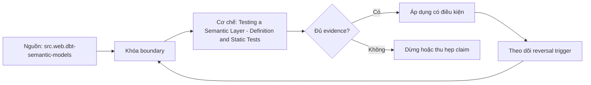

# Testing a Semantic Layer - Definition and Static Tests

> [!abstract] Câu hỏi trung tâm
> Một cửa CI tĩnh cần kiểm những invariant nào để chặn semantic definition sai mà không chặn nhầm declaration hợp lệ?

## 1. Vai trò của tầng kiểm thử rẻ nhất

Definition/static tests chạy từ source files và compiled metadata, không cần quét fact data. Chúng phát hiện lỗi cấu trúc trước khi query correctness tests tốn warehouse compute. Gate này không chứng minh metric đúng về business; nó chỉ chứng minh declaration đầy đủ, graph có thể lập kế hoạch và governance metadata đáp ứng policy. Tên check, invariant, failure code và remediation phải ổn định để CI failure có thể xử lý thay vì chỉ báo “invalid configuration”.

## 2. Sáu phần hợp đồng và tính đầy đủ

Mỗi metric version cần identity, population, grain/entity, time policy, aggregation/operator và interpretation/ownership boundary. Repository có thể lưu một phần trong semantic YAML và phần còn lại trong governed catalog, nhưng CI phải join chúng qua cùng stable ID. Measure cần declared operator và null/empty behavior; dimension cần entity role/domain; declaration cần owner và lifecycle status. Schema validation chỉ kiểm field tồn tại; semantic validation còn kiểm tổ hợp fields có nghĩa.

## 3. Dependency graph và entity graph

Metric dependency graph của derived/ratio/cumulative definitions phải acyclic, dependencies tồn tại và types/grains tương thích. Entity graph có thể có cycle vì nhiều business relationships hợp lệ. Static gate không nên cấm mọi cycle; nó phải phát hiện isolated nodes, missing join keys, contradictory cardinalities và nhiều eligible paths cho cùng metric–dimension request khi không có role/path constraint. Đây là khác biệt giữa cycle làm evaluation bất khả thi và cycle tạo ambiguity cần qualification.

## 4. “Metric mồ côi” cần định nghĩa vận hành

Metric mới chưa có query history không nên bị chặn chỉ vì chưa ai dùng. Static gate có thể yêu cầu declared consumer/use case, certification candidate, owner và deprecation policy. Usage-based orphan detection là audit theo cửa sổ thời gian sau phát hành, không phải pure compile-time validity. Nếu roadmap nói “không ai dùng”, implementation phải ghi rõ đang kiểm missing declared consumer hay zero observed usage; trộn hai nghĩa tạo false positive.

## 5. Thiết kế mutation test

Bộ test tốt được chứng minh bằng lỗi tiêm có chủ đích: bỏ owner, bỏ aggregation, tạo dependency cycle, thêm isolated entity, tạo ambiguous path. Mỗi mutation chỉ thay một invariant, phải fail đúng code và valid sibling chỉ sửa yếu tố đó phải pass. Negative set kiểm underblocking; valid corpus kiểm overblocking. Snapshot error text nguyên văn dễ vỡ theo tool version, nên assert stable code/node/path và giữ raw diagnostic làm artifact.

## 6. Đưa gate vào CI

Pipeline tối thiểu gồm parse/schema, custom contract rules, graph analysis và representative compile checks. Chỉ các lỗi ảnh hưởng invariant mới block merge; warning như zero observed usage cần owner triage/expiry. Cache dependencies theo manifest hash để gate nhanh nhưng invalidation phải bao phủ shared macro, model và policy changes. CI chạy bằng minimal credential, không in secrets và không cần production data cho static stage.

## 7. Nghiệm thu năm vi phạm

Năm pull requests vi phạm phải được tạo từ fixture/repository nhỏ có phiên bản, không sửa production project. Báo cáo ghi mutation, expected rule, actual rule, exit code và elapsed time. Một valid corpus gồm direct metric, derived metric, role-playing entity graph hợp lệ và intentional entity cycle có qualified paths. Done when là năm mutation bị đúng rule chặn và toàn bộ valid corpus pass; “pipeline đỏ” một cách chung chung không đủ.

## 8. Ma trận kiểm chứng từng mệnh đề

Mọi mệnh đề dưới đây cần fixture, invariant, independent oracle và output lưu được. Compile thành công hoặc con số nhìn hợp lý không đủ làm bằng chứng.

### 8.1. schema presence khác semantic completeness

**Mệnh đề cần kiểm.** schema presence khác semantic completeness.

**Cách kiểm.** Chạy schema/contract/graph rules trên five single-mutation fixtures và valid siblings. Phân biệt metric dependency cycle với qualified entity graph cycle; lưu stable rule code, exit code và raw diagnostics. Với mệnh đề này, ghi data shape gây lỗi, expected result và failure signal. Không dùng generated query làm oracle cho chính nó.

**Bằng chứng đạt cho `wiki.semantic-layer.definition-static-tests`.** Lưu contract/graph/config version, seed snapshot, command/SQL, raw output, row/multiplicity ledger và semantic diff. Nếu chưa chạy tool/lab, trạng thái chỉ là test protocol.

### 8.2. stable metric ID phải nối YAML với governance metadata

**Mệnh đề cần kiểm.** stable metric ID phải nối YAML với governance metadata.

**Cách kiểm.** Chạy schema/contract/graph rules trên five single-mutation fixtures và valid siblings. Phân biệt metric dependency cycle với qualified entity graph cycle; lưu stable rule code, exit code và raw diagnostics. Với mệnh đề này, ghi data shape gây lỗi, expected result và failure signal. Không dùng generated query làm oracle cho chính nó.

**Bằng chứng đạt cho `wiki.semantic-layer.definition-static-tests`.** Lưu contract/graph/config version, seed snapshot, command/SQL, raw output, row/multiplicity ledger và semantic diff. Nếu chưa chạy tool/lab, trạng thái chỉ là test protocol.

### 8.3. measure cần aggregation và null behavior

**Mệnh đề cần kiểm.** measure cần aggregation và null behavior.

**Cách kiểm.** Chạy schema/contract/graph rules trên five single-mutation fixtures và valid siblings. Phân biệt metric dependency cycle với qualified entity graph cycle; lưu stable rule code, exit code và raw diagnostics. Với mệnh đề này, ghi data shape gây lỗi, expected result và failure signal. Không dùng generated query làm oracle cho chính nó.

**Bằng chứng đạt cho `wiki.semantic-layer.definition-static-tests`.** Lưu contract/graph/config version, seed snapshot, command/SQL, raw output, row/multiplicity ledger và semantic diff. Nếu chưa chạy tool/lab, trạng thái chỉ là test protocol.

### 8.4. metric dependency graph phải acyclic

**Mệnh đề cần kiểm.** metric dependency graph phải acyclic.

**Cách kiểm.** Chạy schema/contract/graph rules trên five single-mutation fixtures và valid siblings. Phân biệt metric dependency cycle với qualified entity graph cycle; lưu stable rule code, exit code và raw diagnostics. Với mệnh đề này, ghi data shape gây lỗi, expected result và failure signal. Không dùng generated query làm oracle cho chính nó.

**Bằng chứng đạt cho `wiki.semantic-layer.definition-static-tests`.** Lưu contract/graph/config version, seed snapshot, command/SQL, raw output, row/multiplicity ledger và semantic diff. Nếu chưa chạy tool/lab, trạng thái chỉ là test protocol.

### 8.5. entity graph có thể cyclic hợp lệ

**Mệnh đề cần kiểm.** entity graph có thể cyclic hợp lệ.

**Cách kiểm.** Chạy schema/contract/graph rules trên five single-mutation fixtures và valid siblings. Phân biệt metric dependency cycle với qualified entity graph cycle; lưu stable rule code, exit code và raw diagnostics. Với mệnh đề này, ghi data shape gây lỗi, expected result và failure signal. Không dùng generated query làm oracle cho chính nó.

**Bằng chứng đạt cho `wiki.semantic-layer.definition-static-tests`.** Lưu contract/graph/config version, seed snapshot, command/SQL, raw output, row/multiplicity ledger và semantic diff. Nếu chưa chạy tool/lab, trạng thái chỉ là test protocol.

### 8.6. ambiguous eligible paths cần qualification

**Mệnh đề cần kiểm.** ambiguous eligible paths cần qualification.

**Cách kiểm.** Chạy schema/contract/graph rules trên five single-mutation fixtures và valid siblings. Phân biệt metric dependency cycle với qualified entity graph cycle; lưu stable rule code, exit code và raw diagnostics. Với mệnh đề này, ghi data shape gây lỗi, expected result và failure signal. Không dùng generated query làm oracle cho chính nó.

**Bằng chứng đạt cho `wiki.semantic-layer.definition-static-tests`.** Lưu contract/graph/config version, seed snapshot, command/SQL, raw output, row/multiplicity ledger và semantic diff. Nếu chưa chạy tool/lab, trạng thái chỉ là test protocol.

### 8.7. isolated entity cần policy rõ

**Mệnh đề cần kiểm.** isolated entity cần policy rõ.

**Cách kiểm.** Chạy schema/contract/graph rules trên five single-mutation fixtures và valid siblings. Phân biệt metric dependency cycle với qualified entity graph cycle; lưu stable rule code, exit code và raw diagnostics. Với mệnh đề này, ghi data shape gây lỗi, expected result và failure signal. Không dùng generated query làm oracle cho chính nó.

**Bằng chứng đạt cho `wiki.semantic-layer.definition-static-tests`.** Lưu contract/graph/config version, seed snapshot, command/SQL, raw output, row/multiplicity ledger và semantic diff. Nếu chưa chạy tool/lab, trạng thái chỉ là test protocol.

### 8.8. declared consumer khác observed usage

**Mệnh đề cần kiểm.** declared consumer khác observed usage.

**Cách kiểm.** Chạy schema/contract/graph rules trên five single-mutation fixtures và valid siblings. Phân biệt metric dependency cycle với qualified entity graph cycle; lưu stable rule code, exit code và raw diagnostics. Với mệnh đề này, ghi data shape gây lỗi, expected result và failure signal. Không dùng generated query làm oracle cho chính nó.

**Bằng chứng đạt cho `wiki.semantic-layer.definition-static-tests`.** Lưu contract/graph/config version, seed snapshot, command/SQL, raw output, row/multiplicity ledger và semantic diff. Nếu chưa chạy tool/lab, trạng thái chỉ là test protocol.

### 8.9. new metric zero usage không tự động invalid

**Mệnh đề cần kiểm.** new metric zero usage không tự động invalid.

**Cách kiểm.** Chạy schema/contract/graph rules trên five single-mutation fixtures và valid siblings. Phân biệt metric dependency cycle với qualified entity graph cycle; lưu stable rule code, exit code và raw diagnostics. Với mệnh đề này, ghi data shape gây lỗi, expected result và failure signal. Không dùng generated query làm oracle cho chính nó.

**Bằng chứng đạt cho `wiki.semantic-layer.definition-static-tests`.** Lưu contract/graph/config version, seed snapshot, command/SQL, raw output, row/multiplicity ledger và semantic diff. Nếu chưa chạy tool/lab, trạng thái chỉ là test protocol.

### 8.10. mutation phải đổi một invariant

**Mệnh đề cần kiểm.** mutation phải đổi một invariant.

**Cách kiểm.** Chạy schema/contract/graph rules trên five single-mutation fixtures và valid siblings. Phân biệt metric dependency cycle với qualified entity graph cycle; lưu stable rule code, exit code và raw diagnostics. Với mệnh đề này, ghi data shape gây lỗi, expected result và failure signal. Không dùng generated query làm oracle cho chính nó.

**Bằng chứng đạt cho `wiki.semantic-layer.definition-static-tests`.** Lưu contract/graph/config version, seed snapshot, command/SQL, raw output, row/multiplicity ledger và semantic diff. Nếu chưa chạy tool/lab, trạng thái chỉ là test protocol.

### 8.11. failure phải đúng stable rule code

**Mệnh đề cần kiểm.** failure phải đúng stable rule code.

**Cách kiểm.** Chạy schema/contract/graph rules trên five single-mutation fixtures và valid siblings. Phân biệt metric dependency cycle với qualified entity graph cycle; lưu stable rule code, exit code và raw diagnostics. Với mệnh đề này, ghi data shape gây lỗi, expected result và failure signal. Không dùng generated query làm oracle cho chính nó.

**Bằng chứng đạt cho `wiki.semantic-layer.definition-static-tests`.** Lưu contract/graph/config version, seed snapshot, command/SQL, raw output, row/multiplicity ledger và semantic diff. Nếu chưa chạy tool/lab, trạng thái chỉ là test protocol.

### 8.12. valid sibling phát hiện false positive

**Mệnh đề cần kiểm.** valid sibling phát hiện false positive.

**Cách kiểm.** Chạy schema/contract/graph rules trên five single-mutation fixtures và valid siblings. Phân biệt metric dependency cycle với qualified entity graph cycle; lưu stable rule code, exit code và raw diagnostics. Với mệnh đề này, ghi data shape gây lỗi, expected result và failure signal. Không dùng generated query làm oracle cho chính nó.

**Bằng chứng đạt cho `wiki.semantic-layer.definition-static-tests`.** Lưu contract/graph/config version, seed snapshot, command/SQL, raw output, row/multiplicity ledger và semantic diff. Nếu chưa chạy tool/lab, trạng thái chỉ là test protocol.

### 8.13. raw diagnostics phải gắn tool version

**Mệnh đề cần kiểm.** raw diagnostics phải gắn tool version.

**Cách kiểm.** Chạy schema/contract/graph rules trên five single-mutation fixtures và valid siblings. Phân biệt metric dependency cycle với qualified entity graph cycle; lưu stable rule code, exit code và raw diagnostics. Với mệnh đề này, ghi data shape gây lỗi, expected result và failure signal. Không dùng generated query làm oracle cho chính nó.

**Bằng chứng đạt cho `wiki.semantic-layer.definition-static-tests`.** Lưu contract/graph/config version, seed snapshot, command/SQL, raw output, row/multiplicity ledger và semantic diff. Nếu chưa chạy tool/lab, trạng thái chỉ là test protocol.

### 8.14. CI credential phải least privilege

**Mệnh đề cần kiểm.** CI credential phải least privilege.

**Cách kiểm.** Chạy schema/contract/graph rules trên five single-mutation fixtures và valid siblings. Phân biệt metric dependency cycle với qualified entity graph cycle; lưu stable rule code, exit code và raw diagnostics. Với mệnh đề này, ghi data shape gây lỗi, expected result và failure signal. Không dùng generated query làm oracle cho chính nó.

**Bằng chứng đạt cho `wiki.semantic-layer.definition-static-tests`.** Lưu contract/graph/config version, seed snapshot, command/SQL, raw output, row/multiplicity ledger và semantic diff. Nếu chưa chạy tool/lab, trạng thái chỉ là test protocol.

### 8.15. static pass không chứng minh business correctness

**Mệnh đề cần kiểm.** static pass không chứng minh business correctness.

**Cách kiểm.** Chạy schema/contract/graph rules trên five single-mutation fixtures và valid siblings. Phân biệt metric dependency cycle với qualified entity graph cycle; lưu stable rule code, exit code và raw diagnostics. Với mệnh đề này, ghi data shape gây lỗi, expected result và failure signal. Không dùng generated query làm oracle cho chính nó.

**Bằng chứng đạt cho `wiki.semantic-layer.definition-static-tests`.** Lưu contract/graph/config version, seed snapshot, command/SQL, raw output, row/multiplicity ledger và semantic diff. Nếu chưa chạy tool/lab, trạng thái chỉ là test protocol.

## 9. Quy trình phản biện

1. Viết population, grain, identities, time và aggregation trước tool syntax.
2. Gắn metric/dimension với qualified entity role và allowed path.
3. Đếm rows, distinct base keys, unmatched và match multiplicity sau từng join edge.
4. Dùng independent oracle từ atomic facts; so intermediate components trước final value.
5. Chạy invalid cases cùng valid siblings để bắt underblocking và overblocking.
6. Khóa exact tool/config/mart versions; compile output và diagnostics là version-specific evidence.
7. Lưu failed runs, limitations và trigger làm certification hết hiệu lực.

## 10. Câu hỏi tự kiểm tra

1. Join path nào được chọn và business role nào biện minh cho nó?
2. Base fact keys có bị nhân hoặc mất sau từng edge không?
3. Dimension có reachable, đúng grain và compatible với aggregation không?
4. Parse/validate/compile/reconciliation xác nhận những lớp khác nhau nào?
5. Generated SQL khác contract ở population, filter, path hay aggregation nào?
6. Bằng chứng nào độc lập với engine output đang được kiểm?

## 11. Giới hạn và điều chưa cho phép kết luận

- Chưa chạy MetricFlow, warehouse queries, execution plans hoặc labs; note mô tả protocol và expected evidence.
- dbt/MetricFlow docs được kiểm ngày 2026-10-01; commands và YAML phụ thuộc engine/version/environment.
- Thuật ngữ fan/chasm có thể khác giữa sản phẩm; invariant của bài là grain, multiplicity, population và semantic path.
- Kimball–Ross và PostgreSQL hỗ trợ modeling/SQL mechanics; compatibility/certification workflow là curriculum synthesis.
- Owner chưa phê duyệt semantic meaning nên note giữ trạng thái `review`.

## Reference
1. [[SRC-DBT-SEMANTIC-MODELS]]
2. [[SRC-REIS-HOUSLEY-FUNDAMENTALS-DATA-ENGINEERING]]
3. [[SRC-KIMBALL-ROSS-DW-TOOLKIT-3E]]

## Source coverage

| Source slice | Nội dung sử dụng | Trạng thái |
|---|---|---|
| [[SRC-DBT-SEMANTIC-MODELS]] | Modeling, SQL behavior hoặc current product semantics liên quan | Đã đọc phạm vi có locator; không suy ngoài phạm vi |
| [[SRC-REIS-HOUSLEY-FUNDAMENTALS-DATA-ENGINEERING]] | Modeling, SQL behavior hoặc current product semantics liên quan | Đã đọc phạm vi có locator; không suy ngoài phạm vi |
| [[SRC-KIMBALL-ROSS-DW-TOOLKIT-3E]] | Modeling, SQL behavior hoặc current product semantics liên quan | Đã đọc phạm vi có locator; không suy ngoài phạm vi |

## Key takeaways
- Join correctness phải được chứng minh bằng grain, multiplicity, unmatched ledger và independent oracle.
- Metric–dimension compatibility là rule ba trạng thái có lý do, không phải danh sách field tùy ý.
- Parse/validate/compile không thay reconciliation với business contract.
- Generated SQL phải được đọc theo population, path, aggregation và time/filter semantics.
- Chưa chạy protocol thì note là tài liệu học thuật có truy nguồn, không phải chứng nhận production.

<!-- ATOMIC-EXECUTION-CAPSULE:START -->

## Execution capsule — kiểm chứng `wiki.semantic-layer.definition-static-tests`

> [!important] Phân loại mệnh đề
> Với `wiki.semantic-layer.definition-static-tests`, sơ đồ, ví dụ và artifact về **Testing a Semantic Layer - Definition and Static Tests** là **synthesis để kiểm chứng**; chúng không phải trích dẫn hay case nguyên văn của nguồn.

### Sơ đồ cơ chế và điểm kiểm soát



Đọc sơ đồ `wiki.semantic-layer.definition-static-tests` từ trái sang phải: source chỉ cung cấp claim ban đầu cho **Testing a Semantic Layer - Definition and Static Tests**; quyết định chỉ được đi tiếp sau khi boundary, evidence và điều kiện đảo quyết định đã hiện hữu.

### Ví dụ làm việc có thể bác bỏ

**Input.** Một đội cần trả lời: “Một cửa CI tĩnh cần kiểm những invariant nào để chặn semantic definition sai mà không chặn nhầm declaration hợp lệ?” cho một phạm vi nhỏ, có owner và deadline rõ.

**Decision.** Đội áp dụng **Testing a Semantic Layer - Definition and Static Tests** trên control và variant chỉ khác một assumption; expected result và hard constraints được khóa trước khi chạy.

**Outcome.** Với `wiki.semantic-layer.definition-static-tests`, nếu observation vi phạm hard constraint hoặc oracle độc lập không xác nhận **Testing a Semantic Layer - Definition and Static Tests**, đội thu hẹp claim hay đảo quyết định. Nếu đạt, kết luận vẫn kèm scope, version và review date; một lần thành công không được nâng thành quy luật phổ quát.

### Artifact thực thi tối thiểu

```sql
-- Verification harness for: Testing a Semantic Layer - Definition and Static Tests
WITH evidence AS (
    SELECT 'wiki.semantic-layer.definition-static-tests' AS concept_id,
           'boundary_declared' AS check_name, 1 AS passed
    UNION ALL
    SELECT 'wiki.semantic-layer.definition-static-tests', 'independent_oracle', 1
    UNION ALL
    SELECT 'wiki.semantic-layer.definition-static-tests', 'reversal_trigger_recorded', 1
)
SELECT concept_id,
       MIN(passed) AS all_hard_checks_pass,
       COUNT(*) AS evidence_items
FROM evidence
GROUP BY concept_id
HAVING MIN(passed) = 1;
```

Artifact của `wiki.semantic-layer.definition-static-tests` buộc người dùng ghi boundary, oracle và reversal trigger cho **Testing a Semantic Layer - Definition and Static Tests**. Các giá trị minh họa phải được thay bằng evidence thật trước khi dùng cho quyết định.

### Tự kiểm tra trước khi tái sử dụng

1. Bạn có thể trả lời `Một cửa CI tĩnh cần kiểm những invariant nào để chặn semantic definition sai mà không chặn nhầm declaration hợp lệ?` bằng một câu mà không kéo thêm concept thứ hai không?
2. Source locator nào đỡ cho claim, và phần nào chỉ là synthesis trong note?
3. Observation nào khiến bạn dừng, thu hẹp hoặc đảo quyết định?
4. Artifact nào cho phép một reviewer độc lập tái hiện kết quả?

<!-- ATOMIC-EXECUTION-CAPSULE:END -->
