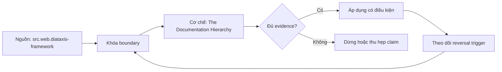

# The Documentation Hierarchy

> [!abstract] Câu hỏi trung tâm
> Bộ tài liệu cho data product phải tách theo nhu cầu đọc nào, đồng bộ với product ra sao và được kiểm bằng hành vi nào thay vì số trang?

## 1. Tài liệu là một hệ giao diện

Tài liệu không phải phần giải thích thêm sau khi product đã hoàn tất. Consumer dựa vào tên, mô tả, ví dụ, grain, cutoff và limitation để quyết định có dùng product hay không; do đó các thành phần này thuộc public interface. Hệ tài liệu phải có owner, version, effective date, product/contract ID và đường báo lỗi. Một trang dài chứa đủ mọi thứ vẫn có thể thất bại nếu người mới không biết bắt đầu ở đâu. Đơn vị đánh giá không phải số chữ mà là tác vụ: chọn đúng product, chạy được use case đầu, tra được một field và biết kết luận nào bị cấm.

## 2. Bốn tầng theo bốn câu hỏi

Tầng discovery trả lời product là gì, dành cho quyết định nào, owner và trust state nào. Tầng getting-started đưa prerequisite, access path, ba ví dụ chạy được và expected result. Tầng reference mô tả grain, keys, fields, metric contracts, freshness, quality, security và version. Tầng context giải thích design decisions, assumptions, trade-offs, known gaps và interpretation limits. Diátaxis phân loại tutorial, how-to, reference và explanation theo nhu cầu người đọc; hierarchy của bài là synthesis cho data product, không phải tên bốn quadrant nguyên văn của Diátaxis.

## 3. Discovery phải hỗ trợ quyết định nhanh

Một discovery card tốt cho phép người đọc loại product không phù hợp mà không mở schema. Nó nêu business capability, population, time coverage, supported questions, prohibited questions, owner, certification state, freshness và link truy cập. Ngưỡng 30 giây là acceptance target nội bộ cần đo, không phải quy luật nhận thức. Nếu card dùng tên bảng kỹ thuật, liệt kê hàng trăm cột hoặc che giấu limitation, người đọc có thể chọn sai nhanh hơn. Negative fit statement, chẳng hạn không dùng cho causal attribution hoặc real-time operations, có giá trị ngang danh sách use cases.

## 4. Getting-started phải thực thi được

Ba example queries đại diện happy path, boundary case và common filter/join. Mỗi ví dụ pin product/version, environment, role, parameters, expected columns, row-shape và cutoff. Test chỉ parse SQL là chưa đủ; query phải chạy trên fixture hoặc safe environment và assertion phải phát hiện empty result, wrong grain hoặc semantic drift. Credentials, secrets và production identifiers không được hard-code. Ví dụ cần copy-run được nhưng cũng phải giải thích điều kiện đúng, nếu không người dùng sẽ sao chép query ngoài population hoặc time window hợp lệ.

## 5. Reference sinh từ source of truth

Reference mô tả chính xác, ít diễn giải và dễ tra cứu. Phần có thể sinh từ contract/schema/semantic config nên generate thay vì chép tay: columns, types, keys, metric IDs, dimensions, version và lineage. dbt có thể kết hợp descriptions với metadata introspect và lineage, nhưng cột xuất hiện trên docs không có nghĩa cột đã được mô tả. Generated reference cần build timestamp và artifact fingerprint; phần curated như business definition, exception, sensitive-use rule vẫn cần owner review. Wiki được phép làm entry point, nhưng source-of-truth link phải quay về version cạnh code.

## 6. Context giữ lý do và ranh giới diễn giải

ADR hoặc explanation record lưu vì sao chọn grain, population, time, source, aggregation và privacy control; alternatives nào bị loại; điều kiện nào buộc xem lại. Interpretation limits phải viết thành câu kiểm được: dữ liệu quan sát không chứng minh causal effect; snapshot không dùng cho event sequence; missing segment làm comparison lệch. Ba nội dung nhanh lạc hậu nếu viết tay là dynamic schema inventory, current usage leaderboard và operational status; chúng nên được generate hoặc link live system. Context không được trộn vào reference đến mức người tra type phải đọc một bài luận.

## 7. Kiểm hierarchy bằng người lạ và drift

Test có hai lớp. Lớp consumer: người chưa biết product quyết định fit/no-fit, xin quyền hoặc dùng fixture, chạy query đầu, giải thích grain/freshness/limitation; ghi thời gian, lỗi và câu hỏi hỗ trợ. Lớp consistency: contract version, public fields, metric IDs, sample queries và schedule promises khớp artifacts hiện hành. Một người hoàn tất nhanh nhưng hiểu sai là failure; một bộ docs đúng kỹ thuật nhưng không ai tìm được cũng là failure. Khi người dùng hỏi, không trả lời trực tiếp trước khi ghi lại điểm thiếu trong information architecture.

## 8. Ma trận kiểm chứng từng mệnh đề

Mỗi mệnh đề dưới đây cần artifact hoặc observation lưu được. Một trang tài liệu tồn tại, catalog có search box hoặc người dùng nói ‘dễ’ không tự là bằng chứng.

### 8.1. bốn tầng phục vụ bốn reader jobs khác nhau

**Mệnh đề cần kiểm.** bốn tầng phục vụ bốn reader jobs khác nhau.

**Cách kiểm.** Dựng đủ bốn tầng cho một product/version; nhờ người chưa biết product thực hiện fit/no-fit, chạy query đầu, tra một field và explain-back grain/freshness/limit. Đồng thời tạo một schema drift và một example drift để kiểm consistency. Với mệnh đề này, ghi participant/task hoặc artifact version, điều kiện đầu vào, expected observation, failure signal và yếu tố làm kết luận không còn đúng.

**Bằng chứng đạt cho `wiki.data-product.documentation-hierarchy`.** Lưu protocol hoặc command, raw observations, numerator/denominator nếu có, exact product/docs version, reviewer và artifact hash. Nếu chưa chạy study/lab, chỉ ghi đây là protocol; không biến expected result thành kết quả quan sát.

### 8.2. discovery card cho phép cả fit và no-fit decision

**Mệnh đề cần kiểm.** discovery card cho phép cả fit và no-fit decision.

**Cách kiểm.** Dựng đủ bốn tầng cho một product/version; nhờ người chưa biết product thực hiện fit/no-fit, chạy query đầu, tra một field và explain-back grain/freshness/limit. Đồng thời tạo một schema drift và một example drift để kiểm consistency. Với mệnh đề này, ghi participant/task hoặc artifact version, điều kiện đầu vào, expected observation, failure signal và yếu tố làm kết luận không còn đúng.

**Bằng chứng đạt cho `wiki.data-product.documentation-hierarchy`.** Lưu protocol hoặc command, raw observations, numerator/denominator nếu có, exact product/docs version, reviewer và artifact hash. Nếu chưa chạy study/lab, chỉ ghi đây là protocol; không biến expected result thành kết quả quan sát.

### 8.3. 30 giây là target cần đo chứ không là định luật

**Mệnh đề cần kiểm.** 30 giây là target cần đo chứ không là định luật.

**Cách kiểm.** Dựng đủ bốn tầng cho một product/version; nhờ người chưa biết product thực hiện fit/no-fit, chạy query đầu, tra một field và explain-back grain/freshness/limit. Đồng thời tạo một schema drift và một example drift để kiểm consistency. Với mệnh đề này, ghi participant/task hoặc artifact version, điều kiện đầu vào, expected observation, failure signal và yếu tố làm kết luận không còn đúng.

**Bằng chứng đạt cho `wiki.data-product.documentation-hierarchy`.** Lưu protocol hoặc command, raw observations, numerator/denominator nếu có, exact product/docs version, reviewer và artifact hash. Nếu chưa chạy study/lab, chỉ ghi đây là protocol; không biến expected result thành kết quả quan sát.

### 8.4. getting-started examples phải chạy và có expected result

**Mệnh đề cần kiểm.** getting-started examples phải chạy và có expected result.

**Cách kiểm.** Dựng đủ bốn tầng cho một product/version; nhờ người chưa biết product thực hiện fit/no-fit, chạy query đầu, tra một field và explain-back grain/freshness/limit. Đồng thời tạo một schema drift và một example drift để kiểm consistency. Với mệnh đề này, ghi participant/task hoặc artifact version, điều kiện đầu vào, expected observation, failure signal và yếu tố làm kết luận không còn đúng.

**Bằng chứng đạt cho `wiki.data-product.documentation-hierarchy`.** Lưu protocol hoặc command, raw observations, numerator/denominator nếu có, exact product/docs version, reviewer và artifact hash. Nếu chưa chạy study/lab, chỉ ghi đây là protocol; không biến expected result thành kết quả quan sát.

### 8.5. example query cần pin version và cutoff

**Mệnh đề cần kiểm.** example query cần pin version và cutoff.

**Cách kiểm.** Dựng đủ bốn tầng cho một product/version; nhờ người chưa biết product thực hiện fit/no-fit, chạy query đầu, tra một field và explain-back grain/freshness/limit. Đồng thời tạo một schema drift và một example drift để kiểm consistency. Với mệnh đề này, ghi participant/task hoặc artifact version, điều kiện đầu vào, expected observation, failure signal và yếu tố làm kết luận không còn đúng.

**Bằng chứng đạt cho `wiki.data-product.documentation-hierarchy`.** Lưu protocol hoặc command, raw observations, numerator/denominator nếu có, exact product/docs version, reviewer và artifact hash. Nếu chưa chạy study/lab, chỉ ghi đây là protocol; không biến expected result thành kết quả quan sát.

### 8.6. reference ưu tiên generated metadata

**Mệnh đề cần kiểm.** reference ưu tiên generated metadata.

**Cách kiểm.** Dựng đủ bốn tầng cho một product/version; nhờ người chưa biết product thực hiện fit/no-fit, chạy query đầu, tra một field và explain-back grain/freshness/limit. Đồng thời tạo một schema drift và một example drift để kiểm consistency. Với mệnh đề này, ghi participant/task hoặc artifact version, điều kiện đầu vào, expected observation, failure signal và yếu tố làm kết luận không còn đúng.

**Bằng chứng đạt cho `wiki.data-product.documentation-hierarchy`.** Lưu protocol hoặc command, raw observations, numerator/denominator nếu có, exact product/docs version, reviewer và artifact hash. Nếu chưa chạy study/lab, chỉ ghi đây là protocol; không biến expected result thành kết quả quan sát.

### 8.7. generated docs vẫn có thể thiếu descriptions

**Mệnh đề cần kiểm.** generated docs vẫn có thể thiếu descriptions.

**Cách kiểm.** Dựng đủ bốn tầng cho một product/version; nhờ người chưa biết product thực hiện fit/no-fit, chạy query đầu, tra một field và explain-back grain/freshness/limit. Đồng thời tạo một schema drift và một example drift để kiểm consistency. Với mệnh đề này, ghi participant/task hoặc artifact version, điều kiện đầu vào, expected observation, failure signal và yếu tố làm kết luận không còn đúng.

**Bằng chứng đạt cho `wiki.data-product.documentation-hierarchy`.** Lưu protocol hoặc command, raw observations, numerator/denominator nếu có, exact product/docs version, reviewer và artifact hash. Nếu chưa chạy study/lab, chỉ ghi đây là protocol; không biến expected result thành kết quả quan sát.

### 8.8. context lưu alternatives và reversal triggers

**Mệnh đề cần kiểm.** context lưu alternatives và reversal triggers.

**Cách kiểm.** Dựng đủ bốn tầng cho một product/version; nhờ người chưa biết product thực hiện fit/no-fit, chạy query đầu, tra một field và explain-back grain/freshness/limit. Đồng thời tạo một schema drift và một example drift để kiểm consistency. Với mệnh đề này, ghi participant/task hoặc artifact version, điều kiện đầu vào, expected observation, failure signal và yếu tố làm kết luận không còn đúng.

**Bằng chứng đạt cho `wiki.data-product.documentation-hierarchy`.** Lưu protocol hoặc command, raw observations, numerator/denominator nếu có, exact product/docs version, reviewer và artifact hash. Nếu chưa chạy study/lab, chỉ ghi đây là protocol; không biến expected result thành kết quả quan sát.

### 8.9. interpretation limit phải quan sát được

**Mệnh đề cần kiểm.** interpretation limit phải quan sát được.

**Cách kiểm.** Dựng đủ bốn tầng cho một product/version; nhờ người chưa biết product thực hiện fit/no-fit, chạy query đầu, tra một field và explain-back grain/freshness/limit. Đồng thời tạo một schema drift và một example drift để kiểm consistency. Với mệnh đề này, ghi participant/task hoặc artifact version, điều kiện đầu vào, expected observation, failure signal và yếu tố làm kết luận không còn đúng.

**Bằng chứng đạt cho `wiki.data-product.documentation-hierarchy`.** Lưu protocol hoặc command, raw observations, numerator/denominator nếu có, exact product/docs version, reviewer và artifact hash. Nếu chưa chạy study/lab, chỉ ghi đây là protocol; không biến expected result thành kết quả quan sát.

### 8.10. dynamic inventory không nên chép tay

**Mệnh đề cần kiểm.** dynamic inventory không nên chép tay.

**Cách kiểm.** Dựng đủ bốn tầng cho một product/version; nhờ người chưa biết product thực hiện fit/no-fit, chạy query đầu, tra một field và explain-back grain/freshness/limit. Đồng thời tạo một schema drift và một example drift để kiểm consistency. Với mệnh đề này, ghi participant/task hoặc artifact version, điều kiện đầu vào, expected observation, failure signal và yếu tố làm kết luận không còn đúng.

**Bằng chứng đạt cho `wiki.data-product.documentation-hierarchy`.** Lưu protocol hoặc command, raw observations, numerator/denominator nếu có, exact product/docs version, reviewer và artifact hash. Nếu chưa chạy study/lab, chỉ ghi đây là protocol; không biến expected result thành kết quả quan sát.

### 8.11. wiki entry point không thay source of truth

**Mệnh đề cần kiểm.** wiki entry point không thay source of truth.

**Cách kiểm.** Dựng đủ bốn tầng cho một product/version; nhờ người chưa biết product thực hiện fit/no-fit, chạy query đầu, tra một field và explain-back grain/freshness/limit. Đồng thời tạo một schema drift và một example drift để kiểm consistency. Với mệnh đề này, ghi participant/task hoặc artifact version, điều kiện đầu vào, expected observation, failure signal và yếu tố làm kết luận không còn đúng.

**Bằng chứng đạt cho `wiki.data-product.documentation-hierarchy`.** Lưu protocol hoặc command, raw observations, numerator/denominator nếu có, exact product/docs version, reviewer và artifact hash. Nếu chưa chạy study/lab, chỉ ghi đây là protocol; không biến expected result thành kết quả quan sát.

### 8.12. consumer test cần explain-back

**Mệnh đề cần kiểm.** consumer test cần explain-back.

**Cách kiểm.** Dựng đủ bốn tầng cho một product/version; nhờ người chưa biết product thực hiện fit/no-fit, chạy query đầu, tra một field và explain-back grain/freshness/limit. Đồng thời tạo một schema drift và một example drift để kiểm consistency. Với mệnh đề này, ghi participant/task hoặc artifact version, điều kiện đầu vào, expected observation, failure signal và yếu tố làm kết luận không còn đúng.

**Bằng chứng đạt cho `wiki.data-product.documentation-hierarchy`.** Lưu protocol hoặc command, raw observations, numerator/denominator nếu có, exact product/docs version, reviewer và artifact hash. Nếu chưa chạy study/lab, chỉ ghi đây là protocol; không biến expected result thành kết quả quan sát.

### 8.13. hoàn tất nhanh nhưng hiểu sai vẫn là failure

**Mệnh đề cần kiểm.** hoàn tất nhanh nhưng hiểu sai vẫn là failure.

**Cách kiểm.** Dựng đủ bốn tầng cho một product/version; nhờ người chưa biết product thực hiện fit/no-fit, chạy query đầu, tra một field và explain-back grain/freshness/limit. Đồng thời tạo một schema drift và một example drift để kiểm consistency. Với mệnh đề này, ghi participant/task hoặc artifact version, điều kiện đầu vào, expected observation, failure signal và yếu tố làm kết luận không còn đúng.

**Bằng chứng đạt cho `wiki.data-product.documentation-hierarchy`.** Lưu protocol hoặc command, raw observations, numerator/denominator nếu có, exact product/docs version, reviewer và artifact hash. Nếu chưa chạy study/lab, chỉ ghi đây là protocol; không biến expected result thành kết quả quan sát.

### 8.14. documentation version gắn product version

**Mệnh đề cần kiểm.** documentation version gắn product version.

**Cách kiểm.** Dựng đủ bốn tầng cho một product/version; nhờ người chưa biết product thực hiện fit/no-fit, chạy query đầu, tra một field và explain-back grain/freshness/limit. Đồng thời tạo một schema drift và một example drift để kiểm consistency. Với mệnh đề này, ghi participant/task hoặc artifact version, điều kiện đầu vào, expected observation, failure signal và yếu tố làm kết luận không còn đúng.

**Bằng chứng đạt cho `wiki.data-product.documentation-hierarchy`.** Lưu protocol hoặc command, raw observations, numerator/denominator nếu có, exact product/docs version, reviewer và artifact hash. Nếu chưa chạy study/lab, chỉ ghi đây là protocol; không biến expected result thành kết quả quan sát.

### 8.15. mỗi câu hỏi hỗ trợ tạo một finding có owner

**Mệnh đề cần kiểm.** mỗi câu hỏi hỗ trợ tạo một finding có owner.

**Cách kiểm.** Dựng đủ bốn tầng cho một product/version; nhờ người chưa biết product thực hiện fit/no-fit, chạy query đầu, tra một field và explain-back grain/freshness/limit. Đồng thời tạo một schema drift và một example drift để kiểm consistency. Với mệnh đề này, ghi participant/task hoặc artifact version, điều kiện đầu vào, expected observation, failure signal và yếu tố làm kết luận không còn đúng.

**Bằng chứng đạt cho `wiki.data-product.documentation-hierarchy`.** Lưu protocol hoặc command, raw observations, numerator/denominator nếu có, exact product/docs version, reviewer và artifact hash. Nếu chưa chạy study/lab, chỉ ghi đây là protocol; không biến expected result thành kết quả quan sát.

## 9. Quy trình phản biện

1. Viết user need, task, persona, stakes và scope trước khi chọn catalog, tài liệu hoặc metric.
2. Tách source fact, curriculum synthesis, organizational policy và observation từ study.
3. Khóa task/protocol/oracle trước khi đo; mọi deviation phải được ghi.
4. Kiểm correct outcome và interpretation, không chỉ completion hoặc cảm nhận.
5. Phân loại lỗi theo cơ chế để sửa đúng lớp: metadata, docs, interface, trust, access hay skill.
6. Kiểm changed user group, changed task và degraded state trước khi khái quát.
7. Chưa có execution evidence thì giữ trạng thái `review`.

## 10. Câu hỏi tự kiểm tra

1. User task nào đang được hỗ trợ, và điều gì nằm ngoài scope?
2. Oracle nào xác định product hoặc kết quả đúng?
3. Số đo dùng denominator nào và loại invalid attempt theo rule nào?
4. Điểm nào cần automation, điểm nào bắt buộc human judgment?
5. Một kết quả nhanh nhưng sai nghĩa được phát hiện ở đâu?
6. Điều kiện nào làm kết luận từ sample hoặc catalog hiện tại không còn áp dụng?

## 11. Giới hạn và điều chưa cho phép kết luận

- Chưa chạy user study, catalog experiment, documentation CI hoặc support-boundary exercise; note mô tả protocol và expected evidence.
- Tài liệu web được kiểm ngày 2026-10-01; tính năng, giao diện, license và guidance có thể đổi.
- Bốn tầng documentation, bốn điều kiện self-service và bốn số đo của module là curriculum synthesis; không gán nguyên văn cho một nguồn.
- Cỡ mẫu nhỏ cho formative discovery không cho phép kết luận tỷ lệ toàn population hoặc statistical significance.
- Dữ liệu người tham gia, recording và screen capture cần consent, minimization, retention và access controls riêng.
- Note giữ trạng thái `review` cho tới khi chủ dự án duyệt semantic meaning.

## Reference
1. [[SRC-DIATAXIS-FRAMEWORK]]
2. [[SRC-DBT-DOCUMENTATION]]
3. [[SRC-SOMMERVILLE-SOFTWARE-ENGINEERING-10E]]

## Source coverage

| Source slice | Nội dung sử dụng | Trạng thái |
|---|---|---|
| [[SRC-DIATAXIS-FRAMEWORK]] | Khái niệm, mechanism hoặc study boundary liên quan | Đã đọc locator trong source record; không suy ngoài phạm vi |
| [[SRC-DBT-DOCUMENTATION]] | Khái niệm, mechanism hoặc study boundary liên quan | Đã đọc locator trong source record; không suy ngoài phạm vi |
| [[SRC-SOMMERVILLE-SOFTWARE-ENGINEERING-10E]] | Khái niệm, mechanism hoặc study boundary liên quan | Đã đọc locator trong source record; không suy ngoài phạm vi |

## Key takeaways
- Tách reader jobs, sinh reference từ source of truth và kiểm bằng fit/query/explain-back tasks.
- Chỉ số phải gắn task, persona, product version, protocol và denominator.
- Correct completion gồm cả kết quả và cách diễn giải đúng; confident-wrong là failure nghiêm trọng.
- Công cụ catalog, docs generator và CI cung cấp mechanism, không tự chứng minh outcome.
- Chưa chạy study hoặc lab thì artifact là tài liệu học thuật đã kiểm cấu trúc, không phải chứng nhận thực tế.

<!-- ATOMIC-EXECUTION-CAPSULE:START -->

## Execution capsule — kiểm chứng `wiki.data-product.documentation-hierarchy`

> [!important] Phân loại mệnh đề
> Với `wiki.data-product.documentation-hierarchy`, sơ đồ, ví dụ và artifact về **The Documentation Hierarchy** là **synthesis để kiểm chứng**; chúng không phải trích dẫn hay case nguyên văn của nguồn.

### Sơ đồ cơ chế và điểm kiểm soát



Đọc sơ đồ `wiki.data-product.documentation-hierarchy` từ trái sang phải: source chỉ cung cấp claim ban đầu cho **The Documentation Hierarchy**; quyết định chỉ được đi tiếp sau khi boundary, evidence và điều kiện đảo quyết định đã hiện hữu.

### Artifact thực thi tối thiểu

```sql
-- Verification harness for: The Documentation Hierarchy
WITH evidence AS (
    SELECT 'wiki.data-product.documentation-hierarchy' AS concept_id,
           'boundary_declared' AS check_name, 1 AS passed
    UNION ALL
    SELECT 'wiki.data-product.documentation-hierarchy', 'independent_oracle', 1
    UNION ALL
    SELECT 'wiki.data-product.documentation-hierarchy', 'reversal_trigger_recorded', 1
)
SELECT concept_id,
       MIN(passed) AS all_hard_checks_pass,
       COUNT(*) AS evidence_items
FROM evidence
GROUP BY concept_id
HAVING MIN(passed) = 1;
```

Artifact của `wiki.data-product.documentation-hierarchy` buộc người dùng ghi boundary, oracle và reversal trigger cho **The Documentation Hierarchy**. Các giá trị minh họa phải được thay bằng evidence thật trước khi dùng cho quyết định.

### Tự kiểm tra trước khi tái sử dụng

1. Bạn có thể trả lời `Bộ tài liệu cho data product phải tách theo nhu cầu đọc nào, đồng bộ với product ra sao và được kiểm bằng hành vi nào thay vì số trang?` bằng một câu mà không kéo thêm concept thứ hai không?
2. Source locator nào đỡ cho claim, và phần nào chỉ là synthesis trong note?
3. Observation nào khiến bạn dừng, thu hẹp hoặc đảo quyết định?
4. Artifact nào cho phép một reviewer độc lập tái hiện kết quả?

<!-- ATOMIC-EXECUTION-CAPSULE:END -->
