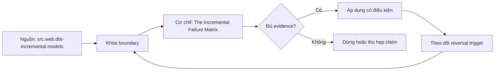

# The Incremental Failure Matrix

> [!abstract] Câu hỏi trung tâm
> Failure matrix nào bao phủ source, selection, compute, publication và recovery để một incremental model không che silent divergence?

## 1. Matrix theo boundary

Hàng là failure: late/missing change, duplicate, schema shift, nondeterministic order, partial source, warehouse error, unknown commit, checkpoint drift, manual target edit. Cột là stage: discover/select, extract, transform, write, publish, checkpoint, observe/recover. Mỗi ô ghi detection, contained state, retry behavior, reconciliation và owner. Danh sách lỗi không có stage/state transition không giúp operator biết dữ liệu nào đang đáng tin.

## 2. Source và selection failures

Clock skew, unchanged cursor, expired retention, hard delete invisible và tie boundary tạo silent omission. Overlap chỉ chữa bounded lateness, không chữa delete vô hình. Detect bằng source lag, watermark age, deletion feed và fixed-boundary reconciliation. Khi checkpoint rơi ngoài retention, dừng incremental và bootstrap/backfill có kiểm soát; không nhảy checkpoint tới hiện tại để dashboard xanh.

## 3. Transform failures

Macro/config change, nondeterministic row_number, fanout, null key, window context thiếu và schema coercion có thể tạo output hợp lệ cú pháp nhưng sai. Compile/test chỉ bắt một phần. Mutation suite và full-equivalence oracle phải có ca mỗi lỗi. Quarantine same key different payload; không dùng arbitrary dedup. Changed logic cần impact range và backfill plan, vì source không phát lại lịch sử chỉ do code đổi.

## 4. Write và publication failures

Duplicate source keys làm merge fail hoặc chọn tùy engine; delete-insert crash có thể phơi gap; partition overwrite với incomplete slice xóa dữ liệu; commit outcome unknown dẫn tới retry blind. Build candidate, validate, atomic publish theo exact adapter guarantee và resolve outcome bằng transaction/query/publication ID. Target table tồn tại sau failure không chứng minh complete state. Giữ parent fingerprint để compare-and-set.

## 5. Checkpoint và side effects

Advance checkpoint trước durable publish gây gap; sau publish gây replay, nên design ưu tiên replay được hấp thụ. Artifact upload, audit row, notification và downstream trigger cũng cần state/identity. Một table đúng nhưng trigger chạy hai lần vẫn fail end-to-end idempotency. Persist run ledger with input boundary, code hash, candidate/publication ID, checkpoint before/after và disposition.

## 6. Game day scoring

Inject từng failure tại controlled kill point, dự báo state trước khi chạy rồi so observed. Chấm detection latency, blast radius, data divergence, recovery time, manual steps và evidence completeness. Stop rule bảo vệ source/shared warehouse. Rerun targeted scenario sau remediation. Matrix chỉ được đóng khi không có failure nào kết thúc bằng operator đoán target hiện đang đúng.

## 7. Ma trận kiểm chứng từng mệnh đề

Trong `The Incremental Failure Matrix`, mỗi claim phải nối được tới input boundary, compiled hoặc executed artifact, trạng thái trước-sau, failure signal và independent oracle. Một command kết thúc với exit code 0 không tự chứng minh dữ liệu đúng, đầy đủ hoặc phù hợp với consumer contract. Protocol nền của bài này: Dùng project/fixture nhỏ có exact boundary và owner; capture source, compiled/runtime artifacts, relations và consumer-facing diff; đối soát bằng alternate computation hoặc inventory độc lập.

### 7.1. Incremental-failure probe 1: injection point, durable state, alert, recovery và reconciliation phải nối được

**Mệnh đề cần kiểm.** Incremental-failure probe 1: injection point, durable state, alert, recovery và reconciliation phải nối được.

**Thiết kế phép thử cho `wiki.transformation.incremental-failure-matrix`.** Với `Incremental-failure probe 1: injection point, durable state, alert, recovery và reconciliation phải nối được`, Bắt đầu bằng ca nhỏ nhất có thể làm mệnh đề sai; chỉ thêm dữ liệu sau khi failure signal đã xuất hiện đúng chỗ. Cách này phân biệt một assertion có lực với một bài demo chỉ đi qua happy path. Khóa versions, target và input boundary có liên quan; lưu command, compiled SQL hoặc scheduler context cùng query IDs và timestamps.

**Bằng chứng cần giữ.** Hồ sơ của `Incremental-failure probe 1: injection point, durable state, alert, recovery và reconciliation phải nối được` phải cho thấy: Giữ fixture tối thiểu, raw failure rows và câu lệnh tái hiện; ảnh chụp màn hình một trạng thái xanh không đủ. Nếu sandbox chưa chạy, mục này vẫn là protocol; không đổi expected result thành observation.

### 7.2. Incremental-failure probe 2: injection point, durable state, alert, recovery và reconciliation phải nối được

**Mệnh đề cần kiểm.** Incremental-failure probe 2: injection point, durable state, alert, recovery và reconciliation phải nối được.

**Thiết kế phép thử cho `wiki.transformation.incremental-failure-matrix`.** Với `Incremental-failure probe 2: injection point, durable state, alert, recovery và reconciliation phải nối được`, Giữ nguyên input rồi đổi đúng một tham số cấu hình liên quan. Nếu output đổi theo nhiều hướng cùng lúc, phép thử chưa cô lập được nguyên nhân và phải thu hẹp lại. Khóa versions, target và input boundary có liên quan; lưu command, compiled SQL hoặc scheduler context cùng query IDs và timestamps.

**Bằng chứng cần giữ.** Hồ sơ của `Incremental-failure probe 2: injection point, durable state, alert, recovery và reconciliation phải nối được` phải cho thấy: Báo cả giá trị trước-sau của tham số, compiled artifact và diff đầu ra để reviewer thấy biến nào thực sự đổi. Nếu sandbox chưa chạy, mục này vẫn là protocol; không đổi expected result thành observation.

### 7.3. Incremental-failure probe 3: injection point, durable state, alert, recovery và reconciliation phải nối được

**Mệnh đề cần kiểm.** Incremental-failure probe 3: injection point, durable state, alert, recovery và reconciliation phải nối được.

**Thiết kế phép thử cho `wiki.transformation.incremental-failure-matrix`.** Với `Incremental-failure probe 3: injection point, durable state, alert, recovery và reconciliation phải nối được`, Chạy cặp đối chứng: một input phải được chấp nhận và một input chỉ lệch tại boundary phải bị chặn hoặc được phân loại. Hai ca dùng chung code path để tránh so hai hệ thống khác nhau. Khóa versions, target và input boundary có liên quan; lưu command, compiled SQL hoặc scheduler context cùng query IDs và timestamps.

**Bằng chứng cần giữ.** Hồ sơ của `Incremental-failure probe 3: injection point, durable state, alert, recovery và reconciliation phải nối được` phải cho thấy: Pass khi positive control đi qua, negative control dừng đúng lớp và không có side effect ngoài scope. Nếu sandbox chưa chạy, mục này vẫn là protocol; không đổi expected result thành observation.

### 7.4. Incremental-failure probe 4: injection point, durable state, alert, recovery và reconciliation phải nối được

**Mệnh đề cần kiểm.** Incremental-failure probe 4: injection point, durable state, alert, recovery và reconciliation phải nối được.

**Thiết kế phép thử cho `wiki.transformation.incremental-failure-matrix`.** Với `Incremental-failure probe 4: injection point, durable state, alert, recovery và reconciliation phải nối được`, Đặt kill point ngay trước và ngay sau durable boundary. So trạng thái sau restart để biết hệ thống tạo replay có kiểm soát, silent gap hay một trạng thái nửa vời mà dashboard không báo. Khóa versions, target và input boundary có liên quan; lưu command, compiled SQL hoặc scheduler context cùng query IDs và timestamps.

**Bằng chứng cần giữ.** Hồ sơ của `Incremental-failure probe 4: injection point, durable state, alert, recovery và reconciliation phải nối được` phải cho thấy: Run ledger phải cho biết commit/checkpoint nào bền vững; sau rerun, key set và side-effect ledger cùng hội tụ. Nếu sandbox chưa chạy, mục này vẫn là protocol; không đổi expected result thành observation.

### 7.5. Incremental-failure probe 5: injection point, durable state, alert, recovery và reconciliation phải nối được

**Mệnh đề cần kiểm.** Incremental-failure probe 5: injection point, durable state, alert, recovery và reconciliation phải nối được.

**Thiết kế phép thử cho `wiki.transformation.incremental-failure-matrix`.** Với `Incremental-failure probe 5: injection point, durable state, alert, recovery và reconciliation phải nối được`, Đảo thứ tự input và thay concurrency nhưng giữ logical population. Kết quả khác nhau cho thấy thiết kế đang phụ thuộc physical order hoặc race thay vì contract đã công bố. Khóa versions, target và input boundary có liên quan; lưu command, compiled SQL hoặc scheduler context cùng query IDs và timestamps.

**Bằng chứng cần giữ.** Hồ sơ của `Incremental-failure probe 5: injection point, durable state, alert, recovery và reconciliation phải nối được` phải cho thấy: Hash chuẩn hóa và business totals phải giống nhau giữa các thứ tự; chênh lệch được giữ như finding, không làm tròn mất. Nếu sandbox chưa chạy, mục này vẫn là protocol; không đổi expected result thành observation.

### 7.6. Incremental-failure probe 6: injection point, durable state, alert, recovery và reconciliation phải nối được

**Mệnh đề cần kiểm.** Incremental-failure probe 6: injection point, durable state, alert, recovery và reconciliation phải nối được.

**Thiết kế phép thử cho `wiki.transformation.incremental-failure-matrix`.** Với `Incremental-failure probe 6: injection point, durable state, alert, recovery và reconciliation phải nối được`, Cho cùng logical identity xuất hiện hai lần: trước hết cùng payload, sau đó payload khác. Trường hợp đầu phải hội tụ; trường hợp sau phải lộ collision thay vì âm thầm chọn một bản. Khóa versions, target và input boundary có liên quan; lưu command, compiled SQL hoặc scheduler context cùng query IDs và timestamps.

**Bằng chứng cần giữ.** Hồ sơ của `Incremental-failure probe 6: injection point, durable state, alert, recovery và reconciliation phải nối được` phải cho thấy: Same-content replay được đếm nhưng không nhân state; different-content collision có reason code và đường xử lý riêng. Nếu sandbox chưa chạy, mục này vẫn là protocol; không đổi expected result thành observation.

### 7.7. Incremental-failure probe 7: injection point, durable state, alert, recovery và reconciliation phải nối được

**Mệnh đề cần kiểm.** Incremental-failure probe 7: injection point, durable state, alert, recovery và reconciliation phải nối được.

**Thiết kế phép thử cho `wiki.transformation.incremental-failure-matrix`.** Với `Incremental-failure probe 7: injection point, durable state, alert, recovery và reconciliation phải nối được`, Mở rộng fixture bằng một record tới trễ ngay trong horizon và một record nằm ngoài horizon. Ghi rõ record nào được sửa, record nào bị loại và metric nào khiến operator biết có mất coverage. Khóa versions, target và input boundary có liên quan; lưu command, compiled SQL hoặc scheduler context cùng query IDs và timestamps.

**Bằng chứng cần giữ.** Hồ sơ của `Incremental-failure probe 7: injection point, durable state, alert, recovery và reconciliation phải nối được` phải cho thấy: Evidence ghi accepted-late, rejected-late và oldest outstanding timestamp; thiếu một nhóm được báo là coverage gap. Nếu sandbox chưa chạy, mục này vẫn là protocol; không đổi expected result thành observation.

### 7.8. Incremental-failure probe 8: injection point, durable state, alert, recovery và reconciliation phải nối được

**Mệnh đề cần kiểm.** Incremental-failure probe 8: injection point, durable state, alert, recovery và reconciliation phải nối được.

**Thiết kế phép thử cho `wiki.transformation.incremental-failure-matrix`.** Với `Incremental-failure probe 8: injection point, durable state, alert, recovery và reconciliation phải nối được`, Dùng một schema change tương thích và một thay đổi phá vỡ key, type hoặc meaning. Kết quả phải chỉ ra khác biệt giữa parse được, chạy được và vẫn giữ đúng semantics. Khóa versions, target và input boundary có liên quan; lưu command, compiled SQL hoặc scheduler context cùng query IDs và timestamps.

**Bằng chứng cần giữ.** Hồ sơ của `Incremental-failure probe 8: injection point, durable state, alert, recovery và reconciliation phải nối được` phải cho thấy: Lưu schema trước-sau, classification, compiled SQL và target state; một migration chạy xong nhưng đổi meaning vẫn fail. Nếu sandbox chưa chạy, mục này vẫn là protocol; không đổi expected result thành observation.

### 7.9. Incremental-failure probe 9: injection point, durable state, alert, recovery và reconciliation phải nối được

**Mệnh đề cần kiểm.** Incremental-failure probe 9: injection point, durable state, alert, recovery và reconciliation phải nối được.

**Thiết kế phép thử cho `wiki.transformation.incremental-failure-matrix`.** Với `Incremental-failure probe 9: injection point, durable state, alert, recovery và reconciliation phải nối được`, Tạo bảng rỗng, bảng một row và bảng có duplicate bù cho missing row. Đây là ba ca dễ làm count hoặc aggregate xanh dù invariant thực tế đã hỏng. Khóa versions, target và input boundary có liên quan; lưu command, compiled SQL hoặc scheduler context cùng query IDs và timestamps.

**Bằng chứng cần giữ.** Hồ sơ của `Incremental-failure probe 9: injection point, durable state, alert, recovery và reconciliation phải nối được` phải cho thấy: Oracle so count, key multiset và typed hashes. Ca missing-plus-duplicate phải bị phát hiện dù tổng row count không đổi. Nếu sandbox chưa chạy, mục này vẫn là protocol; không đổi expected result thành observation.

### 7.10. Incremental-failure probe 10: injection point, durable state, alert, recovery và reconciliation phải nối được

**Mệnh đề cần kiểm.** Incremental-failure probe 10: injection point, durable state, alert, recovery và reconciliation phải nối được.

**Thiết kế phép thử cho `wiki.transformation.incremental-failure-matrix`.** Với `Incremental-failure probe 10: injection point, durable state, alert, recovery và reconciliation phải nối được`, Cho reviewer chỉ artifacts, không cho xem lời giải thích của tác giả. Nếu họ không dựng lại được input, decision và diff thì evidence package chưa đủ để bàn giao. Khóa versions, target và input boundary có liên quan; lưu command, compiled SQL hoặc scheduler context cùng query IDs và timestamps.

**Bằng chứng cần giữ.** Hồ sơ của `Incremental-failure probe 10: injection point, durable state, alert, recovery và reconciliation phải nối được` phải cho thấy: Artifact package đạt khi reviewer tái hiện đúng diff và chỉ ra được limitation mà không cần hỏi tác giả về state ẩn. Nếu sandbox chưa chạy, mục này vẫn là protocol; không đổi expected result thành observation.

### 7.11. Incremental-failure probe 11: injection point, durable state, alert, recovery và reconciliation phải nối được

**Mệnh đề cần kiểm.** Incremental-failure probe 11: injection point, durable state, alert, recovery và reconciliation phải nối được.

**Thiết kế phép thử cho `wiki.transformation.incremental-failure-matrix`.** Với `Incremental-failure probe 11: injection point, durable state, alert, recovery và reconciliation phải nối được`, So output với một cách tính độc lập không tái sử dụng macro, filter hoặc intermediate relation đang được kiểm. Hai phép tính dùng chung lỗi chỉ tạo sự đồng thuận giả. Khóa versions, target và input boundary có liên quan; lưu command, compiled SQL hoặc scheduler context cùng query IDs và timestamps.

**Bằng chứng cần giữ.** Hồ sơ của `Incremental-failure probe 11: injection point, durable state, alert, recovery và reconciliation phải nối được` phải cho thấy: Independent result phải khớp ở key/grain đã định; nếu chỉ khớp aggregate cao hơn thì drill-down chưa hoàn tất. Nếu sandbox chưa chạy, mục này vẫn là protocol; không đổi expected result thành observation.

### 7.12. Incremental-failure probe 12: injection point, durable state, alert, recovery và reconciliation phải nối được

**Mệnh đề cần kiểm.** Incremental-failure probe 12: injection point, durable state, alert, recovery và reconciliation phải nối được.

**Thiết kế phép thử cho `wiki.transformation.incremental-failure-matrix`.** Với `Incremental-failure probe 12: injection point, durable state, alert, recovery và reconciliation phải nối được`, Thử trên hai scope: selection hẹp dùng trong CI và population đầy đủ dùng khi phát hành. Ghi phần coverage bị bỏ qua; tốc độ của CI không được biến thành tuyên bố kiểm toàn bộ dữ liệu. Khóa versions, target và input boundary có liên quan; lưu command, compiled SQL hoặc scheduler context cùng query IDs và timestamps.

**Bằng chứng cần giữ.** Hồ sơ của `Incremental-failure probe 12: injection point, durable state, alert, recovery và reconciliation phải nối được` phải cho thấy: Kết quả nêu numerator, denominator và excluded nodes/partitions; không dùng từ `all` khi selection không phủ toàn graph. Nếu sandbox chưa chạy, mục này vẫn là protocol; không đổi expected result thành observation.

### 7.13. Incremental-failure probe 13: injection point, durable state, alert, recovery và reconciliation phải nối được

**Mệnh đề cần kiểm.** Incremental-failure probe 13: injection point, durable state, alert, recovery và reconciliation phải nối được.

**Thiết kế phép thử cho `wiki.transformation.incremental-failure-matrix`.** Với `Incremental-failure probe 13: injection point, durable state, alert, recovery và reconciliation phải nối được`, Đẩy một giá trị tới sát giới hạn precision, timezone, partition hoặc threshold. Boundary phải được viết half-open hay inclusive rõ ràng, không suy từ một ví dụ ở giữa khoảng. Khóa versions, target và input boundary có liên quan; lưu command, compiled SQL hoặc scheduler context cùng query IDs và timestamps.

**Bằng chứng cần giữ.** Hồ sơ của `Incremental-failure probe 13: injection point, durable state, alert, recovery và reconciliation phải nối được` phải cho thấy: Hai phía của boundary đều có expected result và raw observation. Sai đúng một đơn vị phải làm test fail có chẩn đoán. Nếu sandbox chưa chạy, mục này vẫn là protocol; không đổi expected result thành observation.

### 7.14. Incremental-failure probe 14: injection point, durable state, alert, recovery và reconciliation phải nối được

**Mệnh đề cần kiểm.** Incremental-failure probe 14: injection point, durable state, alert, recovery và reconciliation phải nối được.

**Thiết kế phép thử cho `wiki.transformation.incremental-failure-matrix`.** Với `Incremental-failure probe 14: injection point, durable state, alert, recovery và reconciliation phải nối được`, Thay constraint quan trọng nhất bằng giá trị đủ để decision phải đảo. Nếu thiết kế vẫn đưa cùng lựa chọn mà không giải thích, decision rule đang là khẩu hiệu chứ chưa phải rule. Khóa versions, target và input boundary có liên quan; lưu command, compiled SQL hoặc scheduler context cùng query IDs và timestamps.

**Bằng chứng cần giữ.** Hồ sơ của `Incremental-failure probe 14: injection point, durable state, alert, recovery và reconciliation phải nối được` phải cho thấy: ADR hoặc rule chỉ pass khi changed constraint tạo lựa chọn mới đúng như đã dự báo và reversal threshold được lưu. Nếu sandbox chưa chạy, mục này vẫn là protocol; không đổi expected result thành observation.

### 7.15. Incremental-failure probe 15: injection point, durable state, alert, recovery và reconciliation phải nối được

**Mệnh đề cần kiểm.** Incremental-failure probe 15: injection point, durable state, alert, recovery và reconciliation phải nối được.

**Thiết kế phép thử cho `wiki.transformation.incremental-failure-matrix`.** Với `Incremental-failure probe 15: injection point, durable state, alert, recovery và reconciliation phải nối được`, Lặp lại phép thử từ môi trường sạch bằng seed và versions đã lưu. Một kết quả chỉ tái hiện được trên workspace của tác giả không đủ làm release evidence. Khóa versions, target và input boundary có liên quan; lưu command, compiled SQL hoặc scheduler context cùng query IDs và timestamps.

**Bằng chứng cần giữ.** Hồ sơ của `Incremental-failure probe 15: injection point, durable state, alert, recovery và reconciliation phải nối được` phải cho thấy: Lần chạy sạch phải tạo cùng canonical state; khác biệt do timestamp, file order hoặc generated IDs phải được loại hoặc giải thích. Nếu sandbox chưa chạy, mục này vẫn là protocol; không đổi expected result thành observation.

## 8. Quy trình phản biện

Áp dụng sáu bước sau cho `The Incremental Failure Matrix`; nếu một bước không phù hợp, ghi lý do thay vì bỏ qua im lặng.

1. Với `wiki.transformation.incremental-failure-matrix`, chốt grain, identity, time boundary và consumer-visible invariant trước câu lệnh.
2. Tách parse/compile state, warehouse execution và publication state.
3. Pin dbt core, adapter, warehouse hoặc orchestrator version cùng configuration có ảnh hưởng.
4. Kiểm correctness bằng key set, typed hash và business invariant trước performance.
5. Chạy negative case, kill point hoặc changed assumption; green path đơn lẻ không đủ.
6. Phân loại source fact, project convention, curriculum synthesis và untested hypothesis.

## 9. Câu hỏi tự kiểm tra

1. `Incremental-failure probe 1: injection point, durable state, alert, recovery và reconciliation phải nối được` sẽ thất bại trước tiên ở boundary nào?
2. Với `Incremental-failure probe 2: injection point, durable state, alert, recovery và reconciliation phải nối được`, artifact nào là nguồn bằng chứng mạnh nhất?
3. Counterexample nhỏ nhất cho `Incremental-failure probe 3: injection point, durable state, alert, recovery và reconciliation phải nối được` gồm những row hoặc state nào?
4. `Incremental-failure probe 4: injection point, durable state, alert, recovery và reconciliation phải nối được` có thể xanh giả trong tình huống nào?
5. Version, adapter, timezone hoặc state nào làm `Incremental-failure probe 5: injection point, durable state, alert, recovery và reconciliation phải nối được` đổi nghĩa?
6. Phần nào của `Incremental-failure probe 6: injection point, durable state, alert, recovery và reconciliation phải nối được` hiện mới là protocol, chưa phải observation?

## 10. Giới hạn và điều chưa cho phép kết luận

- Lab của `The Incremental Failure Matrix` chưa chạy trên warehouse, dbt project hoặc orchestrator production; các mục kiểm chứng vẫn là protocol và expected evidence.
- Các claim gắn `wiki.transformation.incremental-failure-matrix` phải kiểm lại theo dbt core, adapter, warehouse và scheduler version được chọn.
- Decision matrix, failure campaign và ngưỡng review là curriculum synthesis, không phải cam kết của vendor.
- Note giữ trạng thái `review` cho tới khi chủ dự án duyệt semantic meaning và learner artifact.

## Reference
1. [[SRC-DBT-INCREMENTAL-MODELS]]
2. [[SRC-KLEPPMANN-DDIA-1E]]

## Source coverage

| Source slice | Nội dung sử dụng | Trạng thái |
|---|---|---|
| [[SRC-DBT-INCREMENTAL-MODELS]] | Cơ chế, contract hoặc giới hạn liên quan | Đã đọc locator; claim theo version/configuration |
| [[SRC-KLEPPMANN-DDIA-1E]] | Cơ chế, contract hoặc giới hạn liên quan | Đã đọc locator; claim theo version/configuration |

## Key takeaways
- Failure matrix phải nối lỗi với durable state, detection và recovery tại từng boundary; danh sách lỗi không cho operator biết dữ liệu hiện đáng tin đến đâu.
- Với `The Incremental Failure Matrix`, compiled intent và observed state phải được lưu tách biệt; trộn hai lớp sẽ che failure window.
- Oracle của bài phải bám câu hỏi trung tâm: Failure matrix nào bao phủ source, selection, compute, publication và recovery để một incremental model không che silent divergence?
- Các source IDs `src.web.dbt-incremental-models, src.book.kleppmann-ddia.1e` đặt ranh giới cho claim; phần synthesis không được gán nguyên văn cho vendor.
- Trước khi lab chạy, note này là giáo trình đã kiểm cấu trúc và provenance, chưa phải chứng nhận production.

<!-- ATOMIC-EXECUTION-CAPSULE:START -->

## Execution capsule: kiểm chứng `wiki.transformation.incremental-failure-matrix`

> [!important] Phân loại mệnh đề
> Với `wiki.transformation.incremental-failure-matrix`, sơ đồ, ví dụ và artifact về **The Incremental Failure Matrix** là **synthesis để kiểm chứng**; chúng không phải trích dẫn hay case nguyên văn của nguồn.

### Sơ đồ cơ chế và điểm kiểm soát



Đọc sơ đồ `wiki.transformation.incremental-failure-matrix` từ trái sang phải: source chỉ cung cấp claim ban đầu cho **The Incremental Failure Matrix**; quyết định chỉ được đi tiếp sau khi boundary, evidence và điều kiện đảo quyết định đã hiện hữu.

### Artifact thực thi tối thiểu

```sql
-- Verification harness for: The Incremental Failure Matrix
WITH evidence AS (
    SELECT 'wiki.transformation.incremental-failure-matrix' AS concept_id,
           'boundary_declared' AS check_name, 1 AS passed
    UNION ALL
    SELECT 'wiki.transformation.incremental-failure-matrix', 'independent_oracle', 1
    UNION ALL
    SELECT 'wiki.transformation.incremental-failure-matrix', 'reversal_trigger_recorded', 1
)
SELECT concept_id,
       MIN(passed) AS all_hard_checks_pass,
       COUNT(*) AS evidence_items
FROM evidence
GROUP BY concept_id
HAVING MIN(passed) = 1;
```

Artifact của `wiki.transformation.incremental-failure-matrix` buộc người dùng ghi boundary, oracle và reversal trigger cho **The Incremental Failure Matrix**. Các giá trị minh họa phải được thay bằng evidence thật trước khi dùng cho quyết định.

### Tự kiểm tra trước khi tái sử dụng

1. Bạn có thể trả lời `Failure matrix nào bao phủ source, selection, compute, publication và recovery để một incremental model không che silent divergence?` bằng một câu mà không kéo thêm concept thứ hai không?
2. Source locator nào đỡ cho claim, và phần nào chỉ là synthesis trong note?
3. Observation nào khiến bạn dừng, thu hẹp hoặc đảo quyết định?
4. Artifact nào cho phép một reviewer độc lập tái hiện kết quả?

<!-- ATOMIC-EXECUTION-CAPSULE:END -->
