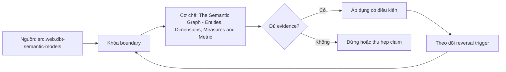

# The Semantic Graph - Entities, Dimensions, Measures and Metrics

> [!abstract] Câu hỏi trung tâm
> Đồ thị ngữ nghĩa biểu diễn entity, dimension, measure, metric và đường join như thế nào để máy xác định được một câu hỏi có hợp lệ hay mơ hồ?

## 1. Đồ thị thay cho danh sách khai báo

Semantic model cần trả lời reachability: metric nào có thể group/filter theo dimension nào, hai metrics có chung grouping grain không, và join path nào hợp lệ. Danh sách fields không mã hóa được các câu hỏi này. Trong đồ thị, semantic models/entities là nodes hoặc anchors, relationships là edges có direction/cardinality; metrics phụ thuộc base aggregations và dimensions gắn với entity context. Query planner duyệt graph dưới constraints thay vì nối mọi bảng có cột trùng tên.

## 2. Entity và identity

Entity là đối tượng có identity dùng để nối semantic models: order, customer, product, account. Cần phân biệt primary, foreign và unique roles, namespace, business key/canonical key và temporal validity. Entity không đồng nhất với physical table: một table có thể chứa order và customer identifiers; một customer entity có thể được mô tả bởi nhiều tables. Nếu identity không ổn định hoặc many-to-many mapping không được mô hình hóa, graph hợp lệ cú pháp vẫn cho duplicate hoặc ambiguous traversal.

## 3. Dimension và scope

Dimension là thuộc tính dùng để group, filter hoặc label metric; nó gắn với entity và semantic model nơi meaning được xác định. `status` của order khác `status` của customer. Time dimension cần timestamp role và granularity; categorical dimension cần domain/unknown policy; slowly changing attribute cần effective-time semantics. Fully qualified naming giúp phân biệt scope nhưng không sửa sai identity. Một dimension chỉ queryable với metric nếu có path hợp lệ không làm đổi grain trái contract.

## 4. Measure và metric: khái niệm với cú pháp

Ở mức khái niệm, measure là đại lượng tại base grain cùng aggregation behavior; metric là named business calculation có population, time, filters, aggregation và owner. Product syntax có thể khác. Legacy MetricFlow từng khai báo measures riêng; đặc tả dbt mới đưa aggregation/expression vào simple metric và không còn measure node độc lập trong authoring spec. Giáo trình giữ distinction để reasoning, nhưng ví dụ code phải ghi version và không được trộn legacy với current YAML.

## 5. Edges, cardinality và fanout

Mỗi relationship phải nêu join keys, one-to-one/one-to-many/many-to-one/many-to-many, direction và temporal condition nếu có. Đi từ fact-like node qua many-side rồi aggregate measure có thể fanout. Graph engine chỉ tự join an toàn khi cardinality và aggregation semantics cho phép. Many-to-many cần bridge/allocation hoặc query rewrite. Cardinality khai báo sai nguy hiểm hơn bỏ khai báo vì hệ thống có thể tự tin sinh SQL sai.

## 6. Nhiều đường và path semantics

Customer có thể nối shipment trực tiếp qua recipient hoặc gián tiếp qua order purchaser. Hai paths cùng tới customer nhưng trả lời người nhận và người mua, không thể để planner chọn ngẫu nhiên. Graph phải dùng role names, path constraints hoặc metric-specific relationship. Cycle không tự là lỗi; ambiguity xuất hiện khi hai paths cùng syntactically valid nhưng khác business meaning/grain. Mỗi cặp multi-path cần câu hỏi và expected path làm test.

## 7. Ba câu hỏi máy phải trả lời

Thứ nhất, metric X có thể slice theo dimension Y mà không fanout hay mất population không. Thứ hai, X và Z có thể đặt cạnh nhau ở common entity/time grain và cùng filter scope không. Thứ ba, nếu có nhiều paths, path nào được phép cho question/role hiện tại. Câu trả lời nên là executable validation hoặc explicit rejection kèm lý do, không phải silently generated SQL.

## 8. Ma trận kiểm chứng từng mệnh đề

Các mệnh đề dưới đây phải được kiểm bằng fixture, invariant và output có thể chạy lại. Việc công cụ compile được YAML hoặc sinh SQL không tự chứng minh metric đúng nghĩa.

### 8.1. entity giữ identity và join role

**Mệnh đề cần kiểm.** entity giữ identity và join role.

**Cách kiểm.** Dựng graph từ mart, khai identity/cardinality và enumerate all paths. Với mỗi multi-path pair, chạy hai business questions có expected path khác nhau; kiểm fanout và common grain khi co-query metrics. Với mệnh đề này, ghi rõ dữ liệu phản ví dụ, expected result và failure signal. Tách validation cấu trúc khỏi xác nhận meaning của owner.

**Bằng chứng đạt cho `wiki.semantic-layer.semantic-graph`.** Lưu contract/graph, snapshot, query hoặc compiled SQL, output thô, semantic diff và assumptions. Chỉ đánh dấu đạt khi cùng artifact cho kết quả lặp lại ở cùng version/cutoff; nếu chưa chạy, đây là test protocol chứ chưa phải kết quả production.

### 8.2. dimension có scope theo entity context

**Mệnh đề cần kiểm.** dimension có scope theo entity context.

**Cách kiểm.** Dựng graph từ mart, khai identity/cardinality và enumerate all paths. Với mỗi multi-path pair, chạy hai business questions có expected path khác nhau; kiểm fanout và common grain khi co-query metrics. Với mệnh đề này, ghi rõ dữ liệu phản ví dụ, expected result và failure signal. Tách validation cấu trúc khỏi xác nhận meaning của owner.

**Bằng chứng đạt cho `wiki.semantic-layer.semantic-graph`.** Lưu contract/graph, snapshot, query hoặc compiled SQL, output thô, semantic diff và assumptions. Chỉ đánh dấu đạt khi cùng artifact cho kết quả lặp lại ở cùng version/cutoff; nếu chưa chạy, đây là test protocol chứ chưa phải kết quả production.

### 8.3. measure có base grain và aggregation behavior

**Mệnh đề cần kiểm.** measure có base grain và aggregation behavior.

**Cách kiểm.** Dựng graph từ mart, khai identity/cardinality và enumerate all paths. Với mỗi multi-path pair, chạy hai business questions có expected path khác nhau; kiểm fanout và common grain khi co-query metrics. Với mệnh đề này, ghi rõ dữ liệu phản ví dụ, expected result và failure signal. Tách validation cấu trúc khỏi xác nhận meaning của owner.

**Bằng chứng đạt cho `wiki.semantic-layer.semantic-graph`.** Lưu contract/graph, snapshot, query hoặc compiled SQL, output thô, semantic diff và assumptions. Chỉ đánh dấu đạt khi cùng artifact cho kết quả lặp lại ở cùng version/cutoff; nếu chưa chạy, đây là test protocol chứ chưa phải kết quả production.

### 8.4. metric có business contract và owner

**Mệnh đề cần kiểm.** metric có business contract và owner.

**Cách kiểm.** Dựng graph từ mart, khai identity/cardinality và enumerate all paths. Với mỗi multi-path pair, chạy hai business questions có expected path khác nhau; kiểm fanout và common grain khi co-query metrics. Với mệnh đề này, ghi rõ dữ liệu phản ví dụ, expected result và failure signal. Tách validation cấu trúc khỏi xác nhận meaning của owner.

**Bằng chứng đạt cho `wiki.semantic-layer.semantic-graph`.** Lưu contract/graph, snapshot, query hoặc compiled SQL, output thô, semantic diff và assumptions. Chỉ đánh dấu đạt khi cùng artifact cho kết quả lặp lại ở cùng version/cutoff; nếu chưa chạy, đây là test protocol chứ chưa phải kết quả production.

### 8.5. semantic graph không phải bản sao ERD

**Mệnh đề cần kiểm.** semantic graph không phải bản sao ERD.

**Cách kiểm.** Dựng graph từ mart, khai identity/cardinality và enumerate all paths. Với mỗi multi-path pair, chạy hai business questions có expected path khác nhau; kiểm fanout và common grain khi co-query metrics. Với mệnh đề này, ghi rõ dữ liệu phản ví dụ, expected result và failure signal. Tách validation cấu trúc khỏi xác nhận meaning của owner.

**Bằng chứng đạt cho `wiki.semantic-layer.semantic-graph`.** Lưu contract/graph, snapshot, query hoặc compiled SQL, output thô, semantic diff và assumptions. Chỉ đánh dấu đạt khi cùng artifact cho kết quả lặp lại ở cùng version/cutoff; nếu chưa chạy, đây là test protocol chứ chưa phải kết quả production.

### 8.6. một table có thể chứa nhiều semantic entities

**Mệnh đề cần kiểm.** một table có thể chứa nhiều semantic entities.

**Cách kiểm.** Dựng graph từ mart, khai identity/cardinality và enumerate all paths. Với mỗi multi-path pair, chạy hai business questions có expected path khác nhau; kiểm fanout và common grain khi co-query metrics. Với mệnh đề này, ghi rõ dữ liệu phản ví dụ, expected result và failure signal. Tách validation cấu trúc khỏi xác nhận meaning của owner.

**Bằng chứng đạt cho `wiki.semantic-layer.semantic-graph`.** Lưu contract/graph, snapshot, query hoặc compiled SQL, output thô, semantic diff và assumptions. Chỉ đánh dấu đạt khi cùng artifact cho kết quả lặp lại ở cùng version/cutoff; nếu chưa chạy, đây là test protocol chứ chưa phải kết quả production.

### 8.7. một entity có thể ánh xạ nhiều physical models

**Mệnh đề cần kiểm.** một entity có thể ánh xạ nhiều physical models.

**Cách kiểm.** Dựng graph từ mart, khai identity/cardinality và enumerate all paths. Với mỗi multi-path pair, chạy hai business questions có expected path khác nhau; kiểm fanout và common grain khi co-query metrics. Với mệnh đề này, ghi rõ dữ liệu phản ví dụ, expected result và failure signal. Tách validation cấu trúc khỏi xác nhận meaning của owner.

**Bằng chứng đạt cho `wiki.semantic-layer.semantic-graph`.** Lưu contract/graph, snapshot, query hoặc compiled SQL, output thô, semantic diff và assumptions. Chỉ đánh dấu đạt khi cùng artifact cho kết quả lặp lại ở cùng version/cutoff; nếu chưa chạy, đây là test protocol chứ chưa phải kết quả production.

### 8.8. edge phải khai cardinality

**Mệnh đề cần kiểm.** edge phải khai cardinality.

**Cách kiểm.** Dựng graph từ mart, khai identity/cardinality và enumerate all paths. Với mỗi multi-path pair, chạy hai business questions có expected path khác nhau; kiểm fanout và common grain khi co-query metrics. Với mệnh đề này, ghi rõ dữ liệu phản ví dụ, expected result và failure signal. Tách validation cấu trúc khỏi xác nhận meaning của owner.

**Bằng chứng đạt cho `wiki.semantic-layer.semantic-graph`.** Lưu contract/graph, snapshot, query hoặc compiled SQL, output thô, semantic diff và assumptions. Chỉ đánh dấu đạt khi cùng artifact cho kết quả lặp lại ở cùng version/cutoff; nếu chưa chạy, đây là test protocol chứ chưa phải kết quả production.

### 8.9. many-side traversal có thể fanout

**Mệnh đề cần kiểm.** many-side traversal có thể fanout.

**Cách kiểm.** Dựng graph từ mart, khai identity/cardinality và enumerate all paths. Với mỗi multi-path pair, chạy hai business questions có expected path khác nhau; kiểm fanout và common grain khi co-query metrics. Với mệnh đề này, ghi rõ dữ liệu phản ví dụ, expected result và failure signal. Tách validation cấu trúc khỏi xác nhận meaning của owner.

**Bằng chứng đạt cho `wiki.semantic-layer.semantic-graph`.** Lưu contract/graph, snapshot, query hoặc compiled SQL, output thô, semantic diff và assumptions. Chỉ đánh dấu đạt khi cùng artifact cho kết quả lặp lại ở cùng version/cutoff; nếu chưa chạy, đây là test protocol chứ chưa phải kết quả production.

### 8.10. many-to-many cần bridge hoặc allocation semantics

**Mệnh đề cần kiểm.** many-to-many cần bridge hoặc allocation semantics.

**Cách kiểm.** Dựng graph từ mart, khai identity/cardinality và enumerate all paths. Với mỗi multi-path pair, chạy hai business questions có expected path khác nhau; kiểm fanout và common grain khi co-query metrics. Với mệnh đề này, ghi rõ dữ liệu phản ví dụ, expected result và failure signal. Tách validation cấu trúc khỏi xác nhận meaning của owner.

**Bằng chứng đạt cho `wiki.semantic-layer.semantic-graph`.** Lưu contract/graph, snapshot, query hoặc compiled SQL, output thô, semantic diff và assumptions. Chỉ đánh dấu đạt khi cùng artifact cho kết quả lặp lại ở cùng version/cutoff; nếu chưa chạy, đây là test protocol chứ chưa phải kết quả production.

### 8.11. qualified name không sửa identity sai

**Mệnh đề cần kiểm.** qualified name không sửa identity sai.

**Cách kiểm.** Dựng graph từ mart, khai identity/cardinality và enumerate all paths. Với mỗi multi-path pair, chạy hai business questions có expected path khác nhau; kiểm fanout và common grain khi co-query metrics. Với mệnh đề này, ghi rõ dữ liệu phản ví dụ, expected result và failure signal. Tách validation cấu trúc khỏi xác nhận meaning của owner.

**Bằng chứng đạt cho `wiki.semantic-layer.semantic-graph`.** Lưu contract/graph, snapshot, query hoặc compiled SQL, output thô, semantic diff và assumptions. Chỉ đánh dấu đạt khi cùng artifact cho kết quả lặp lại ở cùng version/cutoff; nếu chưa chạy, đây là test protocol chứ chưa phải kết quả production.

### 8.12. cycle không tự đồng nghĩa ambiguity

**Mệnh đề cần kiểm.** cycle không tự đồng nghĩa ambiguity.

**Cách kiểm.** Dựng graph từ mart, khai identity/cardinality và enumerate all paths. Với mỗi multi-path pair, chạy hai business questions có expected path khác nhau; kiểm fanout và common grain khi co-query metrics. Với mệnh đề này, ghi rõ dữ liệu phản ví dụ, expected result và failure signal. Tách validation cấu trúc khỏi xác nhận meaning của owner.

**Bằng chứng đạt cho `wiki.semantic-layer.semantic-graph`.** Lưu contract/graph, snapshot, query hoặc compiled SQL, output thô, semantic diff và assumptions. Chỉ đánh dấu đạt khi cùng artifact cho kết quả lặp lại ở cùng version/cutoff; nếu chưa chạy, đây là test protocol chứ chưa phải kết quả production.

### 8.13. hai paths có thể biểu diễn hai business roles

**Mệnh đề cần kiểm.** hai paths có thể biểu diễn hai business roles.

**Cách kiểm.** Dựng graph từ mart, khai identity/cardinality và enumerate all paths. Với mỗi multi-path pair, chạy hai business questions có expected path khác nhau; kiểm fanout và common grain khi co-query metrics. Với mệnh đề này, ghi rõ dữ liệu phản ví dụ, expected result và failure signal. Tách validation cấu trúc khỏi xác nhận meaning của owner.

**Bằng chứng đạt cho `wiki.semantic-layer.semantic-graph`.** Lưu contract/graph, snapshot, query hoặc compiled SQL, output thô, semantic diff và assumptions. Chỉ đánh dấu đạt khi cùng artifact cho kết quả lặp lại ở cùng version/cutoff; nếu chưa chạy, đây là test protocol chứ chưa phải kết quả production.

### 8.14. co-query metrics cần common grain

**Mệnh đề cần kiểm.** co-query metrics cần common grain.

**Cách kiểm.** Dựng graph từ mart, khai identity/cardinality và enumerate all paths. Với mỗi multi-path pair, chạy hai business questions có expected path khác nhau; kiểm fanout và common grain khi co-query metrics. Với mệnh đề này, ghi rõ dữ liệu phản ví dụ, expected result và failure signal. Tách validation cấu trúc khỏi xác nhận meaning của owner.

**Bằng chứng đạt cho `wiki.semantic-layer.semantic-graph`.** Lưu contract/graph, snapshot, query hoặc compiled SQL, output thô, semantic diff và assumptions. Chỉ đánh dấu đạt khi cùng artifact cho kết quả lặp lại ở cùng version/cutoff; nếu chưa chạy, đây là test protocol chứ chưa phải kết quả production.

### 8.15. current dbt syntax không được trộn legacy measure spec

**Mệnh đề cần kiểm.** current dbt syntax không được trộn legacy measure spec.

**Cách kiểm.** Dựng graph từ mart, khai identity/cardinality và enumerate all paths. Với mỗi multi-path pair, chạy hai business questions có expected path khác nhau; kiểm fanout và common grain khi co-query metrics. Với mệnh đề này, ghi rõ dữ liệu phản ví dụ, expected result và failure signal. Tách validation cấu trúc khỏi xác nhận meaning của owner.

**Bằng chứng đạt cho `wiki.semantic-layer.semantic-graph`.** Lưu contract/graph, snapshot, query hoặc compiled SQL, output thô, semantic diff và assumptions. Chỉ đánh dấu đạt khi cùng artifact cho kết quả lặp lại ở cùng version/cutoff; nếu chưa chạy, đây là test protocol chứ chưa phải kết quả production.

## 9. Quy trình phản biện

1. Viết business question, population, grain, identity, time và unit trước syntax.
2. Chỉ ra artifact canonical, owner, version và change process.
3. Tách source fact, product-version detail và curriculum synthesis.
4. Dựng normal case cùng phản ví dụ: denominator lệch, fanout, sparse period, timezone boundary hoặc non-additive rollup.
5. So eligible rows và intermediate components trước final value; hai lỗi có thể triệt tiêu ở số cuối.
6. Chạy negative tests song song với valid controls để phát hiện cả false negative và false positive.
7. Lưu failed run, limitations và conditions khiến kết luận phải đổi.

## 10. Câu hỏi tự kiểm tra

1. Metric đang trả lời câu hỏi nào, trên population và grain nào?
2. Entity/dimension nào reachable qua path nào, cardinality gì?
3. Aggregation nào hợp lệ theo từng dimension và time grain?
4. Ca biên nào cho kết quả hợp lệ cú pháp nhưng sai nghĩa?
5. Chi tiết nào là khái niệm ổn định, chi tiết nào phụ thuộc phiên bản sản phẩm?
6. Bằng chứng nào cho phép người khác bác bỏ implementation?

## 11. Giới hạn và điều chưa cho phép kết luận

- Chưa chạy lab hai người, semantic graph planner, ratio rollup, aggregation rejection hoặc calendar fixture; note mô tả protocol cần thực thi.
- dbt/MetricFlow là ví dụ sản phẩm được kiểm ngày 2026-10-01; syntax và availability có thể đổi theo version/tier.
- PostgreSQL documentation mô tả SQL mechanics, không tự cung cấp business semantics hay metric governance.
- Kimball-Ross hỗ trợ grain, additivity và calendar modeling; semantic-layer enforcement là phần tổng hợp có đối chiếu tài liệu hiện hành.
- Owner chưa phê duyệt meaning nên note giữ trạng thái `review`.

## Reference
1. [[SRC-DBT-SEMANTIC-MODELS]]
2. [[SRC-KIMBALL-ROSS-DW-TOOLKIT-3E]]
3. [[SRC-REIS-HOUSLEY-FUNDAMENTALS-DATA-ENGINEERING]]

## Source coverage

| Source slice | Nội dung sử dụng | Trạng thái |
|---|---|---|
| [[SRC-DBT-SEMANTIC-MODELS]] | Khái niệm, cơ chế, product detail hoặc SQL behavior liên quan | Đã đọc phạm vi có locator; không suy ngoài phạm vi |
| [[SRC-KIMBALL-ROSS-DW-TOOLKIT-3E]] | Khái niệm, cơ chế, product detail hoặc SQL behavior liên quan | Đã đọc phạm vi có locator; không suy ngoài phạm vi |
| [[SRC-REIS-HOUSLEY-FUNDAMENTALS-DATA-ENGINEERING]] | Khái niệm, cơ chế, product detail hoặc SQL behavior liên quan | Đã đọc phạm vi có locator; không suy ngoài phạm vi |

## Key takeaways
- Metric contract bắt đầu từ population, grain, time, filters, aggregation và ownership; tên metric không đủ.
- Semantic graph phải mã hóa identity, cardinality và path semantics để phát hiện fanout hoặc ambiguity.
- Ratio, cumulative, distinct và semi-additive metrics cần state/behavior riêng; không roll up như số cộng được.
- Time comparison đúng cần dense calendar, timezone, fiscal policy, partial-period và leap-day rules.
- Chưa chạy protocol thì note là tài liệu học thuật có truy nguồn, không phải chứng nhận production.

<!-- ATOMIC-EXECUTION-CAPSULE:START -->

## Execution capsule: kiểm chứng `wiki.semantic-layer.semantic-graph`

> [!important] Phân loại mệnh đề
> Với `wiki.semantic-layer.semantic-graph`, sơ đồ, ví dụ và artifact về **The Semantic Graph - Entities, Dimensions, Measures and Metrics** là **synthesis để kiểm chứng**; chúng không phải trích dẫn hay case nguyên văn của nguồn.

### Sơ đồ cơ chế và điểm kiểm soát



Đọc sơ đồ `wiki.semantic-layer.semantic-graph` từ trái sang phải: source chỉ cung cấp claim ban đầu cho **The Semantic Graph - Entities, Dimensions, Measures and Metrics**; quyết định chỉ được đi tiếp sau khi boundary, evidence và điều kiện đảo quyết định đã hiện hữu.

### Artifact thực thi tối thiểu

```sql
-- Verification harness for: The Semantic Graph - Entities, Dimensions, Measures and Metrics
WITH evidence AS (
    SELECT 'wiki.semantic-layer.semantic-graph' AS concept_id,
           'boundary_declared' AS check_name, 1 AS passed
    UNION ALL
    SELECT 'wiki.semantic-layer.semantic-graph', 'independent_oracle', 1
    UNION ALL
    SELECT 'wiki.semantic-layer.semantic-graph', 'reversal_trigger_recorded', 1
)
SELECT concept_id,
       MIN(passed) AS all_hard_checks_pass,
       COUNT(*) AS evidence_items
FROM evidence
GROUP BY concept_id
HAVING MIN(passed) = 1;
```

Artifact của `wiki.semantic-layer.semantic-graph` buộc người dùng ghi boundary, oracle và reversal trigger cho **The Semantic Graph - Entities, Dimensions, Measures and Metrics**. Các giá trị minh họa phải được thay bằng evidence thật trước khi dùng cho quyết định.

### Tự kiểm tra trước khi tái sử dụng

1. Bạn có thể trả lời `Đồ thị ngữ nghĩa biểu diễn entity, dimension, measure, metric và đường join như thế nào để máy xác định được một câu hỏi có hợp lệ hay mơ hồ?` bằng một câu mà không kéo thêm concept thứ hai không?
2. Source locator nào đỡ cho claim, và phần nào chỉ là synthesis trong note?
3. Observation nào khiến bạn dừng, thu hẹp hoặc đảo quyết định?
4. Artifact nào cho phép một reviewer độc lập tái hiện kết quả?

<!-- ATOMIC-EXECUTION-CAPSULE:END -->
