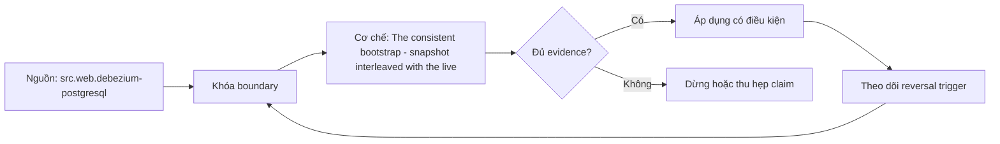

# The consistent bootstrap - snapshot interleaved with the live log

> [!abstract] Câu hỏi trung tâm
> Initial snapshot xen kẽ live log tránh gap và duplicate bằng snapshot boundary/collision protocol nào?

## 1. Bootstrap problem

Snapshot takes time while writes continue; start log too late loses changes, apply naively creates stale snapshot overwrite. Đừng bắt đầu bằng tên công cụ. Hãy bắt đầu bằng đối tượng được bảo vệ, boundary quan sát được và hậu quả nếu kết luận sai. Trong bài `The consistent bootstrap - snapshot interleaved with the live log`, câu hỏi thực dụng là: Initial snapshot xen kẽ live log tránh gap và duplicate bằng snapshot boundary/collision protocol nào? Ta ghi rõ grain, population, time window, owner và hành động sau failure; nếu một trường chưa biết thì đánh dấu unknown thay vì lấp bằng mặc định. Bằng chứng tối thiểu gồm fixture có version, cấu hình hoặc rule đã resolve, raw observation, expected result và limitation. Phần này là curriculum synthesis dựa trên các nguồn đã định danh, không phải lời hứa rằng mọi adapter hay deployment đều có cùng hành vi.

## 2. Consistent boundary

Connector establishes log position and consistent view per source protocol; boundary must survive restart. Điểm khó không nằm ở cú pháp mà ở identity và scope. Hai phép đo cùng tên vẫn có thể nói về hai population hoặc hai thời điểm khác nhau. Trong bài `The consistent bootstrap - snapshot interleaved with the live log`, câu hỏi thực dụng là: Initial snapshot xen kẽ live log tránh gap và duplicate bằng snapshot boundary/collision protocol nào? Ta ghi rõ grain, population, time window, owner và hành động sau failure; nếu một trường chưa biết thì đánh dấu unknown thay vì lấp bằng mặc định. Bằng chứng tối thiểu gồm fixture có version, cấu hình hoặc rule đã resolve, raw observation, expected result và limitation. Phần này là curriculum synthesis dựa trên các nguồn đã định danh, không phải lời hứa rằng mọi adapter hay deployment đều có cùng hành vi.

## 3. Snapshot events

READ events represent rows in snapshot context and need distinguish from CREATE events for consumers/metrics. Một dashboard xanh chỉ là tín hiệu. Muốn biến nó thành bằng chứng phải giữ input, phiên bản, rule, trạng thái trước-sau và cách tính độc lập. Trong bài `The consistent bootstrap - snapshot interleaved with the live log`, câu hỏi thực dụng là: Initial snapshot xen kẽ live log tránh gap và duplicate bằng snapshot boundary/collision protocol nào? Ta ghi rõ grain, population, time window, owner và hành động sau failure; nếu một trường chưa biết thì đánh dấu unknown thay vì lấp bằng mặc định. Bằng chứng tối thiểu gồm fixture có version, cấu hình hoặc rule đã resolve, raw observation, expected result và limitation. Phần này là curriculum synthesis dựa trên các nguồn đã định danh, không phải lời hứa rằng mọi adapter hay deployment đều có cùng hành vi.

## 4. Interleaving

Stream events may arrive around snapshot chunks; key-based buffering/dedup/order rules decide which state wins. Thiết kế tốt phải chịu được counterexample. Hãy chủ động tạo case sát boundary, case thiếu dữ liệu và case replay thay vì chỉ chạy happy path. Trong bài `The consistent bootstrap - snapshot interleaved with the live log`, câu hỏi thực dụng là: Initial snapshot xen kẽ live log tránh gap và duplicate bằng snapshot boundary/collision protocol nào? Ta ghi rõ grain, population, time window, owner và hành động sau failure; nếu một trường chưa biết thì đánh dấu unknown thay vì lấp bằng mặc định. Bằng chứng tối thiểu gồm fixture có version, cấu hình hoặc rule đã resolve, raw observation, expected result và limitation. Phần này là curriculum synthesis dựa trên các nguồn đã định danh, không phải lời hứa rằng mọi adapter hay deployment đều có cùng hành vi.

## 5. Restart

Interrupted snapshot resumes/restarts per mode with stored offsets; consumer must absorb replay without multiplying state. Chi phí vận hành thuộc contract. Một rule đúng nhưng quá đắt, quá ồn hoặc không có owner sẽ nhanh chóng bị tắt và mất tác dụng. Trong bài `The consistent bootstrap - snapshot interleaved with the live log`, câu hỏi thực dụng là: Initial snapshot xen kẽ live log tránh gap và duplicate bằng snapshot boundary/collision protocol nào? Ta ghi rõ grain, population, time window, owner và hành động sau failure; nếu một trường chưa biết thì đánh dấu unknown thay vì lấp bằng mặc định. Bằng chứng tối thiểu gồm fixture có version, cấu hình hoặc rule đã resolve, raw observation, expected result và limitation. Phần này là curriculum synthesis dựa trên các nguồn đã định danh, không phải lời hứa rằng mọi adapter hay deployment đều có cùng hành vi.

## 6. Proof

Mutate same keys before/during/after chunks, crash repeatedly and reconcile final key set/hash with source snapshot at declared cut. Kết luận cần có điều kiện đảo chiều. Khi volume, latency, nguồn thẩm quyền hoặc topology đổi, quyết định cũ phải được xem xét lại bằng cùng một oracle. Trong bài `The consistent bootstrap - snapshot interleaved with the live log`, câu hỏi thực dụng là: Initial snapshot xen kẽ live log tránh gap và duplicate bằng snapshot boundary/collision protocol nào? Ta ghi rõ grain, population, time window, owner và hành động sau failure; nếu một trường chưa biết thì đánh dấu unknown thay vì lấp bằng mặc định. Bằng chứng tối thiểu gồm fixture có version, cấu hình hoặc rule đã resolve, raw observation, expected result và limitation. Phần này là curriculum synthesis dựa trên các nguồn đã định danh, không phải lời hứa rằng mọi adapter hay deployment đều có cùng hành vi.

## 7. Ma trận kiểm chứng từng mệnh đề

Với `wiki.cdc.consistent-bootstrap-snapshot-log`, command thành công không tự chứng minh dữ liệu đúng. Protocol riêng của bài là: Run PostgreSQL/Debezium-compatible fixture, inject writes/crash/interleaving and reconcile source keys, log positions, transport offsets and sink state. Mỗi probe dưới đây phải nối input boundary với failure signal và oracle có thể phản bác kết luận.

### 7.1. The consistent bootstrap - snapshot interleaved with the live log: kiểm `Bootstrap problem` bằng case 1, cụ thể snapshot takes time while writes continue; start log too late loses changes, apply naively creates stale snapshot overwrite

**Mệnh đề cần kiểm.** The consistent bootstrap - snapshot interleaved with the live log: kiểm `Bootstrap problem` bằng case 1, cụ thể snapshot takes time while writes continue; start log too late loses changes, apply naively creates stale snapshot overwrite.

**Thiết kế phép thử cho `wiki.cdc.consistent-bootstrap-snapshot-log`.** Trong ngữ cảnh `wiki.cdc.consistent-bootstrap-snapshot-log`, tạo positive control và negative control chỉ khác đúng một điều kiện. Khóa input snapshot, phiên bản và owner của rule; chạy đúng population được bài `The consistent bootstrap - snapshot interleaved with the live log` công bố.

**Bằng chứng cần giữ.** Đối với probe 1 của `The consistent bootstrap - snapshot interleaved with the live log`, giữ fixture, raw failing rows và lệnh tái hiện. Nếu chưa chạy lab, ghi expected evidence và giữ trạng thái review; không biến protocol thành observation.

### 7.2. The consistent bootstrap - snapshot interleaved with the live log: kiểm `Consistent boundary` bằng case 2, cụ thể connector establishes log position and consistent view per source protocol; boundary must survive restart

**Mệnh đề cần kiểm.** The consistent bootstrap - snapshot interleaved with the live log: kiểm `Consistent boundary` bằng case 2, cụ thể connector establishes log position and consistent view per source protocol; boundary must survive restart.

**Thiết kế phép thử cho `wiki.cdc.consistent-bootstrap-snapshot-log`.** Trong ngữ cảnh `wiki.cdc.consistent-bootstrap-snapshot-log`, đổi grain nhưng giữ tổng số dòng để lộ phép đo sai cấp. Khóa input snapshot, phiên bản và owner của rule; chạy đúng population được bài `The consistent bootstrap - snapshot interleaved with the live log` công bố.

**Bằng chứng cần giữ.** Đối với probe 2 của `The consistent bootstrap - snapshot interleaved with the live log`, báo numerator, denominator và key set ở cả hai grain. Nếu chưa chạy lab, ghi expected evidence và giữ trạng thái review; không biến protocol thành observation.

### 7.3. The consistent bootstrap - snapshot interleaved with the live log: kiểm `Snapshot events` bằng case 3, cụ thể read events represent rows in snapshot context and need distinguish from create events for consumers/metrics

**Mệnh đề cần kiểm.** The consistent bootstrap - snapshot interleaved with the live log: kiểm `Snapshot events` bằng case 3, cụ thể read events represent rows in snapshot context and need distinguish from create events for consumers/metrics.

**Thiết kế phép thử cho `wiki.cdc.consistent-bootstrap-snapshot-log`.** Trong ngữ cảnh `wiki.cdc.consistent-bootstrap-snapshot-log`, đưa một giá trị tới đúng boundary và một giá trị vượt boundary. Khóa input snapshot, phiên bản và owner của rule; chạy đúng population được bài `The consistent bootstrap - snapshot interleaved with the live log` công bố.

**Bằng chứng cần giữ.** Đối với probe 3 của `The consistent bootstrap - snapshot interleaved with the live log`, lưu hai observed values cùng rule đã resolve. Nếu chưa chạy lab, ghi expected evidence và giữ trạng thái review; không biến protocol thành observation.

### 7.4. The consistent bootstrap - snapshot interleaved with the live log: kiểm `Interleaving` bằng case 4, cụ thể stream events may arrive around snapshot chunks; key-based buffering/dedup/order rules decide which state wins

**Mệnh đề cần kiểm.** The consistent bootstrap - snapshot interleaved with the live log: kiểm `Interleaving` bằng case 4, cụ thể stream events may arrive around snapshot chunks; key-based buffering/dedup/order rules decide which state wins.

**Thiết kế phép thử cho `wiki.cdc.consistent-bootstrap-snapshot-log`.** Trong ngữ cảnh `wiki.cdc.consistent-bootstrap-snapshot-log`, kill tiến trình ngay trước rồi ngay sau durable side effect. Khóa input snapshot, phiên bản và owner của rule; chạy đúng population được bài `The consistent bootstrap - snapshot interleaved with the live log` công bố.

**Bằng chứng cần giữ.** Đối với probe 4 của `The consistent bootstrap - snapshot interleaved with the live log`, lưu checkpoint, external ledger và trạng thái sau restart. Nếu chưa chạy lab, ghi expected evidence và giữ trạng thái review; không biến protocol thành observation.

### 7.5. The consistent bootstrap - snapshot interleaved with the live log: kiểm `Restart` bằng case 5, cụ thể interrupted snapshot resumes/restarts per mode with stored offsets; consumer must absorb replay without multiplying state

**Mệnh đề cần kiểm.** The consistent bootstrap - snapshot interleaved with the live log: kiểm `Restart` bằng case 5, cụ thể interrupted snapshot resumes/restarts per mode with stored offsets; consumer must absorb replay without multiplying state.

**Thiết kế phép thử cho `wiki.cdc.consistent-bootstrap-snapshot-log`.** Trong ngữ cảnh `wiki.cdc.consistent-bootstrap-snapshot-log`, đảo thứ tự input và concurrency nhưng giữ logical population. Khóa input snapshot, phiên bản và owner của rule; chạy đúng population được bài `The consistent bootstrap - snapshot interleaved with the live log` công bố.

**Bằng chứng cần giữ.** Đối với probe 5 của `The consistent bootstrap - snapshot interleaved with the live log`, so canonical hash và business totals giữa các thứ tự. Nếu chưa chạy lab, ghi expected evidence và giữ trạng thái review; không biến protocol thành observation.

### 7.6. The consistent bootstrap - snapshot interleaved with the live log: kiểm `Proof` bằng case 6, cụ thể mutate same keys before/during/after chunks, crash repeatedly and reconcile final key set/hash with source snapshot at declared cut

**Mệnh đề cần kiểm.** The consistent bootstrap - snapshot interleaved with the live log: kiểm `Proof` bằng case 6, cụ thể mutate same keys before/during/after chunks, crash repeatedly and reconcile final key set/hash with source snapshot at declared cut.

**Thiết kế phép thử cho `wiki.cdc.consistent-bootstrap-snapshot-log`.** Trong ngữ cảnh `wiki.cdc.consistent-bootstrap-snapshot-log`, replay cùng identity với payload giống rồi payload xung đột. Khóa input snapshot, phiên bản và owner của rule; chạy đúng population được bài `The consistent bootstrap - snapshot interleaved with the live log` công bố.

**Bằng chứng cần giữ.** Đối với probe 6 của `The consistent bootstrap - snapshot interleaved with the live log`, tách duplicate replay khỏi identity collision bằng reason code. Nếu chưa chạy lab, ghi expected evidence và giữ trạng thái review; không biến protocol thành observation.

### 7.7. The consistent bootstrap - snapshot interleaved with the live log: kiểm `Bootstrap problem` bằng case 7, cụ thể snapshot takes time while writes continue; start log too late loses changes, apply naively creates stale snapshot overwrite

**Mệnh đề cần kiểm.** The consistent bootstrap - snapshot interleaved with the live log: kiểm `Bootstrap problem` bằng case 7, cụ thể snapshot takes time while writes continue; start log too late loses changes, apply naively creates stale snapshot overwrite.

**Thiết kế phép thử cho `wiki.cdc.consistent-bootstrap-snapshot-log`.** Trong ngữ cảnh `wiki.cdc.consistent-bootstrap-snapshot-log`, thêm record tới trễ trong horizon và ngoài horizon. Khóa input snapshot, phiên bản và owner của rule; chạy đúng population được bài `The consistent bootstrap - snapshot interleaved with the live log` công bố.

**Bằng chứng cần giữ.** Đối với probe 7 của `The consistent bootstrap - snapshot interleaved with the live log`, báo accepted-late, rejected-late và oldest outstanding timestamp. Nếu chưa chạy lab, ghi expected evidence và giữ trạng thái review; không biến protocol thành observation.

### 7.8. The consistent bootstrap - snapshot interleaved with the live log: kiểm `Consistent boundary` bằng case 8, cụ thể connector establishes log position and consistent view per source protocol; boundary must survive restart

**Mệnh đề cần kiểm.** The consistent bootstrap - snapshot interleaved with the live log: kiểm `Consistent boundary` bằng case 8, cụ thể connector establishes log position and consistent view per source protocol; boundary must survive restart.

**Thiết kế phép thử cho `wiki.cdc.consistent-bootstrap-snapshot-log`.** Trong ngữ cảnh `wiki.cdc.consistent-bootstrap-snapshot-log`, đổi schema theo một cách tương thích rồi một cách phá vỡ semantics. Khóa input snapshot, phiên bản và owner của rule; chạy đúng population được bài `The consistent bootstrap - snapshot interleaved with the live log` công bố.

**Bằng chứng cần giữ.** Đối với probe 8 của `The consistent bootstrap - snapshot interleaved with the live log`, giữ schema diff, classification và consumer-visible result. Nếu chưa chạy lab, ghi expected evidence và giữ trạng thái review; không biến protocol thành observation.

### 7.9. The consistent bootstrap - snapshot interleaved with the live log: kiểm `Snapshot events` bằng case 9, cụ thể read events represent rows in snapshot context and need distinguish from create events for consumers/metrics

**Mệnh đề cần kiểm.** The consistent bootstrap - snapshot interleaved with the live log: kiểm `Snapshot events` bằng case 9, cụ thể read events represent rows in snapshot context and need distinguish from create events for consumers/metrics.

**Thiết kế phép thử cho `wiki.cdc.consistent-bootstrap-snapshot-log`.** Trong ngữ cảnh `wiki.cdc.consistent-bootstrap-snapshot-log`, tạo missing và duplicate bù nhau để count tổng không đổi. Khóa input snapshot, phiên bản và owner của rule; chạy đúng population được bài `The consistent bootstrap - snapshot interleaved with the live log` công bố.

**Bằng chứng cần giữ.** Đối với probe 9 của `The consistent bootstrap - snapshot interleaved with the live log`, so key multiset và typed hashes thay vì chỉ row count. Nếu chưa chạy lab, ghi expected evidence và giữ trạng thái review; không biến protocol thành observation.

### 7.10. The consistent bootstrap - snapshot interleaved with the live log: kiểm `Interleaving` bằng case 10, cụ thể stream events may arrive around snapshot chunks; key-based buffering/dedup/order rules decide which state wins

**Mệnh đề cần kiểm.** The consistent bootstrap - snapshot interleaved with the live log: kiểm `Interleaving` bằng case 10, cụ thể stream events may arrive around snapshot chunks; key-based buffering/dedup/order rules decide which state wins.

**Thiết kế phép thử cho `wiki.cdc.consistent-bootstrap-snapshot-log`.** Trong ngữ cảnh `wiki.cdc.consistent-bootstrap-snapshot-log`, cho reviewer tái hiện chỉ từ evidence package. Khóa input snapshot, phiên bản và owner của rule; chạy đúng population được bài `The consistent bootstrap - snapshot interleaved with the live log` công bố.

**Bằng chứng cần giữ.** Đối với probe 10 của `The consistent bootstrap - snapshot interleaved with the live log`, package phải đủ để người khác dựng lại decision và limitation. Nếu chưa chạy lab, ghi expected evidence và giữ trạng thái review; không biến protocol thành observation.

### 7.11. The consistent bootstrap - snapshot interleaved with the live log: kiểm `Restart` bằng case 11, cụ thể interrupted snapshot resumes/restarts per mode with stored offsets; consumer must absorb replay without multiplying state

**Mệnh đề cần kiểm.** The consistent bootstrap - snapshot interleaved with the live log: kiểm `Restart` bằng case 11, cụ thể interrupted snapshot resumes/restarts per mode with stored offsets; consumer must absorb replay without multiplying state.

**Thiết kế phép thử cho `wiki.cdc.consistent-bootstrap-snapshot-log`.** Trong ngữ cảnh `wiki.cdc.consistent-bootstrap-snapshot-log`, so với oracle độc lập không dùng chung query hoặc parser. Khóa input snapshot, phiên bản và owner của rule; chạy đúng population được bài `The consistent bootstrap - snapshot interleaved with the live log` công bố.

**Bằng chứng cần giữ.** Đối với probe 11 của `The consistent bootstrap - snapshot interleaved with the live log`, independent result phải khớp ở grain đã công bố. Nếu chưa chạy lab, ghi expected evidence và giữ trạng thái review; không biến protocol thành observation.

### 7.12. The consistent bootstrap - snapshot interleaved with the live log: kiểm `Proof` bằng case 12, cụ thể mutate same keys before/during/after chunks, crash repeatedly and reconcile final key set/hash with source snapshot at declared cut

**Mệnh đề cần kiểm.** The consistent bootstrap - snapshot interleaved with the live log: kiểm `Proof` bằng case 12, cụ thể mutate same keys before/during/after chunks, crash repeatedly and reconcile final key set/hash with source snapshot at declared cut.

**Thiết kế phép thử cho `wiki.cdc.consistent-bootstrap-snapshot-log`.** Trong ngữ cảnh `wiki.cdc.consistent-bootstrap-snapshot-log`, chạy scope hẹp và population đầy đủ rồi công bố phần bị loại. Khóa input snapshot, phiên bản và owner của rule; chạy đúng population được bài `The consistent bootstrap - snapshot interleaved with the live log` công bố.

**Bằng chứng cần giữ.** Đối với probe 12 của `The consistent bootstrap - snapshot interleaved with the live log`, coverage phải nêu rõ excluded nodes, partitions hoặc incidents. Nếu chưa chạy lab, ghi expected evidence và giữ trạng thái review; không biến protocol thành observation.

### 7.13. The consistent bootstrap - snapshot interleaved with the live log: kiểm `Bootstrap problem` bằng case 13, cụ thể snapshot takes time while writes continue; start log too late loses changes, apply naively creates stale snapshot overwrite

**Mệnh đề cần kiểm.** The consistent bootstrap - snapshot interleaved with the live log: kiểm `Bootstrap problem` bằng case 13, cụ thể snapshot takes time while writes continue; start log too late loses changes, apply naively creates stale snapshot overwrite.

**Thiết kế phép thử cho `wiki.cdc.consistent-bootstrap-snapshot-log`.** Trong ngữ cảnh `wiki.cdc.consistent-bootstrap-snapshot-log`, thử timezone, precision hoặc partition ở hai phía của ranh giới. Khóa input snapshot, phiên bản và owner của rule; chạy đúng population được bài `The consistent bootstrap - snapshot interleaved with the live log` công bố.

**Bằng chứng cần giữ.** Đối với probe 13 của `The consistent bootstrap - snapshot interleaved with the live log`, UTC/local interval và rounding policy phải hiện trong output. Nếu chưa chạy lab, ghi expected evidence và giữ trạng thái review; không biến protocol thành observation.

### 7.14. The consistent bootstrap - snapshot interleaved with the live log: kiểm `Consistent boundary` bằng case 14, cụ thể connector establishes log position and consistent view per source protocol; boundary must survive restart

**Mệnh đề cần kiểm.** The consistent bootstrap - snapshot interleaved with the live log: kiểm `Consistent boundary` bằng case 14, cụ thể connector establishes log position and consistent view per source protocol; boundary must survive restart.

**Thiết kế phép thử cho `wiki.cdc.consistent-bootstrap-snapshot-log`.** Trong ngữ cảnh `wiki.cdc.consistent-bootstrap-snapshot-log`, đổi constraint đủ lớn để quyết định phải đảo. Khóa input snapshot, phiên bản và owner của rule; chạy đúng population được bài `The consistent bootstrap - snapshot interleaved with the live log` công bố.

**Bằng chứng cần giữ.** Đối với probe 14 của `The consistent bootstrap - snapshot interleaved with the live log`, ADR phải lưu changed constraint và reversal threshold. Nếu chưa chạy lab, ghi expected evidence và giữ trạng thái review; không biến protocol thành observation.

### 7.15. The consistent bootstrap - snapshot interleaved with the live log: kiểm `Snapshot events` bằng case 15, cụ thể read events represent rows in snapshot context and need distinguish from create events for consumers/metrics

**Mệnh đề cần kiểm.** The consistent bootstrap - snapshot interleaved with the live log: kiểm `Snapshot events` bằng case 15, cụ thể read events represent rows in snapshot context and need distinguish from create events for consumers/metrics.

**Thiết kế phép thử cho `wiki.cdc.consistent-bootstrap-snapshot-log`.** Trong ngữ cảnh `wiki.cdc.consistent-bootstrap-snapshot-log`, chạy lại từ môi trường sạch với versions và seed đã khóa. Khóa input snapshot, phiên bản và owner của rule; chạy đúng population được bài `The consistent bootstrap - snapshot interleaved with the live log` công bố.

**Bằng chứng cần giữ.** Đối với probe 15 của `The consistent bootstrap - snapshot interleaved with the live log`, canonical result phải ổn định hoặc mọi nondeterminism phải được giải thích. Nếu chưa chạy lab, ghi expected evidence và giữ trạng thái review; không biến protocol thành observation.

## 8. Quy trình phản biện

1. Viết consumer-visible invariant cho `The consistent bootstrap - snapshot interleaved with the live log` trước khi chọn query hoặc tool.
2. Khóa grain, identity, population, time window và authoritative source.
3. Phân biệt declared configuration, executed state và published state.
4. Chạy negative control, replay hoặc changed-assumption case phù hợp.
5. Đối soát bằng oracle độc lập; công bố coverage và phần không quan sát được.
6. Gắn owner, hành động, reversal trigger và hạn review cho kết luận.

## 9. Câu hỏi tự kiểm tra

1. `The consistent bootstrap - snapshot interleaved with the live log: kiểm `Bootstrap problem` bằng case 1, cụ thể snapshot takes time while writes continue; start log too late loses changes, apply naively creates stale snapshot overwrite` thất bại đầu tiên ở boundary nào?
2. Artifact nào mạnh nhất để trả lời `The consistent bootstrap - snapshot interleaved with the live log: kiểm `Snapshot events` bằng case 3, cụ thể read events represent rows in snapshot context and need distinguish from create events for consumers/metrics`?
3. Counterexample nhỏ nhất cho `The consistent bootstrap - snapshot interleaved with the live log: kiểm `Proof` bằng case 6, cụ thể mutate same keys before/during/after chunks, crash repeatedly and reconcile final key set/hash with source snapshot at declared cut` gồm những state nào?
4. `The consistent bootstrap - snapshot interleaved with the live log: kiểm `Snapshot events` bằng case 9, cụ thể read events represent rows in snapshot context and need distinguish from create events for consumers/metrics` có thể xanh giả ra sao?
5. Constraint nào khiến quyết định ở `The consistent bootstrap - snapshot interleaved with the live log: kiểm `Consistent boundary` bằng case 14, cụ thể connector establishes log position and consistent view per source protocol; boundary must survive restart` phải đảo?
6. Phần nào của `The consistent bootstrap - snapshot interleaved with the live log: kiểm `Snapshot events` bằng case 15, cụ thể read events represent rows in snapshot context and need distinguish from create events for consumers/metrics` mới là protocol, chưa phải observation?

## 10. Giới hạn và điều chưa cho phép kết luận

- Lab của `The consistent bootstrap - snapshot interleaved with the live log` chưa chạy trên hệ thống production; nội dung là giáo trình và expected evidence.
- Hành vi phụ thuộc phiên bản, connector, scheduler, warehouse và catalog configuration phải được kiểm lại.
- Các ma trận, ladder và threshold do giáo trình tổng hợp không được gán nguyên văn cho vendor.
- Note giữ trạng thái `review` cho tới khi owner duyệt semantics và learner artifact.

## Reference
1. [[SRC-DEBEZIUM-POSTGRESQL]]
2. [[SRC-POSTGRESQL-LOGICAL-DECODING]]

## Source coverage

| Source slice | Nội dung sử dụng | Trạng thái |
|---|---|---|
| [[SRC-DEBEZIUM-POSTGRESQL]] | Contract hoặc cơ chế liên quan trực tiếp tới `The consistent bootstrap - snapshot interleaved with the live log` | Đã đọc locator; cần pin version khi chạy lab |
| [[SRC-POSTGRESQL-LOGICAL-DECODING]] | Contract hoặc cơ chế liên quan trực tiếp tới `The consistent bootstrap - snapshot interleaved with the live log` | Đã đọc locator; cần pin version khi chạy lab |

## Key takeaways
- Consistent bootstrap needs a log boundary and collision protocol, not snapshot then stream naively.
- Với `wiki.cdc.consistent-bootstrap-snapshot-log`, quality của kết luận phụ thuộc identity, coverage và oracle chứ không phụ thuộc màu dashboard.
- Câu hỏi `Initial snapshot xen kẽ live log tránh gap và duplicate bằng snapshot boundary/collision protocol nào?` chỉ được trả lời trong scope và version đã ghi.
- Các source IDs `src.web.debezium-postgresql, src.web.postgresql-logical-decoding` đặt ranh giới cho source fact; phần còn lại là synthesis có nhãn.
- Trước khi lab chạy, đây là note đã kiểm cấu trúc và provenance, chưa phải chứng nhận production.

<!-- ATOMIC-EXECUTION-CAPSULE:START -->

## Execution capsule: kiểm chứng `wiki.cdc.consistent-bootstrap-snapshot-log`

> [!important] Phân loại mệnh đề
> Với `wiki.cdc.consistent-bootstrap-snapshot-log`, sơ đồ, ví dụ và artifact về **The consistent bootstrap - snapshot interleaved with the live log** là **synthesis để kiểm chứng**; chúng không phải trích dẫn hay case nguyên văn của nguồn.

### Sơ đồ cơ chế và điểm kiểm soát



Đọc sơ đồ `wiki.cdc.consistent-bootstrap-snapshot-log` từ trái sang phải: source chỉ cung cấp claim ban đầu cho **The consistent bootstrap - snapshot interleaved with the live log**; quyết định chỉ được đi tiếp sau khi boundary, evidence và điều kiện đảo quyết định đã hiện hữu.

### Artifact thực thi tối thiểu

```sql
-- Verification harness for: The consistent bootstrap - snapshot interleaved with the live log
WITH evidence AS (
    SELECT 'wiki.cdc.consistent-bootstrap-snapshot-log' AS concept_id,
           'boundary_declared' AS check_name, 1 AS passed
    UNION ALL
    SELECT 'wiki.cdc.consistent-bootstrap-snapshot-log', 'independent_oracle', 1
    UNION ALL
    SELECT 'wiki.cdc.consistent-bootstrap-snapshot-log', 'reversal_trigger_recorded', 1
)
SELECT concept_id,
       MIN(passed) AS all_hard_checks_pass,
       COUNT(*) AS evidence_items
FROM evidence
GROUP BY concept_id
HAVING MIN(passed) = 1;
```

Artifact của `wiki.cdc.consistent-bootstrap-snapshot-log` buộc người dùng ghi boundary, oracle và reversal trigger cho **The consistent bootstrap - snapshot interleaved with the live log**. Các giá trị minh họa phải được thay bằng evidence thật trước khi dùng cho quyết định.

### Tự kiểm tra trước khi tái sử dụng

1. Bạn có thể trả lời `Initial snapshot xen kẽ live log tránh gap và duplicate bằng snapshot boundary/collision protocol nào?` bằng một câu mà không kéo thêm concept thứ hai không?
2. Source locator nào đỡ cho claim, và phần nào chỉ là synthesis trong note?
3. Observation nào khiến bạn dừng, thu hẹp hoặc đảo quyết định?
4. Artifact nào cho phép một reviewer độc lập tái hiện kết quả?

<!-- ATOMIC-EXECUTION-CAPSULE:END -->
