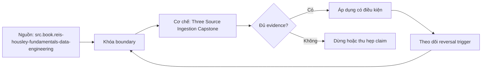

# Three Source Ingestion Capstone

> [!abstract] Câu hỏi trung tâm
> Capstone ba nguồn phải tạo chuỗi bằng chứng nào để chứng minh raw zone complete, replayable và vận hành được?

## 1. Ba nguồn có semantics khác

Case gồm API có cursor/rate limit, database snapshot plus changes và file drop có manifest. Mỗi nguồn có extraction contract riêng; không ép chung một watermark. Raw zone dùng shared envelope nhưng giữ source-native boundary, identity, schema/version và payload fidelity. Capstone chấm tính đúng của từng path và khả năng quan sát chung.

## 2. Hồ sơ kiến trúc

Nộp source contracts, decision ADR, sequence/failure diagrams, schema registry/diffs, landing envelope, checkpoint ledger, manifest/object map, access/retention policy và runbook. Mỗi artifact có locator/version/owner. Diagram không thay executable evidence. Secret chỉ là reference; test data synthetic hoặc đã được phê duyệt.

## 3. Pipeline invariant

Thứ tự acquire, land immutable, validate/reconcile, publish và checkpoint. API page, DB chunk/log interval và file batch đều có deterministic ingestion identity. Retry có thể replay nhưng không tạo silent gap; same identity different content bị quarantine. Publication chỉ mở dữ liệu đã đủ manifest/schema/integrity checks.

## 4. Failure campaign

Inject 429, lost response, cursor expiry, snapshot chunk retry, replica lag, schema breaking change, incomplete file batch, checksum mismatch, duplicate delivery và crash ở mỗi checkpoint boundary. Expected state/action viết trước. Một job tự recover nhưng làm mất key vẫn fail. Lưu timeline, state transitions, raw hashes, metrics và reconciliation diffs.

## 5. SLO và vận hành

Định nghĩa per-source freshness/completeness/correctness cùng common incident severity. Backfill có quota riêng. Dashboard thể hiện boundary lag, pending/quarantine, retry amplification, source impact và validation residual. Runbook có triage, containment, replay, revalidation, rollback và communication. Game day có observer và stop rules.

## 6. Điều kiện bảo vệ

Đạt khi ba source boundaries truy được tới published objects; rerun cùng input cho cùng accepted state; injected loss/collision bị phát hiện; daily path giữ SLO trong test envelope; reviewer độc lập tái hiện một failure. Chưa chạy production load, security review hay legal approval thì không gọi production-ready.

## 7. Ma trận kiểm chứng từng mệnh đề

Mỗi claim phải gắn source/entity boundary, exact fixture, checkpoint/input state, counterexample và independent reconciliation oracle. Connector chạy thành công hoặc API trả 2xx chưa chứng minh completeness.

### 7.1. Capstone probe 1: source boundary, invariant, injected failure, evidence locator và independent oracle phải đủ

**Mệnh đề cần kiểm.** Capstone probe 1: source boundary, invariant, injected failure, evidence locator và independent oracle phải đủ.

**Thiết kế phép thử cho `wiki.ingestion.three-source-ingestion-capstone`.** Khóa source/API version, entity, grain/key, time boundary, schema, pagination/cursor configuration và failure schedule. Tạo positive, boundary và negative fixtures; thay đổi đúng một assumption. Lưu request/query, response/raw extract hash, checkpoint trước/sau, landing objects, target state và source-at-boundary oracle.

**Điều kiện chấp nhận cho `wiki.ingestion.three-source-ingestion-capstone`.** Count, key set, typed field hash và delete state khớp contract; duplicates được giải thích và dedup có identity rõ. Observation, inference và unknown được báo riêng. Lab chưa chạy chỉ là protocol.

### 7.2. Capstone probe 2: source boundary, invariant, injected failure, evidence locator và independent oracle phải đủ

**Mệnh đề cần kiểm.** Capstone probe 2: source boundary, invariant, injected failure, evidence locator và independent oracle phải đủ.

**Thiết kế phép thử cho `wiki.ingestion.three-source-ingestion-capstone`.** Khóa source/API version, entity, grain/key, time boundary, schema, pagination/cursor configuration và failure schedule. Tạo positive, boundary và negative fixtures; thay đổi đúng một assumption. Lưu request/query, response/raw extract hash, checkpoint trước/sau, landing objects, target state và source-at-boundary oracle.

**Điều kiện chấp nhận cho `wiki.ingestion.three-source-ingestion-capstone`.** Count, key set, typed field hash và delete state khớp contract; duplicates được giải thích và dedup có identity rõ. Observation, inference và unknown được báo riêng. Lab chưa chạy chỉ là protocol.

### 7.3. Capstone probe 3: source boundary, invariant, injected failure, evidence locator và independent oracle phải đủ

**Mệnh đề cần kiểm.** Capstone probe 3: source boundary, invariant, injected failure, evidence locator và independent oracle phải đủ.

**Thiết kế phép thử cho `wiki.ingestion.three-source-ingestion-capstone`.** Khóa source/API version, entity, grain/key, time boundary, schema, pagination/cursor configuration và failure schedule. Tạo positive, boundary và negative fixtures; thay đổi đúng một assumption. Lưu request/query, response/raw extract hash, checkpoint trước/sau, landing objects, target state và source-at-boundary oracle.

**Điều kiện chấp nhận cho `wiki.ingestion.three-source-ingestion-capstone`.** Count, key set, typed field hash và delete state khớp contract; duplicates được giải thích và dedup có identity rõ. Observation, inference và unknown được báo riêng. Lab chưa chạy chỉ là protocol.

### 7.4. Capstone probe 4: source boundary, invariant, injected failure, evidence locator và independent oracle phải đủ

**Mệnh đề cần kiểm.** Capstone probe 4: source boundary, invariant, injected failure, evidence locator và independent oracle phải đủ.

**Thiết kế phép thử cho `wiki.ingestion.three-source-ingestion-capstone`.** Khóa source/API version, entity, grain/key, time boundary, schema, pagination/cursor configuration và failure schedule. Tạo positive, boundary và negative fixtures; thay đổi đúng một assumption. Lưu request/query, response/raw extract hash, checkpoint trước/sau, landing objects, target state và source-at-boundary oracle.

**Điều kiện chấp nhận cho `wiki.ingestion.three-source-ingestion-capstone`.** Count, key set, typed field hash và delete state khớp contract; duplicates được giải thích và dedup có identity rõ. Observation, inference và unknown được báo riêng. Lab chưa chạy chỉ là protocol.

### 7.5. Capstone probe 5: source boundary, invariant, injected failure, evidence locator và independent oracle phải đủ

**Mệnh đề cần kiểm.** Capstone probe 5: source boundary, invariant, injected failure, evidence locator và independent oracle phải đủ.

**Thiết kế phép thử cho `wiki.ingestion.three-source-ingestion-capstone`.** Khóa source/API version, entity, grain/key, time boundary, schema, pagination/cursor configuration và failure schedule. Tạo positive, boundary và negative fixtures; thay đổi đúng một assumption. Lưu request/query, response/raw extract hash, checkpoint trước/sau, landing objects, target state và source-at-boundary oracle.

**Điều kiện chấp nhận cho `wiki.ingestion.three-source-ingestion-capstone`.** Count, key set, typed field hash và delete state khớp contract; duplicates được giải thích và dedup có identity rõ. Observation, inference và unknown được báo riêng. Lab chưa chạy chỉ là protocol.

### 7.6. Capstone probe 6: source boundary, invariant, injected failure, evidence locator và independent oracle phải đủ

**Mệnh đề cần kiểm.** Capstone probe 6: source boundary, invariant, injected failure, evidence locator và independent oracle phải đủ.

**Thiết kế phép thử cho `wiki.ingestion.three-source-ingestion-capstone`.** Khóa source/API version, entity, grain/key, time boundary, schema, pagination/cursor configuration và failure schedule. Tạo positive, boundary và negative fixtures; thay đổi đúng một assumption. Lưu request/query, response/raw extract hash, checkpoint trước/sau, landing objects, target state và source-at-boundary oracle.

**Điều kiện chấp nhận cho `wiki.ingestion.three-source-ingestion-capstone`.** Count, key set, typed field hash và delete state khớp contract; duplicates được giải thích và dedup có identity rõ. Observation, inference và unknown được báo riêng. Lab chưa chạy chỉ là protocol.

### 7.7. Capstone probe 7: source boundary, invariant, injected failure, evidence locator và independent oracle phải đủ

**Mệnh đề cần kiểm.** Capstone probe 7: source boundary, invariant, injected failure, evidence locator và independent oracle phải đủ.

**Thiết kế phép thử cho `wiki.ingestion.three-source-ingestion-capstone`.** Khóa source/API version, entity, grain/key, time boundary, schema, pagination/cursor configuration và failure schedule. Tạo positive, boundary và negative fixtures; thay đổi đúng một assumption. Lưu request/query, response/raw extract hash, checkpoint trước/sau, landing objects, target state và source-at-boundary oracle.

**Điều kiện chấp nhận cho `wiki.ingestion.three-source-ingestion-capstone`.** Count, key set, typed field hash và delete state khớp contract; duplicates được giải thích và dedup có identity rõ. Observation, inference và unknown được báo riêng. Lab chưa chạy chỉ là protocol.

### 7.8. Capstone probe 8: source boundary, invariant, injected failure, evidence locator và independent oracle phải đủ

**Mệnh đề cần kiểm.** Capstone probe 8: source boundary, invariant, injected failure, evidence locator và independent oracle phải đủ.

**Thiết kế phép thử cho `wiki.ingestion.three-source-ingestion-capstone`.** Khóa source/API version, entity, grain/key, time boundary, schema, pagination/cursor configuration và failure schedule. Tạo positive, boundary và negative fixtures; thay đổi đúng một assumption. Lưu request/query, response/raw extract hash, checkpoint trước/sau, landing objects, target state và source-at-boundary oracle.

**Điều kiện chấp nhận cho `wiki.ingestion.three-source-ingestion-capstone`.** Count, key set, typed field hash và delete state khớp contract; duplicates được giải thích và dedup có identity rõ. Observation, inference và unknown được báo riêng. Lab chưa chạy chỉ là protocol.

### 7.9. Capstone probe 9: source boundary, invariant, injected failure, evidence locator và independent oracle phải đủ

**Mệnh đề cần kiểm.** Capstone probe 9: source boundary, invariant, injected failure, evidence locator và independent oracle phải đủ.

**Thiết kế phép thử cho `wiki.ingestion.three-source-ingestion-capstone`.** Khóa source/API version, entity, grain/key, time boundary, schema, pagination/cursor configuration và failure schedule. Tạo positive, boundary và negative fixtures; thay đổi đúng một assumption. Lưu request/query, response/raw extract hash, checkpoint trước/sau, landing objects, target state và source-at-boundary oracle.

**Điều kiện chấp nhận cho `wiki.ingestion.three-source-ingestion-capstone`.** Count, key set, typed field hash và delete state khớp contract; duplicates được giải thích và dedup có identity rõ. Observation, inference và unknown được báo riêng. Lab chưa chạy chỉ là protocol.

### 7.10. Capstone probe 10: source boundary, invariant, injected failure, evidence locator và independent oracle phải đủ

**Mệnh đề cần kiểm.** Capstone probe 10: source boundary, invariant, injected failure, evidence locator và independent oracle phải đủ.

**Thiết kế phép thử cho `wiki.ingestion.three-source-ingestion-capstone`.** Khóa source/API version, entity, grain/key, time boundary, schema, pagination/cursor configuration và failure schedule. Tạo positive, boundary và negative fixtures; thay đổi đúng một assumption. Lưu request/query, response/raw extract hash, checkpoint trước/sau, landing objects, target state và source-at-boundary oracle.

**Điều kiện chấp nhận cho `wiki.ingestion.three-source-ingestion-capstone`.** Count, key set, typed field hash và delete state khớp contract; duplicates được giải thích và dedup có identity rõ. Observation, inference và unknown được báo riêng. Lab chưa chạy chỉ là protocol.

### 7.11. Capstone probe 11: source boundary, invariant, injected failure, evidence locator và independent oracle phải đủ

**Mệnh đề cần kiểm.** Capstone probe 11: source boundary, invariant, injected failure, evidence locator và independent oracle phải đủ.

**Thiết kế phép thử cho `wiki.ingestion.three-source-ingestion-capstone`.** Khóa source/API version, entity, grain/key, time boundary, schema, pagination/cursor configuration và failure schedule. Tạo positive, boundary và negative fixtures; thay đổi đúng một assumption. Lưu request/query, response/raw extract hash, checkpoint trước/sau, landing objects, target state và source-at-boundary oracle.

**Điều kiện chấp nhận cho `wiki.ingestion.three-source-ingestion-capstone`.** Count, key set, typed field hash và delete state khớp contract; duplicates được giải thích và dedup có identity rõ. Observation, inference và unknown được báo riêng. Lab chưa chạy chỉ là protocol.

### 7.12. Capstone probe 12: source boundary, invariant, injected failure, evidence locator và independent oracle phải đủ

**Mệnh đề cần kiểm.** Capstone probe 12: source boundary, invariant, injected failure, evidence locator và independent oracle phải đủ.

**Thiết kế phép thử cho `wiki.ingestion.three-source-ingestion-capstone`.** Khóa source/API version, entity, grain/key, time boundary, schema, pagination/cursor configuration và failure schedule. Tạo positive, boundary và negative fixtures; thay đổi đúng một assumption. Lưu request/query, response/raw extract hash, checkpoint trước/sau, landing objects, target state và source-at-boundary oracle.

**Điều kiện chấp nhận cho `wiki.ingestion.three-source-ingestion-capstone`.** Count, key set, typed field hash và delete state khớp contract; duplicates được giải thích và dedup có identity rõ. Observation, inference và unknown được báo riêng. Lab chưa chạy chỉ là protocol.

### 7.13. Capstone probe 13: source boundary, invariant, injected failure, evidence locator và independent oracle phải đủ

**Mệnh đề cần kiểm.** Capstone probe 13: source boundary, invariant, injected failure, evidence locator và independent oracle phải đủ.

**Thiết kế phép thử cho `wiki.ingestion.three-source-ingestion-capstone`.** Khóa source/API version, entity, grain/key, time boundary, schema, pagination/cursor configuration và failure schedule. Tạo positive, boundary và negative fixtures; thay đổi đúng một assumption. Lưu request/query, response/raw extract hash, checkpoint trước/sau, landing objects, target state và source-at-boundary oracle.

**Điều kiện chấp nhận cho `wiki.ingestion.three-source-ingestion-capstone`.** Count, key set, typed field hash và delete state khớp contract; duplicates được giải thích và dedup có identity rõ. Observation, inference và unknown được báo riêng. Lab chưa chạy chỉ là protocol.

### 7.14. Capstone probe 14: source boundary, invariant, injected failure, evidence locator và independent oracle phải đủ

**Mệnh đề cần kiểm.** Capstone probe 14: source boundary, invariant, injected failure, evidence locator và independent oracle phải đủ.

**Thiết kế phép thử cho `wiki.ingestion.three-source-ingestion-capstone`.** Khóa source/API version, entity, grain/key, time boundary, schema, pagination/cursor configuration và failure schedule. Tạo positive, boundary và negative fixtures; thay đổi đúng một assumption. Lưu request/query, response/raw extract hash, checkpoint trước/sau, landing objects, target state và source-at-boundary oracle.

**Điều kiện chấp nhận cho `wiki.ingestion.three-source-ingestion-capstone`.** Count, key set, typed field hash và delete state khớp contract; duplicates được giải thích và dedup có identity rõ. Observation, inference và unknown được báo riêng. Lab chưa chạy chỉ là protocol.

### 7.15. Capstone probe 15: source boundary, invariant, injected failure, evidence locator và independent oracle phải đủ

**Mệnh đề cần kiểm.** Capstone probe 15: source boundary, invariant, injected failure, evidence locator và independent oracle phải đủ.

**Thiết kế phép thử cho `wiki.ingestion.three-source-ingestion-capstone`.** Khóa source/API version, entity, grain/key, time boundary, schema, pagination/cursor configuration và failure schedule. Tạo positive, boundary và negative fixtures; thay đổi đúng một assumption. Lưu request/query, response/raw extract hash, checkpoint trước/sau, landing objects, target state và source-at-boundary oracle.

**Điều kiện chấp nhận cho `wiki.ingestion.three-source-ingestion-capstone`.** Count, key set, typed field hash và delete state khớp contract; duplicates được giải thích và dedup có identity rõ. Observation, inference và unknown được báo riêng. Lab chưa chạy chỉ là protocol.

## 8. Quy trình phản biện

1. Chốt entity, grain, identity và immutable boundary.
2. Tách source fact, documentation claim và observed behavior.
3. Viết delete, retry, checkpoint và replay semantics trước code.
4. Dùng key/typed-hash reconciliation, không chỉ row count.
5. Pin version, retention, timezone, ordering và rate limits.
6. Ghi assumption bị falsify và extraction pattern thay thế.

## 9. Câu hỏi tự kiểm tra

1. Source thay đổi row/entity theo những operation nào?
2. Boundary nào định nghĩa complete?
3. Delete có xuất hiện trong interface không?
4. Cursor/order có total và immutable không?
5. Crash ở checkpoint boundary gây replay hay gap?
6. Bằng chứng nào chưa được chạy?

## 10. Giới hạn và điều chưa cho phép kết luận

- Chưa chạy mutation/pagination/watermark lab trên source thật.
- Product behavior phải pin version, retention và configuration.
- Decision matrices và failure protocols là synthesis của giáo trình.
- Note giữ trạng thái `review` tới khi chủ dự án duyệt.

## Reference
1. [[SRC-REIS-HOUSLEY-FUNDAMENTALS-DATA-ENGINEERING]]
2. [[SRC-AWS-DMS-DATA-VALIDATION]]
3. [[SRC-AIRBYTE-SCHEMA-CHANGE-MANAGEMENT]]
4. [[SRC-AIRBYTE-INCREMENTAL-APPEND-DEDUPED]]

## Source coverage

| Source slice | Nội dung sử dụng | Trạng thái |
|---|---|---|
| [[SRC-REIS-HOUSLEY-FUNDAMENTALS-DATA-ENGINEERING]] | Source/change/API contract hoặc engineering context | Đã đọc locator; không suy ngoài phạm vi |
| [[SRC-AWS-DMS-DATA-VALIDATION]] | Source/change/API contract hoặc engineering context | Đã đọc locator; không suy ngoài phạm vi |
| [[SRC-AIRBYTE-SCHEMA-CHANGE-MANAGEMENT]] | Source/change/API contract hoặc engineering context | Đã đọc locator; không suy ngoài phạm vi |
| [[SRC-AIRBYTE-INCREMENTAL-APPEND-DEDUPED]] | Source/change/API contract hoặc engineering context | Đã đọc locator; không suy ngoài phạm vi |

## Key takeaways
- Extraction pattern chỉ đúng khi source assumptions đúng.
- Completeness cần immutable boundary và reconciliation oracle.
- Retry/checkpoint ưu tiên replay có kiểm soát hơn silent gap.
- Connector không chuyển giao ownership về tính đúng.

<!-- ATOMIC-EXECUTION-CAPSULE:START -->

## Execution capsule — kiểm chứng `wiki.ingestion.three-source-ingestion-capstone`

> [!important] Phân loại mệnh đề
> Với `wiki.ingestion.three-source-ingestion-capstone`, sơ đồ, ví dụ và artifact về **Three Source Ingestion Capstone** là **synthesis để kiểm chứng**; chúng không phải trích dẫn hay case nguyên văn của nguồn.

### Sơ đồ cơ chế và điểm kiểm soát



Đọc sơ đồ `wiki.ingestion.three-source-ingestion-capstone` từ trái sang phải: source chỉ cung cấp claim ban đầu cho **Three Source Ingestion Capstone**; quyết định chỉ được đi tiếp sau khi boundary, evidence và điều kiện đảo quyết định đã hiện hữu.

### Ví dụ làm việc có thể bác bỏ

**Input.** Một đội cần trả lời: “Capstone ba nguồn phải tạo chuỗi bằng chứng nào để chứng minh raw zone complete, replayable và vận hành được?” cho một phạm vi nhỏ, có owner và deadline rõ.

**Decision.** Đội áp dụng **Three Source Ingestion Capstone** trên control và variant chỉ khác một assumption; expected result và hard constraints được khóa trước khi chạy.

**Outcome.** Với `wiki.ingestion.three-source-ingestion-capstone`, nếu observation vi phạm hard constraint hoặc oracle độc lập không xác nhận **Three Source Ingestion Capstone**, đội thu hẹp claim hay đảo quyết định. Nếu đạt, kết luận vẫn kèm scope, version và review date; một lần thành công không được nâng thành quy luật phổ quát.

### Artifact thực thi tối thiểu

```sql
-- Verification harness for: Three Source Ingestion Capstone
WITH evidence AS (
    SELECT 'wiki.ingestion.three-source-ingestion-capstone' AS concept_id,
           'boundary_declared' AS check_name, 1 AS passed
    UNION ALL
    SELECT 'wiki.ingestion.three-source-ingestion-capstone', 'independent_oracle', 1
    UNION ALL
    SELECT 'wiki.ingestion.three-source-ingestion-capstone', 'reversal_trigger_recorded', 1
)
SELECT concept_id,
       MIN(passed) AS all_hard_checks_pass,
       COUNT(*) AS evidence_items
FROM evidence
GROUP BY concept_id
HAVING MIN(passed) = 1;
```

Artifact của `wiki.ingestion.three-source-ingestion-capstone` buộc người dùng ghi boundary, oracle và reversal trigger cho **Three Source Ingestion Capstone**. Các giá trị minh họa phải được thay bằng evidence thật trước khi dùng cho quyết định.

### Tự kiểm tra trước khi tái sử dụng

1. Bạn có thể trả lời `Capstone ba nguồn phải tạo chuỗi bằng chứng nào để chứng minh raw zone complete, replayable và vận hành được?` bằng một câu mà không kéo thêm concept thứ hai không?
2. Source locator nào đỡ cho claim, và phần nào chỉ là synthesis trong note?
3. Observation nào khiến bạn dừng, thu hẹp hoặc đảo quyết định?
4. Artifact nào cho phép một reviewer độc lập tái hiện kết quả?

<!-- ATOMIC-EXECUTION-CAPSULE:END -->
