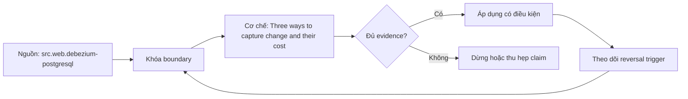

# Three ways to capture change and their cost

> [!abstract] Câu hỏi trung tâm
> Polling, trigger/audit table và transaction-log CDC nhìn thấy changes khác nhau và trả chi phí ở đâu?

## 1. Polling

Query timestamp/version dễ triển khai nhưng misses hard deletes, tie/order ambiguities và tạo source scans; watermark overlap cần dedup. Đừng bắt đầu bằng tên công cụ. Hãy bắt đầu bằng đối tượng được bảo vệ, boundary quan sát được và hậu quả nếu kết luận sai. Trong bài `Three ways to capture change and their cost`, câu hỏi thực dụng là: Polling, trigger/audit table và transaction-log CDC nhìn thấy changes khác nhau và trả chi phí ở đâu? Ta ghi rõ grain, population, time window, owner và hành động sau failure; nếu một trường chưa biết thì đánh dấu unknown thay vì lấp bằng mặc định. Bằng chứng tối thiểu gồm fixture có version, cấu hình hoặc rule đã resolve, raw observation, expected result và limitation. Phần này là curriculum synthesis dựa trên các nguồn đã định danh, không phải lời hứa rằng mọi adapter hay deployment đều có cùng hành vi.

## 2. Triggers and audit tables

Database trigger ghi explicit change rows trong transaction nhưng tăng write path coupling, storage và deployment governance. Điểm khó không nằm ở cú pháp mà ở identity và scope. Hai phép đo cùng tên vẫn có thể nói về hai population hoặc hai thời điểm khác nhau. Trong bài `Three ways to capture change and their cost`, câu hỏi thực dụng là: Polling, trigger/audit table và transaction-log CDC nhìn thấy changes khác nhau và trả chi phí ở đâu? Ta ghi rõ grain, population, time window, owner và hành động sau failure; nếu một trường chưa biết thì đánh dấu unknown thay vì lấp bằng mặc định. Bằng chứng tối thiểu gồm fixture có version, cấu hình hoặc rule đã resolve, raw observation, expected result và limitation. Phần này là curriculum synthesis dựa trên các nguồn đã định danh, không phải lời hứa rằng mọi adapter hay deployment đều có cùng hành vi.

## 3. Log-based CDC

Đọc committed transaction log giảm table scan và thấy deletes/order metadata nhưng cần privileges, retention và decoder semantics. Một dashboard xanh chỉ là tín hiệu. Muốn biến nó thành bằng chứng phải giữ input, phiên bản, rule, trạng thái trước-sau và cách tính độc lập. Trong bài `Three ways to capture change and their cost`, câu hỏi thực dụng là: Polling, trigger/audit table và transaction-log CDC nhìn thấy changes khác nhau và trả chi phí ở đâu? Ta ghi rõ grain, population, time window, owner và hành động sau failure; nếu một trường chưa biết thì đánh dấu unknown thay vì lấp bằng mặc định. Bằng chứng tối thiểu gồm fixture có version, cấu hình hoặc rule đã resolve, raw observation, expected result và limitation. Phần này là curriculum synthesis dựa trên các nguồn đã định danh, không phải lời hứa rằng mọi adapter hay deployment đều có cùng hành vi.

## 4. Coverage

Bulk load, truncate, DDL, primary-key update và out-of-band writes có support khác nhau theo method/source. Thiết kế tốt phải chịu được counterexample. Hãy chủ động tạo case sát boundary, case thiếu dữ liệu và case replay thay vì chỉ chạy happy path. Trong bài `Three ways to capture change and their cost`, câu hỏi thực dụng là: Polling, trigger/audit table và transaction-log CDC nhìn thấy changes khác nhau và trả chi phí ở đâu? Ta ghi rõ grain, population, time window, owner và hành động sau failure; nếu một trường chưa biết thì đánh dấu unknown thay vì lấp bằng mặc định. Bằng chứng tối thiểu gồm fixture có version, cấu hình hoặc rule đã resolve, raw observation, expected result và limitation. Phần này là curriculum synthesis dựa trên các nguồn đã định danh, không phải lời hứa rằng mọi adapter hay deployment đều có cùng hành vi.

## 5. Cost model

Đo source CPU/I/O/WAL, storage retention, connector compute, lag, operational toil và recovery complexity. Chi phí vận hành thuộc contract. Một rule đúng nhưng quá đắt, quá ồn hoặc không có owner sẽ nhanh chóng bị tắt và mất tác dụng. Trong bài `Three ways to capture change and their cost`, câu hỏi thực dụng là: Polling, trigger/audit table và transaction-log CDC nhìn thấy changes khác nhau và trả chi phí ở đâu? Ta ghi rõ grain, population, time window, owner và hành động sau failure; nếu một trường chưa biết thì đánh dấu unknown thay vì lấp bằng mặc định. Bằng chứng tối thiểu gồm fixture có version, cấu hình hoặc rule đã resolve, raw observation, expected result và limitation. Phần này là curriculum synthesis dựa trên các nguồn đã định danh, không phải lời hứa rằng mọi adapter hay deployment đều có cùng hành vi.

## 6. Decision experiment

Chạy cùng mutation suite qua ba methods, đối soát captured keys/ops/order và source impact trước chọn. Kết luận cần có điều kiện đảo chiều. Khi volume, latency, nguồn thẩm quyền hoặc topology đổi, quyết định cũ phải được xem xét lại bằng cùng một oracle. Trong bài `Three ways to capture change and their cost`, câu hỏi thực dụng là: Polling, trigger/audit table và transaction-log CDC nhìn thấy changes khác nhau và trả chi phí ở đâu? Ta ghi rõ grain, population, time window, owner và hành động sau failure; nếu một trường chưa biết thì đánh dấu unknown thay vì lấp bằng mặc định. Bằng chứng tối thiểu gồm fixture có version, cấu hình hoặc rule đã resolve, raw observation, expected result và limitation. Phần này là curriculum synthesis dựa trên các nguồn đã định danh, không phải lời hứa rằng mọi adapter hay deployment đều có cùng hành vi.

## 7. Ma trận kiểm chứng từng mệnh đề

Với `wiki.cdc.capture-methods-cost`, command thành công không tự chứng minh dữ liệu đúng. Protocol riêng của bài là: Dựng version-pinned fixture, inject compatibility/capacity/failure/change case và đối soát emitted/visible state bằng oracle độc lập. Mỗi probe dưới đây phải nối input boundary với failure signal và oracle có thể phản bác kết luận.

### 7.1. Three ways to capture change and their cost: kiểm `Polling` bằng case 1, cụ thể query timestamp/version dễ triển khai nhưng misses hard deletes, tie/order ambiguities và tạo source scans; watermark overlap cần dedup

**Mệnh đề cần kiểm.** Three ways to capture change and their cost: kiểm `Polling` bằng case 1, cụ thể query timestamp/version dễ triển khai nhưng misses hard deletes, tie/order ambiguities và tạo source scans; watermark overlap cần dedup.

**Thiết kế phép thử cho `wiki.cdc.capture-methods-cost`.** Trong ngữ cảnh `wiki.cdc.capture-methods-cost`, tạo positive control và negative control chỉ khác đúng một điều kiện. Khóa input snapshot, phiên bản và owner của rule; chạy đúng population được bài `Three ways to capture change and their cost` công bố.

**Bằng chứng cần giữ.** Đối với probe 1 của `Three ways to capture change and their cost`, giữ fixture, raw failing rows và lệnh tái hiện. Nếu chưa chạy lab, ghi expected evidence và giữ trạng thái review; không biến protocol thành observation.

### 7.2. Three ways to capture change and their cost: kiểm `Triggers and audit tables` bằng case 2, cụ thể database trigger ghi explicit change rows trong transaction nhưng tăng write path coupling, storage và deployment governance

**Mệnh đề cần kiểm.** Three ways to capture change and their cost: kiểm `Triggers and audit tables` bằng case 2, cụ thể database trigger ghi explicit change rows trong transaction nhưng tăng write path coupling, storage và deployment governance.

**Thiết kế phép thử cho `wiki.cdc.capture-methods-cost`.** Trong ngữ cảnh `wiki.cdc.capture-methods-cost`, đổi grain nhưng giữ tổng số dòng để lộ phép đo sai cấp. Khóa input snapshot, phiên bản và owner của rule; chạy đúng population được bài `Three ways to capture change and their cost` công bố.

**Bằng chứng cần giữ.** Đối với probe 2 của `Three ways to capture change and their cost`, báo numerator, denominator và key set ở cả hai grain. Nếu chưa chạy lab, ghi expected evidence và giữ trạng thái review; không biến protocol thành observation.

### 7.3. Three ways to capture change and their cost: kiểm `Log-based CDC` bằng case 3, cụ thể đọc committed transaction log giảm table scan và thấy deletes/order metadata nhưng cần privileges, retention và decoder semantics

**Mệnh đề cần kiểm.** Three ways to capture change and their cost: kiểm `Log-based CDC` bằng case 3, cụ thể đọc committed transaction log giảm table scan và thấy deletes/order metadata nhưng cần privileges, retention và decoder semantics.

**Thiết kế phép thử cho `wiki.cdc.capture-methods-cost`.** Trong ngữ cảnh `wiki.cdc.capture-methods-cost`, đưa một giá trị tới đúng boundary và một giá trị vượt boundary. Khóa input snapshot, phiên bản và owner của rule; chạy đúng population được bài `Three ways to capture change and their cost` công bố.

**Bằng chứng cần giữ.** Đối với probe 3 của `Three ways to capture change and their cost`, lưu hai observed values cùng rule đã resolve. Nếu chưa chạy lab, ghi expected evidence và giữ trạng thái review; không biến protocol thành observation.

### 7.4. Three ways to capture change and their cost: kiểm `Coverage` bằng case 4, cụ thể bulk load, truncate, ddl, primary-key update và out-of-band writes có support khác nhau theo method/source

**Mệnh đề cần kiểm.** Three ways to capture change and their cost: kiểm `Coverage` bằng case 4, cụ thể bulk load, truncate, ddl, primary-key update và out-of-band writes có support khác nhau theo method/source.

**Thiết kế phép thử cho `wiki.cdc.capture-methods-cost`.** Trong ngữ cảnh `wiki.cdc.capture-methods-cost`, kill tiến trình ngay trước rồi ngay sau durable side effect. Khóa input snapshot, phiên bản và owner của rule; chạy đúng population được bài `Three ways to capture change and their cost` công bố.

**Bằng chứng cần giữ.** Đối với probe 4 của `Three ways to capture change and their cost`, lưu checkpoint, external ledger và trạng thái sau restart. Nếu chưa chạy lab, ghi expected evidence và giữ trạng thái review; không biến protocol thành observation.

### 7.5. Three ways to capture change and their cost: kiểm `Cost model` bằng case 5, cụ thể đo source cpu/i/o/wal, storage retention, connector compute, lag, operational toil và recovery complexity

**Mệnh đề cần kiểm.** Three ways to capture change and their cost: kiểm `Cost model` bằng case 5, cụ thể đo source cpu/i/o/wal, storage retention, connector compute, lag, operational toil và recovery complexity.

**Thiết kế phép thử cho `wiki.cdc.capture-methods-cost`.** Trong ngữ cảnh `wiki.cdc.capture-methods-cost`, đảo thứ tự input và concurrency nhưng giữ logical population. Khóa input snapshot, phiên bản và owner của rule; chạy đúng population được bài `Three ways to capture change and their cost` công bố.

**Bằng chứng cần giữ.** Đối với probe 5 của `Three ways to capture change and their cost`, so canonical hash và business totals giữa các thứ tự. Nếu chưa chạy lab, ghi expected evidence và giữ trạng thái review; không biến protocol thành observation.

### 7.6. Three ways to capture change and their cost: kiểm `Decision experiment` bằng case 6, cụ thể chạy cùng mutation suite qua ba methods, đối soát captured keys/ops/order và source impact trước chọn

**Mệnh đề cần kiểm.** Three ways to capture change and their cost: kiểm `Decision experiment` bằng case 6, cụ thể chạy cùng mutation suite qua ba methods, đối soát captured keys/ops/order và source impact trước chọn.

**Thiết kế phép thử cho `wiki.cdc.capture-methods-cost`.** Trong ngữ cảnh `wiki.cdc.capture-methods-cost`, replay cùng identity với payload giống rồi payload xung đột. Khóa input snapshot, phiên bản và owner của rule; chạy đúng population được bài `Three ways to capture change and their cost` công bố.

**Bằng chứng cần giữ.** Đối với probe 6 của `Three ways to capture change and their cost`, tách duplicate replay khỏi identity collision bằng reason code. Nếu chưa chạy lab, ghi expected evidence và giữ trạng thái review; không biến protocol thành observation.

### 7.7. Three ways to capture change and their cost: kiểm `Polling` bằng case 7, cụ thể query timestamp/version dễ triển khai nhưng misses hard deletes, tie/order ambiguities và tạo source scans; watermark overlap cần dedup

**Mệnh đề cần kiểm.** Three ways to capture change and their cost: kiểm `Polling` bằng case 7, cụ thể query timestamp/version dễ triển khai nhưng misses hard deletes, tie/order ambiguities và tạo source scans; watermark overlap cần dedup.

**Thiết kế phép thử cho `wiki.cdc.capture-methods-cost`.** Trong ngữ cảnh `wiki.cdc.capture-methods-cost`, thêm record tới trễ trong horizon và ngoài horizon. Khóa input snapshot, phiên bản và owner của rule; chạy đúng population được bài `Three ways to capture change and their cost` công bố.

**Bằng chứng cần giữ.** Đối với probe 7 của `Three ways to capture change and their cost`, báo accepted-late, rejected-late và oldest outstanding timestamp. Nếu chưa chạy lab, ghi expected evidence và giữ trạng thái review; không biến protocol thành observation.

### 7.8. Three ways to capture change and their cost: kiểm `Triggers and audit tables` bằng case 8, cụ thể database trigger ghi explicit change rows trong transaction nhưng tăng write path coupling, storage và deployment governance

**Mệnh đề cần kiểm.** Three ways to capture change and their cost: kiểm `Triggers and audit tables` bằng case 8, cụ thể database trigger ghi explicit change rows trong transaction nhưng tăng write path coupling, storage và deployment governance.

**Thiết kế phép thử cho `wiki.cdc.capture-methods-cost`.** Trong ngữ cảnh `wiki.cdc.capture-methods-cost`, đổi schema theo một cách tương thích rồi một cách phá vỡ semantics. Khóa input snapshot, phiên bản và owner của rule; chạy đúng population được bài `Three ways to capture change and their cost` công bố.

**Bằng chứng cần giữ.** Đối với probe 8 của `Three ways to capture change and their cost`, giữ schema diff, classification và consumer-visible result. Nếu chưa chạy lab, ghi expected evidence và giữ trạng thái review; không biến protocol thành observation.

### 7.9. Three ways to capture change and their cost: kiểm `Log-based CDC` bằng case 9, cụ thể đọc committed transaction log giảm table scan và thấy deletes/order metadata nhưng cần privileges, retention và decoder semantics

**Mệnh đề cần kiểm.** Three ways to capture change and their cost: kiểm `Log-based CDC` bằng case 9, cụ thể đọc committed transaction log giảm table scan và thấy deletes/order metadata nhưng cần privileges, retention và decoder semantics.

**Thiết kế phép thử cho `wiki.cdc.capture-methods-cost`.** Trong ngữ cảnh `wiki.cdc.capture-methods-cost`, tạo missing và duplicate bù nhau để count tổng không đổi. Khóa input snapshot, phiên bản và owner của rule; chạy đúng population được bài `Three ways to capture change and their cost` công bố.

**Bằng chứng cần giữ.** Đối với probe 9 của `Three ways to capture change and their cost`, so key multiset và typed hashes thay vì chỉ row count. Nếu chưa chạy lab, ghi expected evidence và giữ trạng thái review; không biến protocol thành observation.

### 7.10. Three ways to capture change and their cost: kiểm `Coverage` bằng case 10, cụ thể bulk load, truncate, ddl, primary-key update và out-of-band writes có support khác nhau theo method/source

**Mệnh đề cần kiểm.** Three ways to capture change and their cost: kiểm `Coverage` bằng case 10, cụ thể bulk load, truncate, ddl, primary-key update và out-of-band writes có support khác nhau theo method/source.

**Thiết kế phép thử cho `wiki.cdc.capture-methods-cost`.** Trong ngữ cảnh `wiki.cdc.capture-methods-cost`, cho reviewer tái hiện chỉ từ evidence package. Khóa input snapshot, phiên bản và owner của rule; chạy đúng population được bài `Three ways to capture change and their cost` công bố.

**Bằng chứng cần giữ.** Đối với probe 10 của `Three ways to capture change and their cost`, package phải đủ để người khác dựng lại decision và limitation. Nếu chưa chạy lab, ghi expected evidence và giữ trạng thái review; không biến protocol thành observation.

### 7.11. Three ways to capture change and their cost: kiểm `Cost model` bằng case 11, cụ thể đo source cpu/i/o/wal, storage retention, connector compute, lag, operational toil và recovery complexity

**Mệnh đề cần kiểm.** Three ways to capture change and their cost: kiểm `Cost model` bằng case 11, cụ thể đo source cpu/i/o/wal, storage retention, connector compute, lag, operational toil và recovery complexity.

**Thiết kế phép thử cho `wiki.cdc.capture-methods-cost`.** Trong ngữ cảnh `wiki.cdc.capture-methods-cost`, so với oracle độc lập không dùng chung query hoặc parser. Khóa input snapshot, phiên bản và owner của rule; chạy đúng population được bài `Three ways to capture change and their cost` công bố.

**Bằng chứng cần giữ.** Đối với probe 11 của `Three ways to capture change and their cost`, independent result phải khớp ở grain đã công bố. Nếu chưa chạy lab, ghi expected evidence và giữ trạng thái review; không biến protocol thành observation.

### 7.12. Three ways to capture change and their cost: kiểm `Decision experiment` bằng case 12, cụ thể chạy cùng mutation suite qua ba methods, đối soát captured keys/ops/order và source impact trước chọn

**Mệnh đề cần kiểm.** Three ways to capture change and their cost: kiểm `Decision experiment` bằng case 12, cụ thể chạy cùng mutation suite qua ba methods, đối soát captured keys/ops/order và source impact trước chọn.

**Thiết kế phép thử cho `wiki.cdc.capture-methods-cost`.** Trong ngữ cảnh `wiki.cdc.capture-methods-cost`, chạy scope hẹp và population đầy đủ rồi công bố phần bị loại. Khóa input snapshot, phiên bản và owner của rule; chạy đúng population được bài `Three ways to capture change and their cost` công bố.

**Bằng chứng cần giữ.** Đối với probe 12 của `Three ways to capture change and their cost`, coverage phải nêu rõ excluded nodes, partitions hoặc incidents. Nếu chưa chạy lab, ghi expected evidence và giữ trạng thái review; không biến protocol thành observation.

### 7.13. Three ways to capture change and their cost: kiểm `Polling` bằng case 13, cụ thể query timestamp/version dễ triển khai nhưng misses hard deletes, tie/order ambiguities và tạo source scans; watermark overlap cần dedup

**Mệnh đề cần kiểm.** Three ways to capture change and their cost: kiểm `Polling` bằng case 13, cụ thể query timestamp/version dễ triển khai nhưng misses hard deletes, tie/order ambiguities và tạo source scans; watermark overlap cần dedup.

**Thiết kế phép thử cho `wiki.cdc.capture-methods-cost`.** Trong ngữ cảnh `wiki.cdc.capture-methods-cost`, thử timezone, precision hoặc partition ở hai phía của ranh giới. Khóa input snapshot, phiên bản và owner của rule; chạy đúng population được bài `Three ways to capture change and their cost` công bố.

**Bằng chứng cần giữ.** Đối với probe 13 của `Three ways to capture change and their cost`, UTC/local interval và rounding policy phải hiện trong output. Nếu chưa chạy lab, ghi expected evidence và giữ trạng thái review; không biến protocol thành observation.

### 7.14. Three ways to capture change and their cost: kiểm `Triggers and audit tables` bằng case 14, cụ thể database trigger ghi explicit change rows trong transaction nhưng tăng write path coupling, storage và deployment governance

**Mệnh đề cần kiểm.** Three ways to capture change and their cost: kiểm `Triggers and audit tables` bằng case 14, cụ thể database trigger ghi explicit change rows trong transaction nhưng tăng write path coupling, storage và deployment governance.

**Thiết kế phép thử cho `wiki.cdc.capture-methods-cost`.** Trong ngữ cảnh `wiki.cdc.capture-methods-cost`, đổi constraint đủ lớn để quyết định phải đảo. Khóa input snapshot, phiên bản và owner của rule; chạy đúng population được bài `Three ways to capture change and their cost` công bố.

**Bằng chứng cần giữ.** Đối với probe 14 của `Three ways to capture change and their cost`, ADR phải lưu changed constraint và reversal threshold. Nếu chưa chạy lab, ghi expected evidence và giữ trạng thái review; không biến protocol thành observation.

### 7.15. Three ways to capture change and their cost: kiểm `Log-based CDC` bằng case 15, cụ thể đọc committed transaction log giảm table scan và thấy deletes/order metadata nhưng cần privileges, retention và decoder semantics

**Mệnh đề cần kiểm.** Three ways to capture change and their cost: kiểm `Log-based CDC` bằng case 15, cụ thể đọc committed transaction log giảm table scan và thấy deletes/order metadata nhưng cần privileges, retention và decoder semantics.

**Thiết kế phép thử cho `wiki.cdc.capture-methods-cost`.** Trong ngữ cảnh `wiki.cdc.capture-methods-cost`, chạy lại từ môi trường sạch với versions và seed đã khóa. Khóa input snapshot, phiên bản và owner của rule; chạy đúng population được bài `Three ways to capture change and their cost` công bố.

**Bằng chứng cần giữ.** Đối với probe 15 của `Three ways to capture change and their cost`, canonical result phải ổn định hoặc mọi nondeterminism phải được giải thích. Nếu chưa chạy lab, ghi expected evidence và giữ trạng thái review; không biến protocol thành observation.

## 8. Quy trình phản biện

1. Viết consumer-visible invariant cho `Three ways to capture change and their cost` trước khi chọn query hoặc tool.
2. Khóa grain, identity, population, time window và authoritative source.
3. Phân biệt declared configuration, executed state và published state.
4. Chạy negative control, replay hoặc changed-assumption case phù hợp.
5. Đối soát bằng oracle độc lập; công bố coverage và phần không quan sát được.
6. Gắn owner, hành động, reversal trigger và hạn review cho kết luận.

## 9. Câu hỏi tự kiểm tra

1. `Three ways to capture change and their cost: kiểm `Polling` bằng case 1, cụ thể query timestamp/version dễ triển khai nhưng misses hard deletes, tie/order ambiguities và tạo source scans; watermark overlap cần dedup` thất bại đầu tiên ở boundary nào?
2. Artifact nào mạnh nhất để trả lời `Three ways to capture change and their cost: kiểm `Log-based CDC` bằng case 3, cụ thể đọc committed transaction log giảm table scan và thấy deletes/order metadata nhưng cần privileges, retention và decoder semantics`?
3. Counterexample nhỏ nhất cho `Three ways to capture change and their cost: kiểm `Decision experiment` bằng case 6, cụ thể chạy cùng mutation suite qua ba methods, đối soát captured keys/ops/order và source impact trước chọn` gồm những state nào?
4. `Three ways to capture change and their cost: kiểm `Log-based CDC` bằng case 9, cụ thể đọc committed transaction log giảm table scan và thấy deletes/order metadata nhưng cần privileges, retention và decoder semantics` có thể xanh giả ra sao?
5. Constraint nào khiến quyết định ở `Three ways to capture change and their cost: kiểm `Triggers and audit tables` bằng case 14, cụ thể database trigger ghi explicit change rows trong transaction nhưng tăng write path coupling, storage và deployment governance` phải đảo?
6. Phần nào của `Three ways to capture change and their cost: kiểm `Log-based CDC` bằng case 15, cụ thể đọc committed transaction log giảm table scan và thấy deletes/order metadata nhưng cần privileges, retention và decoder semantics` mới là protocol, chưa phải observation?

## 10. Giới hạn và điều chưa cho phép kết luận

- Lab của `Three ways to capture change and their cost` chưa chạy trên hệ thống production; nội dung là giáo trình và expected evidence.
- Hành vi phụ thuộc phiên bản, connector, scheduler, warehouse và catalog configuration phải được kiểm lại.
- Các ma trận, ladder và threshold do giáo trình tổng hợp không được gán nguyên văn cho vendor.
- Note giữ trạng thái `review` cho tới khi owner duyệt semantics và learner artifact.

## Reference
1. [[SRC-DEBEZIUM-POSTGRESQL]]

## Source coverage

| Source slice | Nội dung sử dụng | Trạng thái |
|---|---|---|
| [[SRC-DEBEZIUM-POSTGRESQL]] | Contract hoặc cơ chế liên quan trực tiếp tới `Three ways to capture change and their cost` | Đã đọc locator; cần pin version khi chạy lab |

## Key takeaways
- Polling, triggers và log CDC đổi coverage lấy source/operational cost khác nhau.
- Với `wiki.cdc.capture-methods-cost`, quality của kết luận phụ thuộc identity, coverage và oracle chứ không phụ thuộc màu dashboard.
- Câu hỏi `Polling, trigger/audit table và transaction-log CDC nhìn thấy changes khác nhau và trả chi phí ở đâu?` chỉ được trả lời trong scope và version đã ghi.
- Các source IDs `src.web.debezium-postgresql` đặt ranh giới cho source fact; phần còn lại là synthesis có nhãn.
- Trước khi lab chạy, đây là note đã kiểm cấu trúc và provenance, chưa phải chứng nhận production.

<!-- ATOMIC-EXECUTION-CAPSULE:START -->

## Execution capsule: kiểm chứng `wiki.cdc.capture-methods-cost`

> [!important] Phân loại mệnh đề
> Với `wiki.cdc.capture-methods-cost`, sơ đồ, ví dụ và artifact về **Three ways to capture change and their cost** là **synthesis để kiểm chứng**; chúng không phải trích dẫn hay case nguyên văn của nguồn.

### Sơ đồ cơ chế và điểm kiểm soát



Đọc sơ đồ `wiki.cdc.capture-methods-cost` từ trái sang phải: source chỉ cung cấp claim ban đầu cho **Three ways to capture change and their cost**; quyết định chỉ được đi tiếp sau khi boundary, evidence và điều kiện đảo quyết định đã hiện hữu.

### Artifact thực thi tối thiểu

```sql
-- Verification harness for: Three ways to capture change and their cost
WITH evidence AS (
    SELECT 'wiki.cdc.capture-methods-cost' AS concept_id,
           'boundary_declared' AS check_name, 1 AS passed
    UNION ALL
    SELECT 'wiki.cdc.capture-methods-cost', 'independent_oracle', 1
    UNION ALL
    SELECT 'wiki.cdc.capture-methods-cost', 'reversal_trigger_recorded', 1
)
SELECT concept_id,
       MIN(passed) AS all_hard_checks_pass,
       COUNT(*) AS evidence_items
FROM evidence
GROUP BY concept_id
HAVING MIN(passed) = 1;
```

Artifact của `wiki.cdc.capture-methods-cost` buộc người dùng ghi boundary, oracle và reversal trigger cho **Three ways to capture change and their cost**. Các giá trị minh họa phải được thay bằng evidence thật trước khi dùng cho quyết định.

### Tự kiểm tra trước khi tái sử dụng

1. Bạn có thể trả lời `Polling, trigger/audit table và transaction-log CDC nhìn thấy changes khác nhau và trả chi phí ở đâu?` bằng một câu mà không kéo thêm concept thứ hai không?
2. Source locator nào đỡ cho claim, và phần nào chỉ là synthesis trong note?
3. Observation nào khiến bạn dừng, thu hẹp hoặc đảo quyết định?
4. Artifact nào cho phép một reviewer độc lập tái hiện kết quả?

<!-- ATOMIC-EXECUTION-CAPSULE:END -->
