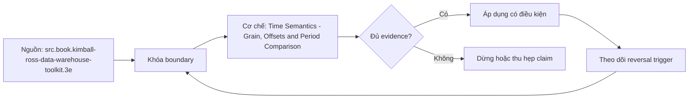

# Time Semantics - Grain, Offsets and Period Comparison

> [!abstract] Câu hỏi trung tâm
> Metric time contract phải chốt timestamp role, grain, timezone và calendar như thế nào để period comparison đúng khi thiếu kỳ, khác độ dài tháng và qua năm nhuận?

## 1. Bốn quyết định thời gian

Mỗi metric phải chốt event timestamp role, default time grain, reference timezone và calendar/fiscal definition. Order date đo demand; ship date đo fulfillment; payment date đo cash; recognized date đo accounting revenue. Một record có nhiều clocks nên theo tháng chưa đủ. Default grain không cấm drill khác nhưng xác định display/aggregation behavior. Fiscal calendar có thể 4-4-5, week-based hoặc organization-specific và không suy từ Gregorian month.

## 2. Timezone và ranh giới ngày

Timestamp cần biết instant và timezone policy. Giao dịch 00:30 UTC có thể thuộc ngày trước ở America/Los_Angeles và ngày hiện tại ở Asia/Ho_Chi_Minh. Convert sang business timezone trước date truncation; không cast UTC timestamp sang date rồi mới đổi timezone. Daylight-saving tạo ngày 23/25 giờ ở một số zones, nên rolling 24 hours khác calendar day. Lưu timezone database/version khi reproducibility quan trọng.

## 3. Time spine và kỳ rỗng

Dense calendar/time spine tạo một row cho mọi period trong phạm vi rồi left join metrics. Nếu chỉ dùng periods xuất hiện trong fact, tháng rỗng biến mất; `lag(1)` lấy tháng có data trước đó thay vì tháng lịch trước. Calendar cần date, week/month/quarter/year keys, fiscal attributes, period start/end, working-day/holiday nếu relevant. `generate_series` dựng scaffold PostgreSQL, nhưng business calendar vẫn cần maintained dimensions và policy.

## 4. Ba cách dịch kỳ

Có ít nhất ba semantics: calendar-coordinate offset, fixed-duration offset và aligned elapsed-position comparison. `2024-02-29 - 1 year` cần policy cho ngày không tồn tại; fixed 365 days không đồng nghĩa same date last year; month-to-date so với prior-month cùng số ngày elapsed khác full prior month. Chọn theo business question và document clipping/padding. Không áp một offset function cho mọi metric.

## 5. Period-over-period và year-over-year

PoP cần current period, exact previous period trên dense spine và policy partial-period. YoY cần same fiscal/calendar coordinate, timezone và comparable coverage. Khi current month chưa kết thúc, so full previous month tạo bias; dùng aligned-to-date hoặc label incomplete. Leap-day có thể map Feb 29 sang Feb 28, Mar 1 hoặc exclude/separate; owner phải phê duyệt vì mỗi cách trả lời câu khác.

## 6. Rolling window và period-to-date

Rolling N days là interval liên tục; rolling N calendar months có boundaries khác do month length; MTD/QTD/YTD reset theo calendar/fiscal start. Window inclusive endpoints có thể đếm thừa một ngày nếu dùng BETWEEN. Cumulative metric cần time spine, late-data restatement và re-aggregation policy khi query grain đổi. Running total qua rows chỉ đúng sau densification và deduplication ở target grain.

## 7. Bộ fixture bắt lỗi

Dữ liệu kiểm phải có ba tháng rỗng, Feb 29, year boundary, midnight ở ít nhất hai timezones, partial current period và late event. Tính expected output bằng bảng tay độc lập cho ba metrics. So bucket membership trước values, vì cùng total có thể che phân kỳ sai. Lưu calendar version, timezone, cutoff, window endpoints và result diff; rerun cùng snapshot phải giống hệt.

## 8. Ma trận kiểm chứng từng mệnh đề

Các mệnh đề dưới đây phải được kiểm bằng fixture, invariant và output có thể chạy lại. Việc công cụ compile được YAML hoặc sinh SQL không tự chứng minh metric đúng nghĩa.

### 8.1. timestamp role phải gắn business event

**Mệnh đề cần kiểm.** timestamp role phải gắn business event.

**Cách kiểm.** Dựng dense calendar có fiscal fields, missing months, leap day, partial period và timezone boundary. So bucket membership cùng three offset semantics với hand-calculated oracle; rerun ở fixed cutoff. Với mệnh đề này, ghi rõ dữ liệu phản ví dụ, expected result và failure signal. Tách validation cấu trúc khỏi xác nhận meaning của owner.

**Bằng chứng đạt cho `wiki.semantic-layer.time-semantics`.** Lưu contract/graph, snapshot, query hoặc compiled SQL, output thô, semantic diff và assumptions. Chỉ đánh dấu đạt khi cùng artifact cho kết quả lặp lại ở cùng version/cutoff; nếu chưa chạy, đây là test protocol chứ chưa phải kết quả production.

### 8.2. timezone conversion xảy ra trước date truncation

**Mệnh đề cần kiểm.** timezone conversion xảy ra trước date truncation.

**Cách kiểm.** Dựng dense calendar có fiscal fields, missing months, leap day, partial period và timezone boundary. So bucket membership cùng three offset semantics với hand-calculated oracle; rerun ở fixed cutoff. Với mệnh đề này, ghi rõ dữ liệu phản ví dụ, expected result và failure signal. Tách validation cấu trúc khỏi xác nhận meaning của owner.

**Bằng chứng đạt cho `wiki.semantic-layer.time-semantics`.** Lưu contract/graph, snapshot, query hoặc compiled SQL, output thô, semantic diff và assumptions. Chỉ đánh dấu đạt khi cùng artifact cho kết quả lặp lại ở cùng version/cutoff; nếu chưa chạy, đây là test protocol chứ chưa phải kết quả production.

### 8.3. calendar day khác rolling 24 hours

**Mệnh đề cần kiểm.** calendar day khác rolling 24 hours.

**Cách kiểm.** Dựng dense calendar có fiscal fields, missing months, leap day, partial period và timezone boundary. So bucket membership cùng three offset semantics với hand-calculated oracle; rerun ở fixed cutoff. Với mệnh đề này, ghi rõ dữ liệu phản ví dụ, expected result và failure signal. Tách validation cấu trúc khỏi xác nhận meaning của owner.

**Bằng chứng đạt cho `wiki.semantic-layer.time-semantics`.** Lưu contract/graph, snapshot, query hoặc compiled SQL, output thô, semantic diff và assumptions. Chỉ đánh dấu đạt khi cùng artifact cho kết quả lặp lại ở cùng version/cutoff; nếu chưa chạy, đây là test protocol chứ chưa phải kết quả production.

### 8.4. default grain phải được công bố

**Mệnh đề cần kiểm.** default grain phải được công bố.

**Cách kiểm.** Dựng dense calendar có fiscal fields, missing months, leap day, partial period và timezone boundary. So bucket membership cùng three offset semantics với hand-calculated oracle; rerun ở fixed cutoff. Với mệnh đề này, ghi rõ dữ liệu phản ví dụ, expected result và failure signal. Tách validation cấu trúc khỏi xác nhận meaning của owner.

**Bằng chứng đạt cho `wiki.semantic-layer.time-semantics`.** Lưu contract/graph, snapshot, query hoặc compiled SQL, output thô, semantic diff và assumptions. Chỉ đánh dấu đạt khi cùng artifact cho kết quả lặp lại ở cùng version/cutoff; nếu chưa chạy, đây là test protocol chứ chưa phải kết quả production.

### 8.5. fiscal calendar không suy từ Gregorian calendar

**Mệnh đề cần kiểm.** fiscal calendar không suy từ Gregorian calendar.

**Cách kiểm.** Dựng dense calendar có fiscal fields, missing months, leap day, partial period và timezone boundary. So bucket membership cùng three offset semantics với hand-calculated oracle; rerun ở fixed cutoff. Với mệnh đề này, ghi rõ dữ liệu phản ví dụ, expected result và failure signal. Tách validation cấu trúc khỏi xác nhận meaning của owner.

**Bằng chứng đạt cho `wiki.semantic-layer.time-semantics`.** Lưu contract/graph, snapshot, query hoặc compiled SQL, output thô, semantic diff và assumptions. Chỉ đánh dấu đạt khi cùng artifact cho kết quả lặp lại ở cùng version/cutoff; nếu chưa chạy, đây là test protocol chứ chưa phải kết quả production.

### 8.6. dense time spine giữ kỳ rỗng

**Mệnh đề cần kiểm.** dense time spine giữ kỳ rỗng.

**Cách kiểm.** Dựng dense calendar có fiscal fields, missing months, leap day, partial period và timezone boundary. So bucket membership cùng three offset semantics với hand-calculated oracle; rerun ở fixed cutoff. Với mệnh đề này, ghi rõ dữ liệu phản ví dụ, expected result và failure signal. Tách validation cấu trúc khỏi xác nhận meaning của owner.

**Bằng chứng đạt cho `wiki.semantic-layer.time-semantics`.** Lưu contract/graph, snapshot, query hoặc compiled SQL, output thô, semantic diff và assumptions. Chỉ đánh dấu đạt khi cùng artifact cho kết quả lặp lại ở cùng version/cutoff; nếu chưa chạy, đây là test protocol chứ chưa phải kết quả production.

### 8.7. lag trên sparse rows không phải previous calendar period

**Mệnh đề cần kiểm.** lag trên sparse rows không phải previous calendar period.

**Cách kiểm.** Dựng dense calendar có fiscal fields, missing months, leap day, partial period và timezone boundary. So bucket membership cùng three offset semantics với hand-calculated oracle; rerun ở fixed cutoff. Với mệnh đề này, ghi rõ dữ liệu phản ví dụ, expected result và failure signal. Tách validation cấu trúc khỏi xác nhận meaning của owner.

**Bằng chứng đạt cho `wiki.semantic-layer.time-semantics`.** Lưu contract/graph, snapshot, query hoặc compiled SQL, output thô, semantic diff và assumptions. Chỉ đánh dấu đạt khi cùng artifact cho kết quả lặp lại ở cùng version/cutoff; nếu chưa chạy, đây là test protocol chứ chưa phải kết quả production.

### 8.8. generate_series chỉ tạo scaffold

**Mệnh đề cần kiểm.** generate_series chỉ tạo scaffold.

**Cách kiểm.** Dựng dense calendar có fiscal fields, missing months, leap day, partial period và timezone boundary. So bucket membership cùng three offset semantics với hand-calculated oracle; rerun ở fixed cutoff. Với mệnh đề này, ghi rõ dữ liệu phản ví dụ, expected result và failure signal. Tách validation cấu trúc khỏi xác nhận meaning của owner.

**Bằng chứng đạt cho `wiki.semantic-layer.time-semantics`.** Lưu contract/graph, snapshot, query hoặc compiled SQL, output thô, semantic diff và assumptions. Chỉ đánh dấu đạt khi cùng artifact cho kết quả lặp lại ở cùng version/cutoff; nếu chưa chạy, đây là test protocol chứ chưa phải kết quả production.

### 8.9. leap-day mapping cần owner policy

**Mệnh đề cần kiểm.** leap-day mapping cần owner policy.

**Cách kiểm.** Dựng dense calendar có fiscal fields, missing months, leap day, partial period và timezone boundary. So bucket membership cùng three offset semantics với hand-calculated oracle; rerun ở fixed cutoff. Với mệnh đề này, ghi rõ dữ liệu phản ví dụ, expected result và failure signal. Tách validation cấu trúc khỏi xác nhận meaning của owner.

**Bằng chứng đạt cho `wiki.semantic-layer.time-semantics`.** Lưu contract/graph, snapshot, query hoặc compiled SQL, output thô, semantic diff và assumptions. Chỉ đánh dấu đạt khi cùng artifact cho kết quả lặp lại ở cùng version/cutoff; nếu chưa chạy, đây là test protocol chứ chưa phải kết quả production.

### 8.10. fixed 365-day offset khác one-year offset

**Mệnh đề cần kiểm.** fixed 365-day offset khác one-year offset.

**Cách kiểm.** Dựng dense calendar có fiscal fields, missing months, leap day, partial period và timezone boundary. So bucket membership cùng three offset semantics với hand-calculated oracle; rerun ở fixed cutoff. Với mệnh đề này, ghi rõ dữ liệu phản ví dụ, expected result và failure signal. Tách validation cấu trúc khỏi xác nhận meaning của owner.

**Bằng chứng đạt cho `wiki.semantic-layer.time-semantics`.** Lưu contract/graph, snapshot, query hoặc compiled SQL, output thô, semantic diff và assumptions. Chỉ đánh dấu đạt khi cùng artifact cho kết quả lặp lại ở cùng version/cutoff; nếu chưa chạy, đây là test protocol chứ chưa phải kết quả production.

### 8.11. partial-period comparison cần aligned coverage

**Mệnh đề cần kiểm.** partial-period comparison cần aligned coverage.

**Cách kiểm.** Dựng dense calendar có fiscal fields, missing months, leap day, partial period và timezone boundary. So bucket membership cùng three offset semantics với hand-calculated oracle; rerun ở fixed cutoff. Với mệnh đề này, ghi rõ dữ liệu phản ví dụ, expected result và failure signal. Tách validation cấu trúc khỏi xác nhận meaning của owner.

**Bằng chứng đạt cho `wiki.semantic-layer.time-semantics`.** Lưu contract/graph, snapshot, query hoặc compiled SQL, output thô, semantic diff và assumptions. Chỉ đánh dấu đạt khi cùng artifact cho kết quả lặp lại ở cùng version/cutoff; nếu chưa chạy, đây là test protocol chứ chưa phải kết quả production.

### 8.12. rolling days khác rolling calendar months

**Mệnh đề cần kiểm.** rolling days khác rolling calendar months.

**Cách kiểm.** Dựng dense calendar có fiscal fields, missing months, leap day, partial period và timezone boundary. So bucket membership cùng three offset semantics với hand-calculated oracle; rerun ở fixed cutoff. Với mệnh đề này, ghi rõ dữ liệu phản ví dụ, expected result và failure signal. Tách validation cấu trúc khỏi xác nhận meaning của owner.

**Bằng chứng đạt cho `wiki.semantic-layer.time-semantics`.** Lưu contract/graph, snapshot, query hoặc compiled SQL, output thô, semantic diff và assumptions. Chỉ đánh dấu đạt khi cùng artifact cho kết quả lặp lại ở cùng version/cutoff; nếu chưa chạy, đây là test protocol chứ chưa phải kết quả production.

### 8.13. window endpoints phải định nghĩa inclusive/exclusive

**Mệnh đề cần kiểm.** window endpoints phải định nghĩa inclusive/exclusive.

**Cách kiểm.** Dựng dense calendar có fiscal fields, missing months, leap day, partial period và timezone boundary. So bucket membership cùng three offset semantics với hand-calculated oracle; rerun ở fixed cutoff. Với mệnh đề này, ghi rõ dữ liệu phản ví dụ, expected result và failure signal. Tách validation cấu trúc khỏi xác nhận meaning của owner.

**Bằng chứng đạt cho `wiki.semantic-layer.time-semantics`.** Lưu contract/graph, snapshot, query hoặc compiled SQL, output thô, semantic diff và assumptions. Chỉ đánh dấu đạt khi cùng artifact cho kết quả lặp lại ở cùng version/cutoff; nếu chưa chạy, đây là test protocol chứ chưa phải kết quả production.

### 8.14. late event cần restatement policy

**Mệnh đề cần kiểm.** late event cần restatement policy.

**Cách kiểm.** Dựng dense calendar có fiscal fields, missing months, leap day, partial period và timezone boundary. So bucket membership cùng three offset semantics với hand-calculated oracle; rerun ở fixed cutoff. Với mệnh đề này, ghi rõ dữ liệu phản ví dụ, expected result và failure signal. Tách validation cấu trúc khỏi xác nhận meaning của owner.

**Bằng chứng đạt cho `wiki.semantic-layer.time-semantics`.** Lưu contract/graph, snapshot, query hoặc compiled SQL, output thô, semantic diff và assumptions. Chỉ đánh dấu đạt khi cùng artifact cho kết quả lặp lại ở cùng version/cutoff; nếu chưa chạy, đây là test protocol chứ chưa phải kết quả production.

### 8.15. bucket-membership diff phải kiểm trước final totals

**Mệnh đề cần kiểm.** bucket-membership diff phải kiểm trước final totals.

**Cách kiểm.** Dựng dense calendar có fiscal fields, missing months, leap day, partial period và timezone boundary. So bucket membership cùng three offset semantics với hand-calculated oracle; rerun ở fixed cutoff. Với mệnh đề này, ghi rõ dữ liệu phản ví dụ, expected result và failure signal. Tách validation cấu trúc khỏi xác nhận meaning của owner.

**Bằng chứng đạt cho `wiki.semantic-layer.time-semantics`.** Lưu contract/graph, snapshot, query hoặc compiled SQL, output thô, semantic diff và assumptions. Chỉ đánh dấu đạt khi cùng artifact cho kết quả lặp lại ở cùng version/cutoff; nếu chưa chạy, đây là test protocol chứ chưa phải kết quả production.

## 9. Quy trình phản biện

1. Viết business question, population, grain, identity, time và unit trước syntax.
2. Chỉ ra artifact canonical, owner, version và change process.
3. Tách source fact, product-version detail và curriculum synthesis.
4. Dựng normal case cùng phản ví dụ: denominator lệch, fanout, sparse period, timezone boundary hoặc non-additive rollup.
5. So eligible rows và intermediate components trước final value; hai lỗi có thể triệt tiêu ở số cuối.
6. Chạy negative tests song song với valid controls để phát hiện cả false negative và false positive.
7. Lưu failed run, limitations và conditions khiến kết luận phải đổi.

## 10. Câu hỏi tự kiểm tra

1. Metric đang trả lời câu hỏi nào, trên population và grain nào?
2. Entity/dimension nào reachable qua path nào, cardinality gì?
3. Aggregation nào hợp lệ theo từng dimension và time grain?
4. Ca biên nào cho kết quả hợp lệ cú pháp nhưng sai nghĩa?
5. Chi tiết nào là khái niệm ổn định, chi tiết nào phụ thuộc phiên bản sản phẩm?
6. Bằng chứng nào cho phép người khác bác bỏ implementation?

## 11. Giới hạn và điều chưa cho phép kết luận

- Chưa chạy lab hai người, semantic graph planner, ratio rollup, aggregation rejection hoặc calendar fixture; note mô tả protocol cần thực thi.
- dbt/MetricFlow là ví dụ sản phẩm được kiểm ngày 2026-10-01; syntax và availability có thể đổi theo version/tier.
- PostgreSQL documentation mô tả SQL mechanics, không tự cung cấp business semantics hay metric governance.
- Kimball-Ross hỗ trợ grain, additivity và calendar modeling; semantic-layer enforcement là phần tổng hợp có đối chiếu tài liệu hiện hành.
- Owner chưa phê duyệt meaning nên note giữ trạng thái `review`.

## Reference
1. [[SRC-KIMBALL-ROSS-DW-TOOLKIT-3E]]
2. [[SRC-DBT-SEMANTIC-MODELS]]
3. [[SRC-POSTGRESQL-17-GENERATE-SERIES]]

## Source coverage

| Source slice | Nội dung sử dụng | Trạng thái |
|---|---|---|
| [[SRC-KIMBALL-ROSS-DW-TOOLKIT-3E]] | Khái niệm, cơ chế, product detail hoặc SQL behavior liên quan | Đã đọc phạm vi có locator; không suy ngoài phạm vi |
| [[SRC-DBT-SEMANTIC-MODELS]] | Khái niệm, cơ chế, product detail hoặc SQL behavior liên quan | Đã đọc phạm vi có locator; không suy ngoài phạm vi |
| [[SRC-POSTGRESQL-17-GENERATE-SERIES]] | Khái niệm, cơ chế, product detail hoặc SQL behavior liên quan | Đã đọc phạm vi có locator; không suy ngoài phạm vi |

## Key takeaways
- Metric contract bắt đầu từ population, grain, time, filters, aggregation và ownership; tên metric không đủ.
- Semantic graph phải mã hóa identity, cardinality và path semantics để phát hiện fanout hoặc ambiguity.
- Ratio, cumulative, distinct và semi-additive metrics cần state/behavior riêng; không roll up như số cộng được.
- Time comparison đúng cần dense calendar, timezone, fiscal policy, partial-period và leap-day rules.
- Chưa chạy protocol thì note là tài liệu học thuật có truy nguồn, không phải chứng nhận production.

<!-- ATOMIC-EXECUTION-CAPSULE:START -->

## Execution capsule: kiểm chứng `wiki.semantic-layer.time-semantics`

> [!important] Phân loại mệnh đề
> Với `wiki.semantic-layer.time-semantics`, sơ đồ, ví dụ và artifact về **Time Semantics - Grain, Offsets and Period Comparison** là **synthesis để kiểm chứng**; chúng không phải trích dẫn hay case nguyên văn của nguồn.

### Sơ đồ cơ chế và điểm kiểm soát



Đọc sơ đồ `wiki.semantic-layer.time-semantics` từ trái sang phải: source chỉ cung cấp claim ban đầu cho **Time Semantics - Grain, Offsets and Period Comparison**; quyết định chỉ được đi tiếp sau khi boundary, evidence và điều kiện đảo quyết định đã hiện hữu.

### Artifact thực thi tối thiểu

```sql
-- Verification harness for: Time Semantics - Grain, Offsets and Period Comparison
WITH evidence AS (
    SELECT 'wiki.semantic-layer.time-semantics' AS concept_id,
           'boundary_declared' AS check_name, 1 AS passed
    UNION ALL
    SELECT 'wiki.semantic-layer.time-semantics', 'independent_oracle', 1
    UNION ALL
    SELECT 'wiki.semantic-layer.time-semantics', 'reversal_trigger_recorded', 1
)
SELECT concept_id,
       MIN(passed) AS all_hard_checks_pass,
       COUNT(*) AS evidence_items
FROM evidence
GROUP BY concept_id
HAVING MIN(passed) = 1;
```

Artifact của `wiki.semantic-layer.time-semantics` buộc người dùng ghi boundary, oracle và reversal trigger cho **Time Semantics - Grain, Offsets and Period Comparison**. Các giá trị minh họa phải được thay bằng evidence thật trước khi dùng cho quyết định.

### Tự kiểm tra trước khi tái sử dụng

1. Bạn có thể trả lời `Metric time contract phải chốt timestamp role, grain, timezone và calendar như thế nào để period comparison đúng khi thiếu kỳ, khác độ dài tháng và qua năm nhuận?` bằng một câu mà không kéo thêm concept thứ hai không?
2. Source locator nào đỡ cho claim, và phần nào chỉ là synthesis trong note?
3. Observation nào khiến bạn dừng, thu hẹp hoặc đảo quyết định?
4. Artifact nào cho phép một reviewer độc lập tái hiện kết quả?

<!-- ATOMIC-EXECUTION-CAPSULE:END -->
