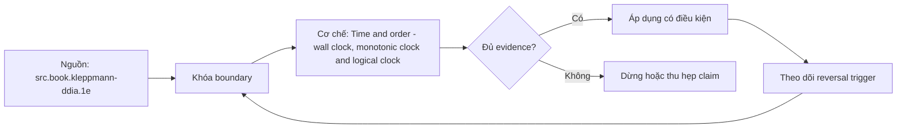

# Time and order - wall clock, monotonic clock and logical clocks

> [!abstract] Câu hỏi trung tâm
> Wall clock, monotonic clock và logical clocks hỗ trợ những assertions khác nhau nào?

## 1. Wall clock

Calendar timestamp phục vụ human/business time nhưng có sync error, step/slew, timezone và leap behavior; không là duration source mặc định. Đừng bắt đầu bằng tên công cụ. Hãy bắt đầu bằng đối tượng được bảo vệ, boundary quan sát được và hậu quả nếu kết luận sai. Trong bài `Time and order - wall clock, monotonic clock and logical clocks`, câu hỏi thực dụng là: Wall clock, monotonic clock và logical clocks hỗ trợ những assertions khác nhau nào? Ta ghi rõ grain, population, time window, owner và hành động sau failure; nếu một trường chưa biết thì đánh dấu unknown thay vì lấp bằng mặc định. Bằng chứng tối thiểu gồm fixture có version, cấu hình hoặc rule đã resolve, raw observation, expected result và limitation. Phần này là curriculum synthesis dựa trên các nguồn đã định danh, không phải lời hứa rằng mọi adapter hay deployment đều có cùng hành vi.

## 2. Monotonic clock

Elapsed-time measurement cần clock không đi lùi trong một process/boot; không so trực tiếp values giữa machines. Điểm khó không nằm ở cú pháp mà ở identity và scope. Hai phép đo cùng tên vẫn có thể nói về hai population hoặc hai thời điểm khác nhau. Trong bài `Time and order - wall clock, monotonic clock and logical clocks`, câu hỏi thực dụng là: Wall clock, monotonic clock và logical clocks hỗ trợ những assertions khác nhau nào? Ta ghi rõ grain, population, time window, owner và hành động sau failure; nếu một trường chưa biết thì đánh dấu unknown thay vì lấp bằng mặc định. Bằng chứng tối thiểu gồm fixture có version, cấu hình hoặc rule đã resolve, raw observation, expected result và limitation. Phần này là curriculum synthesis dựa trên các nguồn đã định danh, không phải lời hứa rằng mọi adapter hay deployment đều có cùng hành vi.

## 3. Happens-before

Program order và message send-before-receive tạo partial order; concurrent events không buộc có real causal order. Một dashboard xanh chỉ là tín hiệu. Muốn biến nó thành bằng chứng phải giữ input, phiên bản, rule, trạng thái trước-sau và cách tính độc lập. Trong bài `Time and order - wall clock, monotonic clock and logical clocks`, câu hỏi thực dụng là: Wall clock, monotonic clock và logical clocks hỗ trợ những assertions khác nhau nào? Ta ghi rõ grain, population, time window, owner và hành động sau failure; nếu một trường chưa biết thì đánh dấu unknown thay vì lấp bằng mặc định. Bằng chứng tối thiểu gồm fixture có version, cấu hình hoặc rule đã resolve, raw observation, expected result và limitation. Phần này là curriculum synthesis dựa trên các nguồn đã định danh, không phải lời hứa rằng mọi adapter hay deployment đều có cùng hành vi.

## 4. Lamport clock

Scalar logical time giữ happens-before implies smaller timestamp nhưng converse không đúng và tie-break không tạo causality. Thiết kế tốt phải chịu được counterexample. Hãy chủ động tạo case sát boundary, case thiếu dữ liệu và case replay thay vì chỉ chạy happy path. Trong bài `Time and order - wall clock, monotonic clock and logical clocks`, câu hỏi thực dụng là: Wall clock, monotonic clock và logical clocks hỗ trợ những assertions khác nhau nào? Ta ghi rõ grain, population, time window, owner và hành động sau failure; nếu một trường chưa biết thì đánh dấu unknown thay vì lấp bằng mặc định. Bằng chứng tối thiểu gồm fixture có version, cấu hình hoặc rule đã resolve, raw observation, expected result và limitation. Phần này là curriculum synthesis dựa trên các nguồn đã định danh, không phải lời hứa rằng mọi adapter hay deployment đều có cùng hành vi.

## 5. Vector clocks

Version vectors phát hiện concurrency tốt hơn nhưng metadata grows và membership/compaction cần policy. Chi phí vận hành thuộc contract. Một rule đúng nhưng quá đắt, quá ồn hoặc không có owner sẽ nhanh chóng bị tắt và mất tác dụng. Trong bài `Time and order - wall clock, monotonic clock and logical clocks`, câu hỏi thực dụng là: Wall clock, monotonic clock và logical clocks hỗ trợ những assertions khác nhau nào? Ta ghi rõ grain, population, time window, owner và hành động sau failure; nếu một trường chưa biết thì đánh dấu unknown thay vì lấp bằng mặc định. Bằng chứng tối thiểu gồm fixture có version, cấu hình hoặc rule đã resolve, raw observation, expected result và limitation. Phần này là curriculum synthesis dựa trên các nguồn đã định danh, không phải lời hứa rằng mọi adapter hay deployment đều có cùng hành vi.

## 6. Test traces

Skew wall clocks, delay messages và restart nodes; assert only guarantees mà selected clock/model thực sự cung cấp. Kết luận cần có điều kiện đảo chiều. Khi volume, latency, nguồn thẩm quyền hoặc topology đổi, quyết định cũ phải được xem xét lại bằng cùng một oracle. Trong bài `Time and order - wall clock, monotonic clock and logical clocks`, câu hỏi thực dụng là: Wall clock, monotonic clock và logical clocks hỗ trợ những assertions khác nhau nào? Ta ghi rõ grain, population, time window, owner và hành động sau failure; nếu một trường chưa biết thì đánh dấu unknown thay vì lấp bằng mặc định. Bằng chứng tối thiểu gồm fixture có version, cấu hình hoặc rule đã resolve, raw observation, expected result và limitation. Phần này là curriculum synthesis dựa trên các nguồn đã định danh, không phải lời hứa rằng mọi adapter hay deployment đều có cùng hành vi.

## 7. Ma trận kiểm chứng từng mệnh đề

Với `wiki.distributed.time-order-clocks`, command thành công không tự chứng minh dữ liệu đúng. Protocol riêng của bài là: Sinh bounded histories có invocation/response, network schedule và node state; kiểm invariant bằng model/oracle tách khỏi implementation. Mỗi probe dưới đây phải nối input boundary với failure signal và oracle có thể phản bác kết luận.

### 7.1. Time and order - wall clock, monotonic clock and logical clocks: kiểm `Wall clock` bằng case 1, cụ thể calendar timestamp phục vụ human/business time nhưng có sync error, step/slew, timezone và leap behavior; không là duration source mặc định

**Mệnh đề cần kiểm.** Time and order - wall clock, monotonic clock and logical clocks: kiểm `Wall clock` bằng case 1, cụ thể calendar timestamp phục vụ human/business time nhưng có sync error, step/slew, timezone và leap behavior; không là duration source mặc định.

**Thiết kế phép thử cho `wiki.distributed.time-order-clocks`.** Trong ngữ cảnh `wiki.distributed.time-order-clocks`, tạo positive control và negative control chỉ khác đúng một điều kiện. Khóa input snapshot, phiên bản và owner của rule; chạy đúng population được bài `Time and order - wall clock, monotonic clock and logical clocks` công bố.

**Bằng chứng cần giữ.** Đối với probe 1 của `Time and order - wall clock, monotonic clock and logical clocks`, giữ fixture, raw failing rows và lệnh tái hiện. Nếu chưa chạy lab, ghi expected evidence và giữ trạng thái review; không biến protocol thành observation.

### 7.2. Time and order - wall clock, monotonic clock and logical clocks: kiểm `Monotonic clock` bằng case 2, cụ thể elapsed-time measurement cần clock không đi lùi trong một process/boot; không so trực tiếp values giữa machines

**Mệnh đề cần kiểm.** Time and order - wall clock, monotonic clock and logical clocks: kiểm `Monotonic clock` bằng case 2, cụ thể elapsed-time measurement cần clock không đi lùi trong một process/boot; không so trực tiếp values giữa machines.

**Thiết kế phép thử cho `wiki.distributed.time-order-clocks`.** Trong ngữ cảnh `wiki.distributed.time-order-clocks`, đổi grain nhưng giữ tổng số dòng để lộ phép đo sai cấp. Khóa input snapshot, phiên bản và owner của rule; chạy đúng population được bài `Time and order - wall clock, monotonic clock and logical clocks` công bố.

**Bằng chứng cần giữ.** Đối với probe 2 của `Time and order - wall clock, monotonic clock and logical clocks`, báo numerator, denominator và key set ở cả hai grain. Nếu chưa chạy lab, ghi expected evidence và giữ trạng thái review; không biến protocol thành observation.

### 7.3. Time and order - wall clock, monotonic clock and logical clocks: kiểm `Happens-before` bằng case 3, cụ thể program order và message send-before-receive tạo partial order; concurrent events không buộc có real causal order

**Mệnh đề cần kiểm.** Time and order - wall clock, monotonic clock and logical clocks: kiểm `Happens-before` bằng case 3, cụ thể program order và message send-before-receive tạo partial order; concurrent events không buộc có real causal order.

**Thiết kế phép thử cho `wiki.distributed.time-order-clocks`.** Trong ngữ cảnh `wiki.distributed.time-order-clocks`, đưa một giá trị tới đúng boundary và một giá trị vượt boundary. Khóa input snapshot, phiên bản và owner của rule; chạy đúng population được bài `Time and order - wall clock, monotonic clock and logical clocks` công bố.

**Bằng chứng cần giữ.** Đối với probe 3 của `Time and order - wall clock, monotonic clock and logical clocks`, lưu hai observed values cùng rule đã resolve. Nếu chưa chạy lab, ghi expected evidence và giữ trạng thái review; không biến protocol thành observation.

### 7.4. Time and order - wall clock, monotonic clock and logical clocks: kiểm `Lamport clock` bằng case 4, cụ thể scalar logical time giữ happens-before implies smaller timestamp nhưng converse không đúng và tie-break không tạo causality

**Mệnh đề cần kiểm.** Time and order - wall clock, monotonic clock and logical clocks: kiểm `Lamport clock` bằng case 4, cụ thể scalar logical time giữ happens-before implies smaller timestamp nhưng converse không đúng và tie-break không tạo causality.

**Thiết kế phép thử cho `wiki.distributed.time-order-clocks`.** Trong ngữ cảnh `wiki.distributed.time-order-clocks`, kill tiến trình ngay trước rồi ngay sau durable side effect. Khóa input snapshot, phiên bản và owner của rule; chạy đúng population được bài `Time and order - wall clock, monotonic clock and logical clocks` công bố.

**Bằng chứng cần giữ.** Đối với probe 4 của `Time and order - wall clock, monotonic clock and logical clocks`, lưu checkpoint, external ledger và trạng thái sau restart. Nếu chưa chạy lab, ghi expected evidence và giữ trạng thái review; không biến protocol thành observation.

### 7.5. Time and order - wall clock, monotonic clock and logical clocks: kiểm `Vector clocks` bằng case 5, cụ thể version vectors phát hiện concurrency tốt hơn nhưng metadata grows và membership/compaction cần policy

**Mệnh đề cần kiểm.** Time and order - wall clock, monotonic clock and logical clocks: kiểm `Vector clocks` bằng case 5, cụ thể version vectors phát hiện concurrency tốt hơn nhưng metadata grows và membership/compaction cần policy.

**Thiết kế phép thử cho `wiki.distributed.time-order-clocks`.** Trong ngữ cảnh `wiki.distributed.time-order-clocks`, đảo thứ tự input và concurrency nhưng giữ logical population. Khóa input snapshot, phiên bản và owner của rule; chạy đúng population được bài `Time and order - wall clock, monotonic clock and logical clocks` công bố.

**Bằng chứng cần giữ.** Đối với probe 5 của `Time and order - wall clock, monotonic clock and logical clocks`, so canonical hash và business totals giữa các thứ tự. Nếu chưa chạy lab, ghi expected evidence và giữ trạng thái review; không biến protocol thành observation.

### 7.6. Time and order - wall clock, monotonic clock and logical clocks: kiểm `Test traces` bằng case 6, cụ thể skew wall clocks, delay messages và restart nodes; assert only guarantees mà selected clock/model thực sự cung cấp

**Mệnh đề cần kiểm.** Time and order - wall clock, monotonic clock and logical clocks: kiểm `Test traces` bằng case 6, cụ thể skew wall clocks, delay messages và restart nodes; assert only guarantees mà selected clock/model thực sự cung cấp.

**Thiết kế phép thử cho `wiki.distributed.time-order-clocks`.** Trong ngữ cảnh `wiki.distributed.time-order-clocks`, replay cùng identity với payload giống rồi payload xung đột. Khóa input snapshot, phiên bản và owner của rule; chạy đúng population được bài `Time and order - wall clock, monotonic clock and logical clocks` công bố.

**Bằng chứng cần giữ.** Đối với probe 6 của `Time and order - wall clock, monotonic clock and logical clocks`, tách duplicate replay khỏi identity collision bằng reason code. Nếu chưa chạy lab, ghi expected evidence và giữ trạng thái review; không biến protocol thành observation.

### 7.7. Time and order - wall clock, monotonic clock and logical clocks: kiểm `Wall clock` bằng case 7, cụ thể calendar timestamp phục vụ human/business time nhưng có sync error, step/slew, timezone và leap behavior; không là duration source mặc định

**Mệnh đề cần kiểm.** Time and order - wall clock, monotonic clock and logical clocks: kiểm `Wall clock` bằng case 7, cụ thể calendar timestamp phục vụ human/business time nhưng có sync error, step/slew, timezone và leap behavior; không là duration source mặc định.

**Thiết kế phép thử cho `wiki.distributed.time-order-clocks`.** Trong ngữ cảnh `wiki.distributed.time-order-clocks`, thêm record tới trễ trong horizon và ngoài horizon. Khóa input snapshot, phiên bản và owner của rule; chạy đúng population được bài `Time and order - wall clock, monotonic clock and logical clocks` công bố.

**Bằng chứng cần giữ.** Đối với probe 7 của `Time and order - wall clock, monotonic clock and logical clocks`, báo accepted-late, rejected-late và oldest outstanding timestamp. Nếu chưa chạy lab, ghi expected evidence và giữ trạng thái review; không biến protocol thành observation.

### 7.8. Time and order - wall clock, monotonic clock and logical clocks: kiểm `Monotonic clock` bằng case 8, cụ thể elapsed-time measurement cần clock không đi lùi trong một process/boot; không so trực tiếp values giữa machines

**Mệnh đề cần kiểm.** Time and order - wall clock, monotonic clock and logical clocks: kiểm `Monotonic clock` bằng case 8, cụ thể elapsed-time measurement cần clock không đi lùi trong một process/boot; không so trực tiếp values giữa machines.

**Thiết kế phép thử cho `wiki.distributed.time-order-clocks`.** Trong ngữ cảnh `wiki.distributed.time-order-clocks`, đổi schema theo một cách tương thích rồi một cách phá vỡ semantics. Khóa input snapshot, phiên bản và owner của rule; chạy đúng population được bài `Time and order - wall clock, monotonic clock and logical clocks` công bố.

**Bằng chứng cần giữ.** Đối với probe 8 của `Time and order - wall clock, monotonic clock and logical clocks`, giữ schema diff, classification và consumer-visible result. Nếu chưa chạy lab, ghi expected evidence và giữ trạng thái review; không biến protocol thành observation.

### 7.9. Time and order - wall clock, monotonic clock and logical clocks: kiểm `Happens-before` bằng case 9, cụ thể program order và message send-before-receive tạo partial order; concurrent events không buộc có real causal order

**Mệnh đề cần kiểm.** Time and order - wall clock, monotonic clock and logical clocks: kiểm `Happens-before` bằng case 9, cụ thể program order và message send-before-receive tạo partial order; concurrent events không buộc có real causal order.

**Thiết kế phép thử cho `wiki.distributed.time-order-clocks`.** Trong ngữ cảnh `wiki.distributed.time-order-clocks`, tạo missing và duplicate bù nhau để count tổng không đổi. Khóa input snapshot, phiên bản và owner của rule; chạy đúng population được bài `Time and order - wall clock, monotonic clock and logical clocks` công bố.

**Bằng chứng cần giữ.** Đối với probe 9 của `Time and order - wall clock, monotonic clock and logical clocks`, so key multiset và typed hashes thay vì chỉ row count. Nếu chưa chạy lab, ghi expected evidence và giữ trạng thái review; không biến protocol thành observation.

### 7.10. Time and order - wall clock, monotonic clock and logical clocks: kiểm `Lamport clock` bằng case 10, cụ thể scalar logical time giữ happens-before implies smaller timestamp nhưng converse không đúng và tie-break không tạo causality

**Mệnh đề cần kiểm.** Time and order - wall clock, monotonic clock and logical clocks: kiểm `Lamport clock` bằng case 10, cụ thể scalar logical time giữ happens-before implies smaller timestamp nhưng converse không đúng và tie-break không tạo causality.

**Thiết kế phép thử cho `wiki.distributed.time-order-clocks`.** Trong ngữ cảnh `wiki.distributed.time-order-clocks`, cho reviewer tái hiện chỉ từ evidence package. Khóa input snapshot, phiên bản và owner của rule; chạy đúng population được bài `Time and order - wall clock, monotonic clock and logical clocks` công bố.

**Bằng chứng cần giữ.** Đối với probe 10 của `Time and order - wall clock, monotonic clock and logical clocks`, package phải đủ để người khác dựng lại decision và limitation. Nếu chưa chạy lab, ghi expected evidence và giữ trạng thái review; không biến protocol thành observation.

### 7.11. Time and order - wall clock, monotonic clock and logical clocks: kiểm `Vector clocks` bằng case 11, cụ thể version vectors phát hiện concurrency tốt hơn nhưng metadata grows và membership/compaction cần policy

**Mệnh đề cần kiểm.** Time and order - wall clock, monotonic clock and logical clocks: kiểm `Vector clocks` bằng case 11, cụ thể version vectors phát hiện concurrency tốt hơn nhưng metadata grows và membership/compaction cần policy.

**Thiết kế phép thử cho `wiki.distributed.time-order-clocks`.** Trong ngữ cảnh `wiki.distributed.time-order-clocks`, so với oracle độc lập không dùng chung query hoặc parser. Khóa input snapshot, phiên bản và owner của rule; chạy đúng population được bài `Time and order - wall clock, monotonic clock and logical clocks` công bố.

**Bằng chứng cần giữ.** Đối với probe 11 của `Time and order - wall clock, monotonic clock and logical clocks`, independent result phải khớp ở grain đã công bố. Nếu chưa chạy lab, ghi expected evidence và giữ trạng thái review; không biến protocol thành observation.

### 7.12. Time and order - wall clock, monotonic clock and logical clocks: kiểm `Test traces` bằng case 12, cụ thể skew wall clocks, delay messages và restart nodes; assert only guarantees mà selected clock/model thực sự cung cấp

**Mệnh đề cần kiểm.** Time and order - wall clock, monotonic clock and logical clocks: kiểm `Test traces` bằng case 12, cụ thể skew wall clocks, delay messages và restart nodes; assert only guarantees mà selected clock/model thực sự cung cấp.

**Thiết kế phép thử cho `wiki.distributed.time-order-clocks`.** Trong ngữ cảnh `wiki.distributed.time-order-clocks`, chạy scope hẹp và population đầy đủ rồi công bố phần bị loại. Khóa input snapshot, phiên bản và owner của rule; chạy đúng population được bài `Time and order - wall clock, monotonic clock and logical clocks` công bố.

**Bằng chứng cần giữ.** Đối với probe 12 của `Time and order - wall clock, monotonic clock and logical clocks`, coverage phải nêu rõ excluded nodes, partitions hoặc incidents. Nếu chưa chạy lab, ghi expected evidence và giữ trạng thái review; không biến protocol thành observation.

### 7.13. Time and order - wall clock, monotonic clock and logical clocks: kiểm `Wall clock` bằng case 13, cụ thể calendar timestamp phục vụ human/business time nhưng có sync error, step/slew, timezone và leap behavior; không là duration source mặc định

**Mệnh đề cần kiểm.** Time and order - wall clock, monotonic clock and logical clocks: kiểm `Wall clock` bằng case 13, cụ thể calendar timestamp phục vụ human/business time nhưng có sync error, step/slew, timezone và leap behavior; không là duration source mặc định.

**Thiết kế phép thử cho `wiki.distributed.time-order-clocks`.** Trong ngữ cảnh `wiki.distributed.time-order-clocks`, thử timezone, precision hoặc partition ở hai phía của ranh giới. Khóa input snapshot, phiên bản và owner của rule; chạy đúng population được bài `Time and order - wall clock, monotonic clock and logical clocks` công bố.

**Bằng chứng cần giữ.** Đối với probe 13 của `Time and order - wall clock, monotonic clock and logical clocks`, UTC/local interval và rounding policy phải hiện trong output. Nếu chưa chạy lab, ghi expected evidence và giữ trạng thái review; không biến protocol thành observation.

### 7.14. Time and order - wall clock, monotonic clock and logical clocks: kiểm `Monotonic clock` bằng case 14, cụ thể elapsed-time measurement cần clock không đi lùi trong một process/boot; không so trực tiếp values giữa machines

**Mệnh đề cần kiểm.** Time and order - wall clock, monotonic clock and logical clocks: kiểm `Monotonic clock` bằng case 14, cụ thể elapsed-time measurement cần clock không đi lùi trong một process/boot; không so trực tiếp values giữa machines.

**Thiết kế phép thử cho `wiki.distributed.time-order-clocks`.** Trong ngữ cảnh `wiki.distributed.time-order-clocks`, đổi constraint đủ lớn để quyết định phải đảo. Khóa input snapshot, phiên bản và owner của rule; chạy đúng population được bài `Time and order - wall clock, monotonic clock and logical clocks` công bố.

**Bằng chứng cần giữ.** Đối với probe 14 của `Time and order - wall clock, monotonic clock and logical clocks`, ADR phải lưu changed constraint và reversal threshold. Nếu chưa chạy lab, ghi expected evidence và giữ trạng thái review; không biến protocol thành observation.

### 7.15. Time and order - wall clock, monotonic clock and logical clocks: kiểm `Happens-before` bằng case 15, cụ thể program order và message send-before-receive tạo partial order; concurrent events không buộc có real causal order

**Mệnh đề cần kiểm.** Time and order - wall clock, monotonic clock and logical clocks: kiểm `Happens-before` bằng case 15, cụ thể program order và message send-before-receive tạo partial order; concurrent events không buộc có real causal order.

**Thiết kế phép thử cho `wiki.distributed.time-order-clocks`.** Trong ngữ cảnh `wiki.distributed.time-order-clocks`, chạy lại từ môi trường sạch với versions và seed đã khóa. Khóa input snapshot, phiên bản và owner của rule; chạy đúng population được bài `Time and order - wall clock, monotonic clock and logical clocks` công bố.

**Bằng chứng cần giữ.** Đối với probe 15 của `Time and order - wall clock, monotonic clock and logical clocks`, canonical result phải ổn định hoặc mọi nondeterminism phải được giải thích. Nếu chưa chạy lab, ghi expected evidence và giữ trạng thái review; không biến protocol thành observation.

## 8. Quy trình phản biện

1. Viết consumer-visible invariant cho `Time and order - wall clock, monotonic clock and logical clocks` trước khi chọn query hoặc tool.
2. Khóa grain, identity, population, time window và authoritative source.
3. Phân biệt declared configuration, executed state và published state.
4. Chạy negative control, replay hoặc changed-assumption case phù hợp.
5. Đối soát bằng oracle độc lập; công bố coverage và phần không quan sát được.
6. Gắn owner, hành động, reversal trigger và hạn review cho kết luận.

## 9. Câu hỏi tự kiểm tra

1. `Time and order - wall clock, monotonic clock and logical clocks: kiểm `Wall clock` bằng case 1, cụ thể calendar timestamp phục vụ human/business time nhưng có sync error, step/slew, timezone và leap behavior; không là duration source mặc định` thất bại đầu tiên ở boundary nào?
2. Artifact nào mạnh nhất để trả lời `Time and order - wall clock, monotonic clock and logical clocks: kiểm `Happens-before` bằng case 3, cụ thể program order và message send-before-receive tạo partial order; concurrent events không buộc có real causal order`?
3. Counterexample nhỏ nhất cho `Time and order - wall clock, monotonic clock and logical clocks: kiểm `Test traces` bằng case 6, cụ thể skew wall clocks, delay messages và restart nodes; assert only guarantees mà selected clock/model thực sự cung cấp` gồm những state nào?
4. `Time and order - wall clock, monotonic clock and logical clocks: kiểm `Happens-before` bằng case 9, cụ thể program order và message send-before-receive tạo partial order; concurrent events không buộc có real causal order` có thể xanh giả ra sao?
5. Constraint nào khiến quyết định ở `Time and order - wall clock, monotonic clock and logical clocks: kiểm `Monotonic clock` bằng case 14, cụ thể elapsed-time measurement cần clock không đi lùi trong một process/boot; không so trực tiếp values giữa machines` phải đảo?
6. Phần nào của `Time and order - wall clock, monotonic clock and logical clocks: kiểm `Happens-before` bằng case 15, cụ thể program order và message send-before-receive tạo partial order; concurrent events không buộc có real causal order` mới là protocol, chưa phải observation?

## 10. Giới hạn và điều chưa cho phép kết luận

- Lab của `Time and order - wall clock, monotonic clock and logical clocks` chưa chạy trên hệ thống production; nội dung là giáo trình và expected evidence.
- Hành vi phụ thuộc phiên bản, connector, scheduler, warehouse và catalog configuration phải được kiểm lại.
- Các ma trận, ladder và threshold do giáo trình tổng hợp không được gán nguyên văn cho vendor.
- Note giữ trạng thái `review` cho tới khi owner duyệt semantics và learner artifact.

## Reference
1. [[SRC-KLEPPMANN-DDIA-1E]]

## Source coverage

| Source slice | Nội dung sử dụng | Trạng thái |
|---|---|---|
| [[SRC-KLEPPMANN-DDIA-1E]] | Contract hoặc cơ chế liên quan trực tiếp tới `Time and order - wall clock, monotonic clock and logical clocks` | Đã đọc locator; cần pin version khi chạy lab |

## Key takeaways
- Clock choice giới hạn assertion: calendar, duration và causality không thay nhau.
- Với `wiki.distributed.time-order-clocks`, quality của kết luận phụ thuộc identity, coverage và oracle chứ không phụ thuộc màu dashboard.
- Câu hỏi `Wall clock, monotonic clock và logical clocks hỗ trợ những assertions khác nhau nào?` chỉ được trả lời trong scope và version đã ghi.
- Các source IDs `src.book.kleppmann-ddia.1e` đặt ranh giới cho source fact; phần còn lại là synthesis có nhãn.
- Trước khi lab chạy, đây là note đã kiểm cấu trúc và provenance, chưa phải chứng nhận production.

<!-- ATOMIC-EXECUTION-CAPSULE:START -->

## Execution capsule: kiểm chứng `wiki.distributed.time-order-clocks`

> [!important] Phân loại mệnh đề
> Với `wiki.distributed.time-order-clocks`, sơ đồ, ví dụ và artifact về **Time and order - wall clock, monotonic clock and logical clocks** là **synthesis để kiểm chứng**; chúng không phải trích dẫn hay case nguyên văn của nguồn.

### Sơ đồ cơ chế và điểm kiểm soát



Đọc sơ đồ `wiki.distributed.time-order-clocks` từ trái sang phải: source chỉ cung cấp claim ban đầu cho **Time and order - wall clock, monotonic clock and logical clocks**; quyết định chỉ được đi tiếp sau khi boundary, evidence và điều kiện đảo quyết định đã hiện hữu.

### Artifact thực thi tối thiểu

```sql
-- Verification harness for: Time and order - wall clock, monotonic clock and logical clocks
WITH evidence AS (
    SELECT 'wiki.distributed.time-order-clocks' AS concept_id,
           'boundary_declared' AS check_name, 1 AS passed
    UNION ALL
    SELECT 'wiki.distributed.time-order-clocks', 'independent_oracle', 1
    UNION ALL
    SELECT 'wiki.distributed.time-order-clocks', 'reversal_trigger_recorded', 1
)
SELECT concept_id,
       MIN(passed) AS all_hard_checks_pass,
       COUNT(*) AS evidence_items
FROM evidence
GROUP BY concept_id
HAVING MIN(passed) = 1;
```

Artifact của `wiki.distributed.time-order-clocks` buộc người dùng ghi boundary, oracle và reversal trigger cho **Time and order - wall clock, monotonic clock and logical clocks**. Các giá trị minh họa phải được thay bằng evidence thật trước khi dùng cho quyết định.

### Tự kiểm tra trước khi tái sử dụng

1. Bạn có thể trả lời `Wall clock, monotonic clock và logical clocks hỗ trợ những assertions khác nhau nào?` bằng một câu mà không kéo thêm concept thứ hai không?
2. Source locator nào đỡ cho claim, và phần nào chỉ là synthesis trong note?
3. Observation nào khiến bạn dừng, thu hẹp hoặc đảo quyết định?
4. Artifact nào cho phép một reviewer độc lập tái hiện kết quả?

<!-- ATOMIC-EXECUTION-CAPSULE:END -->
