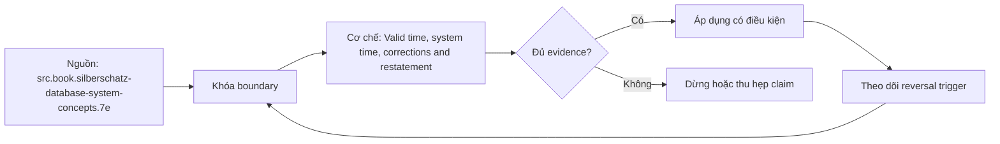

# Valid time, system time, corrections and restatement

> [!abstract] Câu hỏi trung tâm
> Valid time và system time trả lời hai câu hỏi nào, và correction/restatement phải được quản trị ra sao để không viết lại lịch sử đã công bố một cách vô hình?

## 1. Hai trục, hai câu hỏi

Valid/effective time nói fact đúng trong thế giới nghiệp vụ khi nào. System/transaction time nói database biết hoặc lưu phiên bản khi nào. Bitemporal data kết hợp hai trục để trả lời both what was true then và what did we believe/report then. Tên `ValidFrom` do engine sinh trong SQL Server temporal table thực ra biểu diễn system period; tên cột không thay semantics.

## 2. Khoảng thời gian và bất biến

Dùng half-open interval [start,end) để hai version kề nhau không overlap. Cùng business key không được có hai valid intervals chồng nếu domain yêu cầu single state. Primary key thêm start/end vẫn không bắt overlap; cần exclusion/temporal constraint hoặc validation. Temporal join lấy phần giao interval và loại cặp không giao.

## 3. Biết muộn và sửa sai

Late-known fact có valid time cũ nhưng system time mới: hệ thống vừa mới biết một điều đã đúng trước đó. Correction thay mệnh đề do prior record sai; business change tạo state mới. Cả hai có thể cùng valid interval pattern nhưng khác reason, approval và cách đối xử số đã công bố.

## 4. Restatement policy

Restatement là quyết định governance: số lịch sử được tái tính, đóng băng hay công bố song song original/revised. Policy phải chỉ ra materiality, accounting/report period, consumer notification, owner phê duyệt, version label và reconciliation. UPDATE đúng kỹ thuật không đủ thẩm quyền đổi dashboard hoặc regulatory report đã phát hành.

## 5. Truy vấn và provenance

As-of-valid truy state nghiệp vụ tại thời điểm V theo knowledge hiện nay; as-of-system truy database view tại thời điểm S. Bitemporal query cố định cả V và S. Mỗi correction cần reason code, source record, load/batch ID, approver và links tới output versions bị ảnh hưởng. Retention của history table có thể giới hạn khả năng trả lời.

## 6. Ma trận kiểm chứng từng mệnh đề

Mỗi mệnh đề phải chuyển thành fixture, invariant và phép đối chiếu tái chạy được. Tên pattern, sơ đồ hoặc một query chạy không lỗi không tự chứng minh đúng grain và semantics.

### 6.1. valid time mô tả khi fact đúng trong domain

**Mệnh đề cần kiểm.** valid time mô tả khi fact đúng trong domain. **Thiết kế phép kiểm.** Dựng bitemporal fixture có một fact được biết muộn và một correction. Viết bốn query cố định valid/system cutoffs; kiểm interval overlap, temporal join và diff original/revised report cùng provenance. **Bằng chứng đạt cho `wiki.data-modeling.bitemporal-corrections`.** Lưu model/metric contract, seed data, SQL/notebook, raw output, row counts, distinct keys, unmatched rate và control totals. Nếu kết quả phụ thuộc engine, cutoff hoặc business policy, phải ghi điều kiện đó cùng phản ví dụ.

### 6.2. system time mô tả khi database ghi nhận

**Mệnh đề cần kiểm.** system time mô tả khi database ghi nhận. **Thiết kế phép kiểm.** Dựng bitemporal fixture có một fact được biết muộn và một correction. Viết bốn query cố định valid/system cutoffs; kiểm interval overlap, temporal join và diff original/revised report cùng provenance. **Bằng chứng đạt cho `wiki.data-modeling.bitemporal-corrections`.** Lưu model/metric contract, seed data, SQL/notebook, raw output, row counts, distinct keys, unmatched rate và control totals. Nếu kết quả phụ thuộc engine, cutoff hoặc business policy, phải ghi điều kiện đó cùng phản ví dụ.

### 6.3. late-known fact có valid time cũ và system time mới

**Mệnh đề cần kiểm.** late-known fact có valid time cũ và system time mới. **Thiết kế phép kiểm.** Dựng bitemporal fixture có một fact được biết muộn và một correction. Viết bốn query cố định valid/system cutoffs; kiểm interval overlap, temporal join và diff original/revised report cùng provenance. **Bằng chứng đạt cho `wiki.data-modeling.bitemporal-corrections`.** Lưu model/metric contract, seed data, SQL/notebook, raw output, row counts, distinct keys, unmatched rate và control totals. Nếu kết quả phụ thuộc engine, cutoff hoặc business policy, phải ghi điều kiện đó cùng phản ví dụ.

### 6.4. correction khác business change

**Mệnh đề cần kiểm.** correction khác business change. **Thiết kế phép kiểm.** Dựng bitemporal fixture có một fact được biết muộn và một correction. Viết bốn query cố định valid/system cutoffs; kiểm interval overlap, temporal join và diff original/revised report cùng provenance. **Bằng chứng đạt cho `wiki.data-modeling.bitemporal-corrections`.** Lưu model/metric contract, seed data, SQL/notebook, raw output, row counts, distinct keys, unmatched rate và control totals. Nếu kết quả phụ thuộc engine, cutoff hoặc business policy, phải ghi điều kiện đó cùng phản ví dụ.

### 6.5. half-open interval cho phép hai version kề nhau

**Mệnh đề cần kiểm.** half-open interval cho phép hai version kề nhau. **Thiết kế phép kiểm.** Dựng bitemporal fixture có một fact được biết muộn và một correction. Viết bốn query cố định valid/system cutoffs; kiểm interval overlap, temporal join và diff original/revised report cùng provenance. **Bằng chứng đạt cho `wiki.data-modeling.bitemporal-corrections`.** Lưu model/metric contract, seed data, SQL/notebook, raw output, row counts, distinct keys, unmatched rate và control totals. Nếu kết quả phụ thuộc engine, cutoff hoặc business policy, phải ghi điều kiện đó cùng phản ví dụ.

### 6.6. primary key gồm endpoints không tự chặn overlap

**Mệnh đề cần kiểm.** primary key gồm endpoints không tự chặn overlap. **Thiết kế phép kiểm.** Dựng bitemporal fixture có một fact được biết muộn và một correction. Viết bốn query cố định valid/system cutoffs; kiểm interval overlap, temporal join và diff original/revised report cùng provenance. **Bằng chứng đạt cho `wiki.data-modeling.bitemporal-corrections`.** Lưu model/metric contract, seed data, SQL/notebook, raw output, row counts, distinct keys, unmatched rate và control totals. Nếu kết quả phụ thuộc engine, cutoff hoặc business policy, phải ghi điều kiện đó cùng phản ví dụ.

### 6.7. temporal join dùng intersection

**Mệnh đề cần kiểm.** temporal join dùng intersection. **Thiết kế phép kiểm.** Dựng bitemporal fixture có một fact được biết muộn và một correction. Viết bốn query cố định valid/system cutoffs; kiểm interval overlap, temporal join và diff original/revised report cùng provenance. **Bằng chứng đạt cho `wiki.data-modeling.bitemporal-corrections`.** Lưu model/metric contract, seed data, SQL/notebook, raw output, row counts, distinct keys, unmatched rate và control totals. Nếu kết quả phụ thuộc engine, cutoff hoặc business policy, phải ghi điều kiện đó cùng phản ví dụ.

### 6.8. SQL Server system-versioned period không tự là business-valid time

**Mệnh đề cần kiểm.** SQL Server system-versioned period không tự là business-valid time. **Thiết kế phép kiểm.** Dựng bitemporal fixture có một fact được biết muộn và một correction. Viết bốn query cố định valid/system cutoffs; kiểm interval overlap, temporal join và diff original/revised report cùng provenance. **Bằng chứng đạt cho `wiki.data-modeling.bitemporal-corrections`.** Lưu model/metric contract, seed data, SQL/notebook, raw output, row counts, distinct keys, unmatched rate và control totals. Nếu kết quả phụ thuộc engine, cutoff hoặc business policy, phải ghi điều kiện đó cùng phản ví dụ.

### 6.9. as-of-valid khác as-of-system

**Mệnh đề cần kiểm.** as-of-valid khác as-of-system. **Thiết kế phép kiểm.** Dựng bitemporal fixture có một fact được biết muộn và một correction. Viết bốn query cố định valid/system cutoffs; kiểm interval overlap, temporal join và diff original/revised report cùng provenance. **Bằng chứng đạt cho `wiki.data-modeling.bitemporal-corrections`.** Lưu model/metric contract, seed data, SQL/notebook, raw output, row counts, distinct keys, unmatched rate và control totals. Nếu kết quả phụ thuộc engine, cutoff hoặc business policy, phải ghi điều kiện đó cùng phản ví dụ.

### 6.10. bitemporal query cố định hai trục

**Mệnh đề cần kiểm.** bitemporal query cố định hai trục. **Thiết kế phép kiểm.** Dựng bitemporal fixture có một fact được biết muộn và một correction. Viết bốn query cố định valid/system cutoffs; kiểm interval overlap, temporal join và diff original/revised report cùng provenance. **Bằng chứng đạt cho `wiki.data-modeling.bitemporal-corrections`.** Lưu model/metric contract, seed data, SQL/notebook, raw output, row counts, distinct keys, unmatched rate và control totals. Nếu kết quả phụ thuộc engine, cutoff hoặc business policy, phải ghi điều kiện đó cùng phản ví dụ.

### 6.11. restatement cần decision owner

**Mệnh đề cần kiểm.** restatement cần decision owner. **Thiết kế phép kiểm.** Dựng bitemporal fixture có một fact được biết muộn và một correction. Viết bốn query cố định valid/system cutoffs; kiểm interval overlap, temporal join và diff original/revised report cùng provenance. **Bằng chứng đạt cho `wiki.data-modeling.bitemporal-corrections`.** Lưu model/metric contract, seed data, SQL/notebook, raw output, row counts, distinct keys, unmatched rate và control totals. Nếu kết quả phụ thuộc engine, cutoff hoặc business policy, phải ghi điều kiện đó cùng phản ví dụ.

### 6.12. original và revised outputs cần version

**Mệnh đề cần kiểm.** original và revised outputs cần version. **Thiết kế phép kiểm.** Dựng bitemporal fixture có một fact được biết muộn và một correction. Viết bốn query cố định valid/system cutoffs; kiểm interval overlap, temporal join và diff original/revised report cùng provenance. **Bằng chứng đạt cho `wiki.data-modeling.bitemporal-corrections`.** Lưu model/metric contract, seed data, SQL/notebook, raw output, row counts, distinct keys, unmatched rate và control totals. Nếu kết quả phụ thuộc engine, cutoff hoặc business policy, phải ghi điều kiện đó cùng phản ví dụ.

### 6.13. consumer notification là một phần policy

**Mệnh đề cần kiểm.** consumer notification là một phần policy. **Thiết kế phép kiểm.** Dựng bitemporal fixture có một fact được biết muộn và một correction. Viết bốn query cố định valid/system cutoffs; kiểm interval overlap, temporal join và diff original/revised report cùng provenance. **Bằng chứng đạt cho `wiki.data-modeling.bitemporal-corrections`.** Lưu model/metric contract, seed data, SQL/notebook, raw output, row counts, distinct keys, unmatched rate và control totals. Nếu kết quả phụ thuộc engine, cutoff hoặc business policy, phải ghi điều kiện đó cùng phản ví dụ.

### 6.14. history retention giới hạn answerability

**Mệnh đề cần kiểm.** history retention giới hạn answerability. **Thiết kế phép kiểm.** Dựng bitemporal fixture có một fact được biết muộn và một correction. Viết bốn query cố định valid/system cutoffs; kiểm interval overlap, temporal join và diff original/revised report cùng provenance. **Bằng chứng đạt cho `wiki.data-modeling.bitemporal-corrections`.** Lưu model/metric contract, seed data, SQL/notebook, raw output, row counts, distinct keys, unmatched rate và control totals. Nếu kết quả phụ thuộc engine, cutoff hoặc business policy, phải ghi điều kiện đó cùng phản ví dụ.

### 6.15. correction cần provenance và reason code

**Mệnh đề cần kiểm.** correction cần provenance và reason code. **Thiết kế phép kiểm.** Dựng bitemporal fixture có một fact được biết muộn và một correction. Viết bốn query cố định valid/system cutoffs; kiểm interval overlap, temporal join và diff original/revised report cùng provenance. **Bằng chứng đạt cho `wiki.data-modeling.bitemporal-corrections`.** Lưu model/metric contract, seed data, SQL/notebook, raw output, row counts, distinct keys, unmatched rate và control totals. Nếu kết quả phụ thuộc engine, cutoff hoặc business policy, phải ghi điều kiện đó cùng phản ví dụ.

## 7. Quy trình phản biện

1. Viết business question, grain, identity, time semantics và aggregation contract.
2. Tách source fact, quyết định thiết kế và synthesis của giáo trình.
3. Dựng ca biên nhỏ nhất có thể làm query đúng cú pháp nhưng sai số.
4. Kiểm key, interval, cardinality và control total trước-sau transform/join.
5. Chạy replay, late data hoặc schema change phù hợp với bài; lưu failed run.
6. Phân biệt correctness, usability, performance và governance; một trục đạt không che lấp trục khác.
7. Ghi owner, version, policy và điều kiện làm lựa chọn hiện tại không còn đúng.

## 8. Câu hỏi tự kiểm tra

1. Pattern trong bài giải failure mode nào và không giải failure mode nào?
2. Row đại diện điều gì, có hiệu lực khi nào và được nhận dạng bằng gì?
3. Ca biên nào làm SUM, current-state lookup hoặc history query sai âm thầm?
4. Constraint/test nào bắt lỗi cấu trúc; phần ngữ nghĩa nào cần owner xác nhận?
5. Late data, correction, replay hoặc model change ảnh hưởng output đã công bố ra sao?
6. Nguồn nào hỗ trợ trực tiếp và phần nào là synthesis của bài?

## 9. Giới hạn và điều chưa cho phép kết luận

- Chưa chạy modeling lab, benchmark, late-data replay hay reconciliation; phép kiểm là protocol, không phải kết quả đã đo.
- Type number sau SCD Type 3 không hoàn toàn thống nhất giữa mọi tài liệu; implementation phải mô tả behavior.
- BigQuery guidance là engine-specific; không suy OBT luôn nhanh hoặc rẻ hơn.
- SQL Server system-versioned temporal table quản system time; business-valid time là trục khác.
- Bài Data Vault chỉ xác nhận khả năng nhận diện và đánh giá bối cảnh, không xác nhận năng lực triển khai DV2.

## Reference
1. [[SRC-SILBERSCHATZ-DATABASE-SYSTEM-CONCEPTS-7E]]
2. [[SRC-MICROSOFT-SQL-SERVER-TEMPORAL-TABLES]]
3. [[SRC-KIMBALL-ROSS-DW-TOOLKIT-3E]]

## Source coverage

| Source slice | Nội dung sử dụng | Trạng thái |
|---|---|---|
| [[SRC-SILBERSCHATZ-DATABASE-SYSTEM-CONCEPTS-7E]] | Khái niệm, ranh giới và phản ví dụ liên quan đến bài | Đã đọc phạm vi có locator; không suy ngoài phạm vi |
| [[SRC-MICROSOFT-SQL-SERVER-TEMPORAL-TABLES]] | Khái niệm, ranh giới và phản ví dụ liên quan đến bài | Đã đọc phạm vi có locator; không suy ngoài phạm vi |
| [[SRC-KIMBALL-ROSS-DW-TOOLKIT-3E]] | Khái niệm, ranh giới và phản ví dụ liên quan đến bài | Đã đọc phạm vi có locator; không suy ngoài phạm vi |

## Key takeaways
- Chọn pattern theo failure mode, grain, time và workload; không chọn theo tên gọi.
- Key/interval/cardinality đúng về cấu trúc vẫn cần business semantics và owner.
- History và restatement là data contract có tác động tới người dùng, không chỉ là ETL technique.
- Layout physical phải được so trên cùng workload và semantic output.
- Chưa chạy lab thì note là tài liệu học thuật đã truy nguồn, không phải chứng nhận production.

<!-- ATOMIC-EXECUTION-CAPSULE:START -->

## Execution capsule: kiểm chứng `wiki.data-modeling.bitemporal-corrections`

> [!important] Phân loại mệnh đề
> Với `wiki.data-modeling.bitemporal-corrections`, sơ đồ, ví dụ và artifact về **Valid time, system time, corrections and restatement** là **synthesis để kiểm chứng**; chúng không phải trích dẫn hay case nguyên văn của nguồn.

### Sơ đồ cơ chế và điểm kiểm soát



Đọc sơ đồ `wiki.data-modeling.bitemporal-corrections` từ trái sang phải: source chỉ cung cấp claim ban đầu cho **Valid time, system time, corrections and restatement**; quyết định chỉ được đi tiếp sau khi boundary, evidence và điều kiện đảo quyết định đã hiện hữu.

### Artifact thực thi tối thiểu

```sql
-- Verification harness for: Valid time, system time, corrections and restatement
WITH evidence AS (
    SELECT 'wiki.data-modeling.bitemporal-corrections' AS concept_id,
           'boundary_declared' AS check_name, 1 AS passed
    UNION ALL
    SELECT 'wiki.data-modeling.bitemporal-corrections', 'independent_oracle', 1
    UNION ALL
    SELECT 'wiki.data-modeling.bitemporal-corrections', 'reversal_trigger_recorded', 1
)
SELECT concept_id,
       MIN(passed) AS all_hard_checks_pass,
       COUNT(*) AS evidence_items
FROM evidence
GROUP BY concept_id
HAVING MIN(passed) = 1;
```

Artifact của `wiki.data-modeling.bitemporal-corrections` buộc người dùng ghi boundary, oracle và reversal trigger cho **Valid time, system time, corrections and restatement**. Các giá trị minh họa phải được thay bằng evidence thật trước khi dùng cho quyết định.

### Tự kiểm tra trước khi tái sử dụng

1. Bạn có thể trả lời `Valid time và system time trả lời hai câu hỏi nào, và correction/restatement phải được quản trị ra sao để không viết lại lịch sử đã công bố một cách vô hình?` bằng một câu mà không kéo thêm concept thứ hai không?
2. Source locator nào đỡ cho claim, và phần nào chỉ là synthesis trong note?
3. Observation nào khiến bạn dừng, thu hẹp hoặc đảo quyết định?
4. Artifact nào cho phép một reviewer độc lập tái hiện kết quả?

<!-- ATOMIC-EXECUTION-CAPSULE:END -->
