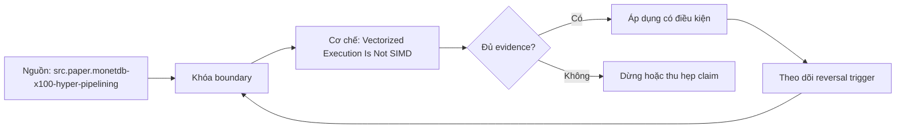

# Vectorized Execution Is Not SIMD

> [!abstract] Câu hỏi trung tâm
> Làm sao tách batching ở query engine khỏi compiler auto-vectorization và SIMD instructions, rồi đo contribution mà không giả định hai speedup cộng tuyến tính?

## 1. Ba tầng thường bị gọi cùng một chữ

Engine vectorization là API/dataflow theo batch: operator nhận nhiều values mỗi call. Compiler vectorization biến scalar IR loops thành vector IR/instructions nếu legality và cost model cho phép. SIMD là ISA hardware thực thi một instruction trên nhiều lanes. Batch loop tạo contiguous, type-specialized code dễ auto-vectorize nhưng không đảm bảo SIMD; batching vẫn giảm dispatch/branch/type overhead khi compiler sinh scalar instructions. Ngược lại, một scalar-looking library function có thể gọi SIMD kernel mà engine không dùng vector batches.

## 2. Thiết kế ba cấu hình

A: tuple/row-at-a-time scalar baseline. B: cùng batch operator nhưng compile với loop/SLP vectorization disabled và xác minh no-SIMD trong optimization remarks/assembly. C: batch operator với target ISA và vectorization enabled hoặc explicit SIMD kernel. Giữ algorithm, data layout, null semantics, compiler version/optimization, threads, CPU affinity và frequency policy. Nếu A dùng code path khác nhiều ngoài batching, chênh A-B không chỉ batching. B-C cũng gồm compiler transformations liên quan; báo limitations thay vì đặt tên tuyệt đối.

## 3. Contribution có interaction

Có thể báo `batch_gain = T_A/T_B` và `simd_increment = T_B/T_C` hoặc saved cycles, nhưng total speedup không bằng cộng hai phần trăm vì mechanisms tương tác. SIMD profitability thay khi batching đổi loop length, branch shape, alignment và cache behavior. Thêm factorial design batch on/off × SIMD on/off nếu implementation cho phép; interaction term làm rõ synergy/antagonism. Nếu row-at-a-time+SIMD không có ý nghĩa kỹ thuật, ghi missing cell. Kết luận bám configurations, không nói batching đóng góp một tỷ lệ cố định.

## 4. Batch size và cache

Batch quá nhỏ không amortize calls/setup; trip count ngắn làm vector loop dành nhiều thời gian cho checks/tail. Batch lớn tăng working set, cache misses, latency, memory pressure và có thể làm downstream buffer/spill. Test logarithmic sizes quanh engine default, không chỉ bốn con số tùy ý. Báo cycles/row, instructions/row, branches/misses, cache/TLB misses, bandwidth và wall time. Optimum có thể khác giữa filter, aggregation, strings và wide rows.

## 5. Masks, nulls, tails và branches

Selection/null mask ở engine có thể được compiler hạ thành predication/writemask hoặc scalar branches. SIMD tail xử lý bằng scalar epilogue, masked lanes hoặc vector-length mechanism tùy ISA/compiler. Branch-heavy predicate có thể vectorize qua masks, nhưng divergent work vẫn thực hiện lanes hoặc tạo compaction cost. LLVM diagnostics cho biết missed reason; Intel guide minh họa writemask ở ISA cụ thể. Không gán mọi branch cho SIMD failure nếu assembly cho predicated path.

## 6. Memory access và gather

Contiguous aligned loads phù hợp lanes; selection indices có thể đòi gather, vốn có latency/throughput và cache behavior khác. Sparse positions làm lanes sử dụng thấp; dictionary codes/bit-packed values cần unpack trước hoặc kernel specialized. Khi memory bandwidth saturates, nhiều SIMD lanes không giảm wall time tương ứng. Đo bytes/cycle và bandwidth cùng vector instruction count. CPU counters phụ thuộc PMU/model và multiplexing; ghi counter definitions, runs, variance và permissions.

## 7. Semantics và floating point

Integer sum có overflow contract; floating reduction đổi association khi vectorized nên bitwise result có thể khác. LLVM chỉ cho phép một số floating reductions khi semantics/flags cho phép hoặc dùng ordered reduction chậm hơn. Không bật fast-math chỉ để benchmark đẹp nếu product cần IEEE/NaN/signed-zero behavior. Verify exact integer/hash và documented tolerance/ULP cho float. Null lanes và exceptions phải giữ error model; masked lane không được đọc out-of-bounds.

## 8. Lab có proof của code path

Tạo sum/filter kernels với null/no-null và branch/simple variants. Lưu source hash, compiler flags, target CPU, optimization remarks và disassembly snippet/count để chứng minh configuration. Chạy sizes/batches randomized, warm-up và repeated trials; pin core nếu được phép. Dùng perf/stat tương đương cho cycles, instructions, branches, cache misses và vector counters có giải thích. Kết quả đạt khi tách batch/SIMD bằng counterfactual có proof, giải thích small-batch loss và giữ correctness; elapsed time một mình không đủ.

## 8. Ma trận kiểm chứng từng mệnh đề

Mỗi mệnh đề hiệu năng cần counterfactual, correctness oracle và counter ở đúng tầng. Elapsed time, plan label hoặc tên công nghệ riêng lẻ không đủ quy nguyên nhân.

### 8.1. engine vectors compiler vectors và SIMD lanes là ba tầng

**Mệnh đề cần kiểm.** engine vectors compiler vectors và SIMD lanes là ba tầng.

**Cách kiểm.** Chạy controlled factorial/three-path build; lưu compiler flags, optimization remarks, assembly proof, batch sizes, perf counters and correctness. Báo interaction thay vì cộng speedup tuyến tính. Với mệnh đề này, ghi engine/compiler/format version, data shape, controlled variables, expected counter, failure signal và boundary làm kết luận không còn đúng.

**Bằng chứng đạt cho `wiki.olap.vectorized-execution-not-simd`.** Lưu generator/hash, configuration, query/source, plan/profile/compiler proof, raw counters, result oracle, repetitions và reviewer. Nếu chưa chạy lab được phép, chỉ ghi protocol; không biến expected result thành số đo đã quan sát.

### 8.2. batching có lợi ngay cả khi không có SIMD

**Mệnh đề cần kiểm.** batching có lợi ngay cả khi không có SIMD.

**Cách kiểm.** Chạy controlled factorial/three-path build; lưu compiler flags, optimization remarks, assembly proof, batch sizes, perf counters and correctness. Báo interaction thay vì cộng speedup tuyến tính. Với mệnh đề này, ghi engine/compiler/format version, data shape, controlled variables, expected counter, failure signal và boundary làm kết luận không còn đúng.

**Bằng chứng đạt cho `wiki.olap.vectorized-execution-not-simd`.** Lưu generator/hash, configuration, query/source, plan/profile/compiler proof, raw counters, result oracle, repetitions và reviewer. Nếu chưa chạy lab được phép, chỉ ghi protocol; không biến expected result thành số đo đã quan sát.

### 8.3. compiler remarks hoặc assembly chứng minh code path

**Mệnh đề cần kiểm.** compiler remarks hoặc assembly chứng minh code path.

**Cách kiểm.** Chạy controlled factorial/three-path build; lưu compiler flags, optimization remarks, assembly proof, batch sizes, perf counters and correctness. Báo interaction thay vì cộng speedup tuyến tính. Với mệnh đề này, ghi engine/compiler/format version, data shape, controlled variables, expected counter, failure signal và boundary làm kết luận không còn đúng.

**Bằng chứng đạt cho `wiki.olap.vectorized-execution-not-simd`.** Lưu generator/hash, configuration, query/source, plan/profile/compiler proof, raw counters, result oracle, repetitions và reviewer. Nếu chưa chạy lab được phép, chỉ ghi protocol; không biến expected result thành số đo đã quan sát.

### 8.4. disabled auto-vectorization cần kiểm cả loop và SLP

**Mệnh đề cần kiểm.** disabled auto-vectorization cần kiểm cả loop và SLP.

**Cách kiểm.** Chạy controlled factorial/three-path build; lưu compiler flags, optimization remarks, assembly proof, batch sizes, perf counters and correctness. Báo interaction thay vì cộng speedup tuyến tính. Với mệnh đề này, ghi engine/compiler/format version, data shape, controlled variables, expected counter, failure signal và boundary làm kết luận không còn đúng.

**Bằng chứng đạt cho `wiki.olap.vectorized-execution-not-simd`.** Lưu generator/hash, configuration, query/source, plan/profile/compiler proof, raw counters, result oracle, repetitions và reviewer. Nếu chưa chạy lab được phép, chỉ ghi protocol; không biến expected result thành số đo đã quan sát.

### 8.5. batch gain và SIMD increment có interaction

**Mệnh đề cần kiểm.** batch gain và SIMD increment có interaction.

**Cách kiểm.** Chạy controlled factorial/three-path build; lưu compiler flags, optimization remarks, assembly proof, batch sizes, perf counters and correctness. Báo interaction thay vì cộng speedup tuyến tính. Với mệnh đề này, ghi engine/compiler/format version, data shape, controlled variables, expected counter, failure signal và boundary làm kết luận không còn đúng.

**Bằng chứng đạt cho `wiki.olap.vectorized-execution-not-simd`.** Lưu generator/hash, configuration, query/source, plan/profile/compiler proof, raw counters, result oracle, repetitions và reviewer. Nếu chưa chạy lab được phép, chỉ ghi protocol; không biến expected result thành số đo đã quan sát.

### 8.6. factorial design tốt hơn cộng phần trăm

**Mệnh đề cần kiểm.** factorial design tốt hơn cộng phần trăm.

**Cách kiểm.** Chạy controlled factorial/three-path build; lưu compiler flags, optimization remarks, assembly proof, batch sizes, perf counters and correctness. Báo interaction thay vì cộng speedup tuyến tính. Với mệnh đề này, ghi engine/compiler/format version, data shape, controlled variables, expected counter, failure signal và boundary làm kết luận không còn đúng.

**Bằng chứng đạt cho `wiki.olap.vectorized-execution-not-simd`.** Lưu generator/hash, configuration, query/source, plan/profile/compiler proof, raw counters, result oracle, repetitions và reviewer. Nếu chưa chạy lab được phép, chỉ ghi protocol; không biến expected result thành số đo đã quan sát.

### 8.7. small batch làm setup và tail overhead chiếm tỷ trọng lớn

**Mệnh đề cần kiểm.** small batch làm setup và tail overhead chiếm tỷ trọng lớn.

**Cách kiểm.** Chạy controlled factorial/three-path build; lưu compiler flags, optimization remarks, assembly proof, batch sizes, perf counters and correctness. Báo interaction thay vì cộng speedup tuyến tính. Với mệnh đề này, ghi engine/compiler/format version, data shape, controlled variables, expected counter, failure signal và boundary làm kết luận không còn đúng.

**Bằng chứng đạt cho `wiki.olap.vectorized-execution-not-simd`.** Lưu generator/hash, configuration, query/source, plan/profile/compiler proof, raw counters, result oracle, repetitions và reviewer. Nếu chưa chạy lab được phép, chỉ ghi protocol; không biến expected result thành số đo đã quan sát.

### 8.8. large batch có thể vượt cache working set

**Mệnh đề cần kiểm.** large batch có thể vượt cache working set.

**Cách kiểm.** Chạy controlled factorial/three-path build; lưu compiler flags, optimization remarks, assembly proof, batch sizes, perf counters and correctness. Báo interaction thay vì cộng speedup tuyến tính. Với mệnh đề này, ghi engine/compiler/format version, data shape, controlled variables, expected counter, failure signal và boundary làm kết luận không còn đúng.

**Bằng chứng đạt cho `wiki.olap.vectorized-execution-not-simd`.** Lưu generator/hash, configuration, query/source, plan/profile/compiler proof, raw counters, result oracle, repetitions và reviewer. Nếu chưa chạy lab được phép, chỉ ghi protocol; không biến expected result thành số đo đã quan sát.

### 8.9. selection mask có thể thành predication hoặc branch

**Mệnh đề cần kiểm.** selection mask có thể thành predication hoặc branch.

**Cách kiểm.** Chạy controlled factorial/three-path build; lưu compiler flags, optimization remarks, assembly proof, batch sizes, perf counters and correctness. Báo interaction thay vì cộng speedup tuyến tính. Với mệnh đề này, ghi engine/compiler/format version, data shape, controlled variables, expected counter, failure signal và boundary làm kết luận không còn đúng.

**Bằng chứng đạt cho `wiki.olap.vectorized-execution-not-simd`.** Lưu generator/hash, configuration, query/source, plan/profile/compiler proof, raw counters, result oracle, repetitions và reviewer. Nếu chưa chạy lab được phép, chỉ ghi protocol; không biến expected result thành số đo đã quan sát.

### 8.10. tail có scalar epilogue hoặc masked lanes

**Mệnh đề cần kiểm.** tail có scalar epilogue hoặc masked lanes.

**Cách kiểm.** Chạy controlled factorial/three-path build; lưu compiler flags, optimization remarks, assembly proof, batch sizes, perf counters and correctness. Báo interaction thay vì cộng speedup tuyến tính. Với mệnh đề này, ghi engine/compiler/format version, data shape, controlled variables, expected counter, failure signal và boundary làm kết luận không còn đúng.

**Bằng chứng đạt cho `wiki.olap.vectorized-execution-not-simd`.** Lưu generator/hash, configuration, query/source, plan/profile/compiler proof, raw counters, result oracle, repetitions và reviewer. Nếu chưa chạy lab được phép, chỉ ghi protocol; không biến expected result thành số đo đã quan sát.

### 8.11. branch-heavy code không mặc nhiên không vectorize

**Mệnh đề cần kiểm.** branch-heavy code không mặc nhiên không vectorize.

**Cách kiểm.** Chạy controlled factorial/three-path build; lưu compiler flags, optimization remarks, assembly proof, batch sizes, perf counters and correctness. Báo interaction thay vì cộng speedup tuyến tính. Với mệnh đề này, ghi engine/compiler/format version, data shape, controlled variables, expected counter, failure signal và boundary làm kết luận không còn đúng.

**Bằng chứng đạt cho `wiki.olap.vectorized-execution-not-simd`.** Lưu generator/hash, configuration, query/source, plan/profile/compiler proof, raw counters, result oracle, repetitions và reviewer. Nếu chưa chạy lab được phép, chỉ ghi protocol; không biến expected result thành số đo đã quan sát.

### 8.12. gather làm locality và lane utilization giảm

**Mệnh đề cần kiểm.** gather làm locality và lane utilization giảm.

**Cách kiểm.** Chạy controlled factorial/three-path build; lưu compiler flags, optimization remarks, assembly proof, batch sizes, perf counters and correctness. Báo interaction thay vì cộng speedup tuyến tính. Với mệnh đề này, ghi engine/compiler/format version, data shape, controlled variables, expected counter, failure signal và boundary làm kết luận không còn đúng.

**Bằng chứng đạt cho `wiki.olap.vectorized-execution-not-simd`.** Lưu generator/hash, configuration, query/source, plan/profile/compiler proof, raw counters, result oracle, repetitions và reviewer. Nếu chưa chạy lab được phép, chỉ ghi protocol; không biến expected result thành số đo đã quan sát.

### 8.13. memory bandwidth có thể che SIMD benefit

**Mệnh đề cần kiểm.** memory bandwidth có thể che SIMD benefit.

**Cách kiểm.** Chạy controlled factorial/three-path build; lưu compiler flags, optimization remarks, assembly proof, batch sizes, perf counters and correctness. Báo interaction thay vì cộng speedup tuyến tính. Với mệnh đề này, ghi engine/compiler/format version, data shape, controlled variables, expected counter, failure signal và boundary làm kết luận không còn đúng.

**Bằng chứng đạt cho `wiki.olap.vectorized-execution-not-simd`.** Lưu generator/hash, configuration, query/source, plan/profile/compiler proof, raw counters, result oracle, repetitions và reviewer. Nếu chưa chạy lab được phép, chỉ ghi protocol; không biến expected result thành số đo đã quan sát.

### 8.14. floating reduction có semantics reordering

**Mệnh đề cần kiểm.** floating reduction có semantics reordering.

**Cách kiểm.** Chạy controlled factorial/three-path build; lưu compiler flags, optimization remarks, assembly proof, batch sizes, perf counters and correctness. Báo interaction thay vì cộng speedup tuyến tính. Với mệnh đề này, ghi engine/compiler/format version, data shape, controlled variables, expected counter, failure signal và boundary làm kết luận không còn đúng.

**Bằng chứng đạt cho `wiki.olap.vectorized-execution-not-simd`.** Lưu generator/hash, configuration, query/source, plan/profile/compiler proof, raw counters, result oracle, repetitions và reviewer. Nếu chưa chạy lab được phép, chỉ ghi protocol; không biến expected result thành số đo đã quan sát.

### 8.15. cycles per row cần frequency affinity và variance context

**Mệnh đề cần kiểm.** cycles per row cần frequency affinity và variance context.

**Cách kiểm.** Chạy controlled factorial/three-path build; lưu compiler flags, optimization remarks, assembly proof, batch sizes, perf counters and correctness. Báo interaction thay vì cộng speedup tuyến tính. Với mệnh đề này, ghi engine/compiler/format version, data shape, controlled variables, expected counter, failure signal và boundary làm kết luận không còn đúng.

**Bằng chứng đạt cho `wiki.olap.vectorized-execution-not-simd`.** Lưu generator/hash, configuration, query/source, plan/profile/compiler proof, raw counters, result oracle, repetitions và reviewer. Nếu chưa chạy lab được phép, chỉ ghi protocol; không biến expected result thành số đo đã quan sát.

## 9. Quy trình phản biện

1. Vẽ data path và xác định tầng storage, reader, engine, compiler, ISA hoặc network đang được nói tới.
2. Khóa semantics, dataset và correctness oracle trước khi đo performance.
3. Thay một mechanism; giữ các mechanisms còn lại cố định hoặc ghi confounder.
4. Đọc plans/remarks nhưng xác nhận bằng runtime counters hoặc assembly khi phù hợp.
5. Báo distribution và critical path, không dùng một average che skew hoặc tails.
6. Viết reversal case và stop condition trước khi chạy.
7. Chưa có execution evidence thì giữ trạng thái `review`.

## 10. Câu hỏi tự kiểm tra

1. Mechanism nằm ở tầng nào và counter trực tiếp của nó là gì?
2. Kết quả đúng được xác minh độc lập ra sao?
3. Biến nào thực sự đổi giữa hai cấu hình?
4. Overhead cố định, bandwidth, skew hoặc tail nào có thể che kết quả?
5. Constraint nào làm lựa chọn hiện tại phải đảo?
6. Kết luận nào mới là protocol, chưa phải observation?

## 11. Giới hạn và điều chưa cho phép kết luận

- Chưa chạy pruning, vectorization, layout hoặc MPP benchmarks; note mô tả protocol và expected evidence.
- Tài liệu engine/compiler được kiểm ngày 2026-10-01; version, plan format, counters và optimizer support có thể đổi.
- Taxonomy và lab matrices là curriculum synthesis; không gán nguyên văn cho một paper hoặc vendor.
- Microbenchmark không chứng minh production speedup nếu data, concurrency, cache, compiler, storage hoặc network khác.
- Note giữ trạng thái `review` cho tới khi chủ dự án duyệt semantic meaning.

## Reference
1. [[SRC-MONETDB-X100-HYPER-PIPELINING]]
2. [[SRC-LLVM-AUTO-VECTORIZATION]]
3. [[SRC-INTEL-INTRINSICS-GUIDE]]

## Source coverage

| Source slice | Nội dung sử dụng | Trạng thái |
|---|---|---|
| [[SRC-MONETDB-X100-HYPER-PIPELINING]] | Khái niệm, mechanism hoặc evidence boundary liên quan | Đã đọc locator trong source record; không suy ngoài phạm vi |
| [[SRC-LLVM-AUTO-VECTORIZATION]] | Khái niệm, mechanism hoặc evidence boundary liên quan | Đã đọc locator trong source record; không suy ngoài phạm vi |
| [[SRC-INTEL-INTRINSICS-GUIDE]] | Khái niệm, mechanism hoặc evidence boundary liên quan | Đã đọc locator trong source record; không suy ngoài phạm vi |

## Key takeaways
- Engine vector batches không đồng nghĩa SIMD; contribution cần binary/compiler proof và thiết kế counterfactual có interaction.
- Correctness oracle và controlled variables đi trước mọi speedup claim.
- Plan estimate, compiler flag hoặc engine feature không thay runtime evidence.
- Average phải đi cùng tails, skew, bytes/units và critical-path counters.
- Chưa chạy lab thì artifact là giáo trình đã kiểm cấu trúc, không phải benchmark result hay production certification.

<!-- ATOMIC-EXECUTION-CAPSULE:START -->

## Execution capsule — kiểm chứng `wiki.olap.vectorized-execution-not-simd`

> [!important] Phân loại mệnh đề
> Với `wiki.olap.vectorized-execution-not-simd`, sơ đồ, ví dụ và artifact về **Vectorized Execution Is Not SIMD** là **synthesis để kiểm chứng**; chúng không phải trích dẫn hay case nguyên văn của nguồn.

### Sơ đồ cơ chế và điểm kiểm soát



Đọc sơ đồ `wiki.olap.vectorized-execution-not-simd` từ trái sang phải: source chỉ cung cấp claim ban đầu cho **Vectorized Execution Is Not SIMD**; quyết định chỉ được đi tiếp sau khi boundary, evidence và điều kiện đảo quyết định đã hiện hữu.

### Ví dụ làm việc có thể bác bỏ

**Input.** Một đội cần trả lời: “Làm sao tách batching ở query engine khỏi compiler auto-vectorization và SIMD instructions, rồi đo contribution mà không giả định hai speedup cộng tuyến tính?” cho một phạm vi nhỏ, có owner và deadline rõ.

**Decision.** Đội áp dụng **Vectorized Execution Is Not SIMD** trên control và variant chỉ khác một assumption; expected result và hard constraints được khóa trước khi chạy.

**Outcome.** Với `wiki.olap.vectorized-execution-not-simd`, nếu observation vi phạm hard constraint hoặc oracle độc lập không xác nhận **Vectorized Execution Is Not SIMD**, đội thu hẹp claim hay đảo quyết định. Nếu đạt, kết luận vẫn kèm scope, version và review date; một lần thành công không được nâng thành quy luật phổ quát.

### Artifact thực thi tối thiểu

```sql
-- Verification harness for: Vectorized Execution Is Not SIMD
WITH evidence AS (
    SELECT 'wiki.olap.vectorized-execution-not-simd' AS concept_id,
           'boundary_declared' AS check_name, 1 AS passed
    UNION ALL
    SELECT 'wiki.olap.vectorized-execution-not-simd', 'independent_oracle', 1
    UNION ALL
    SELECT 'wiki.olap.vectorized-execution-not-simd', 'reversal_trigger_recorded', 1
)
SELECT concept_id,
       MIN(passed) AS all_hard_checks_pass,
       COUNT(*) AS evidence_items
FROM evidence
GROUP BY concept_id
HAVING MIN(passed) = 1;
```

Artifact của `wiki.olap.vectorized-execution-not-simd` buộc người dùng ghi boundary, oracle và reversal trigger cho **Vectorized Execution Is Not SIMD**. Các giá trị minh họa phải được thay bằng evidence thật trước khi dùng cho quyết định.

### Tự kiểm tra trước khi tái sử dụng

1. Bạn có thể trả lời `Làm sao tách batching ở query engine khỏi compiler auto-vectorization và SIMD instructions, rồi đo contribution mà không giả định hai speedup cộng tuyến tính?` bằng một câu mà không kéo thêm concept thứ hai không?
2. Source locator nào đỡ cho claim, và phần nào chỉ là synthesis trong note?
3. Observation nào khiến bạn dừng, thu hẹp hoặc đảo quyết định?
4. Artifact nào cho phép một reviewer độc lập tái hiện kết quả?

<!-- ATOMIC-EXECUTION-CAPSULE:END -->
