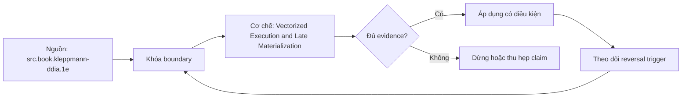

# Vectorized Execution and Late Materialization

> [!abstract] Câu hỏi trung tâm
> Vector batches, selection vectors, late materialization và encoded execution giảm overhead ở đâu, và query shape nào làm từng cơ chế mất lợi thế?

## 1. Ba execution granularities

Tuple-at-a-time/Volcano gọi operator qua interface cho từng row, linh hoạt và pipeline tốt nhưng trả chi phí dispatch, function call, type handling và branch mỗi row. Full-column/array-at-a-time giảm dispatch nhưng materialize intermediates lớn, tăng memory traffic và làm mất cache locality. Vectorized execution truyền batch vừa cache qua operator primitives, amortize call overhead nhưng giữ pipeline. X100 dùng mô hình này để phân tích overhead; batch size không phải hằng số một nghìn và optimum phụ thuộc tuple width, operators, cache và machine.

## 2. Data chunk và selection representation

Một vector/chunk chứa column arrays, validity/null mask và count. Filter có thể trả selection vector chứa row positions thay vì copy payload; downstream operators dereference chỉ rows sống. Dense selection đôi khi quét mask/bitmap tốt hơn index vector; sparse selection tiết kiệm work nhưng gather ngẫu nhiên có thể tốn cache/TLB. Selection composition qua nhiều filters cần giữ row identity và bounds. Null mask là semantics, không chỉ overhead: SQL three-valued logic phải giống scalar oracle ở filter, join và aggregation.

## 3. Late materialization

Late materialization đọc/filter trên columns cần sớm, giữ positions/selection, rồi lấy projected columns cho rows sống. Nó giảm bytes và tuple construction khi filter chọn ít rows và deferred columns rộng. Giá phải trả gồm position tracking, random gathers, reconstruction, cache misses và complexity qua joins/sorts. Nếu selectivity cao, output cần hầu hết columns, positions mất order/locality hoặc complex nested values phải decode, early materialization có thể thắng. Paper materialization cung cấp taxonomy; lựa chọn phải theo pipeline, không thành khẩu hiệu.

## 4. Encoded execution

Dictionary equality có thể map constant sang code rồi so integer codes; RLE aggregate có thể nhân value với run length; bitmap AND/OR có thể xử lý compressed representation. Chỉ operators và encoding combinations có implementation tương ứng mới tránh decode. Dictionary của hai chunks có thể khác codebooks; range/order trên dictionary codes chỉ đúng khi dictionary order có contract. Expressions/UDFs thường buộc decode/type conversion. Plan/profile hoặc source documentation phải chứng minh encoded path; file nén nhỏ không tự chứng minh compute-on-encoded-data.

## 5. Pipeline, blocking operators và code generation

Scan-filter-project có thể fusion/pipeline batches. Sort, hash-build, global aggregation hoặc exchange là blocking/semi-blocking boundaries và có thể materialize/spill. Runtime code generation/JIT là cơ chế khác: fuse expressions và specialize types để giảm virtual dispatch; engine có thể vectorized không JIT, JIT tuple-at-a-time hoặc kết hợp. Compilation latency có thể không đáng cho query ngắn. Lesson giữ four mechanisms riêng: batching, selection, late materialization, encoded execution; codegen chỉ là boundary nhận biết.

## 6. UDF và type-boundary

Opaque UDF call có thể phá predicate pushdown, operator fusion, auto-vectorization và null propagation; callback per row đưa dispatch trở lại hot loop. Vectorized UDF có batch interface nhưng vẫn tốn serialization/copy hoặc language-runtime boundary. Built-in expression có semantics/implementation engine biết nên tối ưu sâu hơn. So UDF với built-in phải giữ exact semantics, null/error behavior và type; compiler có thể constant-fold một bên. Counter gồm calls, batches, rows/call, CPU cycles, allocations và conversions.

## 7. Bốn reversal cases

Filter giữ gần hết rows: late fetch/gather overhead có thể không bù bytes. Complex/nested column: decoding/materialization dominate và vector primitive ít. Opaque UDF: batching còn nhưng call/conversion chặn tight loop. Bảng rất hẹp hoặc dataset nhỏ: overhead setup/selection/JIT có thể lớn hơn saved work. Mỗi case vẽ pipeline trước-sau, nêu expected counter rồi đo. Correctness oracle gồm result hash, null behavior, order nếu contract yêu cầu và floating-point tolerance có lý do.

## 8. Ma trận kiểm chứng từng mệnh đề

Mỗi mệnh đề hiệu năng cần counterfactual, correctness oracle và counter ở đúng tầng. Elapsed time, plan label hoặc tên công nghệ riêng lẻ không đủ quy nguyên nhân.

### 8.1. tuple at a time trả dispatch overhead mỗi row

**Mệnh đề cần kiểm.** tuple at a time trả dispatch overhead mỗi row.

**Cách kiểm.** Vẽ pipeline và materialization points; đo row, batch, selection, early/late and built-in/UDF variants bằng result oracle, calls, batches, bytes, allocations, CPU/cache counters. Với mệnh đề này, ghi engine/compiler/format version, data shape, controlled variables, expected counter, failure signal và boundary làm kết luận không còn đúng.

**Bằng chứng đạt cho `wiki.olap.vectorized-execution-late-materialization`.** Lưu generator/hash, configuration, query/source, plan/profile/compiler proof, raw counters, result oracle, repetitions và reviewer. Nếu chưa chạy lab được phép, chỉ ghi protocol; không biến expected result thành số đo đã quan sát.

### 8.2. full-column processing có intermediate memory traffic

**Mệnh đề cần kiểm.** full-column processing có intermediate memory traffic.

**Cách kiểm.** Vẽ pipeline và materialization points; đo row, batch, selection, early/late and built-in/UDF variants bằng result oracle, calls, batches, bytes, allocations, CPU/cache counters. Với mệnh đề này, ghi engine/compiler/format version, data shape, controlled variables, expected counter, failure signal và boundary làm kết luận không còn đúng.

**Bằng chứng đạt cho `wiki.olap.vectorized-execution-late-materialization`.** Lưu generator/hash, configuration, query/source, plan/profile/compiler proof, raw counters, result oracle, repetitions và reviewer. Nếu chưa chạy lab được phép, chỉ ghi protocol; không biến expected result thành số đo đã quan sát.

### 8.3. vector batch size tối ưu phụ thuộc cache và tuple width

**Mệnh đề cần kiểm.** vector batch size tối ưu phụ thuộc cache và tuple width.

**Cách kiểm.** Vẽ pipeline và materialization points; đo row, batch, selection, early/late and built-in/UDF variants bằng result oracle, calls, batches, bytes, allocations, CPU/cache counters. Với mệnh đề này, ghi engine/compiler/format version, data shape, controlled variables, expected counter, failure signal và boundary làm kết luận không còn đúng.

**Bằng chứng đạt cho `wiki.olap.vectorized-execution-late-materialization`.** Lưu generator/hash, configuration, query/source, plan/profile/compiler proof, raw counters, result oracle, repetitions và reviewer. Nếu chưa chạy lab được phép, chỉ ghi protocol; không biến expected result thành số đo đã quan sát.

### 8.4. selection vector giữ positions thay vì copy payload

**Mệnh đề cần kiểm.** selection vector giữ positions thay vì copy payload.

**Cách kiểm.** Vẽ pipeline và materialization points; đo row, batch, selection, early/late and built-in/UDF variants bằng result oracle, calls, batches, bytes, allocations, CPU/cache counters. Với mệnh đề này, ghi engine/compiler/format version, data shape, controlled variables, expected counter, failure signal và boundary làm kết luận không còn đúng.

**Bằng chứng đạt cho `wiki.olap.vectorized-execution-late-materialization`.** Lưu generator/hash, configuration, query/source, plan/profile/compiler proof, raw counters, result oracle, repetitions và reviewer. Nếu chưa chạy lab được phép, chỉ ghi protocol; không biến expected result thành số đo đã quan sát.

### 8.5. dense mask và sparse index có trade-off khác nhau

**Mệnh đề cần kiểm.** dense mask và sparse index có trade-off khác nhau.

**Cách kiểm.** Vẽ pipeline và materialization points; đo row, batch, selection, early/late and built-in/UDF variants bằng result oracle, calls, batches, bytes, allocations, CPU/cache counters. Với mệnh đề này, ghi engine/compiler/format version, data shape, controlled variables, expected counter, failure signal và boundary làm kết luận không còn đúng.

**Bằng chứng đạt cho `wiki.olap.vectorized-execution-late-materialization`.** Lưu generator/hash, configuration, query/source, plan/profile/compiler proof, raw counters, result oracle, repetitions và reviewer. Nếu chưa chạy lab được phép, chỉ ghi protocol; không biến expected result thành số đo đã quan sát.

### 8.6. null mask phải giữ SQL three-valued logic

**Mệnh đề cần kiểm.** null mask phải giữ SQL three-valued logic.

**Cách kiểm.** Vẽ pipeline và materialization points; đo row, batch, selection, early/late and built-in/UDF variants bằng result oracle, calls, batches, bytes, allocations, CPU/cache counters. Với mệnh đề này, ghi engine/compiler/format version, data shape, controlled variables, expected counter, failure signal và boundary làm kết luận không còn đúng.

**Bằng chứng đạt cho `wiki.olap.vectorized-execution-late-materialization`.** Lưu generator/hash, configuration, query/source, plan/profile/compiler proof, raw counters, result oracle, repetitions và reviewer. Nếu chưa chạy lab được phép, chỉ ghi protocol; không biến expected result thành số đo đã quan sát.

### 8.7. late materialization thắng mạnh khi selectivity thấp và deferred columns rộng

**Mệnh đề cần kiểm.** late materialization thắng mạnh khi selectivity thấp và deferred columns rộng.

**Cách kiểm.** Vẽ pipeline và materialization points; đo row, batch, selection, early/late and built-in/UDF variants bằng result oracle, calls, batches, bytes, allocations, CPU/cache counters. Với mệnh đề này, ghi engine/compiler/format version, data shape, controlled variables, expected counter, failure signal và boundary làm kết luận không còn đúng.

**Bằng chứng đạt cho `wiki.olap.vectorized-execution-late-materialization`.** Lưu generator/hash, configuration, query/source, plan/profile/compiler proof, raw counters, result oracle, repetitions và reviewer. Nếu chưa chạy lab được phép, chỉ ghi protocol; không biến expected result thành số đo đã quan sát.

### 8.8. high selectivity có thể làm early materialization tốt hơn

**Mệnh đề cần kiểm.** high selectivity có thể làm early materialization tốt hơn.

**Cách kiểm.** Vẽ pipeline và materialization points; đo row, batch, selection, early/late and built-in/UDF variants bằng result oracle, calls, batches, bytes, allocations, CPU/cache counters. Với mệnh đề này, ghi engine/compiler/format version, data shape, controlled variables, expected counter, failure signal và boundary làm kết luận không còn đúng.

**Bằng chứng đạt cho `wiki.olap.vectorized-execution-late-materialization`.** Lưu generator/hash, configuration, query/source, plan/profile/compiler proof, raw counters, result oracle, repetitions và reviewer. Nếu chưa chạy lab được phép, chỉ ghi protocol; không biến expected result thành số đo đã quan sát.

### 8.9. gather ngẫu nhiên làm mất locality

**Mệnh đề cần kiểm.** gather ngẫu nhiên làm mất locality.

**Cách kiểm.** Vẽ pipeline và materialization points; đo row, batch, selection, early/late and built-in/UDF variants bằng result oracle, calls, batches, bytes, allocations, CPU/cache counters. Với mệnh đề này, ghi engine/compiler/format version, data shape, controlled variables, expected counter, failure signal và boundary làm kết luận không còn đúng.

**Bằng chứng đạt cho `wiki.olap.vectorized-execution-late-materialization`.** Lưu generator/hash, configuration, query/source, plan/profile/compiler proof, raw counters, result oracle, repetitions và reviewer. Nếu chưa chạy lab được phép, chỉ ghi protocol; không biến expected result thành số đo đã quan sát.

### 8.10. encoded execution là operator encoding specific

**Mệnh đề cần kiểm.** encoded execution là operator encoding specific.

**Cách kiểm.** Vẽ pipeline và materialization points; đo row, batch, selection, early/late and built-in/UDF variants bằng result oracle, calls, batches, bytes, allocations, CPU/cache counters. Với mệnh đề này, ghi engine/compiler/format version, data shape, controlled variables, expected counter, failure signal và boundary làm kết luận không còn đúng.

**Bằng chứng đạt cho `wiki.olap.vectorized-execution-late-materialization`.** Lưu generator/hash, configuration, query/source, plan/profile/compiler proof, raw counters, result oracle, repetitions và reviewer. Nếu chưa chạy lab được phép, chỉ ghi protocol; không biến expected result thành số đo đã quan sát.

### 8.11. dictionary codes giữa chunks không mặc nhiên so được

**Mệnh đề cần kiểm.** dictionary codes giữa chunks không mặc nhiên so được.

**Cách kiểm.** Vẽ pipeline và materialization points; đo row, batch, selection, early/late and built-in/UDF variants bằng result oracle, calls, batches, bytes, allocations, CPU/cache counters. Với mệnh đề này, ghi engine/compiler/format version, data shape, controlled variables, expected counter, failure signal và boundary làm kết luận không còn đúng.

**Bằng chứng đạt cho `wiki.olap.vectorized-execution-late-materialization`.** Lưu generator/hash, configuration, query/source, plan/profile/compiler proof, raw counters, result oracle, repetitions và reviewer. Nếu chưa chạy lab được phép, chỉ ghi protocol; không biến expected result thành số đo đã quan sát.

### 8.12. blocking operator tạo materialization boundary

**Mệnh đề cần kiểm.** blocking operator tạo materialization boundary.

**Cách kiểm.** Vẽ pipeline và materialization points; đo row, batch, selection, early/late and built-in/UDF variants bằng result oracle, calls, batches, bytes, allocations, CPU/cache counters. Với mệnh đề này, ghi engine/compiler/format version, data shape, controlled variables, expected counter, failure signal và boundary làm kết luận không còn đúng.

**Bằng chứng đạt cho `wiki.olap.vectorized-execution-late-materialization`.** Lưu generator/hash, configuration, query/source, plan/profile/compiler proof, raw counters, result oracle, repetitions và reviewer. Nếu chưa chạy lab được phép, chỉ ghi protocol; không biến expected result thành số đo đã quan sát.

### 8.13. JIT khác vectorized execution

**Mệnh đề cần kiểm.** JIT khác vectorized execution.

**Cách kiểm.** Vẽ pipeline và materialization points; đo row, batch, selection, early/late and built-in/UDF variants bằng result oracle, calls, batches, bytes, allocations, CPU/cache counters. Với mệnh đề này, ghi engine/compiler/format version, data shape, controlled variables, expected counter, failure signal và boundary làm kết luận không còn đúng.

**Bằng chứng đạt cho `wiki.olap.vectorized-execution-late-materialization`.** Lưu generator/hash, configuration, query/source, plan/profile/compiler proof, raw counters, result oracle, repetitions và reviewer. Nếu chưa chạy lab được phép, chỉ ghi protocol; không biến expected result thành số đo đã quan sát.

### 8.14. opaque UDF có thể phá fusion và batching

**Mệnh đề cần kiểm.** opaque UDF có thể phá fusion và batching.

**Cách kiểm.** Vẽ pipeline và materialization points; đo row, batch, selection, early/late and built-in/UDF variants bằng result oracle, calls, batches, bytes, allocations, CPU/cache counters. Với mệnh đề này, ghi engine/compiler/format version, data shape, controlled variables, expected counter, failure signal và boundary làm kết luận không còn đúng.

**Bằng chứng đạt cho `wiki.olap.vectorized-execution-late-materialization`.** Lưu generator/hash, configuration, query/source, plan/profile/compiler proof, raw counters, result oracle, repetitions và reviewer. Nếu chưa chạy lab được phép, chỉ ghi protocol; không biến expected result thành số đo đã quan sát.

### 8.15. built-in và UDF benchmark phải giữ semantics giống nhau

**Mệnh đề cần kiểm.** built-in và UDF benchmark phải giữ semantics giống nhau.

**Cách kiểm.** Vẽ pipeline và materialization points; đo row, batch, selection, early/late and built-in/UDF variants bằng result oracle, calls, batches, bytes, allocations, CPU/cache counters. Với mệnh đề này, ghi engine/compiler/format version, data shape, controlled variables, expected counter, failure signal và boundary làm kết luận không còn đúng.

**Bằng chứng đạt cho `wiki.olap.vectorized-execution-late-materialization`.** Lưu generator/hash, configuration, query/source, plan/profile/compiler proof, raw counters, result oracle, repetitions và reviewer. Nếu chưa chạy lab được phép, chỉ ghi protocol; không biến expected result thành số đo đã quan sát.

## 9. Quy trình phản biện

1. Vẽ data path và xác định tầng storage, reader, engine, compiler, ISA hoặc network đang được nói tới.
2. Khóa semantics, dataset và correctness oracle trước khi đo performance.
3. Thay một mechanism; giữ các mechanisms còn lại cố định hoặc ghi confounder.
4. Đọc plans/remarks nhưng xác nhận bằng runtime counters hoặc assembly khi phù hợp.
5. Báo distribution và critical path, không dùng một average che skew hoặc tails.
6. Viết reversal case và stop condition trước khi chạy.
7. Chưa có execution evidence thì giữ trạng thái `review`.

## 10. Câu hỏi tự kiểm tra

1. Mechanism nằm ở tầng nào và counter trực tiếp của nó là gì?
2. Kết quả đúng được xác minh độc lập ra sao?
3. Biến nào thực sự đổi giữa hai cấu hình?
4. Overhead cố định, bandwidth, skew hoặc tail nào có thể che kết quả?
5. Constraint nào làm lựa chọn hiện tại phải đảo?
6. Kết luận nào mới là protocol, chưa phải observation?

## 11. Giới hạn và điều chưa cho phép kết luận

- Chưa chạy pruning, vectorization, layout hoặc MPP benchmarks; note mô tả protocol và expected evidence.
- Tài liệu engine/compiler được kiểm ngày 2026-10-01; version, plan format, counters và optimizer support có thể đổi.
- Taxonomy và lab matrices là curriculum synthesis; không gán nguyên văn cho một paper hoặc vendor.
- Microbenchmark không chứng minh production speedup nếu data, concurrency, cache, compiler, storage hoặc network khác.
- Note giữ trạng thái `review` cho tới khi chủ dự án duyệt semantic meaning.

## Reference
1. [[SRC-KLEPPMANN-DDIA-1E]]
2. [[SRC-MONETDB-X100-HYPER-PIPELINING]]
3. [[SRC-ABADI-MATERIALIZATION-STRATEGIES]]

## Source coverage

| Source slice | Nội dung sử dụng | Trạng thái |
|---|---|---|
| [[SRC-KLEPPMANN-DDIA-1E]] | Khái niệm, mechanism hoặc evidence boundary liên quan | Đã đọc locator trong source record; không suy ngoài phạm vi |
| [[SRC-MONETDB-X100-HYPER-PIPELINING]] | Khái niệm, mechanism hoặc evidence boundary liên quan | Đã đọc locator trong source record; không suy ngoài phạm vi |
| [[SRC-ABADI-MATERIALIZATION-STRATEGIES]] | Khái niệm, mechanism hoặc evidence boundary liên quan | Đã đọc locator trong source record; không suy ngoài phạm vi |

## Key takeaways
- Batching, selection, late materialization và encoded execution có reversal cases riêng; không có cơ chế luôn thắng.
- Correctness oracle và controlled variables đi trước mọi speedup claim.
- Plan estimate, compiler flag hoặc engine feature không thay runtime evidence.
- Average phải đi cùng tails, skew, bytes/units và critical-path counters.
- Chưa chạy lab thì artifact là giáo trình đã kiểm cấu trúc, không phải benchmark result hay production certification.

<!-- ATOMIC-EXECUTION-CAPSULE:START -->

## Execution capsule — kiểm chứng `wiki.olap.vectorized-execution-late-materialization`

> [!important] Phân loại mệnh đề
> Với `wiki.olap.vectorized-execution-late-materialization`, sơ đồ, ví dụ và artifact về **Vectorized Execution and Late Materialization** là **synthesis để kiểm chứng**; chúng không phải trích dẫn hay case nguyên văn của nguồn.

### Sơ đồ cơ chế và điểm kiểm soát



Đọc sơ đồ `wiki.olap.vectorized-execution-late-materialization` từ trái sang phải: source chỉ cung cấp claim ban đầu cho **Vectorized Execution and Late Materialization**; quyết định chỉ được đi tiếp sau khi boundary, evidence và điều kiện đảo quyết định đã hiện hữu.

### Artifact thực thi tối thiểu

```sql
-- Verification harness for: Vectorized Execution and Late Materialization
WITH evidence AS (
    SELECT 'wiki.olap.vectorized-execution-late-materialization' AS concept_id,
           'boundary_declared' AS check_name, 1 AS passed
    UNION ALL
    SELECT 'wiki.olap.vectorized-execution-late-materialization', 'independent_oracle', 1
    UNION ALL
    SELECT 'wiki.olap.vectorized-execution-late-materialization', 'reversal_trigger_recorded', 1
)
SELECT concept_id,
       MIN(passed) AS all_hard_checks_pass,
       COUNT(*) AS evidence_items
FROM evidence
GROUP BY concept_id
HAVING MIN(passed) = 1;
```

Artifact của `wiki.olap.vectorized-execution-late-materialization` buộc người dùng ghi boundary, oracle và reversal trigger cho **Vectorized Execution and Late Materialization**. Các giá trị minh họa phải được thay bằng evidence thật trước khi dùng cho quyết định.

### Tự kiểm tra trước khi tái sử dụng

1. Bạn có thể trả lời `Vector batches, selection vectors, late materialization và encoded execution giảm overhead ở đâu, và query shape nào làm từng cơ chế mất lợi thế?` bằng một câu mà không kéo thêm concept thứ hai không?
2. Source locator nào đỡ cho claim, và phần nào chỉ là synthesis trong note?
3. Observation nào khiến bạn dừng, thu hẹp hoặc đảo quyết định?
4. Artifact nào cho phép một reviewer độc lập tái hiện kết quả?

<!-- ATOMIC-EXECUTION-CAPSULE:END -->
