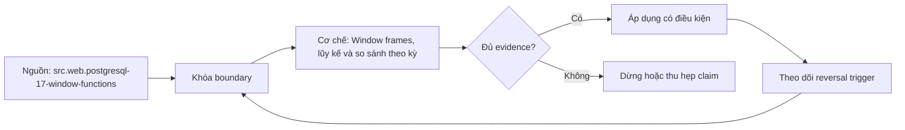

# Window frames, lũy kế và so sánh theo kỳ

> [!abstract] Câu hỏi trung tâm
> Một frame chứa đúng những rows hoặc peer groups nào, calendar có liên tục không, và phép so kỳ xử lý missing/zero/duplicate theo rule nào?

## 1. Tách grain thời gian khỏi window

Trước khi tính lũy kế, dữ liệu phải có đúng một row trên mỗi entity-period ở grain mong muốn, ví dụ một row mỗi `(branch_id, month_start)`. Nếu còn nhiều transaction trong tháng, `ROWS` chạy trên transactions chứ không phải tháng. Aggregate trước về tháng rồi mới áp window.

Period cần định nghĩa bằng calendar, timezone và boundary. `date_trunc('month', timestamp)` trên timezone session có thể khác tháng nghiệp vụ. Fiscal month không nhất thiết trùng tháng dương lịch. Lưu `period_key`, `period_start`, `period_end` từ calendar dimension khi có thể.

Kiểm uniqueness của entity-period. Duplicate period làm frame có peers hoặc nhiều physical rows và tạo running total khó hiểu. Không dùng window để che duplicate upstream.

## 2. Frame là tập rows quanh current row

Window partition là toàn bộ nhóm; frame là phần partition mà frame-aware function thấy tại current row. Aggregate functions dùng như window functions tính trên frame. Frame thay đổi theo current row, tạo running hoặc moving metrics.

Cú pháp gồm frame mode `ROWS`, `RANGE` hoặc `GROUPS`; điểm bắt đầu; điểm kết thúc; và tùy chọn exclusion. Ví dụ `ROWS BETWEEN UNBOUNDED PRECEDING AND CURRENT ROW` lấy mọi physical row từ đầu tới row hiện tại.

Không nhầm frame với output filter. Frame không loại current row khỏi result; nó chỉ đổi input của function tại row đó.

## 3. Default frame và rủi ro

Trong PostgreSQL, khi có window `ORDER BY`, default frame kéo từ đầu partition đến current row và bao gồm peers của current row. Vì vậy `sum(x) over (order by period)` có thể cho các duplicate period cùng một cumulative value, không tăng từng physical row như nhiều người dự đoán.

Không có `ORDER BY`, frame là toàn partition cho nhiều trường hợp. `last_value` với default ordered frame thường trả giá trị của current/last peer, không phải cuối partition.

Quy tắc giáo trình: khi metric phụ thuộc frame, viết frame explicit. Điều này bảo vệ query trước thay đổi order và buộc reviewer nhìn thấy semantics.

## 4. ROWS

`ROWS` đếm physical rows theo order. `ROWS BETWEEN 2 PRECEDING AND CURRENT ROW` lấy tối đa ba rows, không phải ba tháng nếu tháng thiếu và không phải ba giá trị khác nhau nếu period duplicate.

ROWS phù hợp sau khi đã đảm bảo một row/entity-period và calendar scaffold liên tục. Khi đó ba rows đúng ba periods. Nếu không có uniqueness/continuity, tên 3-month moving average là không được chứng minh.

Tie-break trong order quyết định row nào là preceding khi period duplicate. Tốt hơn fail uniqueness thay vì thêm arbitrary ID và tiếp tục metric.

## 5. RANGE

`RANGE` xác định frame theo giá trị ordering và peer groups, không đơn thuần số physical rows. Default ordered frame là dạng range đến current row có peers. Offset RANGE có yêu cầu type/order expression theo DBMS.

Với duplicate order value, peers đi cùng frame boundary. Điều này có ích khi tất cả events cùng timestamp/price phải được coi một điểm, nhưng có thể gây bước nhảy lũy kế.

Không nói RANGE luôn là khoảng thời gian. Nó là value-based frame; thời gian chỉ khi ordering expression là time và offset tương thích. Đọc dialect cụ thể.

## 6. GROUPS

`GROUPS` đếm peer groups. `GROUPS BETWEEN 2 PRECEDING AND CURRENT ROW` lấy ba nhóm giá trị order gần nhất, dù mỗi nhóm có nhiều rows. Nó nằm giữa row-based và value-offset reasoning.

Nếu dữ liệu period đúng một row, ROWS/RANGE/GROUPS có thể cho kết quả giống và test không phân biệt được. Fixture phải có duplicate peers để quan sát khác biệt.

GROUPS không tự sửa duplicate business key. Nó chỉ định semantics frame. Nếu duplicate là data-quality error, phải fail trước.

## 7. Running total

Running total theo entity dùng `sum(metric) over (partition by entity order by period rows between unbounded preceding and current row)`. Metric phải additive qua period; snapshot inventory không nên cộng nếu yêu cầu stock cuối kỳ.

Kỳ thiếu không làm running total sai tổng đã quan sát, nhưng timeline thiếu có thể làm dashboard hiểu sai. Dựng calendar để có row zero/NULL theo policy. Với revenue, missing month có thể là zero nếu source coverage chứng minh không phát sinh; nếu ingestion chưa hoàn tất, đó là unknown.

Đối soát: running total row cuối phải bằng grouped sum toàn partition trên cùng population. Kiểm từng prefix trên fixture nhỏ.

## 8. Moving average

Moving average ba tháng thường là `avg(metric) over (... rows between 2 preceding and current row)` sau calendar scaffold. Ba row đầu partition có frame ngắn hơn. Phải quyết định trả partial-window average hay NULL đến khi đủ ba kỳ.

Nếu missing period được scaffold với NULL, `avg` bỏ NULL và denominator co lại; nếu điền zero, denominator giữ số tháng nhưng nghĩa là xác nhận zero. Có thể tính `count(metric) over frame` và yêu cầu count=3 trước khi trả metric.

Weighted moving average cần weights và denominator rõ. Không lấy average of monthly averages nếu monthly denominators khác nhau; mang numerator/denominator rồi tổng trong frame.

## 9. Dựng calendar scaffold

PostgreSQL `generate_series` có thể tạo monthly dates/timestamps; production thường dùng calendar dimension để chứa fiscal periods, holidays và closed-period flags. Tạo dải 24 tháng từ boundary, cross join entity scope cần báo cáo, rồi left join monthly facts.

Cross join mọi entity với mọi ngày có thể lớn; giới hạn entity active và period range. Nếu entity chưa tồn tại, policy không tạo pre-activation months. Calendar scaffold là một quan hệ có grain và key cần kiểm.

`generate_series` với timestamp/timezone cần xem DST. Với month report, dùng date/month keys thường dễ hơn; chuyển event timestamp sang business timezone trước group.

## 10. LAG và kỳ trước

`lag(metric)` trả metric của previous row theo order. Trên dữ liệu tháng thưa, nó trả previous observed month, không phải previous calendar month. Vì vậy phải scaffold calendar hoặc join theo `period - interval '1 month'` nếu yêu cầu month-over-month.

Khi scaffold, row tháng thiếu tồn tại. Quyết định metric là NULL hay zero. Lag của NULL vẫn NULL trong PostgreSQL 17 vì không có `IGNORE NULLS`; điều này có thể đúng để báo unknown.

Để kiểm, giữ `lag(period)` bên cạnh và assert nó bằng expected previous period. Không chỉ nhìn value.

## 11. Tăng trưởng theo kỳ

Tăng trưởng tuyệt đối: `current - previous`. Tăng trưởng tương đối: `(current - previous) / previous`. Type casting cần tránh integer division. Đơn vị thường là ratio hoặc percent; không trộn.

Nếu previous bằng zero, tỷ lệ không xác định/vô hạn theo ngữ cảnh. Không âm thầm chia bằng `NULLIF` rồi gọi NULL là missing mà không status. Trả `growth_value` cùng `growth_status`: `ok`, `no_previous_period`, `previous_zero`, `current_missing`, `previous_missing`.

Nếu previous âm, percent growth khó diễn giải và có thể đổi dấu phản trực giác. Requirement tài chính phải định nghĩa. Có thể báo absolute change thay vì phần trăm.

## 12. Missing, zero và not-applicable

Zero là giá trị quan sát bằng không. Missing là chưa có/không nhận được giá trị. Not-applicable là metric không có nghĩa. Ba trạng thái không nên bị coalesce vào zero vì chart tiện.

Calendar join tạo row không có fact; cần biết source complete chưa. Closed period không có transaction có thể là zero; open period chưa ingest là provisional/unknown. Thêm completeness flag.

First period không có previous là not-applicable, không phải 0% growth. Người dùng cần thấy reason code.

## 13. Duplicate periods và peer experiment

Lab tạo hai rows cùng period để so `ROWS` và default/RANGE behavior. Với ROWS, cumulative sum có thể tăng ở từng row theo tie-break; với RANGE/default, peer rows cùng frame end nên cùng cumulative result. GROUPS đi theo nhóm period.

Sau experiment, production pipeline phải quyết định aggregate duplicate về một row hay coi là lỗi. Không giữ duplicate chỉ vì RANGE cho số đẹp.

Lưu input table và output ba frame cạnh nhau, giải thích chính xác row membership.

## 14. 24 tháng với ba kỳ thiếu

Tạo source có 21 tháng trong cửa sổ 24 tháng, cố ý thiếu ba tháng ở đầu/giữa/cuối. Calendar scaffold phải trả đủ 24 rows mỗi entity. Tính running total, moving average, previous period và growth status.

Viết phép tính độc lập trong dataframe hoặc correlated/self-join query để đối soát. Với mỗi tháng, lưu expected frame periods. Kiểm first rows, missing month, month ngay sau missing, previous-zero và duplicate injected case.

Không chỉ so final running total; moving windows có thể sai ở giữa rồi tự bù.

## 15. Frame boundaries

`UNBOUNDED PRECEDING` bắt đầu partition; `CURRENT ROW` có nghĩa khác tùy mode; `N PRECEDING/FOLLOWING` tạo sliding frame; `UNBOUNDED FOLLOWING` thường dùng whole-partition last value. Frame start không được đứng sau end theo rule cú pháp.

Centered moving average dùng preceding và following nhưng nhìn dữ liệu tương lai, không phù hợp online/causal metric. Báo rõ nếu dùng cho smoothing phân tích lịch sử.

Trailing window phải chốt inclusive boundaries. 30 ngày có thể là current + 29 trước hoặc interval 30×24 giờ; DST và timestamp boundary làm khác.

## 16. Reconciliation

Tạo control table theo entity-period từ source authoritative. Assert 24 periods, uniqueness, period continuity, metric totals và completeness. So từng output column với independent calculation, bao gồm NULL/status chứ không chỉ numeric values.

Running total phải monotonic chỉ khi metric nonnegative; không dùng monotonicity nếu có refunds. Moving average phải nằm giữa min/max non-null trong frame. Growth identity có thể kiểm lại `current = previous × (1+rate)` trong tolerance khi status ok.

Ghi numeric type và rounding stage. Round cuối, không round từng component nếu requirement không nói.

## 17. Performance

Window thường cần sort theo partition/order. Index phù hợp có thể giúp nhưng plan còn phụ thuộc filter và data. Partition cực lớn, row rộng và nhiều windows khác order có thể spill. Theo dõi sort method, memory/disk, buffers và actual rows.

Pre-aggregate về period giảm rows và đúng grain. Nhưng materialized calendar × entity có thể lớn; giới hạn phạm vi. Không tối ưu bằng cách bỏ missing periods nếu requirement cần continuity.

Performance conclusion phải gắn dataset/version/settings. Correctness trước, measurement sau.

## 18. Anti-patterns

Các lỗi: không calendar scaffold nhưng gọi lag là kỳ trước; dựa default frame; nhầm ROWS với RANGE; không kiểm duplicate period; chia zero bằng cách che NULL; coalesce missing thành zero; average monthly averages; dùng timestamp UTC cho business month không nói timezone; final output không order.

Một lỗi khác là dùng `last_value` default rồi tưởng là last partition. Frame phải explicit.

## 19. Câu hỏi tự kiểm tra

1. Partition và frame khác nhau thế nào?
2. Vì sao `ROWS 2 PRECEDING` không luôn là ba tháng?
3. Default frame xử lý peers ra sao?
4. `lag` trên tháng thưa trả kỳ nào?
5. Previous zero cần status gì thay vì một tỷ lệ giả?
6. Calendar scaffold phải có grain và uniqueness nào?

## 20. Giới hạn và điều chưa cho phép kết luận

- Calendar scaffold không tự chứng minh source period complete.
- Điền zero hay NULL là policy nghiệp vụ, không thể quyết định chỉ bằng SQL.
- Semantics frame và `generate_series` được neo vào PostgreSQL 17.
- Reconciliation trên fixture chưa chứng minh performance ở dữ liệu production.
- Lab 24 tháng chưa được chạy trong note; evidence thuộc `after-note.md`.

## Reference
1. [[SRC-POSTGRESQL-17-WINDOW-FUNCTIONS]]: frame, peer, aggregate windows và lag/lead.
2. [[SRC-POSTGRESQL-17-GENERATE-SERIES]]: dựng chuỗi date/timestamp trong PostgreSQL 17.
3. [[SRC-POSTGRESQL-17-QUERY-EXPRESSIONS]]: logical stage của window calculation.

## Source coverage

| Source slice | Nội dung phải giữ | Vị trí trong note | Trạng thái |
|---|---|---|---|
| [[SRC-POSTGRESQL-17-WINDOW-FUNCTIONS]] | default frame, ROWS/RANGE/GROUPS, lag | §§2-10, 15 | Đã giữ semantics và peer cases |
| [[SRC-POSTGRESQL-17-GENERATE-SERIES]] | series scaffold, step/timezone limits | §9 | Đã gắn với calendar contract |
| [[SRC-POSTGRESQL-17-QUERY-EXPRESSIONS]] | stage của window sau grouping | §1 | Đã bảo toàn grain reasoning |
| Tổng hợp DE-L124 | 24 tháng, ba kỳ thiếu, zero/status, reconciliation | §§11-18 | Đã thành test plan chi tiết |

## Key takeaways
- Muốn metric theo tháng, phải bảo đảm một row/entity-month và calendar liên tục trước window.
- `ROWS`, `RANGE` và `GROUPS` chọn frame theo đơn vị khác nhau; duplicate peers làm khác biệt lộ rõ.
- `lag` là previous row, không phải previous calendar period.
- Missing, zero và not-applicable phải được biểu diễn riêng.
- Running, moving và growth metrics cần đối soát từng kỳ, không chỉ tổng cuối.

<!-- ATOMIC-EXECUTION-CAPSULE:START -->

## Execution capsule: kiểm chứng `wiki.database.window-frames-running-period-comparison`

> [!important] Phân loại mệnh đề
> Với `wiki.database.window-frames-running-period-comparison`, sơ đồ, ví dụ và artifact về **Window frames, lũy kế và so sánh theo kỳ** là **synthesis để kiểm chứng**; chúng không phải trích dẫn hay case nguyên văn của nguồn.

### Sơ đồ cơ chế và điểm kiểm soát



Đọc sơ đồ `wiki.database.window-frames-running-period-comparison` từ trái sang phải: source chỉ cung cấp claim ban đầu cho **Window frames, lũy kế và so sánh theo kỳ**; quyết định chỉ được đi tiếp sau khi boundary, evidence và điều kiện đảo quyết định đã hiện hữu.

### Artifact thực thi tối thiểu

```sql
-- Verification harness for: Window frames, lũy kế và so sánh theo kỳ
WITH evidence AS (
    SELECT 'wiki.database.window-frames-running-period-comparison' AS concept_id,
           'boundary_declared' AS check_name, 1 AS passed
    UNION ALL
    SELECT 'wiki.database.window-frames-running-period-comparison', 'independent_oracle', 1
    UNION ALL
    SELECT 'wiki.database.window-frames-running-period-comparison', 'reversal_trigger_recorded', 1
)
SELECT concept_id,
       MIN(passed) AS all_hard_checks_pass,
       COUNT(*) AS evidence_items
FROM evidence
GROUP BY concept_id
HAVING MIN(passed) = 1;
```

Artifact của `wiki.database.window-frames-running-period-comparison` buộc người dùng ghi boundary, oracle và reversal trigger cho **Window frames, lũy kế và so sánh theo kỳ**. Các giá trị minh họa phải được thay bằng evidence thật trước khi dùng cho quyết định.

### Tự kiểm tra trước khi tái sử dụng

1. Bạn có thể trả lời `Làm sao tính running total, moving average và tăng trưởng theo kỳ đúng khi có peer rows, kỳ thiếu, duplicate và mẫu số bằng zero?` bằng một câu mà không kéo thêm concept thứ hai không?
2. Source locator nào đỡ cho claim, và phần nào chỉ là synthesis trong note?
3. Observation nào khiến bạn dừng, thu hẹp hoặc đảo quyết định?
4. Artifact nào cho phép một reviewer độc lập tái hiện kết quả?

<!-- ATOMIC-EXECUTION-CAPSULE:END -->
