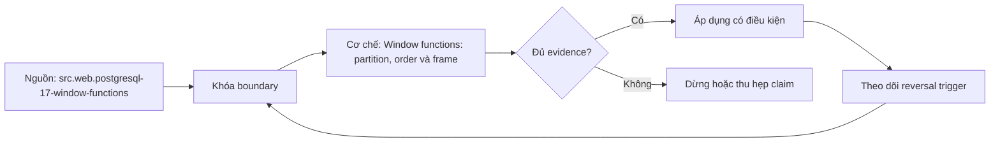

# Window functions: partition, order và frame

> [!abstract] Câu hỏi trung tâm
> Tập row nào tạo một cửa sổ, thứ tự nào xác định quan hệ trước-sau, frame nào đi vào phép tính, và tie được giữ hay cắt theo quy tắc nào?

## 1. Window function giữ row identity

Aggregate với `GROUP BY` thu nhiều input rows thành một row mỗi nhóm. Window function tính qua một tập rows liên quan nhưng vẫn trả một giá trị cho từng input row. Vì vậy có thể hiển thị order detail cùng tổng doanh thu customer, rank trong branch hoặc giá trị row trước mà không làm mất row identity.

Grain đầu ra ở cùng query level thường giữ grain sau `FROM`/`WHERE`/`GROUP BY` trước window. Nếu query đã group thành customer-month rồi mới dùng window, window chạy trên customer-month rows, không trên transactions gốc. Phải ghi grain trước window và grain output.

Window không sửa duplicate hoặc fanout. Nếu join trước đó nhân rows, partition chứa dữ liệu đã nhân và mọi rank/sum đều dựa trên tập sai.

## 2. Cú pháp OVER

Window call có `OVER (...)` hoặc tham chiếu named window. Bên trong có thể có `PARTITION BY`, `ORDER BY` và frame clause. Ba thành phần trả lời ba câu khác nhau: nhóm độc lập nào, thứ tự logic nào trong nhóm, và subset quanh current row nào tham gia phép tính.

Không phải mọi hàm dùng frame như nhau. Ranking functions dựa trên partition và peer groups theo ordering; aggregate window dùng frame. `lag`/`lead` truy cập row ở offset trong ordered partition và không bị frame giới hạn theo cách aggregate window.

Named window giảm lặp nhưng override rules cần đọc kỹ. Tên nên phản ánh partition/order, không dùng `w1` nếu nhiều windows khác semantics.

## 3. PARTITION BY

`PARTITION BY branch_id` khởi động lại calculation ở mỗi branch. Bỏ partition biến toàn result thành một partition. Sai partition thường trả số hợp lệ nhưng sai domain: top 3 toàn công ty thay vì top 3 mỗi chi nhánh; running total nối qua customer.

Partition key cần phù hợp entity identity. Partition theo display name có thể trộn hai customer trùng tên; dùng stable key. Với multi-tenant data, quên `tenant_id` có thể vừa sai metric vừa lộ thứ hạng chéo tenant.

NULL partition key được nhóm cùng nhau theo semantics grouping của window partition. Nếu NULL nghĩa unknown branch, mọi unknown rows nằm một partition; cần policy quarantine hoặc surrogate unknown, không coi mỗi NULL là riêng.

## 4. ORDER BY trong window

Window `ORDER BY` xác định thứ tự logic cho rank, offset và frame; nó không bảo đảm final output order. Muốn hiển thị ổn định cần outer `ORDER BY`. Hai orders có thể khác: xếp hạng theo revenue giảm dần nhưng hiển thị theo branch và rank.

Ordering phải total/deterministic khi yêu cầu row cụ thể. `ORDER BY event_time DESC` không đủ nếu hai events cùng timestamp; thêm `event_id DESC` theo policy. Tie-break không chỉ để ổn định kỹ thuật: nó định nghĩa record nào được coi là latest.

Collation, NULLS FIRST/LAST và timezone ảnh hưởng order. Ghi chúng nếu business outcome phụ thuộc.

## 5. Peer rows và tie

Rows không phân biệt theo các cột trong window `ORDER BY` là peers. Ranking functions xử lý peers khác nhau. Nếu thêm unique ID vào ORDER BY, các rows không còn peer; điều này có thể phá yêu cầu đồng hạng theo score.

Tách business order khỏi deterministic display. Có thể rank chỉ theo score để giữ ties, rồi outer order thêm ID. Nếu cần chọn đúng N rows thay vì N rank groups, phải nói rõ tie policy: cắt tie, include all ties, hay tie-break bằng secondary business dimension.

Fixture bắt buộc có tie ở boundary N. Nếu không, `row_number`, `rank` và `dense_rank` có thể cho output giống và không kiểm được lựa chọn.

## 6. ROW_NUMBER

`row_number()` gán số tuần tự khác nhau cho từng row trong partition theo order. Nó phù hợp chọn đúng một latest row hoặc đúng N physical rows khi tie-break đầy đủ. Nếu ORDER BY không total, row nào nhận số trước trong peer group không được bảo đảm.

Top 3 sản phẩm đúng ba row mỗi branch có thể dùng row_number với order revenue desc, product_id. Nhưng nếu business muốn mọi sản phẩm đồng hạng ở vị trí 3, row_number cắt tie và không phù hợp.

Dedup bằng `row_number() = 1` cần policy winner rõ, không chỉ timestamp có thể trùng. Giữ loser audit và kiểm duplicate cause.

## 7. RANK và DENSE_RANK

`rank()` cho peers cùng rank rồi để khoảng trống: scores 100, 90, 90, 80 nhận 1, 2, 2, 4. `dense_rank()` không để gap: 1, 2, 2, 3. Cả hai giữ peer groups nhưng câu hỏi khác nhau.

Top 3 ranks bằng `rank <= 3` có thể không chứa rank 3 nếu tie ở rank 2 làm rank tiếp là 4. `dense_rank <= 3` lấy ba mức giá trị khác nhau. Số rows có thể vượt ba ở cả hai. Requirement phải nói ba rows, ba thứ hạng competition hay ba mức score.

Không chọn dense_rank chỉ vì số trông liền. Rank semantics phải gắn với nghiệp vụ.

## 8. PERCENT_RANK, CUME_DIST và NTILE

`percent_rank` dựa trên `(rank-1)/(N-1)` và từ 0 đến 1; partition một row cần semantics được DBMS xác định. `cume_dist` là tỷ lệ rows đứng trước hoặc peer với current row, nên giá trị tối thiểu là 1/N. Hai hàm xử lý tie khác nhau.

`ntile(k)` chia ordered partition thành k buckets gần bằng số rows, bucket đầu có thể lớn hơn nếu không chia hết. Nó không tạo các khoảng giá trị bằng nhau và có thể tách rows cùng value sang bucket khác nếu ordering/tie-break cho phép.

Chia năm nhóm chi tiêu bằng ntile là segmentation theo row counts, không phải quintile thresholds độc lập với ties. Báo partition size, tie policy và bucket balance.

## 9. LAG và LEAD

`lag(value, offset, default)` lấy value của row trước theo ordered partition; `lead` lấy row sau. Trước là row trước trong input window, không mặc định là ngày/tháng trước trên lịch. Nếu tháng 2 thiếu, lag của tháng 3 có thể là tháng 1.

Muốn so kỳ lịch liên tiếp, dựng calendar scaffold rồi left join facts trước lag, hoặc self-join theo date arithmetic. Default argument chỉ dùng khi không có row ở offset, không thay NULL value của row tồn tại.

PostgreSQL 17 dùng hành vi tương đương `RESPECT NULLS`; không có option `IGNORE NULLS` chuẩn. Nếu cần previous non-null, phải thiết kế khác và kiểm kỹ.

## 10. FIRST_VALUE, LAST_VALUE và NTH_VALUE

Các hàm này hoạt động trên window frame, không mặc định toàn partition. Với `ORDER BY`, default frame kết thúc ở current row/last peer; `last_value` thường trả current/peer value chứ không phải row cuối partition.

Muốn last của toàn partition, dùng frame explicit `ROWS BETWEEN UNBOUNDED PRECEDING AND UNBOUNDED FOLLOWING`, hoặc order đảo và first_value nếu semantics phù hợp. Luôn review frame khi gặp last/nth.

`nth_value` trả NULL nếu frame không có row thứ n. Không suy diễn đó là source NULL mà không có marker.

## 11. Window frame mặc định

Khi có `ORDER BY`, default frame của PostgreSQL kéo từ đầu partition đến current row và gồm peer rows của current row. Khi không có order, frame thường là toàn partition. Điều này khiến aggregate window với order tạo running aggregate nhưng peers có thể cùng một kết quả.

Không dựa default trong giáo trình khi outcome phụ thuộc frame. Viết explicit frame để người đọc thấy row nào được tính. `ROWS`, `RANGE` và `GROUPS` định nghĩa đơn vị khác nhau.

Default phù hợp không có nghĩa là nên ẩn. Explicitness giảm lỗi khi ORDER BY thay đổi.

## 12. Vị trí hợp lệ trong query

Window functions hoạt động sau `WHERE`, `GROUP BY` và `HAVING` của query level và chỉ hợp lệ trong `SELECT` list hoặc `ORDER BY` theo tài liệu PostgreSQL. Vì vậy không thể viết trực tiếp `WHERE row_number() <= 3` cùng level.

Đặt window calculation trong subquery/CTE, rồi filter rank ở outer query. Outer filter cần giữ grain và các columns audit. Một số DBMS có `QUALIFY`, nhưng PostgreSQL 17 không dùng cú pháp đó.

Filtering trước hay sau window đổi population và rank. `WHERE status='active'` trước window xếp hạng active rows; filter outer sau rank trả active rows nằm trong ranking của all rows nếu status chỉ project vào trong.

## 13. Nhiều cửa sổ trong một query

Một report có thể rank trong branch, running total theo customer và global percentile. Mỗi window cần contract riêng. Named windows giúp reuse partition/order; nhưng không ép chia sẻ khi semantics khác.

Execution có thể cần nhiều sorts nếu orders không tương thích. Tối ưu chỉ sau correctness. Có thể sắp xếp definitions để planner reuse, index hỗ trợ prefix order, hoặc pre-aggregate đúng grain.

Không ép cùng order chỉ để có một sort nếu làm sai metric.

## 14. Top N per group

Quy trình: xác định source grain; tính metric mỗi `(branch, product)` nếu source detail; xác định tie policy; chọn ranking function; xếp hạng trong `PARTITION BY branch`; lọc ngoài; outer order để hiển thị.

Nếu revenue tie và yêu cầu cùng hạng, dùng rank/dense_rank theo định nghĩa. Nếu dashboard chỉ có ba slot, dùng row_number với tie-break business. Ghi số rows tối đa dự kiến; rank có thể trả hơn N.

Đối soát bằng cách chọn vài branch, sort độc lập và so boundary. Fixture có tie ở hạng 2/3, branch ít hơn N sản phẩm và NULL metric.

## 15. Latest row per entity

`row_number() over (partition by customer_id order by order_time desc, order_id desc)=1` chọn một row theo policy. Nếu trạng thái update có ingestion time và event time khác, requirement phải quyết định order nào đại diện latest.

Không dùng `max(time)` rồi chọn cột khác không gắn row. Window giữ toàn row winner. Kiểm duplicate timestamp, late event, NULL time và tenant partition.

Nếu cần latest as of cutoff, filter event time trước window; filter sau có thể chọn latest toàn lịch sử rồi loại nó, bỏ mất previous valid row.

## 16. Lab ba bài toán

Lab gồm top 3 sản phẩm mỗi branch, latest order mỗi customer và `ntile(5)` cho chi tiêu. Với top 3, chạy bốn hàm `row_number`, `rank`, `dense_rank`, `ntile` trên cùng tie fixture và giải thích khác biệt; không tuyên bố chúng thay thế nhau.

Mỗi query ghi partition, order, peer definition, frame nếu có, output grain và tie policy. Kết quả được đối soát bằng sort/selection độc lập. Plan được lưu nhưng correctness không suy từ plan.

Artifact gồm SQL, seed data, expected table viết trước khi chạy, output và giải thích function được chọn.

## 17. Câu hỏi tự kiểm tra

1. Window function khác grouped aggregate ở row identity thế nào?
2. Partition, order và frame trả lời ba câu hỏi gì?
3. Row_number, rank và dense_rank xử lý tie ra sao?
4. Vì sao window ORDER BY không bảo đảm final output order?
5. Tại sao lag không đồng nghĩa previous calendar period?
6. Vì sao filter rank phải ở outer query trong PostgreSQL 17?

## 18. Giới hạn và điều chưa cho phép kết luận

- Tie policy là quyết định nghiệp vụ, không thể suy từ tên hàm.
- Plan/performance phụ thuộc data, indexes, work memory và PostgreSQL settings.
- Window correctness không sửa source grain hoặc join fanout sai.
- Các semantics DBMS-specific cần kiểm nếu chuyển khỏi PostgreSQL 17.
- Lab chưa chạy trong note; output và evidence thuộc `after-note.md`.

## Reference
1. [[SRC-POSTGRESQL-17-WINDOW-FUNCTIONS]]: tutorial, functions và frame semantics.
2. [[SRC-POSTGRESQL-17-QUERY-EXPRESSIONS]]: vị trí window trong logical pipeline.

## Source coverage

| Source slice | Nội dung phải giữ | Vị trí trong note | Trạng thái |
|---|---|---|---|
| [[SRC-POSTGRESQL-17-WINDOW-FUNCTIONS]] | partition, peers, ranking, lag/lead, default frame | §§1-11 | Đã giữ semantics PostgreSQL 17 |
| [[SRC-POSTGRESQL-17-QUERY-EXPRESSIONS]] | window sau WHERE/GROUP/HAVING; query level | §12 | Đã gắn với filter pattern |
| Tổng hợp DE-L123 | top N, latest row, ntile, tie fixture | §§14-16 | Đã thành lab kiểm được |

## Key takeaways
- Window giữ row identity nhưng chạy trên grain đã được tạo trước nó.
- Partition chọn nhóm, order định nghĩa trước-sau và peers, frame chọn subset tính toán.
- Ranking functions không tương đương khi có tie; fixture phải đặt tie tại boundary.
- Window ORDER BY không thay final ORDER BY.
- `lag` đọc row trước, không tự điền kỳ lịch bị thiếu.

<!-- ATOMIC-EXECUTION-CAPSULE:START -->

## Execution capsule: kiểm chứng `wiki.database.window-partition-order-frame`

> [!important] Phân loại mệnh đề
> Với `wiki.database.window-partition-order-frame`, sơ đồ, ví dụ và artifact về **Window functions: partition, order và frame** là **synthesis để kiểm chứng**; chúng không phải trích dẫn hay case nguyên văn của nguồn.

### Sơ đồ cơ chế và điểm kiểm soát



Đọc sơ đồ `wiki.database.window-partition-order-frame` từ trái sang phải: source chỉ cung cấp claim ban đầu cho **Window functions: partition, order và frame**; quyết định chỉ được đi tiếp sau khi boundary, evidence và điều kiện đảo quyết định đã hiện hữu.

### Ví dụ làm việc có thể bác bỏ

**Input.** Một đội cần trả lời: Làm sao dùng window function để giữ row identity, chọn partition/order/frame đúng và xử lý tie một cách kiểm chứng được? cho một phạm vi nhỏ, có owner và deadline rõ.

**Decision.** Đội áp dụng **Window functions: partition, order và frame** trên control và variant chỉ khác một assumption; expected result và hard constraints được khóa trước khi chạy.

**Outcome.** Với `wiki.database.window-partition-order-frame`, nếu observation vi phạm hard constraint hoặc oracle độc lập không xác nhận **Window functions: partition, order và frame**, đội thu hẹp claim hay đảo quyết định. Nếu đạt, kết luận vẫn kèm scope, version và review date; một lần thành công không được nâng thành quy luật phổ quát.

### Artifact thực thi tối thiểu

```sql
-- Verification harness for: Window functions: partition, order và frame
WITH evidence AS (
    SELECT 'wiki.database.window-partition-order-frame' AS concept_id,
           'boundary_declared' AS check_name, 1 AS passed
    UNION ALL
    SELECT 'wiki.database.window-partition-order-frame', 'independent_oracle', 1
    UNION ALL
    SELECT 'wiki.database.window-partition-order-frame', 'reversal_trigger_recorded', 1
)
SELECT concept_id,
       MIN(passed) AS all_hard_checks_pass,
       COUNT(*) AS evidence_items
FROM evidence
GROUP BY concept_id
HAVING MIN(passed) = 1;
```

Artifact của `wiki.database.window-partition-order-frame` buộc người dùng ghi boundary, oracle và reversal trigger cho **Window functions: partition, order và frame**. Các giá trị minh họa phải được thay bằng evidence thật trước khi dùng cho quyết định.

### Tự kiểm tra trước khi tái sử dụng

1. Bạn có thể trả lời `Làm sao dùng window function để giữ row identity, chọn partition/order/frame đúng và xử lý tie một cách kiểm chứng được?` bằng một câu mà không kéo thêm concept thứ hai không?
2. Source locator nào đỡ cho claim, và phần nào chỉ là synthesis trong note?
3. Observation nào khiến bạn dừng, thu hẹp hoặc đảo quyết định?
4. Artifact nào cho phép một reviewer độc lập tái hiện kết quả?

<!-- ATOMIC-EXECUTION-CAPSULE:END -->
