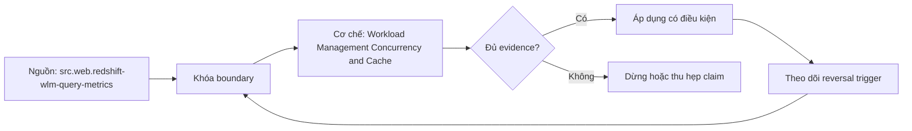

# Workload Management Concurrency and Cache

> [!abstract] Câu hỏi trung tâm
> Tách queueing khỏi execution slowdown dưới concurrency như thế nào, và chọn admission, isolation, scaling hay query tuning dựa trên evidence nào?

## 1. Query lifecycle clock

Client-observed latency có thể gồm connection/auth, admission queue, planning/compile, execution, result serialization/transfer và retries. Engine elapsed có thể loại client transfer hoặc include planning tùy metric. L214 tối thiểu tách queue time và execution time; nếu available, giữ planning và fetch riêng. Kiểm unit, clock boundary và relation thay vì giả định `elapsed = queue + execution` chính xác tuyệt đối. Redshift SYS fields là một implementation contract, không phải tên field chung.

## 2. Admission control

Khi arrival rate và service demand vượt capacity, cho mọi query chạy có thể làm cache thrash, memory pressure, spill và context switching khiến throughput giảm. Admission giới hạn running work; excess waits hoặc rejects/deadlines. Queue tăng response time nhưng bảo vệ execution efficiency và failure rate. Policy cần max concurrency, memory/compute allocation, priority/fairness, timeout và backpressure. Little-style reasoning chỉ dùng khi system gần steady state và definitions nhất quán; bursty workload cần distribution/time series.

## 3. Queue bottleneck và heavy-query bottleneck

Queue-bound case: service time ổn khi chạy, queue time tăng theo load và running slots saturated. Heavy-query case: một query có execution CPU/I/O/spill cao ngay cả khi chạy một mình; queue có thể là hậu quả. Thêm concurrency capacity giúp eligible queued work nếu shared dependency còn headroom; không sửa bad scan/join. Query rewrite giảm service demand và có thể giảm cả queue gián tiếp. Dùng controlled A/B: capacity/admission change với same query, rồi query rewrite với same capacity.

## 4. Isolation và priority

Tách interactive, ETL, ad-hoc và maintenance vào queues/resource groups/warehouses giảm head-of-line blocking và cho SLO khác nhau. Isolation cứng tăng idle capacity/cache duplication; isolation mềm có noisy-neighbor risk. Priority không tạo resource; nó đổi thứ tự/weight và có starvation risk. Short-query acceleration có classification error. Báo per-class arrival, queue, execution, completion, rejection, resource share và SLO attainment; global average có thể đẹp trong khi một class đói.

## 5. Concurrency scaling

Một số services route eligible queries sang extra clusters/capacity khi queue hình thành. Điều này giảm queue cho supported work nhưng có startup, limits, eligibility và incremental cost. Query có transaction/temp object/UDF hoặc operation unsupported có thể ở lại main path tùy product. Capture compute_type/cluster, queue before/after, execution, extra capacity time và cost. Không gọi autoscaling thành query tuning; nó phân bổ thêm service capacity.

## 6. Cache làm sai load test

Result cache có thể trả identical query mà không thực thi; data cache giảm remote I/O; plan cache giảm compilation. Repeating exact SQL làm hit ratio không đại diện dashboard parameter distribution. Với performance execution test, disable/bypass result cache và verify hit flag; prime hoặc randomize data-cache state theo scenario. Với production capacity test, cache là system behavior hợp lệ nhưng workload trace phải đại diện reuse. Báo cache policy và hit by layer.

## 7. Load model và số đo

Closed-loop virtual users chờ response rồi gửi request tiếp, nên khi latency tăng offered load tự giảm; open-loop schedule giữ arrival rate và lộ queue overload nhưng cần backpressure an toàn. Dùng ramp hoặc stepped arrival, warm-up, fixed window và stop thresholds. Báo throughput, arrivals, running/queued, queue p50/p95/p99, execution p50/p95/p99, errors/timeouts, spill, CPU/memory/I/O và per-class fairness. Coordinated omission phải được xem xét nếu load generator bỏ qua requests đáng lẽ đến trong pause.

## 8. Hai ca và proof of non-transfer

Ca Q dùng nhiều short queries để slot limit tạo queue nhưng service time ổn; remediation là admission/concurrency capacity hoặc isolation. Ca H dùng một heavy scan/join gây execution time/spill cao ở low concurrency; remediation là pruning/layout/query plan. Áp nhầm: query rewrite trivial không xóa queue nếu arrival vượt capacity; thêm queue slots có thể làm heavy query tranh memory và chậm hơn. Lab đạt khi tách times ở mọi load step, result cache controlled, fix đúng giảm target metric và wrong fix được chạy/giải thích bằng counters.

## 9. Ma trận kiểm chứng từng mệnh đề

Mỗi mệnh đề về latency, scaling, cache, concurrency hoặc cost cần counterfactual, correctness oracle và counter ở đúng boundary. Tên kiến trúc, plan label, elapsed time hoặc rate card riêng lẻ chưa đủ để quy nguyên nhân.

### 9.1. client latency có nhiều clock boundaries

**Mệnh đề cần kiểm.** client latency có nhiều clock boundaries.

**Cách kiểm.** Dùng controlled stepped load; tách queue/planning/execution/fetch, cache-hit flag, running/queued, per-class tails, errors, spill và throughput; chạy đúng-fix/sai-fix A/B. Ghi engine/version, workload shape, controlled variables, expected counter, failure signal và reversal condition.

**Bằng chứng đạt cho `wiki.olap.workload-management-concurrency-cache`.** Lưu source/query/config hashes, plans/profiles, raw counters, result oracle, repetitions, units và reviewer. Khi lab chưa chạy, chỉ giữ protocol và expected observations; không viết chúng như kết quả thực nghiệm.

### 9.2. queue time và execution time phải có metric definitions

**Mệnh đề cần kiểm.** queue time và execution time phải có metric definitions.

**Cách kiểm.** Dùng controlled stepped load; tách queue/planning/execution/fetch, cache-hit flag, running/queued, per-class tails, errors, spill và throughput; chạy đúng-fix/sai-fix A/B. Ghi engine/version, workload shape, controlled variables, expected counter, failure signal và reversal condition.

**Bằng chứng đạt cho `wiki.olap.workload-management-concurrency-cache`.** Lưu source/query/config hashes, plans/profiles, raw counters, result oracle, repetitions, units và reviewer. Khi lab chưa chạy, chỉ giữ protocol và expected observations; không viết chúng như kết quả thực nghiệm.

### 9.3. admission queue có thể bảo vệ throughput và memory

**Mệnh đề cần kiểm.** admission queue có thể bảo vệ throughput và memory.

**Cách kiểm.** Dùng controlled stepped load; tách queue/planning/execution/fetch, cache-hit flag, running/queued, per-class tails, errors, spill và throughput; chạy đúng-fix/sai-fix A/B. Ghi engine/version, workload shape, controlled variables, expected counter, failure signal và reversal condition.

**Bằng chứng đạt cho `wiki.olap.workload-management-concurrency-cache`.** Lưu source/query/config hashes, plans/profiles, raw counters, result oracle, repetitions, units và reviewer. Khi lab chưa chạy, chỉ giữ protocol và expected observations; không viết chúng như kết quả thực nghiệm.

### 9.4. queue tăng không tự chứng minh thiếu total compute

**Mệnh đề cần kiểm.** queue tăng không tự chứng minh thiếu total compute.

**Cách kiểm.** Dùng controlled stepped load; tách queue/planning/execution/fetch, cache-hit flag, running/queued, per-class tails, errors, spill và throughput; chạy đúng-fix/sai-fix A/B. Ghi engine/version, workload shape, controlled variables, expected counter, failure signal và reversal condition.

**Bằng chứng đạt cho `wiki.olap.workload-management-concurrency-cache`.** Lưu source/query/config hashes, plans/profiles, raw counters, result oracle, repetitions, units và reviewer. Khi lab chưa chạy, chỉ giữ protocol và expected observations; không viết chúng như kết quả thực nghiệm.

### 9.5. heavy query phải tái hiện ở low concurrency

**Mệnh đề cần kiểm.** heavy query phải tái hiện ở low concurrency.

**Cách kiểm.** Dùng controlled stepped load; tách queue/planning/execution/fetch, cache-hit flag, running/queued, per-class tails, errors, spill và throughput; chạy đúng-fix/sai-fix A/B. Ghi engine/version, workload shape, controlled variables, expected counter, failure signal và reversal condition.

**Bằng chứng đạt cho `wiki.olap.workload-management-concurrency-cache`.** Lưu source/query/config hashes, plans/profiles, raw counters, result oracle, repetitions, units và reviewer. Khi lab chưa chạy, chỉ giữ protocol và expected observations; không viết chúng như kết quả thực nghiệm.

### 9.6. thêm capacity không sửa scan join hoặc spill root cause

**Mệnh đề cần kiểm.** thêm capacity không sửa scan join hoặc spill root cause.

**Cách kiểm.** Dùng controlled stepped load; tách queue/planning/execution/fetch, cache-hit flag, running/queued, per-class tails, errors, spill và throughput; chạy đúng-fix/sai-fix A/B. Ghi engine/version, workload shape, controlled variables, expected counter, failure signal và reversal condition.

**Bằng chứng đạt cho `wiki.olap.workload-management-concurrency-cache`.** Lưu source/query/config hashes, plans/profiles, raw counters, result oracle, repetitions, units và reviewer. Khi lab chưa chạy, chỉ giữ protocol và expected observations; không viết chúng như kết quả thực nghiệm.

### 9.7. query rewrite có thể giảm queue gián tiếp qua service demand

**Mệnh đề cần kiểm.** query rewrite có thể giảm queue gián tiếp qua service demand.

**Cách kiểm.** Dùng controlled stepped load; tách queue/planning/execution/fetch, cache-hit flag, running/queued, per-class tails, errors, spill và throughput; chạy đúng-fix/sai-fix A/B. Ghi engine/version, workload shape, controlled variables, expected counter, failure signal và reversal condition.

**Bằng chứng đạt cho `wiki.olap.workload-management-concurrency-cache`.** Lưu source/query/config hashes, plans/profiles, raw counters, result oracle, repetitions, units và reviewer. Khi lab chưa chạy, chỉ giữ protocol và expected observations; không viết chúng như kết quả thực nghiệm.

### 9.8. isolation có idle capacity và cache duplication cost

**Mệnh đề cần kiểm.** isolation có idle capacity và cache duplication cost.

**Cách kiểm.** Dùng controlled stepped load; tách queue/planning/execution/fetch, cache-hit flag, running/queued, per-class tails, errors, spill và throughput; chạy đúng-fix/sai-fix A/B. Ghi engine/version, workload shape, controlled variables, expected counter, failure signal và reversal condition.

**Bằng chứng đạt cho `wiki.olap.workload-management-concurrency-cache`.** Lưu source/query/config hashes, plans/profiles, raw counters, result oracle, repetitions, units và reviewer. Khi lab chưa chạy, chỉ giữ protocol và expected observations; không viết chúng như kết quả thực nghiệm.

### 9.9. priority không tạo thêm resource

**Mệnh đề cần kiểm.** priority không tạo thêm resource.

**Cách kiểm.** Dùng controlled stepped load; tách queue/planning/execution/fetch, cache-hit flag, running/queued, per-class tails, errors, spill và throughput; chạy đúng-fix/sai-fix A/B. Ghi engine/version, workload shape, controlled variables, expected counter, failure signal và reversal condition.

**Bằng chứng đạt cho `wiki.olap.workload-management-concurrency-cache`.** Lưu source/query/config hashes, plans/profiles, raw counters, result oracle, repetitions, units và reviewer. Khi lab chưa chạy, chỉ giữ protocol và expected observations; không viết chúng như kết quả thực nghiệm.

### 9.10. autoscaling chỉ áp cho eligible work và có cost

**Mệnh đề cần kiểm.** autoscaling chỉ áp cho eligible work và có cost.

**Cách kiểm.** Dùng controlled stepped load; tách queue/planning/execution/fetch, cache-hit flag, running/queued, per-class tails, errors, spill và throughput; chạy đúng-fix/sai-fix A/B. Ghi engine/version, workload shape, controlled variables, expected counter, failure signal và reversal condition.

**Bằng chứng đạt cho `wiki.olap.workload-management-concurrency-cache`.** Lưu source/query/config hashes, plans/profiles, raw counters, result oracle, repetitions, units và reviewer. Khi lab chưa chạy, chỉ giữ protocol và expected observations; không viết chúng như kết quả thực nghiệm.

### 9.11. result cache hit phải được phát hiện riêng

**Mệnh đề cần kiểm.** result cache hit phải được phát hiện riêng.

**Cách kiểm.** Dùng controlled stepped load; tách queue/planning/execution/fetch, cache-hit flag, running/queued, per-class tails, errors, spill và throughput; chạy đúng-fix/sai-fix A/B. Ghi engine/version, workload shape, controlled variables, expected counter, failure signal và reversal condition.

**Bằng chứng đạt cho `wiki.olap.workload-management-concurrency-cache`.** Lưu source/query/config hashes, plans/profiles, raw counters, result oracle, repetitions, units và reviewer. Khi lab chưa chạy, chỉ giữ protocol và expected observations; không viết chúng như kết quả thực nghiệm.

### 9.12. data cache và result cache có scope khác nhau

**Mệnh đề cần kiểm.** data cache và result cache có scope khác nhau.

**Cách kiểm.** Dùng controlled stepped load; tách queue/planning/execution/fetch, cache-hit flag, running/queued, per-class tails, errors, spill và throughput; chạy đúng-fix/sai-fix A/B. Ghi engine/version, workload shape, controlled variables, expected counter, failure signal và reversal condition.

**Bằng chứng đạt cho `wiki.olap.workload-management-concurrency-cache`.** Lưu source/query/config hashes, plans/profiles, raw counters, result oracle, repetitions, units và reviewer. Khi lab chưa chạy, chỉ giữ protocol và expected observations; không viết chúng như kết quả thực nghiệm.

### 9.13. closed loop che offered-load overload

**Mệnh đề cần kiểm.** closed loop che offered-load overload.

**Cách kiểm.** Dùng controlled stepped load; tách queue/planning/execution/fetch, cache-hit flag, running/queued, per-class tails, errors, spill và throughput; chạy đúng-fix/sai-fix A/B. Ghi engine/version, workload shape, controlled variables, expected counter, failure signal và reversal condition.

**Bằng chứng đạt cho `wiki.olap.workload-management-concurrency-cache`.** Lưu source/query/config hashes, plans/profiles, raw counters, result oracle, repetitions, units và reviewer. Khi lab chưa chạy, chỉ giữ protocol và expected observations; không viết chúng như kết quả thực nghiệm.

### 9.14. global average che per-class starvation

**Mệnh đề cần kiểm.** global average che per-class starvation.

**Cách kiểm.** Dùng controlled stepped load; tách queue/planning/execution/fetch, cache-hit flag, running/queued, per-class tails, errors, spill và throughput; chạy đúng-fix/sai-fix A/B. Ghi engine/version, workload shape, controlled variables, expected counter, failure signal và reversal condition.

**Bằng chứng đạt cho `wiki.olap.workload-management-concurrency-cache`.** Lưu source/query/config hashes, plans/profiles, raw counters, result oracle, repetitions, units và reviewer. Khi lab chưa chạy, chỉ giữ protocol và expected observations; không viết chúng như kết quả thực nghiệm.

### 9.15. wrong-fix experiment là bằng chứng phân biệt diagnosis

**Mệnh đề cần kiểm.** wrong-fix experiment là bằng chứng phân biệt diagnosis.

**Cách kiểm.** Dùng controlled stepped load; tách queue/planning/execution/fetch, cache-hit flag, running/queued, per-class tails, errors, spill và throughput; chạy đúng-fix/sai-fix A/B. Ghi engine/version, workload shape, controlled variables, expected counter, failure signal và reversal condition.

**Bằng chứng đạt cho `wiki.olap.workload-management-concurrency-cache`.** Lưu source/query/config hashes, plans/profiles, raw counters, result oracle, repetitions, units và reviewer. Khi lab chưa chạy, chỉ giữ protocol và expected observations; không viết chúng như kết quả thực nghiệm.

## 10. Quy trình phản biện

1. Viết câu hỏi đo lường và decision cần hỗ trợ trước khi chọn metric.
2. Khóa query semantics, snapshot, output oracle và unit của mọi số.
3. Vẽ boundaries: client, queue, planner, source, worker, exchange, cache, spill và billing.
4. Thay một cơ chế; ghi mọi thay đổi algorithm/config do engine tự thực hiện.
5. Dùng distribution và critical path; không để average che tails hoặc skew.
6. Viết counterexample, reversal condition và stop threshold trước khi chạy.
7. Tách estimate, configured intent, runtime observation và invoice fact.
8. Nếu không kiểm soát được cache, resource hoặc rate contract, ghi giới hạn thay vì kết luận nhân quả.

## 11. Câu hỏi tự kiểm tra

1. Mệnh đề đang nằm ở tầng kiến trúc, scheduler, operator, hardware hay billing?
2. Counter nào quan sát trực tiếp cơ chế đó và proxy nào dễ gây nhầm?
3. Correctness/SLO nào phải giữ trước khi gọi một phương án tốt hơn?
4. Cache, concurrency, statistics, data shape hay rate card nào có thể đảo kết luận?
5. Intervention nào bác bỏ diagnosis hiện tại?
6. Kết luận nào mới là protocol, chưa phải observation?

## 12. Giới hạn và điều chưa cho phép kết luận

- Chưa chạy cluster scaling, join/spill, cache, concurrency hoặc billing reconciliation lab; note mô tả protocol và evidence contract.
- Tài liệu sản phẩm được kiểm ngày 2026-10-01; field, feature, pricing và behavior có thể đổi theo version, region và contract.
- Amdahl, Gustafson, workload matrices và cost equations là mô hình; chúng không thay runtime counters hay invoice export.
- Không suy vendor superiority từ paper hoặc một benchmark; workload, correctness, SLO, operation và price contract phải cùng phạm vi.
- Note giữ trạng thái `review` cho tới khi chủ dự án duyệt semantic meaning.

## Reference
1. [[SRC-REDSHIFT-WLM-QUERY-METRICS]]
2. [[SRC-REDSHIFT-CONCURRENCY-SCALING]]
3. [[SRC-SNOWFLAKE-ELASTIC-DATA-WAREHOUSE]]

## Source coverage

| Source slice | Nội dung sử dụng | Trạng thái |
|---|---|---|
| [[SRC-REDSHIFT-WLM-QUERY-METRICS]] | Khái niệm, mechanism hoặc evidence boundary liên quan | Đã đọc locator trong source record; không suy ngoài phạm vi |
| [[SRC-REDSHIFT-CONCURRENCY-SCALING]] | Khái niệm, mechanism hoặc evidence boundary liên quan | Đã đọc locator trong source record; không suy ngoài phạm vi |
| [[SRC-SNOWFLAKE-ELASTIC-DATA-WAREHOUSE]] | Khái niệm, mechanism hoặc evidence boundary liên quan | Đã đọc locator trong source record; không suy ngoài phạm vi |

## Key takeaways
- Queue time và execution time dẫn tới interventions khác nhau; wrong-fix experiment giúp chứng minh diagnosis.
- Estimate và configured intent phải được tách khỏi runtime observation và invoice fact.
- Correctness oracle, units, cache state, workload shape và controlled variables đi trước performance/cost claim.
- Average phải đi cùng distributions, tails, critical path và per-class hoặc per-task counters.
- Chưa chạy lab thì artifact là giáo trình đã kiểm cấu trúc, chưa phải benchmark hay production certification.

<!-- ATOMIC-EXECUTION-CAPSULE:START -->

## Execution capsule — kiểm chứng `wiki.olap.workload-management-concurrency-cache`

> [!important] Phân loại mệnh đề
> Với `wiki.olap.workload-management-concurrency-cache`, sơ đồ, ví dụ và artifact về **Workload Management Concurrency and Cache** là **synthesis để kiểm chứng**; chúng không phải trích dẫn hay case nguyên văn của nguồn.

### Sơ đồ cơ chế và điểm kiểm soát



Đọc sơ đồ `wiki.olap.workload-management-concurrency-cache` từ trái sang phải: source chỉ cung cấp claim ban đầu cho **Workload Management Concurrency and Cache**; quyết định chỉ được đi tiếp sau khi boundary, evidence và điều kiện đảo quyết định đã hiện hữu.

### Ví dụ làm việc có thể bác bỏ

**Input.** Một đội cần trả lời: “Tách queueing khỏi execution slowdown dưới concurrency như thế nào, và chọn admission, isolation, scaling hay query tuning dựa trên evidence nào?” cho một phạm vi nhỏ, có owner và deadline rõ.

**Decision.** Đội áp dụng **Workload Management Concurrency and Cache** trên control và variant chỉ khác một assumption; expected result và hard constraints được khóa trước khi chạy.

**Outcome.** Với `wiki.olap.workload-management-concurrency-cache`, nếu observation vi phạm hard constraint hoặc oracle độc lập không xác nhận **Workload Management Concurrency and Cache**, đội thu hẹp claim hay đảo quyết định. Nếu đạt, kết luận vẫn kèm scope, version và review date; một lần thành công không được nâng thành quy luật phổ quát.

### Artifact thực thi tối thiểu

```sql
-- Verification harness for: Workload Management Concurrency and Cache
WITH evidence AS (
    SELECT 'wiki.olap.workload-management-concurrency-cache' AS concept_id,
           'boundary_declared' AS check_name, 1 AS passed
    UNION ALL
    SELECT 'wiki.olap.workload-management-concurrency-cache', 'independent_oracle', 1
    UNION ALL
    SELECT 'wiki.olap.workload-management-concurrency-cache', 'reversal_trigger_recorded', 1
)
SELECT concept_id,
       MIN(passed) AS all_hard_checks_pass,
       COUNT(*) AS evidence_items
FROM evidence
GROUP BY concept_id
HAVING MIN(passed) = 1;
```

Artifact của `wiki.olap.workload-management-concurrency-cache` buộc người dùng ghi boundary, oracle và reversal trigger cho **Workload Management Concurrency and Cache**. Các giá trị minh họa phải được thay bằng evidence thật trước khi dùng cho quyết định.

### Tự kiểm tra trước khi tái sử dụng

1. Bạn có thể trả lời `Tách queueing khỏi execution slowdown dưới concurrency như thế nào, và chọn admission, isolation, scaling hay query tuning dựa trên evidence nào?` bằng một câu mà không kéo thêm concept thứ hai không?
2. Source locator nào đỡ cho claim, và phần nào chỉ là synthesis trong note?
3. Observation nào khiến bạn dừng, thu hẹp hoặc đảo quyết định?
4. Artifact nào cho phép một reviewer độc lập tái hiện kết quả?

<!-- ATOMIC-EXECUTION-CAPSULE:END -->
