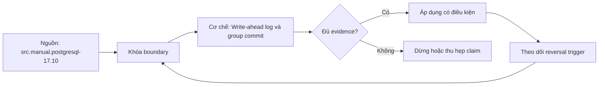

# Write-ahead log và group commit

> [!abstract] Câu hỏi trung tâm
> Khi PostgreSQL báo `COMMIT` thành công, dữ liệu nào đã bền vững ở đâu, WAL-before-data được cưỡng chế thế nào, và vì sao một lần sync có thể phục vụ nhiều transaction?

## 1. Tách data page khỏi commit path

Nếu commit phải ghi bền vững mọi heap/index page đã sửa, mỗi transaction có thể phải chờ nhiều random writes. WAL thay đổi điều kiện: mô tả thay đổi được ghi vào append-only log trước; data pages có thể flush sau. Khi crash, engine dùng log để làm lại thay đổi đã commit nhưng chưa có trong data files.

WAL không loại bỏ data-page writes. Nó tách thời điểm commit acknowledgement khỏi thời điểm page cuối cùng tới storage. Checkpoint/background writer xử lý data pages về sau. Điều kiện an toàn là WAL liên quan phải durable trước khi một dirty page phụ thuộc vào nó được phép durable.

## 2. Write-ahead rule

Hai ràng buộc cốt lõi là: log record mô tả page change phải được flush trước page đó; commit record cùng mọi WAL trước nó của transaction phải durable trước khi synchronous commit trả success. Page LSN và WAL flush position giúp engine kiểm thứ tự.

Nếu page đi trước log, crash có thể để data file ở trạng thái không có lịch sử đủ để phục hồi. Nếu acknowledgement đi trước durable commit record trong chế độ synchronous, client tin một transaction đã bền vững dù crash có thể làm mất nó.

Rule này nói về thứ tự bền vững, không đơn thuần thứ tự gọi `write()`. OS/controller/device caches có thể giữ data; sync primitive và hardware honesty là phần của contract.

## 3. WAL record và LSN

WAL là chuỗi records có header và payload do resource manager tương ứng diễn giải. LSN trong PostgreSQL là offset byte tăng đơn điệu trong WAL. Nó định vị record, so tiến độ replication/recovery và tính khoảng WAL bytes giữa hai thời điểm.

LSN không phải wall-clock timestamp và không tự là transaction ID. Page header giữ LSN của WAL change gần nhất liên quan để recovery biết record nào đã phản ánh. Một record có thể chứa block reference, delta hoặc full-page image tùy operation.

## 4. WAL buffers, write và sync

Backend chèn record vào shared WAL buffers. Ghi buffers sang kernel page cache và buộc kernel/storage xác nhận bền vững là hai bước có thể khác. Trong PostgreSQL, counters `wal_write`/`wal_write_time` và `wal_sync`/`wal_sync_time` khi cấu hình thích hợp giúp tách chúng.

`wal_sync_method` chọn cơ chế yêu cầu kernel đồng bộ; hiệu quả phụ thuộc platform. `pg_test_fsync` đo primitives trên máy mục tiêu, nhưng không thay benchmark workload. Drive/controller báo thành công sai có thể phá durability dù DBMS gọi đúng API.

## 5. Commit record là ranh giới

Trong synchronous local commit, transaction chỉ được coi là durable sau khi WAL được flush ít nhất tới LSN commit. Data pages chưa cần flush. Nếu crash sau acknowledgement, REDO dựng lại thay đổi từ WAL.

Vừa chạy statement cuối chưa phải commit. Transaction có thể ở trạng thái partially committed trong mô hình học thuật: logic đã xong nhưng commit durability chưa hoàn tất. Client timeout/disconnect quanh ranh giới commit tạo outcome ambiguity; retry mù có thể lặp business effect. Application cần idempotency/reconciliation riêng.

## 6. Group commit

Nếu nhiều sessions đến ranh giới commit gần nhau, một process có thể flush WAL tới position cao nhất, qua đó làm durable commit records của nhiều transaction. Fixed cost của sync được khấu hao, tăng throughput. PostgreSQL có thể hình thành group tự nhiên ngay cả khi `commit_delay=0` khi sessions xếp hàng trong lúc flush đang diễn ra.

`commit_delay` mở rộng cửa sổ cho siblings tham gia group khi điều kiện concurrency thỏa. Nó có thể tăng throughput trên workload commit-bound, nhưng cố ý thêm wait và có thể tăng latency đến mức throughput cũng giảm. Không nói group commit tăng throughput và chỉ tăng latency nhẹ nếu chưa đo distribution.

## 7. Ba mode cần phân biệt

Mode thứ nhất: synchronous local commit (`synchronous_commit=on` nếu không chờ remote theo cấu hình khác) đợi local WAL flush trước success. Mode thứ hai: asynchronous commit (`off`) trả success trước local flush; crash có thể làm mất một số transaction mới nhất nhưng recovery vẫn về state nhất quán. Mode thứ ba: `fsync=off` vô hiệu hóa nhiều bảo đảm synchronization toàn server và có thể dẫn tới corruption sau OS/hardware crash.

Async commit không đồng nghĩa tắt fsync. Nó nới acknowledgment boundary theo transaction/session; WAL writer vẫn flush, write-ahead ordering vẫn được duy trì. `fsync=off` là thay đổi blast radius lớn và không phải cấu hình benchmark an toàn để mô phỏng async commit.

## 8. Synchronous replication là trục khác

`synchronous_commit` còn có các mức remote semantics tùy PostgreSQL configuration, chẳng hạn chờ remote write/flush/apply. Local WAL durability và replica acknowledgment là hai câu hỏi. Bài này đo ba cấu hình phải đặt tên exact value và topology; không gộp ba mức durability thành ba nhãn chung.

Replication commit có thêm network, standby I/O và availability trade-off. Chờ remote flush giảm một số failure windows nhưng không thay backup, corruption protection hoặc business idempotency.

## 9. Full-page write và torn page

WAL delta có thể không đủ nếu data page bị partial write. PostgreSQL mặc định ghi full-page image ở lần sửa đầu sau checkpoint để phục hồi page nhất quán. Điều này làm WAL volume tăng sau checkpoint; checkpoint quá thường xuyên có thể tạo thêm full-page images.

Không tắt `full_page_writes` chỉ để benchmark đẹp nếu storage stack không có bảo đảm tương đương. Data checksums phát hiện một số corruption nhưng không tự sửa; WAL, backup và redundancy giải các lớp khác nhau.

## 10. WAL và data amplification

Một business write có thể tạo heap, index, WAL, full-page image, replication và checkpoint writes. Đo WAL bytes bằng LSN delta hoặc official counters, nhưng không gọi đó là toàn bộ write amplification. WAL compression, payload, page image frequency và indexes ảnh hưởng ratio.

Transaction batching giảm số commit flush nhưng đổi atomicity, lock duration và retry scope. Không tối ưu TPS bằng cách gộp vô hạn.

## 11. Quan sát group commit

Thiết kế test với một client và nhiều clients, cùng transaction script và target duration. Thu TPS, p50/p95/p99 commit latency, `pg_stat_wal` writes/syncs/times, WAL bytes và CPU/device latency. Số commits trên sync xấp xỉ giúp thấy batching nhưng cần loại background/manual effects.

Chạy `commit_delay=0` baseline trước. Chỉ thử delay theo scoped session/config và representative concurrency; lưu `commit_siblings`. Mọi run phải reset counters hoặc dùng before/after delta và ghi exact settings.

## 12. Crash experiment đúng giới hạn

Chỉ dùng disposable PostgreSQL instance. Mỗi client ghi business ID và nhận ACK log ở phía client. Sau kill immediate/process crash, restart và đối soát acknowledged IDs với database. Tách acknowledged synchronous, acknowledged asynchronous, submitted-but-no-ACK và committed records.

Process kill không mô phỏng power loss/device cache failure hoàn chỉnh. Không gọi kết quả là chứng minh storage durability toàn phần. Không chạy trên production, không rút điện thiết bị có dữ liệu thật.

## 13. Kết quả kỳ vọng và cách diễn giải

Synchronous local mode phải giữ các transaction đã được báo success trong phạm vi crash model và reliable storage assumptions. Async mode có thể mất suffix gần nhất nhưng không tạo half-transaction corruption. `fsync=off` không thuộc test thường vì rủi ro và semantics khác.

Throughput/latency direction không được điền trước như kết quả. Async thường giảm commit wait, group commit có thể tăng throughput, nhưng workload, concurrency và storage quyết định magnitude; variance có thể làm thứ tự khác.

## 14. Monitoring vận hành

Theo dõi WAL generation rate, `wal_write`, `wal_sync`, times, checkpoints, archiver/replication lag, slot retention và `pg_wal` disk headroom. `max_wal_size` không phải hard cap trong mọi tình huống; archive failure hoặc replication slot có thể giữ WAL.

Alert phải gắn failure mode: sync latency tăng; requested checkpoints tăng; archive/slot backlog; disk forecast; commit latency SLO. WAL directory đầy có thể dừng hệ thống.

## 15. Các ngộ nhận cần loại

- Commit ghi tất cả data pages: PostgreSQL synchronous commit chủ yếu chờ WAL flush.
- Một transaction bằng một fsync: group commit có thể dùng một sync cho nhiều commit.
- Group commit luôn giảm latency: nó tối ưu amortized sync cost, có thể thêm wait.
- Async commit gây corruption: documented risk là mất recent transactions, khác `fsync=off`.
- Sequential WAL luôn rẻ: sync/hardware/cache/queue vẫn quyết định latency.
- LSN là thời gian: LSN là vị trí byte logic trong WAL stream.

## 16. Câu hỏi tự kiểm tra

1. Hai ràng buộc write-ahead là gì?
2. Vì sao data page chưa flush mà commit vẫn durable?
3. Group commit hình thành thế nào khi delay bằng zero?
4. Async commit khác `fsync=off` ở failure outcome nào?
5. Full-page image liên quan checkpoint ra sao?
6. Crash lab cần client ACK ledger vì sao?

## 17. Giới hạn và điều chưa cho phép kết luận

- Chưa chạy benchmark ba mode hoặc kill/restart experiment.
- Process crash không chứng minh power-loss durability của controller/device.
- Remote synchronous semantics không được benchmark trong bài này.
- PostgreSQL 14 internals được đối chiếu manual 17.10; metrics/views phải kiểm theo version chạy.
- Không có số TPS/p95 hoặc số transaction mất; mọi số thuộc artifact lab.

## Reference
1. [[SRC-POSTGRESQL-17-10-MANUAL]]: WAL, async commit, checkpoint, group commit và internals.
2. [[SRC-ROGOV-POSTGRESQL-14-INTERNALS]]: WAL/LSN/page ordering, synchronous/asynchronous modes và monitoring.
3. [[SRC-PETROV-DATABASE-INTERNALS-1E]]: recovery, WAL semantics và group/force model tổng quát.
4. [[SRC-SILBERSCHATZ-DATABASE-SYSTEM-CONCEPTS-7E]]: WAL rule, group commit và transaction durability.

## Source coverage

| Source slice | Nội dung phải giữ | Vị trí trong note | Trạng thái |
|---|---|---|---|
| [[SRC-POSTGRESQL-17-10-MANUAL]], PDF 918-926 | WAL, async, checkpoint, group commit | §§1-14 | Đã giữ version-specific semantics |
| [[SRC-ROGOV-POSTGRESQL-14-INTERNALS]], PDF 164-196 | LSN, page ordering, modes, counters | §§2-14 | Đã đối chiếu manual 17.10 |
| [[SRC-PETROV-DATABASE-INTERNALS-1E]], PDF 117-124 | WAL/recovery model | §§1-6, 9 | Đã phân biệt generic và PostgreSQL |
| [[SRC-SILBERSCHATZ-DATABASE-SYSTEM-CONCEPTS-7E]], PDF 2418-2462 | WAL buffering/group commit | §§2, 5-7 | Đã giữ assumptions |
| DE-L137 contract | bảng throughput/p95 và crash test | §§11-13 | Chưa chạy, chuyển after-note |

## Key takeaways
- WAL cho phép commit bền vững trước khi data pages được flush.
- Durability phụ thuộc flush boundary và storage thực sự tôn trọng sync.
- Group commit khấu hao sync cost; không bảo đảm latency từng transaction thấp hơn.
- Async commit mất được recent suffix nhưng khác bản chất với tắt `fsync`.
- Benchmark phải gắn commit semantics với TPS, tail latency và crash evidence.

<!-- ATOMIC-EXECUTION-CAPSULE:START -->

## Execution capsule: kiểm chứng `wiki.database.wal-group-commit`

> [!important] Phân loại mệnh đề
> Với `wiki.database.wal-group-commit`, sơ đồ, ví dụ và artifact về **Write-ahead log và group commit** là **synthesis để kiểm chứng**; chúng không phải trích dẫn hay case nguyên văn của nguồn.

### Sơ đồ cơ chế và điểm kiểm soát



Đọc sơ đồ `wiki.database.wal-group-commit` từ trái sang phải: source chỉ cung cấp claim ban đầu cho **Write-ahead log và group commit**; quyết định chỉ được đi tiếp sau khi boundary, evidence và điều kiện đảo quyết định đã hiện hữu.

### Ví dụ làm việc có thể bác bỏ

**Input.** Một đội cần trả lời: WAL bảo đảm write-ahead và durability thế nào, group commit khấu hao sync cost ra sao, và từng commit mode thực sự cam kết điều gì? cho một phạm vi nhỏ, có owner và deadline rõ.

**Decision.** Đội áp dụng **Write-ahead log và group commit** trên control và variant chỉ khác một assumption; expected result và hard constraints được khóa trước khi chạy.

**Outcome.** Với `wiki.database.wal-group-commit`, nếu observation vi phạm hard constraint hoặc oracle độc lập không xác nhận **Write-ahead log và group commit**, đội thu hẹp claim hay đảo quyết định. Nếu đạt, kết luận vẫn kèm scope, version và review date; một lần thành công không được nâng thành quy luật phổ quát.

### Artifact thực thi tối thiểu

```sql
-- Verification harness for: Write-ahead log và group commit
WITH evidence AS (
    SELECT 'wiki.database.wal-group-commit' AS concept_id,
           'boundary_declared' AS check_name, 1 AS passed
    UNION ALL
    SELECT 'wiki.database.wal-group-commit', 'independent_oracle', 1
    UNION ALL
    SELECT 'wiki.database.wal-group-commit', 'reversal_trigger_recorded', 1
)
SELECT concept_id,
       MIN(passed) AS all_hard_checks_pass,
       COUNT(*) AS evidence_items
FROM evidence
GROUP BY concept_id
HAVING MIN(passed) = 1;
```

Artifact của `wiki.database.wal-group-commit` buộc người dùng ghi boundary, oracle và reversal trigger cho **Write-ahead log và group commit**. Các giá trị minh họa phải được thay bằng evidence thật trước khi dùng cho quyết định.

### Tự kiểm tra trước khi tái sử dụng

1. Bạn có thể trả lời `WAL bảo đảm write-ahead và durability thế nào, group commit khấu hao sync cost ra sao, và từng commit mode thực sự cam kết điều gì?` bằng một câu mà không kéo thêm concept thứ hai không?
2. Source locator nào đỡ cho claim, và phần nào chỉ là synthesis trong note?
3. Observation nào khiến bạn dừng, thu hẹp hoặc đảo quyết định?
4. Artifact nào cho phép một reviewer độc lập tái hiện kết quả?

<!-- ATOMIC-EXECUTION-CAPSULE:END -->
