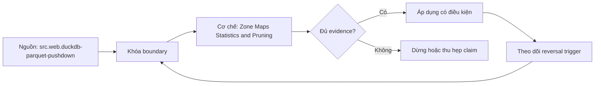

# Zone Maps Statistics and Pruning

> [!abstract] Câu hỏi trung tâm
> Pruning được chứng minh ở partition, file, row-group, page và runtime như thế nào, đồng thời tránh cắt nhầm dữ liệu vì statistics hoặc comparison semantics không tương thích?

## 1. Pruning là phép chứng minh không thể khớp

Metadata cho một unit lưu trữ mô tả miền có thể xuất hiện: partition value, min/max, null count, value count, bloom/page index hoặc statistics khác. Với predicate và semantics đã biết, engine chỉ được bỏ unit khi chứng minh không row nào có thể thỏa. Min/max cho `x = 50` bỏ block `[100,200]` nhưng phải đọc block `[1,100]` dù 50 không tồn tại; false positive làm đọc thừa, false negative làm sai kết quả và không được chấp nhận. 'Không đọc' có thể rẻ nhất cho query chọn lọc, nhưng full scan hoặc uncorrelated filter có pruning bằng zero.

## 2. Năm tầng cần phân biệt

Partition pruning loại directories/partitions từ transform/value đã công bố. File pruning dùng manifest/file statistics. Row-group/stripe pruning dùng min/max/bloom của nhóm rows; page pruning hẹp hơn khi format và reader hỗ trợ page index. Runtime/dynamic pruning lấy values/range từ build side của join rồi đẩy về split enumeration hoặc file reader. Một plan có filter pushdown không chứng minh mọi tầng đã hoạt động. Báo candidate units, planned units, opened files, read row groups/pages, bytes và rows sau filter ở từng boundary có counter.

## 3. Ordering quyết định độ chồng lấn

Nếu events được sắp theo event_time, min/max của row groups theo time thường hẹp và ít chồng; time-range query bỏ phần lớn groups. Nếu account_id phân tán ngẫu nhiên, mỗi group có thể chứa gần cả miền account và zonemap kém chọn lọc. Correlation có thể không hoàn hảo nhưng vẫn hữu ích. Row-group size tạo trade-off: group nhỏ cho statistics mịn và parallelism nhiều hơn, đồng thời tăng metadata/header và task overhead; group lớn nén tốt hơn nhưng min/max rộng. Không chọn size chỉ từ một query.

## 4. Predicate blockers không phải danh sách tuyệt đối

Bọc column trong function, implicit/explicit cast hoặc expression không trực tiếp có thể ngăn rewrite/pushdown, nhưng không phải engine nào cũng thất bại: optimizer có thể constant-fold, invert monotonic function hoặc normalize cast an toàn. `DATE(ts)=d`, `CAST(id AS VARCHAR)='42'` và arithmetic expression phải được xác minh trên đúng engine/version. Sửa bằng range typed đúng hoặc generated/partition field chỉ sau khi kiểm semantics timezone/null. Sargability là phép tương tự hữu ích, nhưng pruning metadata không hoàn toàn giống B-tree index lookup.

## 5. Statistics safety và comparison semantics

Writer/reader phải thống nhất physical type, logical annotation, ordering, collation, timezone và NaN rules. Truncated string bounds, binary collation, decimal scale hoặc timestamp rebasing có thể làm statistics không usable. An toàn là fail open: đánh dấu unknown và đọc unit, không dùng metadata nghi ngờ để skip. Stale metadata trong mutable systems cần transaction/snapshot consistency. Lab phải có boundary values, null, NaN, unicode/collation, negative numbers và timestamps quanh DST; so pruned result với full-scan oracle.

## 6. Dynamic filtering có chi phí

Trino tạo dynamic filter từ join build side khi planner, connector và reader hỗ trợ. Small/selective build có thể thu distinct set; vượt threshold có thể chuyển min/max hoặc bỏ collection. Thu thập, phân phối và chờ filter tiêu tốn CPU/time; filter đến trễ thì probe splits đã đọc. `dynamicFilterAssignments` trong plan chỉ chứng minh planner intent. EXPLAIN ANALYZE, QueryInfo và connector counters mới cho biết accepted values, completed filters, splits/row groups skipped và wait time.

## 7. Lab sáu query và hai layouts

Tạo cùng data/hash ở layout time-sorted và shuffled; ghi row-group size, statistics support và cache state. Sáu queries gồm direct range/equality, function-wrapped, type mismatch, non-monotonic expression và join-derived filter. Dùng full-scan/no-pruning oracle để kiểm result hash. Với mỗi query lưu plan, candidate/read/skipped units, bytes, metadata time và wall/CPU. Tỷ lệ cắt là `1 - read_units/candidate_units`, nhưng cần kèm bytes vì units khác kích thước. Ba sửa đổi đạt khi correctness giữ nguyên và counters chứng minh tăng pruning, không chỉ thời gian giảm.

## 8. Ma trận kiểm chứng từng mệnh đề

Mỗi mệnh đề hiệu năng cần counterfactual, correctness oracle và counter ở đúng tầng. Elapsed time, plan label hoặc tên công nghệ riêng lẻ không đủ quy nguyên nhân.

### 8.1. pruning chỉ skip khi chứng minh unit không thể match

**Mệnh đề cần kiểm.** pruning chỉ skip khi chứng minh unit không thể match.

**Cách kiểm.** Giữ dataset/hash cố định; chạy full-scan oracle và từng pruning level, lưu candidate/read/skipped units, bytes, plan/runtime counters. Inject function, cast, comparison and stale/unknown-statistics cases. Với mệnh đề này, ghi engine/compiler/format version, data shape, controlled variables, expected counter, failure signal và boundary làm kết luận không còn đúng.

**Bằng chứng đạt cho `wiki.olap.zone-maps-statistics-pruning`.** Lưu generator/hash, configuration, query/source, plan/profile/compiler proof, raw counters, result oracle, repetitions và reviewer. Nếu chưa chạy lab được phép, chỉ ghi protocol; không biến expected result thành số đo đã quan sát.

### 8.2. min max cho phép false positive nhưng không false negative

**Mệnh đề cần kiểm.** min max cho phép false positive nhưng không false negative.

**Cách kiểm.** Giữ dataset/hash cố định; chạy full-scan oracle và từng pruning level, lưu candidate/read/skipped units, bytes, plan/runtime counters. Inject function, cast, comparison and stale/unknown-statistics cases. Với mệnh đề này, ghi engine/compiler/format version, data shape, controlled variables, expected counter, failure signal và boundary làm kết luận không còn đúng.

**Bằng chứng đạt cho `wiki.olap.zone-maps-statistics-pruning`.** Lưu generator/hash, configuration, query/source, plan/profile/compiler proof, raw counters, result oracle, repetitions và reviewer. Nếu chưa chạy lab được phép, chỉ ghi protocol; không biến expected result thành số đo đã quan sát.

### 8.3. partition file row-group page runtime là năm tầng khác nhau

**Mệnh đề cần kiểm.** partition file row-group page runtime là năm tầng khác nhau.

**Cách kiểm.** Giữ dataset/hash cố định; chạy full-scan oracle và từng pruning level, lưu candidate/read/skipped units, bytes, plan/runtime counters. Inject function, cast, comparison and stale/unknown-statistics cases. Với mệnh đề này, ghi engine/compiler/format version, data shape, controlled variables, expected counter, failure signal và boundary làm kết luận không còn đúng.

**Bằng chứng đạt cho `wiki.olap.zone-maps-statistics-pruning`.** Lưu generator/hash, configuration, query/source, plan/profile/compiler proof, raw counters, result oracle, repetitions và reviewer. Nếu chưa chạy lab được phép, chỉ ghi protocol; không biến expected result thành số đo đã quan sát.

### 8.4. filter pushdown annotation không chứng minh physical skip

**Mệnh đề cần kiểm.** filter pushdown annotation không chứng minh physical skip.

**Cách kiểm.** Giữ dataset/hash cố định; chạy full-scan oracle và từng pruning level, lưu candidate/read/skipped units, bytes, plan/runtime counters. Inject function, cast, comparison and stale/unknown-statistics cases. Với mệnh đề này, ghi engine/compiler/format version, data shape, controlled variables, expected counter, failure signal và boundary làm kết luận không còn đúng.

**Bằng chứng đạt cho `wiki.olap.zone-maps-statistics-pruning`.** Lưu generator/hash, configuration, query/source, plan/profile/compiler proof, raw counters, result oracle, repetitions và reviewer. Nếu chưa chạy lab được phép, chỉ ghi protocol; không biến expected result thành số đo đã quan sát.

### 8.5. ordering làm hẹp hoặc rộng min max ranges

**Mệnh đề cần kiểm.** ordering làm hẹp hoặc rộng min max ranges.

**Cách kiểm.** Giữ dataset/hash cố định; chạy full-scan oracle và từng pruning level, lưu candidate/read/skipped units, bytes, plan/runtime counters. Inject function, cast, comparison and stale/unknown-statistics cases. Với mệnh đề này, ghi engine/compiler/format version, data shape, controlled variables, expected counter, failure signal và boundary làm kết luận không còn đúng.

**Bằng chứng đạt cho `wiki.olap.zone-maps-statistics-pruning`.** Lưu generator/hash, configuration, query/source, plan/profile/compiler proof, raw counters, result oracle, repetitions và reviewer. Nếu chưa chạy lab được phép, chỉ ghi protocol; không biến expected result thành số đo đã quan sát.

### 8.6. row-group size cân granularity compression parallelism metadata

**Mệnh đề cần kiểm.** row-group size cân granularity compression parallelism metadata.

**Cách kiểm.** Giữ dataset/hash cố định; chạy full-scan oracle và từng pruning level, lưu candidate/read/skipped units, bytes, plan/runtime counters. Inject function, cast, comparison and stale/unknown-statistics cases. Với mệnh đề này, ghi engine/compiler/format version, data shape, controlled variables, expected counter, failure signal và boundary làm kết luận không còn đúng.

**Bằng chứng đạt cho `wiki.olap.zone-maps-statistics-pruning`.** Lưu generator/hash, configuration, query/source, plan/profile/compiler proof, raw counters, result oracle, repetitions và reviewer. Nếu chưa chạy lab được phép, chỉ ghi protocol; không biến expected result thành số đo đã quan sát.

### 8.7. function wrapper có thể hoặc không chặn tùy optimizer

**Mệnh đề cần kiểm.** function wrapper có thể hoặc không chặn tùy optimizer.

**Cách kiểm.** Giữ dataset/hash cố định; chạy full-scan oracle và từng pruning level, lưu candidate/read/skipped units, bytes, plan/runtime counters. Inject function, cast, comparison and stale/unknown-statistics cases. Với mệnh đề này, ghi engine/compiler/format version, data shape, controlled variables, expected counter, failure signal và boundary làm kết luận không còn đúng.

**Bằng chứng đạt cho `wiki.olap.zone-maps-statistics-pruning`.** Lưu generator/hash, configuration, query/source, plan/profile/compiler proof, raw counters, result oracle, repetitions và reviewer. Nếu chưa chạy lab được phép, chỉ ghi protocol; không biến expected result thành số đo đã quan sát.

### 8.8. typed range rewrite phải giữ timezone và null semantics

**Mệnh đề cần kiểm.** typed range rewrite phải giữ timezone và null semantics.

**Cách kiểm.** Giữ dataset/hash cố định; chạy full-scan oracle và từng pruning level, lưu candidate/read/skipped units, bytes, plan/runtime counters. Inject function, cast, comparison and stale/unknown-statistics cases. Với mệnh đề này, ghi engine/compiler/format version, data shape, controlled variables, expected counter, failure signal và boundary làm kết luận không còn đúng.

**Bằng chứng đạt cho `wiki.olap.zone-maps-statistics-pruning`.** Lưu generator/hash, configuration, query/source, plan/profile/compiler proof, raw counters, result oracle, repetitions và reviewer. Nếu chưa chạy lab được phép, chỉ ghi protocol; không biến expected result thành số đo đã quan sát.

### 8.9. sargability analogy không đồng nhất B-tree với zonemap

**Mệnh đề cần kiểm.** sargability analogy không đồng nhất B-tree với zonemap.

**Cách kiểm.** Giữ dataset/hash cố định; chạy full-scan oracle và từng pruning level, lưu candidate/read/skipped units, bytes, plan/runtime counters. Inject function, cast, comparison and stale/unknown-statistics cases. Với mệnh đề này, ghi engine/compiler/format version, data shape, controlled variables, expected counter, failure signal và boundary làm kết luận không còn đúng.

**Bằng chứng đạt cho `wiki.olap.zone-maps-statistics-pruning`.** Lưu generator/hash, configuration, query/source, plan/profile/compiler proof, raw counters, result oracle, repetitions và reviewer. Nếu chưa chạy lab được phép, chỉ ghi protocol; không biến expected result thành số đo đã quan sát.

### 8.10. statistics không tương thích phải fail open

**Mệnh đề cần kiểm.** statistics không tương thích phải fail open.

**Cách kiểm.** Giữ dataset/hash cố định; chạy full-scan oracle và từng pruning level, lưu candidate/read/skipped units, bytes, plan/runtime counters. Inject function, cast, comparison and stale/unknown-statistics cases. Với mệnh đề này, ghi engine/compiler/format version, data shape, controlled variables, expected counter, failure signal và boundary làm kết luận không còn đúng.

**Bằng chứng đạt cho `wiki.olap.zone-maps-statistics-pruning`.** Lưu generator/hash, configuration, query/source, plan/profile/compiler proof, raw counters, result oracle, repetitions và reviewer. Nếu chưa chạy lab được phép, chỉ ghi protocol; không biến expected result thành số đo đã quan sát.

### 8.11. full-scan oracle phát hiện cắt nhầm

**Mệnh đề cần kiểm.** full-scan oracle phát hiện cắt nhầm.

**Cách kiểm.** Giữ dataset/hash cố định; chạy full-scan oracle và từng pruning level, lưu candidate/read/skipped units, bytes, plan/runtime counters. Inject function, cast, comparison and stale/unknown-statistics cases. Với mệnh đề này, ghi engine/compiler/format version, data shape, controlled variables, expected counter, failure signal và boundary làm kết luận không còn đúng.

**Bằng chứng đạt cho `wiki.olap.zone-maps-statistics-pruning`.** Lưu generator/hash, configuration, query/source, plan/profile/compiler proof, raw counters, result oracle, repetitions và reviewer. Nếu chưa chạy lab được phép, chỉ ghi protocol; không biến expected result thành số đo đã quan sát.

### 8.12. dynamic filter cần planner connector reader cùng hỗ trợ

**Mệnh đề cần kiểm.** dynamic filter cần planner connector reader cùng hỗ trợ.

**Cách kiểm.** Giữ dataset/hash cố định; chạy full-scan oracle và từng pruning level, lưu candidate/read/skipped units, bytes, plan/runtime counters. Inject function, cast, comparison and stale/unknown-statistics cases. Với mệnh đề này, ghi engine/compiler/format version, data shape, controlled variables, expected counter, failure signal và boundary làm kết luận không còn đúng.

**Bằng chứng đạt cho `wiki.olap.zone-maps-statistics-pruning`.** Lưu generator/hash, configuration, query/source, plan/profile/compiler proof, raw counters, result oracle, repetitions và reviewer. Nếu chưa chạy lab được phép, chỉ ghi protocol; không biến expected result thành số đo đã quan sát.

### 8.13. dynamic filter đến trễ có thể không tiết kiệm scan

**Mệnh đề cần kiểm.** dynamic filter đến trễ có thể không tiết kiệm scan.

**Cách kiểm.** Giữ dataset/hash cố định; chạy full-scan oracle và từng pruning level, lưu candidate/read/skipped units, bytes, plan/runtime counters. Inject function, cast, comparison and stale/unknown-statistics cases. Với mệnh đề này, ghi engine/compiler/format version, data shape, controlled variables, expected counter, failure signal và boundary làm kết luận không còn đúng.

**Bằng chứng đạt cho `wiki.olap.zone-maps-statistics-pruning`.** Lưu generator/hash, configuration, query/source, plan/profile/compiler proof, raw counters, result oracle, repetitions và reviewer. Nếu chưa chạy lab được phép, chỉ ghi protocol; không biến expected result thành số đo đã quan sát.

### 8.14. pruning ratio cần đi cùng bytes

**Mệnh đề cần kiểm.** pruning ratio cần đi cùng bytes.

**Cách kiểm.** Giữ dataset/hash cố định; chạy full-scan oracle và từng pruning level, lưu candidate/read/skipped units, bytes, plan/runtime counters. Inject function, cast, comparison and stale/unknown-statistics cases. Với mệnh đề này, ghi engine/compiler/format version, data shape, controlled variables, expected counter, failure signal và boundary làm kết luận không còn đúng.

**Bằng chứng đạt cho `wiki.olap.zone-maps-statistics-pruning`.** Lưu generator/hash, configuration, query/source, plan/profile/compiler proof, raw counters, result oracle, repetitions và reviewer. Nếu chưa chạy lab được phép, chỉ ghi protocol; không biến expected result thành số đo đã quan sát.

### 8.15. query nhanh không chứng minh pruning đang xảy ra

**Mệnh đề cần kiểm.** query nhanh không chứng minh pruning đang xảy ra.

**Cách kiểm.** Giữ dataset/hash cố định; chạy full-scan oracle và từng pruning level, lưu candidate/read/skipped units, bytes, plan/runtime counters. Inject function, cast, comparison and stale/unknown-statistics cases. Với mệnh đề này, ghi engine/compiler/format version, data shape, controlled variables, expected counter, failure signal và boundary làm kết luận không còn đúng.

**Bằng chứng đạt cho `wiki.olap.zone-maps-statistics-pruning`.** Lưu generator/hash, configuration, query/source, plan/profile/compiler proof, raw counters, result oracle, repetitions và reviewer. Nếu chưa chạy lab được phép, chỉ ghi protocol; không biến expected result thành số đo đã quan sát.

## 9. Quy trình phản biện

1. Vẽ data path và xác định tầng storage, reader, engine, compiler, ISA hoặc network đang được nói tới.
2. Khóa semantics, dataset và correctness oracle trước khi đo performance.
3. Thay một mechanism; giữ các mechanisms còn lại cố định hoặc ghi confounder.
4. Đọc plans/remarks nhưng xác nhận bằng runtime counters hoặc assembly khi phù hợp.
5. Báo distribution và critical path, không dùng một average che skew hoặc tails.
6. Viết reversal case và stop condition trước khi chạy.
7. Chưa có execution evidence thì giữ trạng thái `review`.

## 10. Câu hỏi tự kiểm tra

1. Mechanism nằm ở tầng nào và counter trực tiếp của nó là gì?
2. Kết quả đúng được xác minh độc lập ra sao?
3. Biến nào thực sự đổi giữa hai cấu hình?
4. Overhead cố định, bandwidth, skew hoặc tail nào có thể che kết quả?
5. Constraint nào làm lựa chọn hiện tại phải đảo?
6. Kết luận nào mới là protocol, chưa phải observation?

## 11. Giới hạn và điều chưa cho phép kết luận

- Chưa chạy pruning, vectorization, layout hoặc MPP benchmarks; note mô tả protocol và expected evidence.
- Tài liệu engine/compiler được kiểm ngày 2026-10-01; version, plan format, counters và optimizer support có thể đổi.
- Taxonomy và lab matrices là curriculum synthesis; không gán nguyên văn cho một paper hoặc vendor.
- Microbenchmark không chứng minh production speedup nếu data, concurrency, cache, compiler, storage hoặc network khác.
- Note giữ trạng thái `review` cho tới khi chủ dự án duyệt semantic meaning.

## Reference
1. [[SRC-DUCKDB-PARQUET-PUSHDOWN]]
2. [[SRC-DUCKDB-ZONEMAPS]]
3. [[SRC-TRINO-DYNAMIC-FILTERING]]

## Source coverage

| Source slice | Nội dung sử dụng | Trạng thái |
|---|---|---|
| [[SRC-DUCKDB-PARQUET-PUSHDOWN]] | Khái niệm, mechanism hoặc evidence boundary liên quan | Đã đọc locator trong source record; không suy ngoài phạm vi |
| [[SRC-DUCKDB-ZONEMAPS]] | Khái niệm, mechanism hoặc evidence boundary liên quan | Đã đọc locator trong source record; không suy ngoài phạm vi |
| [[SRC-TRINO-DYNAMIC-FILTERING]] | Khái niệm, mechanism hoặc evidence boundary liên quan | Đã đọc locator trong source record; không suy ngoài phạm vi |

## Key takeaways
- Pruning phải được chứng minh bằng units/bytes skipped và full-scan oracle; filter trong plan chưa đủ.
- Correctness oracle và controlled variables đi trước mọi speedup claim.
- Plan estimate, compiler flag hoặc engine feature không thay runtime evidence.
- Average phải đi cùng tails, skew, bytes/units và critical-path counters.
- Chưa chạy lab thì artifact là giáo trình đã kiểm cấu trúc, không phải benchmark result hay production certification.

<!-- ATOMIC-EXECUTION-CAPSULE:START -->

## Execution capsule: kiểm chứng `wiki.olap.zone-maps-statistics-pruning`

> [!important] Phân loại mệnh đề
> Với `wiki.olap.zone-maps-statistics-pruning`, sơ đồ, ví dụ và artifact về **Zone Maps Statistics and Pruning** là **synthesis để kiểm chứng**; chúng không phải trích dẫn hay case nguyên văn của nguồn.

### Sơ đồ cơ chế và điểm kiểm soát



Đọc sơ đồ `wiki.olap.zone-maps-statistics-pruning` từ trái sang phải: source chỉ cung cấp claim ban đầu cho **Zone Maps Statistics and Pruning**; quyết định chỉ được đi tiếp sau khi boundary, evidence và điều kiện đảo quyết định đã hiện hữu.

### Ví dụ làm việc có thể bác bỏ

**Input.** Một đội cần trả lời: Pruning được chứng minh ở partition, file, row-group, page và runtime như thế nào, đồng thời tránh cắt nhầm dữ liệu vì statistics hoặc comparison semantics không tương thích? cho một phạm vi nhỏ, có owner và deadline rõ.

**Decision.** Đội áp dụng **Zone Maps Statistics and Pruning** trên control và variant chỉ khác một assumption; expected result và hard constraints được khóa trước khi chạy.

**Outcome.** Với `wiki.olap.zone-maps-statistics-pruning`, nếu observation vi phạm hard constraint hoặc oracle độc lập không xác nhận **Zone Maps Statistics and Pruning**, đội thu hẹp claim hay đảo quyết định. Nếu đạt, kết luận vẫn kèm scope, version và review date; một lần thành công không được nâng thành quy luật phổ quát.

### Artifact thực thi tối thiểu

```sql
-- Verification harness for: Zone Maps Statistics and Pruning
WITH evidence AS (
    SELECT 'wiki.olap.zone-maps-statistics-pruning' AS concept_id,
           'boundary_declared' AS check_name, 1 AS passed
    UNION ALL
    SELECT 'wiki.olap.zone-maps-statistics-pruning', 'independent_oracle', 1
    UNION ALL
    SELECT 'wiki.olap.zone-maps-statistics-pruning', 'reversal_trigger_recorded', 1
)
SELECT concept_id,
       MIN(passed) AS all_hard_checks_pass,
       COUNT(*) AS evidence_items
FROM evidence
GROUP BY concept_id
HAVING MIN(passed) = 1;
```

Artifact của `wiki.olap.zone-maps-statistics-pruning` buộc người dùng ghi boundary, oracle và reversal trigger cho **Zone Maps Statistics and Pruning**. Các giá trị minh họa phải được thay bằng evidence thật trước khi dùng cho quyết định.

### Tự kiểm tra trước khi tái sử dụng

1. Bạn có thể trả lời `Pruning được chứng minh ở partition, file, row-group, page và runtime như thế nào, đồng thời tránh cắt nhầm dữ liệu vì statistics hoặc comparison semantics không tương thích?` bằng một câu mà không kéo thêm concept thứ hai không?
2. Source locator nào đỡ cho claim, và phần nào chỉ là synthesis trong note?
3. Observation nào khiến bạn dừng, thu hẹp hoặc đảo quyết định?
4. Artifact nào cho phép một reviewer độc lập tái hiện kết quả?

<!-- ATOMIC-EXECUTION-CAPSULE:END -->
