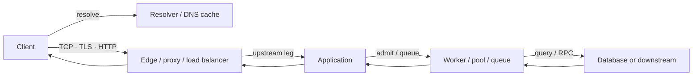
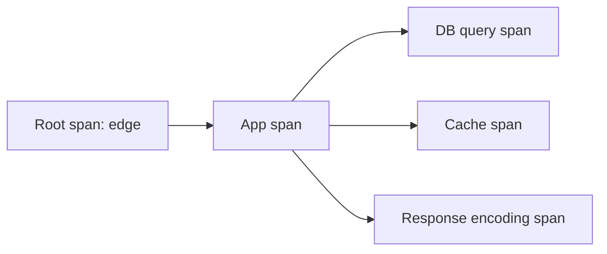
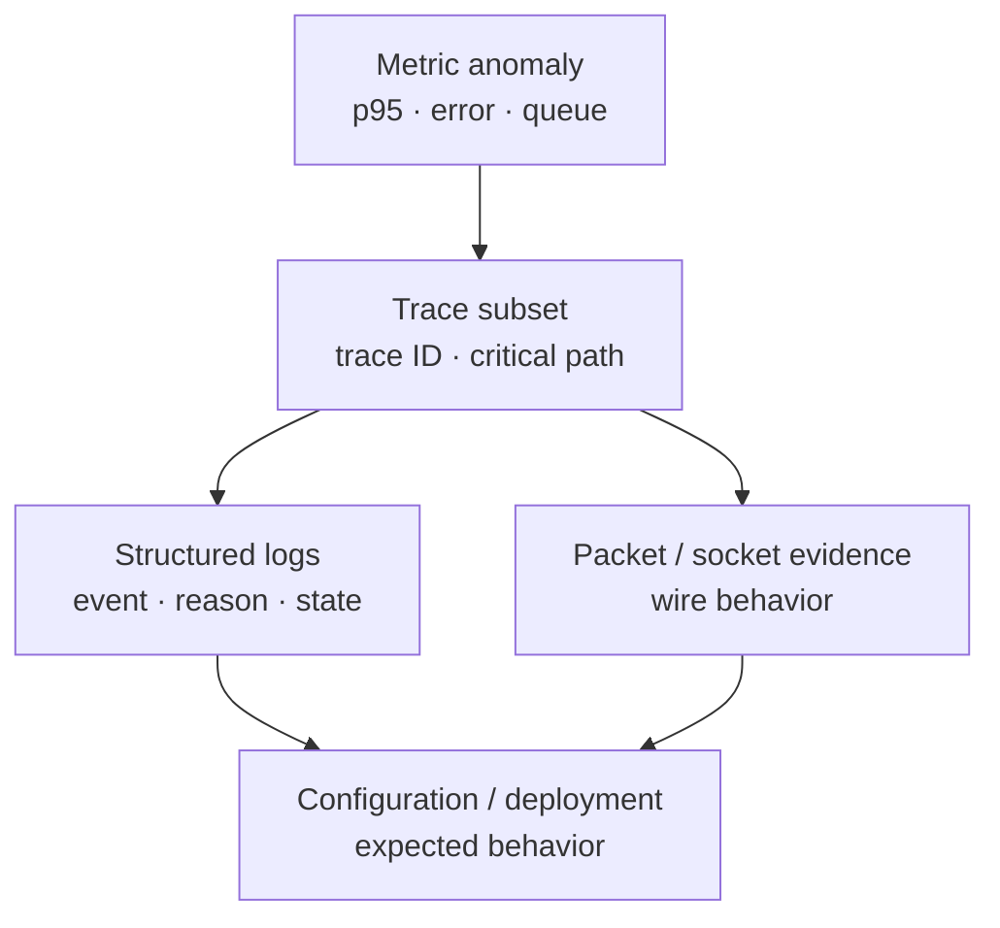

# Truy vết request end-to-end và chẩn đoán bằng bằng chứng

> [!abstract] Câu hỏi trung tâm
> Một request chậm hoặc thất bại có thể dừng ở phân giải tên, mở kết nối, TLS, proxy, queue, handler, database hoặc đường response. Client chỉ thấy outcome cuối; mỗi hop chỉ thấy phần trạng thái của nó. Chẩn đoán đúng đòi hỏi dựng lại timeline, nối các bằng chứng có cùng identity, kiểm ranh giới đo và loại từng giả thuyết. Không có metric, log hay packet đơn lẻ nào chứng minh toàn bộ request.

## 1. Observability là khả năng đặt câu hỏi mới

Observability nói về khả năng suy ra trạng thái bên trong từ output quan sát được. Một hệ observable cho phép điều tra câu hỏi chưa được dự đoán trước mà không phải sửa code rồi chờ sự cố lặp lại.

Monitoring truyền thống thường bắt đầu từ failure mode đã biết: CPU cao, error rate vượt ngưỡng, disk gần đầy. Cách đó vẫn cần thiết. Nó yếu khi lỗi chỉ xuất hiện do tổ hợp nhiều thành phần hoặc khi câu hỏi mới cần một chiều dữ liệu chưa từng được nối.

Cài collector, dashboard và tracing SDK chưa tự làm hệ observable. Telemetry phải mang đủ context, được liên kết qua boundary và giữ semantics nhất quán thì mới trả lời được “vì sao”.

> [!source-fact]
> Cloud Native Go định nghĩa observability là system property phản ánh khả năng suy ra internal state từ external outputs, và nhấn mạnh tool không tự tạo ra property đó; Chapter 11, trang in 343–347, PDF 365–369.

## 2. Chẩn đoán là một chuỗi phát biểu có bằng chứng

Mỗi kết luận nên có dạng:

```text
Observation → giả thuyết → phép kiểm → bằng chứng → kết luận có phạm vi
```

Ví dụ:

```text
Client p95 tăng từ 120 ms lên 2,4 s
→ nghi queue ở application
→ so client timing, server span và queue-age metric cùng cửa sổ
→ connect/TLS không đổi; request chờ worker 2,1 s; handler 80 ms
→ bottleneck nằm trước handler trong instance được trace, không quy cho network
```

Phần “có phạm vi” quan trọng: một trace chứng minh request đó; một capture chứng minh traffic tại capture point; một time series mô tả series có label ấy. Không nâng một mẫu thành kết luận toàn hệ khi chưa có sampling và coverage phù hợp.

> [!synthesis]
> Chuỗi năm bước là khung biên tập nối observability với execution discipline. Nguồn không đặt tên đây là một framework.

## 3. Bản đồ request phải có boundary



Mỗi mũi tên có thể là một connection, protocol, timeout và clock khác. Reverse proxy có thể terminate TCP/TLS rồi tạo upstream connection mới. Database pool có queue riêng. DNS answer có cache lifetime không liên quan request ID.

Trước khi đọc telemetry, lập bảng boundary:

| Boundary | Identity nối hai phía | Clock | Bằng chứng chính |
|---|---|---|---|
| Client → resolver | query name/type + timestamp | client/resolver | DNS trace/cache/answer |
| Client → edge | tuple + TLS/HTTP identifiers | client/edge | packet, access log, edge span |
| Edge → application | propagated trace/request ID | edge/app | upstream log, spans |
| Application → pool | trace/span + queue item | process clock | queue metric, runtime trace |
| Application → dependency | child span + protocol ID | app/dependency | spans, client/server log |
| Response về client | same request identity + byte/status | nhiều clock | access log, packet, client timing |

## 4. Sáu chặng đo latency

Một phân rã thực dụng cho request web/API:

1. **Name resolution**: từ lúc hỏi tên tới khi có address sử dụng được.
2. **Connection establishment**: TCP connect; nếu dùng TLS thì đo handshake riêng.
3. **Request transfer và edge handling**: gửi request, proxy admission, routing, upstream wait.
4. **Application queue và processing**: chờ worker/resource rồi thực thi handler.
5. **Dependency work**: database, cache, service khác; có thể song song hoặc lồng nhau.
6. **Response transfer**: time-to-first-byte, body transfer và client consumption.

```text
T_client
  = T_dns
  + T_connect
  + T_tls
  + T_request_edge
  + T_app_queue
  + T_app_work
  + T_dependencies_on_critical_path
  + T_response
  + T_uninstrumented
```

Không cộng mù toàn bộ child-span duration: các call song song chồng thời gian. Chỉ critical path đóng góp trực tiếp vào wall-clock total; các span khác vẫn tiêu tài nguyên nhưng không cộng tuyến tính.

> [!synthesis]
> Phân rã sáu chặng phục vụ DE-L086/L088, tổng hợp từ delay components của Kurose–Ross, response/ service/queueing time trong DDIA và trace/span model của Cloud Native Go. Không phải công thức chuẩn của một tác giả.

## 5. Response time, service time và queueing time

Response time là thời gian client quan sát từ lúc gửi yêu cầu đến khi nhận outcome theo boundary đã định. Service time là phần component tích cực xử lý work. Queueing delay là thời gian chờ tài nguyên hoặc work trước đó.

Hai request cùng service time có thể có response time rất khác nếu một request chờ queue. Khi load gần capacity, queueing delay tăng nhanh; dùng CPU trung bình thấp để bác bỏ queueing là không đủ vì queue có thể nằm ở connection pool, lock, partition hoặc downstream.

> [!source-fact]
> DDIA Early Release phân biệt response time, service time, queueing delay và network latency; đồng thời mô tả queueing tăng mạnh khi throughput tiến gần capacity, Chapter 2, PDF 76–80.

> [!uncertainty]
> DDIA trong kho là Early Release chưa hoàn chỉnh. Khái niệm được dùng ở mức nguyên lý; locator và wording phải đối chiếu lại khi bản phát hành cuối được thêm vào kho.

## 6. Network delay cũng có nhiều thành phần

Tại một node, Kurose–Ross tách:

- processing delay;
- queueing delay;
- transmission delay `L/R`;
- propagation delay.

End-to-end network delay tích lũy qua nhiều node. Ngoài mạng còn có endpoint/application delay. Vì vậy “network mất 800 ms” chỉ hợp lệ khi boundary đo loại trừ được DNS, TLS, proxy queue và application.

> [!source-fact]
> Bốn loại nodal delay, phép cộng end-to-end và endpoint/application delay được trình bày tại Kurose–Ross §§1.4.1–1.4.3, trang in 65–73, PDF 67–75.

## 7. Trace là đồ thị công việc của một request

Span mô tả một đơn vị work: một function, một network hop hoặc một operation. Span có tên, thời điểm bắt đầu và duration; span có thể lồng nhau để biểu diễn quan hệ nhân quả. Trace gom các span của một request thành directed acyclic graph.

Root span bắt đầu ở entry point. Trace ID được truyền qua các hop; component sau tạo child span mang cùng trace ID và parent relation. Collector/backend dùng các record rời để dựng lại flow.



> [!source-fact]
> Span, trace-as-DAG, root span, globally unique trace ID và propagation qua hop nằm tại Cloud Native Go, trang in 350–351, PDF 372–373.

## 8. Trace context phải vượt đúng boundary

Trace liền mạch chỉ tồn tại nếu context được truyền qua client/server middleware, message header hoặc carrier tương ứng. Các điểm hay đứt:

- background job tách khỏi request mà không tạo link;
- queue consumer bỏ trace metadata;
- proxy xóa header;
- retry tạo trace mới nhưng không nối attempt;
- library call không được instrument;
- security policy chặn header không tin cậy;
- sampling decision khác nhau giữa hop.

Không được tin trace header từ Internet như authorization identity. Edge phải áp trust policy; trace ID dùng correlation, không chứng minh caller identity.

> [!synthesis]
> Nguồn nêu trace ID phải được forward qua request lifecycle. Danh sách điểm đứt và trust boundary là checklist vận hành; semantics cụ thể cần tài liệu instrumentation/runtime hiện hành.

## 9. Missing span không chứng minh component không chạy

Span vắng có thể do:

- request chưa tới component;
- instrumentation không phủ code path;
- exporter/collector mất telemetry;
- sampling bỏ trace hoặc span;
- process crash trước flush;
- context propagation đứt;
- clock/query window sai;
- lookup dùng nhầm trace ID.

Khi backend không có span, đối chiếu access log, packet, queue record và collector health trước khi kết luận request dừng ở hop trước. “Không thấy” là observation về telemetry path, chưa chắc là observation về request path.

> [!inference]
> Đây là giới hạn suy luận từ kiến trúc instrumentation–SDK–exporter–collector mà Cloud Native Go mô tả tại trang in 347–349. Nguồn không cung cấp ma trận missing-span này.

## 10. Duration của span phụ thuộc boundary instrumentation

Span `db.query` có thể đo:

- thời gian chờ connection + query;
- chỉ thời gian driver gửi/nhận;
- cả deserialize;
- hoặc wrapper rộng hơn gồm retry.

Tên giống nhau không bảo đảm boundary giống nhau giữa service hoặc phiên bản. Mỗi span convention cần định nghĩa start, end, status và attributes. Khi đổi instrumentation, dashboard trước/sau có thể không so trực tiếp được.

OpenTelemetry code trong Cloud Native Go dùng API `v0.17.0` ở thời điểm viết. Note giữ trace/span mental model; không dùng method signature, package path hoặc SDK setup trong sách làm hướng dẫn năm 2026.

> [!uncertainty]
> API và semantic conventions của OpenTelemetry có thể đã đổi sau 2021. Triển khai phải đọc tài liệu chính thức đúng version; phạm vi nguồn này không xác nhận trạng thái hiện hành.

## 11. Parallel spans và critical path

Giả sử application gọi cache 80 ms và database 120 ms song song. Parent span có thể khoảng 130 ms, không phải 200 ms. Tổng span duration hữu ích để ước lượng resource usage nhưng không bằng wall-clock latency.

Khi tìm bottleneck latency:

1. xác định span nằm trên critical path;
2. đọc khoảng trống chưa instrument giữa spans;
3. kiểm wait time trước span;
4. tách child retries thành attempts;
5. xem fan-out tail—parent chờ child chậm nhất hay quorum nào.

> [!synthesis]
> Critical-path interpretation là cách áp dụng trace-as-DAG. Ví dụ số là minh họa tự xây, không phải benchmark từ nguồn.

## 12. Clock không phải chân lý chung

Trace backend thường tính duration của từng span trên clock cục bộ và dựng quan hệ bằng parent/child. Log từ nhiều máy có thể lệch clock, khác timezone hoặc precision. Sắp mọi event theo timestamp tuyệt đối có thể tạo thứ tự giả.

Khi ghép timeline:

- chuẩn hóa timezone và format;
- ghi monotonic duration khi runtime hỗ trợ;
- kiểm clock synchronization/offset;
- dùng causal identifiers và protocol ordering;
- giữ timestamp gốc cùng ingestion timestamp;
- không suy one-way network latency bằng cách trừ hai wall clock chưa đồng bộ.

> [!inference]
> Nguồn nhấn mạnh timestamp trong metric/log/span nhưng không cung cấp clock-correction protocol. Đây là stop condition: one-way timing đa host cần clock-quality evidence riêng.

## 13. Metric trả lời “bao nhiêu” và “khi nào”

Metric là numerical observation theo thời gian. Sample thường có name, value, timestamp và labels; các sample cùng identity tạo time series. Time series cho phép thấy xu hướng, anomaly và tương quan giữa load, latency, queue, error.

Nhóm metric tối thiểu cho request path:

- traffic: request/attempt/byte rate;
- errors: theo stage và reason;
- latency: distribution theo boundary;
- saturation: queue, pool, concurrency, CPU/memory/I/O;
- dependency: call rate, outcome, duration;
- correctness/business: records processed, commit/reconciliation result.

> [!source-fact]
> Định nghĩa metric, sample, timestamp, labels và time series được trình bày tại Cloud Native Go, trang in 369–371, PDF 391–393.

## 14. Average che tail latency

Hai distribution có cùng mean có thể khác hẳn p95/p99. Khi một nhóm nhỏ request bị queue lâu, average có thể trông ổn trong khi user ở tail chịu lỗi.

Báo cáo diagnosis nên có:

- số mẫu và cửa sổ;
- p50, p95, p99 hoặc histogram phù hợp;
- max chỉ như context, không thay distribution;
- throughput/error cùng cửa sổ;
- label/filter đã dùng;
- baseline so sánh;
- tỷ lệ sampled nếu trace không thu toàn bộ.

Roadmap yêu cầu p95 cho L086; với L088, distribution giúp chọn request đại diện thay vì một request ngẫu nhiên.

> [!synthesis]
> Nguồn khẳng định time series hỗ trợ trend/anomaly. Percentile checklist nối kiến thức đó với yêu cầu chương trình; nguồn trong phạm vi này không đặt p95 làm ngưỡng chung.

## 15. Cardinality là trade-off truy vấn và chi phí

Label nhiều giá trị giúp đặt câu hỏi chi tiết nhưng tạo nhiều time series. Không dùng raw request ID, user ID hoặc URL có tham số làm metric label không giới hạn. Những trường high-cardinality thường hợp với trace/log hơn.

Metric label nên là chiều hữu hạn và có quyết định rõ: service, operation, status class, region, dependency, failure class. Nếu cần đi từ anomaly tới request cụ thể, dùng exemplar hoặc liên kết tới trace khi stack hỗ trợ, thay vì biến mọi request thành series.

> [!source-fact]
> Cloud Native Go mô tả monitoring cardinality là số tổ hợp metric name và dimensions, đồng thời nêu high cardinality tăng số cách truy vấn; trang in 369–370, PDF 391–392.

> [!inference]
> Cấm request/user ID làm label là guardrail về resource/privacy. Limit cụ thể phụ thuộc backend và retention; nguồn không cung cấp cardinality budget production.

## 16. Log phải là structured event

Log hiệu quả là record của event có schema, không phải câu văn tùy ý. Trường tối thiểu:

- timestamp và clock/source;
- severity;
- service, instance, version;
- event name và outcome;
- trace ID, span ID, request/correlation ID;
- operation/dependency;
- duration và byte/count khi có nghĩa;
- error class/code;
- retry attempt và finality;
- config/deployment version liên quan.

Structured log giảm chi phí parse và cho phép filter/aggregate nhất quán. Message vẫn hữu ích cho người đọc, nhưng không nên là nơi duy nhất chứa field cần truy vấn.

> [!source-fact]
> Cloud Native Go đối chiếu unstructured string với structured event và nhấn mạnh timestamp, level, contextual fields; trang in 387–390, PDF 409–412.

## 17. Log có chi phí và privacy boundary

Log volume tiêu disk, network, indexing và retention. Khi load tăng, log per-request cũng tăng, đôi khi gây thêm pressure đúng lúc hệ đang lỗi. Debug logging bật toàn fleet có thể biến observability thành nguồn overload.

Không ghi credential, token, raw authorization header, secret, payload chứa PII hoặc dữ liệu nghiệp vụ nhạy cảm. Hash hoặc redact chỉ an toàn khi threat model cho phép; correlation ID nên là opaque identifier, không nhúng user data.

> [!source-fact]
> Cloud Native Go cảnh báo verbose logs gây áp lực disk/network, chi phí vận hành và không ghi sensitive business data hay PII; trang in 387–390, PDF 409–412.

## 18. Trace, metric và log phải nối được nhau



Metric tìm cửa sổ và nhóm bị ảnh hưởng. Trace chỉ chặng. Log giải thích state/decision. Packet kiểm hành vi wire. Configuration cho biết behavior đáng lẽ phải xảy ra. Nếu các lớp không chia sẻ time, identity hoặc version, việc “có đủ ba pillar” vẫn không tạo được diagnosis.

> [!source-fact]
> Cloud Native Go nêu metrics có thể dẫn tới subset trace bất thường, trace dẫn tới logs, và ba cách quan sát cần được interweave; trang in 346–347, PDF 368–369.

## 19. Packet capture chứng minh điều gì

Packet capture tại một điểm có thể cho thấy:

- DNS query/response đi qua điểm đó;
- SYN/SYN-ACK/ACK, retransmission, FIN/RST;
- TLS record/alert và timing, dù payload mã hóa;
- byte/packet direction và timing;
- HTTP nếu plaintext hoặc có key/decryption hợp lệ theo policy.

Nó không tự chứng minh:

- packet có đi qua điểm khác;
- process đã đọc byte khỏi socket;
- handler đã chạy;
- transaction đã commit;
- proxy leg khác có cùng sequence space;
- user đã nhận/hiển thị response.

Capture point, interface, direction, filter, snap length, offload và clock phải được ghi cùng artifact.

> [!synthesis]
> Bảng giới hạn nối packet-level material của Kurose–Ross với các note TCP/TLS/proxy đã chưng cất. Nguồn không cung cấp một forensic checklist hoàn chỉnh.

## 20. Traceroute không định vị application bottleneck

Traceroute dùng probe với hop limit tăng để thu response và round-trip delay tới các hop phản hồi. RTT thay đổi theo queue; hop sau có thể trả RTT thấp hơn hop trước. Dấu `*` chỉ nói probe không nhận response trong điều kiện đó, không chứng minh traffic ứng dụng bị drop tại hop ấy.

Traceroute hữu ích để quan sát route và RTT pattern. Nó không đo DNS, TLS, proxy queue, server processing hoặc one-way latency chính xác.

> [!source-fact]
> Cơ chế Traceroute, ba probe mỗi hop, RTT biến động và ví dụ hop sau có RTT thấp hơn nằm tại Kurose–Ross §1.4.3, trang in 71–73, PDF 73–75.

## 21. Evidence theo từng tầng

| Tầng/chặng | Bằng chứng mạnh | Bằng chứng chưa đủ |
|---|---|---|
| DNS | resolver, answer, TTL, authoritative comparison | “Máy tôi phân giải được” |
| TCP connect | packet hai chiều, socket state, connect timing | application log vắng |
| TLS | certificate chain, verification result, alert, handshake timing | chỉ thấy port mở |
| HTTP | request/response metadata, status, byte count | TCP ACK |
| Proxy/LB | downstream/upstream logs, target selection, timeout reason | backend không log |
| App queue | queue age/depth, worker wait span | CPU trung bình |
| Handler | span/log với input class và outcome | access log entry đơn lẻ |
| Dependency | child span, client/server log, pool wait | app tổng duration |
| Business commit | transaction/reconciliation record | HTTP 200 hoặc transport ACK |

Mỗi kết luận L088 phải chỉ ra ô bằng chứng tương ứng. Đoán đúng root cause nhưng trích bằng chứng tầng khác không entail kết luận vẫn là chẩn đoán không đạt.

## 22. Hồ sơ tối thiểu cho một request

```text
request_identity:
  trace_id:
  request_id:
  client_observation_id:

client:
  start_time:
  dns_ms:
  connect_ms:
  tls_ms:
  ttfb_ms:
  total_ms:
  status_or_error:

edge:
  received_at:
  target:
  upstream_connect_ms:
  upstream_wait_ms:
  response_status:
  termination_reason:

application:
  queue_wait_ms:
  handler_ms:
  dependency_spans:
  final_outcome:

wire_evidence:
  capture_point:
  packet_numbers:
  clock_and_filter:
```

Không phải hệ nào cũng có đủ trường. Template biến chỗ trống thành dữ kiện: `not_instrumented`, `not_sampled`, `not_applicable` hoặc `collection_failed`, thay vì bỏ trống không phân biệt.

## 23. Quy trình chẩn đoán chín bước

1. Ghi triệu chứng bằng outcome, population, time window và baseline.
2. Chọn một request lỗi và một request khỏe có điều kiện gần nhau.
3. Vẽ path cùng connection/trust boundaries.
4. Kiểm DNS → connect → TLS → HTTP theo thứ tự, không nhảy cóc.
5. Lấy trace và tìm critical path, missing spans, retries, queue gaps.
6. Đối chiếu metrics trong cùng window; dùng distribution, không chỉ average.
7. Mở structured logs bằng trace/request ID; ghi config/deployment version.
8. Lập giả thuyết có predicted observation rồi chạy phép kiểm hẹp nhất.
9. Sau thay đổi, lặp lại cùng workload và chứng minh recovery ở cả symptom lẫn cause signal.

Không restart trước khi chụp volatile evidence nếu hệ còn an toàn để quan sát. Restart có thể xóa queue, socket state, process stack và reproduction condition.

## 24. Hypothesis ledger

| Thời điểm | Observation | Giả thuyết | Dự đoán nếu đúng | Phép kiểm | Kết quả | Trạng thái |
|---|---|---|---|---|---|---|
| T0 | Client timeout | DNS stale | Resolver A trả IP cũ, authoritative trả IP mới | query hai nguồn | ... | mở/bác bỏ |
| T1 | Connect nhanh, TTFB chậm | App queue | Edge upstream wait cao, handler duration thấp | trace + queue metric | ... | mở/bác bỏ |
| T2 | Backend 200, client reset | Edge downstream timeout | Backend finish sau edge timeout | ghép hai leg | ... | mở/bác bỏ |

Ledger giữ cả nhánh sai. Xóa giả thuyết thất bại làm mất thông tin về cách bằng chứng đã thu hẹp không gian nguyên nhân; L088 chấm riêng timeline diagnosis vì lý do này.

## 25. So sánh request khỏe với request lỗi

Giữ càng nhiều điều kiện giống nhau càng tốt:

- cùng client network hoặc ghi rõ khác biệt;
- cùng resolver/region/edge;
- cùng endpoint và payload class;
- cùng application version/config;
- cùng dependency target;
- cùng load window.

Diff theo stage:

| Stage | Healthy | Failing | Delta | Bằng chứng |
|---|---:|---:|---:|---|
| DNS | ... | ... | ... | query/TTL |
| Connect/TLS | ... | ... | ... | client timing/packet |
| Edge wait | ... | ... | ... | edge log/span |
| Queue wait | ... | ... | ... | metric/span |
| Handler | ... | ... | ... | app span |
| Dependency | ... | ... | ... | child span/log |
| Response | ... | ... | ... | packet/byte/timing |

So sánh chỉ có giá trị khi boundary và unit giống nhau.

## 26. Tình huống A — lỗi DNS bị gọi nhầm là lỗi mạng

### Dấu hiệu

Một nhóm client timeout; nhóm khác gọi bình thường. Backend mới khỏe nhưng không thấy request từ nhóm lỗi.

### Phép kiểm

1. Ghi resolver thực của từng nhóm.
2. Query record type cụ thể, lưu answer và TTL còn lại.
3. So với authoritative answer.
4. Kiểm process/local cache nếu OS query đã đúng.
5. Gọi trực tiếp endpoint cũ/mới chỉ trong môi trường kiểm soát.

### Kết luận hợp lệ

“Resolver X còn trả address A với TTL Y trong lần đo; authoritative trả B. Client lỗi kết nối tới A.” Không viết “DNS toàn hệ bị hỏng” nếu chỉ một resolver/cache stale.

## 27. Tình huống B — network, transport hay application error

Ba case có triệu chứng “request thất bại”:

| Case | Packet | Telemetry | Kết luận |
|---|---|---|---|
| Connection refused | SYN nhận RST | không có app span | endpoint không accept tại địa chỉ quan sát |
| Packet loss/retransmission | sequence gap, retransmission/ACK pattern | span có thể dài hoặc thiếu | transport phục hồi/chờ; root physical cause cần thêm evidence |
| Application 5xx | handshake và byte transfer hoàn tất | server span/log trả error | lỗi ở app/protocol, không phải connect failure |

Packet number phải được ghi trong câu trả lời L088. “Wireshark cho thấy lỗi” không phải locator.

## 28. Tình huống C — client chậm nhưng handler nhanh

Observation:

- client total 2.800 ms;
- edge nhận request ở 100 ms;
- app queue wait 2.300 ms;
- handler 120 ms;
- dependency critical path 80 ms;
- response transfer 60 ms.

Kết luận: phần lớn latency ở queue trước handler cho request này. Không quy CPU, database hay network nếu chưa có metric bổ sung. Bước tiếp theo là đối chiếu queue age/depth, concurrency/pool và load trong cùng window.

> [!synthesis]
> Số liệu tình huống là fixture giảng dạy tự tạo để luyện phân rã, không phải số đo từ sách hay hệ thật.

## 29. Tình huống D — trace cho thấy backend nhanh nhưng client vẫn timeout

Khả năng cần tách:

- backend kết thúc sau timeout của edge;
- edge đọc response đủ nhưng downstream client leg đã đóng;
- response body bị cắt;
- proxy trả cache/error khác;
- trace chỉ đo upstream leg;
- client timeout budget ngắn hơn toàn tuyến.

Cần edge access/upstream log, byte counts, termination reason và packet của client leg. Backend span success chỉ chứng minh work nằm trong boundary span đã hoàn tất; nó không chứng minh client nhận body.

## 30. Recovery verification

Sửa cấu hình hoặc restart chưa phải bằng chứng hồi phục. Kiểm ít nhất:

1. reproduction cũ không còn xảy ra trên cùng input;
2. symptom metric trở về baseline hoặc ngưỡng định trước;
3. cause metric/state cũng hồi phục;
4. packet/trace/log mới thể hiện path mong đợi;
5. error không chuyển sang tầng khác;
6. tải tăng lại có kiểm soát không tái tạo lỗi;
7. không mất correctness/business outcome.

Nếu chỉ client call thành công một lần, status là “một probe thành công”, chưa phải “hệ đã ổn định”.

## 31. Gói bằng chứng cho DE-L088

### A — Phân loại tải bằng chỉ số hệ thống

- workload và time window;
- CPU, memory, disk/network I/O, run queue hoặc metric phù hợp;
- unit và sampling interval;
- kết luận loại tải, kèm số đo loại trừ ít nhất một khả năng khác.

### B — Chẩn đoán mạng bằng packet

- capture point, filter và clock;
- flow/connection identity;
- packet number hoặc sequence range;
- handshake/retransmission/RST/response evidence;
- giới hạn suy luận của capture.

### C — Giải thích hiệu năng bằng cost model

- công thức/quan hệ dùng;
- input do người học đo;
- unit check;
- predicted và observed result;
- phần chênh lệch chưa giải thích.

### D — Sửa và xác nhận

- thay đổi chính xác;
- reproduction trước/sau;
- symptom và cause evidence;
- rollback hoặc tác động phụ.

### E — Timeline chẩn đoán

- observations theo thời gian;
- giả thuyết đúng và sai;
- phép kiểm làm bác bỏ;
- thời điểm có thay đổi trạng thái hệ.

### F — Báo cáo hiệu năng sáu phần

1. câu hỏi;
2. môi trường/workload;
3. phương pháp và boundary đo;
4. kết quả distribution;
5. diễn giải có giới hạn;
6. raw evidence hoặc locator tái hiện.

Roadmap đặt ngưỡng tổng `≥ 70/100`, đồng thời phần A và B đều `≥ 60%`. Kết luận không dẫn tới số đo hoặc packet bị tính bằng không ở phần tương ứng.

## 32. Quản lý 75 phút làm bài

Một phân bổ khả thi:

| Khoảng | Công việc |
|---:|---|
| 0–8 phút | Chụp trạng thái, đọc symptom, không restart |
| 8–18 phút | Vẽ path và lập request identity |
| 18–35 phút | Thu system metrics và phân loại tải |
| 35–50 phút | Đọc packet capture, ghi packet locator |
| 50–62 phút | Trace/log, giả thuyết và phép kiểm |
| 62–70 phút | Sửa, chạy lại, xác nhận recovery |
| 70–75 phút | Hoàn thiện timeline và giới hạn kết luận |

Đây là chiến lược thời gian, không phải thay đổi rubric. Nếu case yêu cầu capture lâu, phải ưu tiên bằng chứng bắt buộc A/B trước phần trình bày.

> [!synthesis]
> Bảng thời gian chuyển cấu trúc gate thành workflow 75 phút. Roadmap quy định 75 phút làm độc lập và 45 phút chữa; nguồn sách không quy định cách chia nhỏ.

## 33. Những cách hiểu sai thường gặp

| Cách hiểu sai | Cách đọc đúng |
|---|---|
| Có log, metric, trace nghĩa hệ observable | Chúng phải có context và trả lời câu hỏi mới |
| Trace ID là identity đã xác thực | Nó chỉ là correlation metadata theo trust policy |
| Missing span nghĩa service không chạy | Có thể mất sampling, export hoặc propagation |
| Cộng mọi child span ra total latency | Span song song chồng thời gian; cần critical path |
| Timestamp quyết định thứ tự tuyệt đối đa host | Clock lệch; cần causal relation và clock evidence |
| Average latency ổn nghĩa user ổn | Tail distribution có thể xấu |
| Request ID nên làm metric label | Cardinality có thể bùng nổ; dùng trace/log |
| Nhiều log luôn giúp điều tra | Log có I/O, cost, privacy và signal-to-noise trade-off |
| Traceroute chỉ hop làm mất application traffic | Probe/response policy khác traffic ứng dụng |
| Backend 200 nghĩa client nhận đủ response | Còn edge/client leg và body transfer |
| Packet ACK nghĩa transaction commit | ACK thuộc transport endpoint |
| Restart xong là sửa được lỗi | Có thể chỉ xóa state và bằng chứng |
| Đoán đúng nguyên nhân là đạt | L088 yêu cầu locator tới số đo hoặc packet |

## 34. Giới hạn của nguồn và của chương

Chương này chưa đủ để:

- hướng dẫn OpenTelemetry API/SDK hiện hành;
- chọn collector/backend, sampling strategy hoặc retention;
- đặt cardinality budget và telemetry cost SLO;
- thiết kế PII redaction cho schema cụ thể;
- đồng bộ clock hoặc tính one-way latency chính xác đa host;
- giải mã TLS packet capture khi không có quyền/key phù hợp;
- chứng minh root cause vật lý chỉ từ một capture point;
- thay runbook của proxy, database, OS hay runtime cụ thể;
- xây ba sự cố cài sẵn và chấm gate nếu chưa có môi trường lab;
- tuyên bố hệ ổn định nếu chưa chạy recovery/load verification;
- dùng DDIA Early Release như bản cuối;
- suy ra production experience từ việc đọc và làm note.

## 35. Câu hỏi ôn tập

1. Observability khác danh sách công cụ telemetry thế nào?
2. Monitoring known failures và đặt câu hỏi mới khác nhau ở đâu?
3. Trace, span, root span và trace ID có quan hệ gì?
4. Missing span có ít nhất bốn cách giải thích nào?
5. Vì sao tổng duration của child spans có thể lớn hơn parent?
6. Sáu chặng latency của một request là gì?
7. Response time khác service time và queueing time thế nào?
8. Vì sao không trừ timestamp hai host để kết luận one-way latency khi chưa kiểm clock?
9. Metric, trace, log và packet trả lời bốn loại câu hỏi nào?
10. Tại sao raw request ID không nên làm metric label?
11. Structured log cho diagnosis cần field nào?
12. Traceroute không chứng minh application bottleneck vì sao?
13. Backend span success chưa chứng minh client nhận response thế nào?
14. Hypothesis ledger phải giữ cả nhánh sai vì sao?
15. Recovery verification cần cause signal ngoài symptom signal ra sao?
16. L088 bắt buộc bằng chứng gì cho phần A và B?

## 36. Liên kết chương trình

- Nguồn: [[SRC-TITMUS-CLOUD-NATIVE-GO-1E]], [[SRC-KUROSE-ROSS-NETWORKING-8E]], [[SRC-KLEPPMANN-DDIA-2E-EARLY-RELEASE]].
- Bài áp dụng trực tiếp: `DE-L086`, `DE-L088`.
- Bài nền: `DE-L074`, `DE-L077`–`DE-L085`, `DE-L087`.
- Bài dùng lại: `DE-L101`, các module ingestion, streaming, distributed systems, observability và incident diagnosis.
- Liên quan: [[Packet-Switched Network Delay Loss and Throughput|Độ trễ mất gói và thông lượng trong mạng chuyển mạch gói]], [[DNS Resolution Delegation Caching and TTL|DNS resolution delegation cache và TTL]], [[TCP Reliability RTT RTO and Flow Control|TCP reliability RTT RTO và flow control]], [[TLS Certificates and Endpoint Authentication|TLS certificate và xác thực endpoint]], [[HTTP Requests Connection State and Caching|HTTP request connection state và cache]], [[Proxies Middleboxes and Load Balancer Connection Boundaries|Proxy middlebox và load balancer - ranh giới kết nối]], [[Rate Limiting Backpressure and Circuit Breakers Between Services|Rate limiting backpressure và circuit breaker giữa các dịch vụ]].
- Nguồn phải bổ sung trước implementation: OpenTelemetry specification/docs đúng version, telemetry backend docs, runtime instrumentation docs, privacy policy, clock-sync evidence và lab topology.

## Source coverage

| Source slice | Nội dung phải giữ | Vị trí trong note | Trạng thái |
|---|---|---|---|
| [[SRC-TITMUS-CLOUD-NATIVE-GO-1E]], Ch. 11 pp. 365–373 | observability, trace, span và context propagation | §§1–12 | Đã trình bày trace graph, missing span, critical path và clock limitation |
| [[SRC-TITMUS-CLOUD-NATIVE-GO-1E]], pp. 391–393, 409–412 | metrics và structured logging | §§13–18 | Đã trình bày distribution, cardinality, privacy và correlation |
| [[SRC-KUROSE-ROSS-NETWORKING-8E]], §§1.4.1–1.4.3 | processing, queueing, transmission, propagation và Traceroute | §§4–6, 19–20 | Đã phân rã network evidence và giới hạn điểm quan sát |
| [[SRC-KLEPPMANN-DDIA-2E-EARLY-RELEASE]], Ch. 2 pp. 76–80 | partial failure và uncertainty qua boundary | §§21–30 | Đã trình bày với qualifier early-release |
| Tổng hợp chẩn đoán | evidence matrix, hypothesis ledger, recovery verification và bài DE-L088 | §§21–32 | Đã gắn `synthesis`; đây là workflow tổng hợp, không phải framework được một tác giả đặt tên |

OpenTelemetry schema và backend query language theo version không nằm trong lát nguồn. Note chỉ nêu contract cần có và yêu cầu đối chiếu tài liệu chính thức trước implementation.

## Key takeaways
- Chẩn đoán end-to-end bắt đầu bằng bản đồ boundary và timeline của một request cụ thể, rồi mới dùng metric để đánh giá mức độ phổ biến.
- Trace biểu diễn quan hệ công việc và critical path khi propagation đúng; span thiếu hoặc duration ngắn không tự động chứng minh component không chạy hay không chờ.
- Metric cho biết xu hướng và phân phối, log giữ event có ngữ cảnh, packet capture chứng minh traffic tại điểm đo. Ba loại bằng chứng bổ sung nhau nhưng không thay thế nhau.
- Correlation ID, trace context, timestamp, resource identity và deployment version phải đi qua đúng boundary để evidence từ nhiều tầng nối được với nhau.
- Mọi kết luận cần ghi hypothesis, evidence ủng hộ, evidence phản bác và phép thử tiếp theo; recovery chỉ được xác nhận khi symptom và cause signal cùng trở về trạng thái chấp nhận được.

## Reference
1. Matthew A. Titmus, *Cloud Native Go: Building Reliable Services in Unreliable Environments*, First Edition, O'Reilly Media, 2021, Chapter 11: observability and tracing concepts, printed pp. 343–351, PDF pp. 365–373; metrics, printed pp. 369–371, PDF pp. 391–393; logging, printed pp. 387–390, PDF pp. 409–412.
2. James F. Kurose, Keith W. Ross, *Computer Networking: A Top-Down Approach*, Eighth Global Edition, Pearson, 2022, §§1.4.1–1.4.3, printed pp. 65–73, PDF pp. 67–75.
3. Martin Kleppmann, *Designing Data-Intensive Applications*, Second Edition Early Release, O'Reilly Media, provisional/partial source, Chapter 2, PDF pp. 76–80.
4. Hồ sơ nguồn: [[SRC-TITMUS-CLOUD-NATIVE-GO-1E]], [[SRC-KUROSE-ROSS-NETWORKING-8E]], [[SRC-KLEPPMANN-DDIA-2E-EARLY-RELEASE]].
5. Source notes: `Material/DE/Reference/Library/Source-Notes/PACK-SERVICE-RESILIENCE-BOOK-01.md`, `Material/DE/Reference/Library/Source-Notes/PACK-OS_NETWORK-BOOK-03.md` và `Material/DE/Reference/Library/Source-Notes/PACK-DATA-SYSTEMS-BOOK-01.md`.

## Lịch sử biên tập

| Ngày | Trạng thái | Nội dung |
|---|---|---|
| 2026-09-28 | `review` | Đọc trực tiếp ba nguồn; xây request-path map, evidence boundaries, trace/metric/log/packet correlation, workflow chẩn đoán và evidence pack cho DE-L088; biên tập Humanizer tiếng Việt |

<!-- ATOMIC-EXECUTION-CAPSULE:START -->

## Execution capsule — kiểm chứng `wiki.distributed-systems.end-to-end-request-tracing-evidence-diagnosis`

> [!important] Phân loại mệnh đề
> Với `wiki.distributed-systems.end-to-end-request-tracing-evidence-diagnosis`, sơ đồ, ví dụ và artifact về **Truy vết request end-to-end và chẩn đoán bằng bằng chứng** là **synthesis để kiểm chứng**; chúng không phải trích dẫn hay case nguyên văn của nguồn.

### Artifact thực thi tối thiểu

```yaml
concept_id: "wiki.distributed-systems.end-to-end-request-tracing-evidence-diagnosis"
concept: "Truy vết request end-to-end và chẩn đoán bằng bằng chứng"
primary_question: "Làm sao theo một request qua DNS, transport, TLS, proxy, application và dependency, rồi kết luận chặng hỏng bằng số đo, packet, trace và log thay vì s"
decision_contract:
  input_boundary: "Ghi population, thời điểm, owner và điều chưa biết"
  hard_constraints:
    - "Không vượt quyền hoặc privacy boundary"
    - "Không dùng cùng một assumption làm cả implementation và oracle"
  accept_when: "Có observation phân biệt được các lựa chọn"
  reversal_trigger: "Một hard constraint sai hoặc evidence mới đổi recommendation"
evidence_to_keep:
  - "input snapshot"
  - "chosen and rejected options"
  - "independent review result"
```

Artifact của `wiki.distributed-systems.end-to-end-request-tracing-evidence-diagnosis` buộc người dùng ghi boundary, oracle và reversal trigger cho **Truy vết request end-to-end và chẩn đoán bằng bằng chứng**. Các giá trị minh họa phải được thay bằng evidence thật trước khi dùng cho quyết định.

### Tự kiểm tra trước khi tái sử dụng

1. Bạn có thể trả lời `Làm sao theo một request qua DNS, transport, TLS, proxy, application và dependency, rồi kết luận chặng hỏng bằng số đo, packet, trace và log thay vì suy đoán từ một triệu chứng?` bằng một câu mà không kéo thêm concept thứ hai không?
2. Source locator nào đỡ cho claim, và phần nào chỉ là synthesis trong note?
3. Observation nào khiến bạn dừng, thu hẹp hoặc đảo quyết định?
4. Artifact nào cho phép một reviewer độc lập tái hiện kết quả?

<!-- ATOMIC-EXECUTION-CAPSULE:END -->
