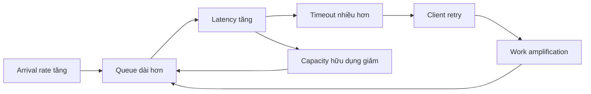
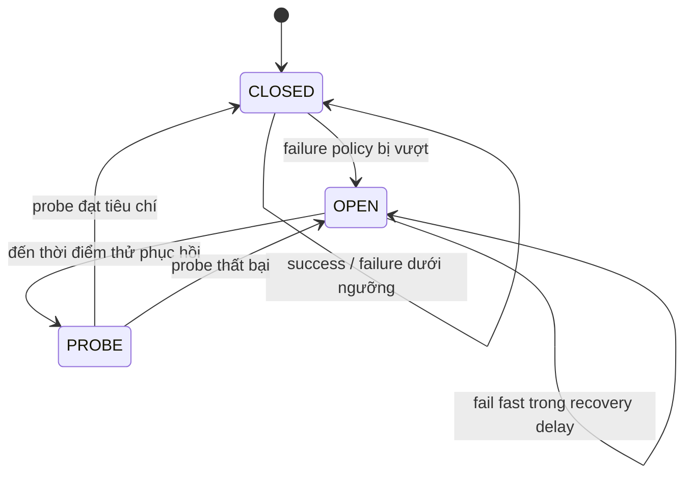
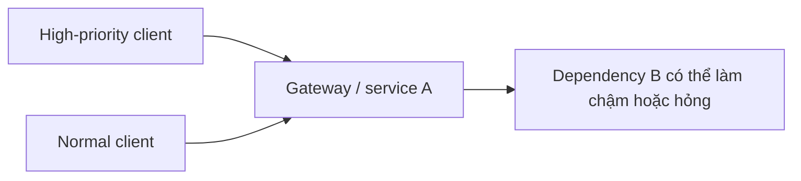

# Rate limiting, backpressure và circuit breaker giữa các dịch vụ

> [!abstract] Câu hỏi trung tâm
> Quá tải hiếm khi chỉ là nhiều request. Queue dài làm latency tăng; client timeout rồi retry; retry lại làm arrival rate tăng; tài nguyên bị giữ lâu hơn và capacity hữu dụng giảm. Muốn chặn vòng phản hồi ấy, hệ thống phải giới hạn lượng việc nhận vào, truyền tín hiệu giảm tốc, loại bỏ công việc ít giá trị, dừng gọi dependency đang hỏng và ràng buộc mọi retry bằng deadline cùng budget.

## 1. Overload là một vòng phản hồi



Khi throughput tiến gần capacity, request mới phải chờ tài nguyên đang bận. Queueing delay tăng mạnh trước cả khi server sập. Nếu timeout kích hoạt retry, chính cơ chế phục hồi làm thêm việc vào lúc hệ ít khả năng xử lý nhất.

Một hệ có thể tiếp tục ở trạng thái quá tải ngay cả khi external load đã giảm: queue cũ, retry đang chờ, connection tồn đọng và synchronized backoff tiếp tục duy trì áp lực. DDIA gọi hiện tượng hệ không tự trở lại trạng thái ổn định này là metastable failure.

> [!source-fact]
> Quan hệ throughput-response time, queueing delay, retry storm và metastable failure nằm tại DDIA Second Edition Early Release, Chapter 2, PDF 76-78.

> [!uncertainty]
> DDIA được dùng ở đây là bản Early Release chưa hoàn chỉnh, có thể đổi wording và pagination khi phát hành chính thức. Luận điểm overload được đối chiếu với Cloud Native Go; locator DDIA phải kiểm lại khi bản cuối được đưa vào kho.

## 2. Mục tiêu không phải nhận mọi request

Nếu arrival rate vượt service rate đủ lâu, không thuật toán queue nào làm biến mất phần chênh lệch. Hệ thống chỉ còn các lựa chọn:

- tăng capacity;
- làm mỗi request rẻ hơn;
- làm producer chậm lại;
- từ chối hoặc trì hoãn một phần công việc;
- giữ lại công việc quan trọng và bỏ phần ít giá trị hơn.

Nhận hết rồi để queue tăng vô hạn chỉ trì hoãn quyết định. Đến lúc memory, connection pool hoặc thread pool cạn, hệ thống vẫn phải drop:nhưng drop muộn hơn, tốn nhiều tài nguyên hơn và khó giải thích hơn.

> [!source-fact]
> Cloud Native Go nêu rằng mọi service đều có ngưỡng request frequency vượt quá khả năng và khi ấy buộc phải từ chối một phần hoặc toàn bộ request; Chapter 9, trang in 269-270, PDF 291-292.

## 3. Sáu cơ chế bảo vệ sáu điểm khác nhau

| Cơ chế | Tín hiệu vào | Hành động | Tài nguyên hoặc boundary được bảo vệ |
|---|---|---|---|
| TCP flow control | Receive buffer còn trống (`rwnd`) | Giảm byte đang bay tới receiver | Socket receive buffer |
| Rate limiting / throttling | Rate theo key vượt policy | Delay hoặc reject trước xử lý | Quota/capacity được phân bổ |
| Concurrency limiting | In-flight work đạt trần | Không nhận thêm work đồng thời | Worker, connection, CPU, downstream |
| Backpressure | Consumer báo không theo kịp | Producer giảm tốc/dừng/đổi chế độ | Toàn tuyến producer-consumer |
| Load shedding | Saturation signal vượt ngưỡng | Drop, reject hoặc degrade có chủ đích | Sức khỏe service khi quá tải |
| Circuit breaker | Downstream failures/latency vượt policy | Fail fast, không phát outgoing call | Downstream và tài nguyên caller |

Cùng là làm ít request đi nhưng chúng không thay nhau. Rate limiter có thể chặn caller vượt quota dù downstream hoàn toàn khỏe. Circuit breaker có thể mở ở rate thấp nếu các call liên tiếp thất bại.

> [!synthesis]
> Bảng là taxonomy biên tập từ ba nguồn. Cloud Native Go so sánh throttle với circuit breaker; DDIA nối load shedding, backpressure, circuit breaker và token bucket trong overload loop; Kurose-Ross cung cấp TCP flow-control boundary.

## 4. TCP flow control không phải service backpressure

TCP receiver quảng bá receive window theo phần trống của receive buffer. Nếu application phía nhận đọc chậm, `rwnd` co lại và có thể về 0. Cơ chế này bảo vệ buffer của một TCP endpoint.

Nó không biết:

- hàng đợi business task sau parser dài bao nhiêu;
- database connection pool còn chỗ hay không;
- request nào ưu tiên cao;
- operation có thể degrade hay phải reject;
- caller nên giảm rate trong bao lâu.

Một service vẫn có thể đọc nhanh khỏi socket, làm `rwnd` rộng, rồi dồn request vào queue nội bộ không giới hạn. Transport khỏe trong khi application đã quá tải.

> [!source-fact]
> Receive buffer, `rwnd` và việc ghép tốc độ sender với nhịp application đọc socket nằm tại Kurose-Ross §3.5.5, trang in 276-278, PDF 278-280.

## 5. Backpressure là một hợp đồng phản hồi

Backpressure cần một đường truyền tín hiệu từ consumer về producer. Tín hiệu có thể là:

- response từ chối tạm thời kèm chỉ dẫn retry;
- credit hoặc demand count;
- queue capacity còn lại;
- consumer lag;
- pause/resume consumption;
- protocol-level window;
- broker quota hoặc producer throttle.

Một tín hiệu chỉ hữu ích nếu producer thực sự thay đổi hành vi. Nếu server trả chậm lại nhưng mọi client retry ngay, đó là error response chứ chưa phải backpressure hoạt động.

Backpressure contract phải nói rõ:

1. saturation signal được đo ở đâu;
2. ai nhận signal;
3. giảm rate theo thuật toán nào;
4. work đang chờ được giữ, drop hay chuyển nơi nào;
5. khi nào producer được tăng rate trở lại;
6. deadline và ordering thay đổi ra sao.

> [!source-fact]
> DDIA Early Release nêu server có thể chủ động reject khi gần overload và gửi response yêu cầu client giảm tốc; Chapter 2, PDF 78.

> [!synthesis]
> Sáu câu hỏi là contract kiểm tra do biên soạn viên xây từ định nghĩa backpressure. Nguồn không đưa ra một wire protocol chung cho mọi hệ thống.

## 6. Bounded queue là điều kiện để overload quan sát được

Queue cần ít nhất bốn giới hạn:

- số item tối đa;
- tổng byte tối đa;
- tuổi tối đa của item;
- tổng in-flight work tối đa sau dequeue.

Khi queue chạm giới hạn, policy phải xác định `reject`, `drop`, `block`, `spill` hoặc `degrade`. Không có lựa chọn mặc định đúng cho mọi workload:

- request đồng bộ thường cần fail nhanh hơn là xếp hàng lâu hơn deadline;
- event có thể ghi bền vững vào broker nếu retention và disk capacity đủ;
- telemetry có thể drop theo sampling;
- giao dịch tài chính không được drop im lặng;
- batch có thể hoãn nếu SLA cho phép.

Queue depth một mình chưa nói được tình trạng. Cần arrival rate, completion rate, age của item già nhất, retry rate và deadline còn lại.

> [!inference]
> Bộ bốn giới hạn là chuẩn thiết kế suy ra từ queueing và overload feedback. Ngưỡng cụ thể phải được chứng minh bằng capacity test; các nguồn không cấp một con số dùng chung.

## 7. Rate limiter đặt một admission policy

Rate limiter quyết định caller nào được tạo work mới theo một policy định trước. Policy có thể đặt ở:

- toàn service;
- tenant hoặc API key;
- endpoint;
- operation class;
- cost unit thay vì request count;
- tổ hợp global limit và per-key limit.

Nếu mọi request có cost khác nhau, 100 request/s không đại diện tải. Một query scan lớn và một health check nhẹ không nên tiêu cùng một đơn vị. Weighted token hoặc concurrency cost thường phản ánh tài nguyên tốt hơn request count thuần.

> [!source-fact]
> Cloud Native Go mô tả throttling theo ngưỡng rate định trước, thường dùng để ngăn một user tiêu quá nhiều tài nguyên, và minh họa cả global lẫn per-user bucket; trang in 270-274, PDF 292-296.

## 8. Token bucket giữ burst trong một biên xác định

Token bucket có hai tham số cơ bản:

- capacity `B`: số token tối đa, quyết định burst có thể đi qua ngay;
- refill rate `r`: token thêm theo thời gian, quyết định rate duy trì dài hạn.

Mỗi request tốn `c` token. Request được nhận nếu bucket còn ít nhất `c`; nếu không, policy delay hoặc reject. Sau khoảng thời gian `Δt`, số token khả dụng được giới hạn bởi:

$$
tokens(t + \Delta t) = \min(B, tokens(t) + r\Delta t)
$$

Bucket capacity không phải throughput của service; refill rate cũng không tự suy ra từ CPU. Hai giá trị là policy admission phải được hiệu chỉnh bằng workload, cost distribution và SLO.

### Ví dụ quyết định

Một bucket capacity 20, refill 10 token/s cho phép burst 20 request khi bucket đầy rồi tiến về rate dài hạn 10 request/s nếu mỗi request tốn một token. Nếu request nặng tốn 5 token, cùng bucket chỉ nhận bốn request nặng trong burst.

> [!source-fact]
> Cloud Native Go dùng token bucket với capacity, refill count và thời lượng refill; trang in 271-272, PDF 293-294. Công thức trên là cách viết toán học tương đương, không phải công thức in nguyên dạng trong sách.

## 9. State của limiter quyết định tính công bằng

Per-user bucket ngăn một caller chiếm hết quota nhưng đặt ra ba vấn đề:

1. **Identity**: key nào đại diện caller:user, tenant, API key, IP hay workload class?
2. **Storage**: local state làm mỗi replica có quota riêng; shared state thêm latency và failure mode.
3. **Lifecycle**: key cũ phải được purge; nếu không, cardinality tăng thành memory leak.

Ví dụ trong sách giữ bucket map cục bộ và tác giả ghi rõ chưa production-ready: chưa an toàn đầy đủ cho concurrent use, không purge record cũ, không chia sẻ quota giữa replica.

> [!source-fact]
> Các giới hạn concurrency, record eviction và local multi-replica state được Cloud Native Go nêu trực tiếp tại trang in 273-274, PDF 295-296.

## 10. Response của limiter là một phần protocol

Reject cần machine-readable reason và hướng dẫn caller. Với HTTP, sách minh họa `429 Too Many Requests` cho throttled request. Một contract thực tế còn cần xem xét:

- retry có được phép không;
- thời điểm hoặc khoảng chờ tối thiểu;
- limit áp theo key nào;
- request có bị xử lý một phần không;
- correlation ID và quota observation nào được log.

Caller không nên diễn giải mọi `429` như lệnh retry vô hạn. Deadline, retry budget và idempotency vẫn áp dụng.

> [!source-fact]
> Ví dụ REST trong Cloud Native Go trả HTTP 429 khi per-user throttle không cho phép request; trang in 273-274, PDF 295-296.

## 11. Concurrency limiter bảo vệ số công việc đang chạy

Rate và concurrency đo hai thứ khác nhau. Theo Little's Law ở trạng thái ổn định:

$$
L = \lambda W
$$

với `L` là số công việc trung bình trong hệ, `λ` là throughput và `W` là thời gian ở trong hệ. Khi latency `W` tăng, cùng arrival rate vẫn tạo nhiều in-flight work hơn. Vì vậy rate limiter cố định có thể chưa đủ khi downstream chậm.

Concurrency limiter đặt trần số call đang chạy hoặc giữ resource. Khi hết slot, request mới phải bị reject, queue có giới hạn hoặc dùng priority policy. Trần có thể đặt theo endpoint, dependency hoặc work class.

> [!synthesis]
> Cloud Native Go mô tả connection-pool depletion do downstream chậm và timeout; DDIA mô tả queueing khi throughput gần capacity. Việc tách rate limit với concurrency limit là kết luận thiết kế. Hai phần nguồn không đưa một adaptive-concurrency algorithm hoàn chỉnh.

## 12. Load shedding phản ứng với saturation thật

Throttle dùng quota/rate định trước. Load shedding quan sát resource hoặc queue đang tiến tới điểm bão hòa rồi chủ động bỏ một phần load. Signal có thể gồm:

- queue depth và queue age;
- CPU run queue;
- memory pressure;
- worker/thread/connection pool utilization;
- in-flight count;
- event-loop lag;
- deadline còn lại;
- downstream saturation.

Cloud Native Go minh họa middleware reject bằng HTTP 503 khi queue depth vượt ngưỡng giả định. Tác giả gọi đây là ví dụ; hàm đo queue và threshold thực phải đến từ implementation.

> [!source-fact]
> Định nghĩa load shedding, khác biệt với quota-based throttling và ví dụ queue-depth/HTTP 503 nằm tại Cloud Native Go, trang in 274-275, PDF 296-297.

## 13. Shed có ưu tiên tốt hơn drop ngẫu nhiên

Khi mọi request không cùng giá trị, policy có thể giữ:

- control-plane và health traffic;
- write quan trọng hơn refresh phụ;
- customer tier đã cam kết;
- request sắp hoàn tất hơn request mới tốn nhiều work;
- công việc có deadline còn khả thi.

Graceful degradation giảm cost thay vì bỏ toàn bộ request: trả cache cũ có đánh dấu, giảm độ chính xác, bỏ enrichment, giảm fan-out hoặc trả response tối giản. Chỉ degrade khi business semantics cho phép; dữ liệu cũ không được giả làm dữ liệu mới.

> [!source-fact]
> Cloud Native Go nêu priority shedding và graceful degradation bằng cached data hoặc thuật toán rẻ
hơn nhưng kém chính xác; trang in 274-275, PDF 296-297.

> [!inference]
> Danh sách priority class là ví dụ thiết kế; policy thật cần product/SLO decision và security review.

## 14. Circuit breaker chặn outgoing call có xác suất thất bại cao

Breaker bọc lời gọi tới dependency. Ở trạng thái closed, call đi qua và outcome được quan sát. Khi số failure liên tiếp vượt threshold trong mô hình của sách, breaker mở. Ở trạng thái open, call mới fail fast hoặc dùng fallback đã định, không chạm dependency.



Sách mô tả hai trạng thái closed/open và tự đóng lại sau thời gian chờ. Sơ đồ dùng tên `PROBE` để thể hiện bước kiểm có giới hạn trước khi phục hồi traffic; nhiều library gọi trạng thái này là half-open, nhưng semantics phải lấy từ library cụ thể.

> [!source-fact]
> Mục đích, closed/open state, failure threshold, fail-fast và delayed recovery của Circuit Breaker nằm tại Cloud Native Go, Chapter 4, trang in 77-78, PDF 99-100; tóm lược lại tại trang in 280, PDF 302.

> [!synthesis]
> `PROBE` là state biên tập để tránh mở toàn bộ traffic ngay khi hết delay. Nguồn đã đọc không chuẩn hóa tên hoặc số lượng probe.

## 15. Breaker cần phân loại failure

Không phải outcome xấu nào cũng chứng minh dependency hỏng. Policy cần tách:

- transport timeout/reset;
- dependency 5xx hoặc unavailable;
- caller cancellation;
- validation/business rejection;
- rate-limit response;
- local resource exhaustion;
- slow success vượt latency threshold.

Nếu đếm mọi 4xx là dependency failure, một đợt client gửi payload sai có thể mở circuit khỏe. Nếu bỏ qua timeout hoặc slow success, pool vẫn cạn dù breaker thấy không có lỗi.

> [!synthesis]
> Nguồn minh họa consecutive errors nhưng không định nghĩa classifier dùng chung. Failure taxonomy là phần bắt buộc của implementation contract và phải phù hợp protocol đang gọi.

## 16. Circuit breaker không phải rate limiter

| Thuộc tính | Circuit breaker | Rate limiter / throttle |
|---|---|---|
| Vị trí điển hình | Outgoing dependency call | Incoming admission, đôi khi outgoing quota |
| Signal chính | Failure/latency của dependency | Rate/cost theo policy |
| Khi hệ khỏe nhưng tải cao | Có thể vẫn closed | Có thể reject |
| Khi tải thấp nhưng dependency hỏng | Có thể open | Có thể vẫn cho qua quota |
| Hành động | Fail fast hoặc fallback | Delay/reject theo token/quota |
| Mục đích | Ngăn doomed calls và cho dependency hồi phục | Giữ workload trong phần capacity đã cấp |

> [!source-fact]
> Cloud Native Go đối chiếu circuit breaker với throttle theo outgoing/incoming usage, consecutive failures và maximum request rate; trang in 280, PDF 302.

## 17. Fallback cũng tiêu tài nguyên

Fallback chỉ tốt khi:

- rẻ hơn đường chính;
- không gọi lại dependency đang hỏng qua một tuyến khác;
- semantics chấp nhận được và được gắn nhãn;
- không dùng chung resource pool đang cạn;
- không làm dữ liệu cũ hoặc thiếu bị hiểu là thành công đầy đủ.

Một fallback đọc cache có thể gây cache stampede; một fallback gọi secondary region có thể dồn tải làm region đó sập; default rỗng có thể che mất dữ liệu. Breaker mở nhưng fallback đắt vẫn giữ vòng feedback.

> [!inference]
> Các failure mode của fallback là phép áp dụng nguyên lý fault containment. Phạm vi nguồn chỉ nói fail-fast hoặc defined fallback, không chứng minh một fallback cụ thể là an toàn.

## 18. Retry là work amplification

Với tối đa `k` retry, một request logical có thể tạo tới `k + 1` attempt tại một layer. Nếu nhiều layer cùng retry, amplification nhân lên. Ba layer, mỗi layer tối đa hai retry, có thể tạo số attempt tối đa:

$$
(2 + 1)^3 = 27
$$

Con số là upper-bound minh họa; cancellation và failure sớm có thể làm ít hơn. Nó cho thấy vì sao retry policy phải có một owner và budget xuyên tuyến.

Cloud Native Go mô tả retry loop không delay trên nhiều instance đã tạo retry storm, khiến downstream khó phục hồi ngay cả sau khi lỗi ban đầu hết.

> [!source-fact]
> Retry storm và positive feedback được trình bày tại Cloud Native Go, trang in 275-276, PDF 297-298; DDIA Early Release mô tả cùng cơ chế tại PDF 78.

> [!synthesis]
> Phép tính 27 attempt là mô hình amplification tự xây, không phải số liệu đo từ hai sách.

## 19. Backoff phải có jitter và giới hạn

Fixed delay làm nhiều client tiếp tục retry cùng nhịp. Exponential backoff giãn attempt nhưng nếu mọi instance có cùng lịch, spike vẫn đồng bộ. Jitter phân tán attempt theo thời gian.

Một retry policy cần:

- maximum attempts;
- maximum elapsed time hoặc deadline;
- backoff cap;
- jitter strategy;
- retryable error classifier;
- idempotency/side-effect rule;
- circuit-breaker interaction;
- global retry budget.

Không retry sau khi deadline còn lại nhỏ hơn thời gian cần để attempt có ích. Không retry operation có side effect nếu protocol không cung cấp idempotency key, deduplication hoặc outcome reconciliation.

> [!source-fact]
> Fixed backoff, exponential backoff, synchronized spikes và jitter nằm tại Cloud Native Go, trang in 276-280, PDF 298-302.

> [!synthesis]
> Retry budget và idempotency gate nối nội dung nguồn với failure boundary của chương HTTP/API client. Nguồn có phần idempotence sau trang 281 nhưng không nằm trong phạm vi đọc của note này; chi tiết cần source pass riêng trước khi làm production policy.

## 20. Timeout giải phóng caller nhưng không hủy work mặc nhiên

Timeout giúp caller ngừng giữ thread, connection hoặc request state quá lâu. Nếu downstream chậm, request tích lũy có thể làm cạn connection pool và lan lỗi sang service khác.

Tuy nhiên, caller timeout không chứng minh downstream dừng. Muốn cancellation truyền xuống, API và runtime phải hỗ trợ signal, và downstream phải tôn trọng nó. Nếu operation đã commit, retry có thể tạo side effect lặp.

> [!source-fact]
> Cloud Native Go mô tả database chậm làm request giữ connection tới khi pool cạn, và dùng timeout/ context cancellation để giải phóng resource; trang in 281, PDF 303.

## 21. Thứ tự các lớp bảo vệ

Một tuyến synchronous có thể tổ chức:

```text
request
  → authentication / request classification
  → global và per-tenant admission limit
  → bounded queue / concurrency limit
  → deadline còn lại
  → circuit breaker của dependency
  → retry có budget + backoff + jitter
  → dependency
```

Không có một thứ tự duy nhất cho mọi kiến trúc, nhưng có ba invariant:

1. work không hợp lệ bị loại trước khi chiếm tài nguyên đắt;
2. deadline và cancellation phải đi cùng request;
3. retry không được vượt admission/circuit policy bằng đường vòng.

Rate limiter đặt quá sớm có thể tốn quota cho request không xác thực; đặt quá muộn có thể cho attacker đốt CPU parsing/auth trước khi bị chặn. Đây là threat-model decision.

> [!synthesis]
> Pipeline là kiến trúc tham khảo, tổng hợp các cơ chế trong nguồn. Cần đổi theo trust boundary, cost profile và framework thực tế.

## 22. Tuyến bất đồng bộ cần quản lý lag và retention

Với broker, producer có thể tiếp tục ghi khi consumer chậm cho đến khi quota, partition throughput, retention hoặc storage thành bottleneck. Broker buffer làm spike ngắn dễ chịu hơn nhưng không sửa được chênh lệch dài hạn giữa producer rate và consumer rate.

Backpressure policy cho pipeline cần trả lời:

- lag được đo bằng offset, age hay byte;
- mức nào giảm producer rate;
- event hết deadline được xử lý ra sao;
- partition nóng có được tách hay rebalance;
- storage sắp đầy thì block, reject hay drop;
- replay có làm tăng load hơn production traffic không.

> [!inference]
> Phần async là áp dụng từ bounded-queue và backpressure model. Hai nguồn chính trong phạm vi đọc tập trung vào request-driven service; broker-specific semantics cần tài liệu Kafka hoặc nền tảng tương ứng.

## 23. Một overload policy tối thiểu

| Thành phần | Câu hỏi phải trả lời |
|---|---|
| Capacity unit | Request, byte, CPU-cost, query-cost hay concurrency? |
| Admission scope | Global, tenant, endpoint, priority hay dependency? |
| Queue bound | Items, bytes, age và in-flight tối đa là bao nhiêu? |
| Rejection | Status/error nào, có retry hint không? |
| Backpressure | Tín hiệu nào và producer phản ứng ra sao? |
| Load shedding | Resource nào kích hoạt, work nào bị bỏ trước? |
| Degradation | Dữ liệu/độ chính xác/chức năng nào được giảm và gắn nhãn gì? |
| Breaker | Failure nào được đếm, window/threshold/recovery probe nào? |
| Retry | Owner, attempts, elapsed budget, backoff, jitter, idempotency? |
| Deadline | End-to-end budget được chia và truyền xuống thế nào? |
| Recovery | Tăng tải trở lại theo nhịp nào để tránh tái quá tải? |

Nếu một ô chưa trả lời được, đó là khoảng trống thiết kế, không phải dùng default của library.

## 24. Metric phải giải thích được quyết định

### Admission và queue

- accepted/rejected theo limiter key và reason;
- token balance distribution hoặc quota utilization;
- in-flight count;
- queue depth, bytes và oldest age;
- wait time trước xử lý.

### Shed và degrade

- shed count theo priority/work class;
- response status và retry hint;
- degraded-response count;
- resource signal tại thời điểm shed.

### Circuit breaker

- state transition và timestamp;
- classified success/failure/ignored outcome;
- fail-fast count;
- probe count và result;
- fallback count, latency và error.

### Retry

- logical requests và physical attempts;
- attempts per request;
- retry budget consumed;
- backoff delay;
- final outcome và deadline exhaustion.

Một metric `errors_total` không đủ để biết hệ đã bảo vệ đúng workload hay chỉ từ chối tất cả.

## 25. Thực nghiệm kiểm soát quá tải cho DE-L087

### Hệ thử



### Baseline

1. Chạy tải dưới capacity, ghi throughput, p50/p95/p99, queue age, in-flight và error.
2. Tăng tải tới khi queue tăng; không bật limiter/breaker để ghi failure mode.
3. Làm dependency B chậm rồi hỏng hoàn toàn; đo retry amplification và pool usage.

### Policy cần dựng

- bounded queue và concurrency limit;
- quota riêng cho priority class;
- load shedding normal work khi saturation vượt ngưỡng;
- circuit breaker trên call A → B;
- retry tối đa hữu hạn, exponential backoff có jitter;
- deadline end-to-end;
- fallback chỉ khi semantics cho phép.

### Bằng chứng đạt

- high-priority success rate còn trong ngưỡng đã đặt khi overload;
- queue depth/age không tăng vô hạn;
- breaker mở và số call thật tới B giảm gần về mức probe khi B hỏng;
- physical attempts/logical request không vượt budget;
- service hồi phục khi bỏ fault mà không cần restart;
- mọi rejected/degraded response có reason và được phân loại.

Mức chấp nhận được phải được ghi thành số trước khi chạy. Không được nhìn graph sau test rồi chọn threshold có lợi cho kết quả.

> [!synthesis]
> Thực nghiệm chuyển objective và Done when của DE-L087 thành evidence plan. Nguồn cung cấp cơ chế và failure model, không cung cấp ngưỡng cho hệ thử này.

## 26. Các tình huống cần phân biệt

| Hiện tượng | Cách giải thích có thể | Bằng chứng quyết định |
|---|---|---|
| Latency tăng, CPU thấp | Queue ở pool/downstream, lock, external wait | queue age, in-flight, pool wait, trace |
| 429 tăng | Quota/admission policy hoạt động hoặc key sai | limiter key, token/quota state, config version |
| 503 tăng khi tải cao | Load shedding hoặc dependency unavailable | shed reason, saturation signal, upstream status |
| Breaker mở ở tải thấp | Dependency failure/latency classifier | transition log, sampled outcomes, threshold |
| Breaker không mở khi pool cạn | Slow success/timeout chưa được tính | latency histogram, timeout class, pool occupancy |
| Retry tăng nhưng success không tăng | Non-retryable failure hoặc deadline quá ngắn | logical-vs-physical attempts, final class |
| Hết fault nhưng hệ chưa hồi | Queue/retry backlog, probe quá mạnh, metastability | queue age, scheduled retries, recovery traffic |
| Priority traffic vẫn lỗi | Shared bottleneck trước classifier hoặc quota không reserve | path metrics, admission order, resource partition |

## 27. Những cách hiểu sai thường gặp

| Cách hiểu sai | Cách đọc đúng |
|---|---|
| Rate limiter và circuit breaker đều chỉ chặn request | Một cái theo rate/quota; một cái theo dependency failure |
| Queue lớn giúp không mất request | Queue lớn tăng wait, memory và stale work; vẫn cần bound |
| TCP flow control bảo vệ application khỏi overload | Nó bảo vệ receive buffer, không biết business queue |
| Backpressure là trả lỗi | Producer phải nhận signal và thực sự giảm tốc |
| Autoscaling luôn chữa được cascading failure | Node mới có thể bị áp lực feedback làm quá tải ngay |
| Retry tăng reliability trong mọi trường hợp | Retry tạo thêm work và cần classifier, budget, deadline |
| Exponential backoff tự tránh retry spike | Client cùng lịch vẫn đồng bộ; cần jitter |
| Timeout hủy downstream operation | Chỉ đúng nếu cancellation được truyền và tôn trọng |
| Breaker mở nghĩa dependency chắc chắn hỏng | Nó phản ánh classifier và observation window, có thể cấu hình sai |
| Fallback luôn làm hệ bền hơn | Fallback có thể đắt, sai semantics hoặc làm hỏng dependency khác |
| 429 và 503 đều retry giống nhau | Cần đọc contract, deadline, idempotency và retry hint |
| Shed ngẫu nhiên là công bằng | Work khác priority và cost; policy phải được định nghĩa |

## 28. Giới hạn của nguồn và của chương

Chương này chưa đủ để:

- chọn threshold, bucket size, refill rate hoặc concurrency limit cho production;
- chọn circuit-breaker library hay khẳng định state machine của một implementation;
- định nghĩa HTTP/gRPC retry contract hoàn chỉnh;
- chứng minh một operation idempotent hoặc retry-safe;
- thiết kế distributed rate limiter nhất quán toàn cầu;
- quyết định priority và degraded semantics thay product owner;
- thiết kế Kafka quota, consumer lag policy hoặc storage backpressure;
- thay load test, chaos test và capacity model;
- dùng DDIA Early Release như bản cuối không cần kiểm lại;
- suy ra quyền phát hành lại từ việc có tệp PDF;
- chứng minh hệ đã hồi phục nếu chưa bỏ fault và tăng tải trở lại có kiểm soát.

## 29. Câu hỏi ôn tập

1. Queueing delay tạo retry storm theo vòng phản hồi nào?
2. Metastable overload khác spike tải ngắn thế nào?
3. TCP flow control bảo vệ tài nguyên gì và bỏ sót queue nào?
4. Rate limiting, backpressure và load shedding khác nhau ở signal nào?
5. Hai tham số capacity và refill rate của token bucket điều khiển điều gì?
6. Vì sao local per-user bucket không tạo global quota khi có nhiều replica?
7. Rate limit và concurrency limit khác nhau khi downstream latency tăng ra sao?
8. Circuit breaker khác throttle ở failure signal và vị trí áp dụng thế nào?
9. Outcome nào không nên mặc định tính vào breaker failure count?
10. Vì sao fallback vẫn có thể gây cascading failure?
11. Ba layer, mỗi layer hai retry, có upper bound bao nhiêu attempt?
12. Jitter sửa vấn đề nào của exponential backoff?
13. Timeout local chưa chắc hủy downstream work vì sao?
14. Bounded queue cần giới hạn những đại lượng nào?
15. Thực nghiệm DE-L087 phải thu bằng chứng gì để chứng minh priority work còn được phục vụ?

## 30. Liên kết chương trình

- Nguồn: [[SRC-TITMUS-CLOUD-NATIVE-GO-1E]], [[SRC-KLEPPMANN-DDIA-2E-EARLY-RELEASE]], [[SRC-KUROSE-ROSS-NETWORKING-8E]].
- Bài áp dụng trực tiếp: `DE-L087`: Rate limiting and backpressure between services.
- Bài nền: `DE-L079`, `DE-L082`, `DE-L083`, `DE-L086`.
- Bài dùng lại: `DE-L088`, các module ingestion, streaming, distributed systems và reliability.
- Liên quan: [[TCP Reliability RTT RTO and Flow Control|TCP reliability RTT RTO và flow control]], [[TCP Congestion Control AIMD ECN and Fairness|TCP congestion control AIMD ECN và fairness]], [[HTTP Requests Connection State and Caching|HTTP request connection state và cache]], [[Proxies Middleboxes and Load Balancer Connection Boundaries|Proxy middlebox và load balancer - ranh giới kết nối]], [[Socket Byte Streams Framing and Partial I-O|Socket byte stream framing và partial I-O]].
- Nguồn phải bổ sung trước production: tài liệu limiter/breaker/runtime đang dùng, API contract, capacity model, SLO, priority policy, load-test report và fault-injection evidence.

## Source coverage

| Source slice | Nội dung phải giữ | Vị trí trong note | Trạng thái |
|---|---|---|---|
| [[SRC-TITMUS-CLOUD-NATIVE-GO-1E]], Ch. 4 pp. 99-100 | circuit breaker và retry primitive | §§14-20 | Đã trình bày breaker state, failure classification và retry amplification |
| [[SRC-TITMUS-CLOUD-NATIVE-GO-1E]], Ch. 9 pp. 290-303 | service resilience, throttling và overload control | §§1-3, 7-17, 21-24 | Đã trình bày theo vị trí điều khiển và metric |
| [[SRC-KLEPPMANN-DDIA-2E-EARLY-RELEASE]], Ch. 2 pp. 76-80 | queue, overload và backpressure trong hệ phân tán | §§4-6, 21-22 | Đã trình bày; nguồn là early release nên claim được giữ qualifier |
| [[SRC-KUROSE-ROSS-NETWORKING-8E]], §3.5.5 | TCP receive-window flow control | §4 | Đã dùng để phân biệt transport flow control với service backpressure |
| Tổng hợp vận hành | bounded queue, priority shedding, overload experiment và policy | §§6, 11-13, 21-26 | Đã gắn `synthesis`; threshold cụ thể không được gán cho tác giả |

Limiter library, runtime scheduler và production SLO cụ thể không có trong các lát nguồn. Chúng được giữ thành điều kiện cần nguồn và phép đo riêng.

## Key takeaways
- Overload là vòng phản hồi: queue dài làm latency tăng, timeout kích retry, retry tạo thêm work. Hệ thống phải giới hạn admission và work in flight trước khi tài nguyên cạn.
- Rate limiter kiểm tốc độ nhận, concurrency limiter kiểm số việc đồng thời, load shedding loại bớt việc khi bão hòa, circuit breaker chặn call tới dependency đang có xác suất lỗi cao.
- Backpressure là protocol phản hồi từ consumer tới producer; queue vô hạn chỉ trì hoãn failure và làm mất khả năng đặt giới hạn latency.
- Retry cần deadline, budget, backoff và jitter. Timeout của caller không mặc nhiên hủy work ở downstream, nên retry có thể nhân bản side effect hoặc tải.
- Policy phải chỉ rõ priority, giới hạn, response, metric và ownership. Load test cần chứng minh cả capacity bình thường lẫn việc ưu tiên còn được phục vụ khi overload.

## Reference
1. Matthew A. Titmus, *Cloud Native Go: Building Reliable Services in Unreliable Environments*, First Edition, O'Reilly Media, 2021, Chapter 4, printed pp. 77-78, PDF pp. 99-100; Chapter 9, printed pp. 268-281, PDF pp. 290-303.
2. Martin Kleppmann, *Designing Data-Intensive Applications*, Second Edition Early Release, O'Reilly Media, provisional/partial source, Chapter 2, PDF pp. 76-80. Bản nguồn không có pagination in ổn định và chưa phải bản phát hành cuối.
3. James F. Kurose, Keith W. Ross, *Computer Networking: A Top-Down Approach*, Eighth Global Edition, Pearson, 2022, §3.5.5, printed pp. 276-278, PDF pp. 278-280.
4. Hồ sơ nguồn: [[SRC-TITMUS-CLOUD-NATIVE-GO-1E]], [[SRC-KLEPPMANN-DDIA-2E-EARLY-RELEASE]], [[SRC-KUROSE-ROSS-NETWORKING-8E]].
5. Source notes: `Material/DE/Reference/Library/Source-Notes/PACK-SERVICE-RESILIENCE-BOOK-01.md`, `Material/DE/Reference/Library/Source-Notes/PACK-DATA-SYSTEMS-BOOK-01.md` và `Material/DE/Reference/Library/Source-Notes/PACK-OS_NETWORK-BOOK-03.md`.

## Lịch sử biên tập

| Ngày | Trạng thái | Nội dung |
|---|---|---|
| 2026-09-27 | `review` | Đọc trực tiếp ba nguồn; phân tách transport flow control khỏi service overload control; xây feedback model, overload policy, failure matrix và thực nghiệm DE-L087; biên tập Humanizer tiếng Việt |

<!-- ATOMIC-EXECUTION-CAPSULE:START -->

## Execution capsule: kiểm chứng `wiki.distributed-systems.service-overload-backpressure-circuit-breaker`

> [!important] Phân loại mệnh đề
> Với `wiki.distributed-systems.service-overload-backpressure-circuit-breaker`, sơ đồ, ví dụ và artifact về **Rate limiting, backpressure và circuit breaker giữa các dịch vụ** là **synthesis để kiểm chứng**; chúng không phải trích dẫn hay case nguyên văn của nguồn.

### Artifact thực thi tối thiểu

```yaml
concept_id: "wiki.distributed-systems.service-overload-backpressure-circuit-breaker"
concept: "Rate limiting, backpressure và circuit breaker giữa các dịch vụ"
primary_question: "Khi tải vượt khả năng xử lý hoặc downstream đang hỏng, rate limiter, backpressure, load shedding và circuit breaker phải phối hợp thế nào để hệ suy gi"
decision_contract:
  input_boundary: "Ghi population, thời điểm, owner và điều chưa biết"
  hard_constraints:
    - "Không vượt quyền hoặc privacy boundary"
    - "Không dùng cùng một assumption làm cả implementation và oracle"
  accept_when: "Có observation phân biệt được các lựa chọn"
  reversal_trigger: "Một hard constraint sai hoặc evidence mới đổi recommendation"
evidence_to_keep:
  - "input snapshot"
  - "chosen and rejected options"
  - "independent review result"
```

Artifact của `wiki.distributed-systems.service-overload-backpressure-circuit-breaker` buộc người dùng ghi boundary, oracle và reversal trigger cho **Rate limiting, backpressure và circuit breaker giữa các dịch vụ**. Các giá trị minh họa phải được thay bằng evidence thật trước khi dùng cho quyết định.

### Tự kiểm tra trước khi tái sử dụng

1. Bạn có thể trả lời `Khi tải vượt khả năng xử lý hoặc downstream đang hỏng, rate limiter, backpressure, load shedding và circuit breaker phải phối hợp thế nào để hệ suy giảm có kiểm soát thay vì tự khuếch đại thành cascading failure?` bằng một câu mà không kéo thêm concept thứ hai không?
2. Source locator nào đỡ cho claim, và phần nào chỉ là synthesis trong note?
3. Observation nào khiến bạn dừng, thu hẹp hoặc đảo quyết định?
4. Artifact nào cho phép một reviewer độc lập tái hiện kết quả?

<!-- ATOMIC-EXECUTION-CAPSULE:END -->
