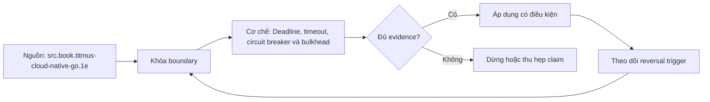

# Deadline, timeout, circuit breaker và bulkhead

> [!abstract] Câu hỏi trung tâm
> Dependency chậm không chỉ làm một request chậm. Nó giữ connection, worker và memory; caller timeout rồi retry; retry làm tải tăng khi capacity đang giảm. Resilience là kiểm soát vòng phản hồi này bằng budget, giới hạn và cô lập, không phải bọc mọi call bằng một thư viện retry.

## 1. Cascading failure bắt đầu từ thời gian giữ tài nguyên

Một outbound call chờ 30 giây có thể giữ inbound connection, worker slot, database connection hoặc semaphore. Khi dependency chậm, số in-flight tăng theo Littles Law:

$$
L = \lambda W
$$

Với arrival rate không đổi, thời gian `W` tăng mười lần làm số work đồng thời `L` tăng gần mười lần trước khi xét retry. Nếu pool hữu hạn, request không liên quan cũng bị xếp hàng hoặc từ chối.

> [!synthesis]
> Timeout, circuit breaker và bulkhead bảo vệ ba điểm khác nhau: timeout giới hạn thời gian một attempt; breaker giới hạn attempt gửi tới dependency đang hỏng; bulkhead giới hạn blast radius của tài nguyên bị chiếm.

## 2. Deadline là budget end-to-end

Deadline là thời điểm request không còn giá trị. Mỗi hop phải biết budget còn lại. Timeout là giới hạn cho một operation/attempt bên trong budget.

Ví dụ request có 800 ms:

```text
admission + queue      80 ms
service A work        120 ms
dependency B budget   350 ms
response margin       100 ms
uncertainty reserve   150 ms
```

Không được đặt ba dependency timeout 800 ms nối tiếp nhau trong request 800 ms. Cần trừ thời gian đã dùng, propagation overhead và cleanup margin. Nếu budget còn lại không đủ cho attempt có ý nghĩa, fail fast hoặc degrade.

Timeout phải bao phủ đúng boundary: DNS/connect/TLS, pool acquisition, request headers, body read, server query, stream idle. Một HTTP timeout duy nhất có thể bỏ sót connection pool wait hoặc stream không kết thúc.

## 3. Chọn timeout từ distribution và hậu quả

Timeout quá ngắn tạo false timeout, retry và load amplification. Quá dài giữ tài nguyên vô ích. Cần dùng latency distribution của dependency trong network path thật, false-timeout budget và SLO end-to-end.

> [!source-fact]
> AWS Builders Library khuyến nghị chọn acceptable false-timeout rate rồi dùng percentile latency tương ứng, đồng thời tính đến network/TLS setup và các dependency có distribution sát nhau; bài Timeouts, retries, and backoff with jitter, truy cập 2026-09-28.

Không copy một số milliseconds từ môi trường khác. Canary, cross-region call, cold connection và deployment warm-up có tail khác steady-state local benchmark.

## 4. Cancellation phải đi cùng timeout

Caller hết deadline nhưng downstream vẫn chạy thì tài nguyên không được giải phóng và work vô ích tiếp tục. Context/cancellation signal phải truyền xuống query/RPC khi protocol hỗ trợ. Cleanup có thể cần một budget riêng ngắn và không bị hủy giữa chừng.

Timeout ở proxy không tự hủy database query. Cần kiểm driver/runtime có propagate cancellation hay không. Nếu operation không cancellable, bulkhead càng quan trọng vì caller không thể thu hồi resource sớm.

## 5. Retry chỉ dành cho failure tạm thời và operation an toàn

Retry hợp lý khi:

- failure có khả năng tạm thời;
- operation idempotent hoặc có idempotency key;
- deadline còn đủ;
- retry budget chưa hết;
- caller không làm overload nặng hơn;
- error signal phân loại được.

Không retry validation error, permission denial hoặc permanent not-found. Không retry non-idempotent mutation nếu outcome chưa rõ mà không có deduplication. L105 cung cấp contract cần thiết.

## 6. Retry là phép nhân tải

Nếu mỗi tầng tự retry ba lần trong call chain năm tầng, một request có thể khuếch đại thành nhiều attempt phía dưới. Thực tế còn giới hạn bởi failure path, nhưng hướng nguy hiểm là rõ: retry ở nhiều tầng nhân work và làm diagnosis khó.

Chọn một tầng có ngữ cảnh để retry; thường là tầng caller trực tiếp hiểu idempotency và deadline. Thêm retry budget theo tỷ lệ trên traffic gốc, không chỉ max attempts per request. Khi hệ đã quá tải, budget phải co lại.

## 7. Backoff và jitter

Backoff cho dependency thời gian phục hồi. Exponential backoff có trần tránh tăng vô hạn. Jitter làm các client không thức dậy cùng lúc sau một outage.

```text
delay_n = random(0, min(cap, base * 2^n))
```

Đây là full jitter minh họa; thuật toán cụ thể phải đồng bộ với SDK/platform. Jitter không sửa operation không idempotent hay deadline đã hết. Sleep phải bị cancellation ngắt được.

> [!source-fact]
> AWS mô tả retries là selfish vì tăng load, dùng backoff có trần, jitter để giảm synchronized retry và token bucket để giới hạn retry cục bộ.

## 8. Circuit breaker

Breaker quan sát outcome của một dependency/operation và chuyển trạng thái:

```text
CLOSED --failure policy--> OPEN
OPEN --cool-down--> HALF_OPEN
HALF_OPEN --probe success--> CLOSED
HALF_OPEN --probe failure--> OPEN
```

- `CLOSED`: call bình thường, ghi outcome.
- `OPEN`: fail fast hoặc dùng fallback, không gọi dependency.
- `HALF_OPEN`: chỉ cho số probe giới hạn để kiểm phục hồi.

Breaker không phải retry và không sửa một request đang chạy. Nó ngăn request mới tiếp tục tiêu tài nguyên vào dependency có xác suất thất bại cao.

> [!source-fact]
> *Cloud Native Go* trình bày circuit breaker và retry tại Chapter 4, PDF 99-108; ngưỡng, recovery period và failure classification là policy cần cấu hình theo workload.

## 9. Chọn scope và signal của breaker

Breaker global cho toàn service có thể mở vì một tenant, shard hoặc operation chậm rồi chặn phần khỏe. Breaker quá chi tiết tạo cardinality và sample quá ít. Scope thường theo dependency + operation class + region/shard khi có ý nghĩa.

Signal không nên chỉ đếm mọi exception:

- timeout/connection failure có thể tính;
- `5xx` cần phân loại;
- `4xx` do caller thường không chứng minh dependency hỏng;
- slow-call rate có thể là signal riêng;
- cancellation do client hết deadline không luôn là lỗi dependency;
- minimum sample size tránh mở từ một lỗi đơn lẻ.

Breaker state và transition phải có metric/event. Nếu không, fail fast trông giống dependency trả lỗi ngay.

## 10. Half-open và recovery

Nếu mọi request cùng probe lúc cool-down hết, dependency vừa hồi lại bị dội tải. Half-open phải giới hạn probe concurrency. Success threshold cần đủ để tránh đóng từ một probe may mắn; failure mở lại theo policy.

Breaker không không bao giờ đóng lại. Nó có recovery state, manual override có kiểm soát và observability. Đồng thời không nên flap liên tục; threshold/hysteresis cần đo.

## 11. Bulkhead cô lập pool

Bulkhead chia resource theo dependency, workload hoặc priority:

- connection pool riêng;
- semaphore/concurrency limit riêng;
- thread/process pool riêng;
- queue riêng có giới hạn;
- instance/cell riêng;
- tenant hoặc traffic class riêng.

Nếu external service X treo và chiếm pool X, request chỉ dùng database Y vẫn có pool để chạy. Dùng chung một pool cho mọi outbound call biến một dependency thành failure domain của cả API.

> [!source-fact]
> Azure Architecture Center mô tả Bulkhead pattern là chia service/consumer resource thành các pool để lỗi một phần không cạn resource của phần khác; connection pool riêng theo service là ví dụ chính. Nguồn được tham chiếu qua hồ sơ AWS/Azure tổng hợp trong source record.

## 12. Bulkhead đổi utilization lấy isolation

Pool riêng có thể để capacity rỗi trong khi pool khác quá tải. Đó là trade-off có chủ đích. Có thể dùng shared reserve hoặc dynamic allocation, nhưng phải giữ hard floor cho critical traffic. Nếu mọi pool dùng chung fallback connection ở lúc quá tải, isolation chỉ tồn tại trên sơ đồ.

Chọn boundary theo failure domain và business priority. Một pool cho read-heavy/reporting và pool khác cho transactional path có thể phù hợp hơn một pool theo service name.

## 13. Bounded queue, backpressure và load shedding

Bulkhead không nên có queue vô hạn. Khi concurrency đạt trần, policy phải reject, shed, degrade hoặc enqueue trong capacity/age limit. Request đồng bộ đã gần hết deadline không nên nằm trong queue lâu hơn giá trị còn lại.

Rate limit kiểm admission theo policy; backpressure truyền tín hiệu giảm tốc; load shedding loại work khi saturation; circuit breaker chặn dependency fault. Chúng liên quan nhưng không thay nhau.

Knowledge note [[Rate Limiting Backpressure and Circuit Breakers Between Services]] trình bày đầy đủ overload loop; L107 dùng phần cần thiết để bảo vệ API dependency.

## 14. Fallback phải giữ semantics

Fallback có thể trả cache cũ, partial response, async acceptance hoặc feature unavailable. Nó chỉ đúng nếu contract cho phép và người dùng biết freshness/completeness. Trả dữ liệu rỗng như thành công để giữ availability có thể tạo quyết định sai.

Fallback cũng có dependency và capacity. Nếu breaker mở rồi mọi request dồn vào database fallback chưa được bulkhead, failure chỉ chuyển chỗ.

## 15. Ba kịch bản thí nghiệm

### A. Database chậm gấp mười lần

Tiêm latency vào query path. Đo timeout, pool wait, in-flight, endpoint không dùng DB và cancellation. Sau bulkhead, endpoint không phụ thuộc DB phải giữ service ratio theo ngưỡng đã định.

### B. External dependency chết hoàn toàn

Trả timeout/connection failure. Quan sát breaker mở, call thật giảm, fail-fast tăng, half-open probe và recovery. Retry attempts phải nằm trong budget.

### C. Tải gấp năm lần capacity

Đo queue age, rejection, latency và throughput. Chứng minh bounded admission/load shedding giữ phần traffic ưu tiên và không làm pool toàn cục cạn.

## 16. Đo suy giảm có kiểm soát

Không chỉ báo tổng success rate. Tách:

- endpoint phụ thuộc dependency hỏng;
- endpoint độc lập;
- traffic ưu tiên và best-effort;
- original request và retry attempt;
- served, degraded, rejected, timeout;
- pool utilization/wait theo bulkhead;
- breaker state/call prevented;
- deadline remaining tại mỗi hop;
- recovery time sau khi fault được gỡ.

Mục tiêu L107 là phần không phụ thuộc tiếp tục phục vụ, không phải biến dependency failure thành 100% success.

## 17. Failure matrix

| Failure | Dấu hiệu | Nguyên nhân | Biện pháp |
|---|---|---|---|
| Timeout chồng deadline | response đến sau caller hết hạn | mỗi hop dùng timeout riêng quá dài | propagate deadline, chia budget |
| Retry storm | attempts tăng khi success giảm | retry nhiều tầng, không budget/jitter | retry ownership + budget + jitter |
| Duplicate mutation | side effect lặp | retry non-idempotent | L105 idempotency contract |
| Breaker mở sai | một lỗi chặn toàn dependency | scope/sample/classification sai | phân scope và minimum sample |
| Breaker không hồi | luôn open hoặc flap | half-open/recovery sai | bounded probes + hysteresis |
| Shared pool exhaustion | endpoint độc lập cũng fail | không bulkhead | pool/semaphore/queue riêng |
| Fake fallback | trả empty 200 | che mất semantics | explicit degraded outcome |
| Cancellation leak | caller hết hạn, work vẫn chạy | cancellation không propagate | driver-aware cancellation, bulkhead |

## 18. Bằng chứng cho DE-L107

Evidence pack gồm:

1. call graph có deadline/timeout từng hop;
2. error classification và retry matrix;
3. retry budget, backoff và jitter implementation;
4. breaker transition log và state metrics;
5. resource map trước/sau bulkhead;
6. ba fault scenario với cùng workload seed;
7. service ratio của endpoint độc lập và pool-wait evidence;
8. recovery trace sau khi dependency khỏe lại.

## 19. Câu hỏi tự kiểm tra

1. Deadline khác timeout thế nào?
2. Timeout nào không bao phủ pool acquisition?
3. Khi nào retry làm lỗi nặng hơn?
4. Vì sao retry nhiều tầng khuếch đại tải?
5. Circuit breaker bảo vệ request nào?
6. Half-open cần giới hạn probe vì sao?
7. Bulkhead nên chia theo boundary nào?
8. Queue vô hạn phá bulkhead ra sao?
9. Fallback nào làm sai semantics?
10. Số đo nào chứng minh endpoint độc lập được bảo vệ?

## 20. Giới hạn

- Công thức Littles Law dùng cho capacity reasoning ở trạng thái phù hợp, không dự báo mọi workload burst.
- Threshold breaker, timeout và pool size phải đo; note không cấp default production.
- Pattern không thay capacity planning, backpressure hay sửa dependency gốc.
- SDK retry mặc định phải được kiểm; không giả định chỉ code ứng dụng mới retry.
- Distributed workflow dài cần pattern khác ngoài synchronous resilience.

## Reference
1. [[SRC-TITMUS-CLOUD-NATIVE-GO-1E]]: circuit breaker, retry, throttle, overload, timeout và resilience; PDF 99-108, 290-303.
2. [[SRC-NEWMAN-BUILDING-MICROSERVICES-2E]]: failure isolation và service boundary; dùng như practitioner context, không mặc nhiên yêu cầu microservice.
3. [[SRC-AWS-TIMEOUTS-RETRIES-BACKOFF]]: chọn timeout theo percentile/false-timeout budget, retry amplification, capped backoff, jitter và retry token budget; truy cập 2026-09-28.
4. [[SRC-AZURE-BULKHEAD]]: phân vùng resource/pool để cô lập dependency failure và trade-off của isolation; truy cập 2026-09-28.

## Source coverage

| Source slice | Nội dung phải giữ | Vị trí trong note | Trạng thái |
|---|---|---|---|
| [[SRC-TITMUS-CLOUD-NATIVE-GO-1E]], PDF 99-108, 290-303 | breaker, retry, throttle, timeout và overload | §§3-10, 13 | Đã giữ cơ chế và giới hạn code minh họa |
| [[SRC-NEWMAN-BUILDING-MICROSERVICES-2E]] | distributed/service failure context | §§1, 11-14 | Chỉ dùng làm bối cảnh, không suy ra phải tách service |
| [[SRC-AWS-TIMEOUTS-RETRIES-BACKOFF]] | percentile timeout, retry load, backoff, jitter, token budget | §§3, 5-7 | Đã phân biệt khuyến nghị với threshold workload |
| [[SRC-AZURE-BULKHEAD]] | pool isolation, connection exhaustion và trade-off | §§11-12 | Đã dùng đúng phạm vi pattern |
| Tổng hợp DE-L107 | deadline propagation, bulkhead resource map, fault lab và evidence | §§2, 4, 11-18 | Đã trình bày thành synthesis có thể kiểm |

Phạm vi đọc bao phủ deadline/timeout, cancellation, retry safety/budget, breaker lifecycle, bulkhead, bounded admission và fault testing. Multi-region disaster recovery bị loại trừ vì ngoài objective.

## Key takeaways
- Deadline là budget end-to-end; timeout của từng attempt phải nằm trong budget còn lại.
- Retry chỉ dành cho lỗi tạm thời, operation an toàn và retry budget chưa hết; jitter không sửa semantics sai.
- Circuit breaker fail fast khi dependency có xác suất hỏng cao và phải có half-open recovery được đo.
- Bulkhead cô lập connection, worker hoặc queue để lỗi một dependency không cạn tài nguyên chung.
- Queue phải bounded và degraded response phải giữ semantics.
- Chứng minh bằng fault injection, tách endpoint phụ thuộc/độc lập và đo recovery, không chỉ nhìn tổng success rate.

<!-- ATOMIC-EXECUTION-CAPSULE:START -->

## Execution capsule: kiểm chứng `wiki.distributed-systems.timeouts-circuit-breakers-bulkheads`

> [!important] Phân loại mệnh đề
> Với `wiki.distributed-systems.timeouts-circuit-breakers-bulkheads`, sơ đồ, ví dụ và artifact về **Deadline, timeout, circuit breaker và bulkhead** là **synthesis để kiểm chứng**; chúng không phải trích dẫn hay case nguyên văn của nguồn.

### Sơ đồ cơ chế và điểm kiểm soát



Đọc sơ đồ `wiki.distributed-systems.timeouts-circuit-breakers-bulkheads` từ trái sang phải: source chỉ cung cấp claim ban đầu cho **Deadline, timeout, circuit breaker và bulkhead**; quyết định chỉ được đi tiếp sau khi boundary, evidence và điều kiện đảo quyết định đã hiện hữu.

### Artifact thực thi tối thiểu

```yaml
concept_id: "wiki.distributed-systems.timeouts-circuit-breakers-bulkheads"
concept: "Deadline, timeout, circuit breaker và bulkhead"
primary_question: "Phối hợp deadline, timeout, retry, circuit breaker và bulkhead thế nào để một dependency chậm hoặc chết không làm cạn tài nguyên của toàn API?"
decision_contract:
  input_boundary: "Ghi population, thời điểm, owner và điều chưa biết"
  hard_constraints:
    - "Không vượt quyền hoặc privacy boundary"
    - "Không dùng cùng một assumption làm cả implementation và oracle"
  accept_when: "Có observation phân biệt được các lựa chọn"
  reversal_trigger: "Một hard constraint sai hoặc evidence mới đổi recommendation"
evidence_to_keep:
  - "input snapshot"
  - "chosen and rejected options"
  - "independent review result"
```

Artifact của `wiki.distributed-systems.timeouts-circuit-breakers-bulkheads` buộc người dùng ghi boundary, oracle và reversal trigger cho **Deadline, timeout, circuit breaker và bulkhead**. Các giá trị minh họa phải được thay bằng evidence thật trước khi dùng cho quyết định.

### Tự kiểm tra trước khi tái sử dụng

1. Bạn có thể trả lời `Phối hợp deadline, timeout, retry, circuit breaker và bulkhead thế nào để một dependency chậm hoặc chết không làm cạn tài nguyên của toàn API?` bằng một câu mà không kéo thêm concept thứ hai không?
2. Source locator nào đỡ cho claim, và phần nào chỉ là synthesis trong note?
3. Observation nào khiến bạn dừng, thu hẹp hoặc đảo quyết định?
4. Artifact nào cho phép một reviewer độc lập tái hiện kết quả?

<!-- ATOMIC-EXECUTION-CAPSULE:END -->
