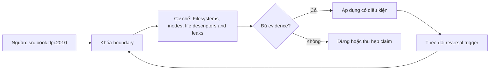

# Filesystems, inodes, file descriptors and leaks

**Tóm tắt bản chất:** Tìm được nguyên nhân đĩa đầy mà không thấy tệp, và định vị một rò rỉ mô tả tệp về đúng đoạn mã. Cơ chế chỉ có giá trị khi workload, version, state owner và failure boundary đã được khóa; một con số đẹp ngoài bốn điều kiện đó không đủ để ra quyết định.

> [!abstract] Câu hỏi trung tâm
> Làm thế nào mô hình, đo và ra quyết định đúng về Filesystems, inodes, file descriptors and leaks?

## Problem Definition and Operational Relevance

Xoá tệp rồi tưởng đã giải phóng dung lượng · so hai lệnh đo dung lượng mà không biết vì sao khác nhau · tăng giới hạn mô tả tệp thay vì sửa rò rỉ. Đây không phải danh sách lỗi cú pháp. Mỗi lỗi làm người vận hành chọn nhầm owner hoặc chữa symptom ở layer sau, khiến thời gian phục hồi tăng dù command vừa chạy trả về thành công.

Năng lực cần giữ sau bài là: Tìm được nguyên nhân đĩa đầy mà không thấy tệp, và định vị một rò rỉ mô tả tệp về đúng đoạn mã. Nếu learner chỉ nhắc lại định nghĩa nhưng không phân biệt được hai state gần nhau trên số đo, bài chưa đạt.

## Mechanism

Hệ tệp tách tên khỏi nội dung: nút chỉ mục giữ siêu dữ liệu và con trỏ tới khối, còn thư mục chỉ là ánh xạ tên sang nút chỉ mục. Từ đó suy ra ba điều hay gây ngạc nhiên: liên kết cứng là hai tên trỏ cùng nút chỉ mục nên xoá một tên không xoá dữ liệu; **xoá một tệp đang được tiến trình mở thì dung lượng không được giải phóng cho tới khi tiến trình đóng**, và đây là nguyên nhân kinh điển của việc đĩa đầy mà tìm không ra tệp nào; và đổi tên trong cùng hệ tệp là thao tác rẻ vì chỉ đổi mục thư mục. Mô tả tệp là chỉ số trỏ vào bảng của tiến trình, và giới hạn số mô tả tệp là giới hạn hay chạm trong dịch vụ dữ liệu. Rò rỉ mô tả tệp: triệu chứng, cách tìm bằng hệ tệp ảo của nhân, và cách sửa bằng trình quản lý ngữ cảnh ở lesson 15. Hai lệnh đo dung lượng cho kết quả khác nhau và lý do.

Tách ba lớp khi đọc cơ chế `wiki.de-foundation.filesystems-inodes-file-descriptors-and-leaks`: declared state là điều cấu hình hoặc API yêu cầu; executed state là việc runtime thực sự làm; consumer-visible state là điều client hay operator quan sát. Ba lớp có thể lệch nhau vì cache, buffering, retry, scheduling, queue hoặc failure giữa hai transition. Evidence phải chỉ ra lớp nào đang được đo.

## Decision Framework

| Bước | Câu hỏi phải khóa | Điều kiện đạt |
|---|---|---|
| Observe | Khóa process, resource, file descriptor và time window | Không trộn symptom giữa hai owner |
| Probe | Dùng phép đo read-only hẹp nhất | Probe phân biệt được hai giả thuyết |
| Contain | Giảm harm trước mutation | Có rollback và state snapshot |
| Escalate | Chuyển owner khi boundary đã chứng minh | Evidence đủ tái hiện |

Quy tắc mặc định là chọn phép giải thích đơn giản nhất qua được hard constraints, rồi viết trước reversal trigger. Với `Filesystems, inodes, file descriptors and leaks`, absence of error không phải pass; pass cần observation đúng grain, một oracle độc lập và changed-constraint case đủ làm model có cơ hội thất bại.

## Worked Case: Filesystems, inodes, file descriptors and leaks

Tạo tình huống đĩa đầy do tệp đã xoá nhưng còn mở; dùng công cụ hệ thống tìm ra tiến trình giữ nó. Chạy một dịch vụ rò rỉ mô tả tệp, quan sát số mô tả tăng theo thời gian, định vị đoạn mã, sửa bằng trình quản lý ngữ cảnh, và chứng minh số mô tả ổn định sau 10.000 yêu cầu.

Trong case `wiki.de-foundation.filesystems-inodes-file-descriptors-and-leaks`, learner ghi expected transition, input snapshot, version và giới hạn an toàn trước khi chạy. Sau execution, họ giữ raw counter, timestamp, exit status, state trước-sau và giải thích delta bằng mechanism ở trên. Đánh giá không cho phép sửa expected result sau khi nhìn output mà không ghi change record.

Biến thể khó hơn đổi một constraint có khả năng đảo kết luận: workload shape, memory pressure, connection reuse, retry budget, permission hoặc dependency direction. Tầng *phân tích*. Objective là hai chẩn đoán cụ thể mà người mới gần như luôn bế tắc. Kiểm bằng hai tình huống tiêm sẵn tính giờ; đạt khi tìm ra nguyên nhân cả hai và sửa được rò rỉ có bằng chứng số mô tả tệp không tăng.

## Limits and Common Errors

**Hiểu lầm:** Xoá tệp rồi tưởng đã giải phóng dung lượng. **Thực tế:** tín hiệu chỉ chứng minh điều nó đo trong đúng scope; state ở layer khác vẫn có thể trái ngược. **Vì sao nghe hợp lý:** happy path nhỏ thường không chạm queue, cache, partial progress hoặc restart.

**Hiểu lầm:** so hai lệnh đo dung lượng mà không biết vì sao khác nhau. **Thực tế:** tool và API cung cấp primitive, không tự cấp ownership, deadline, idempotency hay recovery policy. **Vì sao nghe hợp lý:** syntax gọn che mất protocol và lifecycle phía dưới.

Với `wiki.de-foundation.filesystems-inodes-file-descriptors-and-leaks`, một edge case đáng giữ là observation đúng nhưng diagnosis sai: counter tăng thật, song nguyên nhân điều khiển nằm ở layer trước. Muốn tránh, timeline phải nối trigger tới consumer harm và ghi rõ negative control nào đã loại giả thuyết cạnh tranh.

## Nếu Bạn Dạy Lại Điều Này...

Mở bài bằng một dự đoán dễ sai về `Filesystems, inodes, file descriptors and leaks`, không mở bằng định nghĩa. Cho hai trace gần giống nhau nhưng khác đúng một state boundary; learner phải chọn probe tiếp theo trước khi được xem đáp án.

Bài tập seed dùng chính lab của DE-L064, sau đó đổi constraint đủ mạnh để buộc giữ hoặc đảo quyết định. Người dạy chấm reasoning chain và evidence, không chấm việc learner đoán đúng tên công cụ.

## Ma trận kiểm chứng từng mệnh đề

Protocol riêng của `Filesystems, inodes, file descriptors and leaks` dùng điều kiện hoàn thành sau: Tìm đúng tiến trình giữ tệp đã xoá, và sau khi sửa thì số mô tả tệp ổn định qua 10.000 yêu cầu. Mỗi probe phải có prediction, failure signal và independent oracle.

### Probe 1: state transition và invariant

**Mệnh đề P1 cần kiểm.** Hệ tệp tách tên khỏi nội dung: nút chỉ mục giữ siêu dữ liệu và con trỏ tới khối, còn thư mục chỉ là ánh xạ tên sang nút chỉ mục.

**Thiết kế phép thử cho `wiki.de-foundation.filesystems-inodes-file-descriptors-and-leaks`.** Với `wiki.de-foundation.filesystems-inodes-file-descriptors-and-leaks`, tạo positive và negative control chỉ khác một điều kiện; khóa workload, version, identity, permission, clock và state ban đầu. Expected result được viết trước execution để tiêu chí không trôi theo output.

**Bằng chứng P1 cần giữ.** Với `wiki.de-foundation.filesystems-inodes-file-descriptors-and-leaks`, lưu command hoặc harness, raw observation, transition trước-sau, coverage và limitation. Kết luận chỉ đạt khi oracle độc lập khớp đúng grain; nếu chưa chạy thì đây vẫn là protocol, không phải observation.

### Probe 2: identity, ownership và boundary

**Mệnh đề P2 cần kiểm.** Tìm được nguyên nhân đĩa đầy mà không thấy tệp, và định vị một rò rỉ mô tả tệp về đúng đoạn mã.

**Thiết kế phép thử cho `wiki.de-foundation.filesystems-inodes-file-descriptors-and-leaks`.** Với `wiki.de-foundation.filesystems-inodes-file-descriptors-and-leaks`, tạo boundary case ngay trước và sau ngưỡng; khóa workload, version, identity, permission, clock và state ban đầu. Expected result được viết trước execution để tiêu chí không trôi theo output.

**Bằng chứng P2 cần giữ.** Với `wiki.de-foundation.filesystems-inodes-file-descriptors-and-leaks`, lưu command hoặc harness, raw observation, transition trước-sau, coverage và limitation. Kết luận chỉ đạt khi oracle độc lập khớp đúng grain; nếu chưa chạy thì đây vẫn là protocol, không phải observation.

### Probe 3: failure path và recovery

**Mệnh đề P3 cần kiểm.** Tầng *phân tích*.

**Thiết kế phép thử cho `wiki.de-foundation.filesystems-inodes-file-descriptors-and-leaks`.** Với `wiki.de-foundation.filesystems-inodes-file-descriptors-and-leaks`, tạo replay cùng identity nhưng đổi state; khóa workload, version, identity, permission, clock và state ban đầu. Expected result được viết trước execution để tiêu chí không trôi theo output.

**Bằng chứng P3 cần giữ.** Với `wiki.de-foundation.filesystems-inodes-file-descriptors-and-leaks`, lưu command hoặc harness, raw observation, transition trước-sau, coverage và limitation. Kết luận chỉ đạt khi oracle độc lập khớp đúng grain; nếu chưa chạy thì đây vẫn là protocol, không phải observation.

### Probe 4: decision trade-off và reversal trigger

**Mệnh đề P4 cần kiểm.** Tạo tình huống đĩa đầy do tệp đã xoá nhưng còn mở; dùng công cụ hệ thống tìm ra tiến trình giữ nó.

**Thiết kế phép thử cho `wiki.de-foundation.filesystems-inodes-file-descriptors-and-leaks`.** Với `wiki.de-foundation.filesystems-inodes-file-descriptors-and-leaks`, tạo failure inject trước và sau transition bền vững; khóa workload, version, identity, permission, clock và state ban đầu. Expected result được viết trước execution để tiêu chí không trôi theo output.

**Bằng chứng P4 cần giữ.** Với `wiki.de-foundation.filesystems-inodes-file-descriptors-and-leaks`, lưu command hoặc harness, raw observation, transition trước-sau, coverage và limitation. Kết luận chỉ đạt khi oracle độc lập khớp đúng grain; nếu chưa chạy thì đây vẫn là protocol, không phải observation.

### Probe 5: evidence package và oracle

**Mệnh đề P5 cần kiểm.** Xoá tệp rồi tưởng đã giải phóng dung lượng · so hai lệnh đo dung lượng mà không biết vì sao khác nhau · tăng giới hạn mô tả tệp thay vì sửa rò rỉ.

**Thiết kế phép thử cho `wiki.de-foundation.filesystems-inodes-file-descriptors-and-leaks`.** Với `wiki.de-foundation.filesystems-inodes-file-descriptors-and-leaks`, tạo changed scale làm cost model đổi; khóa workload, version, identity, permission, clock và state ban đầu. Expected result được viết trước execution để tiêu chí không trôi theo output.

**Bằng chứng P5 cần giữ.** Với `wiki.de-foundation.filesystems-inodes-file-descriptors-and-leaks`, lưu command hoặc harness, raw observation, transition trước-sau, coverage và limitation. Kết luận chỉ đạt khi oracle độc lập khớp đúng grain; nếu chưa chạy thì đây vẫn là protocol, không phải observation.

### Probe 6: changed-constraint transfer

**Mệnh đề P6 cần kiểm.** Tìm đúng tiến trình giữ tệp đã xoá, và sau khi sửa thì số mô tả tệp ổn định qua 10.000 yêu cầu.

**Thiết kế phép thử cho `wiki.de-foundation.filesystems-inodes-file-descriptors-and-leaks`.** Với `wiki.de-foundation.filesystems-inodes-file-descriptors-and-leaks`, tạo adversarial order, skew hoặc packet timing; khóa workload, version, identity, permission, clock và state ban đầu. Expected result được viết trước execution để tiêu chí không trôi theo output.

**Bằng chứng P6 cần giữ.** Với `wiki.de-foundation.filesystems-inodes-file-descriptors-and-leaks`, lưu command hoặc harness, raw observation, transition trước-sau, coverage và limitation. Kết luận chỉ đạt khi oracle độc lập khớp đúng grain; nếu chưa chạy thì đây vẫn là protocol, không phải observation.

### Probe 7: state transition và invariant

**Mệnh đề P7 cần kiểm.** Hệ tệp tách tên khỏi nội dung: nút chỉ mục giữ siêu dữ liệu và con trỏ tới khối, còn thư mục chỉ là ánh xạ tên sang nút chỉ mục.

**Thiết kế phép thử cho `wiki.de-foundation.filesystems-inodes-file-descriptors-and-leaks`.** Với `wiki.de-foundation.filesystems-inodes-file-descriptors-and-leaks`, tạo fresh environment không cache; khóa workload, version, identity, permission, clock và state ban đầu. Expected result được viết trước execution để tiêu chí không trôi theo output.

**Bằng chứng P7 cần giữ.** Với `wiki.de-foundation.filesystems-inodes-file-descriptors-and-leaks`, lưu command hoặc harness, raw observation, transition trước-sau, coverage và limitation. Kết luận chỉ đạt khi oracle độc lập khớp đúng grain; nếu chưa chạy thì đây vẫn là protocol, không phải observation.

### Probe 8: identity, ownership và boundary

**Mệnh đề P8 cần kiểm.** Tìm được nguyên nhân đĩa đầy mà không thấy tệp, và định vị một rò rỉ mô tả tệp về đúng đoạn mã.

**Thiết kế phép thử cho `wiki.de-foundation.filesystems-inodes-file-descriptors-and-leaks`.** Với `wiki.de-foundation.filesystems-inodes-file-descriptors-and-leaks`, tạo independent oracle không dùng chung implementation; khóa workload, version, identity, permission, clock và state ban đầu. Expected result được viết trước execution để tiêu chí không trôi theo output.

**Bằng chứng P8 cần giữ.** Với `wiki.de-foundation.filesystems-inodes-file-descriptors-and-leaks`, lưu command hoặc harness, raw observation, transition trước-sau, coverage và limitation. Kết luận chỉ đạt khi oracle độc lập khớp đúng grain; nếu chưa chạy thì đây vẫn là protocol, không phải observation.

### Probe 9: failure path và recovery

**Mệnh đề P9 cần kiểm.** Tầng *phân tích*.

**Thiết kế phép thử cho `wiki.de-foundation.filesystems-inodes-file-descriptors-and-leaks`.** Với `wiki.de-foundation.filesystems-inodes-file-descriptors-and-leaks`, tạo partial progress rồi restart; khóa workload, version, identity, permission, clock và state ban đầu. Expected result được viết trước execution để tiêu chí không trôi theo output.

**Bằng chứng P9 cần giữ.** Với `wiki.de-foundation.filesystems-inodes-file-descriptors-and-leaks`, lưu command hoặc harness, raw observation, transition trước-sau, coverage và limitation. Kết luận chỉ đạt khi oracle độc lập khớp đúng grain; nếu chưa chạy thì đây vẫn là protocol, không phải observation.

### Probe 10: decision trade-off và reversal trigger

**Mệnh đề P10 cần kiểm.** Tạo tình huống đĩa đầy do tệp đã xoá nhưng còn mở; dùng công cụ hệ thống tìm ra tiến trình giữ nó.

**Thiết kế phép thử cho `wiki.de-foundation.filesystems-inodes-file-descriptors-and-leaks`.** Với `wiki.de-foundation.filesystems-inodes-file-descriptors-and-leaks`, tạo missing evidence phải abstain; khóa workload, version, identity, permission, clock và state ban đầu. Expected result được viết trước execution để tiêu chí không trôi theo output.

**Bằng chứng P10 cần giữ.** Với `wiki.de-foundation.filesystems-inodes-file-descriptors-and-leaks`, lưu command hoặc harness, raw observation, transition trước-sau, coverage và limitation. Kết luận chỉ đạt khi oracle độc lập khớp đúng grain; nếu chưa chạy thì đây vẫn là protocol, không phải observation.

### Probe 11: evidence package và oracle

**Mệnh đề P11 cần kiểm.** Xoá tệp rồi tưởng đã giải phóng dung lượng · so hai lệnh đo dung lượng mà không biết vì sao khác nhau · tăng giới hạn mô tả tệp thay vì sửa rò rỉ.

**Thiết kế phép thử cho `wiki.de-foundation.filesystems-inodes-file-descriptors-and-leaks`.** Với `wiki.de-foundation.filesystems-inodes-file-descriptors-and-leaks`, tạo reviewer tái hiện từ evidence package; khóa workload, version, identity, permission, clock và state ban đầu. Expected result được viết trước execution để tiêu chí không trôi theo output.

**Bằng chứng P11 cần giữ.** Với `wiki.de-foundation.filesystems-inodes-file-descriptors-and-leaks`, lưu command hoặc harness, raw observation, transition trước-sau, coverage và limitation. Kết luận chỉ đạt khi oracle độc lập khớp đúng grain; nếu chưa chạy thì đây vẫn là protocol, không phải observation.

### Probe 12: changed-constraint transfer

**Mệnh đề P12 cần kiểm.** Tìm đúng tiến trình giữ tệp đã xoá, và sau khi sửa thì số mô tả tệp ổn định qua 10.000 yêu cầu.

**Thiết kế phép thử cho `wiki.de-foundation.filesystems-inodes-file-descriptors-and-leaks`.** Với `wiki.de-foundation.filesystems-inodes-file-descriptors-and-leaks`, tạo constraint đổi đủ để quyết định đảo; khóa workload, version, identity, permission, clock và state ban đầu. Expected result được viết trước execution để tiêu chí không trôi theo output.

**Bằng chứng P12 cần giữ.** Với `wiki.de-foundation.filesystems-inodes-file-descriptors-and-leaks`, lưu command hoặc harness, raw observation, transition trước-sau, coverage và limitation. Kết luận chỉ đạt khi oracle độc lập khớp đúng grain; nếu chưa chạy thì đây vẫn là protocol, không phải observation.

## Tự Kiểm Tra Nhanh

1. Boundary đầu tiên khiến mô hình `Filesystems, inodes, file descriptors and leaks` không còn đúng là gì?

<details><summary>Đáp án</summary>Xoá tệp rồi tưởng đã giải phóng dung lượng · so hai lệnh đo dung lượng mà không biết vì sao khác nhau · tăng giới hạn mô tả tệp thay vì sửa rò rỉ.</details>

2. Evidence nào phân biệt được hai state dễ nhầm?

<details><summary>Đáp án</summary>Tầng *phân tích*. Objective là hai chẩn đoán cụ thể mà người mới gần như luôn bế tắc. Kiểm bằng hai tình huống tiêm sẵn tính giờ; đạt khi tìm ra nguyên nhân cả hai và sửa được rò rỉ có bằng chứng số mô tả tệp không tăng.</details>

3. Khi constraint đổi, điều gì quyết định giữ hay đảo lựa chọn?

<details><summary>Đáp án</summary>Tìm đúng tiến trình giữ tệp đã xoá, và sau khi sửa thì số mô tả tệp ổn định qua 10.000 yêu cầu.</details>

## Giới hạn và điều chưa cho phép kết luận

- Lab của `Filesystems, inodes, file descriptors and leaks` chưa được tuyên bố đã chạy trên production; note mô tả curriculum và expected evidence.
- Hành vi phụ thuộc kernel, distribution, library, network path hoặc hardware phải được kiểm lại trên target đã ghi version.
- Concept key `ck.de.filesystems-inodes-file-descriptors-and-leaks` đã được owner phê duyệt `canonical`; note thuộc canonical registry coverage. Trạng thái này không tự chứng minh learner mastery.
- Một trace đơn lẻ không chứng minh capacity, reliability hoặc security cho population khác.
- Note giữ trạng thái `review` cho tới khi owner duyệt semantics và learner artifact.

## Reference
1. [[SRC-TLPI-2010]]

## Source coverage

| Source slice | Locator | Kiến thức phải giữ | Vị trí | Trạng thái | Ngoài phạm vi |
|---|---|---|---|---|---|
| [[SRC-TLPI-2010]]: `src.book.tlpi.2010` | Chapters 4-39, 49-50, 61 và 63 theo scope record; PDF 113-1418 | mechanism và boundary liên quan trực tiếp tới `Filesystems, inodes, file descriptors and leaks` | cơ chế, quyết định, case và probe | Đã phủ | phần ngoài objective DE-L064 |

## Key takeaways
- Tìm được nguyên nhân đĩa đầy mà không thấy tệp, và định vị một rò rỉ mô tả tệp về đúng đoạn mã.
- Tìm đúng tiến trình giữ tệp đã xoá, và sau khi sửa thì số mô tả tệp ổn định qua 10.000 yêu cầu.
- `Filesystems, inodes, file descriptors and leaks` chỉ có nghĩa trong scope, state, identity và version đã ghi.
- Trước khi lab chạy, đây là note có provenance và protocol, chưa phải production evidence hay bằng chứng mastery.

<!-- ATOMIC-EXECUTION-CAPSULE:START -->

## Execution capsule: kiểm chứng `wiki.de-foundation.filesystems-inodes-file-descriptors-and-leaks`

> [!important] Phân loại mệnh đề
> Với `wiki.de-foundation.filesystems-inodes-file-descriptors-and-leaks`, sơ đồ, ví dụ và artifact về **Filesystems, inodes, file descriptors and leaks** là **synthesis để kiểm chứng**; chúng không phải trích dẫn hay case nguyên văn của nguồn.

### Sơ đồ cơ chế và điểm kiểm soát



Đọc sơ đồ `wiki.de-foundation.filesystems-inodes-file-descriptors-and-leaks` từ trái sang phải: source chỉ cung cấp claim ban đầu cho **Filesystems, inodes, file descriptors and leaks**; quyết định chỉ được đi tiếp sau khi boundary, evidence và điều kiện đảo quyết định đã hiện hữu.

### Artifact thực thi tối thiểu

```yaml
concept_id: "wiki.de-foundation.filesystems-inodes-file-descriptors-and-leaks"
concept: "Filesystems, inodes, file descriptors and leaks"
primary_question: "Làm thế nào mô hình, đo và ra quyết định đúng về Filesystems, inodes, file descriptors and leaks?"
decision_contract:
  input_boundary: "Ghi population, thời điểm, owner và điều chưa biết"
  hard_constraints:
    - "Không vượt quyền hoặc privacy boundary"
    - "Không dùng cùng một assumption làm cả implementation và oracle"
  accept_when: "Có observation phân biệt được các lựa chọn"
  reversal_trigger: "Một hard constraint sai hoặc evidence mới đổi recommendation"
evidence_to_keep:
  - "input snapshot"
  - "chosen and rejected options"
  - "independent review result"
```

Artifact của `wiki.de-foundation.filesystems-inodes-file-descriptors-and-leaks` buộc người dùng ghi boundary, oracle và reversal trigger cho **Filesystems, inodes, file descriptors and leaks**. Các giá trị minh họa phải được thay bằng evidence thật trước khi dùng cho quyết định.

<!-- ATOMIC-EXECUTION-CAPSULE:END -->
