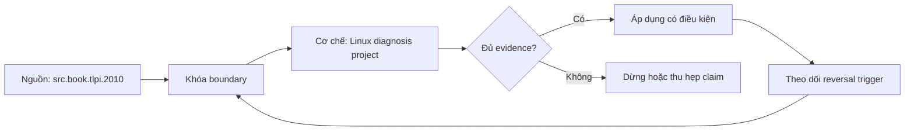

# Linux diagnosis project

**Tóm tắt bản chất:** Đưa một máy có ba vấn đề về trạng thái khoẻ mạnh, mỗi kết luận dẫn được về số đo, và xác nhận được đã hồi phục. Cơ chế chỉ có giá trị khi workload, version, state owner và failure boundary đã được khóa; một con số đẹp ngoài bốn điều kiện đó không đủ để ra quyết định.

> [!abstract] Câu hỏi trung tâm
> Làm thế nào mô hình, đo và ra quyết định đúng về Linux diagnosis project?

## Problem Definition and Operational Relevance

Khởi động lại máy rồi mất bằng chứng · sửa nhiều thứ cùng lúc nên không biết cái nào có tác dụng · giấu nhánh sai · kết luận không kèm số đo. Đây không phải danh sách lỗi cú pháp. Mỗi lỗi làm người vận hành chọn nhầm owner hoặc chữa symptom ở layer sau, khiến thời gian phục hồi tăng dù command vừa chạy trả về thành công.

Năng lực cần giữ sau bài là: Đưa một máy có ba vấn đề về trạng thái khoẻ mạnh, mỗi kết luận dẫn được về số đo, và xác nhận được đã hồi phục. Nếu learner chỉ nhắc lại định nghĩa nhưng không phân biệt được hai state gần nhau trên số đo, bài chưa đạt.

## Mechanism

Bài dự án khép module. Nhận một máy có dịch vụ dữ liệu đang chạy sai theo nhiều cách cùng lúc, và nhiệm vụ là đưa nó về trạng thái khoẻ mạnh với bằng chứng cho từng bước. Ba loại vấn đề cài sẵn, mỗi loại thuộc một nhóm đã học: một vấn đề tài nguyên, một vấn đề cấu hình dịch vụ, và một vấn đề quyền hoặc kết nối. Yêu cầu nộp: dòng thời gian chẩn đoán ghi theo thứ tự thật gồm cả nhánh sai đã thử, bằng chứng số đo cho từng kết luận, thay đổi đã thực hiện, và cách xác nhận đã hồi phục. Chấm nặng phần lập luận: một chẩn đoán đúng do đoán trúng được ít điểm hơn một chẩn đoán có ba giả thuyết bị bác bỏ bằng bằng chứng, theo đúng kỷ luật đặt ở lesson 8. Cấm khởi động lại máy như bước đầu tiên, vì nó xoá mất bằng chứng.

Tách ba lớp khi đọc cơ chế `wiki.de-foundation.linux-diagnosis-project`: declared state là điều cấu hình hoặc API yêu cầu; executed state là việc runtime thực sự làm; consumer-visible state là điều client hay operator quan sát. Ba lớp có thể lệch nhau vì cache, buffering, retry, scheduling, queue hoặc failure giữa hai transition. Evidence phải chỉ ra lớp nào đang được đo.

## Decision Framework

| Bước | Câu hỏi phải khóa | Điều kiện đạt |
|---|---|---|
| Observe | Khóa process, resource, file descriptor và time window | Không trộn symptom giữa hai owner |
| Probe | Dùng phép đo read-only hẹp nhất | Probe phân biệt được hai giả thuyết |
| Contain | Giảm harm trước mutation | Có rollback và state snapshot |
| Escalate | Chuyển owner khi boundary đã chứng minh | Evidence đủ tái hiện |

Quy tắc mặc định là chọn phép giải thích đơn giản nhất qua được hard constraints, rồi viết trước reversal trigger. Với `Linux diagnosis project`, absence of error không phải pass; pass cần observation đúng grain, một oracle độc lập và changed-constraint case đủ làm model có cơ hội thất bại.

## Worked Case: Linux diagnosis project

Nhận máy có ba vấn đề cài sẵn, 90 phút. Chẩn đoán và sửa từng cái. Nộp dòng thời gian gồm cả nhánh sai, bằng chứng số đo, thay đổi đã làm, và cách xác nhận. Không được khởi động lại máy trước khi thu thập bằng chứng.

Trong case `wiki.de-foundation.linux-diagnosis-project`, learner ghi expected transition, input snapshot, version và giới hạn an toàn trước khi chạy. Sau execution, họ giữ raw counter, timestamp, exit status, state trước-sau và giải thích delta bằng mechanism ở trên. Đánh giá không cho phép sửa expected result sau khi nhìn output mà không ghi change record.

Biến thể khó hơn đổi một constraint có khả năng đảo kết luận: workload shape, memory pressure, connection reuse, retry budget, permission hoặc dependency direction. Tầng *phân tích*. Bài tổng hợp toàn module thành một buổi chẩn đoán thật. Kiểm bằng trạng thái cuối cộng rà soát dòng thời gian; đạt khi cả ba vấn đề được sửa và mỗi kết luận có số đo dẫn chứng.

## Limits and Common Errors

**Hiểu lầm:** Khởi động lại máy rồi mất bằng chứng. **Thực tế:** tín hiệu chỉ chứng minh điều nó đo trong đúng scope; state ở layer khác vẫn có thể trái ngược. **Vì sao nghe hợp lý:** happy path nhỏ thường không chạm queue, cache, partial progress hoặc restart.

**Hiểu lầm:** sửa nhiều thứ cùng lúc nên không biết cái nào có tác dụng. **Thực tế:** tool và API cung cấp primitive, không tự cấp ownership, deadline, idempotency hay recovery policy. **Vì sao nghe hợp lý:** syntax gọn che mất protocol và lifecycle phía dưới.

Với `wiki.de-foundation.linux-diagnosis-project`, một edge case đáng giữ là observation đúng nhưng diagnosis sai: counter tăng thật, song nguyên nhân điều khiển nằm ở layer trước. Muốn tránh, timeline phải nối trigger tới consumer harm và ghi rõ negative control nào đã loại giả thuyết cạnh tranh.

## Nếu Bạn Dạy Lại Điều Này...

Mở bài bằng một dự đoán dễ sai về `Linux diagnosis project`, không mở bằng định nghĩa. Cho hai trace gần giống nhau nhưng khác đúng một state boundary; learner phải chọn probe tiếp theo trước khi được xem đáp án.

Bài tập seed dùng chính lab của DE-L076, sau đó đổi constraint đủ mạnh để buộc giữ hoặc đảo quyết định. Người dạy chấm reasoning chain và evidence, không chấm việc learner đoán đúng tên công cụ.

## Ma trận kiểm chứng từng mệnh đề

Protocol riêng của `Linux diagnosis project` dùng điều kiện hoàn thành sau: Cả ba vấn đề được sửa và xác nhận hồi phục, mỗi kết luận dẫn được về số đo, và dòng thời gian có ghi nhánh sai đã thử. Mỗi probe phải có prediction, failure signal và independent oracle.

### Probe 1: state transition và invariant

**Mệnh đề P1 cần kiểm.** Bài dự án khép module.

**Thiết kế phép thử cho `wiki.de-foundation.linux-diagnosis-project`.** Với `wiki.de-foundation.linux-diagnosis-project`, tạo positive và negative control chỉ khác một điều kiện; khóa workload, version, identity, permission, clock và state ban đầu. Expected result được viết trước execution để tiêu chí không trôi theo output.

**Bằng chứng P1 cần giữ.** Với `wiki.de-foundation.linux-diagnosis-project`, lưu command hoặc harness, raw observation, transition trước-sau, coverage và limitation. Kết luận chỉ đạt khi oracle độc lập khớp đúng grain; nếu chưa chạy thì đây vẫn là protocol, không phải observation.

### Probe 2: identity, ownership và boundary

**Mệnh đề P2 cần kiểm.** Đưa một máy có ba vấn đề về trạng thái khoẻ mạnh, mỗi kết luận dẫn được về số đo, và xác nhận được đã hồi phục.

**Thiết kế phép thử cho `wiki.de-foundation.linux-diagnosis-project`.** Với `wiki.de-foundation.linux-diagnosis-project`, tạo boundary case ngay trước và sau ngưỡng; khóa workload, version, identity, permission, clock và state ban đầu. Expected result được viết trước execution để tiêu chí không trôi theo output.

**Bằng chứng P2 cần giữ.** Với `wiki.de-foundation.linux-diagnosis-project`, lưu command hoặc harness, raw observation, transition trước-sau, coverage và limitation. Kết luận chỉ đạt khi oracle độc lập khớp đúng grain; nếu chưa chạy thì đây vẫn là protocol, không phải observation.

### Probe 3: failure path và recovery

**Mệnh đề P3 cần kiểm.** Tầng *phân tích*.

**Thiết kế phép thử cho `wiki.de-foundation.linux-diagnosis-project`.** Với `wiki.de-foundation.linux-diagnosis-project`, tạo replay cùng identity nhưng đổi state; khóa workload, version, identity, permission, clock và state ban đầu. Expected result được viết trước execution để tiêu chí không trôi theo output.

**Bằng chứng P3 cần giữ.** Với `wiki.de-foundation.linux-diagnosis-project`, lưu command hoặc harness, raw observation, transition trước-sau, coverage và limitation. Kết luận chỉ đạt khi oracle độc lập khớp đúng grain; nếu chưa chạy thì đây vẫn là protocol, không phải observation.

### Probe 4: decision trade-off và reversal trigger

**Mệnh đề P4 cần kiểm.** Nhận máy có ba vấn đề cài sẵn, 90 phút.

**Thiết kế phép thử cho `wiki.de-foundation.linux-diagnosis-project`.** Với `wiki.de-foundation.linux-diagnosis-project`, tạo failure inject trước và sau transition bền vững; khóa workload, version, identity, permission, clock và state ban đầu. Expected result được viết trước execution để tiêu chí không trôi theo output.

**Bằng chứng P4 cần giữ.** Với `wiki.de-foundation.linux-diagnosis-project`, lưu command hoặc harness, raw observation, transition trước-sau, coverage và limitation. Kết luận chỉ đạt khi oracle độc lập khớp đúng grain; nếu chưa chạy thì đây vẫn là protocol, không phải observation.

### Probe 5: evidence package và oracle

**Mệnh đề P5 cần kiểm.** Khởi động lại máy rồi mất bằng chứng · sửa nhiều thứ cùng lúc nên không biết cái nào có tác dụng · giấu nhánh sai · kết luận không kèm số đo.

**Thiết kế phép thử cho `wiki.de-foundation.linux-diagnosis-project`.** Với `wiki.de-foundation.linux-diagnosis-project`, tạo changed scale làm cost model đổi; khóa workload, version, identity, permission, clock và state ban đầu. Expected result được viết trước execution để tiêu chí không trôi theo output.

**Bằng chứng P5 cần giữ.** Với `wiki.de-foundation.linux-diagnosis-project`, lưu command hoặc harness, raw observation, transition trước-sau, coverage và limitation. Kết luận chỉ đạt khi oracle độc lập khớp đúng grain; nếu chưa chạy thì đây vẫn là protocol, không phải observation.

### Probe 6: changed-constraint transfer

**Mệnh đề P6 cần kiểm.** Cả ba vấn đề được sửa và xác nhận hồi phục, mỗi kết luận dẫn được về số đo, và dòng thời gian có ghi nhánh sai đã thử.

**Thiết kế phép thử cho `wiki.de-foundation.linux-diagnosis-project`.** Với `wiki.de-foundation.linux-diagnosis-project`, tạo adversarial order, skew hoặc packet timing; khóa workload, version, identity, permission, clock và state ban đầu. Expected result được viết trước execution để tiêu chí không trôi theo output.

**Bằng chứng P6 cần giữ.** Với `wiki.de-foundation.linux-diagnosis-project`, lưu command hoặc harness, raw observation, transition trước-sau, coverage và limitation. Kết luận chỉ đạt khi oracle độc lập khớp đúng grain; nếu chưa chạy thì đây vẫn là protocol, không phải observation.

### Probe 7: state transition và invariant

**Mệnh đề P7 cần kiểm.** Bài dự án khép module.

**Thiết kế phép thử cho `wiki.de-foundation.linux-diagnosis-project`.** Với `wiki.de-foundation.linux-diagnosis-project`, tạo fresh environment không cache; khóa workload, version, identity, permission, clock và state ban đầu. Expected result được viết trước execution để tiêu chí không trôi theo output.

**Bằng chứng P7 cần giữ.** Với `wiki.de-foundation.linux-diagnosis-project`, lưu command hoặc harness, raw observation, transition trước-sau, coverage và limitation. Kết luận chỉ đạt khi oracle độc lập khớp đúng grain; nếu chưa chạy thì đây vẫn là protocol, không phải observation.

### Probe 8: identity, ownership và boundary

**Mệnh đề P8 cần kiểm.** Đưa một máy có ba vấn đề về trạng thái khoẻ mạnh, mỗi kết luận dẫn được về số đo, và xác nhận được đã hồi phục.

**Thiết kế phép thử cho `wiki.de-foundation.linux-diagnosis-project`.** Với `wiki.de-foundation.linux-diagnosis-project`, tạo independent oracle không dùng chung implementation; khóa workload, version, identity, permission, clock và state ban đầu. Expected result được viết trước execution để tiêu chí không trôi theo output.

**Bằng chứng P8 cần giữ.** Với `wiki.de-foundation.linux-diagnosis-project`, lưu command hoặc harness, raw observation, transition trước-sau, coverage và limitation. Kết luận chỉ đạt khi oracle độc lập khớp đúng grain; nếu chưa chạy thì đây vẫn là protocol, không phải observation.

### Probe 9: failure path và recovery

**Mệnh đề P9 cần kiểm.** Tầng *phân tích*.

**Thiết kế phép thử cho `wiki.de-foundation.linux-diagnosis-project`.** Với `wiki.de-foundation.linux-diagnosis-project`, tạo partial progress rồi restart; khóa workload, version, identity, permission, clock và state ban đầu. Expected result được viết trước execution để tiêu chí không trôi theo output.

**Bằng chứng P9 cần giữ.** Với `wiki.de-foundation.linux-diagnosis-project`, lưu command hoặc harness, raw observation, transition trước-sau, coverage và limitation. Kết luận chỉ đạt khi oracle độc lập khớp đúng grain; nếu chưa chạy thì đây vẫn là protocol, không phải observation.

### Probe 10: decision trade-off và reversal trigger

**Mệnh đề P10 cần kiểm.** Nhận máy có ba vấn đề cài sẵn, 90 phút.

**Thiết kế phép thử cho `wiki.de-foundation.linux-diagnosis-project`.** Với `wiki.de-foundation.linux-diagnosis-project`, tạo missing evidence phải abstain; khóa workload, version, identity, permission, clock và state ban đầu. Expected result được viết trước execution để tiêu chí không trôi theo output.

**Bằng chứng P10 cần giữ.** Với `wiki.de-foundation.linux-diagnosis-project`, lưu command hoặc harness, raw observation, transition trước-sau, coverage và limitation. Kết luận chỉ đạt khi oracle độc lập khớp đúng grain; nếu chưa chạy thì đây vẫn là protocol, không phải observation.

### Probe 11: evidence package và oracle

**Mệnh đề P11 cần kiểm.** Khởi động lại máy rồi mất bằng chứng · sửa nhiều thứ cùng lúc nên không biết cái nào có tác dụng · giấu nhánh sai · kết luận không kèm số đo.

**Thiết kế phép thử cho `wiki.de-foundation.linux-diagnosis-project`.** Với `wiki.de-foundation.linux-diagnosis-project`, tạo reviewer tái hiện từ evidence package; khóa workload, version, identity, permission, clock và state ban đầu. Expected result được viết trước execution để tiêu chí không trôi theo output.

**Bằng chứng P11 cần giữ.** Với `wiki.de-foundation.linux-diagnosis-project`, lưu command hoặc harness, raw observation, transition trước-sau, coverage và limitation. Kết luận chỉ đạt khi oracle độc lập khớp đúng grain; nếu chưa chạy thì đây vẫn là protocol, không phải observation.

### Probe 12: changed-constraint transfer

**Mệnh đề P12 cần kiểm.** Cả ba vấn đề được sửa và xác nhận hồi phục, mỗi kết luận dẫn được về số đo, và dòng thời gian có ghi nhánh sai đã thử.

**Thiết kế phép thử cho `wiki.de-foundation.linux-diagnosis-project`.** Với `wiki.de-foundation.linux-diagnosis-project`, tạo constraint đổi đủ để quyết định đảo; khóa workload, version, identity, permission, clock và state ban đầu. Expected result được viết trước execution để tiêu chí không trôi theo output.

**Bằng chứng P12 cần giữ.** Với `wiki.de-foundation.linux-diagnosis-project`, lưu command hoặc harness, raw observation, transition trước-sau, coverage và limitation. Kết luận chỉ đạt khi oracle độc lập khớp đúng grain; nếu chưa chạy thì đây vẫn là protocol, không phải observation.

## Tự Kiểm Tra Nhanh

1. Boundary đầu tiên khiến mô hình `Linux diagnosis project` không còn đúng là gì?

<details><summary>Đáp án</summary>Khởi động lại máy rồi mất bằng chứng · sửa nhiều thứ cùng lúc nên không biết cái nào có tác dụng · giấu nhánh sai · kết luận không kèm số đo.</details>

2. Evidence nào phân biệt được hai state dễ nhầm?

<details><summary>Đáp án</summary>Tầng *phân tích*. Bài tổng hợp toàn module thành một buổi chẩn đoán thật. Kiểm bằng trạng thái cuối cộng rà soát dòng thời gian; đạt khi cả ba vấn đề được sửa và mỗi kết luận có số đo dẫn chứng.</details>

3. Khi constraint đổi, điều gì quyết định giữ hay đảo lựa chọn?

<details><summary>Đáp án</summary>Cả ba vấn đề được sửa và xác nhận hồi phục, mỗi kết luận dẫn được về số đo, và dòng thời gian có ghi nhánh sai đã thử.</details>

## Giới hạn và điều chưa cho phép kết luận

- Lab của `Linux diagnosis project` chưa được tuyên bố đã chạy trên production; note mô tả curriculum và expected evidence.
- Hành vi phụ thuộc kernel, distribution, library, network path hoặc hardware phải được kiểm lại trên target đã ghi version.
- Concept key `ck.de.linux-diagnosis-project` đã được owner phê duyệt `canonical`; note thuộc canonical registry coverage. Trạng thái này không tự chứng minh learner mastery.
- Một trace đơn lẻ không chứng minh capacity, reliability hoặc security cho population khác.
- Note giữ trạng thái `review` cho tới khi owner duyệt semantics và learner artifact.

## Reference
1. [[SRC-TLPI-2010]]
2. [[SRC-LINUX-KERNEL-RUNTIME-DOCS]]
3. [[SRC-GOOGLE-SRE-MONITORING]]

## Source coverage

| Source slice | Locator | Kiến thức phải giữ | Vị trí | Trạng thái | Ngoài phạm vi |
|---|---|---|---|---|---|
| [[SRC-TLPI-2010]]: `src.book.tlpi.2010` | Chapters 4-39, 49-50, 61 và 63 theo scope record; PDF 113-1418 | mechanism và boundary liên quan trực tiếp tới `Linux diagnosis project` | cơ chế, quyết định, case và probe | Đã phủ | phần ngoài objective DE-L076 |
| [[SRC-LINUX-KERNEL-RUNTIME-DOCS]]: `src.docs.linux-kernel-runtime` | PSI, userspace API, io_uring và trace documentation; accessed 2026-10-02 | mechanism và boundary liên quan trực tiếp tới `Linux diagnosis project` | cơ chế, quyết định, case và probe | Đã phủ | phần ngoài objective DE-L076 |
| [[SRC-GOOGLE-SRE-MONITORING]]: `src.web.google-sre-monitoring` | Monitoring distributed systems; accessed 2026-10-01 | mechanism và boundary liên quan trực tiếp tới `Linux diagnosis project` | cơ chế, quyết định, case và probe | Đã phủ | phần ngoài objective DE-L076 |

## Key takeaways
- Đưa một máy có ba vấn đề về trạng thái khoẻ mạnh, mỗi kết luận dẫn được về số đo, và xác nhận được đã hồi phục.
- Cả ba vấn đề được sửa và xác nhận hồi phục, mỗi kết luận dẫn được về số đo, và dòng thời gian có ghi nhánh sai đã thử.
- `Linux diagnosis project` chỉ có nghĩa trong scope, state, identity và version đã ghi.
- Trước khi lab chạy, đây là note có provenance và protocol, chưa phải production evidence hay bằng chứng mastery.

<!-- ATOMIC-EXECUTION-CAPSULE:START -->

## Execution capsule: kiểm chứng `wiki.de-foundation.linux-diagnosis-project`

> [!important] Phân loại mệnh đề
> Với `wiki.de-foundation.linux-diagnosis-project`, sơ đồ, ví dụ và artifact về **Linux diagnosis project** là **synthesis để kiểm chứng**; chúng không phải trích dẫn hay case nguyên văn của nguồn.

### Sơ đồ cơ chế và điểm kiểm soát



Đọc sơ đồ `wiki.de-foundation.linux-diagnosis-project` từ trái sang phải: source chỉ cung cấp claim ban đầu cho **Linux diagnosis project**; quyết định chỉ được đi tiếp sau khi boundary, evidence và điều kiện đảo quyết định đã hiện hữu.

### Artifact thực thi tối thiểu

```yaml
concept_id: "wiki.de-foundation.linux-diagnosis-project"
concept: "Linux diagnosis project"
primary_question: "Làm thế nào mô hình, đo và ra quyết định đúng về Linux diagnosis project?"
decision_contract:
  input_boundary: "Ghi population, thời điểm, owner và điều chưa biết"
  hard_constraints:
    - "Không vượt quyền hoặc privacy boundary"
    - "Không dùng cùng một assumption làm cả implementation và oracle"
  accept_when: "Có observation phân biệt được các lựa chọn"
  reversal_trigger: "Một hard constraint sai hoặc evidence mới đổi recommendation"
evidence_to_keep:
  - "input snapshot"
  - "chosen and rejected options"
  - "independent review result"
```

Artifact của `wiki.de-foundation.linux-diagnosis-project` buộc người dùng ghi boundary, oracle và reversal trigger cho **Linux diagnosis project**. Các giá trị minh họa phải được thay bằng evidence thật trước khi dùng cho quyết định.

<!-- ATOMIC-EXECUTION-CAPSULE:END -->
