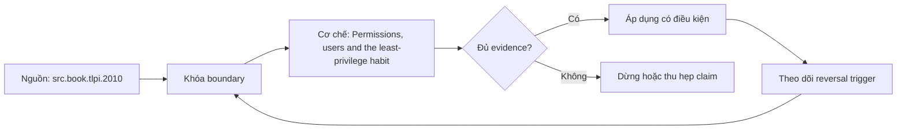

# Permissions, users and the least-privilege habit

**Tóm tắt bản chất:** Đặt quyền tối thiểu cho một dịch vụ và chứng minh bằng phép thử rằng tài khoản khác không đọc hay ghi được. Cơ chế chỉ có giá trị khi workload, version, state owner và failure boundary đã được khóa; một con số đẹp ngoài bốn điều kiện đó không đủ để ra quyết định.

> [!abstract] Câu hỏi trung tâm
> Làm thế nào mô hình, đo và ra quyết định đúng về Permissions, users and the least-privilege habit?

## Problem Definition and Operational Relevance

Chạy dịch vụ bằng quyền quản trị cho tiện · đặt quyền mở cho mọi người để hết lỗi · quên mặt nạ tạo tệp nên tệp mới sai quyền · đặt quyền mà không thử truy cập trái phép. Đây không phải danh sách lỗi cú pháp. Mỗi lỗi làm người vận hành chọn nhầm owner hoặc chữa symptom ở layer sau, khiến thời gian phục hồi tăng dù command vừa chạy trả về thành công.

Năng lực cần giữ sau bài là: Đặt quyền tối thiểu cho một dịch vụ và chứng minh bằng phép thử rằng tài khoản khác không đọc hay ghi được. Nếu learner chỉ nhắc lại định nghĩa nhưng không phân biệt được hai state gần nhau trên số đo, bài chưa đạt.

## Mechanism

Quyền trên Linux là tầng phòng vệ đầu tiên và cũng là tầng hay bị vô hiệu hoá vì tiện. Ba nhóm quyền và ba loại quyền, cùng cách đọc và đặt. Mặt nạ tạo tệp quyết định quyền mặc định của tệp mới và là nguồn lỗi hay gặp khi một dịch vụ ghi tệp mà dịch vụ khác không đọc được. Quyền trên thư mục có nghĩa khác quyền trên tệp và đây là chỗ hay nhầm: quyền thực thi trên thư mục nghĩa là đi vào được. Chạy dịch vụ bằng người dùng riêng có quyền tối thiểu thay vì quyền quản trị: lý do không phải hình thức mà là phạm vi thiệt hại khi dịch vụ bị lợi dụng. Chủ sở hữu tệp giữa tiến trình trong container và tiến trình trên máy chủ, một vấn đề sẽ gặp lại ở M25. Ba phép thử truy cập trái phép phải chạy sau khi đặt quyền, vì đặt quyền mà không thử là không biết nó có tác dụng không.

Tách ba lớp khi đọc cơ chế `wiki.de-foundation.permissions-users-and-the-least-privilege-habit`: declared state là điều cấu hình hoặc API yêu cầu; executed state là việc runtime thực sự làm; consumer-visible state là điều client hay operator quan sát. Ba lớp có thể lệch nhau vì cache, buffering, retry, scheduling, queue hoặc failure giữa hai transition. Evidence phải chỉ ra lớp nào đang được đo.

## Decision Framework

| Bước | Câu hỏi phải khóa | Điều kiện đạt |
|---|---|---|
| Observe | Khóa process, resource, file descriptor và time window | Không trộn symptom giữa hai owner |
| Probe | Dùng phép đo read-only hẹp nhất | Probe phân biệt được hai giả thuyết |
| Contain | Giảm harm trước mutation | Có rollback và state snapshot |
| Escalate | Chuyển owner khi boundary đã chứng minh | Evidence đủ tái hiện |

Quy tắc mặc định là chọn phép giải thích đơn giản nhất qua được hard constraints, rồi viết trước reversal trigger. Với `Permissions, users and the least-privilege habit`, absence of error không phải pass; pass cần observation đúng grain, một oracle độc lập và changed-constraint case đủ làm model có cơ hội thất bại.

## Worked Case: Permissions, users and the least-privilege habit

Chạy dịch vụ ở lesson 69 bằng người dùng riêng. Đặt quyền tối thiểu cho thư mục dữ liệu và tệp cấu hình. Thử đọc, ghi và thực thi bằng một tài khoản khác và ghi lại kết quả cả ba. Đặt mặt nạ tạo tệp và kiểm tệp mới sinh ra có quyền đúng.

Trong case `wiki.de-foundation.permissions-users-and-the-least-privilege-habit`, learner ghi expected transition, input snapshot, version và giới hạn an toàn trước khi chạy. Sau execution, họ giữ raw counter, timestamp, exit status, state trước-sau và giải thích delta bằng mechanism ở trên. Đánh giá không cho phép sửa expected result sau khi nhìn output mà không ghi change record.

Biến thể khó hơn đổi một constraint có khả năng đảo kết luận: workload shape, memory pressure, connection reuse, retry budget, permission hoặc dependency direction. Tầng *áp dụng*. Objective là một cấu hình bảo mật kiểm được bằng phép thử phủ định. Kiểm bằng ba phép thử truy cập trái phép; đạt khi cả ba bị từ chối và dịch vụ vẫn chạy đúng.

## Limits and Common Errors

**Hiểu lầm:** Chạy dịch vụ bằng quyền quản trị cho tiện. **Thực tế:** tín hiệu chỉ chứng minh điều nó đo trong đúng scope; state ở layer khác vẫn có thể trái ngược. **Vì sao nghe hợp lý:** happy path nhỏ thường không chạm queue, cache, partial progress hoặc restart.

**Hiểu lầm:** đặt quyền mở cho mọi người để hết lỗi. **Thực tế:** tool và API cung cấp primitive, không tự cấp ownership, deadline, idempotency hay recovery policy. **Vì sao nghe hợp lý:** syntax gọn che mất protocol và lifecycle phía dưới.

Với `wiki.de-foundation.permissions-users-and-the-least-privilege-habit`, một edge case đáng giữ là observation đúng nhưng diagnosis sai: counter tăng thật, song nguyên nhân điều khiển nằm ở layer trước. Muốn tránh, timeline phải nối trigger tới consumer harm và ghi rõ negative control nào đã loại giả thuyết cạnh tranh.

## Nếu Bạn Dạy Lại Điều Này...

Mở bài bằng một dự đoán dễ sai về `Permissions, users and the least-privilege habit`, không mở bằng định nghĩa. Cho hai trace gần giống nhau nhưng khác đúng một state boundary; learner phải chọn probe tiếp theo trước khi được xem đáp án.

Bài tập seed dùng chính lab của DE-L073, sau đó đổi constraint đủ mạnh để buộc giữ hoặc đảo quyết định. Người dạy chấm reasoning chain và evidence, không chấm việc learner đoán đúng tên công cụ.

## Ma trận kiểm chứng từng mệnh đề

Protocol riêng của `Permissions, users and the least-privilege habit` dùng điều kiện hoàn thành sau: Ba phép thử truy cập trái phép đều bị từ chối, dịch vụ vẫn chạy đúng, và tệp mới sinh ra có quyền đúng theo mặt nạ. Mỗi probe phải có prediction, failure signal và independent oracle.

### Probe 1: state transition và invariant

**Mệnh đề P1 cần kiểm.** Quyền trên Linux là tầng phòng vệ đầu tiên và cũng là tầng hay bị vô hiệu hoá vì tiện.

**Thiết kế phép thử cho `wiki.de-foundation.permissions-users-and-the-least-privilege-habit`.** Với `wiki.de-foundation.permissions-users-and-the-least-privilege-habit`, tạo positive và negative control chỉ khác một điều kiện; khóa workload, version, identity, permission, clock và state ban đầu. Expected result được viết trước execution để tiêu chí không trôi theo output.

**Bằng chứng P1 cần giữ.** Với `wiki.de-foundation.permissions-users-and-the-least-privilege-habit`, lưu command hoặc harness, raw observation, transition trước-sau, coverage và limitation. Kết luận chỉ đạt khi oracle độc lập khớp đúng grain; nếu chưa chạy thì đây vẫn là protocol, không phải observation.

### Probe 2: identity, ownership và boundary

**Mệnh đề P2 cần kiểm.** Đặt quyền tối thiểu cho một dịch vụ và chứng minh bằng phép thử rằng tài khoản khác không đọc hay ghi được.

**Thiết kế phép thử cho `wiki.de-foundation.permissions-users-and-the-least-privilege-habit`.** Với `wiki.de-foundation.permissions-users-and-the-least-privilege-habit`, tạo boundary case ngay trước và sau ngưỡng; khóa workload, version, identity, permission, clock và state ban đầu. Expected result được viết trước execution để tiêu chí không trôi theo output.

**Bằng chứng P2 cần giữ.** Với `wiki.de-foundation.permissions-users-and-the-least-privilege-habit`, lưu command hoặc harness, raw observation, transition trước-sau, coverage và limitation. Kết luận chỉ đạt khi oracle độc lập khớp đúng grain; nếu chưa chạy thì đây vẫn là protocol, không phải observation.

### Probe 3: failure path và recovery

**Mệnh đề P3 cần kiểm.** Tầng *áp dụng*.

**Thiết kế phép thử cho `wiki.de-foundation.permissions-users-and-the-least-privilege-habit`.** Với `wiki.de-foundation.permissions-users-and-the-least-privilege-habit`, tạo replay cùng identity nhưng đổi state; khóa workload, version, identity, permission, clock và state ban đầu. Expected result được viết trước execution để tiêu chí không trôi theo output.

**Bằng chứng P3 cần giữ.** Với `wiki.de-foundation.permissions-users-and-the-least-privilege-habit`, lưu command hoặc harness, raw observation, transition trước-sau, coverage và limitation. Kết luận chỉ đạt khi oracle độc lập khớp đúng grain; nếu chưa chạy thì đây vẫn là protocol, không phải observation.

### Probe 4: decision trade-off và reversal trigger

**Mệnh đề P4 cần kiểm.** Chạy dịch vụ ở lesson 69 bằng người dùng riêng.

**Thiết kế phép thử cho `wiki.de-foundation.permissions-users-and-the-least-privilege-habit`.** Với `wiki.de-foundation.permissions-users-and-the-least-privilege-habit`, tạo failure inject trước và sau transition bền vững; khóa workload, version, identity, permission, clock và state ban đầu. Expected result được viết trước execution để tiêu chí không trôi theo output.

**Bằng chứng P4 cần giữ.** Với `wiki.de-foundation.permissions-users-and-the-least-privilege-habit`, lưu command hoặc harness, raw observation, transition trước-sau, coverage và limitation. Kết luận chỉ đạt khi oracle độc lập khớp đúng grain; nếu chưa chạy thì đây vẫn là protocol, không phải observation.

### Probe 5: evidence package và oracle

**Mệnh đề P5 cần kiểm.** Chạy dịch vụ bằng quyền quản trị cho tiện · đặt quyền mở cho mọi người để hết lỗi · quên mặt nạ tạo tệp nên tệp mới sai quyền · đặt quyền mà không thử truy cập trái phép.

**Thiết kế phép thử cho `wiki.de-foundation.permissions-users-and-the-least-privilege-habit`.** Với `wiki.de-foundation.permissions-users-and-the-least-privilege-habit`, tạo changed scale làm cost model đổi; khóa workload, version, identity, permission, clock và state ban đầu. Expected result được viết trước execution để tiêu chí không trôi theo output.

**Bằng chứng P5 cần giữ.** Với `wiki.de-foundation.permissions-users-and-the-least-privilege-habit`, lưu command hoặc harness, raw observation, transition trước-sau, coverage và limitation. Kết luận chỉ đạt khi oracle độc lập khớp đúng grain; nếu chưa chạy thì đây vẫn là protocol, không phải observation.

### Probe 6: changed-constraint transfer

**Mệnh đề P6 cần kiểm.** Ba phép thử truy cập trái phép đều bị từ chối, dịch vụ vẫn chạy đúng, và tệp mới sinh ra có quyền đúng theo mặt nạ.

**Thiết kế phép thử cho `wiki.de-foundation.permissions-users-and-the-least-privilege-habit`.** Với `wiki.de-foundation.permissions-users-and-the-least-privilege-habit`, tạo adversarial order, skew hoặc packet timing; khóa workload, version, identity, permission, clock và state ban đầu. Expected result được viết trước execution để tiêu chí không trôi theo output.

**Bằng chứng P6 cần giữ.** Với `wiki.de-foundation.permissions-users-and-the-least-privilege-habit`, lưu command hoặc harness, raw observation, transition trước-sau, coverage và limitation. Kết luận chỉ đạt khi oracle độc lập khớp đúng grain; nếu chưa chạy thì đây vẫn là protocol, không phải observation.

### Probe 7: state transition và invariant

**Mệnh đề P7 cần kiểm.** Quyền trên Linux là tầng phòng vệ đầu tiên và cũng là tầng hay bị vô hiệu hoá vì tiện.

**Thiết kế phép thử cho `wiki.de-foundation.permissions-users-and-the-least-privilege-habit`.** Với `wiki.de-foundation.permissions-users-and-the-least-privilege-habit`, tạo fresh environment không cache; khóa workload, version, identity, permission, clock và state ban đầu. Expected result được viết trước execution để tiêu chí không trôi theo output.

**Bằng chứng P7 cần giữ.** Với `wiki.de-foundation.permissions-users-and-the-least-privilege-habit`, lưu command hoặc harness, raw observation, transition trước-sau, coverage và limitation. Kết luận chỉ đạt khi oracle độc lập khớp đúng grain; nếu chưa chạy thì đây vẫn là protocol, không phải observation.

### Probe 8: identity, ownership và boundary

**Mệnh đề P8 cần kiểm.** Đặt quyền tối thiểu cho một dịch vụ và chứng minh bằng phép thử rằng tài khoản khác không đọc hay ghi được.

**Thiết kế phép thử cho `wiki.de-foundation.permissions-users-and-the-least-privilege-habit`.** Với `wiki.de-foundation.permissions-users-and-the-least-privilege-habit`, tạo independent oracle không dùng chung implementation; khóa workload, version, identity, permission, clock và state ban đầu. Expected result được viết trước execution để tiêu chí không trôi theo output.

**Bằng chứng P8 cần giữ.** Với `wiki.de-foundation.permissions-users-and-the-least-privilege-habit`, lưu command hoặc harness, raw observation, transition trước-sau, coverage và limitation. Kết luận chỉ đạt khi oracle độc lập khớp đúng grain; nếu chưa chạy thì đây vẫn là protocol, không phải observation.

### Probe 9: failure path và recovery

**Mệnh đề P9 cần kiểm.** Tầng *áp dụng*.

**Thiết kế phép thử cho `wiki.de-foundation.permissions-users-and-the-least-privilege-habit`.** Với `wiki.de-foundation.permissions-users-and-the-least-privilege-habit`, tạo partial progress rồi restart; khóa workload, version, identity, permission, clock và state ban đầu. Expected result được viết trước execution để tiêu chí không trôi theo output.

**Bằng chứng P9 cần giữ.** Với `wiki.de-foundation.permissions-users-and-the-least-privilege-habit`, lưu command hoặc harness, raw observation, transition trước-sau, coverage và limitation. Kết luận chỉ đạt khi oracle độc lập khớp đúng grain; nếu chưa chạy thì đây vẫn là protocol, không phải observation.

### Probe 10: decision trade-off và reversal trigger

**Mệnh đề P10 cần kiểm.** Chạy dịch vụ ở lesson 69 bằng người dùng riêng.

**Thiết kế phép thử cho `wiki.de-foundation.permissions-users-and-the-least-privilege-habit`.** Với `wiki.de-foundation.permissions-users-and-the-least-privilege-habit`, tạo missing evidence phải abstain; khóa workload, version, identity, permission, clock và state ban đầu. Expected result được viết trước execution để tiêu chí không trôi theo output.

**Bằng chứng P10 cần giữ.** Với `wiki.de-foundation.permissions-users-and-the-least-privilege-habit`, lưu command hoặc harness, raw observation, transition trước-sau, coverage và limitation. Kết luận chỉ đạt khi oracle độc lập khớp đúng grain; nếu chưa chạy thì đây vẫn là protocol, không phải observation.

### Probe 11: evidence package và oracle

**Mệnh đề P11 cần kiểm.** Chạy dịch vụ bằng quyền quản trị cho tiện · đặt quyền mở cho mọi người để hết lỗi · quên mặt nạ tạo tệp nên tệp mới sai quyền · đặt quyền mà không thử truy cập trái phép.

**Thiết kế phép thử cho `wiki.de-foundation.permissions-users-and-the-least-privilege-habit`.** Với `wiki.de-foundation.permissions-users-and-the-least-privilege-habit`, tạo reviewer tái hiện từ evidence package; khóa workload, version, identity, permission, clock và state ban đầu. Expected result được viết trước execution để tiêu chí không trôi theo output.

**Bằng chứng P11 cần giữ.** Với `wiki.de-foundation.permissions-users-and-the-least-privilege-habit`, lưu command hoặc harness, raw observation, transition trước-sau, coverage và limitation. Kết luận chỉ đạt khi oracle độc lập khớp đúng grain; nếu chưa chạy thì đây vẫn là protocol, không phải observation.

### Probe 12: changed-constraint transfer

**Mệnh đề P12 cần kiểm.** Ba phép thử truy cập trái phép đều bị từ chối, dịch vụ vẫn chạy đúng, và tệp mới sinh ra có quyền đúng theo mặt nạ.

**Thiết kế phép thử cho `wiki.de-foundation.permissions-users-and-the-least-privilege-habit`.** Với `wiki.de-foundation.permissions-users-and-the-least-privilege-habit`, tạo constraint đổi đủ để quyết định đảo; khóa workload, version, identity, permission, clock và state ban đầu. Expected result được viết trước execution để tiêu chí không trôi theo output.

**Bằng chứng P12 cần giữ.** Với `wiki.de-foundation.permissions-users-and-the-least-privilege-habit`, lưu command hoặc harness, raw observation, transition trước-sau, coverage và limitation. Kết luận chỉ đạt khi oracle độc lập khớp đúng grain; nếu chưa chạy thì đây vẫn là protocol, không phải observation.

## Tự Kiểm Tra Nhanh

1. Boundary đầu tiên khiến mô hình `Permissions, users and the least-privilege habit` không còn đúng là gì?

<details><summary>Đáp án</summary>Chạy dịch vụ bằng quyền quản trị cho tiện · đặt quyền mở cho mọi người để hết lỗi · quên mặt nạ tạo tệp nên tệp mới sai quyền · đặt quyền mà không thử truy cập trái phép.</details>

2. Evidence nào phân biệt được hai state dễ nhầm?

<details><summary>Đáp án</summary>Tầng *áp dụng*. Objective là một cấu hình bảo mật kiểm được bằng phép thử phủ định. Kiểm bằng ba phép thử truy cập trái phép; đạt khi cả ba bị từ chối và dịch vụ vẫn chạy đúng.</details>

3. Khi constraint đổi, điều gì quyết định giữ hay đảo lựa chọn?

<details><summary>Đáp án</summary>Ba phép thử truy cập trái phép đều bị từ chối, dịch vụ vẫn chạy đúng, và tệp mới sinh ra có quyền đúng theo mặt nạ.</details>

## Giới hạn và điều chưa cho phép kết luận

- Lab của `Permissions, users and the least-privilege habit` chưa được tuyên bố đã chạy trên production; note mô tả curriculum và expected evidence.
- Hành vi phụ thuộc kernel, distribution, library, network path hoặc hardware phải được kiểm lại trên target đã ghi version.
- Concept key `ck.de.permissions-users-and-the-least-privilege-habit` đã được owner phê duyệt `canonical`; note thuộc canonical registry coverage. Trạng thái này không tự chứng minh learner mastery.
- Một trace đơn lẻ không chứng minh capacity, reliability hoặc security cho population khác.
- Note giữ trạng thái `review` cho tới khi owner duyệt semantics và learner artifact.

## Reference
1. [[SRC-TLPI-2010]]

## Source coverage

| Source slice | Locator | Kiến thức phải giữ | Vị trí | Trạng thái | Ngoài phạm vi |
|---|---|---|---|---|---|
| [[SRC-TLPI-2010]]: `src.book.tlpi.2010` | Chapters 4-39, 49-50, 61 và 63 theo scope record; PDF 113-1418 | mechanism và boundary liên quan trực tiếp tới `Permissions, users and the least-privilege habit` | cơ chế, quyết định, case và probe | Đã phủ | phần ngoài objective DE-L073 |

## Key takeaways
- Đặt quyền tối thiểu cho một dịch vụ và chứng minh bằng phép thử rằng tài khoản khác không đọc hay ghi được.
- Ba phép thử truy cập trái phép đều bị từ chối, dịch vụ vẫn chạy đúng, và tệp mới sinh ra có quyền đúng theo mặt nạ.
- `Permissions, users and the least-privilege habit` chỉ có nghĩa trong scope, state, identity và version đã ghi.
- Trước khi lab chạy, đây là note có provenance và protocol, chưa phải production evidence hay bằng chứng mastery.

<!-- ATOMIC-EXECUTION-CAPSULE:START -->

## Execution capsule: kiểm chứng `wiki.de-foundation.permissions-users-and-the-least-privilege-habit`

> [!important] Phân loại mệnh đề
> Với `wiki.de-foundation.permissions-users-and-the-least-privilege-habit`, sơ đồ, ví dụ và artifact về **Permissions, users and the least-privilege habit** là **synthesis để kiểm chứng**; chúng không phải trích dẫn hay case nguyên văn của nguồn.

### Sơ đồ cơ chế và điểm kiểm soát



Đọc sơ đồ `wiki.de-foundation.permissions-users-and-the-least-privilege-habit` từ trái sang phải: source chỉ cung cấp claim ban đầu cho **Permissions, users and the least-privilege habit**; quyết định chỉ được đi tiếp sau khi boundary, evidence và điều kiện đảo quyết định đã hiện hữu.

### Artifact thực thi tối thiểu

```yaml
concept_id: "wiki.de-foundation.permissions-users-and-the-least-privilege-habit"
concept: "Permissions, users and the least-privilege habit"
primary_question: "Làm thế nào mô hình, đo và ra quyết định đúng về Permissions, users and the least-privilege habit?"
decision_contract:
  input_boundary: "Ghi population, thời điểm, owner và điều chưa biết"
  hard_constraints:
    - "Không vượt quyền hoặc privacy boundary"
    - "Không dùng cùng một assumption làm cả implementation và oracle"
  accept_when: "Có observation phân biệt được các lựa chọn"
  reversal_trigger: "Một hard constraint sai hoặc evidence mới đổi recommendation"
evidence_to_keep:
  - "input snapshot"
  - "chosen and rejected options"
  - "independent review result"
```

Artifact của `wiki.de-foundation.permissions-users-and-the-least-privilege-habit` buộc người dùng ghi boundary, oracle và reversal trigger cho **Permissions, users and the least-privilege habit**. Các giá trị minh họa phải được thay bằng evidence thật trước khi dùng cho quyết định.

<!-- ATOMIC-EXECUTION-CAPSULE:END -->
