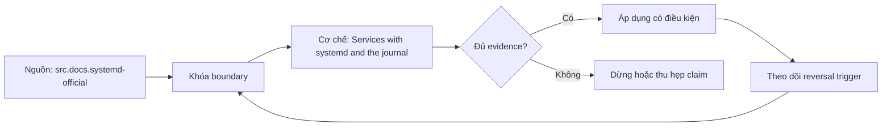

# Services with systemd and the journal

**Tóm tắt bản chất:** Chạy một dịch vụ dữ liệu dưới trình quản lý dịch vụ với chính sách khởi động lại đúng và nhật ký đọc được tập trung. Cơ chế chỉ có giá trị khi workload, version, state owner và failure boundary đã được khóa; một con số đẹp ngoài bốn điều kiện đó không đủ để ra quyết định.

> [!abstract] Câu hỏi trung tâm
> Làm thế nào mô hình, đo và ra quyết định đúng về Services with systemd and the journal?

## Nỗi Đau & Động Lực

Đặt chính sách luôn khởi động lại mà không giới hạn số lần · chạy dịch vụ bằng quyền quản trị · ghi nhật ký vào tệp riêng thay vì luồng chuẩn · đặt bí mật thẳng trong tệp định nghĩa dịch vụ. Đây không phải danh sách lỗi cú pháp. Mỗi lỗi làm người vận hành chọn nhầm owner hoặc chữa symptom ở layer sau, khiến thời gian phục hồi tăng dù command vừa chạy trả về thành công.

Năng lực cần giữ sau bài là: Chạy một dịch vụ dữ liệu dưới trình quản lý dịch vụ với chính sách khởi động lại đúng và nhật ký đọc được tập trung. Nếu learner chỉ nhắc lại định nghĩa nhưng không phân biệt được hai state gần nhau trên số đo, bài chưa đạt.

## Cơ Chế Tác Động

Chạy một tiến trình lâu dài bằng cách mở terminal rồi để đó không phải cách vận hành, và trình quản lý dịch vụ giải bốn việc: khởi động cùng máy, khởi động lại khi chết, thu thập nhật ký, và quản lý phụ thuộc giữa các dịch vụ. Tệp định nghĩa dịch vụ và các trường quan trọng: lệnh chạy, người dùng chạy, chính sách khởi động lại, biến môi trường, và giới hạn tài nguyên. Chính sách khởi động lại và bẫy vòng lặp: dịch vụ chết ngay khi khởi động cộng với chính sách luôn khởi động lại cho ra vòng lặp khởi động liên tục, nên phải đặt giới hạn số lần trong một khoảng. Nhật ký tập trung: đọc theo dịch vụ, theo thời gian, theo mức, và vì sao ghi ra luồng chuẩn tiện hơn tự ghi tệp, nối lại nguyên tắc ở lesson 20. Ranh giới bí mật: biến môi trường trong tệp định nghĩa đọc được bởi ai, và cách đưa bí mật vào đúng cách.

Tách ba lớp khi đọc cơ chế `wiki.de-foundation.services-with-systemd-and-the-journal`: declared state là điều cấu hình hoặc API yêu cầu; executed state là việc runtime thực sự làm; consumer-visible state là điều client hay operator quan sát. Ba lớp có thể lệch nhau vì cache, buffering, retry, scheduling, queue hoặc failure giữa hai transition. Evidence phải chỉ ra lớp nào đang được đo.

## Bản Đồ Quyết Định

| Bước | Câu hỏi phải khóa | Điều kiện đạt |
|---|---|---|
| Observe | Khóa process, resource, file descriptor và time window | Không trộn symptom giữa hai owner |
| Probe | Dùng phép đo read-only hẹp nhất | Probe phân biệt được hai giả thuyết |
| Contain | Giảm harm trước mutation | Có rollback và state snapshot |
| Escalate | Chuyển owner khi boundary đã chứng minh | Evidence đủ tái hiện |

Quy tắc mặc định là chọn phép giải thích đơn giản nhất qua được hard constraints, rồi viết trước reversal trigger. Với `Services with systemd and the journal`, absence of error không phải pass; pass cần observation đúng grain, một oracle độc lập và changed-constraint case đủ làm model có cơ hội thất bại.

## Case Study Thực Chiến: Services with systemd and the journal

Đóng gói tiến trình xử lý ở lesson 67 thành một dịch vụ. Giết nó và xác nhận tự khởi động lại. Làm nó chết ngay khi khởi động và xác nhận giới hạn số lần chặn được vòng lặp. Đọc nhật ký theo dịch vụ và lọc theo mã theo dõi. Đưa một bí mật vào đúng cách và kiểm tài khoản thường không đọc được.

Trong case `wiki.de-foundation.services-with-systemd-and-the-journal`, learner ghi expected transition, input snapshot, version và giới hạn an toàn trước khi chạy. Sau execution, họ giữ raw counter, timestamp, exit status, state trước–sau và giải thích delta bằng mechanism ở trên. Đánh giá không cho phép sửa expected result sau khi nhìn output mà không ghi change record.

Biến thể khó hơn đổi một constraint có khả năng đảo kết luận: workload shape, memory pressure, connection reuse, retry budget, permission hoặc dependency direction. Tầng *áp dụng*. Objective là một cấu hình vận hành kiểm được bằng thí nghiệm giết tiến trình. Kiểm bằng ba phép thử; đạt khi dịch vụ tự khởi động lại, vòng lặp khởi động bị chặn, và nhật ký truy được theo mã theo dõi.

## Góc Khuất & Ngộ Nhận

**Hiểu lầm:** Đặt chính sách luôn khởi động lại mà không giới hạn số lần. **Thực tế:** tín hiệu chỉ chứng minh điều nó đo trong đúng scope; state ở layer khác vẫn có thể trái ngược. **Vì sao nghe hợp lý:** happy path nhỏ thường không chạm queue, cache, partial progress hoặc restart.

**Hiểu lầm:** chạy dịch vụ bằng quyền quản trị. **Thực tế:** tool và API cung cấp primitive, không tự cấp ownership, deadline, idempotency hay recovery policy. **Vì sao nghe hợp lý:** syntax gọn che mất protocol và lifecycle phía dưới.

Với `wiki.de-foundation.services-with-systemd-and-the-journal`, một edge case đáng giữ là observation đúng nhưng diagnosis sai: counter tăng thật, song nguyên nhân điều khiển nằm ở layer trước. Muốn tránh, timeline phải nối trigger tới consumer harm và ghi rõ negative control nào đã loại giả thuyết cạnh tranh.

## Nếu Bạn Dạy Lại Điều Này...

Mở bài bằng một dự đoán dễ sai về `Services with systemd and the journal`, không mở bằng định nghĩa. Cho hai trace gần giống nhau nhưng khác đúng một state boundary; learner phải chọn probe tiếp theo trước khi được xem đáp án.

Bài tập seed dùng chính lab của DE-L069, sau đó đổi constraint đủ mạnh để buộc giữ hoặc đảo quyết định. Người dạy chấm reasoning chain và evidence, không chấm việc learner đoán đúng tên công cụ.

## Ma trận kiểm chứng từng mệnh đề

Protocol riêng của `Services with systemd and the journal` dùng điều kiện hoàn thành sau: Dịch vụ tự khởi động lại sau khi bị giết, vòng lặp khởi động bị chặn theo giới hạn, và nhật ký lọc được theo mã theo dõi. Mỗi probe phải có prediction, failure signal và independent oracle.

### Probe 1: state transition và invariant

**Mệnh đề P1 cần kiểm.** Chạy một tiến trình lâu dài bằng cách mở terminal rồi để đó không phải cách vận hành, và trình quản lý dịch vụ giải bốn việc: khởi động cùng máy, khởi động lại khi chết, thu thập nhật ký, và quản lý phụ thuộ...

**Thiết kế phép thử cho `wiki.de-foundation.services-with-systemd-and-the-journal`.** Với `wiki.de-foundation.services-with-systemd-and-the-journal`, tạo positive và negative control chỉ khác một điều kiện; khóa workload, version, identity, permission, clock và state ban đầu. Expected result được viết trước execution để tiêu chí không trôi theo output.

**Bằng chứng P1 cần giữ.** Với `wiki.de-foundation.services-with-systemd-and-the-journal`, lưu command hoặc harness, raw observation, transition trước–sau, coverage và limitation. Kết luận chỉ đạt khi oracle độc lập khớp đúng grain; nếu chưa chạy thì đây vẫn là protocol, không phải observation.

### Probe 2: identity, ownership và boundary

**Mệnh đề P2 cần kiểm.** Chạy một dịch vụ dữ liệu dưới trình quản lý dịch vụ với chính sách khởi động lại đúng và nhật ký đọc được tập trung.

**Thiết kế phép thử cho `wiki.de-foundation.services-with-systemd-and-the-journal`.** Với `wiki.de-foundation.services-with-systemd-and-the-journal`, tạo boundary case ngay trước và sau ngưỡng; khóa workload, version, identity, permission, clock và state ban đầu. Expected result được viết trước execution để tiêu chí không trôi theo output.

**Bằng chứng P2 cần giữ.** Với `wiki.de-foundation.services-with-systemd-and-the-journal`, lưu command hoặc harness, raw observation, transition trước–sau, coverage và limitation. Kết luận chỉ đạt khi oracle độc lập khớp đúng grain; nếu chưa chạy thì đây vẫn là protocol, không phải observation.

### Probe 3: failure path và recovery

**Mệnh đề P3 cần kiểm.** Tầng *áp dụng*.

**Thiết kế phép thử cho `wiki.de-foundation.services-with-systemd-and-the-journal`.** Với `wiki.de-foundation.services-with-systemd-and-the-journal`, tạo replay cùng identity nhưng đổi state; khóa workload, version, identity, permission, clock và state ban đầu. Expected result được viết trước execution để tiêu chí không trôi theo output.

**Bằng chứng P3 cần giữ.** Với `wiki.de-foundation.services-with-systemd-and-the-journal`, lưu command hoặc harness, raw observation, transition trước–sau, coverage và limitation. Kết luận chỉ đạt khi oracle độc lập khớp đúng grain; nếu chưa chạy thì đây vẫn là protocol, không phải observation.

### Probe 4: decision trade-off và reversal trigger

**Mệnh đề P4 cần kiểm.** Đóng gói tiến trình xử lý ở lesson 67 thành một dịch vụ.

**Thiết kế phép thử cho `wiki.de-foundation.services-with-systemd-and-the-journal`.** Với `wiki.de-foundation.services-with-systemd-and-the-journal`, tạo failure inject trước và sau transition bền vững; khóa workload, version, identity, permission, clock và state ban đầu. Expected result được viết trước execution để tiêu chí không trôi theo output.

**Bằng chứng P4 cần giữ.** Với `wiki.de-foundation.services-with-systemd-and-the-journal`, lưu command hoặc harness, raw observation, transition trước–sau, coverage và limitation. Kết luận chỉ đạt khi oracle độc lập khớp đúng grain; nếu chưa chạy thì đây vẫn là protocol, không phải observation.

### Probe 5: evidence package và oracle

**Mệnh đề P5 cần kiểm.** Đặt chính sách luôn khởi động lại mà không giới hạn số lần · chạy dịch vụ bằng quyền quản trị · ghi nhật ký vào tệp riêng thay vì luồng chuẩn · đặt bí mật thẳng trong tệp định nghĩa dịch vụ.

**Thiết kế phép thử cho `wiki.de-foundation.services-with-systemd-and-the-journal`.** Với `wiki.de-foundation.services-with-systemd-and-the-journal`, tạo changed scale làm cost model đổi; khóa workload, version, identity, permission, clock và state ban đầu. Expected result được viết trước execution để tiêu chí không trôi theo output.

**Bằng chứng P5 cần giữ.** Với `wiki.de-foundation.services-with-systemd-and-the-journal`, lưu command hoặc harness, raw observation, transition trước–sau, coverage và limitation. Kết luận chỉ đạt khi oracle độc lập khớp đúng grain; nếu chưa chạy thì đây vẫn là protocol, không phải observation.

### Probe 6: changed-constraint transfer

**Mệnh đề P6 cần kiểm.** Dịch vụ tự khởi động lại sau khi bị giết, vòng lặp khởi động bị chặn theo giới hạn, và nhật ký lọc được theo mã theo dõi.

**Thiết kế phép thử cho `wiki.de-foundation.services-with-systemd-and-the-journal`.** Với `wiki.de-foundation.services-with-systemd-and-the-journal`, tạo adversarial order, skew hoặc packet timing; khóa workload, version, identity, permission, clock và state ban đầu. Expected result được viết trước execution để tiêu chí không trôi theo output.

**Bằng chứng P6 cần giữ.** Với `wiki.de-foundation.services-with-systemd-and-the-journal`, lưu command hoặc harness, raw observation, transition trước–sau, coverage và limitation. Kết luận chỉ đạt khi oracle độc lập khớp đúng grain; nếu chưa chạy thì đây vẫn là protocol, không phải observation.

### Probe 7: state transition và invariant

**Mệnh đề P7 cần kiểm.** Chạy một tiến trình lâu dài bằng cách mở terminal rồi để đó không phải cách vận hành, và trình quản lý dịch vụ giải bốn việc: khởi động cùng máy, khởi động lại khi chết, thu thập nhật ký, và quản lý phụ thuộ...

**Thiết kế phép thử cho `wiki.de-foundation.services-with-systemd-and-the-journal`.** Với `wiki.de-foundation.services-with-systemd-and-the-journal`, tạo fresh environment không cache; khóa workload, version, identity, permission, clock và state ban đầu. Expected result được viết trước execution để tiêu chí không trôi theo output.

**Bằng chứng P7 cần giữ.** Với `wiki.de-foundation.services-with-systemd-and-the-journal`, lưu command hoặc harness, raw observation, transition trước–sau, coverage và limitation. Kết luận chỉ đạt khi oracle độc lập khớp đúng grain; nếu chưa chạy thì đây vẫn là protocol, không phải observation.

### Probe 8: identity, ownership và boundary

**Mệnh đề P8 cần kiểm.** Chạy một dịch vụ dữ liệu dưới trình quản lý dịch vụ với chính sách khởi động lại đúng và nhật ký đọc được tập trung.

**Thiết kế phép thử cho `wiki.de-foundation.services-with-systemd-and-the-journal`.** Với `wiki.de-foundation.services-with-systemd-and-the-journal`, tạo independent oracle không dùng chung implementation; khóa workload, version, identity, permission, clock và state ban đầu. Expected result được viết trước execution để tiêu chí không trôi theo output.

**Bằng chứng P8 cần giữ.** Với `wiki.de-foundation.services-with-systemd-and-the-journal`, lưu command hoặc harness, raw observation, transition trước–sau, coverage và limitation. Kết luận chỉ đạt khi oracle độc lập khớp đúng grain; nếu chưa chạy thì đây vẫn là protocol, không phải observation.

### Probe 9: failure path và recovery

**Mệnh đề P9 cần kiểm.** Tầng *áp dụng*.

**Thiết kế phép thử cho `wiki.de-foundation.services-with-systemd-and-the-journal`.** Với `wiki.de-foundation.services-with-systemd-and-the-journal`, tạo partial progress rồi restart; khóa workload, version, identity, permission, clock và state ban đầu. Expected result được viết trước execution để tiêu chí không trôi theo output.

**Bằng chứng P9 cần giữ.** Với `wiki.de-foundation.services-with-systemd-and-the-journal`, lưu command hoặc harness, raw observation, transition trước–sau, coverage và limitation. Kết luận chỉ đạt khi oracle độc lập khớp đúng grain; nếu chưa chạy thì đây vẫn là protocol, không phải observation.

### Probe 10: decision trade-off và reversal trigger

**Mệnh đề P10 cần kiểm.** Đóng gói tiến trình xử lý ở lesson 67 thành một dịch vụ.

**Thiết kế phép thử cho `wiki.de-foundation.services-with-systemd-and-the-journal`.** Với `wiki.de-foundation.services-with-systemd-and-the-journal`, tạo missing evidence phải abstain; khóa workload, version, identity, permission, clock và state ban đầu. Expected result được viết trước execution để tiêu chí không trôi theo output.

**Bằng chứng P10 cần giữ.** Với `wiki.de-foundation.services-with-systemd-and-the-journal`, lưu command hoặc harness, raw observation, transition trước–sau, coverage và limitation. Kết luận chỉ đạt khi oracle độc lập khớp đúng grain; nếu chưa chạy thì đây vẫn là protocol, không phải observation.

### Probe 11: evidence package và oracle

**Mệnh đề P11 cần kiểm.** Đặt chính sách luôn khởi động lại mà không giới hạn số lần · chạy dịch vụ bằng quyền quản trị · ghi nhật ký vào tệp riêng thay vì luồng chuẩn · đặt bí mật thẳng trong tệp định nghĩa dịch vụ.

**Thiết kế phép thử cho `wiki.de-foundation.services-with-systemd-and-the-journal`.** Với `wiki.de-foundation.services-with-systemd-and-the-journal`, tạo reviewer tái hiện từ evidence package; khóa workload, version, identity, permission, clock và state ban đầu. Expected result được viết trước execution để tiêu chí không trôi theo output.

**Bằng chứng P11 cần giữ.** Với `wiki.de-foundation.services-with-systemd-and-the-journal`, lưu command hoặc harness, raw observation, transition trước–sau, coverage và limitation. Kết luận chỉ đạt khi oracle độc lập khớp đúng grain; nếu chưa chạy thì đây vẫn là protocol, không phải observation.

### Probe 12: changed-constraint transfer

**Mệnh đề P12 cần kiểm.** Dịch vụ tự khởi động lại sau khi bị giết, vòng lặp khởi động bị chặn theo giới hạn, và nhật ký lọc được theo mã theo dõi.

**Thiết kế phép thử cho `wiki.de-foundation.services-with-systemd-and-the-journal`.** Với `wiki.de-foundation.services-with-systemd-and-the-journal`, tạo constraint đổi đủ để quyết định đảo; khóa workload, version, identity, permission, clock và state ban đầu. Expected result được viết trước execution để tiêu chí không trôi theo output.

**Bằng chứng P12 cần giữ.** Với `wiki.de-foundation.services-with-systemd-and-the-journal`, lưu command hoặc harness, raw observation, transition trước–sau, coverage và limitation. Kết luận chỉ đạt khi oracle độc lập khớp đúng grain; nếu chưa chạy thì đây vẫn là protocol, không phải observation.

## Tự Kiểm Tra Nhanh

1. Boundary đầu tiên khiến mô hình `Services with systemd and the journal` không còn đúng là gì?

<details><summary>Đáp án</summary>Đặt chính sách luôn khởi động lại mà không giới hạn số lần · chạy dịch vụ bằng quyền quản trị · ghi nhật ký vào tệp riêng thay vì luồng chuẩn · đặt bí mật thẳng trong tệp định nghĩa dịch vụ.</details>

2. Evidence nào phân biệt được hai state dễ nhầm?

<details><summary>Đáp án</summary>Tầng *áp dụng*. Objective là một cấu hình vận hành kiểm được bằng thí nghiệm giết tiến trình. Kiểm bằng ba phép thử; đạt khi dịch vụ tự khởi động lại, vòng lặp khởi động bị chặn, và nhật ký truy được theo mã theo dõi.</details>

3. Khi constraint đổi, điều gì quyết định giữ hay đảo lựa chọn?

<details><summary>Đáp án</summary>Dịch vụ tự khởi động lại sau khi bị giết, vòng lặp khởi động bị chặn theo giới hạn, và nhật ký lọc được theo mã theo dõi.</details>

## Giới hạn và điều chưa cho phép kết luận

- Lab của `Services with systemd and the journal` chưa được tuyên bố đã chạy trên production; note mô tả curriculum và expected evidence.
- Hành vi phụ thuộc kernel, distribution, library, network path hoặc hardware phải được kiểm lại trên target đã ghi version.
- Concept key `ck.de.services-with-systemd-and-the-journal` đã được owner phê duyệt `canonical`; note thuộc canonical registry coverage. Trạng thái này không tự chứng minh learner mastery.
- Một trace đơn lẻ không chứng minh capacity, reliability hoặc security cho population khác.
- Note giữ trạng thái `review` cho tới khi owner duyệt semantics và learner artifact.

## Reference
1. [[SRC-SYSTEMD-OFFICIAL-DOCS]]

## Source coverage

| Source slice | Locator | Kiến thức phải giữ | Vị trí | Trạng thái | Ngoài phạm vi |
|---|---|---|---|---|---|
| [[SRC-SYSTEMD-OFFICIAL-DOCS]] — `src.docs.systemd-official` | Service Manager, systemd.service và journalctl; accessed 2026-10-02 | mechanism và boundary liên quan trực tiếp tới `Services with systemd and the journal` | cơ chế, quyết định, case và probe | Đã phủ | phần ngoài objective DE-L069 |

## Key takeaways
- Chạy một dịch vụ dữ liệu dưới trình quản lý dịch vụ với chính sách khởi động lại đúng và nhật ký đọc được tập trung.
- Dịch vụ tự khởi động lại sau khi bị giết, vòng lặp khởi động bị chặn theo giới hạn, và nhật ký lọc được theo mã theo dõi.
- `Services with systemd and the journal` chỉ có nghĩa trong scope, state, identity và version đã ghi.
- Trước khi lab chạy, đây là note có provenance và protocol, chưa phải production evidence hay bằng chứng mastery.

<!-- ATOMIC-EXECUTION-CAPSULE:START -->

## Execution capsule — kiểm chứng `wiki.de-foundation.services-with-systemd-and-the-journal`

> [!important] Phân loại mệnh đề
> Với `wiki.de-foundation.services-with-systemd-and-the-journal`, sơ đồ, ví dụ và artifact về **Services with systemd and the journal** là **synthesis để kiểm chứng**; chúng không phải trích dẫn hay case nguyên văn của nguồn.

### Sơ đồ cơ chế và điểm kiểm soát



Đọc sơ đồ `wiki.de-foundation.services-with-systemd-and-the-journal` từ trái sang phải: source chỉ cung cấp claim ban đầu cho **Services with systemd and the journal**; quyết định chỉ được đi tiếp sau khi boundary, evidence và điều kiện đảo quyết định đã hiện hữu.

### Artifact thực thi tối thiểu

```yaml
concept_id: "wiki.de-foundation.services-with-systemd-and-the-journal"
concept: "Services with systemd and the journal"
primary_question: "Làm thế nào mô hình, đo và ra quyết định đúng về Services with systemd and the journal?"
decision_contract:
  input_boundary: "Ghi population, thời điểm, owner và điều chưa biết"
  hard_constraints:
    - "Không vượt quyền hoặc privacy boundary"
    - "Không dùng cùng một assumption làm cả implementation và oracle"
  accept_when: "Có observation phân biệt được các lựa chọn"
  reversal_trigger: "Một hard constraint sai hoặc evidence mới đổi recommendation"
evidence_to_keep:
  - "input snapshot"
  - "chosen and rejected options"
  - "independent review result"
```

Artifact của `wiki.de-foundation.services-with-systemd-and-the-journal` buộc người dùng ghi boundary, oracle và reversal trigger cho **Services with systemd and the journal**. Các giá trị minh họa phải được thay bằng evidence thật trước khi dùng cho quyết định.

<!-- ATOMIC-EXECUTION-CAPSULE:END -->
