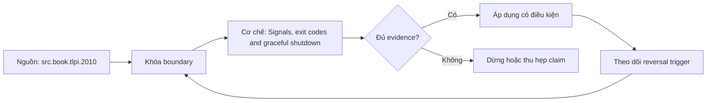

# Signals, exit codes and graceful shutdown

**Tóm tắt bản chất:** Cài đặt tắt có kiểm soát cho một tiến trình xử lý và chứng minh không mất việc đang dở khi nhận tín hiệu dừng. Cơ chế chỉ có giá trị khi workload, version, state owner và failure boundary đã được khóa; một con số đẹp ngoài bốn điều kiện đó không đủ để ra quyết định.

> [!abstract] Câu hỏi trung tâm
> Làm thế nào mô hình, đo và ra quyết định đúng về Signals, exit codes and graceful shutdown?

## Problem Definition and Operational Relevance

Không bắt tín hiệu nên bị giết giữa lúc ghi · dọn dẹp quá lâu rồi bị giết cứng · trả mã thoát không khi thực ra thất bại · dùng shell làm tiến trình chính nên tín hiệu không tới được chương trình. Đây không phải danh sách lỗi cú pháp. Mỗi lỗi làm người vận hành chọn nhầm owner hoặc chữa symptom ở layer sau, khiến thời gian phục hồi tăng dù command vừa chạy trả về thành công.

Năng lực cần giữ sau bài là: Cài đặt tắt có kiểm soát cho một tiến trình xử lý và chứng minh không mất việc đang dở khi nhận tín hiệu dừng. Nếu learner chỉ nhắc lại định nghĩa nhưng không phân biệt được hai state gần nhau trên số đo, bài chưa đạt.

## Mechanism

Tín hiệu là cách nhân và các tiến trình báo cho nhau, và xử lý sai tín hiệu là nguyên nhân mất dữ liệu khi triển khai. Phân biệt hai tín hiệu dừng: một cái bắt được và cho phép dọn dẹp, một cái không bắt được và giết ngay. Quy trình tắt đúng của một tiến trình xử lý dữ liệu: nhận tín hiệu, ngừng nhận việc mới, hoàn tất việc đang dở trong hạn, đẩy dữ liệu xuống đĩa, rồi thoát với mã đúng. Thời gian chờ trước khi bị giết cứng là hữu hạn nên phần dọn dẹp phải nằm trong hạn đó, và đây là ràng buộc sẽ gặp lại ở M25. Mã thoát và quy ước: không là thành công, khác không là thất bại, và bị tín hiệu giết thì mã thoát mã hoá số hiệu tín hiệu. Vì sao mã thoát đúng quan trọng: hệ điều phối ở M17 và hệ chạy container ở M25 đều dựa vào nó để biết việc thành công hay thất bại.

Tách ba lớp khi đọc cơ chế `wiki.de-foundation.signals-exit-codes-and-graceful-shutdown`: declared state là điều cấu hình hoặc API yêu cầu; executed state là việc runtime thực sự làm; consumer-visible state là điều client hay operator quan sát. Ba lớp có thể lệch nhau vì cache, buffering, retry, scheduling, queue hoặc failure giữa hai transition. Evidence phải chỉ ra lớp nào đang được đo.

## Decision Framework

| Bước | Câu hỏi phải khóa | Điều kiện đạt |
|---|---|---|
| Observe | Khóa process, resource, file descriptor và time window | Không trộn symptom giữa hai owner |
| Probe | Dùng phép đo read-only hẹp nhất | Probe phân biệt được hai giả thuyết |
| Contain | Giảm harm trước mutation | Có rollback và state snapshot |
| Escalate | Chuyển owner khi boundary đã chứng minh | Evidence đủ tái hiện |

Quy tắc mặc định là chọn phép giải thích đơn giản nhất qua được hard constraints, rồi viết trước reversal trigger. Với `Signals, exit codes and graceful shutdown`, absence of error không phải pass; pass cần observation đúng grain, một oracle độc lập và changed-constraint case đủ làm model có cơ hội thất bại.

## Worked Case: Signals, exit codes and graceful shutdown

Viết tiến trình xử lý hàng đợi. Cài bắt tín hiệu dừng, hoàn tất việc đang dở, đẩy dữ liệu xuống đĩa rồi thoát. Gửi tín hiệu dừng 20 lần ở thời điểm ngẫu nhiên và đối soát kết quả. Gửi tín hiệu giết cứng và ghi lại khác biệt. Kiểm mã thoát ở ba trường hợp thành công, thất bại và bị giết.

Trong case `wiki.de-foundation.signals-exit-codes-and-graceful-shutdown`, learner ghi expected transition, input snapshot, version và giới hạn an toàn trước khi chạy. Sau execution, họ giữ raw counter, timestamp, exit status, state trước-sau và giải thích delta bằng mechanism ở trên. Đánh giá không cho phép sửa expected result sau khi nhìn output mà không ghi change record.

Biến thể khó hơn đổi một constraint có khả năng đảo kết luận: workload shape, memory pressure, connection reuse, retry budget, permission hoặc dependency direction. Tầng *áp dụng*. Objective là một cơ chế kiểm được bằng thí nghiệm dừng. Kiểm bằng 20 lần gửi tín hiệu ở thời điểm ngẫu nhiên; đạt khi không lần nào mất việc và mã thoát đúng ở mọi trường hợp.

## Limits and Common Errors

**Hiểu lầm:** Không bắt tín hiệu nên bị giết giữa lúc ghi. **Thực tế:** tín hiệu chỉ chứng minh điều nó đo trong đúng scope; state ở layer khác vẫn có thể trái ngược. **Vì sao nghe hợp lý:** happy path nhỏ thường không chạm queue, cache, partial progress hoặc restart.

**Hiểu lầm:** dọn dẹp quá lâu rồi bị giết cứng. **Thực tế:** tool và API cung cấp primitive, không tự cấp ownership, deadline, idempotency hay recovery policy. **Vì sao nghe hợp lý:** syntax gọn che mất protocol và lifecycle phía dưới.

Với `wiki.de-foundation.signals-exit-codes-and-graceful-shutdown`, một edge case đáng giữ là observation đúng nhưng diagnosis sai: counter tăng thật, song nguyên nhân điều khiển nằm ở layer trước. Muốn tránh, timeline phải nối trigger tới consumer harm và ghi rõ negative control nào đã loại giả thuyết cạnh tranh.

## Nếu Bạn Dạy Lại Điều Này...

Mở bài bằng một dự đoán dễ sai về `Signals, exit codes and graceful shutdown`, không mở bằng định nghĩa. Cho hai trace gần giống nhau nhưng khác đúng một state boundary; learner phải chọn probe tiếp theo trước khi được xem đáp án.

Bài tập seed dùng chính lab của DE-L067, sau đó đổi constraint đủ mạnh để buộc giữ hoặc đảo quyết định. Người dạy chấm reasoning chain và evidence, không chấm việc learner đoán đúng tên công cụ.

## Ma trận kiểm chứng từng mệnh đề

Protocol riêng của `Signals, exit codes and graceful shutdown` dùng điều kiện hoàn thành sau: 20 lần gửi tín hiệu dừng đều không mất việc đang dở, và mã thoát đúng ở cả ba trường hợp. Mỗi probe phải có prediction, failure signal và independent oracle.

### Probe 1: state transition và invariant

**Mệnh đề P1 cần kiểm.** Tín hiệu là cách nhân và các tiến trình báo cho nhau, và xử lý sai tín hiệu là nguyên nhân mất dữ liệu khi triển khai.

**Thiết kế phép thử cho `wiki.de-foundation.signals-exit-codes-and-graceful-shutdown`.** Với `wiki.de-foundation.signals-exit-codes-and-graceful-shutdown`, tạo positive và negative control chỉ khác một điều kiện; khóa workload, version, identity, permission, clock và state ban đầu. Expected result được viết trước execution để tiêu chí không trôi theo output.

**Bằng chứng P1 cần giữ.** Với `wiki.de-foundation.signals-exit-codes-and-graceful-shutdown`, lưu command hoặc harness, raw observation, transition trước-sau, coverage và limitation. Kết luận chỉ đạt khi oracle độc lập khớp đúng grain; nếu chưa chạy thì đây vẫn là protocol, không phải observation.

### Probe 2: identity, ownership và boundary

**Mệnh đề P2 cần kiểm.** Cài đặt tắt có kiểm soát cho một tiến trình xử lý và chứng minh không mất việc đang dở khi nhận tín hiệu dừng.

**Thiết kế phép thử cho `wiki.de-foundation.signals-exit-codes-and-graceful-shutdown`.** Với `wiki.de-foundation.signals-exit-codes-and-graceful-shutdown`, tạo boundary case ngay trước và sau ngưỡng; khóa workload, version, identity, permission, clock và state ban đầu. Expected result được viết trước execution để tiêu chí không trôi theo output.

**Bằng chứng P2 cần giữ.** Với `wiki.de-foundation.signals-exit-codes-and-graceful-shutdown`, lưu command hoặc harness, raw observation, transition trước-sau, coverage và limitation. Kết luận chỉ đạt khi oracle độc lập khớp đúng grain; nếu chưa chạy thì đây vẫn là protocol, không phải observation.

### Probe 3: failure path và recovery

**Mệnh đề P3 cần kiểm.** Tầng *áp dụng*.

**Thiết kế phép thử cho `wiki.de-foundation.signals-exit-codes-and-graceful-shutdown`.** Với `wiki.de-foundation.signals-exit-codes-and-graceful-shutdown`, tạo replay cùng identity nhưng đổi state; khóa workload, version, identity, permission, clock và state ban đầu. Expected result được viết trước execution để tiêu chí không trôi theo output.

**Bằng chứng P3 cần giữ.** Với `wiki.de-foundation.signals-exit-codes-and-graceful-shutdown`, lưu command hoặc harness, raw observation, transition trước-sau, coverage và limitation. Kết luận chỉ đạt khi oracle độc lập khớp đúng grain; nếu chưa chạy thì đây vẫn là protocol, không phải observation.

### Probe 4: decision trade-off và reversal trigger

**Mệnh đề P4 cần kiểm.** Viết tiến trình xử lý hàng đợi.

**Thiết kế phép thử cho `wiki.de-foundation.signals-exit-codes-and-graceful-shutdown`.** Với `wiki.de-foundation.signals-exit-codes-and-graceful-shutdown`, tạo failure inject trước và sau transition bền vững; khóa workload, version, identity, permission, clock và state ban đầu. Expected result được viết trước execution để tiêu chí không trôi theo output.

**Bằng chứng P4 cần giữ.** Với `wiki.de-foundation.signals-exit-codes-and-graceful-shutdown`, lưu command hoặc harness, raw observation, transition trước-sau, coverage và limitation. Kết luận chỉ đạt khi oracle độc lập khớp đúng grain; nếu chưa chạy thì đây vẫn là protocol, không phải observation.

### Probe 5: evidence package và oracle

**Mệnh đề P5 cần kiểm.** Không bắt tín hiệu nên bị giết giữa lúc ghi · dọn dẹp quá lâu rồi bị giết cứng · trả mã thoát không khi thực ra thất bại · dùng shell làm tiến trình chính nên tín hiệu không tới được chương trình.

**Thiết kế phép thử cho `wiki.de-foundation.signals-exit-codes-and-graceful-shutdown`.** Với `wiki.de-foundation.signals-exit-codes-and-graceful-shutdown`, tạo changed scale làm cost model đổi; khóa workload, version, identity, permission, clock và state ban đầu. Expected result được viết trước execution để tiêu chí không trôi theo output.

**Bằng chứng P5 cần giữ.** Với `wiki.de-foundation.signals-exit-codes-and-graceful-shutdown`, lưu command hoặc harness, raw observation, transition trước-sau, coverage và limitation. Kết luận chỉ đạt khi oracle độc lập khớp đúng grain; nếu chưa chạy thì đây vẫn là protocol, không phải observation.

### Probe 6: changed-constraint transfer

**Mệnh đề P6 cần kiểm.** 20 lần gửi tín hiệu dừng đều không mất việc đang dở, và mã thoát đúng ở cả ba trường hợp.

**Thiết kế phép thử cho `wiki.de-foundation.signals-exit-codes-and-graceful-shutdown`.** Với `wiki.de-foundation.signals-exit-codes-and-graceful-shutdown`, tạo adversarial order, skew hoặc packet timing; khóa workload, version, identity, permission, clock và state ban đầu. Expected result được viết trước execution để tiêu chí không trôi theo output.

**Bằng chứng P6 cần giữ.** Với `wiki.de-foundation.signals-exit-codes-and-graceful-shutdown`, lưu command hoặc harness, raw observation, transition trước-sau, coverage và limitation. Kết luận chỉ đạt khi oracle độc lập khớp đúng grain; nếu chưa chạy thì đây vẫn là protocol, không phải observation.

### Probe 7: state transition và invariant

**Mệnh đề P7 cần kiểm.** Tín hiệu là cách nhân và các tiến trình báo cho nhau, và xử lý sai tín hiệu là nguyên nhân mất dữ liệu khi triển khai.

**Thiết kế phép thử cho `wiki.de-foundation.signals-exit-codes-and-graceful-shutdown`.** Với `wiki.de-foundation.signals-exit-codes-and-graceful-shutdown`, tạo fresh environment không cache; khóa workload, version, identity, permission, clock và state ban đầu. Expected result được viết trước execution để tiêu chí không trôi theo output.

**Bằng chứng P7 cần giữ.** Với `wiki.de-foundation.signals-exit-codes-and-graceful-shutdown`, lưu command hoặc harness, raw observation, transition trước-sau, coverage và limitation. Kết luận chỉ đạt khi oracle độc lập khớp đúng grain; nếu chưa chạy thì đây vẫn là protocol, không phải observation.

### Probe 8: identity, ownership và boundary

**Mệnh đề P8 cần kiểm.** Cài đặt tắt có kiểm soát cho một tiến trình xử lý và chứng minh không mất việc đang dở khi nhận tín hiệu dừng.

**Thiết kế phép thử cho `wiki.de-foundation.signals-exit-codes-and-graceful-shutdown`.** Với `wiki.de-foundation.signals-exit-codes-and-graceful-shutdown`, tạo independent oracle không dùng chung implementation; khóa workload, version, identity, permission, clock và state ban đầu. Expected result được viết trước execution để tiêu chí không trôi theo output.

**Bằng chứng P8 cần giữ.** Với `wiki.de-foundation.signals-exit-codes-and-graceful-shutdown`, lưu command hoặc harness, raw observation, transition trước-sau, coverage và limitation. Kết luận chỉ đạt khi oracle độc lập khớp đúng grain; nếu chưa chạy thì đây vẫn là protocol, không phải observation.

### Probe 9: failure path và recovery

**Mệnh đề P9 cần kiểm.** Tầng *áp dụng*.

**Thiết kế phép thử cho `wiki.de-foundation.signals-exit-codes-and-graceful-shutdown`.** Với `wiki.de-foundation.signals-exit-codes-and-graceful-shutdown`, tạo partial progress rồi restart; khóa workload, version, identity, permission, clock và state ban đầu. Expected result được viết trước execution để tiêu chí không trôi theo output.

**Bằng chứng P9 cần giữ.** Với `wiki.de-foundation.signals-exit-codes-and-graceful-shutdown`, lưu command hoặc harness, raw observation, transition trước-sau, coverage và limitation. Kết luận chỉ đạt khi oracle độc lập khớp đúng grain; nếu chưa chạy thì đây vẫn là protocol, không phải observation.

### Probe 10: decision trade-off và reversal trigger

**Mệnh đề P10 cần kiểm.** Viết tiến trình xử lý hàng đợi.

**Thiết kế phép thử cho `wiki.de-foundation.signals-exit-codes-and-graceful-shutdown`.** Với `wiki.de-foundation.signals-exit-codes-and-graceful-shutdown`, tạo missing evidence phải abstain; khóa workload, version, identity, permission, clock và state ban đầu. Expected result được viết trước execution để tiêu chí không trôi theo output.

**Bằng chứng P10 cần giữ.** Với `wiki.de-foundation.signals-exit-codes-and-graceful-shutdown`, lưu command hoặc harness, raw observation, transition trước-sau, coverage và limitation. Kết luận chỉ đạt khi oracle độc lập khớp đúng grain; nếu chưa chạy thì đây vẫn là protocol, không phải observation.

### Probe 11: evidence package và oracle

**Mệnh đề P11 cần kiểm.** Không bắt tín hiệu nên bị giết giữa lúc ghi · dọn dẹp quá lâu rồi bị giết cứng · trả mã thoát không khi thực ra thất bại · dùng shell làm tiến trình chính nên tín hiệu không tới được chương trình.

**Thiết kế phép thử cho `wiki.de-foundation.signals-exit-codes-and-graceful-shutdown`.** Với `wiki.de-foundation.signals-exit-codes-and-graceful-shutdown`, tạo reviewer tái hiện từ evidence package; khóa workload, version, identity, permission, clock và state ban đầu. Expected result được viết trước execution để tiêu chí không trôi theo output.

**Bằng chứng P11 cần giữ.** Với `wiki.de-foundation.signals-exit-codes-and-graceful-shutdown`, lưu command hoặc harness, raw observation, transition trước-sau, coverage và limitation. Kết luận chỉ đạt khi oracle độc lập khớp đúng grain; nếu chưa chạy thì đây vẫn là protocol, không phải observation.

### Probe 12: changed-constraint transfer

**Mệnh đề P12 cần kiểm.** 20 lần gửi tín hiệu dừng đều không mất việc đang dở, và mã thoát đúng ở cả ba trường hợp.

**Thiết kế phép thử cho `wiki.de-foundation.signals-exit-codes-and-graceful-shutdown`.** Với `wiki.de-foundation.signals-exit-codes-and-graceful-shutdown`, tạo constraint đổi đủ để quyết định đảo; khóa workload, version, identity, permission, clock và state ban đầu. Expected result được viết trước execution để tiêu chí không trôi theo output.

**Bằng chứng P12 cần giữ.** Với `wiki.de-foundation.signals-exit-codes-and-graceful-shutdown`, lưu command hoặc harness, raw observation, transition trước-sau, coverage và limitation. Kết luận chỉ đạt khi oracle độc lập khớp đúng grain; nếu chưa chạy thì đây vẫn là protocol, không phải observation.

## Tự Kiểm Tra Nhanh

1. Boundary đầu tiên khiến mô hình `Signals, exit codes and graceful shutdown` không còn đúng là gì?

<details><summary>Đáp án</summary>Không bắt tín hiệu nên bị giết giữa lúc ghi · dọn dẹp quá lâu rồi bị giết cứng · trả mã thoát không khi thực ra thất bại · dùng shell làm tiến trình chính nên tín hiệu không tới được chương trình.</details>

2. Evidence nào phân biệt được hai state dễ nhầm?

<details><summary>Đáp án</summary>Tầng *áp dụng*. Objective là một cơ chế kiểm được bằng thí nghiệm dừng. Kiểm bằng 20 lần gửi tín hiệu ở thời điểm ngẫu nhiên; đạt khi không lần nào mất việc và mã thoát đúng ở mọi trường hợp.</details>

3. Khi constraint đổi, điều gì quyết định giữ hay đảo lựa chọn?

<details><summary>Đáp án</summary>20 lần gửi tín hiệu dừng đều không mất việc đang dở, và mã thoát đúng ở cả ba trường hợp.</details>

## Giới hạn và điều chưa cho phép kết luận

- Lab của `Signals, exit codes and graceful shutdown` chưa được tuyên bố đã chạy trên production; note mô tả curriculum và expected evidence.
- Hành vi phụ thuộc kernel, distribution, library, network path hoặc hardware phải được kiểm lại trên target đã ghi version.
- Concept key `ck.de.signals-exit-codes-and-graceful-shutdown` đã được owner phê duyệt `canonical`; note thuộc canonical registry coverage. Trạng thái này không tự chứng minh learner mastery.
- Một trace đơn lẻ không chứng minh capacity, reliability hoặc security cho population khác.
- Note giữ trạng thái `review` cho tới khi owner duyệt semantics và learner artifact.

## Reference
1. [[SRC-TLPI-2010]]

## Source coverage

| Source slice | Locator | Kiến thức phải giữ | Vị trí | Trạng thái | Ngoài phạm vi |
|---|---|---|---|---|---|
| [[SRC-TLPI-2010]]: `src.book.tlpi.2010` | Chapters 4-39, 49-50, 61 và 63 theo scope record; PDF 113-1418 | mechanism và boundary liên quan trực tiếp tới `Signals, exit codes and graceful shutdown` | cơ chế, quyết định, case và probe | Đã phủ | phần ngoài objective DE-L067 |

## Key takeaways
- Cài đặt tắt có kiểm soát cho một tiến trình xử lý và chứng minh không mất việc đang dở khi nhận tín hiệu dừng.
- 20 lần gửi tín hiệu dừng đều không mất việc đang dở, và mã thoát đúng ở cả ba trường hợp.
- `Signals, exit codes and graceful shutdown` chỉ có nghĩa trong scope, state, identity và version đã ghi.
- Trước khi lab chạy, đây là note có provenance và protocol, chưa phải production evidence hay bằng chứng mastery.

<!-- ATOMIC-EXECUTION-CAPSULE:START -->

## Execution capsule: kiểm chứng `wiki.de-foundation.signals-exit-codes-and-graceful-shutdown`

> [!important] Phân loại mệnh đề
> Với `wiki.de-foundation.signals-exit-codes-and-graceful-shutdown`, sơ đồ, ví dụ và artifact về **Signals, exit codes and graceful shutdown** là **synthesis để kiểm chứng**; chúng không phải trích dẫn hay case nguyên văn của nguồn.

### Sơ đồ cơ chế và điểm kiểm soát



Đọc sơ đồ `wiki.de-foundation.signals-exit-codes-and-graceful-shutdown` từ trái sang phải: source chỉ cung cấp claim ban đầu cho **Signals, exit codes and graceful shutdown**; quyết định chỉ được đi tiếp sau khi boundary, evidence và điều kiện đảo quyết định đã hiện hữu.

### Artifact thực thi tối thiểu

```yaml
concept_id: "wiki.de-foundation.signals-exit-codes-and-graceful-shutdown"
concept: "Signals, exit codes and graceful shutdown"
primary_question: "Làm thế nào mô hình, đo và ra quyết định đúng về Signals, exit codes and graceful shutdown?"
decision_contract:
  input_boundary: "Ghi population, thời điểm, owner và điều chưa biết"
  hard_constraints:
    - "Không vượt quyền hoặc privacy boundary"
    - "Không dùng cùng một assumption làm cả implementation và oracle"
  accept_when: "Có observation phân biệt được các lựa chọn"
  reversal_trigger: "Một hard constraint sai hoặc evidence mới đổi recommendation"
evidence_to_keep:
  - "input snapshot"
  - "chosen and rejected options"
  - "independent review result"
```

Artifact của `wiki.de-foundation.signals-exit-codes-and-graceful-shutdown` buộc người dùng ghi boundary, oracle và reversal trigger cho **Signals, exit codes and graceful shutdown**. Các giá trị minh họa phải được thay bằng evidence thật trước khi dùng cho quyết định.

<!-- ATOMIC-EXECUTION-CAPSULE:END -->
