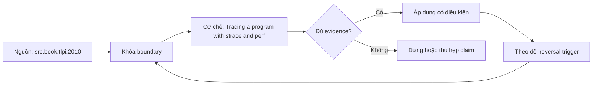

# Tracing a program with strace and perf

**Tóm tắt bản chất:** Chọn đúng công cụ cho một triệu chứng cho trước và định vị nguyên nhân từ kết quả của nó. Cơ chế chỉ có giá trị khi workload, version, state owner và failure boundary đã được khóa; một con số đẹp ngoài bốn điều kiện đó không đủ để ra quyết định.

> [!abstract] Câu hỏi trung tâm
> Làm thế nào mô hình, đo và ra quyết định đúng về Tracing a program with strace and perf?

## Nỗi Đau & Động Lực

Dùng theo dõi lời gọi hệ thống cho chương trình bận CPU · chạy công cụ theo dõi trên sản xuất lúc tải cao · đọc kết quả mà không đếm theo lời gọi · bỏ qua thời gian nằm trong lời gọi. Đây không phải danh sách lỗi cú pháp. Mỗi lỗi làm người vận hành chọn nhầm owner hoặc chữa symptom ở layer sau, khiến thời gian phục hồi tăng dù command vừa chạy trả về thành công.

Năng lực cần giữ sau bài là: Chọn đúng công cụ cho một triệu chứng cho trước và định vị nguyên nhân từ kết quả của nó. Nếu learner chỉ nhắc lại định nghĩa nhưng không phân biệt được hai state gần nhau trên số đo, bài chưa đạt.

## Cơ Chế Tác Động

Hai công cụ trả lời hai câu hỏi khác nhau, và biết dùng cái nào cho câu nào tiết kiệm rất nhiều thời gian. Theo dõi lời gọi hệ thống trả lời chương trình đang nói gì với nhân: mở tệp nào, kết nối tới đâu, chờ ở đâu; rất hữu dụng khi chương trình treo hoặc khi không rõ nó đọc tệp cấu hình nào. Nhược điểm là làm chương trình chậm đáng kể nên không dùng trong sản xuất khi tải cao. Lấy mẫu hiệu năng trả lời thời gian CPU tiêu ở hàm nào, nhẹ nên dùng được trong sản xuất, nhưng không thấy phần chờ. Từ đó rút ra quy tắc chọn: chương trình bận CPU thì lấy mẫu hiệu năng, chương trình treo hoặc chờ thì theo dõi lời gọi hệ thống. Cách đọc kết quả: đếm theo lời gọi để thấy cái nào nhiều, và xem thời gian nằm trong lời gọi nào để thấy chờ ở đâu. Nối tới M26: đây là hai công cụ của bước chẩn đoán trong quy trình xử lý sự cố.

Tách ba lớp khi đọc cơ chế `wiki.de-foundation.tracing-a-program-with-strace-and-perf`: declared state là điều cấu hình hoặc API yêu cầu; executed state là việc runtime thực sự làm; consumer-visible state là điều client hay operator quan sát. Ba lớp có thể lệch nhau vì cache, buffering, retry, scheduling, queue hoặc failure giữa hai transition. Evidence phải chỉ ra lớp nào đang được đo.

## Bản Đồ Quyết Định

| Bước | Câu hỏi phải khóa | Điều kiện đạt |
|---|---|---|
| Observe | Khóa process, resource, file descriptor và time window | Không trộn symptom giữa hai owner |
| Probe | Dùng phép đo read-only hẹp nhất | Probe phân biệt được hai giả thuyết |
| Contain | Giảm harm trước mutation | Có rollback và state snapshot |
| Escalate | Chuyển owner khi boundary đã chứng minh | Evidence đủ tái hiện |

Quy tắc mặc định là chọn phép giải thích đơn giản nhất qua được hard constraints, rồi viết trước reversal trigger. Với `Tracing a program with strace and perf`, absence of error không phải pass; pass cần observation đúng grain, một oracle độc lập và changed-constraint case đủ làm model có cơ hội thất bại.

## Case Study Thực Chiến: Tracing a program with strace and perf

Cho ba chương trình: một treo khi khởi động, một bận CPU bất thường, một chậm vì gọi hệ thống quá nhiều. Với mỗi cái, chọn công cụ, chạy, và định vị nguyên nhân. Với chương trình treo, chỉ ra chính xác lời gọi hệ thống nó đang chờ.

Trong case `wiki.de-foundation.tracing-a-program-with-strace-and-perf`, learner ghi expected transition, input snapshot, version và giới hạn an toàn trước khi chạy. Sau execution, họ giữ raw counter, timestamp, exit status, state trước–sau và giải thích delta bằng mechanism ở trên. Đánh giá không cho phép sửa expected result sau khi nhìn output mà không ghi change record.

Biến thể khó hơn đổi một constraint có khả năng đảo kết luận: workload shape, memory pressure, connection reuse, retry budget, permission hoặc dependency direction. Tầng *phân tích*. Objective là chọn công cụ theo câu hỏi rồi đọc kết quả, kỹ năng dùng lại suốt phần vận hành. Kiểm bằng ba chương trình có ba triệu chứng; đạt khi chọn đúng công cụ ít nhất hai và định vị đúng nguyên nhân.

## Góc Khuất & Ngộ Nhận

**Hiểu lầm:** Dùng theo dõi lời gọi hệ thống cho chương trình bận CPU. **Thực tế:** tín hiệu chỉ chứng minh điều nó đo trong đúng scope; state ở layer khác vẫn có thể trái ngược. **Vì sao nghe hợp lý:** happy path nhỏ thường không chạm queue, cache, partial progress hoặc restart.

**Hiểu lầm:** chạy công cụ theo dõi trên sản xuất lúc tải cao. **Thực tế:** tool và API cung cấp primitive, không tự cấp ownership, deadline, idempotency hay recovery policy. **Vì sao nghe hợp lý:** syntax gọn che mất protocol và lifecycle phía dưới.

Với `wiki.de-foundation.tracing-a-program-with-strace-and-perf`, một edge case đáng giữ là observation đúng nhưng diagnosis sai: counter tăng thật, song nguyên nhân điều khiển nằm ở layer trước. Muốn tránh, timeline phải nối trigger tới consumer harm và ghi rõ negative control nào đã loại giả thuyết cạnh tranh.

## Nếu Bạn Dạy Lại Điều Này...

Mở bài bằng một dự đoán dễ sai về `Tracing a program with strace and perf`, không mở bằng định nghĩa. Cho hai trace gần giống nhau nhưng khác đúng một state boundary; learner phải chọn probe tiếp theo trước khi được xem đáp án.

Bài tập seed dùng chính lab của DE-L071, sau đó đổi constraint đủ mạnh để buộc giữ hoặc đảo quyết định. Người dạy chấm reasoning chain và evidence, không chấm việc learner đoán đúng tên công cụ.

## Ma trận kiểm chứng từng mệnh đề

Protocol riêng của `Tracing a program with strace and perf` dùng điều kiện hoàn thành sau: Chọn đúng công cụ ≥ 2/3 trường hợp và định vị đúng nguyên nhân, kể cả chỉ ra lời gọi mà chương trình treo đang chờ. Mỗi probe phải có prediction, failure signal và independent oracle.

### Probe 1: state transition và invariant

**Mệnh đề P1 cần kiểm.** Hai công cụ trả lời hai câu hỏi khác nhau, và biết dùng cái nào cho câu nào tiết kiệm rất nhiều thời gian.

**Thiết kế phép thử cho `wiki.de-foundation.tracing-a-program-with-strace-and-perf`.** Với `wiki.de-foundation.tracing-a-program-with-strace-and-perf`, tạo positive và negative control chỉ khác một điều kiện; khóa workload, version, identity, permission, clock và state ban đầu. Expected result được viết trước execution để tiêu chí không trôi theo output.

**Bằng chứng P1 cần giữ.** Với `wiki.de-foundation.tracing-a-program-with-strace-and-perf`, lưu command hoặc harness, raw observation, transition trước–sau, coverage và limitation. Kết luận chỉ đạt khi oracle độc lập khớp đúng grain; nếu chưa chạy thì đây vẫn là protocol, không phải observation.

### Probe 2: identity, ownership và boundary

**Mệnh đề P2 cần kiểm.** Chọn đúng công cụ cho một triệu chứng cho trước và định vị nguyên nhân từ kết quả của nó.

**Thiết kế phép thử cho `wiki.de-foundation.tracing-a-program-with-strace-and-perf`.** Với `wiki.de-foundation.tracing-a-program-with-strace-and-perf`, tạo boundary case ngay trước và sau ngưỡng; khóa workload, version, identity, permission, clock và state ban đầu. Expected result được viết trước execution để tiêu chí không trôi theo output.

**Bằng chứng P2 cần giữ.** Với `wiki.de-foundation.tracing-a-program-with-strace-and-perf`, lưu command hoặc harness, raw observation, transition trước–sau, coverage và limitation. Kết luận chỉ đạt khi oracle độc lập khớp đúng grain; nếu chưa chạy thì đây vẫn là protocol, không phải observation.

### Probe 3: failure path và recovery

**Mệnh đề P3 cần kiểm.** Tầng *phân tích*.

**Thiết kế phép thử cho `wiki.de-foundation.tracing-a-program-with-strace-and-perf`.** Với `wiki.de-foundation.tracing-a-program-with-strace-and-perf`, tạo replay cùng identity nhưng đổi state; khóa workload, version, identity, permission, clock và state ban đầu. Expected result được viết trước execution để tiêu chí không trôi theo output.

**Bằng chứng P3 cần giữ.** Với `wiki.de-foundation.tracing-a-program-with-strace-and-perf`, lưu command hoặc harness, raw observation, transition trước–sau, coverage và limitation. Kết luận chỉ đạt khi oracle độc lập khớp đúng grain; nếu chưa chạy thì đây vẫn là protocol, không phải observation.

### Probe 4: decision trade-off và reversal trigger

**Mệnh đề P4 cần kiểm.** Cho ba chương trình: một treo khi khởi động, một bận CPU bất thường, một chậm vì gọi hệ thống quá nhiều.

**Thiết kế phép thử cho `wiki.de-foundation.tracing-a-program-with-strace-and-perf`.** Với `wiki.de-foundation.tracing-a-program-with-strace-and-perf`, tạo failure inject trước và sau transition bền vững; khóa workload, version, identity, permission, clock và state ban đầu. Expected result được viết trước execution để tiêu chí không trôi theo output.

**Bằng chứng P4 cần giữ.** Với `wiki.de-foundation.tracing-a-program-with-strace-and-perf`, lưu command hoặc harness, raw observation, transition trước–sau, coverage và limitation. Kết luận chỉ đạt khi oracle độc lập khớp đúng grain; nếu chưa chạy thì đây vẫn là protocol, không phải observation.

### Probe 5: evidence package và oracle

**Mệnh đề P5 cần kiểm.** Dùng theo dõi lời gọi hệ thống cho chương trình bận CPU · chạy công cụ theo dõi trên sản xuất lúc tải cao · đọc kết quả mà không đếm theo lời gọi · bỏ qua thời gian nằm trong lời gọi.

**Thiết kế phép thử cho `wiki.de-foundation.tracing-a-program-with-strace-and-perf`.** Với `wiki.de-foundation.tracing-a-program-with-strace-and-perf`, tạo changed scale làm cost model đổi; khóa workload, version, identity, permission, clock và state ban đầu. Expected result được viết trước execution để tiêu chí không trôi theo output.

**Bằng chứng P5 cần giữ.** Với `wiki.de-foundation.tracing-a-program-with-strace-and-perf`, lưu command hoặc harness, raw observation, transition trước–sau, coverage và limitation. Kết luận chỉ đạt khi oracle độc lập khớp đúng grain; nếu chưa chạy thì đây vẫn là protocol, không phải observation.

### Probe 6: changed-constraint transfer

**Mệnh đề P6 cần kiểm.** Chọn đúng công cụ ≥ 2/3 trường hợp và định vị đúng nguyên nhân, kể cả chỉ ra lời gọi mà chương trình treo đang chờ.

**Thiết kế phép thử cho `wiki.de-foundation.tracing-a-program-with-strace-and-perf`.** Với `wiki.de-foundation.tracing-a-program-with-strace-and-perf`, tạo adversarial order, skew hoặc packet timing; khóa workload, version, identity, permission, clock và state ban đầu. Expected result được viết trước execution để tiêu chí không trôi theo output.

**Bằng chứng P6 cần giữ.** Với `wiki.de-foundation.tracing-a-program-with-strace-and-perf`, lưu command hoặc harness, raw observation, transition trước–sau, coverage và limitation. Kết luận chỉ đạt khi oracle độc lập khớp đúng grain; nếu chưa chạy thì đây vẫn là protocol, không phải observation.

### Probe 7: state transition và invariant

**Mệnh đề P7 cần kiểm.** Hai công cụ trả lời hai câu hỏi khác nhau, và biết dùng cái nào cho câu nào tiết kiệm rất nhiều thời gian.

**Thiết kế phép thử cho `wiki.de-foundation.tracing-a-program-with-strace-and-perf`.** Với `wiki.de-foundation.tracing-a-program-with-strace-and-perf`, tạo fresh environment không cache; khóa workload, version, identity, permission, clock và state ban đầu. Expected result được viết trước execution để tiêu chí không trôi theo output.

**Bằng chứng P7 cần giữ.** Với `wiki.de-foundation.tracing-a-program-with-strace-and-perf`, lưu command hoặc harness, raw observation, transition trước–sau, coverage và limitation. Kết luận chỉ đạt khi oracle độc lập khớp đúng grain; nếu chưa chạy thì đây vẫn là protocol, không phải observation.

### Probe 8: identity, ownership và boundary

**Mệnh đề P8 cần kiểm.** Chọn đúng công cụ cho một triệu chứng cho trước và định vị nguyên nhân từ kết quả của nó.

**Thiết kế phép thử cho `wiki.de-foundation.tracing-a-program-with-strace-and-perf`.** Với `wiki.de-foundation.tracing-a-program-with-strace-and-perf`, tạo independent oracle không dùng chung implementation; khóa workload, version, identity, permission, clock và state ban đầu. Expected result được viết trước execution để tiêu chí không trôi theo output.

**Bằng chứng P8 cần giữ.** Với `wiki.de-foundation.tracing-a-program-with-strace-and-perf`, lưu command hoặc harness, raw observation, transition trước–sau, coverage và limitation. Kết luận chỉ đạt khi oracle độc lập khớp đúng grain; nếu chưa chạy thì đây vẫn là protocol, không phải observation.

### Probe 9: failure path và recovery

**Mệnh đề P9 cần kiểm.** Tầng *phân tích*.

**Thiết kế phép thử cho `wiki.de-foundation.tracing-a-program-with-strace-and-perf`.** Với `wiki.de-foundation.tracing-a-program-with-strace-and-perf`, tạo partial progress rồi restart; khóa workload, version, identity, permission, clock và state ban đầu. Expected result được viết trước execution để tiêu chí không trôi theo output.

**Bằng chứng P9 cần giữ.** Với `wiki.de-foundation.tracing-a-program-with-strace-and-perf`, lưu command hoặc harness, raw observation, transition trước–sau, coverage và limitation. Kết luận chỉ đạt khi oracle độc lập khớp đúng grain; nếu chưa chạy thì đây vẫn là protocol, không phải observation.

### Probe 10: decision trade-off và reversal trigger

**Mệnh đề P10 cần kiểm.** Cho ba chương trình: một treo khi khởi động, một bận CPU bất thường, một chậm vì gọi hệ thống quá nhiều.

**Thiết kế phép thử cho `wiki.de-foundation.tracing-a-program-with-strace-and-perf`.** Với `wiki.de-foundation.tracing-a-program-with-strace-and-perf`, tạo missing evidence phải abstain; khóa workload, version, identity, permission, clock và state ban đầu. Expected result được viết trước execution để tiêu chí không trôi theo output.

**Bằng chứng P10 cần giữ.** Với `wiki.de-foundation.tracing-a-program-with-strace-and-perf`, lưu command hoặc harness, raw observation, transition trước–sau, coverage và limitation. Kết luận chỉ đạt khi oracle độc lập khớp đúng grain; nếu chưa chạy thì đây vẫn là protocol, không phải observation.

### Probe 11: evidence package và oracle

**Mệnh đề P11 cần kiểm.** Dùng theo dõi lời gọi hệ thống cho chương trình bận CPU · chạy công cụ theo dõi trên sản xuất lúc tải cao · đọc kết quả mà không đếm theo lời gọi · bỏ qua thời gian nằm trong lời gọi.

**Thiết kế phép thử cho `wiki.de-foundation.tracing-a-program-with-strace-and-perf`.** Với `wiki.de-foundation.tracing-a-program-with-strace-and-perf`, tạo reviewer tái hiện từ evidence package; khóa workload, version, identity, permission, clock và state ban đầu. Expected result được viết trước execution để tiêu chí không trôi theo output.

**Bằng chứng P11 cần giữ.** Với `wiki.de-foundation.tracing-a-program-with-strace-and-perf`, lưu command hoặc harness, raw observation, transition trước–sau, coverage và limitation. Kết luận chỉ đạt khi oracle độc lập khớp đúng grain; nếu chưa chạy thì đây vẫn là protocol, không phải observation.

### Probe 12: changed-constraint transfer

**Mệnh đề P12 cần kiểm.** Chọn đúng công cụ ≥ 2/3 trường hợp và định vị đúng nguyên nhân, kể cả chỉ ra lời gọi mà chương trình treo đang chờ.

**Thiết kế phép thử cho `wiki.de-foundation.tracing-a-program-with-strace-and-perf`.** Với `wiki.de-foundation.tracing-a-program-with-strace-and-perf`, tạo constraint đổi đủ để quyết định đảo; khóa workload, version, identity, permission, clock và state ban đầu. Expected result được viết trước execution để tiêu chí không trôi theo output.

**Bằng chứng P12 cần giữ.** Với `wiki.de-foundation.tracing-a-program-with-strace-and-perf`, lưu command hoặc harness, raw observation, transition trước–sau, coverage và limitation. Kết luận chỉ đạt khi oracle độc lập khớp đúng grain; nếu chưa chạy thì đây vẫn là protocol, không phải observation.

## Tự Kiểm Tra Nhanh

1. Boundary đầu tiên khiến mô hình `Tracing a program with strace and perf` không còn đúng là gì?

<details><summary>Đáp án</summary>Dùng theo dõi lời gọi hệ thống cho chương trình bận CPU · chạy công cụ theo dõi trên sản xuất lúc tải cao · đọc kết quả mà không đếm theo lời gọi · bỏ qua thời gian nằm trong lời gọi.</details>

2. Evidence nào phân biệt được hai state dễ nhầm?

<details><summary>Đáp án</summary>Tầng *phân tích*. Objective là chọn công cụ theo câu hỏi rồi đọc kết quả, kỹ năng dùng lại suốt phần vận hành. Kiểm bằng ba chương trình có ba triệu chứng; đạt khi chọn đúng công cụ ít nhất hai và định vị đúng nguyên nhân.</details>

3. Khi constraint đổi, điều gì quyết định giữ hay đảo lựa chọn?

<details><summary>Đáp án</summary>Chọn đúng công cụ ≥ 2/3 trường hợp và định vị đúng nguyên nhân, kể cả chỉ ra lời gọi mà chương trình treo đang chờ.</details>

## Giới hạn và điều chưa cho phép kết luận

- Lab của `Tracing a program with strace and perf` chưa được tuyên bố đã chạy trên production; note mô tả curriculum và expected evidence.
- Hành vi phụ thuộc kernel, distribution, library, network path hoặc hardware phải được kiểm lại trên target đã ghi version.
- Concept key `ck.de.tracing-a-program-with-strace-and-perf` đã được owner phê duyệt `canonical`; note thuộc canonical registry coverage. Trạng thái này không tự chứng minh learner mastery.
- Một trace đơn lẻ không chứng minh capacity, reliability hoặc security cho population khác.
- Note giữ trạng thái `review` cho tới khi owner duyệt semantics và learner artifact.

## Reference
1. [[SRC-TLPI-2010]]
2. [[SRC-LINUX-KERNEL-RUNTIME-DOCS]]

## Source coverage

| Source slice | Locator | Kiến thức phải giữ | Vị trí | Trạng thái | Ngoài phạm vi |
|---|---|---|---|---|---|
| [[SRC-TLPI-2010]] — `src.book.tlpi.2010` | Chapters 4–39, 49–50, 61 và 63 theo scope record; PDF 113–1418 | mechanism và boundary liên quan trực tiếp tới `Tracing a program with strace and perf` | cơ chế, quyết định, case và probe | Đã phủ | phần ngoài objective DE-L071 |
| [[SRC-LINUX-KERNEL-RUNTIME-DOCS]] — `src.docs.linux-kernel-runtime` | PSI, userspace API, io_uring và trace documentation; accessed 2026-10-02 | mechanism và boundary liên quan trực tiếp tới `Tracing a program with strace and perf` | cơ chế, quyết định, case và probe | Đã phủ | phần ngoài objective DE-L071 |

## Key takeaways
- Chọn đúng công cụ cho một triệu chứng cho trước và định vị nguyên nhân từ kết quả của nó.
- Chọn đúng công cụ ≥ 2/3 trường hợp và định vị đúng nguyên nhân, kể cả chỉ ra lời gọi mà chương trình treo đang chờ.
- `Tracing a program with strace and perf` chỉ có nghĩa trong scope, state, identity và version đã ghi.
- Trước khi lab chạy, đây là note có provenance và protocol, chưa phải production evidence hay bằng chứng mastery.

<!-- ATOMIC-EXECUTION-CAPSULE:START -->

## Execution capsule — kiểm chứng `wiki.de-foundation.tracing-a-program-with-strace-and-perf`

> [!important] Phân loại mệnh đề
> Với `wiki.de-foundation.tracing-a-program-with-strace-and-perf`, sơ đồ, ví dụ và artifact về **Tracing a program with strace and perf** là **synthesis để kiểm chứng**; chúng không phải trích dẫn hay case nguyên văn của nguồn.

### Sơ đồ cơ chế và điểm kiểm soát



Đọc sơ đồ `wiki.de-foundation.tracing-a-program-with-strace-and-perf` từ trái sang phải: source chỉ cung cấp claim ban đầu cho **Tracing a program with strace and perf**; quyết định chỉ được đi tiếp sau khi boundary, evidence và điều kiện đảo quyết định đã hiện hữu.

### Artifact thực thi tối thiểu

```yaml
concept_id: "wiki.de-foundation.tracing-a-program-with-strace-and-perf"
concept: "Tracing a program with strace and perf"
primary_question: "Làm thế nào mô hình, đo và ra quyết định đúng về Tracing a program with strace and perf?"
decision_contract:
  input_boundary: "Ghi population, thời điểm, owner và điều chưa biết"
  hard_constraints:
    - "Không vượt quyền hoặc privacy boundary"
    - "Không dùng cùng một assumption làm cả implementation và oracle"
  accept_when: "Có observation phân biệt được các lựa chọn"
  reversal_trigger: "Một hard constraint sai hoặc evidence mới đổi recommendation"
evidence_to_keep:
  - "input snapshot"
  - "chosen and rejected options"
  - "independent review result"
```

Artifact của `wiki.de-foundation.tracing-a-program-with-strace-and-perf` buộc người dùng ghi boundary, oracle và reversal trigger cho **Tracing a program with strace and perf**. Các giá trị minh họa phải được thay bằng evidence thật trước khi dùng cho quyết định.

<!-- ATOMIC-EXECUTION-CAPSULE:END -->
