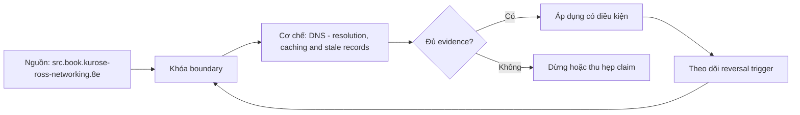

# DNS - resolution, caching and stale records

**Tóm tắt bản chất:** Chẩn đoán một sự cố do bản ghi cũ trong bộ đệm và phân biệt nó với lỗi kết nối thật. Cơ chế chỉ có giá trị khi workload, version, state owner và failure boundary đã được khóa; một con số đẹp ngoài bốn điều kiện đó không đủ để ra quyết định.

> [!abstract] Câu hỏi trung tâm
> Làm thế nào mô hình, đo và ra quyết định đúng về DNS - resolution, caching and stale records?

## Problem Definition and Operational Relevance

Bỏ qua bước phân giải tên khi chẩn đoán · đổi bản ghi rồi mong có hiệu lực ngay · quên đệm trong tiến trình · kết luận lỗi mạng khi thực ra là bản ghi cũ. Đây không phải danh sách lỗi cú pháp. Mỗi lỗi làm người vận hành chọn nhầm owner hoặc chữa symptom ở layer sau, khiến thời gian phục hồi tăng dù command vừa chạy trả về thành công.

Năng lực cần giữ sau bài là: Chẩn đoán một sự cố do bản ghi cũ trong bộ đệm và phân biệt nó với lỗi kết nối thật. Nếu learner chỉ nhắc lại định nghĩa nhưng không phân biệt được hai state gần nhau trên số đo, bài chưa đạt.

## Mechanism

Phân giải tên là bước đầu tiên của mọi kết nối và cũng là nguồn sự cố hay bị bỏ qua nhất vì nó thường hoạt động. Quá trình phân giải đệ quy và vai trò của máy chủ có thẩm quyền. Các loại bản ghi hay dùng và ý nghĩa vận hành của từng loại. Thời gian sống quyết định bộ đệm giữ kết quả bao lâu, và từ đó suy ra hai hệ quả quan trọng: đổi bản ghi không có hiệu lực ngay với mọi nơi, nên **kế hoạch chuyển đổi hạ tầng phải hạ thời gian sống trước nhiều giờ**; và một bản ghi cũ nằm trong bộ đệm có thể trỏ tới máy đã ngừng hoạt động. Ba tầng đệm hay quên: đệm của thư viện trong tiến trình, đệm của hệ điều hành, và đệm của máy chủ phân giải. Triệu chứng của bản ghi cũ và cách phân biệt với lỗi mạng: một số máy gọi được và một số không, đó là dấu hiệu đặc trưng.

Tách ba lớp khi đọc cơ chế `wiki.de-foundation.dns-resolution-caching-and-stale-records`: declared state là điều cấu hình hoặc API yêu cầu; executed state là việc runtime thực sự làm; consumer-visible state là điều client hay operator quan sát. Ba lớp có thể lệch nhau vì cache, buffering, retry, scheduling, queue hoặc failure giữa hai transition. Evidence phải chỉ ra lớp nào đang được đo.

## Decision Framework

| Bước | Câu hỏi phải khóa | Điều kiện đạt |
|---|---|---|
| Layer | Xác định hop và protocol state | Không gọi mọi lỗi là network |
| Budget | Chia deadline và capacity theo hop | Không reset budget sau retry |
| Identity | Khóa connection, request và operation identity | Không gộp duplicate với retry |
| Evidence | Ghép client, DNS, transport, TLS, HTTP và server timeline | Clock và correlation được công bố |

Quy tắc mặc định là chọn phép giải thích đơn giản nhất qua được hard constraints, rồi viết trước reversal trigger. Với `DNS - resolution, caching and stale records`, absence of error không phải pass; pass cần observation đúng grain, một oracle độc lập và changed-constraint case đủ làm model có cơ hội thất bại.

## Worked Case: DNS - resolution, caching and stale records

Dựng một tên miền thử trỏ tới một máy, gọi thành công, rồi đổi sang máy khác. Quan sát thời gian bản ghi cũ còn hiệu lực ở từng tầng đệm. Tạo tình huống một số tiến trình gọi được và một số không, rồi chẩn đoán. So thời gian sống đặt trước và sau khi hạ xuống.

Trong case `wiki.de-foundation.dns-resolution-caching-and-stale-records`, learner ghi expected transition, input snapshot, version và giới hạn an toàn trước khi chạy. Sau execution, họ giữ raw counter, timestamp, exit status, state trước-sau và giải thích delta bằng mechanism ở trên. Đánh giá không cho phép sửa expected result sau khi nhìn output mà không ghi change record.

Biến thể khó hơn đổi một constraint có khả năng đảo kết luận: workload shape, memory pressure, connection reuse, retry budget, permission hoặc dependency direction. Tầng *phân tích*. Objective là nhận ra một loại sự cố có triệu chứng gây hiểu nhầm. Kiểm bằng hai tình huống trong đó một là bản ghi cũ; đạt khi phân biệt đúng và chỉ ra tầng đệm nào đang giữ bản ghi.

## Limits and Common Errors

**Hiểu lầm:** Bỏ qua bước phân giải tên khi chẩn đoán. **Thực tế:** tín hiệu chỉ chứng minh điều nó đo trong đúng scope; state ở layer khác vẫn có thể trái ngược. **Vì sao nghe hợp lý:** happy path nhỏ thường không chạm queue, cache, partial progress hoặc restart.

**Hiểu lầm:** đổi bản ghi rồi mong có hiệu lực ngay. **Thực tế:** tool và API cung cấp primitive, không tự cấp ownership, deadline, idempotency hay recovery policy. **Vì sao nghe hợp lý:** syntax gọn che mất protocol và lifecycle phía dưới.

Với `wiki.de-foundation.dns-resolution-caching-and-stale-records`, một edge case đáng giữ là observation đúng nhưng diagnosis sai: counter tăng thật, song nguyên nhân điều khiển nằm ở layer trước. Muốn tránh, timeline phải nối trigger tới consumer harm và ghi rõ negative control nào đã loại giả thuyết cạnh tranh.

## Nếu Bạn Dạy Lại Điều Này...

Mở bài bằng một dự đoán dễ sai về `DNS - resolution, caching and stale records`, không mở bằng định nghĩa. Cho hai trace gần giống nhau nhưng khác đúng một state boundary; learner phải chọn probe tiếp theo trước khi được xem đáp án.

Bài tập seed dùng chính lab của DE-L078, sau đó đổi constraint đủ mạnh để buộc giữ hoặc đảo quyết định. Người dạy chấm reasoning chain và evidence, không chấm việc learner đoán đúng tên công cụ.

## Ma trận kiểm chứng từng mệnh đề

Protocol riêng của `DNS - resolution, caching and stale records` dùng điều kiện hoàn thành sau: Phân biệt đúng hai tình huống, chỉ ra đúng tầng đệm giữ bản ghi cũ, và có số đo thời gian hiệu lực ở từng tầng. Mỗi probe phải có prediction, failure signal và independent oracle.

### Probe 1: state transition và invariant

**Mệnh đề P1 cần kiểm.** Phân giải tên là bước đầu tiên của mọi kết nối và cũng là nguồn sự cố hay bị bỏ qua nhất vì nó thường hoạt động.

**Thiết kế phép thử cho `wiki.de-foundation.dns-resolution-caching-and-stale-records`.** Với `wiki.de-foundation.dns-resolution-caching-and-stale-records`, tạo positive và negative control chỉ khác một điều kiện; khóa workload, version, identity, permission, clock và state ban đầu. Expected result được viết trước execution để tiêu chí không trôi theo output.

**Bằng chứng P1 cần giữ.** Với `wiki.de-foundation.dns-resolution-caching-and-stale-records`, lưu command hoặc harness, raw observation, transition trước-sau, coverage và limitation. Kết luận chỉ đạt khi oracle độc lập khớp đúng grain; nếu chưa chạy thì đây vẫn là protocol, không phải observation.

### Probe 2: identity, ownership và boundary

**Mệnh đề P2 cần kiểm.** Chẩn đoán một sự cố do bản ghi cũ trong bộ đệm và phân biệt nó với lỗi kết nối thật.

**Thiết kế phép thử cho `wiki.de-foundation.dns-resolution-caching-and-stale-records`.** Với `wiki.de-foundation.dns-resolution-caching-and-stale-records`, tạo boundary case ngay trước và sau ngưỡng; khóa workload, version, identity, permission, clock và state ban đầu. Expected result được viết trước execution để tiêu chí không trôi theo output.

**Bằng chứng P2 cần giữ.** Với `wiki.de-foundation.dns-resolution-caching-and-stale-records`, lưu command hoặc harness, raw observation, transition trước-sau, coverage và limitation. Kết luận chỉ đạt khi oracle độc lập khớp đúng grain; nếu chưa chạy thì đây vẫn là protocol, không phải observation.

### Probe 3: failure path và recovery

**Mệnh đề P3 cần kiểm.** Tầng *phân tích*.

**Thiết kế phép thử cho `wiki.de-foundation.dns-resolution-caching-and-stale-records`.** Với `wiki.de-foundation.dns-resolution-caching-and-stale-records`, tạo replay cùng identity nhưng đổi state; khóa workload, version, identity, permission, clock và state ban đầu. Expected result được viết trước execution để tiêu chí không trôi theo output.

**Bằng chứng P3 cần giữ.** Với `wiki.de-foundation.dns-resolution-caching-and-stale-records`, lưu command hoặc harness, raw observation, transition trước-sau, coverage và limitation. Kết luận chỉ đạt khi oracle độc lập khớp đúng grain; nếu chưa chạy thì đây vẫn là protocol, không phải observation.

### Probe 4: decision trade-off và reversal trigger

**Mệnh đề P4 cần kiểm.** Dựng một tên miền thử trỏ tới một máy, gọi thành công, rồi đổi sang máy khác.

**Thiết kế phép thử cho `wiki.de-foundation.dns-resolution-caching-and-stale-records`.** Với `wiki.de-foundation.dns-resolution-caching-and-stale-records`, tạo failure inject trước và sau transition bền vững; khóa workload, version, identity, permission, clock và state ban đầu. Expected result được viết trước execution để tiêu chí không trôi theo output.

**Bằng chứng P4 cần giữ.** Với `wiki.de-foundation.dns-resolution-caching-and-stale-records`, lưu command hoặc harness, raw observation, transition trước-sau, coverage và limitation. Kết luận chỉ đạt khi oracle độc lập khớp đúng grain; nếu chưa chạy thì đây vẫn là protocol, không phải observation.

### Probe 5: evidence package và oracle

**Mệnh đề P5 cần kiểm.** Bỏ qua bước phân giải tên khi chẩn đoán · đổi bản ghi rồi mong có hiệu lực ngay · quên đệm trong tiến trình · kết luận lỗi mạng khi thực ra là bản ghi cũ.

**Thiết kế phép thử cho `wiki.de-foundation.dns-resolution-caching-and-stale-records`.** Với `wiki.de-foundation.dns-resolution-caching-and-stale-records`, tạo changed scale làm cost model đổi; khóa workload, version, identity, permission, clock và state ban đầu. Expected result được viết trước execution để tiêu chí không trôi theo output.

**Bằng chứng P5 cần giữ.** Với `wiki.de-foundation.dns-resolution-caching-and-stale-records`, lưu command hoặc harness, raw observation, transition trước-sau, coverage và limitation. Kết luận chỉ đạt khi oracle độc lập khớp đúng grain; nếu chưa chạy thì đây vẫn là protocol, không phải observation.

### Probe 6: changed-constraint transfer

**Mệnh đề P6 cần kiểm.** Phân biệt đúng hai tình huống, chỉ ra đúng tầng đệm giữ bản ghi cũ, và có số đo thời gian hiệu lực ở từng tầng.

**Thiết kế phép thử cho `wiki.de-foundation.dns-resolution-caching-and-stale-records`.** Với `wiki.de-foundation.dns-resolution-caching-and-stale-records`, tạo adversarial order, skew hoặc packet timing; khóa workload, version, identity, permission, clock và state ban đầu. Expected result được viết trước execution để tiêu chí không trôi theo output.

**Bằng chứng P6 cần giữ.** Với `wiki.de-foundation.dns-resolution-caching-and-stale-records`, lưu command hoặc harness, raw observation, transition trước-sau, coverage và limitation. Kết luận chỉ đạt khi oracle độc lập khớp đúng grain; nếu chưa chạy thì đây vẫn là protocol, không phải observation.

### Probe 7: state transition và invariant

**Mệnh đề P7 cần kiểm.** Phân giải tên là bước đầu tiên của mọi kết nối và cũng là nguồn sự cố hay bị bỏ qua nhất vì nó thường hoạt động.

**Thiết kế phép thử cho `wiki.de-foundation.dns-resolution-caching-and-stale-records`.** Với `wiki.de-foundation.dns-resolution-caching-and-stale-records`, tạo fresh environment không cache; khóa workload, version, identity, permission, clock và state ban đầu. Expected result được viết trước execution để tiêu chí không trôi theo output.

**Bằng chứng P7 cần giữ.** Với `wiki.de-foundation.dns-resolution-caching-and-stale-records`, lưu command hoặc harness, raw observation, transition trước-sau, coverage và limitation. Kết luận chỉ đạt khi oracle độc lập khớp đúng grain; nếu chưa chạy thì đây vẫn là protocol, không phải observation.

### Probe 8: identity, ownership và boundary

**Mệnh đề P8 cần kiểm.** Chẩn đoán một sự cố do bản ghi cũ trong bộ đệm và phân biệt nó với lỗi kết nối thật.

**Thiết kế phép thử cho `wiki.de-foundation.dns-resolution-caching-and-stale-records`.** Với `wiki.de-foundation.dns-resolution-caching-and-stale-records`, tạo independent oracle không dùng chung implementation; khóa workload, version, identity, permission, clock và state ban đầu. Expected result được viết trước execution để tiêu chí không trôi theo output.

**Bằng chứng P8 cần giữ.** Với `wiki.de-foundation.dns-resolution-caching-and-stale-records`, lưu command hoặc harness, raw observation, transition trước-sau, coverage và limitation. Kết luận chỉ đạt khi oracle độc lập khớp đúng grain; nếu chưa chạy thì đây vẫn là protocol, không phải observation.

### Probe 9: failure path và recovery

**Mệnh đề P9 cần kiểm.** Tầng *phân tích*.

**Thiết kế phép thử cho `wiki.de-foundation.dns-resolution-caching-and-stale-records`.** Với `wiki.de-foundation.dns-resolution-caching-and-stale-records`, tạo partial progress rồi restart; khóa workload, version, identity, permission, clock và state ban đầu. Expected result được viết trước execution để tiêu chí không trôi theo output.

**Bằng chứng P9 cần giữ.** Với `wiki.de-foundation.dns-resolution-caching-and-stale-records`, lưu command hoặc harness, raw observation, transition trước-sau, coverage và limitation. Kết luận chỉ đạt khi oracle độc lập khớp đúng grain; nếu chưa chạy thì đây vẫn là protocol, không phải observation.

### Probe 10: decision trade-off và reversal trigger

**Mệnh đề P10 cần kiểm.** Dựng một tên miền thử trỏ tới một máy, gọi thành công, rồi đổi sang máy khác.

**Thiết kế phép thử cho `wiki.de-foundation.dns-resolution-caching-and-stale-records`.** Với `wiki.de-foundation.dns-resolution-caching-and-stale-records`, tạo missing evidence phải abstain; khóa workload, version, identity, permission, clock và state ban đầu. Expected result được viết trước execution để tiêu chí không trôi theo output.

**Bằng chứng P10 cần giữ.** Với `wiki.de-foundation.dns-resolution-caching-and-stale-records`, lưu command hoặc harness, raw observation, transition trước-sau, coverage và limitation. Kết luận chỉ đạt khi oracle độc lập khớp đúng grain; nếu chưa chạy thì đây vẫn là protocol, không phải observation.

### Probe 11: evidence package và oracle

**Mệnh đề P11 cần kiểm.** Bỏ qua bước phân giải tên khi chẩn đoán · đổi bản ghi rồi mong có hiệu lực ngay · quên đệm trong tiến trình · kết luận lỗi mạng khi thực ra là bản ghi cũ.

**Thiết kế phép thử cho `wiki.de-foundation.dns-resolution-caching-and-stale-records`.** Với `wiki.de-foundation.dns-resolution-caching-and-stale-records`, tạo reviewer tái hiện từ evidence package; khóa workload, version, identity, permission, clock và state ban đầu. Expected result được viết trước execution để tiêu chí không trôi theo output.

**Bằng chứng P11 cần giữ.** Với `wiki.de-foundation.dns-resolution-caching-and-stale-records`, lưu command hoặc harness, raw observation, transition trước-sau, coverage và limitation. Kết luận chỉ đạt khi oracle độc lập khớp đúng grain; nếu chưa chạy thì đây vẫn là protocol, không phải observation.

### Probe 12: changed-constraint transfer

**Mệnh đề P12 cần kiểm.** Phân biệt đúng hai tình huống, chỉ ra đúng tầng đệm giữ bản ghi cũ, và có số đo thời gian hiệu lực ở từng tầng.

**Thiết kế phép thử cho `wiki.de-foundation.dns-resolution-caching-and-stale-records`.** Với `wiki.de-foundation.dns-resolution-caching-and-stale-records`, tạo constraint đổi đủ để quyết định đảo; khóa workload, version, identity, permission, clock và state ban đầu. Expected result được viết trước execution để tiêu chí không trôi theo output.

**Bằng chứng P12 cần giữ.** Với `wiki.de-foundation.dns-resolution-caching-and-stale-records`, lưu command hoặc harness, raw observation, transition trước-sau, coverage và limitation. Kết luận chỉ đạt khi oracle độc lập khớp đúng grain; nếu chưa chạy thì đây vẫn là protocol, không phải observation.

## Tự Kiểm Tra Nhanh

1. Boundary đầu tiên khiến mô hình `DNS - resolution, caching and stale records` không còn đúng là gì?

<details><summary>Đáp án</summary>Bỏ qua bước phân giải tên khi chẩn đoán · đổi bản ghi rồi mong có hiệu lực ngay · quên đệm trong tiến trình · kết luận lỗi mạng khi thực ra là bản ghi cũ.</details>

2. Evidence nào phân biệt được hai state dễ nhầm?

<details><summary>Đáp án</summary>Tầng *phân tích*. Objective là nhận ra một loại sự cố có triệu chứng gây hiểu nhầm. Kiểm bằng hai tình huống trong đó một là bản ghi cũ; đạt khi phân biệt đúng và chỉ ra tầng đệm nào đang giữ bản ghi.</details>

3. Khi constraint đổi, điều gì quyết định giữ hay đảo lựa chọn?

<details><summary>Đáp án</summary>Phân biệt đúng hai tình huống, chỉ ra đúng tầng đệm giữ bản ghi cũ, và có số đo thời gian hiệu lực ở từng tầng.</details>

## Giới hạn và điều chưa cho phép kết luận

- Lab của `DNS - resolution, caching and stale records` chưa được tuyên bố đã chạy trên production; note mô tả curriculum và expected evidence.
- Hành vi phụ thuộc kernel, distribution, library, network path hoặc hardware phải được kiểm lại trên target đã ghi version.
- Concept key `ck.de.dns-resolution-caching-and-stale-records` đã được owner phê duyệt `canonical`; note thuộc canonical registry coverage. Trạng thái này không tự chứng minh learner mastery.
- Một trace đơn lẻ không chứng minh capacity, reliability hoặc security cho population khác.
- Note giữ trạng thái `review` cho tới khi owner duyệt semantics và learner artifact.

## Reference
1. [[SRC-KUROSE-ROSS-NETWORKING-8E]]

## Source coverage

| Source slice | Locator | Kiến thức phải giữ | Vị trí | Trạng thái | Ngoài phạm vi |
|---|---|---|---|---|---|
| [[SRC-KUROSE-ROSS-NETWORKING-8E]]: `src.book.kurose-ross-networking.8e` | §§1.4, 2.2, 2.4, 2.7, 3.5-3.7, 4.5, 6.6.1 và Chapter 8; PDF 67-682 | mechanism và boundary liên quan trực tiếp tới `DNS - resolution, caching and stale records` | cơ chế, quyết định, case và probe | Đã phủ | phần ngoài objective DE-L078 |

## Key takeaways
- Chẩn đoán một sự cố do bản ghi cũ trong bộ đệm và phân biệt nó với lỗi kết nối thật.
- Phân biệt đúng hai tình huống, chỉ ra đúng tầng đệm giữ bản ghi cũ, và có số đo thời gian hiệu lực ở từng tầng.
- `DNS - resolution, caching and stale records` chỉ có nghĩa trong scope, state, identity và version đã ghi.
- Trước khi lab chạy, đây là note có provenance và protocol, chưa phải production evidence hay bằng chứng mastery.

<!-- ATOMIC-EXECUTION-CAPSULE:START -->

## Execution capsule: kiểm chứng `wiki.de-foundation.dns-resolution-caching-and-stale-records`

> [!important] Phân loại mệnh đề
> Với `wiki.de-foundation.dns-resolution-caching-and-stale-records`, sơ đồ, ví dụ và artifact về **DNS - resolution, caching and stale records** là **synthesis để kiểm chứng**; chúng không phải trích dẫn hay case nguyên văn của nguồn.

### Sơ đồ cơ chế và điểm kiểm soát



Đọc sơ đồ `wiki.de-foundation.dns-resolution-caching-and-stale-records` từ trái sang phải: source chỉ cung cấp claim ban đầu cho **DNS - resolution, caching and stale records**; quyết định chỉ được đi tiếp sau khi boundary, evidence và điều kiện đảo quyết định đã hiện hữu.

### Artifact thực thi tối thiểu

```yaml
concept_id: "wiki.de-foundation.dns-resolution-caching-and-stale-records"
concept: "DNS - resolution, caching and stale records"
primary_question: "Làm thế nào mô hình, đo và ra quyết định đúng về DNS - resolution, caching and stale records?"
decision_contract:
  input_boundary: "Ghi population, thời điểm, owner và điều chưa biết"
  hard_constraints:
    - "Không vượt quyền hoặc privacy boundary"
    - "Không dùng cùng một assumption làm cả implementation và oracle"
  accept_when: "Có observation phân biệt được các lựa chọn"
  reversal_trigger: "Một hard constraint sai hoặc evidence mới đổi recommendation"
evidence_to_keep:
  - "input snapshot"
  - "chosen and rejected options"
  - "independent review result"
```

Artifact của `wiki.de-foundation.dns-resolution-caching-and-stale-records` buộc người dùng ghi boundary, oracle và reversal trigger cho **DNS - resolution, caching and stale records**. Các giá trị minh họa phải được thay bằng evidence thật trước khi dùng cho quyết định.

<!-- ATOMIC-EXECUTION-CAPSULE:END -->
