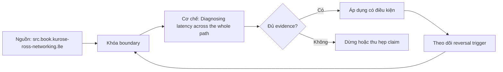

# Diagnosing latency across the whole path

**Tóm tắt bản chất:** Phân rã độ trễ của một yêu cầu thành sáu chặng và chỉ ra chặng chiếm phần lớn thời gian. Cơ chế chỉ có giá trị khi workload, version, state owner và failure boundary đã được khóa; một con số đẹp ngoài bốn điều kiện đó không đủ để ra quyết định.

> [!abstract] Câu hỏi trung tâm
> Làm thế nào mô hình, đo và ra quyết định đúng về Diagnosing latency across the whole path?

## Nỗi Đau & Động Lực

Báo độ trễ trung bình · chỉ đo ở một phía · kết luận mạng chậm mà chưa bắt gói · bỏ qua chặng phân giải tên. Đây không phải danh sách lỗi cú pháp. Mỗi lỗi làm người vận hành chọn nhầm owner hoặc chữa symptom ở layer sau, khiến thời gian phục hồi tăng dù command vừa chạy trả về thành công.

Năng lực cần giữ sau bài là: Phân rã độ trễ của một yêu cầu thành sáu chặng và chỉ ra chặng chiếm phần lớn thời gian. Nếu learner chỉ nhắc lại định nghĩa nhưng không phân biệt được hai state gần nhau trên số đo, bài chưa đạt.

## Cơ Chế Tác Động

Bài tổng hợp phần chẩn đoán. Một yêu cầu chậm có thể chậm ở sáu chặng và mỗi chặng có cách đo riêng: phân giải tên, mở kết nối, bắt tay mã hoá, gửi yêu cầu, chờ máy chủ xử lý, và nhận phản hồi. Công cụ dòng lệnh tách được thời gian theo từng chặng, và đây là bước đầu tiên nên làm thay vì đoán. Nguyên tắc: **đo phân vị cao chứ trung bình**, vì độ trễ hầu như luôn có đuôi dài và người dùng cảm nhận đuôi đó. Ba nguyên nhân chậm có triệu chứng giống nhau và cách phân biệt: mạng mất gói gây truyền lại, máy chủ xử lý chậm, và hồ kết nối cạn ở phía máy khách. Đo từ nhiều phía: chỉ đo ở máy khách thì không biết phần nào là mạng và phần nào là máy chủ, nên phải đối chiếu với nhật ký phía máy chủ qua mã theo dõi ở lesson 20.

Tách ba lớp khi đọc cơ chế `wiki.de-foundation.diagnosing-latency-across-the-whole-path`: declared state là điều cấu hình hoặc API yêu cầu; executed state là việc runtime thực sự làm; consumer-visible state là điều client hay operator quan sát. Ba lớp có thể lệch nhau vì cache, buffering, retry, scheduling, queue hoặc failure giữa hai transition. Evidence phải chỉ ra lớp nào đang được đo.

## Bản Đồ Quyết Định

| Bước | Câu hỏi phải khóa | Điều kiện đạt |
|---|---|---|
| Layer | Xác định hop và protocol state | Không gọi mọi lỗi là network |
| Budget | Chia deadline và capacity theo hop | Không reset budget sau retry |
| Identity | Khóa connection, request và operation identity | Không gộp duplicate với retry |
| Evidence | Ghép client, DNS, transport, TLS, HTTP và server timeline | Clock và correlation được công bố |

Quy tắc mặc định là chọn phép giải thích đơn giản nhất qua được hard constraints, rồi viết trước reversal trigger. Với `Diagnosing latency across the whole path`, absence of error không phải pass; pass cần observation đúng grain, một oracle độc lập và changed-constraint case đủ làm model có cơ hội thất bại.

## Case Study Thực Chiến: Diagnosing latency across the whole path

Giảng viên tạo ba tình huống chậm ở ba chặng khác nhau. Với mỗi cái, đo tách theo chặng, báo phân vị 95, và chỉ ra chặng nút thắt. Đối chiếu số đo phía máy khách với nhật ký phía máy chủ qua mã theo dõi để tách phần mạng khỏi phần xử lý.

Trong case `wiki.de-foundation.diagnosing-latency-across-the-whole-path`, learner ghi expected transition, input snapshot, version và giới hạn an toàn trước khi chạy. Sau execution, họ giữ raw counter, timestamp, exit status, state trước–sau và giải thích delta bằng mechanism ở trên. Đánh giá không cho phép sửa expected result sau khi nhìn output mà không ghi change record.

Biến thể khó hơn đổi một constraint có khả năng đảo kết luận: workload shape, memory pressure, connection reuse, retry budget, permission hoặc dependency direction. Tầng *phân tích*. Objective là phân rã một số đo tổng thành thành phần, kỹ năng dùng lại ở M26. Kiểm bằng ba tình huống chậm; đạt khi chỉ đúng chặng nút thắt ở ít nhất hai và dẫn được số đo của chặng đó.

## Góc Khuất & Ngộ Nhận

**Hiểu lầm:** Báo độ trễ trung bình. **Thực tế:** tín hiệu chỉ chứng minh điều nó đo trong đúng scope; state ở layer khác vẫn có thể trái ngược. **Vì sao nghe hợp lý:** happy path nhỏ thường không chạm queue, cache, partial progress hoặc restart.

**Hiểu lầm:** chỉ đo ở một phía. **Thực tế:** tool và API cung cấp primitive, không tự cấp ownership, deadline, idempotency hay recovery policy. **Vì sao nghe hợp lý:** syntax gọn che mất protocol và lifecycle phía dưới.

Với `wiki.de-foundation.diagnosing-latency-across-the-whole-path`, một edge case đáng giữ là observation đúng nhưng diagnosis sai: counter tăng thật, song nguyên nhân điều khiển nằm ở layer trước. Muốn tránh, timeline phải nối trigger tới consumer harm và ghi rõ negative control nào đã loại giả thuyết cạnh tranh.

## Nếu Bạn Dạy Lại Điều Này...

Mở bài bằng một dự đoán dễ sai về `Diagnosing latency across the whole path`, không mở bằng định nghĩa. Cho hai trace gần giống nhau nhưng khác đúng một state boundary; learner phải chọn probe tiếp theo trước khi được xem đáp án.

Bài tập seed dùng chính lab của DE-L086, sau đó đổi constraint đủ mạnh để buộc giữ hoặc đảo quyết định. Người dạy chấm reasoning chain và evidence, không chấm việc learner đoán đúng tên công cụ.

## Ma trận kiểm chứng từng mệnh đề

Protocol riêng của `Diagnosing latency across the whole path` dùng điều kiện hoàn thành sau: Chỉ đúng chặng nút thắt ở ≥ 2/3 tình huống kèm số đo, và tách được phần mạng khỏi phần xử lý bằng đối chiếu hai phía. Mỗi probe phải có prediction, failure signal và independent oracle.

### Probe 1: state transition và invariant

**Mệnh đề P1 cần kiểm.** Bài tổng hợp phần chẩn đoán.

**Thiết kế phép thử cho `wiki.de-foundation.diagnosing-latency-across-the-whole-path`.** Với `wiki.de-foundation.diagnosing-latency-across-the-whole-path`, tạo positive và negative control chỉ khác một điều kiện; khóa workload, version, identity, permission, clock và state ban đầu. Expected result được viết trước execution để tiêu chí không trôi theo output.

**Bằng chứng P1 cần giữ.** Với `wiki.de-foundation.diagnosing-latency-across-the-whole-path`, lưu command hoặc harness, raw observation, transition trước–sau, coverage và limitation. Kết luận chỉ đạt khi oracle độc lập khớp đúng grain; nếu chưa chạy thì đây vẫn là protocol, không phải observation.

### Probe 2: identity, ownership và boundary

**Mệnh đề P2 cần kiểm.** Phân rã độ trễ của một yêu cầu thành sáu chặng và chỉ ra chặng chiếm phần lớn thời gian.

**Thiết kế phép thử cho `wiki.de-foundation.diagnosing-latency-across-the-whole-path`.** Với `wiki.de-foundation.diagnosing-latency-across-the-whole-path`, tạo boundary case ngay trước và sau ngưỡng; khóa workload, version, identity, permission, clock và state ban đầu. Expected result được viết trước execution để tiêu chí không trôi theo output.

**Bằng chứng P2 cần giữ.** Với `wiki.de-foundation.diagnosing-latency-across-the-whole-path`, lưu command hoặc harness, raw observation, transition trước–sau, coverage và limitation. Kết luận chỉ đạt khi oracle độc lập khớp đúng grain; nếu chưa chạy thì đây vẫn là protocol, không phải observation.

### Probe 3: failure path và recovery

**Mệnh đề P3 cần kiểm.** Tầng *phân tích*.

**Thiết kế phép thử cho `wiki.de-foundation.diagnosing-latency-across-the-whole-path`.** Với `wiki.de-foundation.diagnosing-latency-across-the-whole-path`, tạo replay cùng identity nhưng đổi state; khóa workload, version, identity, permission, clock và state ban đầu. Expected result được viết trước execution để tiêu chí không trôi theo output.

**Bằng chứng P3 cần giữ.** Với `wiki.de-foundation.diagnosing-latency-across-the-whole-path`, lưu command hoặc harness, raw observation, transition trước–sau, coverage và limitation. Kết luận chỉ đạt khi oracle độc lập khớp đúng grain; nếu chưa chạy thì đây vẫn là protocol, không phải observation.

### Probe 4: decision trade-off và reversal trigger

**Mệnh đề P4 cần kiểm.** Giảng viên tạo ba tình huống chậm ở ba chặng khác nhau.

**Thiết kế phép thử cho `wiki.de-foundation.diagnosing-latency-across-the-whole-path`.** Với `wiki.de-foundation.diagnosing-latency-across-the-whole-path`, tạo failure inject trước và sau transition bền vững; khóa workload, version, identity, permission, clock và state ban đầu. Expected result được viết trước execution để tiêu chí không trôi theo output.

**Bằng chứng P4 cần giữ.** Với `wiki.de-foundation.diagnosing-latency-across-the-whole-path`, lưu command hoặc harness, raw observation, transition trước–sau, coverage và limitation. Kết luận chỉ đạt khi oracle độc lập khớp đúng grain; nếu chưa chạy thì đây vẫn là protocol, không phải observation.

### Probe 5: evidence package và oracle

**Mệnh đề P5 cần kiểm.** Báo độ trễ trung bình · chỉ đo ở một phía · kết luận mạng chậm mà chưa bắt gói · bỏ qua chặng phân giải tên.

**Thiết kế phép thử cho `wiki.de-foundation.diagnosing-latency-across-the-whole-path`.** Với `wiki.de-foundation.diagnosing-latency-across-the-whole-path`, tạo changed scale làm cost model đổi; khóa workload, version, identity, permission, clock và state ban đầu. Expected result được viết trước execution để tiêu chí không trôi theo output.

**Bằng chứng P5 cần giữ.** Với `wiki.de-foundation.diagnosing-latency-across-the-whole-path`, lưu command hoặc harness, raw observation, transition trước–sau, coverage và limitation. Kết luận chỉ đạt khi oracle độc lập khớp đúng grain; nếu chưa chạy thì đây vẫn là protocol, không phải observation.

### Probe 6: changed-constraint transfer

**Mệnh đề P6 cần kiểm.** Chỉ đúng chặng nút thắt ở ≥ 2/3 tình huống kèm số đo, và tách được phần mạng khỏi phần xử lý bằng đối chiếu hai phía.

**Thiết kế phép thử cho `wiki.de-foundation.diagnosing-latency-across-the-whole-path`.** Với `wiki.de-foundation.diagnosing-latency-across-the-whole-path`, tạo adversarial order, skew hoặc packet timing; khóa workload, version, identity, permission, clock và state ban đầu. Expected result được viết trước execution để tiêu chí không trôi theo output.

**Bằng chứng P6 cần giữ.** Với `wiki.de-foundation.diagnosing-latency-across-the-whole-path`, lưu command hoặc harness, raw observation, transition trước–sau, coverage và limitation. Kết luận chỉ đạt khi oracle độc lập khớp đúng grain; nếu chưa chạy thì đây vẫn là protocol, không phải observation.

### Probe 7: state transition và invariant

**Mệnh đề P7 cần kiểm.** Bài tổng hợp phần chẩn đoán.

**Thiết kế phép thử cho `wiki.de-foundation.diagnosing-latency-across-the-whole-path`.** Với `wiki.de-foundation.diagnosing-latency-across-the-whole-path`, tạo fresh environment không cache; khóa workload, version, identity, permission, clock và state ban đầu. Expected result được viết trước execution để tiêu chí không trôi theo output.

**Bằng chứng P7 cần giữ.** Với `wiki.de-foundation.diagnosing-latency-across-the-whole-path`, lưu command hoặc harness, raw observation, transition trước–sau, coverage và limitation. Kết luận chỉ đạt khi oracle độc lập khớp đúng grain; nếu chưa chạy thì đây vẫn là protocol, không phải observation.

### Probe 8: identity, ownership và boundary

**Mệnh đề P8 cần kiểm.** Phân rã độ trễ của một yêu cầu thành sáu chặng và chỉ ra chặng chiếm phần lớn thời gian.

**Thiết kế phép thử cho `wiki.de-foundation.diagnosing-latency-across-the-whole-path`.** Với `wiki.de-foundation.diagnosing-latency-across-the-whole-path`, tạo independent oracle không dùng chung implementation; khóa workload, version, identity, permission, clock và state ban đầu. Expected result được viết trước execution để tiêu chí không trôi theo output.

**Bằng chứng P8 cần giữ.** Với `wiki.de-foundation.diagnosing-latency-across-the-whole-path`, lưu command hoặc harness, raw observation, transition trước–sau, coverage và limitation. Kết luận chỉ đạt khi oracle độc lập khớp đúng grain; nếu chưa chạy thì đây vẫn là protocol, không phải observation.

### Probe 9: failure path và recovery

**Mệnh đề P9 cần kiểm.** Tầng *phân tích*.

**Thiết kế phép thử cho `wiki.de-foundation.diagnosing-latency-across-the-whole-path`.** Với `wiki.de-foundation.diagnosing-latency-across-the-whole-path`, tạo partial progress rồi restart; khóa workload, version, identity, permission, clock và state ban đầu. Expected result được viết trước execution để tiêu chí không trôi theo output.

**Bằng chứng P9 cần giữ.** Với `wiki.de-foundation.diagnosing-latency-across-the-whole-path`, lưu command hoặc harness, raw observation, transition trước–sau, coverage và limitation. Kết luận chỉ đạt khi oracle độc lập khớp đúng grain; nếu chưa chạy thì đây vẫn là protocol, không phải observation.

### Probe 10: decision trade-off và reversal trigger

**Mệnh đề P10 cần kiểm.** Giảng viên tạo ba tình huống chậm ở ba chặng khác nhau.

**Thiết kế phép thử cho `wiki.de-foundation.diagnosing-latency-across-the-whole-path`.** Với `wiki.de-foundation.diagnosing-latency-across-the-whole-path`, tạo missing evidence phải abstain; khóa workload, version, identity, permission, clock và state ban đầu. Expected result được viết trước execution để tiêu chí không trôi theo output.

**Bằng chứng P10 cần giữ.** Với `wiki.de-foundation.diagnosing-latency-across-the-whole-path`, lưu command hoặc harness, raw observation, transition trước–sau, coverage và limitation. Kết luận chỉ đạt khi oracle độc lập khớp đúng grain; nếu chưa chạy thì đây vẫn là protocol, không phải observation.

### Probe 11: evidence package và oracle

**Mệnh đề P11 cần kiểm.** Báo độ trễ trung bình · chỉ đo ở một phía · kết luận mạng chậm mà chưa bắt gói · bỏ qua chặng phân giải tên.

**Thiết kế phép thử cho `wiki.de-foundation.diagnosing-latency-across-the-whole-path`.** Với `wiki.de-foundation.diagnosing-latency-across-the-whole-path`, tạo reviewer tái hiện từ evidence package; khóa workload, version, identity, permission, clock và state ban đầu. Expected result được viết trước execution để tiêu chí không trôi theo output.

**Bằng chứng P11 cần giữ.** Với `wiki.de-foundation.diagnosing-latency-across-the-whole-path`, lưu command hoặc harness, raw observation, transition trước–sau, coverage và limitation. Kết luận chỉ đạt khi oracle độc lập khớp đúng grain; nếu chưa chạy thì đây vẫn là protocol, không phải observation.

### Probe 12: changed-constraint transfer

**Mệnh đề P12 cần kiểm.** Chỉ đúng chặng nút thắt ở ≥ 2/3 tình huống kèm số đo, và tách được phần mạng khỏi phần xử lý bằng đối chiếu hai phía.

**Thiết kế phép thử cho `wiki.de-foundation.diagnosing-latency-across-the-whole-path`.** Với `wiki.de-foundation.diagnosing-latency-across-the-whole-path`, tạo constraint đổi đủ để quyết định đảo; khóa workload, version, identity, permission, clock và state ban đầu. Expected result được viết trước execution để tiêu chí không trôi theo output.

**Bằng chứng P12 cần giữ.** Với `wiki.de-foundation.diagnosing-latency-across-the-whole-path`, lưu command hoặc harness, raw observation, transition trước–sau, coverage và limitation. Kết luận chỉ đạt khi oracle độc lập khớp đúng grain; nếu chưa chạy thì đây vẫn là protocol, không phải observation.

## Tự Kiểm Tra Nhanh

1. Boundary đầu tiên khiến mô hình `Diagnosing latency across the whole path` không còn đúng là gì?

<details><summary>Đáp án</summary>Báo độ trễ trung bình · chỉ đo ở một phía · kết luận mạng chậm mà chưa bắt gói · bỏ qua chặng phân giải tên.</details>

2. Evidence nào phân biệt được hai state dễ nhầm?

<details><summary>Đáp án</summary>Tầng *phân tích*. Objective là phân rã một số đo tổng thành thành phần, kỹ năng dùng lại ở M26. Kiểm bằng ba tình huống chậm; đạt khi chỉ đúng chặng nút thắt ở ít nhất hai và dẫn được số đo của chặng đó.</details>

3. Khi constraint đổi, điều gì quyết định giữ hay đảo lựa chọn?

<details><summary>Đáp án</summary>Chỉ đúng chặng nút thắt ở ≥ 2/3 tình huống kèm số đo, và tách được phần mạng khỏi phần xử lý bằng đối chiếu hai phía.</details>

## Giới hạn và điều chưa cho phép kết luận

- Lab của `Diagnosing latency across the whole path` chưa được tuyên bố đã chạy trên production; note mô tả curriculum và expected evidence.
- Hành vi phụ thuộc kernel, distribution, library, network path hoặc hardware phải được kiểm lại trên target đã ghi version.
- Concept key `ck.de.diagnosing-latency-across-the-whole-path` đã được owner phê duyệt `canonical`; note thuộc canonical registry coverage. Trạng thái này không tự chứng minh learner mastery.
- Một trace đơn lẻ không chứng minh capacity, reliability hoặc security cho population khác.
- Note giữ trạng thái `review` cho tới khi owner duyệt semantics và learner artifact.

## Reference
1. [[SRC-KUROSE-ROSS-NETWORKING-8E]]
2. [[SRC-GOOGLE-SRE-MONITORING]]

## Source coverage

| Source slice | Locator | Kiến thức phải giữ | Vị trí | Trạng thái | Ngoài phạm vi |
|---|---|---|---|---|---|
| [[SRC-KUROSE-ROSS-NETWORKING-8E]] — `src.book.kurose-ross-networking.8e` | §§1.4, 2.2, 2.4, 2.7, 3.5–3.7, 4.5, 6.6.1 và Chapter 8; PDF 67–682 | mechanism và boundary liên quan trực tiếp tới `Diagnosing latency across the whole path` | cơ chế, quyết định, case và probe | Đã phủ | phần ngoài objective DE-L086 |
| [[SRC-GOOGLE-SRE-MONITORING]] — `src.web.google-sre-monitoring` | Monitoring distributed systems; accessed 2026-10-01 | mechanism và boundary liên quan trực tiếp tới `Diagnosing latency across the whole path` | cơ chế, quyết định, case và probe | Đã phủ | phần ngoài objective DE-L086 |

## Key takeaways
- Phân rã độ trễ của một yêu cầu thành sáu chặng và chỉ ra chặng chiếm phần lớn thời gian.
- Chỉ đúng chặng nút thắt ở ≥ 2/3 tình huống kèm số đo, và tách được phần mạng khỏi phần xử lý bằng đối chiếu hai phía.
- `Diagnosing latency across the whole path` chỉ có nghĩa trong scope, state, identity và version đã ghi.
- Trước khi lab chạy, đây là note có provenance và protocol, chưa phải production evidence hay bằng chứng mastery.

<!-- ATOMIC-EXECUTION-CAPSULE:START -->

## Execution capsule — kiểm chứng `wiki.de-foundation.diagnosing-latency-across-the-whole-path`

> [!important] Phân loại mệnh đề
> Với `wiki.de-foundation.diagnosing-latency-across-the-whole-path`, sơ đồ, ví dụ và artifact về **Diagnosing latency across the whole path** là **synthesis để kiểm chứng**; chúng không phải trích dẫn hay case nguyên văn của nguồn.

### Sơ đồ cơ chế và điểm kiểm soát



Đọc sơ đồ `wiki.de-foundation.diagnosing-latency-across-the-whole-path` từ trái sang phải: source chỉ cung cấp claim ban đầu cho **Diagnosing latency across the whole path**; quyết định chỉ được đi tiếp sau khi boundary, evidence và điều kiện đảo quyết định đã hiện hữu.

### Artifact thực thi tối thiểu

```yaml
concept_id: "wiki.de-foundation.diagnosing-latency-across-the-whole-path"
concept: "Diagnosing latency across the whole path"
primary_question: "Làm thế nào mô hình, đo và ra quyết định đúng về Diagnosing latency across the whole path?"
decision_contract:
  input_boundary: "Ghi population, thời điểm, owner và điều chưa biết"
  hard_constraints:
    - "Không vượt quyền hoặc privacy boundary"
    - "Không dùng cùng một assumption làm cả implementation và oracle"
  accept_when: "Có observation phân biệt được các lựa chọn"
  reversal_trigger: "Một hard constraint sai hoặc evidence mới đổi recommendation"
evidence_to_keep:
  - "input snapshot"
  - "chosen and rejected options"
  - "independent review result"
```

Artifact của `wiki.de-foundation.diagnosing-latency-across-the-whole-path` buộc người dùng ghi boundary, oracle và reversal trigger cho **Diagnosing latency across the whole path**. Các giá trị minh họa phải được thay bằng evidence thật trước khi dùng cho quyết định.

<!-- ATOMIC-EXECUTION-CAPSULE:END -->
