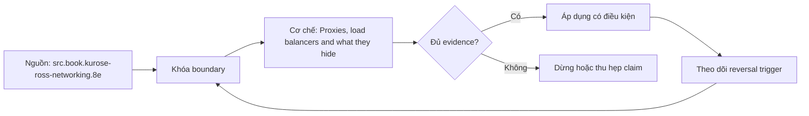

# Proxies, load balancers and what they hide

**Tóm tắt bản chất:** Chỉ ra trong một kiến trúc có lớp trung gian chỗ nào có thể cắt kết nối trước ứng dụng, và nêu cách xác minh. Cơ chế chỉ có giá trị khi workload, version, state owner và failure boundary đã được khóa; một con số đẹp ngoài bốn điều kiện đó không đủ để ra quyết định.

> [!abstract] Câu hỏi trung tâm
> Làm thế nào mô hình, đo và ra quyết định đúng về Proxies, load balancers and what they hide?

## Problem Definition and Operational Relevance

Nghĩ lỗi đến từ ứng dụng trong khi proxy cắt trước · dùng kiểm tra sức khoẻ chỉ kiểm tiến trình · bật phiên dính mà không cần · quên rằng lớp trung gian che địa chỉ máy khách thật. Đây không phải danh sách lỗi cú pháp. Mỗi lỗi làm người vận hành chọn nhầm owner hoặc chữa symptom ở layer sau, khiến thời gian phục hồi tăng dù command vừa chạy trả về thành công.

Năng lực cần giữ sau bài là: Chỉ ra trong một kiến trúc có lớp trung gian chỗ nào có thể cắt kết nối trước ứng dụng, và nêu cách xác minh. Nếu learner chỉ nhắc lại định nghĩa nhưng không phân biệt được hai state gần nhau trên số đo, bài chưa đạt.

## Mechanism

Giữa máy khách và máy chủ hiếm khi chỉ có một chặng, và mỗi thứ đứng giữa đều thêm trạng thái cùng hạn chờ riêng. Phân biệt proxy chuyển tiếp với proxy đảo: một cái đại diện cho máy khách, một cái đại diện cho máy chủ. Cân bằng tải ở tầng bốn và tầng bảy: tầng bốn chỉ nhìn địa chỉ và cổng nên nhanh và không hiểu giao thức; tầng bảy đọc được nội dung nên định tuyến theo đường dẫn được nhưng tốn hơn. Kiểm tra sức khoẻ và khác biệt giữa kiểm tiến trình còn sống với kiểm dịch vụ còn phục vụ được, một khác biệt sẽ gặp lại ở M25. Phiên dính và vì sao nó làm việc mở rộng khó. Ba thứ lớp trung gian che mất và gây chẩn đoán sai: địa chỉ thật của máy khách, lỗi thật của máy chủ gốc, và hạn chờ của chính nó thường ngắn hơn hạn chờ của ứng dụng nên cắt kết nối trước. Mạng phân phối nội dung ở mức nhận biết.

Tách ba lớp khi đọc cơ chế `wiki.de-foundation.proxies-load-balancers-and-what-they-hide`: declared state là điều cấu hình hoặc API yêu cầu; executed state là việc runtime thực sự làm; consumer-visible state là điều client hay operator quan sát. Ba lớp có thể lệch nhau vì cache, buffering, retry, scheduling, queue hoặc failure giữa hai transition. Evidence phải chỉ ra lớp nào đang được đo.

## Decision Framework

| Bước | Câu hỏi phải khóa | Điều kiện đạt |
|---|---|---|
| Layer | Xác định hop và protocol state | Không gọi mọi lỗi là network |
| Budget | Chia deadline và capacity theo hop | Không reset budget sau retry |
| Identity | Khóa connection, request và operation identity | Không gộp duplicate với retry |
| Evidence | Ghép client, DNS, transport, TLS, HTTP và server timeline | Clock và correlation được công bố |

Quy tắc mặc định là chọn phép giải thích đơn giản nhất qua được hard constraints, rồi viết trước reversal trigger. Với `Proxies, load balancers and what they hide`, absence of error không phải pass; pass cần observation đúng grain, một oracle độc lập và changed-constraint case đủ làm model có cơ hội thất bại.

## Worked Case: Proxies, load balancers and what they hide

Dựng một proxy đảo đứng trước hai bản sao dịch vụ. Đặt hạn chờ của proxy ngắn hơn thời gian xử lý của dịch vụ và quan sát máy khách nhận lỗi gì. Tắt một bản sao và quan sát kiểm tra sức khoẻ loại nó ra. Thử kiểm tra sức khoẻ chỉ kiểm tiến trình còn sống trong khi dịch vụ đã mất kết nối cơ sở dữ liệu.

Trong case `wiki.de-foundation.proxies-load-balancers-and-what-they-hide`, learner ghi expected transition, input snapshot, version và giới hạn an toàn trước khi chạy. Sau execution, họ giữ raw counter, timestamp, exit status, state trước-sau và giải thích delta bằng mechanism ở trên. Đánh giá không cho phép sửa expected result sau khi nhìn output mà không ghi change record.

Biến thể khó hơn đổi một constraint có khả năng đảo kết luận: workload shape, memory pressure, connection reuse, retry budget, permission hoặc dependency direction. Tầng *hiểu*. Objective là nhận ra nguồn gây nhầm lẫn khi chẩn đoán qua nhiều chặng. Kiểm bằng ba kiến trúc; đạt khi chỉ đúng ít nhất hai chặng có hạn chờ riêng và nêu đúng cách xác minh.

## Limits and Common Errors

**Hiểu lầm:** Nghĩ lỗi đến từ ứng dụng trong khi proxy cắt trước. **Thực tế:** tín hiệu chỉ chứng minh điều nó đo trong đúng scope; state ở layer khác vẫn có thể trái ngược. **Vì sao nghe hợp lý:** happy path nhỏ thường không chạm queue, cache, partial progress hoặc restart.

**Hiểu lầm:** dùng kiểm tra sức khoẻ chỉ kiểm tiến trình. **Thực tế:** tool và API cung cấp primitive, không tự cấp ownership, deadline, idempotency hay recovery policy. **Vì sao nghe hợp lý:** syntax gọn che mất protocol và lifecycle phía dưới.

Với `wiki.de-foundation.proxies-load-balancers-and-what-they-hide`, một edge case đáng giữ là observation đúng nhưng diagnosis sai: counter tăng thật, song nguyên nhân điều khiển nằm ở layer trước. Muốn tránh, timeline phải nối trigger tới consumer harm và ghi rõ negative control nào đã loại giả thuyết cạnh tranh.

## Nếu Bạn Dạy Lại Điều Này...

Mở bài bằng một dự đoán dễ sai về `Proxies, load balancers and what they hide`, không mở bằng định nghĩa. Cho hai trace gần giống nhau nhưng khác đúng một state boundary; learner phải chọn probe tiếp theo trước khi được xem đáp án.

Bài tập seed dùng chính lab của DE-L082, sau đó đổi constraint đủ mạnh để buộc giữ hoặc đảo quyết định. Người dạy chấm reasoning chain và evidence, không chấm việc learner đoán đúng tên công cụ.

## Ma trận kiểm chứng từng mệnh đề

Protocol riêng của `Proxies, load balancers and what they hide` dùng điều kiện hoàn thành sau: Chỉ đúng ≥ 2/3 chặng có hạn chờ riêng, và chứng minh được kiểm tra sức khoẻ sai loại không phát hiện dịch vụ đã hỏng. Mỗi probe phải có prediction, failure signal và independent oracle.

### Probe 1: state transition và invariant

**Mệnh đề P1 cần kiểm.** Giữa máy khách và máy chủ hiếm khi chỉ có một chặng, và mỗi thứ đứng giữa đều thêm trạng thái cùng hạn chờ riêng.

**Thiết kế phép thử cho `wiki.de-foundation.proxies-load-balancers-and-what-they-hide`.** Với `wiki.de-foundation.proxies-load-balancers-and-what-they-hide`, tạo positive và negative control chỉ khác một điều kiện; khóa workload, version, identity, permission, clock và state ban đầu. Expected result được viết trước execution để tiêu chí không trôi theo output.

**Bằng chứng P1 cần giữ.** Với `wiki.de-foundation.proxies-load-balancers-and-what-they-hide`, lưu command hoặc harness, raw observation, transition trước-sau, coverage và limitation. Kết luận chỉ đạt khi oracle độc lập khớp đúng grain; nếu chưa chạy thì đây vẫn là protocol, không phải observation.

### Probe 2: identity, ownership và boundary

**Mệnh đề P2 cần kiểm.** Chỉ ra trong một kiến trúc có lớp trung gian chỗ nào có thể cắt kết nối trước ứng dụng, và nêu cách xác minh.

**Thiết kế phép thử cho `wiki.de-foundation.proxies-load-balancers-and-what-they-hide`.** Với `wiki.de-foundation.proxies-load-balancers-and-what-they-hide`, tạo boundary case ngay trước và sau ngưỡng; khóa workload, version, identity, permission, clock và state ban đầu. Expected result được viết trước execution để tiêu chí không trôi theo output.

**Bằng chứng P2 cần giữ.** Với `wiki.de-foundation.proxies-load-balancers-and-what-they-hide`, lưu command hoặc harness, raw observation, transition trước-sau, coverage và limitation. Kết luận chỉ đạt khi oracle độc lập khớp đúng grain; nếu chưa chạy thì đây vẫn là protocol, không phải observation.

### Probe 3: failure path và recovery

**Mệnh đề P3 cần kiểm.** Tầng *hiểu*.

**Thiết kế phép thử cho `wiki.de-foundation.proxies-load-balancers-and-what-they-hide`.** Với `wiki.de-foundation.proxies-load-balancers-and-what-they-hide`, tạo replay cùng identity nhưng đổi state; khóa workload, version, identity, permission, clock và state ban đầu. Expected result được viết trước execution để tiêu chí không trôi theo output.

**Bằng chứng P3 cần giữ.** Với `wiki.de-foundation.proxies-load-balancers-and-what-they-hide`, lưu command hoặc harness, raw observation, transition trước-sau, coverage và limitation. Kết luận chỉ đạt khi oracle độc lập khớp đúng grain; nếu chưa chạy thì đây vẫn là protocol, không phải observation.

### Probe 4: decision trade-off và reversal trigger

**Mệnh đề P4 cần kiểm.** Dựng một proxy đảo đứng trước hai bản sao dịch vụ.

**Thiết kế phép thử cho `wiki.de-foundation.proxies-load-balancers-and-what-they-hide`.** Với `wiki.de-foundation.proxies-load-balancers-and-what-they-hide`, tạo failure inject trước và sau transition bền vững; khóa workload, version, identity, permission, clock và state ban đầu. Expected result được viết trước execution để tiêu chí không trôi theo output.

**Bằng chứng P4 cần giữ.** Với `wiki.de-foundation.proxies-load-balancers-and-what-they-hide`, lưu command hoặc harness, raw observation, transition trước-sau, coverage và limitation. Kết luận chỉ đạt khi oracle độc lập khớp đúng grain; nếu chưa chạy thì đây vẫn là protocol, không phải observation.

### Probe 5: evidence package và oracle

**Mệnh đề P5 cần kiểm.** Nghĩ lỗi đến từ ứng dụng trong khi proxy cắt trước · dùng kiểm tra sức khoẻ chỉ kiểm tiến trình · bật phiên dính mà không cần · quên rằng lớp trung gian che địa chỉ máy khách thật.

**Thiết kế phép thử cho `wiki.de-foundation.proxies-load-balancers-and-what-they-hide`.** Với `wiki.de-foundation.proxies-load-balancers-and-what-they-hide`, tạo changed scale làm cost model đổi; khóa workload, version, identity, permission, clock và state ban đầu. Expected result được viết trước execution để tiêu chí không trôi theo output.

**Bằng chứng P5 cần giữ.** Với `wiki.de-foundation.proxies-load-balancers-and-what-they-hide`, lưu command hoặc harness, raw observation, transition trước-sau, coverage và limitation. Kết luận chỉ đạt khi oracle độc lập khớp đúng grain; nếu chưa chạy thì đây vẫn là protocol, không phải observation.

### Probe 6: changed-constraint transfer

**Mệnh đề P6 cần kiểm.** Chỉ đúng ≥ 2/3 chặng có hạn chờ riêng, và chứng minh được kiểm tra sức khoẻ sai loại không phát hiện dịch vụ đã hỏng.

**Thiết kế phép thử cho `wiki.de-foundation.proxies-load-balancers-and-what-they-hide`.** Với `wiki.de-foundation.proxies-load-balancers-and-what-they-hide`, tạo adversarial order, skew hoặc packet timing; khóa workload, version, identity, permission, clock và state ban đầu. Expected result được viết trước execution để tiêu chí không trôi theo output.

**Bằng chứng P6 cần giữ.** Với `wiki.de-foundation.proxies-load-balancers-and-what-they-hide`, lưu command hoặc harness, raw observation, transition trước-sau, coverage và limitation. Kết luận chỉ đạt khi oracle độc lập khớp đúng grain; nếu chưa chạy thì đây vẫn là protocol, không phải observation.

### Probe 7: state transition và invariant

**Mệnh đề P7 cần kiểm.** Giữa máy khách và máy chủ hiếm khi chỉ có một chặng, và mỗi thứ đứng giữa đều thêm trạng thái cùng hạn chờ riêng.

**Thiết kế phép thử cho `wiki.de-foundation.proxies-load-balancers-and-what-they-hide`.** Với `wiki.de-foundation.proxies-load-balancers-and-what-they-hide`, tạo fresh environment không cache; khóa workload, version, identity, permission, clock và state ban đầu. Expected result được viết trước execution để tiêu chí không trôi theo output.

**Bằng chứng P7 cần giữ.** Với `wiki.de-foundation.proxies-load-balancers-and-what-they-hide`, lưu command hoặc harness, raw observation, transition trước-sau, coverage và limitation. Kết luận chỉ đạt khi oracle độc lập khớp đúng grain; nếu chưa chạy thì đây vẫn là protocol, không phải observation.

### Probe 8: identity, ownership và boundary

**Mệnh đề P8 cần kiểm.** Chỉ ra trong một kiến trúc có lớp trung gian chỗ nào có thể cắt kết nối trước ứng dụng, và nêu cách xác minh.

**Thiết kế phép thử cho `wiki.de-foundation.proxies-load-balancers-and-what-they-hide`.** Với `wiki.de-foundation.proxies-load-balancers-and-what-they-hide`, tạo independent oracle không dùng chung implementation; khóa workload, version, identity, permission, clock và state ban đầu. Expected result được viết trước execution để tiêu chí không trôi theo output.

**Bằng chứng P8 cần giữ.** Với `wiki.de-foundation.proxies-load-balancers-and-what-they-hide`, lưu command hoặc harness, raw observation, transition trước-sau, coverage và limitation. Kết luận chỉ đạt khi oracle độc lập khớp đúng grain; nếu chưa chạy thì đây vẫn là protocol, không phải observation.

### Probe 9: failure path và recovery

**Mệnh đề P9 cần kiểm.** Tầng *hiểu*.

**Thiết kế phép thử cho `wiki.de-foundation.proxies-load-balancers-and-what-they-hide`.** Với `wiki.de-foundation.proxies-load-balancers-and-what-they-hide`, tạo partial progress rồi restart; khóa workload, version, identity, permission, clock và state ban đầu. Expected result được viết trước execution để tiêu chí không trôi theo output.

**Bằng chứng P9 cần giữ.** Với `wiki.de-foundation.proxies-load-balancers-and-what-they-hide`, lưu command hoặc harness, raw observation, transition trước-sau, coverage và limitation. Kết luận chỉ đạt khi oracle độc lập khớp đúng grain; nếu chưa chạy thì đây vẫn là protocol, không phải observation.

### Probe 10: decision trade-off và reversal trigger

**Mệnh đề P10 cần kiểm.** Dựng một proxy đảo đứng trước hai bản sao dịch vụ.

**Thiết kế phép thử cho `wiki.de-foundation.proxies-load-balancers-and-what-they-hide`.** Với `wiki.de-foundation.proxies-load-balancers-and-what-they-hide`, tạo missing evidence phải abstain; khóa workload, version, identity, permission, clock và state ban đầu. Expected result được viết trước execution để tiêu chí không trôi theo output.

**Bằng chứng P10 cần giữ.** Với `wiki.de-foundation.proxies-load-balancers-and-what-they-hide`, lưu command hoặc harness, raw observation, transition trước-sau, coverage và limitation. Kết luận chỉ đạt khi oracle độc lập khớp đúng grain; nếu chưa chạy thì đây vẫn là protocol, không phải observation.

### Probe 11: evidence package và oracle

**Mệnh đề P11 cần kiểm.** Nghĩ lỗi đến từ ứng dụng trong khi proxy cắt trước · dùng kiểm tra sức khoẻ chỉ kiểm tiến trình · bật phiên dính mà không cần · quên rằng lớp trung gian che địa chỉ máy khách thật.

**Thiết kế phép thử cho `wiki.de-foundation.proxies-load-balancers-and-what-they-hide`.** Với `wiki.de-foundation.proxies-load-balancers-and-what-they-hide`, tạo reviewer tái hiện từ evidence package; khóa workload, version, identity, permission, clock và state ban đầu. Expected result được viết trước execution để tiêu chí không trôi theo output.

**Bằng chứng P11 cần giữ.** Với `wiki.de-foundation.proxies-load-balancers-and-what-they-hide`, lưu command hoặc harness, raw observation, transition trước-sau, coverage và limitation. Kết luận chỉ đạt khi oracle độc lập khớp đúng grain; nếu chưa chạy thì đây vẫn là protocol, không phải observation.

### Probe 12: changed-constraint transfer

**Mệnh đề P12 cần kiểm.** Chỉ đúng ≥ 2/3 chặng có hạn chờ riêng, và chứng minh được kiểm tra sức khoẻ sai loại không phát hiện dịch vụ đã hỏng.

**Thiết kế phép thử cho `wiki.de-foundation.proxies-load-balancers-and-what-they-hide`.** Với `wiki.de-foundation.proxies-load-balancers-and-what-they-hide`, tạo constraint đổi đủ để quyết định đảo; khóa workload, version, identity, permission, clock và state ban đầu. Expected result được viết trước execution để tiêu chí không trôi theo output.

**Bằng chứng P12 cần giữ.** Với `wiki.de-foundation.proxies-load-balancers-and-what-they-hide`, lưu command hoặc harness, raw observation, transition trước-sau, coverage và limitation. Kết luận chỉ đạt khi oracle độc lập khớp đúng grain; nếu chưa chạy thì đây vẫn là protocol, không phải observation.

## Tự Kiểm Tra Nhanh

1. Boundary đầu tiên khiến mô hình `Proxies, load balancers and what they hide` không còn đúng là gì?

<details><summary>Đáp án</summary>Nghĩ lỗi đến từ ứng dụng trong khi proxy cắt trước · dùng kiểm tra sức khoẻ chỉ kiểm tiến trình · bật phiên dính mà không cần · quên rằng lớp trung gian che địa chỉ máy khách thật.</details>

2. Evidence nào phân biệt được hai state dễ nhầm?

<details><summary>Đáp án</summary>Tầng *hiểu*. Objective là nhận ra nguồn gây nhầm lẫn khi chẩn đoán qua nhiều chặng. Kiểm bằng ba kiến trúc; đạt khi chỉ đúng ít nhất hai chặng có hạn chờ riêng và nêu đúng cách xác minh.</details>

3. Khi constraint đổi, điều gì quyết định giữ hay đảo lựa chọn?

<details><summary>Đáp án</summary>Chỉ đúng ≥ 2/3 chặng có hạn chờ riêng, và chứng minh được kiểm tra sức khoẻ sai loại không phát hiện dịch vụ đã hỏng.</details>

## Giới hạn và điều chưa cho phép kết luận

- Lab của `Proxies, load balancers and what they hide` chưa được tuyên bố đã chạy trên production; note mô tả curriculum và expected evidence.
- Hành vi phụ thuộc kernel, distribution, library, network path hoặc hardware phải được kiểm lại trên target đã ghi version.
- Concept key `ck.de.proxies-load-balancers-and-what-they-hide` đã được owner phê duyệt `canonical`; note thuộc canonical registry coverage. Trạng thái này không tự chứng minh learner mastery.
- Một trace đơn lẻ không chứng minh capacity, reliability hoặc security cho population khác.
- Note giữ trạng thái `review` cho tới khi owner duyệt semantics và learner artifact.

## Reference
1. [[SRC-KUROSE-ROSS-NETWORKING-8E]]

## Source coverage

| Source slice | Locator | Kiến thức phải giữ | Vị trí | Trạng thái | Ngoài phạm vi |
|---|---|---|---|---|---|
| [[SRC-KUROSE-ROSS-NETWORKING-8E]]: `src.book.kurose-ross-networking.8e` | §§1.4, 2.2, 2.4, 2.7, 3.5-3.7, 4.5, 6.6.1 và Chapter 8; PDF 67-682 | mechanism và boundary liên quan trực tiếp tới `Proxies, load balancers and what they hide` | cơ chế, quyết định, case và probe | Đã phủ | phần ngoài objective DE-L082 |

## Key takeaways
- Chỉ ra trong một kiến trúc có lớp trung gian chỗ nào có thể cắt kết nối trước ứng dụng, và nêu cách xác minh.
- Chỉ đúng ≥ 2/3 chặng có hạn chờ riêng, và chứng minh được kiểm tra sức khoẻ sai loại không phát hiện dịch vụ đã hỏng.
- `Proxies, load balancers and what they hide` chỉ có nghĩa trong scope, state, identity và version đã ghi.
- Trước khi lab chạy, đây là note có provenance và protocol, chưa phải production evidence hay bằng chứng mastery.

<!-- ATOMIC-EXECUTION-CAPSULE:START -->

## Execution capsule: kiểm chứng `wiki.de-foundation.proxies-load-balancers-and-what-they-hide`

> [!important] Phân loại mệnh đề
> Với `wiki.de-foundation.proxies-load-balancers-and-what-they-hide`, sơ đồ, ví dụ và artifact về **Proxies, load balancers and what they hide** là **synthesis để kiểm chứng**; chúng không phải trích dẫn hay case nguyên văn của nguồn.

### Sơ đồ cơ chế và điểm kiểm soát



Đọc sơ đồ `wiki.de-foundation.proxies-load-balancers-and-what-they-hide` từ trái sang phải: source chỉ cung cấp claim ban đầu cho **Proxies, load balancers and what they hide**; quyết định chỉ được đi tiếp sau khi boundary, evidence và điều kiện đảo quyết định đã hiện hữu.

### Artifact thực thi tối thiểu

```yaml
concept_id: "wiki.de-foundation.proxies-load-balancers-and-what-they-hide"
concept: "Proxies, load balancers and what they hide"
primary_question: "Làm thế nào mô hình, đo và ra quyết định đúng về Proxies, load balancers and what they hide?"
decision_contract:
  input_boundary: "Ghi population, thời điểm, owner và điều chưa biết"
  hard_constraints:
    - "Không vượt quyền hoặc privacy boundary"
    - "Không dùng cùng một assumption làm cả implementation và oracle"
  accept_when: "Có observation phân biệt được các lựa chọn"
  reversal_trigger: "Một hard constraint sai hoặc evidence mới đổi recommendation"
evidence_to_keep:
  - "input snapshot"
  - "chosen and rejected options"
  - "independent review result"
```

Artifact của `wiki.de-foundation.proxies-load-balancers-and-what-they-hide` buộc người dùng ghi boundary, oracle và reversal trigger cho **Proxies, load balancers and what they hide**. Các giá trị minh họa phải được thay bằng evidence thật trước khi dùng cho quyết định.

<!-- ATOMIC-EXECUTION-CAPSULE:END -->
