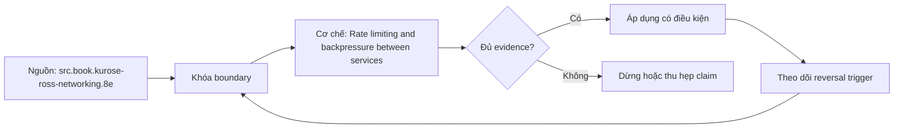

# Rate limiting and backpressure between services

**Tóm tắt bản chất:** Dựng giới hạn tốc độ và bộ ngắt mạch cho một tuyến, và chứng minh hệ suy giảm có kiểm soát khi quá tải. Cơ chế chỉ có giá trị khi workload, version, state owner và failure boundary đã được khóa; một con số đẹp ngoài bốn điều kiện đó không đủ để ra quyết định.

> [!abstract] Câu hỏi trung tâm
> Làm thế nào mô hình, đo và ra quyết định đúng về Rate limiting and backpressure between services?

## Nỗi Đau & Động Lực

Không có giới hạn nên máy chủ sập · thử lại ngay khi bị từ chối · giảm tải ngẫu nhiên thay vì theo ưu tiên · bộ ngắt mạch không bao giờ đóng lại. Đây không phải danh sách lỗi cú pháp. Mỗi lỗi làm người vận hành chọn nhầm owner hoặc chữa symptom ở layer sau, khiến thời gian phục hồi tăng dù command vừa chạy trả về thành công.

Năng lực cần giữ sau bài là: Dựng giới hạn tốc độ và bộ ngắt mạch cho một tuyến, và chứng minh hệ suy giảm có kiểm soát khi quá tải. Nếu learner chỉ nhắc lại định nghĩa nhưng không phân biệt được hai state gần nhau trên số đo, bài chưa đạt.

## Cơ Chế Tác Động

Hai mặt của cùng một vấn đề: bên gọi phải tự kiềm chế, và bên bị gọi phải tự bảo vệ. Giới hạn tốc độ ở phía máy chủ: ba thuật toán thường dùng và khác biệt về hành vi khi có đợt dồn. Phía máy khách: đọc tiêu đề giới hạn và tự điều tiết thay vì cứ gọi tới khi bị chặn, theo lesson 81. Áp lực ngược giữa các dịch vụ không có cơ chế tự động như trong một tiến trình, nên phải dựng bằng tay: hàng đợi có giới hạn, từ chối khi đầy, và báo cho bên gọi biết. Giảm tải chủ động: khi quá tải thì từ chối một phần để phần còn lại được phục vụ đúng, và tiêu chí chọn từ chối cái gì phải theo mức ưu tiên nghiệp vụ chứ ngẫu nhiên. Bộ ngắt mạch: ngừng gọi khi bên kia đang hỏng, để không lãng phí tài nguyên vào những lời gọi chắc chắn thất bại và để bên kia có cơ hội hồi phục. Ba cơ chế này sẽ gặp lại ở M26.

Tách ba lớp khi đọc cơ chế `wiki.de-foundation.rate-limiting-and-backpressure-between-services`: declared state là điều cấu hình hoặc API yêu cầu; executed state là việc runtime thực sự làm; consumer-visible state là điều client hay operator quan sát. Ba lớp có thể lệch nhau vì cache, buffering, retry, scheduling, queue hoặc failure giữa hai transition. Evidence phải chỉ ra lớp nào đang được đo.

## Bản Đồ Quyết Định

| Bước | Câu hỏi phải khóa | Điều kiện đạt |
|---|---|---|
| Layer | Xác định hop và protocol state | Không gọi mọi lỗi là network |
| Budget | Chia deadline và capacity theo hop | Không reset budget sau retry |
| Identity | Khóa connection, request và operation identity | Không gộp duplicate với retry |
| Evidence | Ghép client, DNS, transport, TLS, HTTP và server timeline | Clock và correlation được công bố |

Quy tắc mặc định là chọn phép giải thích đơn giản nhất qua được hard constraints, rồi viết trước reversal trigger. Với `Rate limiting and backpressure between services`, absence of error không phải pass; pass cần observation đúng grain, một oracle độc lập và changed-constraint case đủ làm model có cơ hội thất bại.

## Case Study Thực Chiến: Rate limiting and backpressure between services

Dựng giới hạn tốc độ ở máy chủ và bộ ngắt mạch ở máy khách. Đẩy tải gấp năm lần công suất và đo tỉ lệ phục vụ của phần ưu tiên cao, có và không có giảm tải. Làm máy chủ hỏng hoàn toàn và chứng minh bộ ngắt mạch ngừng gọi thay vì tiếp tục thử.

Trong case `wiki.de-foundation.rate-limiting-and-backpressure-between-services`, learner ghi expected transition, input snapshot, version và giới hạn an toàn trước khi chạy. Sau execution, họ giữ raw counter, timestamp, exit status, state trước–sau và giải thích delta bằng mechanism ở trên. Đánh giá không cho phép sửa expected result sau khi nhìn output mà không ghi change record.

Biến thể khó hơn đổi một constraint có khả năng đảo kết luận: workload shape, memory pressure, connection reuse, retry budget, permission hoặc dependency direction. Tầng *áp dụng*. Objective là hai cơ chế phòng vệ kiểm được bằng thí nghiệm quá tải. Kiểm bằng phép thử tải gấp năm lần công suất; đạt khi phần ưu tiên cao vẫn được phục vụ và không thành phần nào cạn tài nguyên.

## Góc Khuất & Ngộ Nhận

**Hiểu lầm:** Không có giới hạn nên máy chủ sập. **Thực tế:** tín hiệu chỉ chứng minh điều nó đo trong đúng scope; state ở layer khác vẫn có thể trái ngược. **Vì sao nghe hợp lý:** happy path nhỏ thường không chạm queue, cache, partial progress hoặc restart.

**Hiểu lầm:** thử lại ngay khi bị từ chối. **Thực tế:** tool và API cung cấp primitive, không tự cấp ownership, deadline, idempotency hay recovery policy. **Vì sao nghe hợp lý:** syntax gọn che mất protocol và lifecycle phía dưới.

Với `wiki.de-foundation.rate-limiting-and-backpressure-between-services`, một edge case đáng giữ là observation đúng nhưng diagnosis sai: counter tăng thật, song nguyên nhân điều khiển nằm ở layer trước. Muốn tránh, timeline phải nối trigger tới consumer harm và ghi rõ negative control nào đã loại giả thuyết cạnh tranh.

## Nếu Bạn Dạy Lại Điều Này...

Mở bài bằng một dự đoán dễ sai về `Rate limiting and backpressure between services`, không mở bằng định nghĩa. Cho hai trace gần giống nhau nhưng khác đúng một state boundary; learner phải chọn probe tiếp theo trước khi được xem đáp án.

Bài tập seed dùng chính lab của DE-L087, sau đó đổi constraint đủ mạnh để buộc giữ hoặc đảo quyết định. Người dạy chấm reasoning chain và evidence, không chấm việc learner đoán đúng tên công cụ.

## Ma trận kiểm chứng từng mệnh đề

Protocol riêng của `Rate limiting and backpressure between services` dùng điều kiện hoàn thành sau: Phần ưu tiên cao vẫn được phục vụ ở mức chấp nhận được khi quá tải, và bộ ngắt mạch ngừng gọi khi máy chủ hỏng hoàn toàn. Mỗi probe phải có prediction, failure signal và independent oracle.

### Probe 1: state transition và invariant

**Mệnh đề P1 cần kiểm.** Hai mặt của cùng một vấn đề: bên gọi phải tự kiềm chế, và bên bị gọi phải tự bảo vệ.

**Thiết kế phép thử cho `wiki.de-foundation.rate-limiting-and-backpressure-between-services`.** Với `wiki.de-foundation.rate-limiting-and-backpressure-between-services`, tạo positive và negative control chỉ khác một điều kiện; khóa workload, version, identity, permission, clock và state ban đầu. Expected result được viết trước execution để tiêu chí không trôi theo output.

**Bằng chứng P1 cần giữ.** Với `wiki.de-foundation.rate-limiting-and-backpressure-between-services`, lưu command hoặc harness, raw observation, transition trước–sau, coverage và limitation. Kết luận chỉ đạt khi oracle độc lập khớp đúng grain; nếu chưa chạy thì đây vẫn là protocol, không phải observation.

### Probe 2: identity, ownership và boundary

**Mệnh đề P2 cần kiểm.** Dựng giới hạn tốc độ và bộ ngắt mạch cho một tuyến, và chứng minh hệ suy giảm có kiểm soát khi quá tải.

**Thiết kế phép thử cho `wiki.de-foundation.rate-limiting-and-backpressure-between-services`.** Với `wiki.de-foundation.rate-limiting-and-backpressure-between-services`, tạo boundary case ngay trước và sau ngưỡng; khóa workload, version, identity, permission, clock và state ban đầu. Expected result được viết trước execution để tiêu chí không trôi theo output.

**Bằng chứng P2 cần giữ.** Với `wiki.de-foundation.rate-limiting-and-backpressure-between-services`, lưu command hoặc harness, raw observation, transition trước–sau, coverage và limitation. Kết luận chỉ đạt khi oracle độc lập khớp đúng grain; nếu chưa chạy thì đây vẫn là protocol, không phải observation.

### Probe 3: failure path và recovery

**Mệnh đề P3 cần kiểm.** Tầng *áp dụng*.

**Thiết kế phép thử cho `wiki.de-foundation.rate-limiting-and-backpressure-between-services`.** Với `wiki.de-foundation.rate-limiting-and-backpressure-between-services`, tạo replay cùng identity nhưng đổi state; khóa workload, version, identity, permission, clock và state ban đầu. Expected result được viết trước execution để tiêu chí không trôi theo output.

**Bằng chứng P3 cần giữ.** Với `wiki.de-foundation.rate-limiting-and-backpressure-between-services`, lưu command hoặc harness, raw observation, transition trước–sau, coverage và limitation. Kết luận chỉ đạt khi oracle độc lập khớp đúng grain; nếu chưa chạy thì đây vẫn là protocol, không phải observation.

### Probe 4: decision trade-off và reversal trigger

**Mệnh đề P4 cần kiểm.** Dựng giới hạn tốc độ ở máy chủ và bộ ngắt mạch ở máy khách.

**Thiết kế phép thử cho `wiki.de-foundation.rate-limiting-and-backpressure-between-services`.** Với `wiki.de-foundation.rate-limiting-and-backpressure-between-services`, tạo failure inject trước và sau transition bền vững; khóa workload, version, identity, permission, clock và state ban đầu. Expected result được viết trước execution để tiêu chí không trôi theo output.

**Bằng chứng P4 cần giữ.** Với `wiki.de-foundation.rate-limiting-and-backpressure-between-services`, lưu command hoặc harness, raw observation, transition trước–sau, coverage và limitation. Kết luận chỉ đạt khi oracle độc lập khớp đúng grain; nếu chưa chạy thì đây vẫn là protocol, không phải observation.

### Probe 5: evidence package và oracle

**Mệnh đề P5 cần kiểm.** Không có giới hạn nên máy chủ sập · thử lại ngay khi bị từ chối · giảm tải ngẫu nhiên thay vì theo ưu tiên · bộ ngắt mạch không bao giờ đóng lại.

**Thiết kế phép thử cho `wiki.de-foundation.rate-limiting-and-backpressure-between-services`.** Với `wiki.de-foundation.rate-limiting-and-backpressure-between-services`, tạo changed scale làm cost model đổi; khóa workload, version, identity, permission, clock và state ban đầu. Expected result được viết trước execution để tiêu chí không trôi theo output.

**Bằng chứng P5 cần giữ.** Với `wiki.de-foundation.rate-limiting-and-backpressure-between-services`, lưu command hoặc harness, raw observation, transition trước–sau, coverage và limitation. Kết luận chỉ đạt khi oracle độc lập khớp đúng grain; nếu chưa chạy thì đây vẫn là protocol, không phải observation.

### Probe 6: changed-constraint transfer

**Mệnh đề P6 cần kiểm.** Phần ưu tiên cao vẫn được phục vụ ở mức chấp nhận được khi quá tải, và bộ ngắt mạch ngừng gọi khi máy chủ hỏng hoàn toàn.

**Thiết kế phép thử cho `wiki.de-foundation.rate-limiting-and-backpressure-between-services`.** Với `wiki.de-foundation.rate-limiting-and-backpressure-between-services`, tạo adversarial order, skew hoặc packet timing; khóa workload, version, identity, permission, clock và state ban đầu. Expected result được viết trước execution để tiêu chí không trôi theo output.

**Bằng chứng P6 cần giữ.** Với `wiki.de-foundation.rate-limiting-and-backpressure-between-services`, lưu command hoặc harness, raw observation, transition trước–sau, coverage và limitation. Kết luận chỉ đạt khi oracle độc lập khớp đúng grain; nếu chưa chạy thì đây vẫn là protocol, không phải observation.

### Probe 7: state transition và invariant

**Mệnh đề P7 cần kiểm.** Hai mặt của cùng một vấn đề: bên gọi phải tự kiềm chế, và bên bị gọi phải tự bảo vệ.

**Thiết kế phép thử cho `wiki.de-foundation.rate-limiting-and-backpressure-between-services`.** Với `wiki.de-foundation.rate-limiting-and-backpressure-between-services`, tạo fresh environment không cache; khóa workload, version, identity, permission, clock và state ban đầu. Expected result được viết trước execution để tiêu chí không trôi theo output.

**Bằng chứng P7 cần giữ.** Với `wiki.de-foundation.rate-limiting-and-backpressure-between-services`, lưu command hoặc harness, raw observation, transition trước–sau, coverage và limitation. Kết luận chỉ đạt khi oracle độc lập khớp đúng grain; nếu chưa chạy thì đây vẫn là protocol, không phải observation.

### Probe 8: identity, ownership và boundary

**Mệnh đề P8 cần kiểm.** Dựng giới hạn tốc độ và bộ ngắt mạch cho một tuyến, và chứng minh hệ suy giảm có kiểm soát khi quá tải.

**Thiết kế phép thử cho `wiki.de-foundation.rate-limiting-and-backpressure-between-services`.** Với `wiki.de-foundation.rate-limiting-and-backpressure-between-services`, tạo independent oracle không dùng chung implementation; khóa workload, version, identity, permission, clock và state ban đầu. Expected result được viết trước execution để tiêu chí không trôi theo output.

**Bằng chứng P8 cần giữ.** Với `wiki.de-foundation.rate-limiting-and-backpressure-between-services`, lưu command hoặc harness, raw observation, transition trước–sau, coverage và limitation. Kết luận chỉ đạt khi oracle độc lập khớp đúng grain; nếu chưa chạy thì đây vẫn là protocol, không phải observation.

### Probe 9: failure path và recovery

**Mệnh đề P9 cần kiểm.** Tầng *áp dụng*.

**Thiết kế phép thử cho `wiki.de-foundation.rate-limiting-and-backpressure-between-services`.** Với `wiki.de-foundation.rate-limiting-and-backpressure-between-services`, tạo partial progress rồi restart; khóa workload, version, identity, permission, clock và state ban đầu. Expected result được viết trước execution để tiêu chí không trôi theo output.

**Bằng chứng P9 cần giữ.** Với `wiki.de-foundation.rate-limiting-and-backpressure-between-services`, lưu command hoặc harness, raw observation, transition trước–sau, coverage và limitation. Kết luận chỉ đạt khi oracle độc lập khớp đúng grain; nếu chưa chạy thì đây vẫn là protocol, không phải observation.

### Probe 10: decision trade-off và reversal trigger

**Mệnh đề P10 cần kiểm.** Dựng giới hạn tốc độ ở máy chủ và bộ ngắt mạch ở máy khách.

**Thiết kế phép thử cho `wiki.de-foundation.rate-limiting-and-backpressure-between-services`.** Với `wiki.de-foundation.rate-limiting-and-backpressure-between-services`, tạo missing evidence phải abstain; khóa workload, version, identity, permission, clock và state ban đầu. Expected result được viết trước execution để tiêu chí không trôi theo output.

**Bằng chứng P10 cần giữ.** Với `wiki.de-foundation.rate-limiting-and-backpressure-between-services`, lưu command hoặc harness, raw observation, transition trước–sau, coverage và limitation. Kết luận chỉ đạt khi oracle độc lập khớp đúng grain; nếu chưa chạy thì đây vẫn là protocol, không phải observation.

### Probe 11: evidence package và oracle

**Mệnh đề P11 cần kiểm.** Không có giới hạn nên máy chủ sập · thử lại ngay khi bị từ chối · giảm tải ngẫu nhiên thay vì theo ưu tiên · bộ ngắt mạch không bao giờ đóng lại.

**Thiết kế phép thử cho `wiki.de-foundation.rate-limiting-and-backpressure-between-services`.** Với `wiki.de-foundation.rate-limiting-and-backpressure-between-services`, tạo reviewer tái hiện từ evidence package; khóa workload, version, identity, permission, clock và state ban đầu. Expected result được viết trước execution để tiêu chí không trôi theo output.

**Bằng chứng P11 cần giữ.** Với `wiki.de-foundation.rate-limiting-and-backpressure-between-services`, lưu command hoặc harness, raw observation, transition trước–sau, coverage và limitation. Kết luận chỉ đạt khi oracle độc lập khớp đúng grain; nếu chưa chạy thì đây vẫn là protocol, không phải observation.

### Probe 12: changed-constraint transfer

**Mệnh đề P12 cần kiểm.** Phần ưu tiên cao vẫn được phục vụ ở mức chấp nhận được khi quá tải, và bộ ngắt mạch ngừng gọi khi máy chủ hỏng hoàn toàn.

**Thiết kế phép thử cho `wiki.de-foundation.rate-limiting-and-backpressure-between-services`.** Với `wiki.de-foundation.rate-limiting-and-backpressure-between-services`, tạo constraint đổi đủ để quyết định đảo; khóa workload, version, identity, permission, clock và state ban đầu. Expected result được viết trước execution để tiêu chí không trôi theo output.

**Bằng chứng P12 cần giữ.** Với `wiki.de-foundation.rate-limiting-and-backpressure-between-services`, lưu command hoặc harness, raw observation, transition trước–sau, coverage và limitation. Kết luận chỉ đạt khi oracle độc lập khớp đúng grain; nếu chưa chạy thì đây vẫn là protocol, không phải observation.

## Tự Kiểm Tra Nhanh

1. Boundary đầu tiên khiến mô hình `Rate limiting and backpressure between services` không còn đúng là gì?

<details><summary>Đáp án</summary>Không có giới hạn nên máy chủ sập · thử lại ngay khi bị từ chối · giảm tải ngẫu nhiên thay vì theo ưu tiên · bộ ngắt mạch không bao giờ đóng lại.</details>

2. Evidence nào phân biệt được hai state dễ nhầm?

<details><summary>Đáp án</summary>Tầng *áp dụng*. Objective là hai cơ chế phòng vệ kiểm được bằng thí nghiệm quá tải. Kiểm bằng phép thử tải gấp năm lần công suất; đạt khi phần ưu tiên cao vẫn được phục vụ và không thành phần nào cạn tài nguyên.</details>

3. Khi constraint đổi, điều gì quyết định giữ hay đảo lựa chọn?

<details><summary>Đáp án</summary>Phần ưu tiên cao vẫn được phục vụ ở mức chấp nhận được khi quá tải, và bộ ngắt mạch ngừng gọi khi máy chủ hỏng hoàn toàn.</details>

## Giới hạn và điều chưa cho phép kết luận

- Lab của `Rate limiting and backpressure between services` chưa được tuyên bố đã chạy trên production; note mô tả curriculum và expected evidence.
- Hành vi phụ thuộc kernel, distribution, library, network path hoặc hardware phải được kiểm lại trên target đã ghi version.
- Concept key `ck.de.rate-limiting-and-backpressure-between-services` đã được owner phê duyệt `canonical`; note thuộc canonical registry coverage. Trạng thái này không tự chứng minh learner mastery.
- Một trace đơn lẻ không chứng minh capacity, reliability hoặc security cho population khác.
- Note giữ trạng thái `review` cho tới khi owner duyệt semantics và learner artifact.

## Reference
1. [[SRC-KUROSE-ROSS-NETWORKING-8E]]
2. [[SRC-GOOGLE-SRE-CAPACITY-LOAD-TESTING]]
3. [[SRC-AWS-TIMEOUTS-RETRIES-BACKOFF]]

## Source coverage

| Source slice | Locator | Kiến thức phải giữ | Vị trí | Trạng thái | Ngoài phạm vi |
|---|---|---|---|---|---|
| [[SRC-KUROSE-ROSS-NETWORKING-8E]] — `src.book.kurose-ross-networking.8e` | §§1.4, 2.2, 2.4, 2.7, 3.5–3.7, 4.5, 6.6.1 và Chapter 8; PDF 67–682 | mechanism và boundary liên quan trực tiếp tới `Rate limiting and backpressure between services` | cơ chế, quyết định, case và probe | Đã phủ | phần ngoài objective DE-L087 |
| [[SRC-GOOGLE-SRE-CAPACITY-LOAD-TESTING]] — `src.web.google-sre-capacity-load-testing` | Addressing cascading failures and load testing; accessed 2026-10-01 | mechanism và boundary liên quan trực tiếp tới `Rate limiting and backpressure between services` | cơ chế, quyết định, case và probe | Đã phủ | phần ngoài objective DE-L087 |
| [[SRC-AWS-TIMEOUTS-RETRIES-BACKOFF]] — `src.web.aws-timeouts-retries-backoff` | Timeouts, retries, backoff with jitter; accessed 2026-10-01 | mechanism và boundary liên quan trực tiếp tới `Rate limiting and backpressure between services` | cơ chế, quyết định, case và probe | Đã phủ | phần ngoài objective DE-L087 |

## Key takeaways
- Dựng giới hạn tốc độ và bộ ngắt mạch cho một tuyến, và chứng minh hệ suy giảm có kiểm soát khi quá tải.
- Phần ưu tiên cao vẫn được phục vụ ở mức chấp nhận được khi quá tải, và bộ ngắt mạch ngừng gọi khi máy chủ hỏng hoàn toàn.
- `Rate limiting and backpressure between services` chỉ có nghĩa trong scope, state, identity và version đã ghi.
- Trước khi lab chạy, đây là note có provenance và protocol, chưa phải production evidence hay bằng chứng mastery.

<!-- ATOMIC-EXECUTION-CAPSULE:START -->

## Execution capsule — kiểm chứng `wiki.de-foundation.rate-limiting-and-backpressure-between-services`

> [!important] Phân loại mệnh đề
> Với `wiki.de-foundation.rate-limiting-and-backpressure-between-services`, sơ đồ, ví dụ và artifact về **Rate limiting and backpressure between services** là **synthesis để kiểm chứng**; chúng không phải trích dẫn hay case nguyên văn của nguồn.

### Sơ đồ cơ chế và điểm kiểm soát



Đọc sơ đồ `wiki.de-foundation.rate-limiting-and-backpressure-between-services` từ trái sang phải: source chỉ cung cấp claim ban đầu cho **Rate limiting and backpressure between services**; quyết định chỉ được đi tiếp sau khi boundary, evidence và điều kiện đảo quyết định đã hiện hữu.

### Artifact thực thi tối thiểu

```yaml
concept_id: "wiki.de-foundation.rate-limiting-and-backpressure-between-services"
concept: "Rate limiting and backpressure between services"
primary_question: "Làm thế nào mô hình, đo và ra quyết định đúng về Rate limiting and backpressure between services?"
decision_contract:
  input_boundary: "Ghi population, thời điểm, owner và điều chưa biết"
  hard_constraints:
    - "Không vượt quyền hoặc privacy boundary"
    - "Không dùng cùng một assumption làm cả implementation và oracle"
  accept_when: "Có observation phân biệt được các lựa chọn"
  reversal_trigger: "Một hard constraint sai hoặc evidence mới đổi recommendation"
evidence_to_keep:
  - "input snapshot"
  - "chosen and rejected options"
  - "independent review result"
```

Artifact của `wiki.de-foundation.rate-limiting-and-backpressure-between-services` buộc người dùng ghi boundary, oracle và reversal trigger cho **Rate limiting and backpressure between services**. Các giá trị minh họa phải được thay bằng evidence thật trước khi dùng cho quyết định.

<!-- ATOMIC-EXECUTION-CAPSULE:END -->
