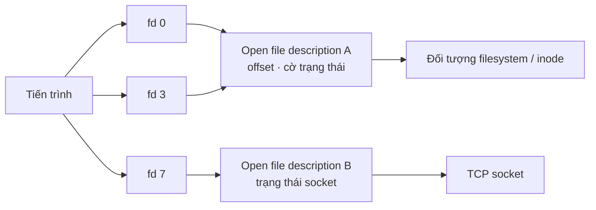

# File descriptor và mô hình I/O phổ quát trong Linux

> [!abstract] Câu hỏi trung tâm
> Câu tiến trình đang đọc một tệp đã lược bỏ gần hết những gì diễn ra trong kernel. Tiến trình đang giữ descriptor nào? Descriptor ấy trỏ tới trạng thái mở nào? Trạng thái đó gắn với inode, pipe, socket hay thiết bị? Trả lời đúng ba câu hỏi này mới có thể khoanh vùng lỗi I/O.

## Mô hình cần ghi nhớ

Trong Linux, file descriptor là một số nguyên không âm có ý nghĩa trong phạm vi một tiến trình. Số này dùng để tra bảng descriptor của tiến trình. Entry tìm được sẽ dẫn tới một *open file description* do kernel giữ; từ đó kernel mới đi tiếp tới đối tượng I/O thật, chẳng hạn tệp thông thường, pipe, FIFO, terminal, thiết bị hay socket.

Mô hình nhiều tầng này giải thích một loạt hiện tượng tưởng như bất thường:

- hai descriptor mang số khác nhau vẫn có thể dùng chung offset;
- hai lần mở cùng một đường dẫn thường có offset độc lập;
- xóa tên tệp không làm mất một descriptor đang mở;
- một lần `read` hoặc `write` thành công có thể chỉ chuyển được một phần dữ liệu;
- `write` đã trả về vẫn chưa đủ để khẳng định dữ liệu còn nguyên sau sự cố mất điện.

Nếu bỏ qua các tầng trung gian, việc điều tra thường đi sai hướng: tăng giới hạn descriptor để che một chỗ rò rỉ, tiếp tục xóa tệp khi dung lượng bị giữ bởi tệp đã unlink, hoặc đánh đồng việc đẩy buffer với bảo đảm lưu bền.

### Quy ước thuật ngữ

Chương này giữ nguyên các tên API và thuật ngữ thường dùng trong tài liệu Linux. *File descriptor* được viết tắt là **fd** khi ngữ cảnh đã rõ. *Open file description* được giữ bằng tiếng Anh vì đây là thực thể kernel cụ thể, khác với cách nói thông thường tệp đang mở. *Offset* là vị trí đọc/ghi hiện tại; *durability* là mức bảo đảm dữ liệu còn tồn tại sau lỗi hoặc mất nguồn.

## 1. Từ số fd đến đối tượng I/O trong kernel

> [!source-fact]
> TLPI mô tả mỗi tiến trình có tập file descriptor riêng. Các lời gọi hệ thống `open`, `read`, `write` và `close` cung cấp một giao diện chung cho nhiều loại đối tượng I/O. Locator: [[SRC-TLPI-2010]], Chapter 4 §4.1, printed pp. 69-71; PDF pp. 113-115.

### 1.1 Bảng descriptor của tiến trình

Mỗi tiến trình có một bảng ánh xạ số fd tới open file description. Ba fd đầu tiên thường được thiết lập theo quy ước POSIX:

| Descriptor | Tên POSIX | Quy ước ban đầu |
|---:|---|---|
| `0` | `STDIN_FILENO` | standard input |
| `1` | `STDOUT_FILENO` | standard output |
| `2` | `STDERR_FILENO` | standard error |

Các số này nói lên vai trò ban đầu, không quy định loại đối tượng. Sau khi redirect hoặc gọi `dup2`, fd `1` có thể trỏ tới tệp, pipe hoặc socket thay vì terminal.

Entry của bảng chứa những cờ thuộc riêng fd, tiêu biểu là `FD_CLOEXEC`. Pathname và nội dung tệp không nằm trong entry này.

### 1.2 Open file description: trạng thái của một lần mở

Khi mở một đối tượng, kernel tạo trạng thái dùng chung cho lần mở đó. Phần trạng thái đáng chú ý gồm:

- file offset hiện tại;
- open file status flags như `O_APPEND`, `O_NONBLOCK`;
- tham chiếu tới đối tượng bên dưới;
- số tham chiếu khi nhiều descriptor hoặc tiến trình cùng giữ.

> [!synthesis]
> Cụm một tệp đang mở quá mơ hồ để dùng trong chẩn đoán. Thông tin hữu ích phải chỉ ra fd, PID, open file description, offset và cờ trạng thái; pathname chỉ là một phần của bức tranh.

### 1.3 Đối tượng bên dưới

Với tệp thông thường, tầng cuối thường dẫn tới inode và đối tượng của filesystem. Với socket, nó dẫn tới trạng thái giao thức cùng các buffer. Pipe và FIFO dùng buffer trong kernel; terminal và thiết bị đi qua driver. Giao diện `read`/`write` giống nhau ở bề mặt, còn quy tắc cụ thể vẫn do loại đối tượng quyết định.



Trong sơ đồ, `fd 0` và `fd 3` cùng trỏ tới A, vì vậy chúng nhìn thấy cùng offset. `fd 7` trỏ tới socket; nó không cần pathname kiểu tệp thông thường nhưng vẫn tham gia mô hình descriptor.

## 2. Vòng đời của một descriptor

### 2.1 `open`: phân giải đường dẫn và cấp fd

Khi nhận `open(pathname, flags, mode)`, kernel phân giải pathname, kiểm tra quyền truy cập, tìm hoặc tạo đối tượng filesystem, lập open file description rồi gắn một entry vào bảng descriptor của tiến trình. Thành công trả về một fd không âm; thất bại trả `-1` và đặt `errno`.

Các nhóm flag cần tách:

| Nhóm | Ví dụ | Ý nghĩa |
|---|---|---|
| Chế độ truy cập | `O_RDONLY`, `O_WRONLY`, `O_RDWR` | Mở để đọc, ghi hay cả hai |
| Cờ tạo tệp | `O_CREAT`, `O_EXCL`, `O_TRUNC` | Điều khiển việc tạo hoặc thay đổi tệp |
| Cờ trạng thái | `O_APPEND`, `O_NONBLOCK`, `O_SYNC` | Chi phối các thao tác I/O về sau |

> [!source-fact]
> TLPI phân biệt creation flags với open file status flags; status flags có thể được đọc hoặc đổi qua `fcntl` trong những giới hạn của API. Locator: Chapter 4 §§4.2-4.3, printed pp. 71-79.

### 2.2 `read`: luôn đọc giá trị trả về

Với `read(fd, buffer, count)`, giá trị trả về mới cho biết điều gì đã xảy ra:

- `> 0`: số byte thực sự đọc được;
- `0`: đã tới cuối luồng hoặc cuối tệp, tùy loại đối tượng;
- `-1`: lỗi, xem `errno`.

Giá trị dương nhỏ hơn `count` là hợp lệ. Hiện tượng này thường gặp với pipe, terminal, socket và fd nonblocking. Chương trình phải xử lý đúng lượng dữ liệu đã nhận, thay vì mặc định buffer đã đầy.

```c
ssize_t n = read(fd, buf, capacity);
if (n > 0) {
    consume(buf, (size_t)n);
} else if (n == 0) {
    handle_eof();
} else if (errno == EINTR) {
    retry_or_check_shutdown();
} else if (errno == EAGAIN || errno == EWOULDBLOCK) {
    wait_for_next_readiness_event();
} else {
    handle_error(errno);
}
```

Đoạn mã trên do người biên soạn viết để minh họa, không lấy từ listing của sách.

### 2.3 `write`: thành công một phần vẫn là thành công

`write(fd, buffer, count)` trả về số byte kernel đã nhận trong lần gọi. Con số này có thể nhỏ hơn `count`: signal đến sau khi một phần dữ liệu đã được chuyển, fd nonblocking không còn đủ chỗ trong buffer, hoặc đối tượng bên dưới chỉ tiếp nhận được một phần.

Vòng lặp ghi vì thế phải dịch con trỏ và giảm số byte còn lại sau mỗi lần gọi. Gửi lại nguyên buffer cũ sẽ lặp cả phần đã ghi thành công.

### 2.4 `close`: bỏ tham chiếu của tiến trình

`close(fd)` gỡ entry khỏi bảng của tiến trình. Open file description chỉ được thu hồi khi không còn descriptor nào, ở bất kỳ tiến trình nào, tham chiếu tới nó. Bởi vậy, đóng một fd sau `dup` không ảnh hưởng tới fd còn lại.

> [!inference]
> Kernel có thể nhanh chóng cấp lại một số fd vừa đóng. Log chỉ ghi `fd=7` mà thiếu thời điểm hoặc định danh kết nối có thể vô tình ghép hai đối tượng khác nhau thành một. Đây là hệ quả vận hành rút ra từ vòng đời descriptor, không phải thuật ngữ do TLPI đặt ra.

## 3. Chia sẻ descriptor và file offset

### 3.1 `dup`, `dup2` và chuyển hướng luồng

`dup` tạo fd mới nhưng vẫn trỏ tới open file description cũ. Hai fd dùng chung offset và các cờ trạng thái của lần mở. Shell dựa vào cơ chế này để nối standard stream với tệp hoặc pipe.

Ví dụ tư duy:

1. tiến trình mở tệp và nhận `fd=3`;
2. `dup2(3, 1)` làm stdout trỏ tới cùng open file description;
3. ghi qua `stdout` làm offset tiến lên;
4. ghi tiếp qua `fd=3` bắt đầu từ offset mới, không phải offset độc lập.

### 3.2 Descriptor được thừa kế qua `fork`

Sau `fork`, tiến trình cha và con có bảng descriptor riêng, song các entry tương ứng vẫn có thể trỏ tới cùng open file description. Nếu cả hai cùng ghi mà không có quy ước phối hợp, thứ tự kết quả phụ thuộc lịch chạy.

### 3.3 Hai lần `open` cùng pathname

Hai lần `open` độc lập thường tạo hai open file description, mỗi cái có offset riêng. Điều này khác với `dup` hoặc thừa kế qua `fork`.

| Cách có descriptor | Chia sẻ open file description? | Chia sẻ offset? |
|---|---:|---:|
| `dup(fd)` | Có | Có |
| `fork()` rồi dùng descriptor thừa kế | Có | Có |
| `open(path)` hai lần | Thường không | Không |

## 4. File offset, `lseek` và sparse file

Kernel cập nhật offset sau mỗi lần `read` hoặc `write`. `lseek` chỉ thay đổi vị trí đó, không tự đọc hay ghi. Nếu seek qua cuối tệp rồi mới ghi, tệp có thể xuất hiện một *hole*. Khi đọc, vùng này cho ra byte zero dù filesystem không nhất thiết đã cấp block vật lý cho toàn bộ khoảng trống.

> [!source-fact]
> TLPI mô tả file offset, `lseek` và file hole trong Chapter 4 §§4.7-4.8, printed pp. 82-87.

### Race điển hình

Chuỗi `lseek(fd, end)` rồi `write(fd, data)` có một khe thời gian ở giữa. Tiến trình hoặc thread khác có thể thay đổi offset trong khe đó. Với `O_APPEND`, kernel đặt vị trí cuối tệp và thực hiện ghi như một thao tác kết hợp, phù hợp hơn khi nhiều bên cùng append.

Điều này không làm mọi lần ghi trở thành nguyên tử. Giới hạn nguyên tử còn tùy loại đối tượng, API, filesystem và kích thước dữ liệu.

## 5. Vì sao tệp đã xóa vẫn có thể chiếm đĩa

Tên tệp tồn tại trong một directory entry, còn dữ liệu gắn với inode. `unlink` gỡ liên kết giữa tên và inode. Kernel chỉ thu hồi inode cùng các block dữ liệu khi số hard link đã về 0 **và** không còn open file description nào giữ đối tượng.

### Triệu chứng vận hành

- `df` báo filesystem gần đầy, trong khi tổng từ `du` nhỏ hơn đáng kể;
- một tiến trình ghi log đã chạy lâu;
- log cũ đã bị xóa hoặc rotate, nhưng tiến trình chưa mở lại tệp mới.

### Trình tự điều tra

1. So sánh `df` và `du` trên cùng một mount; so sánh khác mount không có giá trị.
2. Dùng `lsof +L1` hoặc `/proc/<pid>/fd` để tìm fd trỏ tới tệp mang trạng thái `(deleted)`.
3. Ghi lại PID, fd, kích thước đối tượng và đơn vị vận hành chịu trách nhiệm cho dịch vụ.
4. Chọn cách xử lý ít rủi ro nhất: yêu cầu ứng dụng mở lại log, restart có kiểm soát, hoặc can thiệp trực tiếp vào fd khi đã hiểu rõ hậu quả.
5. Sau can thiệp, kiểm tra cả dung lượng được giải phóng lẫn đích ghi log hiện tại.

> [!warning]
> Xóa thêm tệp thường chỉ làm tình hình khó điều tra hơn. Nếu dung lượng nằm trong một tệp đã unlink nhưng còn mở, chỉ xử lý tiến trình đang giữ fd mới giải phóng được đối tượng đó.

## 6. Quan sát descriptor qua `/proc`

Các vị trí hữu ích:

| Đường dẫn | Câu hỏi trả lời |
|---|---|
| `/proc/<pid>/fd/` | Tiến trình đang giữ những descriptor nào? |
| `/proc/<pid>/fdinfo/<fd>` | Offset và flags của descriptor là gì? |
| `/proc/<pid>/limits` | Soft/hard limit về số descriptor là bao nhiêu? |
| `/proc/<pid>/status` | Trạng thái, số thread, RSS và bộ đếm context switch ra sao? |

> [!source-fact]
> TLPI ghi nhận `fdinfo` có `pos` và `flags`, và nhấn mạnh schema `/proc` thay đổi theo kernel. Locator: Chapter 4 §4.3, printed p. 75; Chapter 12 §12.1, pp. 223-228.

### Nguyên tắc parser

- tìm trường theo tên thay vì cố định số dòng;
- ghi kèm phiên bản kernel;
- chấp nhận trường có thể vắng mặt hoặc được bổ sung;
- hiểu rằng đích symlink chỉ phản ánh trạng thái tại thời điểm quan sát;
- trong bước thu thập bằng chứng, không mở hoặc sửa fd của tiến trình khác.

## 7. FD leak và hai giới hạn khác nhau

Mọi lần mở thành công đều cần một quy ước ownership: thành phần nào sẽ đóng fd, và việc đóng xảy ra ở những nhánh nào. Rò rỉ xuất hiện khi một nhánh bỏ qua `close`, giữ kết nối quá lâu hoặc để tham chiếu sống lâu hơn vòng đời công việc.

Hai lỗi cần phân biệt:

- `EMFILE`: tiến trình đã chạm giới hạn descriptor của chính nó;
- `ENFILE`: hệ thống chạm giới hạn open file toàn cục.

### Dấu hiệu

- số entry trong `/proc/<pid>/fd` tăng đơn điệu;
- request mới thất bại với lỗi `Too many open files`;
- socket ở trạng thái không được thu hồi;
- restart tạm thời chữa triệu chứng nhưng số descriptor lại tăng.

### Cách chứng minh leak

1. đo số descriptor theo thời gian dưới một workload ổn định;
2. phân nhóm theo loại đối tượng đích;
3. đối chiếu tốc độ tăng với vòng đời request hoặc job;
4. tái hiện trong test có giới hạn descriptor thấp;
5. sửa ownership/cleanup;
6. chạy lại cùng workload và chứng minh đường biểu diễn không còn tăng.

Nếu vòng đời tài nguyên chưa được sửa, tăng `RLIMIT_NOFILE` chỉ kéo dài thời gian trước khi lỗi tái diễn.

## 8. Buffering và durability

I/O thường đi qua nhiều tầng:


`fflush` đẩy dữ liệu khỏi buffer của thư viện stdio sang kernel. `fdatasync` yêu cầu đồng bộ dữ liệu và phần metadata cần để đọc lại dữ liệu đó. `fsync` có phạm vi rộng hơn, bao gồm dữ liệu cùng metadata của tệp theo hợp đồng của hệ điều hành và filesystem. Khi tạo hoặc đổi tên tệp, muốn directory entry bền vững có thể còn phải đồng bộ chính thư mục chứa nó.

> [!source-fact]
> Phân biệt synchronized data integrity completion và file integrity completion được trình bày tại Chapter 13 §13.3, printed pp. 239-243.

> [!uncertainty]
> Câu đã xuống đĩa chỉ có nghĩa khi biết filesystem, tùy chọn mount, cache của thiết bị, controller và cam kết khi mất nguồn. Kiến thức trong chương này chưa đủ để chứng nhận độ bền của một hệ thống lưu trữ cụ thể.

## 9. Blocking, nonblocking và readiness

Với `O_NONBLOCK`, một thao tác chưa thể tiến hành ngay sẽ không giữ thread chờ vô hạn. Lời gọi có thể trả `-1` cùng `EAGAIN` hoặc `EWOULDBLOCK`; event loop dựa vào hành vi này để quản lý nhiều fd.

Tín hiệu readiness từ `select`, `poll` hoặc `epoll` cho biết một thao tác I/O có khả năng tiến hành mà không block tại thời điểm quan sát. Tín hiệu ấy không bảo đảm rằng:

- toàn bộ message đã tới;
- buffer mong muốn sẽ được đọc đủ;
- peer vẫn còn kết nối;
- thao tác đã hoàn tất;
- trạng thái không đổi trước system call tiếp theo.

Trạng thái có thể đổi giữa lúc nhận sự kiện và lúc gọi I/O. Handler vì thế vẫn phải dùng fd nonblocking và xử lý `EAGAIN` sau một readiness event.

Chủ đề cần viết tiếp: *Readiness và completion trong I/O bất đồng bộ*.

## 10. Các cách hiểu dễ dẫn tới lỗi

| Cách hiểu sai | Điều thực sự xảy ra |
|---|---|
| Descriptor chính là tệp | Descriptor là một handle trong tiến trình |
| Xóa pathname sẽ giải phóng dữ liệu ngay | Inode và dữ liệu vẫn còn nếu đang được giữ mở |
| `write` thành công là đã ghi đủ | Số byte trả về có thể nhỏ hơn số byte yêu cầu |
| `fflush` làm dữ liệu bền vững | Dữ liệu mới chỉ rời buffer của stdio |
| Hai fd khác số luôn độc lập | Chúng có thể cùng trỏ tới một open file description |
| Cùng pathname thì cùng offset | Hai lần `open` độc lập thường có offset riêng |
| Tăng giới hạn fd sẽ sửa được leak | Giới hạn cao hơn chỉ trì hoãn lần lỗi kế tiếp |
| Readiness đồng nghĩa completion | Readiness chỉ phản ánh khả năng I/O tại thời điểm quan sát |

## 11. Checklist khi review code

### Khi mở tài nguyên

- [ ] Các cờ có đúng với nhu cầu đọc, ghi, append và nonblocking không?
- [ ] Nhánh lỗi có vô tình giữ lại fd không?
- [ ] Có cần `O_CLOEXEC` để fd không lọt qua `exec` không?
- [ ] Quyền tạo file có chịu ảnh hưởng của `umask` không?

### Đọc và ghi

- [ ] Chương trình kiểm tra số byte trả về hay mặc định buffer đã được xử lý hết?
- [ ] Phân biệt EOF, `EINTR`, `EAGAIN` và lỗi thật?
- [ ] Giao thức trên stream có quy tắc framing rõ ràng?
- [ ] Con trỏ và số byte còn lại có được cập nhật sau partial write?

### Đóng và chuyển ownership

- [ ] Ai chịu trách nhiệm `close`?
- [ ] Ownership sau `dup`, `fork`, đưa vào queue hoặc chuyển qua callback có rõ không?
- [ ] Mọi nhánh return sớm và exception đều giải phóng tài nguyên?
- [ ] Có test giới hạn descriptor thấp?

### Durability

- [ ] Yêu cầu thực sự là đẩy dữ liệu tới tầng nào?
- [ ] Có cần `fdatasync`, `fsync` hay transaction của storage engine?
- [ ] Thao tác tạo hoặc đổi tên có đòi hỏi directory entry phải bền vững?
- [ ] Kiểm thử lỗi có bao gồm tiến trình dừng đột ngột và ranh giới mất nguồn phù hợp?

## 12. Trình tự chẩn đoán trên hệ thống đang chạy

1. Xác định PID, dịch vụ, mount và loại descriptor liên quan.
2. Trước khi can thiệp, lưu trạng thái từ `/proc/<pid>/fd`, `fdinfo`, `limits` và `status`.
3. Phân loại hiện tượng: cạn fd, rò rỉ, blocking, partial I/O, quyền truy cập, hết dung lượng hay lỗi về durability.
4. Nối fd với pathname, socket hoặc pipe tương ứng, rồi xác định thành phần sở hữu vòng đời của nó.
5. Nếu bằng chứng chưa đủ, dùng `strace` trong phạm vi PID và thời gian được kiểm soát để quan sát lời gọi hệ thống.
6. Giữ lại bằng chứng trước khi restart. Ngoại lệ là lúc mục tiêu khôi phục dịch vụ quan trọng hơn mục tiêu điều tra; quyết định này cần được ghi rõ.
7. Sau khi xử lý, chạy lại đúng workload và kiểm tra metric đã trở về trạng thái mong đợi.

## 13. Giới hạn của chương

Mô hình descriptor giải thích được nhiều lỗi I/O, nhưng không thay thế tài liệu của kernel, filesystem hay thiết bị cụ thể. Chỉ dựa vào chương này chưa thể:

- mô tả nội bộ của ext4, XFS hoặc overlayfs ở phiên bản hiện hành;
- khẳng định `fsync` chống mọi kiểu mất điện trên mọi thiết bị;
- chọn `epoll` hay `io_uring` cho workload chưa được đo;
- giải thích đầy đủ việc hạch toán trong cgroup v2 hoặc cách container cô lập fd;
- đặt một ngưỡng fd, buffer hay timeout dùng chung cho mọi dịch vụ;
- đánh giá năng lực vận hành Linux của người học chỉ từ việc đã đọc ghi chú.

## 14. Câu hỏi ôn tập

1. Vì sao hai descriptor khác nhau có thể chia sẻ file offset?
2. Vì sao `du` có thể nhỏ hơn nhiều so với `df` sau khi xóa log?
3. `EMFILE` khác `ENFILE` ở đâu?
4. Vì sao phải kiểm số byte trả về từ `write`?
5. `fflush`, `fdatasync` và `fsync` đảm bảo khác nhau thế nào?
6. Tại sao readiness event không cho phép bỏ xử lý `EAGAIN`?
7. Vì sao `O_APPEND` tránh được race của chuỗi `lseek` rồi `write`?
8. Cần những bằng chứng nào để kết luận một service bị FD leak?

## 15. Vị trí trong hệ thống kiến thức

- Nguồn: [[SRC-TLPI-2010]]
- Kiến thức nên có trước: tiến trình, lời gọi hệ thống, pathname, inode và virtual filesystem.
- Mở rộng cần viết:
 - *Buffering, page cache và durability*;
 - *Readiness và completion trong I/O bất đồng bộ*;
 - *Vòng đời tiến trình, signal và graceful shutdown*;
 - *Quan sát tiến trình bằng procfs*.
- Bài học có thể sử dụng ghi chú này: `DE-L064`, `DE-L065`, `DE-L066` và một phần `DE-L071`.

## Source coverage

| Source slice | Nội dung phải giữ | Vị trí trong note | Trạng thái |
|---|---|---|---|
| [[SRC-TLPI-2010]], Ch. 4 §§4.1-4.10 | universal I/O, `open/read/write/close`, offset, `lseek`, atomicity và descriptor flags | §§1-5, 9-10 | Đã trình bày; syscall details ngoài nhóm này không được suy rộng |
| [[SRC-TLPI-2010]], Ch. 5 §§5.1-5.7 | open file description, sharing, `dup`, `fork`, file status flags và descriptor flags | §§4-8 | Đã trình bày cùng sơ đồ ba tầng tham chiếu |
| [[SRC-TLPI-2010]], Ch. 12 §12.1; Ch. 14 | `/proc`, pathname, inode, filesystem và trường hợp tệp đã unlink nhưng còn mở | §§6-8, 13-14 | Đã trình bày ở mức cần để chẩn đoán descriptor; không thay một chương filesystem riêng |
| [[SRC-TLPI-2010]], Ch. 13 §§13.2-13.3 | stdio/kernel buffering, `fflush`, `fsync`, `fdatasync` và giới hạn kết luận về durability | §§9-11 | Đã trình bày; behavior của filesystem/hardware cụ thể được giữ là điều kiện ngoài phạm vi |
| [[SRC-TLPI-2010]], Ch. 36 §36.3; Ch. 61 §61.1; Ch. 63 | resource limit, partial I/O, blocking, readiness và completion | §§10, 12-14 | Đã trình bày khái niệm và failure modes; API async cụ thể cần note riêng |

Không có phần nào trong các lát nguồn trên bị loại chỉ vì quá chi tiết. Nội dung về filesystem internals, async API và durability hardware chỉ dừng ở ranh giới mà nguồn cho phép kết luận, thay vì suy đoán thêm.

## Key takeaways
- File descriptor là chỉ số trong bảng descriptor của một tiến trình; entry dẫn tới open file description do kernel giữ, rồi mới tới inode, pipe, socket, terminal hoặc device cụ thể.
- `dup()` và `fork()` có thể tạo nhiều descriptor cùng tham chiếu một open file description, vì vậy chúng có thể chia sẻ file offset và status flags dù số descriptor khác nhau.
- `read()` và `write()` mô tả trao đổi giữa user space và kernel theo semantics của đối tượng; chúng không tự động chứng minh dữ liệu đã bền trên storage hoặc đã được peer xử lý.
- Xóa pathname không giải phóng dữ liệu khi inode còn được tham chiếu bởi descriptor đang mở; đây là lý do dung lượng có thể chưa trở lại dù tên tệp không còn.
- Điều tra I/O cần xác định tiến trình giữ descriptor nào, descriptor trỏ tới open file description nào, trạng thái blocking/readiness ra sao và đối tượng kernel cuối cùng là gì.

## Reference
1. Michael Kerrisk, *The Linux Programming Interface*, No Starch Press, 2010:
 - Chapter 4, §§4.1-4.10, printed pp. 69-87;
 - Chapter 5, §§5.1-5.7, pp. 89-110;
 - Chapter 12, §12.1, pp. 223-228;
 - Chapter 13, §§13.2-13.3, pp. 237-245;
 - Chapter 14, các phần inode, mount và filesystem structure, pp. 251-278;
 - Chapter 36, §36.3, resource limits;
 - Chapter 61, §61.1, partial reads/writes;
 - Chapter 63, alternative I/O models.
2. Hồ sơ nguồn trong vault: [[SRC-TLPI-2010]].
3. Ghi chú nguồn của dự án: `Material/DE/Reference/Library/Source-Notes/PACK-OS_NETWORK-BOOK-02.md`.

## Lịch sử xác minh

| Ngày | Trạng thái | Nội dung |
|---|---|---|
| 2026-09-27 | `review` | Tạo chương mẫu tiếng Việt; đối chiếu cấu trúc, SHA-256 và locator với bản PDF 2010 |
| 2026-09-27 | `review` | Biên tập lại toàn văn theo giọng giáo trình kỹ thuật; giữ nguyên claim, locator và giới hạn bằng chứng |

<!-- ATOMIC-EXECUTION-CAPSULE:START -->

## Execution capsule: kiểm chứng `wiki.linux.file-descriptor-universal-io`

> [!important] Phân loại mệnh đề
> Với `wiki.linux.file-descriptor-universal-io`, sơ đồ, ví dụ và artifact về **File descriptor và mô hình I/O phổ quát trong Linux** là **synthesis để kiểm chứng**; chúng không phải trích dẫn hay case nguyên văn của nguồn.

### Tự kiểm tra trước khi tái sử dụng

1. Bạn có thể trả lời `File descriptor biểu diễn điều gì và phải suy luận thế nào khi chẩn đoán I/O trên Linux?` bằng một câu mà không kéo thêm concept thứ hai không?
2. Source locator nào đỡ cho claim, và phần nào chỉ là synthesis trong note?
3. Observation nào khiến bạn dừng, thu hẹp hoặc đảo quyết định?
4. Artifact nào cho phép một reviewer độc lập tái hiện kết quả?

<!-- ATOMIC-EXECUTION-CAPSULE:END -->
