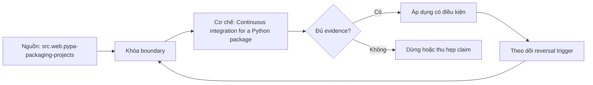

# Continuous integration for a Python package

**Tóm tắt bản chất:** pipeline restore declared environment, lint/type/test/build, clean-install artifact rồi publish only from passed revision Sai boundary ở `CI cho Python package từ clean checkout tới immutable artifact` làm kết quả có vẻ đúng trong happy path nhưng không chịu được failure hoặc changed constraint.

> [!abstract] Câu hỏi trung tâm
> Làm thế nào mô hình, kiểm chứng và áp dụng CI cho Python package từ clean checkout tới immutable artifact?

## Problem Definition and Operational Relevance

pipeline restore declared environment, lint/type/test/build, clean-install artifact rồi publish only from passed revision Với `wiki.de-foundation.continuous-integration-python-package`, điểm phải khóa là state transition và invariant; nếu trường nào chưa biết thì ghi unknown và nêu impact-if-wrong thay vì tự điền mặc định.

Không có mô hình này, lỗi thường lộ ở consumer sau cùng: output sai, latency vọt, resource không được giải phóng hoặc lịch sử không còn tái hiện được. Chi phí thật của `Continuous integration for a Python package` vì thế nằm ở thời gian chẩn đoán và phạm vi phục hồi, không nằm ở số dòng syntax.

## Mechanism

cache là optimization không phải source; matrix phải phản ánh supported versions; secrets không vào untrusted job Với `wiki.de-foundation.continuous-integration-python-package`, điểm phải khóa là identity, ownership và boundary; nếu trường nào chưa biết thì ghi unknown và nêu impact-if-wrong thay vì tự điền mặc định.

Hãy tách declared state, executed state và published state của `CI cho Python package từ clean checkout tới immutable artifact`. Một command thành công chỉ là executed signal; muốn kết luận cần đối soát consumer-visible invariant và trạng thái còn lại sau restart hoặc replay.

## Decision Framework

tests chạy source tree nhưng wheel thiếu file; mutable dependency làm rerun khác; approval trên revision cũ Với `wiki.de-foundation.continuous-integration-python-package`, điểm phải khóa là failure path và recovery; nếu trường nào chưa biết thì ghi unknown và nêu impact-if-wrong thay vì tự điền mặc định.

Quy tắc mặc định cho `Continuous integration for a Python package` là chọn phương án đơn giản nhất qua được hard constraints, rồi ghi rõ điều kiện đảo. Bảng quyết định tối thiểu gồm workload, identity, state owner, time/memory budget, failure domain và khả năng rollback.

## Worked Case: Continuous integration for a Python package

separate fast feedback và release gate; artifact build một lần rồi promote cùng digest Với `wiki.de-foundation.continuous-integration-python-package`, điểm phải khóa là decision trade-off và reversal trigger; nếu trường nào chưa biết thì ghi unknown và nêu impact-if-wrong thay vì tự điền mặc định.

Case dùng fixture nhỏ nhưng phải giữ cơ chế chi phối. Trước khi chạy, learner viết expected transition; sau khi chạy, họ đối chiếu raw artifact với oracle và giải thích mọi khác biệt thay vì sửa expected cho khớp output.

## Limits and Common Errors

checkout SHA, resolved dependencies, test reports, wheel hash, clean-install smoke và status checks Với `wiki.de-foundation.continuous-integration-python-package`, điểm phải khóa là evidence package và oracle; nếu trường nào chưa biết thì ghi unknown và nêu impact-if-wrong thay vì tự điền mặc định.

**Hiểu lầm:** Happy path chạy nhanh nghĩa là thiết kế đúng. **Thực tế:** tests chạy source tree nhưng wheel thiếu file; mutable dependency làm rerun khác; approval trên revision cũ **Vì sao nghe hợp lý:** case nhỏ thường không chạm capacity, concurrency, failure hoặc version boundary.

**Hiểu lầm:** Tool hoặc API tự bảo đảm semantics. **Thực tế:** guarantee chỉ tồn tại trong scope và state đã công bố. **Vì sao nghe hợp lý:** syntax che mất protocol phía dưới.

## Nếu Bạn Dạy Lại Điều Này...

xóa cache và source tree để kiểm reproducibility/artifact completeness Với `wiki.de-foundation.continuous-integration-python-package`, điểm phải khóa là changed-constraint transfer; nếu trường nào chưa biết thì ghi unknown và nêu impact-if-wrong thay vì tự điền mặc định.

Hook dạy lại bắt đầu bằng một dự đoán dễ sai về `CI cho Python package từ clean checkout tới immutable artifact`. Bài tập seed đổi đúng một constraint, yêu cầu learner giữ hoặc đảo quyết định và chỉ ra evidence nào đủ mạnh để thuyết phục một reviewer không tham dự buổi học.

## Ma trận kiểm chứng từng mệnh đề

Protocol riêng của `Continuous integration for a Python package` là: checkout SHA, resolved dependencies, test reports, wheel hash, clean-install smoke và status checks Mỗi probe nối input boundary với failure signal và oracle có thể bác bỏ kết luận.

### Probe 1: state transition và invariant

**Mệnh đề cần kiểm.** pipeline restore declared environment, lint/type/test/build, clean-install artifact rồi publish only from passed revision

**Thiết kế phép thử cho `wiki.de-foundation.continuous-integration-python-package`.** Với `wiki.de-foundation.continuous-integration-python-package`, tạo positive và negative control chỉ khác một điều kiện; khóa input snapshot, phiên bản, seed, identity và state ban đầu. Viết expected result trước execution để tránh đổi tiêu chí sau khi nhìn output.

**Bằng chứng cần giữ.** Lưu command hoặc harness, raw observation, transition trước-sau, coverage và limitation. Kết luận chỉ đạt khi oracle độc lập khớp ở đúng grain; nếu chưa chạy, phần này vẫn là protocol chứ không phải observation.

### Probe 2: identity, ownership và boundary

**Mệnh đề cần kiểm.** cache là optimization không phải source; matrix phải phản ánh supported versions; secrets không vào untrusted job

**Thiết kế phép thử cho `wiki.de-foundation.continuous-integration-python-package`.** Với `wiki.de-foundation.continuous-integration-python-package`, tạo boundary case ngay trước và sau ngưỡng; khóa input snapshot, phiên bản, seed, identity và state ban đầu. Viết expected result trước execution để tránh đổi tiêu chí sau khi nhìn output.

**Bằng chứng cần giữ.** Lưu command hoặc harness, raw observation, transition trước-sau, coverage và limitation. Kết luận chỉ đạt khi oracle độc lập khớp ở đúng grain; nếu chưa chạy, phần này vẫn là protocol chứ không phải observation.

### Probe 3: failure path và recovery

**Mệnh đề cần kiểm.** tests chạy source tree nhưng wheel thiếu file; mutable dependency làm rerun khác; approval trên revision cũ

**Thiết kế phép thử cho `wiki.de-foundation.continuous-integration-python-package`.** Với `wiki.de-foundation.continuous-integration-python-package`, tạo replay cùng identity với state khác; khóa input snapshot, phiên bản, seed, identity và state ban đầu. Viết expected result trước execution để tránh đổi tiêu chí sau khi nhìn output.

**Bằng chứng cần giữ.** Lưu command hoặc harness, raw observation, transition trước-sau, coverage và limitation. Kết luận chỉ đạt khi oracle độc lập khớp ở đúng grain; nếu chưa chạy, phần này vẫn là protocol chứ không phải observation.

### Probe 4: decision trade-off và reversal trigger

**Mệnh đề cần kiểm.** separate fast feedback và release gate; artifact build một lần rồi promote cùng digest

**Thiết kế phép thử cho `wiki.de-foundation.continuous-integration-python-package`.** Với `wiki.de-foundation.continuous-integration-python-package`, tạo failure inject trước và sau durable transition; khóa input snapshot, phiên bản, seed, identity và state ban đầu. Viết expected result trước execution để tránh đổi tiêu chí sau khi nhìn output.

**Bằng chứng cần giữ.** Lưu command hoặc harness, raw observation, transition trước-sau, coverage và limitation. Kết luận chỉ đạt khi oracle độc lập khớp ở đúng grain; nếu chưa chạy, phần này vẫn là protocol chứ không phải observation.

### Probe 5: evidence package và oracle

**Mệnh đề cần kiểm.** checkout SHA, resolved dependencies, test reports, wheel hash, clean-install smoke và status checks

**Thiết kế phép thử cho `wiki.de-foundation.continuous-integration-python-package`.** Với `wiki.de-foundation.continuous-integration-python-package`, tạo changed scale làm cost model đổi; khóa input snapshot, phiên bản, seed, identity và state ban đầu. Viết expected result trước execution để tránh đổi tiêu chí sau khi nhìn output.

**Bằng chứng cần giữ.** Lưu command hoặc harness, raw observation, transition trước-sau, coverage và limitation. Kết luận chỉ đạt khi oracle độc lập khớp ở đúng grain; nếu chưa chạy, phần này vẫn là protocol chứ không phải observation.

### Probe 6: changed-constraint transfer

**Mệnh đề cần kiểm.** xóa cache và source tree để kiểm reproducibility/artifact completeness

**Thiết kế phép thử cho `wiki.de-foundation.continuous-integration-python-package`.** Với `wiki.de-foundation.continuous-integration-python-package`, tạo adversarial order hoặc skew; khóa input snapshot, phiên bản, seed, identity và state ban đầu. Viết expected result trước execution để tránh đổi tiêu chí sau khi nhìn output.

**Bằng chứng cần giữ.** Lưu command hoặc harness, raw observation, transition trước-sau, coverage và limitation. Kết luận chỉ đạt khi oracle độc lập khớp ở đúng grain; nếu chưa chạy, phần này vẫn là protocol chứ không phải observation.

### Probe 7: state transition và invariant

**Mệnh đề cần kiểm.** pipeline restore declared environment, lint/type/test/build, clean-install artifact rồi publish only from passed revision

**Thiết kế phép thử cho `wiki.de-foundation.continuous-integration-python-package`.** Với `wiki.de-foundation.continuous-integration-python-package`, tạo fresh environment không cache; khóa input snapshot, phiên bản, seed, identity và state ban đầu. Viết expected result trước execution để tránh đổi tiêu chí sau khi nhìn output.

**Bằng chứng cần giữ.** Lưu command hoặc harness, raw observation, transition trước-sau, coverage và limitation. Kết luận chỉ đạt khi oracle độc lập khớp ở đúng grain; nếu chưa chạy, phần này vẫn là protocol chứ không phải observation.

### Probe 8: identity, ownership và boundary

**Mệnh đề cần kiểm.** cache là optimization không phải source; matrix phải phản ánh supported versions; secrets không vào untrusted job

**Thiết kế phép thử cho `wiki.de-foundation.continuous-integration-python-package`.** Với `wiki.de-foundation.continuous-integration-python-package`, tạo independent oracle không dùng chung implementation; khóa input snapshot, phiên bản, seed, identity và state ban đầu. Viết expected result trước execution để tránh đổi tiêu chí sau khi nhìn output.

**Bằng chứng cần giữ.** Lưu command hoặc harness, raw observation, transition trước-sau, coverage và limitation. Kết luận chỉ đạt khi oracle độc lập khớp ở đúng grain; nếu chưa chạy, phần này vẫn là protocol chứ không phải observation.

### Probe 9: failure path và recovery

**Mệnh đề cần kiểm.** tests chạy source tree nhưng wheel thiếu file; mutable dependency làm rerun khác; approval trên revision cũ

**Thiết kế phép thử cho `wiki.de-foundation.continuous-integration-python-package`.** Với `wiki.de-foundation.continuous-integration-python-package`, tạo partial progress rồi restart; khóa input snapshot, phiên bản, seed, identity và state ban đầu. Viết expected result trước execution để tránh đổi tiêu chí sau khi nhìn output.

**Bằng chứng cần giữ.** Lưu command hoặc harness, raw observation, transition trước-sau, coverage và limitation. Kết luận chỉ đạt khi oracle độc lập khớp ở đúng grain; nếu chưa chạy, phần này vẫn là protocol chứ không phải observation.

### Probe 10: decision trade-off và reversal trigger

**Mệnh đề cần kiểm.** separate fast feedback và release gate; artifact build một lần rồi promote cùng digest

**Thiết kế phép thử cho `wiki.de-foundation.continuous-integration-python-package`.** Với `wiki.de-foundation.continuous-integration-python-package`, tạo missing evidence phải abstain; khóa input snapshot, phiên bản, seed, identity và state ban đầu. Viết expected result trước execution để tránh đổi tiêu chí sau khi nhìn output.

**Bằng chứng cần giữ.** Lưu command hoặc harness, raw observation, transition trước-sau, coverage và limitation. Kết luận chỉ đạt khi oracle độc lập khớp ở đúng grain; nếu chưa chạy, phần này vẫn là protocol chứ không phải observation.

### Probe 11: evidence package và oracle

**Mệnh đề cần kiểm.** checkout SHA, resolved dependencies, test reports, wheel hash, clean-install smoke và status checks

**Thiết kế phép thử cho `wiki.de-foundation.continuous-integration-python-package`.** Với `wiki.de-foundation.continuous-integration-python-package`, tạo reviewer tái hiện từ package; khóa input snapshot, phiên bản, seed, identity và state ban đầu. Viết expected result trước execution để tránh đổi tiêu chí sau khi nhìn output.

**Bằng chứng cần giữ.** Lưu command hoặc harness, raw observation, transition trước-sau, coverage và limitation. Kết luận chỉ đạt khi oracle độc lập khớp ở đúng grain; nếu chưa chạy, phần này vẫn là protocol chứ không phải observation.

### Probe 12: changed-constraint transfer

**Mệnh đề cần kiểm.** xóa cache và source tree để kiểm reproducibility/artifact completeness

**Thiết kế phép thử cho `wiki.de-foundation.continuous-integration-python-package`.** Với `wiki.de-foundation.continuous-integration-python-package`, tạo constraint đổi đủ để quyết định đảo; khóa input snapshot, phiên bản, seed, identity và state ban đầu. Viết expected result trước execution để tránh đổi tiêu chí sau khi nhìn output.

**Bằng chứng cần giữ.** Lưu command hoặc harness, raw observation, transition trước-sau, coverage và limitation. Kết luận chỉ đạt khi oracle độc lập khớp ở đúng grain; nếu chưa chạy, phần này vẫn là protocol chứ không phải observation.

## Tự Kiểm Tra Nhanh

1. Boundary đầu tiên của `CI cho Python package từ clean checkout tới immutable artifact` nằm ở đâu?

<details><summary>Đáp án</summary>cache là optimization không phải source; matrix phải phản ánh supported versions; secrets không vào untrusted job</details>

2. Failure nào dễ tạo kết quả xanh giả nhất?

<details><summary>Đáp án</summary>tests chạy source tree nhưng wheel thiếu file; mutable dependency làm rerun khác; approval trên revision cũ</details>

3. Constraint nào khiến quyết định phải đảo?

<details><summary>Đáp án</summary>xóa cache và source tree để kiểm reproducibility/artifact completeness</details>

## Giới hạn và điều chưa cho phép kết luận

- Lab của `Continuous integration for a Python package` chưa được tuyên bố đã chạy trên production; note mô tả curriculum và expected evidence.
- Mọi kết luận phụ thuộc version, workload, operating system, interpreter/compiler hoặc hardware phải được kiểm lại trên target.
- Concept key `ck.de.continuous-integration-python-package` đã được owner phê duyệt `canonical`; note thuộc canonical registry coverage. Trạng thái này không tự chứng minh learner mastery.
- Note giữ trạng thái `review` cho tới khi owner duyệt semantics và learner artifact.

## Reference
1. [[SRC-PYPA-PACKAGING-PROJECTS]]
2. [[SRC-GITHUB-STATUS-CHECKS]]
3. [[SRC-SOMMERVILLE-SOFTWARE-ENGINEERING-10E]]

## Source coverage

| Source slice | Locator | Kiến thức phải giữ | Vị trí | Trạng thái | Ngoài phạm vi |
|---|---|---|---|---|---|
| [[SRC-PYPA-PACKAGING-PROJECTS]]: `src.web.pypa-packaging-projects` | PyPA Packaging Projects; accessed 2026-10-02 | cơ chế và boundary liên quan trực tiếp tới `CI cho Python package từ clean checkout tới immutable artifact` | các mục cơ chế, quyết định và probe | Đã phủ | phần ngoài objective DE-L031 |
| [[SRC-GITHUB-STATUS-CHECKS]]: `src.web.github-status-checks` | GitHub status checks; accessed 2026-10-01 | cơ chế và boundary liên quan trực tiếp tới `CI cho Python package từ clean checkout tới immutable artifact` | các mục cơ chế, quyết định và probe | Đã phủ | phần ngoài objective DE-L031 |
| [[SRC-SOMMERVILLE-SOFTWARE-ENGINEERING-10E]]: `src.book.sommerville-software-engineering.10e` | Chapters 4, 7, 8 và 25; PDF 103-132, 169-212, 228-242, 732-756 | cơ chế và boundary liên quan trực tiếp tới `CI cho Python package từ clean checkout tới immutable artifact` | các mục cơ chế, quyết định và probe | Đã phủ | phần ngoài objective DE-L031 |

## Key takeaways
- separate fast feedback và release gate; artifact build một lần rồi promote cùng digest
- checkout SHA, resolved dependencies, test reports, wheel hash, clean-install smoke và status checks
- `CI cho Python package từ clean checkout tới immutable artifact` chỉ có nghĩa trong scope, identity, state và version đã ghi.
- Trước khi lab chạy, đây là note có provenance và protocol, chưa phải production evidence hay bằng chứng mastery.

<!-- ATOMIC-EXECUTION-CAPSULE:START -->

## Execution capsule: kiểm chứng `wiki.de-foundation.continuous-integration-python-package`

> [!important] Phân loại mệnh đề
> Với `wiki.de-foundation.continuous-integration-python-package`, sơ đồ, ví dụ và artifact về **Continuous integration for a Python package** là **synthesis để kiểm chứng**; chúng không phải trích dẫn hay case nguyên văn của nguồn.

### Sơ đồ cơ chế và điểm kiểm soát



Đọc sơ đồ `wiki.de-foundation.continuous-integration-python-package` từ trái sang phải: source chỉ cung cấp claim ban đầu cho **Continuous integration for a Python package**; quyết định chỉ được đi tiếp sau khi boundary, evidence và điều kiện đảo quyết định đã hiện hữu.

### Artifact thực thi tối thiểu

```python
from dataclasses import dataclass

@dataclass(frozen=True)
class WikiDeFoundationContinuousIntegrationPythonEvidence:
    boundary_declared: bool
    independent_oracle: bool
    reversal_trigger: str

    def accepted(self) -> bool:
        return (
            self.boundary_declared
            and self.independent_oracle
            and bool(self.reversal_trigger.strip())
        )

# Concept: Continuous integration for a Python package
# Primary question: Làm thế nào mô hình, kiểm chứng và áp dụng CI cho Python package từ clean checkout tới immutable artifact?
evidence = WikiDeFoundationContinuousIntegrationPythonEvidence(
    boundary_declared=True,
    independent_oracle=True,
    reversal_trigger="Đảo quyết định khi hard constraint bị vi phạm",
)
assert evidence.accepted()
```

Artifact của `wiki.de-foundation.continuous-integration-python-package` buộc người dùng ghi boundary, oracle và reversal trigger cho **Continuous integration for a Python package**. Các giá trị minh họa phải được thay bằng evidence thật trước khi dùng cho quyết định.

<!-- ATOMIC-EXECUTION-CAPSULE:END -->
