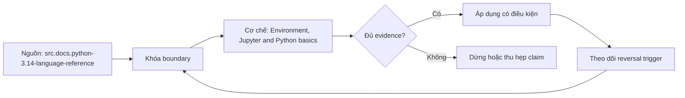

# Environment, Jupyter and Python basics

**Tóm tắt bản chất:** Cài Python, môi trường ảo và vấn đề xung đột phiên bản thư viện mà môi trường ảo giải quyết. Jupyter Notebook và VS Code, cùng điều kiện chọn giữa hai công cụ. Kiểu dữ liệu cơ bản và sai số của số dấu phẩy động trong tính toán tiền tệ. Bốn cấu trúc dữ liệu `list`, `dict`, `set`, `tuple` và tiêu chí chọn theo thao tác cần thực hiện. Điều kiện, vòng lặp, hiểu danh sách. Hàm. Điểm quyết định là giữ đúng population, grain, thời gian và oracle trước khi tin output.

## Problem Definition and Operational Relevance

L069 bắt đầu từ một lỗi rất thực dụng: analyst có thể tạo được file, query hoặc dashboard đúng cú pháp nhưng không trả lời đúng câu hỏi. Với **Environment, Jupyter and Python basics**, hậu quả xuất hiện ở người ra quyết định; họ hành động trên một con số không còn truy được về population, grain hoặc assumption ban đầu.

Roadmap đặt chuẩn đầu ra như sau: Viết script Python đọc một tệp dữ liệu và tính các chỉ số cơ bản, cho kết quả khớp với kết quả tính bằng SQL trên cùng dữ liệu. Đây là năng lực quan sát được, không phải yêu cầu nhớ thuật ngữ. Nếu bằng chứng không cho reviewer tái hiện cùng kết luận, bài vẫn chưa đạt dù output nhìn hợp lý.

## Mechanism

Cài Python, môi trường ảo và vấn đề xung đột phiên bản thư viện mà môi trường ảo giải quyết. Jupyter Notebook và VS Code, cùng điều kiện chọn giữa hai công cụ. Kiểu dữ liệu cơ bản và sai số của số dấu phẩy động trong tính toán tiền tệ. Bốn cấu trúc dữ liệu `list`, `dict`, `set`, `tuple` và tiêu chí chọn theo thao tác cần thực hiện. Điều kiện, vòng lặp, hiểu danh sách. Hàm.

Cơ chế của `environment-jupyter-and-python-basics` được kiểm qua năm lớp: input và population; identity và grain; transformation; time boundary; consumer-visible output. Mỗi lớp cần một invariant ngắn, một failure có chủ ý và một phép đối soát độc lập. Command chạy thành công chỉ chứng minh execution; nó không chứng minh semantics.

Lỗi cần loại trừ trong bài này là: Dùng `float` cho giá trị tiền tệ · cài thư viện vào môi trường toàn cục · so sánh chuỗi mà không chuẩn hoá khoảng trắng. Tách các lỗi ấy thành fixture riêng giúp chẩn đoán nguyên nhân thay vì sửa nhiều biến cùng lúc.

## Decision Framework

| Dấu hiệu | Quyết định | Bằng chứng bắt buộc |
|---|---|---|
| Population và grain rõ | Tiếp tục xử lý | Row count, uniqueness, control total |
| Assumption đổi nghĩa kết quả | Dừng và xác minh | Owner cùng impact-if-wrong |
| Dữ liệu thiếu nhưng đo được coverage | Phân tích có điều kiện | Missing report và limitation |
| Hai đường tính không khớp | Truy ngược boundary | Snapshot và reconciliation |
| Deadline không đủ cho phép kiểm | Co phạm vi | Non-goal và câu trả lời tạm thời |

Quy tắc của L069: chọn phương án đơn giản nhất vẫn giữ được điều kiện hoàn thành Script chạy được trong môi trường ảo, và kết quả khớp với truy vấn SQL tương ứng trên cùng dữ liệu.. Không dùng độ phức tạp để che một câu hỏi chưa rõ.

## Worked Case: Environment, Jupyter and Python basics

Bài thực hành dùng nhiệm vụ thật của roadmap: Đọc `orders.csv` bằng thư viện chuẩn `csv`. Đếm bản ghi theo trạng thái. Tìm bản ghi có giá trị bất thường. Đối chiếu kết quả với truy vấn SQL tương ứng.

Trước khi thao tác ở `Environment, Jupyter and Python basics`, learner ghi expected result, grain, identity, cutoff và phép kiểm. Sau thao tác, họ giữ raw output cùng một oracle khác đường triển khai. Nếu hai đường không khớp, discrepancy trở thành kết quả cần điều tra; không được sửa expected cho giống output vừa thấy.

Biến thể khó hơn đổi một constraint: dữ liệu có bản ghi trùng, đến muộn, thiếu khóa hoặc có nhiều dòng con cho một thực thể. L069 chỉ được xem là transfer khi learner tự nhận ra phép tính nào không còn hợp lệ và thiết kế lại boundary mà không cần chép case mẫu.

## Limits and Common Errors

**Hiểu lầm:** Output của `Environment, Jupyter and Python basics` chạy được nghĩa là kết luận đúng. **Thực tế:** syntax không kiểm population, grain, cutoff hay định nghĩa nghiệp vụ. **Vì sao nghe hợp lý:** công cụ trả kết quả cụ thể và không hiển thị assumption đã bị bỏ qua.

**Hiểu lầm:** Thêm nhiều bước kiểm luôn làm phân tích đáng tin hơn. **Thực tế:** hai phép kiểm dùng chung dữ liệu và cùng logic có thể sai giống nhau. **Vì sao nghe hợp lý:** số lượng test tạo cảm giác độc lập dù oracle không độc lập.

**Hiểu lầm:** Có thể sửa edge case sau khi hoàn thành happy path. **Thực tế:** Dùng `float` cho giá trị tiền tệ · cài thư viện vào môi trường toàn cục · so sánh chuỗi mà không chuẩn hoá khoảng trắng. **Vì sao nghe hợp lý:** dữ liệu mẫu nhỏ thường không chạm fan-out, missing, skew, late arrival hoặc changed constraint.

## Nếu Bạn Dạy Lại Điều Này...

Mở đầu L069 bằng một output trông hợp lý nhưng sai đúng một invariant. Người học viết dự đoán trước khi xem cơ chế. Exercise seed đổi duy nhất một constraint và yêu cầu họ nói rõ quyết định giữ nguyên hay đảo, cùng evidence đủ mạnh để thuyết phục reviewer.

## Ma trận kiểm chứng

### Probe 1: population

**Mệnh đề của probe 1: `population`.** Cài Python, môi trường ảo và vấn đề xung đột phiên bản thư viện mà môi trường ảo giải quyết. Jupyter Notebook và VS Code, cùng điều kiện chọn giữa hai công cụ. Kiểu dữ liệu cơ bản và sai số của số dấu phẩy động trong tính toán tiền tệ. Bốn cấu trúc dữ liệu `list`, `dict`, `set`, `tuple` và tiêu chí chọn theo thao tác cần thực hiện. Điều kiện, vòng lặp, hiểu danh sách. Hàm.

**Thiết kế.** Probe 1 của L069 tạo fixture nhỏ cho `population` với một control và một bản ghi chỉ khác tại boundary đang xét. Expected result được khóa trước execution; snapshot, version, identity và state ban đầu đi cùng artifact.

**Oracle L069.1.** Đối soát `population` bằng đường tính khác implementation chính của `environment-jupyter-and-python-basics`. Giữ command, raw observation, before/after counts và limitation. Probe chỉ đạt khi reviewer đi từ fixture tới cùng kết luận mà không hỏi tác giả đã chọn mặc định nào.

### Probe 2: grain

**Mệnh đề của probe 2: `grain`.** Viết script Python đọc một tệp dữ liệu và tính các chỉ số cơ bản, cho kết quả khớp với kết quả tính bằng SQL trên cùng dữ liệu.

**Thiết kế.** Probe 2 của L069 tạo fixture nhỏ cho `grain` với một control và một bản ghi chỉ khác tại boundary đang xét. Expected result được khóa trước execution; snapshot, version, identity và state ban đầu đi cùng artifact.

**Oracle L069.2.** Đối soát `grain` bằng đường tính khác implementation chính của `environment-jupyter-and-python-basics`. Giữ command, raw observation, before/after counts và limitation. Probe chỉ đạt khi reviewer đi từ fixture tới cùng kết luận mà không hỏi tác giả đã chọn mặc định nào.

### Probe 3: identity

**Mệnh đề của probe 3: `identity`.** Dùng `float` cho giá trị tiền tệ · cài thư viện vào môi trường toàn cục · so sánh chuỗi mà không chuẩn hoá khoảng trắng.

**Thiết kế.** Probe 3 của L069 tạo fixture nhỏ cho `identity` với một control và một bản ghi chỉ khác tại boundary đang xét. Expected result được khóa trước execution; snapshot, version, identity và state ban đầu đi cùng artifact.

**Oracle L069.3.** Đối soát `identity` bằng đường tính khác implementation chính của `environment-jupyter-and-python-basics`. Giữ command, raw observation, before/after counts và limitation. Probe chỉ đạt khi reviewer đi từ fixture tới cùng kết luận mà không hỏi tác giả đã chọn mặc định nào.

### Probe 4: time cutoff

**Mệnh đề của probe 4: `time cutoff`.** Script chạy được trong môi trường ảo, và kết quả khớp với truy vấn SQL tương ứng trên cùng dữ liệu.

**Thiết kế.** Probe 4 của L069 tạo fixture nhỏ cho `time cutoff` với một control và một bản ghi chỉ khác tại boundary đang xét. Expected result được khóa trước execution; snapshot, version, identity và state ban đầu đi cùng artifact.

**Oracle L069.4.** Đối soát `time cutoff` bằng đường tính khác implementation chính của `environment-jupyter-and-python-basics`. Giữ command, raw observation, before/after counts và limitation. Probe chỉ đạt khi reviewer đi từ fixture tới cùng kết luận mà không hỏi tác giả đã chọn mặc định nào.

### Probe 5: missing versus zero

**Mệnh đề của probe 5: `missing versus zero`.** Cài Python, môi trường ảo và vấn đề xung đột phiên bản thư viện mà môi trường ảo giải quyết. Jupyter Notebook và VS Code, cùng điều kiện chọn giữa hai công cụ. Kiểu dữ liệu cơ bản và sai số của số dấu phẩy động trong tính toán tiền tệ. Bốn cấu trúc dữ liệu `list`, `dict`, `set`, `tuple` và tiêu chí chọn theo thao tác cần thực hiện. Điều kiện, vòng lặp, hiểu danh sách. Hàm.

**Thiết kế.** Probe 5 của L069 tạo fixture nhỏ cho `missing versus zero` với một control và một bản ghi chỉ khác tại boundary đang xét. Expected result được khóa trước execution; snapshot, version, identity và state ban đầu đi cùng artifact.

**Oracle L069.5.** Đối soát `missing versus zero` bằng đường tính khác implementation chính của `environment-jupyter-and-python-basics`. Giữ command, raw observation, before/after counts và limitation. Probe chỉ đạt khi reviewer đi từ fixture tới cùng kết luận mà không hỏi tác giả đã chọn mặc định nào.

### Probe 6: duplicate

**Mệnh đề của probe 6: `duplicate`.** Viết script Python đọc một tệp dữ liệu và tính các chỉ số cơ bản, cho kết quả khớp với kết quả tính bằng SQL trên cùng dữ liệu.

**Thiết kế.** Probe 6 của L069 tạo fixture nhỏ cho `duplicate` với một control và một bản ghi chỉ khác tại boundary đang xét. Expected result được khóa trước execution; snapshot, version, identity và state ban đầu đi cùng artifact.

**Oracle L069.6.** Đối soát `duplicate` bằng đường tính khác implementation chính của `environment-jupyter-and-python-basics`. Giữ command, raw observation, before/after counts và limitation. Probe chỉ đạt khi reviewer đi từ fixture tới cùng kết luận mà không hỏi tác giả đã chọn mặc định nào.

### Probe 7: join fan-out

**Mệnh đề của probe 7: `join fan-out`.** Dùng `float` cho giá trị tiền tệ · cài thư viện vào môi trường toàn cục · so sánh chuỗi mà không chuẩn hoá khoảng trắng.

**Thiết kế.** Probe 7 của L069 tạo fixture nhỏ cho `join fan-out` với một control và một bản ghi chỉ khác tại boundary đang xét. Expected result được khóa trước execution; snapshot, version, identity và state ban đầu đi cùng artifact.

**Oracle L069.7.** Đối soát `join fan-out` bằng đường tính khác implementation chính của `environment-jupyter-and-python-basics`. Giữ command, raw observation, before/after counts và limitation. Probe chỉ đạt khi reviewer đi từ fixture tới cùng kết luận mà không hỏi tác giả đã chọn mặc định nào.

### Probe 8: changed definition

**Mệnh đề của probe 8: `changed definition`.** Script chạy được trong môi trường ảo, và kết quả khớp với truy vấn SQL tương ứng trên cùng dữ liệu.

**Thiết kế.** Probe 8 của L069 tạo fixture nhỏ cho `changed definition` với một control và một bản ghi chỉ khác tại boundary đang xét. Expected result được khóa trước execution; snapshot, version, identity và state ban đầu đi cùng artifact.

**Oracle L069.8.** Đối soát `changed definition` bằng đường tính khác implementation chính của `environment-jupyter-and-python-basics`. Giữ command, raw observation, before/after counts và limitation. Probe chỉ đạt khi reviewer đi từ fixture tới cùng kết luận mà không hỏi tác giả đã chọn mặc định nào.

### Probe 9: independent oracle

**Mệnh đề của probe 9: `independent oracle`.** Cài Python, môi trường ảo và vấn đề xung đột phiên bản thư viện mà môi trường ảo giải quyết. Jupyter Notebook và VS Code, cùng điều kiện chọn giữa hai công cụ. Kiểu dữ liệu cơ bản và sai số của số dấu phẩy động trong tính toán tiền tệ. Bốn cấu trúc dữ liệu `list`, `dict`, `set`, `tuple` và tiêu chí chọn theo thao tác cần thực hiện. Điều kiện, vòng lặp, hiểu danh sách. Hàm.

**Thiết kế.** Probe 9 của L069 tạo fixture nhỏ cho `independent oracle` với một control và một bản ghi chỉ khác tại boundary đang xét. Expected result được khóa trước execution; snapshot, version, identity và state ban đầu đi cùng artifact.

**Oracle L069.9.** Đối soát `independent oracle` bằng đường tính khác implementation chính của `environment-jupyter-and-python-basics`. Giữ command, raw observation, before/after counts và limitation. Probe chỉ đạt khi reviewer đi từ fixture tới cùng kết luận mà không hỏi tác giả đã chọn mặc định nào.

### Probe 10: replay

**Mệnh đề của probe 10: `replay`.** Viết script Python đọc một tệp dữ liệu và tính các chỉ số cơ bản, cho kết quả khớp với kết quả tính bằng SQL trên cùng dữ liệu.

**Thiết kế.** Probe 10 của L069 tạo fixture nhỏ cho `replay` với một control và một bản ghi chỉ khác tại boundary đang xét. Expected result được khóa trước execution; snapshot, version, identity và state ban đầu đi cùng artifact.

**Oracle L069.10.** Đối soát `replay` bằng đường tính khác implementation chính của `environment-jupyter-and-python-basics`. Giữ command, raw observation, before/after counts và limitation. Probe chỉ đạt khi reviewer đi từ fixture tới cùng kết luận mà không hỏi tác giả đã chọn mặc định nào.

### Probe 11: fresh snapshot

**Mệnh đề của probe 11: `fresh snapshot`.** Dùng `float` cho giá trị tiền tệ · cài thư viện vào môi trường toàn cục · so sánh chuỗi mà không chuẩn hoá khoảng trắng.

**Thiết kế.** Probe 11 của L069 tạo fixture nhỏ cho `fresh snapshot` với một control và một bản ghi chỉ khác tại boundary đang xét. Expected result được khóa trước execution; snapshot, version, identity và state ban đầu đi cùng artifact.

**Oracle L069.11.** Đối soát `fresh snapshot` bằng đường tính khác implementation chính của `environment-jupyter-and-python-basics`. Giữ command, raw observation, before/after counts và limitation. Probe chỉ đạt khi reviewer đi từ fixture tới cùng kết luận mà không hỏi tác giả đã chọn mặc định nào.

### Probe 12: novel scenario

**Mệnh đề của probe 12: `novel scenario`.** Script chạy được trong môi trường ảo, và kết quả khớp với truy vấn SQL tương ứng trên cùng dữ liệu.

**Thiết kế.** Probe 12 của L069 tạo fixture nhỏ cho `novel scenario` với một control và một bản ghi chỉ khác tại boundary đang xét. Expected result được khóa trước execution; snapshot, version, identity và state ban đầu đi cùng artifact.

**Oracle L069.12.** Đối soát `novel scenario` bằng đường tính khác implementation chính của `environment-jupyter-and-python-basics`. Giữ command, raw observation, before/after counts và limitation. Probe chỉ đạt khi reviewer đi từ fixture tới cùng kết luận mà không hỏi tác giả đã chọn mặc định nào.

## Tự Kiểm Tra Nhanh

1. Năng lực nào phải chứng minh ở L069?

<details><summary>Đáp án</summary>

Viết script Python đọc một tệp dữ liệu và tính các chỉ số cơ bản, cho kết quả khớp với kết quả tính bằng SQL trên cùng dữ liệu.

</details>

2. Failure nào phải chủ động cài vào fixture?

<details><summary>Đáp án</summary>

Dùng `float` cho giá trị tiền tệ · cài thư viện vào môi trường toàn cục · so sánh chuỗi mà không chuẩn hoá khoảng trắng.

</details>

3. Khi nào bài được xem là hoàn thành?

<details><summary>Đáp án</summary>

Script chạy được trong môi trường ảo, và kết quả khớp với truy vấn SQL tương ứng trên cùng dữ liệu.

</details>

## Giới hạn và điều chưa cho phép kết luận

- Case và probe là protocol giảng dạy; chưa phải quan sát production.
- Con số minh họa không phải benchmark ngành.
- Concept key `ck.da.environment-jupyter-and-python-basics` đã được owner phê duyệt `canonical`; note thuộc canonical registry coverage. Trạng thái này không tự chứng minh learner mastery.
- Note tồn tại không phải bằng chứng learner đã thành thạo.

## Reference
1. [[SRC-PYTHON-314-LANGUAGE-REFERENCE]]: `src.docs.python-3.14-language-reference`
2. [[SRC-PYTHON-314-STDLIB-RUNTIME]]: `src.docs.python-3.14-stdlib-runtime`

## Source coverage

| Source slice | Locator | Kiến thức phải giữ | Vị trí | Trạng thái | Ngoài phạm vi |
|---|---|---|---|---|---|
| [[SRC-PYTHON-314-LANGUAGE-REFERENCE]]: `src.docs.python-3.14-language-reference` | Source record và phạm vi đọc đã đăng ký | Cơ chế liên quan tới Environment, Jupyter and Python basics | các mục cơ chế, case và probe | Đã phủ | ngoài objective L069 |
| [[SRC-PYTHON-314-STDLIB-RUNTIME]]: `src.docs.python-3.14-stdlib-runtime` | Source record và phạm vi đọc đã đăng ký | Cơ chế liên quan tới Environment, Jupyter and Python basics | các mục cơ chế, case và probe | Đã phủ | ngoài objective L069 |

## Key takeaways
- Viết script Python đọc một tệp dữ liệu và tính các chỉ số cơ bản, cho kết quả khớp với kết quả tính bằng SQL trên cùng dữ liệu.
- Script chạy được trong môi trường ảo, và kết quả khớp với truy vấn SQL tương ứng trên cùng dữ liệu.
- Kết luận chỉ có nghĩa trong population, grain, time và version đã công bố.
- Note tiếp theo được nối bằng `prerequisite_of`; mastery cần learner artifact riêng.

<!-- ATOMIC-EXECUTION-CAPSULE:START -->

## Execution capsule: kiểm chứng `wiki.da.environment-jupyter-and-python-basics`

> [!important] Phân loại mệnh đề
> Với `wiki.da.environment-jupyter-and-python-basics`, sơ đồ, ví dụ và artifact về **Environment, Jupyter and Python basics** là **synthesis để kiểm chứng**; chúng không phải trích dẫn hay case nguyên văn của nguồn.

### Sơ đồ cơ chế và điểm kiểm soát



Đọc sơ đồ `wiki.da.environment-jupyter-and-python-basics` từ trái sang phải: source chỉ cung cấp claim ban đầu cho **Environment, Jupyter and Python basics**; quyết định chỉ được đi tiếp sau khi boundary, evidence và điều kiện đảo quyết định đã hiện hữu.

### Artifact thực thi tối thiểu

```python
from dataclasses import dataclass

@dataclass(frozen=True)
class WikiDaEnvironmentJupyterAndPythonBasicsEvidence:
    boundary_declared: bool
    independent_oracle: bool
    reversal_trigger: str

    def accepted(self) -> bool:
        return (
            self.boundary_declared
            and self.independent_oracle
            and bool(self.reversal_trigger.strip())
        )

# Concept: Environment, Jupyter and Python basics
# Primary question: Làm sao áp dụng Environment, Jupyter and Python basics và chứng minh kết quả không xanh giả?
evidence = WikiDaEnvironmentJupyterAndPythonBasicsEvidence(
    boundary_declared=True,
    independent_oracle=True,
    reversal_trigger="Đảo quyết định khi hard constraint bị vi phạm",
)
assert evidence.accepted()
```

Artifact của `wiki.da.environment-jupyter-and-python-basics` buộc người dùng ghi boundary, oracle và reversal trigger cho **Environment, Jupyter and Python basics**. Các giá trị minh họa phải được thay bằng evidence thật trước khi dùng cho quyết định.

<!-- ATOMIC-EXECUTION-CAPSULE:END -->
