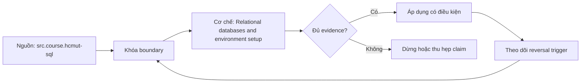

# Relational databases and environment setup

**Tóm tắt bản chất:** Bốn thuộc tính mà bảng tính không cung cấp: truy cập đồng thời, toàn vẹn tham chiếu, quy mô, dấu vết kiểm toán. Bảng, dòng, cột, khoá chính, khoá ngoại. Bốn đảm bảo ACID giải thích bằng phản ví dụ giao dịch chuyển tiền bị ngắt giữa chừng. Kiểu dữ liệu và chi phí của việc chọn sai kiểu. Cài đặt PostgreSQL và DBeaver. Điểm quyết định là giữ đúng population, grain, thời gian và oracle trước khi tin output.

## Problem Definition and Operational Relevance

L017 bắt đầu từ một lỗi rất thực dụng: analyst có thể tạo được file, query hoặc dashboard đúng cú pháp nhưng không trả lời đúng câu hỏi. Với **Relational databases and environment setup**, hậu quả xuất hiện ở người ra quyết định; họ hành động trên một con số không còn truy được về population, grain hoặc assumption ban đầu.

Roadmap đặt chuẩn đầu ra như sau: Dựng được môi trường chạy trên máy cá nhân, nạp dữ liệu từ script, và xác nhận số bảng và số dòng khớp với giá trị công bố. Đây là năng lực quan sát được, không phải yêu cầu nhớ thuật ngữ. Nếu bằng chứng không cho reviewer tái hiện cùng kết luận, bài vẫn chưa đạt dù output nhìn hợp lý.

## Mechanism

Bốn thuộc tính mà bảng tính không cung cấp: truy cập đồng thời, toàn vẹn tham chiếu, quy mô, dấu vết kiểm toán. Bảng, dòng, cột, khoá chính, khoá ngoại. Bốn đảm bảo ACID giải thích bằng phản ví dụ giao dịch chuyển tiền bị ngắt giữa chừng. Kiểu dữ liệu và chi phí của việc chọn sai kiểu. Cài đặt PostgreSQL và DBeaver.

Cơ chế của `relational-databases-and-environment-setup` được kiểm qua năm lớp: input và population; identity và grain; transformation; time boundary; consumer-visible output. Mỗi lớp cần một invariant ngắn, một failure có chủ ý và một phép đối soát độc lập. Command chạy thành công chỉ chứng minh execution; nó không chứng minh semantics.

Lỗi cần loại trừ trong bài này là: Cài bản có thành phần không cần thiết · không ghi lại mật khẩu superuser lúc cài · dùng kiểu chuỗi cho mọi cột. Tách các lỗi ấy thành fixture riêng giúp chẩn đoán nguyên nhân thay vì sửa nhiều biến cùng lúc.

## Decision Framework

| Dấu hiệu | Quyết định | Bằng chứng bắt buộc |
|---|---|---|
| Population và grain rõ | Tiếp tục xử lý | Row count, uniqueness, control total |
| Assumption đổi nghĩa kết quả | Dừng và xác minh | Owner cùng impact-if-wrong |
| Dữ liệu thiếu nhưng đo được coverage | Phân tích có điều kiện | Missing report và limitation |
| Hai đường tính không khớp | Truy ngược boundary | Snapshot và reconciliation |
| Deadline không đủ cho phép kiểm | Co phạm vi | Non-goal và câu trả lời tạm thời |

Quy tắc của L017: chọn phương án đơn giản nhất vẫn giữ được điều kiện hoàn thành `DS1` nạp xong, số bảng bằng 8 và số dòng khớp giá trị ở phụ lục C.. Không dùng độ phức tạp để che một câu hỏi chưa rõ.

## Worked Case: Relational databases and environment setup

Bài thực hành dùng nhiệm vụ thật của roadmap: Cài đặt PostgreSQL và DBeaver. Nạp `DS1` từ script. Chạy `SELECT` đầu tiên. Tự kiểm tra số bảng và số dòng so với giá trị công bố ở phụ lục C.

Trước khi thao tác ở `Relational databases and environment setup`, learner ghi expected result, grain, identity, cutoff và phép kiểm. Sau thao tác, họ giữ raw output cùng một oracle khác đường triển khai. Nếu hai đường không khớp, discrepancy trở thành kết quả cần điều tra; không được sửa expected cho giống output vừa thấy.

Biến thể khó hơn đổi một constraint: dữ liệu có bản ghi trùng, đến muộn, thiếu khóa hoặc có nhiều dòng con cho một thực thể. L017 chỉ được xem là transfer khi learner tự nhận ra phép tính nào không còn hợp lệ và thiết kế lại boundary mà không cần chép case mẫu.

## Limits and Common Errors

**Hiểu lầm:** Output của `Relational databases and environment setup` chạy được nghĩa là kết luận đúng. **Thực tế:** syntax không kiểm population, grain, cutoff hay định nghĩa nghiệp vụ. **Vì sao nghe hợp lý:** công cụ trả kết quả cụ thể và không hiển thị assumption đã bị bỏ qua.

**Hiểu lầm:** Thêm nhiều bước kiểm luôn làm phân tích đáng tin hơn. **Thực tế:** hai phép kiểm dùng chung dữ liệu và cùng logic có thể sai giống nhau. **Vì sao nghe hợp lý:** số lượng test tạo cảm giác độc lập dù oracle không độc lập.

**Hiểu lầm:** Có thể sửa edge case sau khi hoàn thành happy path. **Thực tế:** Cài bản có thành phần không cần thiết · không ghi lại mật khẩu superuser lúc cài · dùng kiểu chuỗi cho mọi cột. **Vì sao nghe hợp lý:** dữ liệu mẫu nhỏ thường không chạm fan-out, missing, skew, late arrival hoặc changed constraint.

## Nếu Bạn Dạy Lại Điều Này...

Mở đầu L017 bằng một output trông hợp lý nhưng sai đúng một invariant. Người học viết dự đoán trước khi xem cơ chế. Exercise seed đổi duy nhất một constraint và yêu cầu họ nói rõ quyết định giữ nguyên hay đảo, cùng evidence đủ mạnh để thuyết phục reviewer.

## Ma trận kiểm chứng

### Probe 1: population

**Mệnh đề của probe 1: `population`.** Bốn thuộc tính mà bảng tính không cung cấp: truy cập đồng thời, toàn vẹn tham chiếu, quy mô, dấu vết kiểm toán. Bảng, dòng, cột, khoá chính, khoá ngoại. Bốn đảm bảo ACID giải thích bằng phản ví dụ giao dịch chuyển tiền bị ngắt giữa chừng. Kiểu dữ liệu và chi phí của việc chọn sai kiểu. Cài đặt PostgreSQL và DBeaver.

**Thiết kế.** Probe 1 của L017 tạo fixture nhỏ cho `population` với một control và một bản ghi chỉ khác tại boundary đang xét. Expected result được khóa trước execution; snapshot, version, identity và state ban đầu đi cùng artifact.

**Oracle L017.1.** Đối soát `population` bằng đường tính khác implementation chính của `relational-databases-and-environment-setup`. Giữ command, raw observation, before/after counts và limitation. Probe chỉ đạt khi reviewer đi từ fixture tới cùng kết luận mà không hỏi tác giả đã chọn mặc định nào.

### Probe 2: grain

**Mệnh đề của probe 2: `grain`.** Dựng được môi trường chạy trên máy cá nhân, nạp dữ liệu từ script, và xác nhận số bảng và số dòng khớp với giá trị công bố.

**Thiết kế.** Probe 2 của L017 tạo fixture nhỏ cho `grain` với một control và một bản ghi chỉ khác tại boundary đang xét. Expected result được khóa trước execution; snapshot, version, identity và state ban đầu đi cùng artifact.

**Oracle L017.2.** Đối soát `grain` bằng đường tính khác implementation chính của `relational-databases-and-environment-setup`. Giữ command, raw observation, before/after counts và limitation. Probe chỉ đạt khi reviewer đi từ fixture tới cùng kết luận mà không hỏi tác giả đã chọn mặc định nào.

### Probe 3: identity

**Mệnh đề của probe 3: `identity`.** Cài bản có thành phần không cần thiết · không ghi lại mật khẩu superuser lúc cài · dùng kiểu chuỗi cho mọi cột.

**Thiết kế.** Probe 3 của L017 tạo fixture nhỏ cho `identity` với một control và một bản ghi chỉ khác tại boundary đang xét. Expected result được khóa trước execution; snapshot, version, identity và state ban đầu đi cùng artifact.

**Oracle L017.3.** Đối soát `identity` bằng đường tính khác implementation chính của `relational-databases-and-environment-setup`. Giữ command, raw observation, before/after counts và limitation. Probe chỉ đạt khi reviewer đi từ fixture tới cùng kết luận mà không hỏi tác giả đã chọn mặc định nào.

### Probe 4: time cutoff

**Mệnh đề của probe 4: `time cutoff`.** `DS1` nạp xong, số bảng bằng 8 và số dòng khớp giá trị ở phụ lục C.

**Thiết kế.** Probe 4 của L017 tạo fixture nhỏ cho `time cutoff` với một control và một bản ghi chỉ khác tại boundary đang xét. Expected result được khóa trước execution; snapshot, version, identity và state ban đầu đi cùng artifact.

**Oracle L017.4.** Đối soát `time cutoff` bằng đường tính khác implementation chính của `relational-databases-and-environment-setup`. Giữ command, raw observation, before/after counts và limitation. Probe chỉ đạt khi reviewer đi từ fixture tới cùng kết luận mà không hỏi tác giả đã chọn mặc định nào.

### Probe 5: missing versus zero

**Mệnh đề của probe 5: `missing versus zero`.** Bốn thuộc tính mà bảng tính không cung cấp: truy cập đồng thời, toàn vẹn tham chiếu, quy mô, dấu vết kiểm toán. Bảng, dòng, cột, khoá chính, khoá ngoại. Bốn đảm bảo ACID giải thích bằng phản ví dụ giao dịch chuyển tiền bị ngắt giữa chừng. Kiểu dữ liệu và chi phí của việc chọn sai kiểu. Cài đặt PostgreSQL và DBeaver.

**Thiết kế.** Probe 5 của L017 tạo fixture nhỏ cho `missing versus zero` với một control và một bản ghi chỉ khác tại boundary đang xét. Expected result được khóa trước execution; snapshot, version, identity và state ban đầu đi cùng artifact.

**Oracle L017.5.** Đối soát `missing versus zero` bằng đường tính khác implementation chính của `relational-databases-and-environment-setup`. Giữ command, raw observation, before/after counts và limitation. Probe chỉ đạt khi reviewer đi từ fixture tới cùng kết luận mà không hỏi tác giả đã chọn mặc định nào.

### Probe 6: duplicate

**Mệnh đề của probe 6: `duplicate`.** Dựng được môi trường chạy trên máy cá nhân, nạp dữ liệu từ script, và xác nhận số bảng và số dòng khớp với giá trị công bố.

**Thiết kế.** Probe 6 của L017 tạo fixture nhỏ cho `duplicate` với một control và một bản ghi chỉ khác tại boundary đang xét. Expected result được khóa trước execution; snapshot, version, identity và state ban đầu đi cùng artifact.

**Oracle L017.6.** Đối soát `duplicate` bằng đường tính khác implementation chính của `relational-databases-and-environment-setup`. Giữ command, raw observation, before/after counts và limitation. Probe chỉ đạt khi reviewer đi từ fixture tới cùng kết luận mà không hỏi tác giả đã chọn mặc định nào.

### Probe 7: join fan-out

**Mệnh đề của probe 7: `join fan-out`.** Cài bản có thành phần không cần thiết · không ghi lại mật khẩu superuser lúc cài · dùng kiểu chuỗi cho mọi cột.

**Thiết kế.** Probe 7 của L017 tạo fixture nhỏ cho `join fan-out` với một control và một bản ghi chỉ khác tại boundary đang xét. Expected result được khóa trước execution; snapshot, version, identity và state ban đầu đi cùng artifact.

**Oracle L017.7.** Đối soát `join fan-out` bằng đường tính khác implementation chính của `relational-databases-and-environment-setup`. Giữ command, raw observation, before/after counts và limitation. Probe chỉ đạt khi reviewer đi từ fixture tới cùng kết luận mà không hỏi tác giả đã chọn mặc định nào.

### Probe 8: changed definition

**Mệnh đề của probe 8: `changed definition`.** `DS1` nạp xong, số bảng bằng 8 và số dòng khớp giá trị ở phụ lục C.

**Thiết kế.** Probe 8 của L017 tạo fixture nhỏ cho `changed definition` với một control và một bản ghi chỉ khác tại boundary đang xét. Expected result được khóa trước execution; snapshot, version, identity và state ban đầu đi cùng artifact.

**Oracle L017.8.** Đối soát `changed definition` bằng đường tính khác implementation chính của `relational-databases-and-environment-setup`. Giữ command, raw observation, before/after counts và limitation. Probe chỉ đạt khi reviewer đi từ fixture tới cùng kết luận mà không hỏi tác giả đã chọn mặc định nào.

### Probe 9: independent oracle

**Mệnh đề của probe 9: `independent oracle`.** Bốn thuộc tính mà bảng tính không cung cấp: truy cập đồng thời, toàn vẹn tham chiếu, quy mô, dấu vết kiểm toán. Bảng, dòng, cột, khoá chính, khoá ngoại. Bốn đảm bảo ACID giải thích bằng phản ví dụ giao dịch chuyển tiền bị ngắt giữa chừng. Kiểu dữ liệu và chi phí của việc chọn sai kiểu. Cài đặt PostgreSQL và DBeaver.

**Thiết kế.** Probe 9 của L017 tạo fixture nhỏ cho `independent oracle` với một control và một bản ghi chỉ khác tại boundary đang xét. Expected result được khóa trước execution; snapshot, version, identity và state ban đầu đi cùng artifact.

**Oracle L017.9.** Đối soát `independent oracle` bằng đường tính khác implementation chính của `relational-databases-and-environment-setup`. Giữ command, raw observation, before/after counts và limitation. Probe chỉ đạt khi reviewer đi từ fixture tới cùng kết luận mà không hỏi tác giả đã chọn mặc định nào.

### Probe 10: replay

**Mệnh đề của probe 10: `replay`.** Dựng được môi trường chạy trên máy cá nhân, nạp dữ liệu từ script, và xác nhận số bảng và số dòng khớp với giá trị công bố.

**Thiết kế.** Probe 10 của L017 tạo fixture nhỏ cho `replay` với một control và một bản ghi chỉ khác tại boundary đang xét. Expected result được khóa trước execution; snapshot, version, identity và state ban đầu đi cùng artifact.

**Oracle L017.10.** Đối soát `replay` bằng đường tính khác implementation chính của `relational-databases-and-environment-setup`. Giữ command, raw observation, before/after counts và limitation. Probe chỉ đạt khi reviewer đi từ fixture tới cùng kết luận mà không hỏi tác giả đã chọn mặc định nào.

### Probe 11: fresh snapshot

**Mệnh đề của probe 11: `fresh snapshot`.** Cài bản có thành phần không cần thiết · không ghi lại mật khẩu superuser lúc cài · dùng kiểu chuỗi cho mọi cột.

**Thiết kế.** Probe 11 của L017 tạo fixture nhỏ cho `fresh snapshot` với một control và một bản ghi chỉ khác tại boundary đang xét. Expected result được khóa trước execution; snapshot, version, identity và state ban đầu đi cùng artifact.

**Oracle L017.11.** Đối soát `fresh snapshot` bằng đường tính khác implementation chính của `relational-databases-and-environment-setup`. Giữ command, raw observation, before/after counts và limitation. Probe chỉ đạt khi reviewer đi từ fixture tới cùng kết luận mà không hỏi tác giả đã chọn mặc định nào.

### Probe 12: novel scenario

**Mệnh đề của probe 12: `novel scenario`.** `DS1` nạp xong, số bảng bằng 8 và số dòng khớp giá trị ở phụ lục C.

**Thiết kế.** Probe 12 của L017 tạo fixture nhỏ cho `novel scenario` với một control và một bản ghi chỉ khác tại boundary đang xét. Expected result được khóa trước execution; snapshot, version, identity và state ban đầu đi cùng artifact.

**Oracle L017.12.** Đối soát `novel scenario` bằng đường tính khác implementation chính của `relational-databases-and-environment-setup`. Giữ command, raw observation, before/after counts và limitation. Probe chỉ đạt khi reviewer đi từ fixture tới cùng kết luận mà không hỏi tác giả đã chọn mặc định nào.

## Tự Kiểm Tra Nhanh

1. Năng lực nào phải chứng minh ở L017?

<details><summary>Đáp án</summary>

Dựng được môi trường chạy trên máy cá nhân, nạp dữ liệu từ script, và xác nhận số bảng và số dòng khớp với giá trị công bố.

</details>

2. Failure nào phải chủ động cài vào fixture?

<details><summary>Đáp án</summary>

Cài bản có thành phần không cần thiết · không ghi lại mật khẩu superuser lúc cài · dùng kiểu chuỗi cho mọi cột.

</details>

3. Khi nào bài được xem là hoàn thành?

<details><summary>Đáp án</summary>

`DS1` nạp xong, số bảng bằng 8 và số dòng khớp giá trị ở phụ lục C.

</details>

## Giới hạn và điều chưa cho phép kết luận

- Case và probe là protocol giảng dạy; chưa phải quan sát production.
- Con số minh họa không phải benchmark ngành.
- Concept key `ck.da.relational-databases-and-environment-setup` đã được owner phê duyệt `canonical`; note thuộc canonical registry coverage. Trạng thái này không tự chứng minh learner mastery.
- Note tồn tại không phải bằng chứng learner đã thành thạo.

## Reference
1. [[SRC-HCMUT-SQL]]: `src.course.hcmut-sql`
2. [[SRC-SILBERSCHATZ-DATABASE-SYSTEM-CONCEPTS-7E]]: `src.book.silberschatz-database-system-concepts.7e`

## Source coverage

| Source slice | Locator | Kiến thức phải giữ | Vị trí | Trạng thái | Ngoài phạm vi |
|---|---|---|---|---|---|
| [[SRC-HCMUT-SQL]]: `src.course.hcmut-sql` | Source record và phạm vi đọc đã đăng ký | Cơ chế liên quan tới Relational databases and environment setup | các mục cơ chế, case và probe | Đã phủ | ngoài objective L017 |
| [[SRC-SILBERSCHATZ-DATABASE-SYSTEM-CONCEPTS-7E]]: `src.book.silberschatz-database-system-concepts.7e` | Source record và phạm vi đọc đã đăng ký | Cơ chế liên quan tới Relational databases and environment setup | các mục cơ chế, case và probe | Đã phủ | ngoài objective L017 |

## Key takeaways
- Dựng được môi trường chạy trên máy cá nhân, nạp dữ liệu từ script, và xác nhận số bảng và số dòng khớp với giá trị công bố.
- `DS1` nạp xong, số bảng bằng 8 và số dòng khớp giá trị ở phụ lục C.
- Kết luận chỉ có nghĩa trong population, grain, time và version đã công bố.
- Note tiếp theo được nối bằng `prerequisite_of`; mastery cần learner artifact riêng.

<!-- ATOMIC-EXECUTION-CAPSULE:START -->

## Execution capsule: kiểm chứng `wiki.da.relational-databases-and-environment-setup`

> [!important] Phân loại mệnh đề
> Với `wiki.da.relational-databases-and-environment-setup`, sơ đồ, ví dụ và artifact về **Relational databases and environment setup** là **synthesis để kiểm chứng**; chúng không phải trích dẫn hay case nguyên văn của nguồn.

### Sơ đồ cơ chế và điểm kiểm soát



Đọc sơ đồ `wiki.da.relational-databases-and-environment-setup` từ trái sang phải: source chỉ cung cấp claim ban đầu cho **Relational databases and environment setup**; quyết định chỉ được đi tiếp sau khi boundary, evidence và điều kiện đảo quyết định đã hiện hữu.

### Artifact thực thi tối thiểu

```sql
-- Verification harness for: Relational databases and environment setup
WITH evidence AS (
    SELECT 'wiki.da.relational-databases-and-environment-setup' AS concept_id,
           'boundary_declared' AS check_name, 1 AS passed
    UNION ALL
    SELECT 'wiki.da.relational-databases-and-environment-setup', 'independent_oracle', 1
    UNION ALL
    SELECT 'wiki.da.relational-databases-and-environment-setup', 'reversal_trigger_recorded', 1
)
SELECT concept_id,
       MIN(passed) AS all_hard_checks_pass,
       COUNT(*) AS evidence_items
FROM evidence
GROUP BY concept_id
HAVING MIN(passed) = 1;
```

Artifact của `wiki.da.relational-databases-and-environment-setup` buộc người dùng ghi boundary, oracle và reversal trigger cho **Relational databases and environment setup**. Các giá trị minh họa phải được thay bằng evidence thật trước khi dùng cho quyết định.

<!-- ATOMIC-EXECUTION-CAPSULE:END -->
