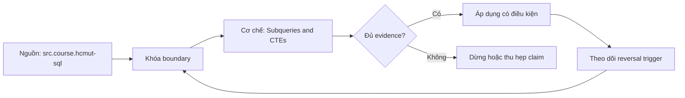

# Subqueries and CTEs

**Tóm tắt bản chất:** Ba vị trí đặt truy vấn con: trong `SELECT`, trong `FROM`, trong `WHERE`. Truy vấn con tương quan và chi phí thực thi của nó. Khác biệt ngữ nghĩa giữa `EXISTS`, `IN` và `JOIN` khi tập con chứa `NULL`. CTE với `WITH`: cú pháp, chuỗi nhiều CTE. Quy ước đặt tên CTE theo hạt của kết quả thay vì theo thao tác. Điểm quyết định là giữ đúng population, grain, thời gian và oracle trước khi tin output.

## Nỗi Đau & Động Lực

L025 bắt đầu từ một lỗi rất thực dụng: analyst có thể tạo được file, query hoặc dashboard đúng cú pháp nhưng không trả lời đúng câu hỏi. Với **Subqueries and CTEs**, hậu quả xuất hiện ở người ra quyết định; họ hành động trên một con số không còn truy được về population, grain hoặc assumption ban đầu.

Roadmap đặt chuẩn đầu ra như sau: Tái cấu trúc một truy vấn lồng nhiều tầng thành chuỗi CTE đặt tên theo hạt, giữ nguyên kết quả và đạt rà soát chéo về độ đọc được. Đây là năng lực quan sát được, không phải yêu cầu nhớ thuật ngữ. Nếu bằng chứng không cho reviewer tái hiện cùng kết luận, bài vẫn chưa đạt dù output nhìn hợp lý.

## Cơ Chế Tác Động

Ba vị trí đặt truy vấn con: trong `SELECT`, trong `FROM`, trong `WHERE`. Truy vấn con tương quan và chi phí thực thi của nó. Khác biệt ngữ nghĩa giữa `EXISTS`, `IN` và `JOIN` khi tập con chứa `NULL`. CTE với `WITH`: cú pháp, chuỗi nhiều CTE. Quy ước đặt tên CTE theo hạt của kết quả thay vì theo thao tác.

Cơ chế của `subqueries-and-ctes` được kiểm qua năm lớp: input và population; identity và grain; transformation; time boundary; consumer-visible output. Mỗi lớp cần một invariant ngắn, một failure có chủ ý và một phép đối soát độc lập. Command chạy thành công chỉ chứng minh execution; nó không chứng minh semantics.

Lỗi cần loại trừ trong bài này là: Đặt tên CTE theo thao tác nên tên không mang thông tin về hạt · dùng truy vấn con tương quan ở nơi `JOIN` làm được · thay `NOT EXISTS` bằng `NOT IN` trên tập có `NULL`. Tách các lỗi ấy thành fixture riêng giúp chẩn đoán nguyên nhân thay vì sửa nhiều biến cùng lúc.

## Bản Đồ Quyết Định

| Dấu hiệu | Quyết định | Bằng chứng bắt buộc |
|---|---|---|
| Population và grain rõ | Tiếp tục xử lý | Row count, uniqueness, control total |
| Assumption đổi nghĩa kết quả | Dừng và xác minh | Owner cùng impact-if-wrong |
| Dữ liệu thiếu nhưng đo được coverage | Phân tích có điều kiện | Missing report và limitation |
| Hai đường tính không khớp | Truy ngược boundary | Snapshot và reconciliation |
| Deadline không đủ cho phép kiểm | Co phạm vi | Non-goal và câu trả lời tạm thời |

Quy tắc của L025: chọn phương án đơn giản nhất vẫn giữ được điều kiện hoàn thành “Kết quả sau tái cấu trúc khớp từng dòng với kết quả gốc, và một học viên khác giải thích được luồng dữ liệu chỉ từ tên CTE.”. Không dùng độ phức tạp để che một câu hỏi chưa rõ.

## Case Study Thực Chiến: Subqueries and CTEs

Bài thực hành dùng nhiệm vụ thật của roadmap: Nhận một truy vấn 80 dòng lồng bốn tầng, tái cấu trúc thành 5 CTE. Sau đó làm chiều ngược lại: từ một bài toán mới, viết thẳng bằng CTE.

Trước khi thao tác ở `Subqueries and CTEs`, learner ghi expected result, grain, identity, cutoff và phép kiểm. Sau thao tác, họ giữ raw output cùng một oracle khác đường triển khai. Nếu hai đường không khớp, discrepancy trở thành kết quả cần điều tra; không được sửa expected cho giống output vừa thấy.

Biến thể khó hơn đổi một constraint: dữ liệu có bản ghi trùng, đến muộn, thiếu khóa hoặc có nhiều dòng con cho một thực thể. L025 chỉ được xem là transfer khi learner tự nhận ra phép tính nào không còn hợp lệ và thiết kế lại boundary mà không cần chép case mẫu.

## Góc Khuất & Ngộ Nhận

**Hiểu lầm:** Output của `Subqueries and CTEs` chạy được nghĩa là kết luận đúng. **Thực tế:** syntax không kiểm population, grain, cutoff hay định nghĩa nghiệp vụ. **Vì sao nghe hợp lý:** công cụ trả kết quả cụ thể và không hiển thị assumption đã bị bỏ qua.

**Hiểu lầm:** Thêm nhiều bước kiểm luôn làm phân tích đáng tin hơn. **Thực tế:** hai phép kiểm dùng chung dữ liệu và cùng logic có thể sai giống nhau. **Vì sao nghe hợp lý:** số lượng test tạo cảm giác độc lập dù oracle không độc lập.

**Hiểu lầm:** Có thể sửa edge case sau khi hoàn thành happy path. **Thực tế:** Đặt tên CTE theo thao tác nên tên không mang thông tin về hạt · dùng truy vấn con tương quan ở nơi `JOIN` làm được · thay `NOT EXISTS` bằng `NOT IN` trên tập có `NULL`. **Vì sao nghe hợp lý:** dữ liệu mẫu nhỏ thường không chạm fan-out, missing, skew, late arrival hoặc changed constraint.

## Nếu Bạn Dạy Lại Điều Này...

Mở đầu L025 bằng một output trông hợp lý nhưng sai đúng một invariant. Người học viết dự đoán trước khi xem cơ chế. Exercise seed đổi duy nhất một constraint và yêu cầu họ nói rõ quyết định giữ nguyên hay đảo, cùng evidence đủ mạnh để thuyết phục reviewer.

## Ma trận kiểm chứng

### Probe 1: population

**Mệnh đề của probe 1 — `population`.** Ba vị trí đặt truy vấn con: trong `SELECT`, trong `FROM`, trong `WHERE`. Truy vấn con tương quan và chi phí thực thi của nó. Khác biệt ngữ nghĩa giữa `EXISTS`, `IN` và `JOIN` khi tập con chứa `NULL`. CTE với `WITH`: cú pháp, chuỗi nhiều CTE. Quy ước đặt tên CTE theo hạt của kết quả thay vì theo thao tác.

**Thiết kế.** Probe 1 của L025 tạo fixture nhỏ cho `population` với một control và một bản ghi chỉ khác tại boundary đang xét. Expected result được khóa trước execution; snapshot, version, identity và state ban đầu đi cùng artifact.

**Oracle L025.1.** Đối soát `population` bằng đường tính khác implementation chính của `subqueries-and-ctes`. Giữ command, raw observation, before/after counts và limitation. Probe chỉ đạt khi reviewer đi từ fixture tới cùng kết luận mà không hỏi tác giả đã chọn mặc định nào.

### Probe 2: grain

**Mệnh đề của probe 2 — `grain`.** Tái cấu trúc một truy vấn lồng nhiều tầng thành chuỗi CTE đặt tên theo hạt, giữ nguyên kết quả và đạt rà soát chéo về độ đọc được.

**Thiết kế.** Probe 2 của L025 tạo fixture nhỏ cho `grain` với một control và một bản ghi chỉ khác tại boundary đang xét. Expected result được khóa trước execution; snapshot, version, identity và state ban đầu đi cùng artifact.

**Oracle L025.2.** Đối soát `grain` bằng đường tính khác implementation chính của `subqueries-and-ctes`. Giữ command, raw observation, before/after counts và limitation. Probe chỉ đạt khi reviewer đi từ fixture tới cùng kết luận mà không hỏi tác giả đã chọn mặc định nào.

### Probe 3: identity

**Mệnh đề của probe 3 — `identity`.** Đặt tên CTE theo thao tác nên tên không mang thông tin về hạt · dùng truy vấn con tương quan ở nơi `JOIN` làm được · thay `NOT EXISTS` bằng `NOT IN` trên tập có `NULL`.

**Thiết kế.** Probe 3 của L025 tạo fixture nhỏ cho `identity` với một control và một bản ghi chỉ khác tại boundary đang xét. Expected result được khóa trước execution; snapshot, version, identity và state ban đầu đi cùng artifact.

**Oracle L025.3.** Đối soát `identity` bằng đường tính khác implementation chính của `subqueries-and-ctes`. Giữ command, raw observation, before/after counts và limitation. Probe chỉ đạt khi reviewer đi từ fixture tới cùng kết luận mà không hỏi tác giả đã chọn mặc định nào.

### Probe 4: time cutoff

**Mệnh đề của probe 4 — `time cutoff`.** Kết quả sau tái cấu trúc khớp từng dòng với kết quả gốc, và một học viên khác giải thích được luồng dữ liệu chỉ từ tên CTE.

**Thiết kế.** Probe 4 của L025 tạo fixture nhỏ cho `time cutoff` với một control và một bản ghi chỉ khác tại boundary đang xét. Expected result được khóa trước execution; snapshot, version, identity và state ban đầu đi cùng artifact.

**Oracle L025.4.** Đối soát `time cutoff` bằng đường tính khác implementation chính của `subqueries-and-ctes`. Giữ command, raw observation, before/after counts và limitation. Probe chỉ đạt khi reviewer đi từ fixture tới cùng kết luận mà không hỏi tác giả đã chọn mặc định nào.

### Probe 5: missing versus zero

**Mệnh đề của probe 5 — `missing versus zero`.** Ba vị trí đặt truy vấn con: trong `SELECT`, trong `FROM`, trong `WHERE`. Truy vấn con tương quan và chi phí thực thi của nó. Khác biệt ngữ nghĩa giữa `EXISTS`, `IN` và `JOIN` khi tập con chứa `NULL`. CTE với `WITH`: cú pháp, chuỗi nhiều CTE. Quy ước đặt tên CTE theo hạt của kết quả thay vì theo thao tác.

**Thiết kế.** Probe 5 của L025 tạo fixture nhỏ cho `missing versus zero` với một control và một bản ghi chỉ khác tại boundary đang xét. Expected result được khóa trước execution; snapshot, version, identity và state ban đầu đi cùng artifact.

**Oracle L025.5.** Đối soát `missing versus zero` bằng đường tính khác implementation chính của `subqueries-and-ctes`. Giữ command, raw observation, before/after counts và limitation. Probe chỉ đạt khi reviewer đi từ fixture tới cùng kết luận mà không hỏi tác giả đã chọn mặc định nào.

### Probe 6: duplicate

**Mệnh đề của probe 6 — `duplicate`.** Tái cấu trúc một truy vấn lồng nhiều tầng thành chuỗi CTE đặt tên theo hạt, giữ nguyên kết quả và đạt rà soát chéo về độ đọc được.

**Thiết kế.** Probe 6 của L025 tạo fixture nhỏ cho `duplicate` với một control và một bản ghi chỉ khác tại boundary đang xét. Expected result được khóa trước execution; snapshot, version, identity và state ban đầu đi cùng artifact.

**Oracle L025.6.** Đối soát `duplicate` bằng đường tính khác implementation chính của `subqueries-and-ctes`. Giữ command, raw observation, before/after counts và limitation. Probe chỉ đạt khi reviewer đi từ fixture tới cùng kết luận mà không hỏi tác giả đã chọn mặc định nào.

### Probe 7: join fan-out

**Mệnh đề của probe 7 — `join fan-out`.** Đặt tên CTE theo thao tác nên tên không mang thông tin về hạt · dùng truy vấn con tương quan ở nơi `JOIN` làm được · thay `NOT EXISTS` bằng `NOT IN` trên tập có `NULL`.

**Thiết kế.** Probe 7 của L025 tạo fixture nhỏ cho `join fan-out` với một control và một bản ghi chỉ khác tại boundary đang xét. Expected result được khóa trước execution; snapshot, version, identity và state ban đầu đi cùng artifact.

**Oracle L025.7.** Đối soát `join fan-out` bằng đường tính khác implementation chính của `subqueries-and-ctes`. Giữ command, raw observation, before/after counts và limitation. Probe chỉ đạt khi reviewer đi từ fixture tới cùng kết luận mà không hỏi tác giả đã chọn mặc định nào.

### Probe 8: changed definition

**Mệnh đề của probe 8 — `changed definition`.** Kết quả sau tái cấu trúc khớp từng dòng với kết quả gốc, và một học viên khác giải thích được luồng dữ liệu chỉ từ tên CTE.

**Thiết kế.** Probe 8 của L025 tạo fixture nhỏ cho `changed definition` với một control và một bản ghi chỉ khác tại boundary đang xét. Expected result được khóa trước execution; snapshot, version, identity và state ban đầu đi cùng artifact.

**Oracle L025.8.** Đối soát `changed definition` bằng đường tính khác implementation chính của `subqueries-and-ctes`. Giữ command, raw observation, before/after counts và limitation. Probe chỉ đạt khi reviewer đi từ fixture tới cùng kết luận mà không hỏi tác giả đã chọn mặc định nào.

### Probe 9: independent oracle

**Mệnh đề của probe 9 — `independent oracle`.** Ba vị trí đặt truy vấn con: trong `SELECT`, trong `FROM`, trong `WHERE`. Truy vấn con tương quan và chi phí thực thi của nó. Khác biệt ngữ nghĩa giữa `EXISTS`, `IN` và `JOIN` khi tập con chứa `NULL`. CTE với `WITH`: cú pháp, chuỗi nhiều CTE. Quy ước đặt tên CTE theo hạt của kết quả thay vì theo thao tác.

**Thiết kế.** Probe 9 của L025 tạo fixture nhỏ cho `independent oracle` với một control và một bản ghi chỉ khác tại boundary đang xét. Expected result được khóa trước execution; snapshot, version, identity và state ban đầu đi cùng artifact.

**Oracle L025.9.** Đối soát `independent oracle` bằng đường tính khác implementation chính của `subqueries-and-ctes`. Giữ command, raw observation, before/after counts và limitation. Probe chỉ đạt khi reviewer đi từ fixture tới cùng kết luận mà không hỏi tác giả đã chọn mặc định nào.

### Probe 10: replay

**Mệnh đề của probe 10 — `replay`.** Tái cấu trúc một truy vấn lồng nhiều tầng thành chuỗi CTE đặt tên theo hạt, giữ nguyên kết quả và đạt rà soát chéo về độ đọc được.

**Thiết kế.** Probe 10 của L025 tạo fixture nhỏ cho `replay` với một control và một bản ghi chỉ khác tại boundary đang xét. Expected result được khóa trước execution; snapshot, version, identity và state ban đầu đi cùng artifact.

**Oracle L025.10.** Đối soát `replay` bằng đường tính khác implementation chính của `subqueries-and-ctes`. Giữ command, raw observation, before/after counts và limitation. Probe chỉ đạt khi reviewer đi từ fixture tới cùng kết luận mà không hỏi tác giả đã chọn mặc định nào.

### Probe 11: fresh snapshot

**Mệnh đề của probe 11 — `fresh snapshot`.** Đặt tên CTE theo thao tác nên tên không mang thông tin về hạt · dùng truy vấn con tương quan ở nơi `JOIN` làm được · thay `NOT EXISTS` bằng `NOT IN` trên tập có `NULL`.

**Thiết kế.** Probe 11 của L025 tạo fixture nhỏ cho `fresh snapshot` với một control và một bản ghi chỉ khác tại boundary đang xét. Expected result được khóa trước execution; snapshot, version, identity và state ban đầu đi cùng artifact.

**Oracle L025.11.** Đối soát `fresh snapshot` bằng đường tính khác implementation chính của `subqueries-and-ctes`. Giữ command, raw observation, before/after counts và limitation. Probe chỉ đạt khi reviewer đi từ fixture tới cùng kết luận mà không hỏi tác giả đã chọn mặc định nào.

### Probe 12: novel scenario

**Mệnh đề của probe 12 — `novel scenario`.** Kết quả sau tái cấu trúc khớp từng dòng với kết quả gốc, và một học viên khác giải thích được luồng dữ liệu chỉ từ tên CTE.

**Thiết kế.** Probe 12 của L025 tạo fixture nhỏ cho `novel scenario` với một control và một bản ghi chỉ khác tại boundary đang xét. Expected result được khóa trước execution; snapshot, version, identity và state ban đầu đi cùng artifact.

**Oracle L025.12.** Đối soát `novel scenario` bằng đường tính khác implementation chính của `subqueries-and-ctes`. Giữ command, raw observation, before/after counts và limitation. Probe chỉ đạt khi reviewer đi từ fixture tới cùng kết luận mà không hỏi tác giả đã chọn mặc định nào.

## Tự Kiểm Tra Nhanh

1. Năng lực nào phải chứng minh ở L025?

<details><summary>Đáp án</summary>

Tái cấu trúc một truy vấn lồng nhiều tầng thành chuỗi CTE đặt tên theo hạt, giữ nguyên kết quả và đạt rà soát chéo về độ đọc được.

</details>

2. Failure nào phải chủ động cài vào fixture?

<details><summary>Đáp án</summary>

Đặt tên CTE theo thao tác nên tên không mang thông tin về hạt · dùng truy vấn con tương quan ở nơi `JOIN` làm được · thay `NOT EXISTS` bằng `NOT IN` trên tập có `NULL`.

</details>

3. Khi nào bài được xem là hoàn thành?

<details><summary>Đáp án</summary>

Kết quả sau tái cấu trúc khớp từng dòng với kết quả gốc, và một học viên khác giải thích được luồng dữ liệu chỉ từ tên CTE.

</details>

## Giới hạn và điều chưa cho phép kết luận

- Case và probe là protocol giảng dạy; chưa phải quan sát production.
- Con số minh họa không phải benchmark ngành.
- Concept key `ck.da.subqueries-and-ctes` đã được owner phê duyệt `canonical`; note thuộc canonical registry coverage. Trạng thái này không tự chứng minh learner mastery.
- Note tồn tại không phải bằng chứng learner đã thành thạo.

## Reference
1. [[SRC-HCMUT-SQL]] — `src.course.hcmut-sql`
2. [[SRC-SILBERSCHATZ-DATABASE-SYSTEM-CONCEPTS-7E]] — `src.book.silberschatz-database-system-concepts.7e`

## Source coverage

| Source slice | Locator | Kiến thức phải giữ | Vị trí | Trạng thái | Ngoài phạm vi |
|---|---|---|---|---|---|
| [[SRC-HCMUT-SQL]] — `src.course.hcmut-sql` | Source record và phạm vi đọc đã đăng ký | Cơ chế liên quan tới Subqueries and CTEs | các mục cơ chế, case và probe | Đã phủ | ngoài objective L025 |
| [[SRC-SILBERSCHATZ-DATABASE-SYSTEM-CONCEPTS-7E]] — `src.book.silberschatz-database-system-concepts.7e` | Source record và phạm vi đọc đã đăng ký | Cơ chế liên quan tới Subqueries and CTEs | các mục cơ chế, case và probe | Đã phủ | ngoài objective L025 |

## Key takeaways
- Tái cấu trúc một truy vấn lồng nhiều tầng thành chuỗi CTE đặt tên theo hạt, giữ nguyên kết quả và đạt rà soát chéo về độ đọc được.
- Kết quả sau tái cấu trúc khớp từng dòng với kết quả gốc, và một học viên khác giải thích được luồng dữ liệu chỉ từ tên CTE.
- Kết luận chỉ có nghĩa trong population, grain, time và version đã công bố.
- Note tiếp theo được nối bằng `prerequisite_of`; mastery cần learner artifact riêng.

<!-- ATOMIC-EXECUTION-CAPSULE:START -->

## Execution capsule — kiểm chứng `wiki.da.subqueries-and-ctes`

> [!important] Phân loại mệnh đề
> Với `wiki.da.subqueries-and-ctes`, sơ đồ, ví dụ và artifact về **Subqueries and CTEs** là **synthesis để kiểm chứng**; chúng không phải trích dẫn hay case nguyên văn của nguồn.

### Sơ đồ cơ chế và điểm kiểm soát



Đọc sơ đồ `wiki.da.subqueries-and-ctes` từ trái sang phải: source chỉ cung cấp claim ban đầu cho **Subqueries and CTEs**; quyết định chỉ được đi tiếp sau khi boundary, evidence và điều kiện đảo quyết định đã hiện hữu.

### Artifact thực thi tối thiểu

```sql
-- Verification harness for: Subqueries and CTEs
WITH evidence AS (
    SELECT 'wiki.da.subqueries-and-ctes' AS concept_id,
           'boundary_declared' AS check_name, 1 AS passed
    UNION ALL
    SELECT 'wiki.da.subqueries-and-ctes', 'independent_oracle', 1
    UNION ALL
    SELECT 'wiki.da.subqueries-and-ctes', 'reversal_trigger_recorded', 1
)
SELECT concept_id,
       MIN(passed) AS all_hard_checks_pass,
       COUNT(*) AS evidence_items
FROM evidence
GROUP BY concept_id
HAVING MIN(passed) = 1;
```

Artifact của `wiki.da.subqueries-and-ctes` buộc người dùng ghi boundary, oracle và reversal trigger cho **Subqueries and CTEs**. Các giá trị minh họa phải được thay bằng evidence thật trước khi dùng cho quyết định.

<!-- ATOMIC-EXECUTION-CAPSULE:END -->
