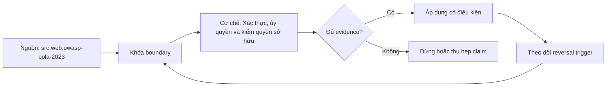

# Xác thực, ủy quyền và kiểm quyền sở hữu

> [!abstract] Câu hỏi trung tâm
> Một token hợp lệ chỉ cho biết credential vượt qua phép xác thực đã định. Nó không chứng minh caller được đọc object trong URL, được thực hiện action trên object đó, hay quyền vẫn còn hiệu lực theo policy hiện tại. API phải kiểm đủ ba lớp và chứng minh bằng negative test.

## 1. Ba câu hỏi khác nhau

| Câu hỏi | Cơ chế | Ví dụ outcome |
|---|---|---|
| Ai đang gọi? | authentication | subject `user-42` với issuer/audience hợp lệ |
| Subject được làm loại việc gì? | function/action authorization | role `analyst` được gọi `GET /reports` |
| Subject được làm việc đó trên object này không? | object/relationship authorization | `user-42` thuộc tenant của report và có quyền `report.read` |

Role đúng không suy ra ownership đúng. Một người dùng có role `customer` không vì thế được đọc mọi `/customers/{id}/orders/{order_id}`. Administrator cũng không mặc nhiên bỏ qua tenant boundary nếu policy không ghi rõ.

> [!source-fact]
> OWASP API1:2023 yêu cầu mọi endpoint nhận object ID và thực hiện action trên object phải có object-level authorization check; UUID hoặc ID khó đoán không thay kiểm quyền.

## 2. Authentication tạo principal, không tạo quyết định cuối

Authentication middleware nên xác minh credential và tạo principal chuẩn hóa gồm subject, tenant, authentication method, token/session ID, scopes và các claim đã được tin cậy. Nó phải kiểm issuer, audience, signature/MAC, expiry và các điều kiện protocol tương ứng.

Handler không đọc tùy ý claim chưa chuẩn hóa từ header. Reverse proxy phải xóa hoặc ký header identity do client có thể giả mạo. Principal là input cho authorization; không phải boolean `is_authenticated` duy nhất.

Authentication failure và authorization denial không nên lộ thêm thông tin hơn cần thiết. Tuy nhiên log nội bộ vẫn cần reason code có kiểm soát để phân biệt token hết hạn, sai audience, thiếu scope và object không thuộc caller.

## 3. Authorization phải chạy trên mọi request

Policy thay đổi, membership bị thu hồi và object đổi owner. Một lần kiểm lúc đăng nhập không đủ. Server phải xác minh quyền tại điểm dùng cho từng request hoặc dùng cache có semantics freshness rõ.

> [!source-fact]
> OWASP Authorization Cheat Sheet phân biệt authentication với authorization, khuyến nghị deny by default, kiểm quyền trên mọi request và thực thi server-side.

Ba default quan trọng:

1. không có rule cho action thì từ chối;
2. lỗi tải policy/relationship không biến thành allow;
3. đường vào mới không tự kế thừa quyền chỉ vì reuse handler.

## 4. Function-level và object-level phải cùng tồn tại

Ví dụ `DELETE /projects/{project_id}`:

- function-level: role/scope có quyền `project.delete`;
- object-level: project thuộc tenant caller có thể quản lý;
- state-level: project không bị legal hold và caller không tự xóa project cuối cùng theo rule;
- field-level: request không thể sửa owner/admin fields nếu action khác cho phép update metadata.

Chỉ một `@requires_role("admin")` không đủ nếu admin bị giới hạn trong organization. Chỉ query `WHERE owner_id = current_user` không đủ nếu shared access hoặc delegated policy tồn tại. Policy phải biểu diễn semantics thật.

## 5. Ownership là quan hệ, không nhất thiết là một cột

“Owner” có thể là:

- user tạo resource;
- organization/tenant;
- project membership với role;
- group được cấp quyền;
- relationship nhiều bước, như folder kế thừa ACL;
- service account đại diện workload;
- policy theo thuộc tính và mục đích sử dụng.

Do đó ownership check nên được đặt tên theo quyền: `can_read_report(principal, report)` tốt hơn `is_owner`. Tên quyền phản ánh action và tránh mở rộng “owner” thành bypass tổng quát.

## 6. Đưa scope vào query khi có thể

Thay vì tải object toàn cục rồi kiểm sau, query có thể ràng buộc tenant/relationship:

```sql
SELECT id, status, owner_id
FROM reports
WHERE id = :report_id
  AND tenant_id = :principal_tenant;
```

Điều này giảm nguy cơ quên check, nhưng không thay policy engine cho rule phức tạp. Repository/API phải cho thấy scope bắt buộc; hàm `get_by_id(id)` dùng trong multi-tenant handler là dấu hiệu cần xem lại.

Nếu cần phân biệt “không tồn tại” với “không được phép”, phải cân nhắc information disclosure. Trả cùng response ngoài nhưng ghi reason khác trong audit log là một lựa chọn thường dùng.

## 7. Reference-based check, không tin object từ client

Client có thể gửi `owner_id`, `tenant_id` hoặc nested resource ID. Server phải tải authoritative object/relationship và kiểm policy. Không dùng field client gửi làm bằng chứng ownership.

Với endpoint nested, phải kiểm quan hệ giữa cả hai ID. `/accounts/A/orders/O` không an toàn nếu code chỉ tải order O theo ID mà không chứng minh O thuộc A và A nằm trong scope caller.

Batch endpoint cần kiểm từng object hoặc policy trên tập đã scope. Một item được phép không làm cả batch được phép.

## 8. Centralize policy, giữ enforcement gần entry point

Hai cực đều có vấn đề:

- copy `if role...` trong từng handler làm rule trôi và bỏ sót đường vào;
- một middleware global chỉ nhìn path không có object/state để quyết định đúng.

Thiết kế thực dụng:

1. authentication middleware tạo principal;
2. application use case khai action và tải object trong scope;
3. policy component ra quyết định từ principal + action + resource/context;
4. entry point bắt buộc gọi policy trước mutation/response;
5. database constraint/row policy có thể làm lớp phòng vệ bổ sung;
6. audit ghi decision ID, policy version và reason code.

Authorization logic tập trung về semantics nhưng enforcement được kiểm ở mọi entry point: HTTP, job, CLI, message consumer và admin path.

## 9. Token tự chứa và độ trễ thu hồi

Access token tự chứa cho phép resource server kiểm chữ ký và claim mà không gọi authorization server cho mỗi request. Đổi lại, claim có thể cũ cho tới khi token hết hạn nếu resource server không tra revocation/policy state hiện hành.

Không được phát biểu “JWT không thể thu hồi”. Các lựa chọn gồm:

- access token ngắn hạn để giới hạn stale window;
- denylist/revocation state theo token/session ID;
- introspection với opaque token hoặc token cần online check;
- kiểm authorization state hiện hành ngoài claim;
- sender-constrained token để giảm replay;
- session version/security stamp;
- push/cache invalidation trong trust domain.

Mỗi lựa chọn đổi latency, availability, statefulness và độ trễ thu hồi. Hệ thống phải đo cửa sổ thực tế từ lúc revoke đến lúc request cũ bị từ chối.

## 10. Refresh token không chỉ là token sống lâu

Refresh token cho phép access token ngắn hạn nhưng trở thành credential giá trị cao. Nó cần bảo vệ khi lưu/truyền, binding với client và scope/resource, expiration/inactivity policy, revocation và replay detection.

> [!source-fact]
> RFC 9700 (OAuth 2.0 Security BCP, 2025) yêu cầu refresh token của public client dùng sender constraint hoặc refresh-token rotation để phát hiện replay; refresh token phải bị ràng buộc với scope/resource đã consent và nên hết hạn sau thời gian không hoạt động theo policy.

Rotation nghĩa là mỗi lần refresh cấp token mới và vô hiệu token cũ, đồng thời giữ quan hệ token family. Nếu token cũ bị dùng lại, authorization server coi đó là dấu hiệu breach và thu hồi family/grant theo policy. Rotation không giúp nếu implementation chấp nhận hai refresh song song mà không có atomic family state.

## 11. Least privilege và audience restriction

Access token chỉ nên có privilege tối thiểu cho use case và được ràng buộc vào resource server dự kiến. Token dành cho service A không nên được service B nhận chỉ vì cùng issuer và chữ ký hợp lệ.

Scope là coarse-grained grant, không nhất thiết là quyết định object cuối. `reports:read` vẫn cần tenant/project relationship. Claim role có thể là snapshot; policy server-side quyết định claim nào đủ và freshness nào chấp nhận được.

## 12. TOCTOU trong authorization

Nếu code kiểm quyền rồi chờ lâu trước mutation, relationship hoặc object state có thể đổi. Với invariant nhạy cảm, authorization-relevant state và mutation cần cùng transaction/lock/version condition:

```sql
UPDATE reports
SET status = 'deleted'
WHERE id = :id
  AND tenant_id = :tenant
  AND owner_id = :actor
  AND version = :expected_version;
```

Policy phức tạp qua dịch vụ ngoài không thể luôn atomic với database. Khi đó cần mô tả consistency window, operation intent, recheck hoặc compensation. Không tuyên bố “checked” như trạng thái tồn tại mãi.

## 13. Negative test là bằng chứng chính

Positive test chỉ chứng minh happy path. Ma trận tối thiểu cho mỗi entry point:

| Principal | Token | Role/scope | Object relation | Kỳ vọng |
|---|---|---|---|---|
| hợp lệ | hợp lệ | đủ | own/same tenant | allow |
| hợp lệ | hợp lệ | thiếu action | own | deny |
| hợp lệ | hợp lệ | đủ | other user | deny |
| hợp lệ | hợp lệ | đủ | other tenant | deny |
| đã revoke | token cũ | claim cũ còn role | own | deny trong window cam kết |
| anonymous | không token | none | ID biết trước | deny |
| service A | token audience A | đủ role giả định | object B | deny |

Thêm test alternate paths: list/filter, export, bulk, nested route, background job, GraphQL node, file download URL và admin endpoint. Nhiều BOLA xuất hiện vì một path có check còn path khác không.

## 14. Đo revocation latency

Thí nghiệm:

1. cấp access token và refresh token;
2. xác nhận request hợp lệ;
3. thu hồi membership/session tại thời điểm `t0`;
4. gửi request bằng access token cũ theo chu kỳ;
5. thử refresh token cũ và rotated token;
6. ghi thời điểm request đầu tiên bị từ chối `t1`;
7. báo `t1 - t0`, cache path, clock source và policy target.

Nếu mục tiêu “dưới 60 giây”, test phải kiểm cả p95/p99 qua nhiều replica và tình huống cache/identity provider gián đoạn. Một lần chạy local không chứng minh SLO.

## 15. Audit không được biến thành rò dữ liệu

Audit record hữu ích gồm subject, tenant, action, resource type/opaque ID, decision, reason code, policy version, token/session ID đã hash, request/trace ID và timestamp. Không log raw bearer token, password, secret hoặc toàn payload chứa PII.

Authorization denial metric cần cardinality có kiểm soát. Không dùng raw user/resource ID làm metric label; đặt chúng trong log/traces có access control và retention thích hợp.

## 16. Failure matrix

| Failure | Nguyên nhân | Phép kiểm | Biện pháp |
|---|---|---|---|
| BOLA | chỉ kiểm role, không kiểm object | token hợp lệ truy cập object người khác | relationship/object check mọi path |
| Tenant escape | lookup global theo ID | cùng ID pattern khác tenant | tenant-scoped repository/query |
| Stale privilege | claim sống dài | revoke rồi replay token cũ | short TTL + current-state/revocation strategy |
| Refresh replay | token bị đánh cắp dùng lại | concurrent old-token refresh | rotation/family state hoặc sender constraint |
| Fail open | policy service lỗi nhưng request qua | inject timeout/outage | deny by default, degraded policy rõ |
| Route gap | path phụ thiếu enforcement | enumerate entry points | coverage matrix và centralized policy |
| TOCTOU | check và mutation tách xa | đổi owner sau check | atomic condition/recheck/version |

## 17. Bằng chứng cho DE-L106

Evidence pack gồm:

1. principal schema và trust boundary;
2. authorization matrix action × role/scope × relationship;
3. danh mục mọi entry point và policy tương ứng;
4. negative tests cho own/other-user/other-tenant/missing-scope/revoked;
5. short-lived access token và refresh flow có replay test;
6. đo revocation latency bằng clock và nhiều replica;
7. audit sample đã redaction;
8. threat note giải thích deny-default và failure behavior.

## 18. Câu hỏi tự kiểm tra

1. Token hợp lệ chứng minh và không chứng minh điều gì?
2. Vì sao role check không thay object-level check?
3. UUID có ngăn BOLA không?
4. Nested route cần kiểm những quan hệ nào?
5. Vì sao authorization phải chạy trên mọi request?
6. Self-contained token có những chiến lược thu hồi nào?
7. Refresh-token rotation phát hiện replay ra sao?
8. TOCTOU xuất hiện ở đâu giữa check và mutation?
9. Negative test nào bắt tenant escape?
10. Revocation latency phải được đo thế nào?

## 19. Giới hạn

- Note không chọn một identity provider, JWT library hoặc policy engine cụ thể.
- OAuth scope, role và ownership model phải được ánh xạ theo domain; không có ma trận dùng chung.
- Trả `403` hay `404` để giảm object enumeration là quyết định threat model và API contract.
- Access-token TTL không có con số phổ quát; phải cân bằng stale privilege, availability và refresh load.
- Database row-level security là defense-in-depth, không thay toàn bộ application authorization.

## Reference
1. [[SRC-OWASP-BOLA-2023]] — object-level authorization trên mọi endpoint nhận object ID; API Security Top 10 2023, API1.
2. [[SRC-OWASP-AUTHORIZATION-CHEAT-SHEET]] — deny by default, permission validation trên mọi request và server-side enforcement; truy cập 2026-09-28.
3. [[SRC-OAUTH-SECURITY-BCP]] — access-token privilege restriction, sender constraint, refresh-token protection/rotation/replay detection; RFC 9700 §§2.2–2.3, 4.14.

## Source coverage

| Source slice | Nội dung phải giữ | Vị trí trong note | Trạng thái |
|---|---|---|---|
| [[SRC-OWASP-BOLA-2023]] | object-level authorization và identifier limitation | §§1, 4, 7, 13 | Đã chuyển thành testable controls |
| [[SRC-OWASP-AUTHORIZATION-CHEAT-SHEET]] | authn/authz separation, deny-default, every-request validation, server-side checks | §§1–3, 8 | Đã giữ đúng phạm vi khuyến nghị |
| [[SRC-OAUTH-SECURITY-BCP]], §§2.2–2.3, 4.14 | privilege restriction, sender constraint, refresh rotation và expiry | §§9–11, 14 | Đã cập nhật theo RFC 2025; không nói JWT “không thể revoke” |
| Tổng hợp DE-L106 | relationship model, query scoping, TOCTOU, negative matrix, revocation measurement | §§5–18 | Đã ghi thành synthesis và evidence, không gán nguyên văn cho nguồn |

Phạm vi đọc bao phủ authentication boundary, action/object authorization, ownership, token freshness, refresh replay và negative testing. Cryptographic implementation chi tiết và giao diện đăng nhập người dùng nằm ngoài objective.

## Key takeaways
- Authentication tạo principal; authorization quyết định action trên object và trạng thái cụ thể.
- Role hoặc scope không thay object/tenant relationship check; ID khó đoán không phải control.
- Deny by default và kiểm mọi request, kể cả alternate entry point.
- Token tự chứa vẫn có thể phối hợp revocation state; trade-off là freshness, latency, availability và statefulness.
- Refresh token cần binding, rotation hoặc sender constraint và replay detection.
- Chứng minh bằng negative tests cùng số đo revocation latency, không bằng một happy-path login.

<!-- ATOMIC-EXECUTION-CAPSULE:START -->

## Execution capsule — kiểm chứng `wiki.security.authentication-authorization-ownership-checks`

> [!important] Phân loại mệnh đề
> Với `wiki.security.authentication-authorization-ownership-checks`, sơ đồ, ví dụ và artifact về **Xác thực, ủy quyền và kiểm quyền sở hữu** là **synthesis để kiểm chứng**; chúng không phải trích dẫn hay case nguyên văn của nguồn.

### Sơ đồ cơ chế và điểm kiểm soát



Đọc sơ đồ `wiki.security.authentication-authorization-ownership-checks` từ trái sang phải: source chỉ cung cấp claim ban đầu cho **Xác thực, ủy quyền và kiểm quyền sở hữu**; quyết định chỉ được đi tiếp sau khi boundary, evidence và điều kiện đảo quyết định đã hiện hữu.

### Tự kiểm tra trước khi tái sử dụng

1. Bạn có thể trả lời `Làm sao chứng minh một API không chỉ nhận diện đúng caller mà còn kiểm đúng quyền trên từng object, từng action và trạng thái hiện tại, kể cả sau khi quyền bị thu hồi?` bằng một câu mà không kéo thêm concept thứ hai không?
2. Source locator nào đỡ cho claim, và phần nào chỉ là synthesis trong note?
3. Observation nào khiến bạn dừng, thu hẹp hoặc đảo quyết định?
4. Artifact nào cho phép một reviewer độc lập tái hiện kết quả?

<!-- ATOMIC-EXECUTION-CAPSULE:END -->
