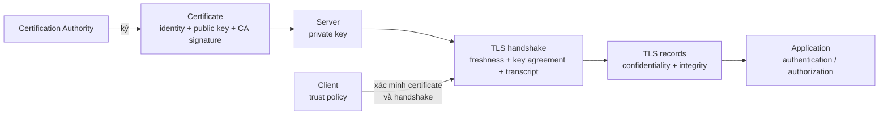
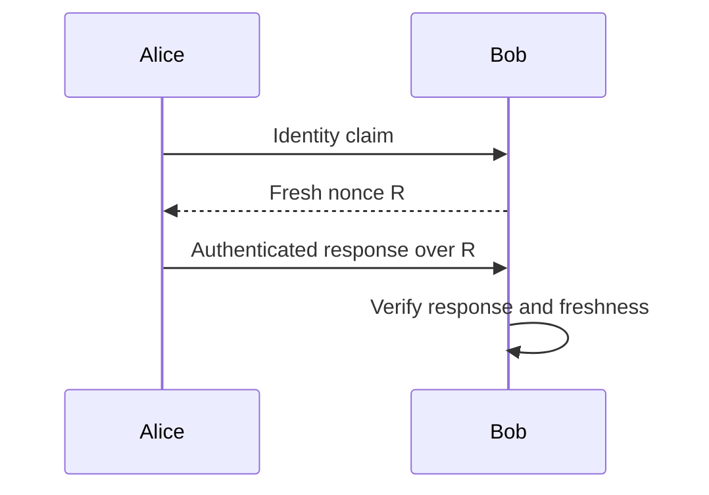
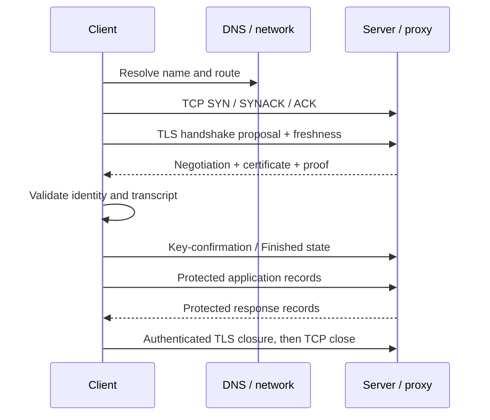

# TLS, certificate và xác thực endpoint

> [!abstract] Câu hỏi trung tâm
> Một public key tự xưng chưa nói được nó thuộc về ai; một thông điệp ký hợp lệ chưa chứng minh nó mới được tạo; một TCP connection thành công chưa bảo vệ dữ liệu khỏi nghe lén hoặc sửa đổi. Chuỗi tin cậy cần nhiều mắt xích: định danh được gắn với key bằng certificate, peer chứng minh nắm private key, handshake tạo freshness và session keys, record layer bảo vệ dữ liệu, còn application tự quyết định authorization cùng business outcome.

## Mô hình tổng quát



Sơ đồ không đồng nhất certificate với authorization. Certificate góp phần trả lời public key này được ràng buộc với identity nào theo trust policy?, còn ứng dụng vẫn phải trả lời identity ấy được phép làm gì?.

## 1. Bốn thuộc tính cần tách riêng

| Thuộc tính | Câu hỏi | Cơ chế trong phạm vi nguồn |
|---|---|---|
| Confidentiality | Người ngoài có đọc được dữ liệu không? | Symmetric encryption với session key |
| Integrity | Dữ liệu có bị sửa, chèn, xóa hoặc đảo không? | Hash/MAC, record sequence và transcript check |
| Authentication | Peer có chứng minh identity/key possession không? | Certificate, signature hoặc challenge-response |
| Freshness | Đây có phải phiên/thông điệp hiện tại không? | Nonce và sequence state |

Một hệ thống có thể đạt một thuộc tính nhưng thiếu thuộc tính khác. Mã hóa password chặn người nghe đọc password, song ciphertext cố định vẫn có thể bị replay. Signature xác nhận integrity và key possession theo giả định, nhưng không tự mã hóa nội dung.

> [!source-fact]
> Digital signature, CA, endpoint authentication và ba mục tiêu TLS:confidentiality, integrity, authentication:được trình bày tại §§8.3.3, 8.4 và 8.6, trang in 658-680 theo hai dải đã nêu trong Reference.

## 2. Digital signature ký digest, không che nội dung

Mô hình sách bắt đầu từ cặp public/private key. Chủ thể giữ private key, còn verifier biết public key. Hai yêu cầu sư phạm được đặt ra là signature phải kiểm chứng được và không thể bị giả mạo trong các giả định của scheme. Verifier cần xác nhận document gắn với signer đã khai báo, còn bên không giữ private key không tạo được signature hợp lệ.

Thay vì thực hiện phép toán public-key trên toàn message, sender tính digest cố định:

$$
d = H(m)
$$

rồi tạo signature trên digest bằng private key. Receiver nhận message `m` cùng signature, dùng public key để kiểm tra signature, đồng thời tự tính `H(m)` và so hai kết quả.

Nếu message đổi thành `m'`, digest thay đổi và verification thất bại với giả định hash/signature an toàn. Message trong flow minh họa vẫn ở cleartext; signature cung cấp integrity và bằng chứng gắn với private key, không cung cấp confidentiality.

> [!source-fact]
> Ký hash thay cho toàn message, cách receiver tính lại digest và so sánh được mô tả tại §8.3.3, trang in 659-661.

> [!uncertainty]
> Sách diễn giải signature theo ngôn ngữ mã hóa bằng private key, phù hợp với mô hình RSA sư phạm của chương. Không dùng cách diễn đạt này làm định nghĩa tổng quát cho mọi signature scheme hoặc làm hướng dẫn triển khai cryptography.

## 3. Signature hợp lệ vẫn dựa trên một chuỗi giả định

Kết luận message do Bob ký chỉ vững khi các điều kiện sau đứng vững:

1. public key dùng để verify thật sự thuộc Bob;
2. private key chưa bị lộ, chia sẻ hoặc đánh cắp;
3. thuật toán và tham số còn an toàn trong bối cảnh sử dụng;
4. message bytes được canonicalize/parse nhất quán;
5. verifier kiểm đúng input và xử lý failure theo fail-closed;
6. nếu freshness quan trọng, protocol còn có nonce, timestamp hoặc session state phù hợp.

Nguồn trực tiếp nhấn mạnh hai giả định đầu: chỉ người giữ private key mới tạo được signature và private key không bị trao hoặc lấy cắp. Các điều kiện còn lại là biên kiểm tra cần nguồn chuẩn/implementation hiện hành trước khi xây hệ thống.

> [!inference]
> Danh sách sáu điều kiện là phân rã kiểm định từ mô hình signature của sách; sách không đặt tên nó như một framework hoàn chỉnh.

## 4. MAC và digital signature khác nhau ở trust model

MAC dùng secret chung giữa các bên. Bên nào có secret cũng có khả năng tạo MAC hợp lệ, nên một bên không thể dùng MAC đơn thuần để chứng minh với bên thứ ba rằng chỉ phía còn lại đã tạo message. Digital signature dùng private key để ký và public key để verify; verifier không cần có private key.

| Thuộc tính | MAC | Digital signature |
|---|---|---|
| Secret tạo bằng chứng | Shared secret | Private key của signer |
| Ai verify | Bên có shared secret | Bên có public key đúng |
| Chi phí/mô hình | Nhẹ hơn trong mô hình sách | Nặng hơn, cần PKI/key distribution |
| Confidentiality | Không tự cung cấp | Không tự cung cấp |
| Identity binding | Qua cách cấp shared secret | Qua certificate/trust policy |

> [!source-fact]
> So sánh MAC với digital signature và nhu cầu PKI của signature nằm tại cuối §8.3.3, trang in 661.

## 5. Public key tự gửi kèm không chứng minh ownership

Kẻ tấn công có thể tuyên bố mình là Bob, gửi public key của chính nó và tạo signature bằng private key tương ứng. Verification toán học vẫn thành công vì message, signature và key khớp nhau; phần sai nằm ở giả định key này là của Bob.

Đây là ranh giới giữa:

- **proof of possession**: peer chứng minh nắm private key khớp public key;
- **identity binding**: public key ấy được gắn với identity nào;
- **authorization**: identity đó được làm hành động gì.

Ba câu hỏi cần bằng chứng khác nhau. Kiểm signature chỉ giải quyết câu đầu nếu public key chưa được xác thực độc lập.

> [!source-fact]
> Ví dụ mạo danh bằng cách thay public key và nhu cầu xác minh key thật của entity nằm trong phần Public Key Certification, trang in 662-663.

## 6. CA ký binding giữa identity và public key

Certification Authority thực hiện hai nhiệm vụ trong mô hình nguồn:

1. kiểm tra identity của subject theo quy trình của CA;
2. phát hành certificate chứa identity, public key và chữ ký số của CA.

Client có public key của CA sẽ kiểm chữ ký certificate, rồi lấy public key của subject từ certificate. Mức tin cậy không vượt quá chất lượng xác minh identity, bảo vệ private key của CA và policy mà client chấp nhận.

Các field X.509 được sách chọn để giới thiệu gồm version, serial number, signature algorithm, issuer, validity period, subject và subject public key cùng thuật toán/tham số.

> [!source-fact]
> Hai vai trò của CA, certificate binding và các field X.509 minh họa nằm tại phần Public Key Certification, trang in 662-664.

### Điều certificate không tự chứng minh

Một certificate tồn tại chưa chứng minh verifier sẽ tin nó. Còn phải biết trust anchor/policy, chain, thời gian hiệu lực, identity đích cần so khớp, mục đích dùng key và trạng thái thu hồi theo môi trường. Nguồn không cung cấp đủ quy trình validation production cho các điều kiện này.

> [!uncertainty]
> §8.3 giới thiệu certificate ở mức nguyên lý. Hostname verification, SAN, chain building, revocation, name constraints, key usage, algorithm policy và trust-store behavior cần chuẩn cùng tài liệu thư viện hiện hành; không suy ra cấu hình từ bảng field trong sách.

## 7. Endpoint authentication cần chứng minh peer đang live

Endpoint authentication diễn ra trong lúc hai bên giao tiếp. Nó khác với việc kiểm một message cũ đã được ai ký. Protocol phải chống kẻ nghe lén ghi lại một authentication exchange rồi phát lại về sau.

Sách xây bốn phiên bản để lộ dần failure mode:

| Protocol | Ý tưởng | Lỗi quyết định |
|---|---|---|
| `ap1.0` | Gửi I am Alice | Assertion không có bằng chứng |
| `ap2.0` | Tin source IP | IP source có thể bị spoof; routing filter không phải giả định phổ quát |
| `ap3.0` | Gửi password rõ | Eavesdropper lấy được secret |
| `ap3.1` | Mã hóa password | Ciphertext ghi lại vẫn có thể replay |
| `ap4.0` | Challenge nonce, trả lời bằng shared key | Gắn proof với challenge mới của phiên |

> [!source-fact]
> Chuỗi `ap1.0` tới `ap4.0`, IP spoofing, password sniffing, playback và nonce nằm tại §8.4, trang in 664-668.

## 8. Source address không phải identity proof

Receiver thấy một source IP đúng không đủ kết luận sender là chủ thể mong đợi. Packet có thể mang địa chỉ nguồn giả; ingress filtering giảm một số khả năng spoofing nhưng receiver không nên mặc định mọi upstream network đều cấu hình đúng.

Trong hệ thống có proxy, NAT, service mesh hoặc load balancer, source IP quan sát được còn có thể là địa chỉ của hop trung gian. Header chuyển tiếp do client tự gửi cũng không tạo trust nếu proxy tin cậy chưa làm sạch và ghi lại nó.

> [!source-fact]
> `ap2.0` và failure do IP spoofing được trình bày tại §8.4, trang in 666.

> [!synthesis]
> Ví dụ proxy/NAT mở rộng mental model của source-address trust. Nguồn chỉ phân tích source IP và ingress filtering, không đặc tả forwarded-header policy.

## 9. Mã hóa một credential cố định chưa giải quyết replay

`ap3.1` bảo vệ nội dung password khỏi người nghe không có key, nhưng cùng ciphertext có thể được phát lại. Bob không phân biệt được exchange hiện tại với bản ghi của lần trước.

Điểm này áp dụng rộng hơn password: một token, signature hoặc encrypted blob có thể đúng về mật mã nhưng cũ. Protocol cần đưa freshness vào phần được xác thực:nonce, counter, timestamp có policy, hoặc session context:và cần quy tắc từ chối reuse.

> [!source-fact]
> Playback attack đối với encrypted password nằm tại §8.4, trang in 667-668.

## 10. Nonce biến authentication thành challenge-response

Trong `ap4.0`:

1. Alice khai báo identity;
2. Bob tạo nonce `R` chỉ dùng một lần và gửi challenge;
3. Alice dùng shared secret để tạo response gắn với `R`;
4. Bob kiểm response có khớp nonce vừa phát hay không.



Response đúng cung cấp hai bằng chứng trong mô hình: peer biết secret và đã xử lý challenge mới. Điều này vẫn phụ thuộc nonce không lặp theo phạm vi cần thiết, random source phù hợp, secret còn an toàn và protocol bind đúng identity/context vào response.

> [!source-fact]
> Định nghĩa nonce cùng bốn bước challenge-response của `ap4.0` nằm tại §8.4, trang in 668.

## 11. TLS nằm trên TCP nhưng cung cấp API gần transport

Sách mô tả TLS như lớp bảo mật cho ứng dụng chạy trên TCP. Về kiến trúc protocol, TLS nằm ở application layer trong mô hình sách; với developer, TLS socket trông gần giống TCP socket nhưng thêm confidentiality, integrity và authentication.

Thứ tự cơ bản là:

```text
name resolution → TCP connection → TLS handshake → application protocol over TLS
```

TCP reliability vẫn vận chuyển TLS bytes. TLS không sửa routing, congestion hay TCP reset; nó bảo vệ ngữ nghĩa bảo mật của phiên và record trên connection đã có.

> [!source-fact]
> Mục tiêu TLS, khả năng dùng cho ứng dụng chạy trên TCP và vị trí application-layer/API view nằm tại §8.6, trang in 674-675.

## 12. Security goal của TLS không dừng ở biểu tượng HTTPS

Nguồn dùng tình huống thương mại điện tử để tách ba failure:

- thiếu confidentiality: người nghe đọc payment data;
- thiếu integrity: kẻ trung gian sửa nội dung order;
- thiếu server authentication: client gửi secret cho site mạo danh.

URL `https` cho biết scheme yêu cầu HTTP over TLS, song biểu tượng hoặc handshake thành công không tự chứng minh site đáng tin về nghiệp vụ. Client còn phải validate identity theo URL/policy; application còn phải kiểm account, authorization, input và transaction.

> [!source-fact]
> Ba rủi ro và các security service TLS hướng tới nằm tại đầu §8.6, trang in 674-675.

## 13. Almost-TLS là mô hình giải thích, không phải protocol để triển khai

Sách dựng một phiên bản đơn giản gồm ba pha:

1. **Handshake**: tạo TCP connection, nhận certificate, xác minh server, hình thành master secret.
2. **Key derivation**: từ master secret sinh key riêng theo hướng và theo mục đích.
3. **Data transfer**: chia byte stream thành record, bảo vệ từng record rồi giao xuống TCP.

Mô hình giúp trả lời vì sao cần certificate, session key, record và direction-specific key. Nó được tác giả gọi rõ là almost-TLS; mọi chi tiết wire protocol phải lấy từ phiên bản TLS thực đang dùng.

> [!source-fact]
> Ba pha của almost-TLS và flow certificate/master secret nằm tại §8.6.1, trang in 676-677.

## 14. Session key được tách theo hướng và mục đích

Trong mô hình cũ của sách, master secret dẫn tới bốn key:

- encryption key cho client → server;
- integrity/HMAC key cho client → server;
- encryption key cho server → client;
- integrity/HMAC key cho server → client.

Tách key giảm việc dùng cùng key cho nhiều mục đích và hai hướng. Hai endpoint phải chạy cùng key derivation function trên cùng input để nhận cùng session state mà không gửi các derived key qua mạng.

> [!source-fact]
> Bốn key theo hướng/mục đích và key derivation từ master secret nằm tại §8.6.1, trang in 677.

> [!uncertainty]
> Cấu trúc hai encryption key + hai HMAC key phản ánh cipher/MAC model mà nguồn dạy. TLS hiện đại có key schedule và AEAD khác; giữ nguyên nguyên tắc tách context, không tái dùng sơ đồ bốn key như đặc tả TLS 1.3.

## 15. Record layer tạo framing trên TCP byte stream

TCP không giữ message boundary. TLS phải tự chia application stream thành record để biết phần nào cần authenticate/decrypt và có thể phát hiện failure trước khi connection kết thúc.

Record lịch sử trong nguồn có type, version, length, data và HMAC. Length cho receiver tách record từ TCP stream; type phân biệt handshake, application data hoặc closure. Mô hình sau đó bảo vệ data cùng integrity value bằng session keys.

Không được dựa vào một TCP segment tương ứng một TLS record. Segment có thể chứa một phần record hoặc nhiều record; offload và capture point còn thay hình dạng packet quan sát được.

> [!source-fact]
> Lý do cần record, các field minh họa và record extraction từ TCP byte stream nằm tại §8.6.1, trang in 677-678.

## 16. Integrity cần bind cả thứ tự record

Nếu integrity check chỉ phủ data từng record, attacker có thể thử đảo, xóa hoặc replay record mà mỗi record riêng lẻ vẫn hợp lệ. Mô hình sách đưa sequence number ngầm vào phép tính HMAC. Sender và receiver cùng theo dõi counter; sequence không nhất thiết xuất hiện như field trong record nhưng là input của integrity calculation.

Nhờ đó, record đúng nội dung nhưng sai vị trí hoặc lặp lại không còn khớp state receiver. Đây là ví dụ quan trọng: integrity của tập phần tử riêng lẻ chưa đủ cho integrity của cả stream có thứ tự.

> [!source-fact]
> Attack đảo/xóa/replay và việc bind TLS sequence number vào HMAC được trình bày tại §8.6.1, trang in 677-678.

## 17. Transcript integrity bảo vệ negotiation

Handshake phải thương lượng algorithm trước khi có session keys đầy đủ. Danh sách ban đầu đi clear trong protocol cũ, nên attacker có thể xóa lựa chọn mạnh để ép hai bên chọn bộ yếu. Nguồn mô tả hai bên gửi integrity value trên toàn bộ handshake messages đã thấy; nếu transcript khác nhau, verification thất bại.

Nguyên tắc cần giữ là **negotiation cũng phải được authenticate**. Nếu chỉ bảo vệ application data sau handshake, attacker có thể can thiệp chính tham số quyết định cách bảo vệ dữ liệu.

> [!source-fact]
> Algorithm negotiation, nonces, master-secret derivation và integrity check trên handshake transcript nằm tại §8.6.2, trang in 679-680.

## 18. Nonce bảo vệ phiên; sequence state bảo vệ record trong phiên

Sách tách hai replay scope:

- sequence number phát hiện record bị lặp hoặc đổi vị trí trong connection hiện tại;
- client/server nonce làm input của session-key derivation, khiến phiên mới có key/state mới và chặn phát lại nguyên một exchange cũ như phiên mới.

Counter không thay nonce cho cross-session freshness. Ngược lại, nonce của handshake không thay sequence state cho ordering/replay bên trong một stream dài.

> [!source-fact]
> Connection replay, vai trò của nonces và record sequence numbers được phân biệt tại §8.6.2, trang in 679-680.

## 19. TLS closure phải được xác thực

Chỉ thấy TCP FIN chưa đủ biết application/TLS stream hoàn tất. Attacker hoặc middlebox có thể làm connection kết thúc sớm; receiver thiếu authenticated end marker có thể coi prefix bị cắt là toàn bộ message.

Nguồn giải thích closure record có type được bảo vệ bởi integrity check. Nếu TCP đóng trước khi nhận closure được xác thực, receiver có bằng chứng về truncation/abnormal termination thay vì im lặng coi dữ liệu đã đủ.

> [!source-fact]
> Truncation attack và authenticated TLS closure nằm tại cuối §8.6.2, trang in 680.

## 20. Ranh giới lịch sử: phần real TLS trong sách không phải TLS hiện hành

§8.6 dẫn RFC 4346, tức TLS 1.1, và mô tả một handshake kiểu cũ với RSA-encrypted pre-master secret, HMAC MD5/SHA-1, CBC IV cùng record MAC theo cấu trúc lịch sử. Những cơ chế này hữu ích để hiểu vì sao cần identity, freshness, key derivation, transcript integrity và authenticated closure.

Không dùng chương này để:

- chọn protocol version hoặc cipher suite;
- bật RSA key transport, MD5, SHA-1, 3DES hay CBC;
- mô tả TLS 1.3 handshake/key schedule;
- quyết định certificate validation/revocation policy;
- cấu hình OpenSSL, Java, browser, proxy hoặc load balancer năm 2026.

Mọi quyết định trên phải dừng lại để lấy chuẩn IETF và tài liệu chính thức của implementation/version đang vận hành.

> [!source-fact]
> Nguồn tự ghi RFC 4346, RSA, MD5/SHA-1, CBC và gọi phần đầu là almost-TLS; các locator nằm tại §8.6, trang in 674-680.

> [!synthesis]
> Việc phân loại các chi tiết ấy là lịch sử và đặt stop condition cho production là đánh giá biên tập dựa trên phiên bản nguồn. Note chưa thêm mô tả TLS 1.3 vì chưa đọc nguồn chuẩn hiện hành trong đơn vị này.

## 21. Phân rã một TLS connection khi chẩn đoán



Sơ đồ dùng tên chức năng, không phải danh sách TLS 1.3 wire messages. Khi debug, cần xác định failure ở boundary nào trước khi gọi chung là SSL error.

### Trình tự thu bằng chứng

1. Ghi hostname/authority, client version, trust store và thời điểm.
2. Xác nhận DNS result và endpoint thực sau proxy/load balancer.
3. Xác nhận TCP handshake, reset hoặc timeout.
4. Ghi protocol version/cipher đã thương lượng từ API/tool đáng tin cậy.
5. Thu certificate chain, identity cần so, validity và verification error:không ghi private key.
6. Tách handshake failure khỏi application status sau handshake.
7. Với mTLS, kiểm riêng certificate/proof của cả client và server.
8. Với close/reset, xác định có authenticated TLS closure hay chỉ TCP termination.
9. Ghép client, proxy và origin logs bằng timestamp/request ID; mỗi TLS leg có identity và session riêng.

> [!inference]
> Runbook là tổng hợp vận hành từ các ranh giới trong nguồn. Các field và lệnh cụ thể phải lấy từ library/proxy đang dùng.

## 22. Ma trận failure

| Hiện tượng | Phân biệt | Bằng chứng cần thu |
|---|---|---|
| TCP thành công, TLS thất bại ngay | version/cipher, certificate, policy, SNI/endpoint | handshake alert, negotiated attempt, peer certificate, server log |
| Certificate ký hợp lệ nhưng sai dịch vụ | identity binding không khớp hostname/authority | expected name, certificate identities, verification result |
| Certificate hết hạn/chưa hiệu lực | clock sai hoặc validity thực sự sai | trusted time, not-before/not-after, chain |
| Chain không xây được | thiếu intermediate, trust anchor/policy khác | chain server gửi, client trust store, verify error |
| Handshake xong nhưng HTTP 401/403 | application authentication/authorization | TLS peer identity, HTTP headers/status, app policy |
| Connection đóng giữa response | clean TLS close, TCP FIN/RST hay truncation | TLS close state, packet trace, byte count, endpoint log |
| Chỉ một client lỗi | trust store, protocol/library/policy khác | client build/config, CA store, handshake trace |
| Proxy thành công tới client nhưng origin lỗi | hai TLS leg độc lập | certificate và log của từng leg |

## 23. Các tầng kết luận không được gộp

| Bằng chứng | Có thể kết luận | Chưa thể kết luận |
|---|---|---|
| TCP handshake hoàn tất | Hai TCP endpoint trao đổi được segment tại thời điểm đó | TLS identity đúng |
| Certificate parse được | Bytes có cấu trúc certificate | Chain/identity/policy hợp lệ |
| CA signature hợp lệ | Certificate không bị sửa và ký bởi key đang dùng để verify | CA/key đó được trust cho mục đích này |
| Peer chứng minh private key | Peer có key tương ứng trong protocol context | Human/company sở hữu hợp pháp key |
| TLS handshake thành công | Hai phía đạt security state theo policy đã cấu hình | User đã đăng nhập hoặc request được phép |
| HTTP 200 qua TLS | Có application response thành công theo endpoint | Business side effect đúng toàn bộ |

## 24. Những cách hiểu sai thường gặp

| Cách hiểu sai | Cách đọc đúng |
|---|---|
| Public key gửi kèm tự chứng minh identity | Cần binding độc lập như certificate/trust policy |
| Signature mã hóa message | Signature bảo vệ authenticity/integrity; cleartext vẫn có thể đọc được |
| Signature hợp lệ nghĩa private key an toàn | Key có thể đã bị lộ; cần lifecycle và incident evidence |
| Mã hóa password chặn replay | Ciphertext cố định vẫn có thể bị phát lại |
| Source IP chứng minh người gửi | IP spoofing và intermediary làm giả định này yếu |
| Certificate có CA signature là đủ | Còn chain, time, identity, usage, policy và trạng thái thu hồi |
| HTTPS nghĩa website đáng tin về nghiệp vụ | TLS bảo vệ channel/peer identity theo policy, không audit business |
| Một TCP segment là một TLS record | TLS tự framing trên TCP byte stream |
| Sequence number thay được nonce | Hai cơ chế bảo vệ replay ở hai scope khác nhau |
| TCP FIN chứng minh TLS message hoàn tất | Cần authenticated closure/application framing phù hợp |
| Chương sách mô tả TLS 1.3 | Phần chi tiết dựa trên RFC 4346 và cơ chế TLS cũ |

## 25. Áp dụng khi điều kiện thay đổi

### Reverse proxy terminate TLS

Client xác thực proxy edge; proxy mở một TLS connection khác tới origin. Certificate, key, protocol, timeout và closure của hai leg độc lập. Thành công ở leg ngoài không chứng minh leg trong được mã hóa hoặc xác thực đúng.

### Mutual TLS

Server cũng yêu cầu client certificate/proof. mTLS xác thực workload/device identity theo PKI policy; ứng dụng vẫn cần map identity vào role/permission và xử lý revocation/rotation.

### Certificate rotation

Certificate mới có thể đúng ở server này nhưng chưa tới mọi replica/proxy. Kiểm theo endpoint thực, SNI/authority, chain được gửi và trust store từng client; một lần `curl` thành công không phủ toàn hệ.

### Clock lệch

Validation dựa vào thời gian có thể thất bại dù chain/key không đổi. Cần bằng chứng clock của client, server và hệ thống cấp certificate trước khi kết luận certificate sai.

### Session/application replay

TLS chống replay theo protocol/session không tự làm business operation idempotent. Một client hợp lệ có thể gửi lại cùng order trên phiên mới. Application cần request identity, idempotency và transaction policy riêng.

> [!synthesis]
> Các scenario là phép chuyển mental model sang môi trường vận hành. Chúng cần nguồn primary riêng nếu biến thành cấu hình hoặc policy production.

## 26. Giới hạn của nguồn và của chương

Chỉ dựa vào các section đã đọc chưa thể:

- mô tả chính xác TLS 1.2/1.3 handshake, key schedule, 0-RTT hoặc session resumption;
- chọn cipher suite, curve, signature algorithm hoặc protocol minimum;
- xây đầy đủ X.509 path validation, hostname verification hay revocation;
- cấu hình mTLS, certificate rotation hoặc secret storage;
- giải thích browser trust UI và certificate transparency hiện hành;
- phân tích QUIC/TLS vì nguồn ở đây đặt TLS trên TCP;
- kết luận root cause từ một handshake trace thiếu client/server/proxy logs;
- xem TLS success như application authorization hay business success;
- dùng RSA/MD5/SHA-1/CBC trong ví dụ làm khuyến nghị bảo mật.

## 27. Câu hỏi ôn tập

1. Digital signature bảo vệ thuộc tính nào và không bảo vệ thuộc tính nào?
2. Vì sao signature verify đúng với public key do attacker gửi kèm vẫn có thể là mạo danh?
3. CA thêm bằng chứng gì vào binding identity-public key?
4. MAC và digital signature khác nhau ở người có khả năng tạo/verify ra sao?
5. Vì sao encrypted password trong `ap3.1` vẫn bị replay?
6. Nonce chứng minh freshness của challenge-response như thế nào?
7. TLS record giải quyết ranh giới nào mà TCP byte stream không cung cấp?
8. Bind sequence state vào integrity check ngăn reorder/replay ra sao?
9. Transcript integrity bảo vệ algorithm negotiation thế nào?
10. Nonce của handshake và record sequence number bảo vệ hai replay scope nào?
11. Vì sao TCP FIN chưa đủ làm bằng chứng clean TLS closure?
12. Những chi tiết nào trong §8.6 phải coi là lịch sử thay vì cấu hình hiện hành?
13. TLS authentication và application authorization tách nhau ở đâu?
14. Khi proxy terminate TLS, cần kiểm những connection boundary nào?

## 28. Liên kết chương trình

- Nguồn: [[SRC-KUROSE-ROSS-NETWORKING-8E]].
- Bài liên quan trực tiếp: `DE-L080`, `DE-L081`, `DE-L082`.
- Bài dùng làm nền: `DE-L083`, `DE-L084`, `DE-L088`.
- Liên quan: [[TCP Reliability RTT RTO and Flow Control|TCP reliability RTT RTO và flow control]], [[HTTP Requests Connection State and Caching|HTTP request connection state và cache]], [[DNS Resolution Delegation Caching and TTL|DNS resolution delegation cache và TTL]].
- Nguồn bắt buộc bổ sung trước production guidance: TLS 1.3 RFC hiện hành, X.509/path-validation standard, và tài liệu chính thức của OpenSSL/curl/JDK/browser/proxy đúng phiên bản.

## Source coverage

| Source slice | Nội dung phải giữ | Vị trí trong note | Trạng thái |
|---|---|---|---|
| [[SRC-KUROSE-ROSS-NETWORKING-8E]], §8.3.3 | digital signature, digest và integrity/authenticity boundary | §§1-4 | Đã trình bày cùng khác biệt với MAC |
| [[SRC-KUROSE-ROSS-NETWORKING-8E]], Public Key Certification | CA, certificate, identity binding và trust assumptions | §§5-7 | Đã trình bày chuỗi giả định; không coi public key tự gửi là identity proof |
| [[SRC-KUROSE-ROSS-NETWORKING-8E]], §8.4 | endpoint authentication, nonce và replay | §§7-9 | Đã trình bày challenge-response và giới hạn source address |
| [[SRC-KUROSE-ROSS-NETWORKING-8E]], §8.6 | TLS handshake/record concepts trong phiên bản sách | §§10-20 | Đã trình bày mechanics và đánh dấu phần mô tả lịch sử |
| Tổng hợp chẩn đoán | connection boundary, matrix failure và tầng kết luận | §§21-25 | Đã gắn `synthesis`; không thay TLS 1.3/X.509 standard hiện hành |

TLS 1.3, X.509 path validation và behavior của thư viện cụ thể cần nguồn chuẩn hiện hành. Note không chuyển phần mô tả lịch sử của sách thành cấu hình production.

## Key takeaways
- Mã hóa, integrity, peer authentication và application authorization là bốn thuộc tính khác nhau; một thuộc tính thành công không chứng minh ba thuộc tính còn lại.
- Certificate gắn identity với public key thông qua chuỗi tin cậy và quy tắc validation; chữ ký hợp lệ chưa đủ nếu hostname, thời hạn, usage hoặc trust anchor không phù hợp.
- TLS handshake xác thực peer và thiết lập key theo phiên; record layer bảo vệ confidentiality, integrity và thứ tự trong phạm vi connection đã thương lượng.
- Nonce chống replay trong challenge-response theo ngữ cảnh phiên, còn sequence state bảo vệ record trong phiên. Mã hóa một credential cố định không tự giải quyết replay.
- Khi proxy terminate TLS, phải kiểm riêng connection ngoài và trong, identity được xác thực ở mỗi phía, cách truyền client identity và nơi authorization thực sự diễn ra.

## Reference
1. James F. Kurose, Keith W. Ross, *Computer Networking: A Top-Down Approach*, Eighth Global Edition, Pearson, 2022, §8.3.3 and Public Key Certification, §8.4, §8.6; printed pp. 658-668 and 674-680; PDF pp. 660-670 and 676-682.
2. Hồ sơ nguồn: [[SRC-KUROSE-ROSS-NETWORKING-8E]].
3. Source note: `Material/DE/Reference/Library/Source-Notes/PACK-OS_NETWORK-BOOK-03.md`.

## Lịch sử biên tập

| Ngày | Trạng thái | Nội dung |
|---|---|---|
| 2026-09-27 | `review` | Đọc trực tiếp signature/CA/authentication/TLS; tách identity, freshness và authorization; gắn chốt lịch sử RFC 4346; biên tập Humanizer tiếng Việt |

<!-- ATOMIC-EXECUTION-CAPSULE:START -->

## Execution capsule: kiểm chứng `wiki.security.tls-certificates-endpoint-authentication`

> [!important] Phân loại mệnh đề
> Với `wiki.security.tls-certificates-endpoint-authentication`, sơ đồ, ví dụ và artifact về **TLS, certificate và xác thực endpoint** là **synthesis để kiểm chứng**; chúng không phải trích dẫn hay case nguyên văn của nguồn.

### Artifact thực thi tối thiểu

```yaml
concept_id: "wiki.security.tls-certificates-endpoint-authentication"
concept: "TLS, certificate và xác thực endpoint"
primary_question: "Certificate, proof of private-key possession, freshness và TLS phối hợp thế nào để một endpoint xác thực peer và bảo vệ byte stream khỏi nghe lén, sửa"
decision_contract:
  input_boundary: "Ghi population, thời điểm, owner và điều chưa biết"
  hard_constraints:
    - "Không vượt quyền hoặc privacy boundary"
    - "Không dùng cùng một assumption làm cả implementation và oracle"
  accept_when: "Có observation phân biệt được các lựa chọn"
  reversal_trigger: "Một hard constraint sai hoặc evidence mới đổi recommendation"
evidence_to_keep:
  - "input snapshot"
  - "chosen and rejected options"
  - "independent review result"
```

Artifact của `wiki.security.tls-certificates-endpoint-authentication` buộc người dùng ghi boundary, oracle và reversal trigger cho **TLS, certificate và xác thực endpoint**. Các giá trị minh họa phải được thay bằng evidence thật trước khi dùng cho quyết định.

### Tự kiểm tra trước khi tái sử dụng

1. Bạn có thể trả lời `Certificate, proof of private-key possession, freshness và TLS phối hợp thế nào để một endpoint xác thực peer và bảo vệ byte stream khỏi nghe lén, sửa đổi, replay cùng truncation?` bằng một câu mà không kéo thêm concept thứ hai không?
2. Source locator nào đỡ cho claim, và phần nào chỉ là synthesis trong note?
3. Observation nào khiến bạn dừng, thu hẹp hoặc đảo quyết định?
4. Artifact nào cho phép một reviewer độc lập tái hiện kết quả?

<!-- ATOMIC-EXECUTION-CAPSULE:END -->
