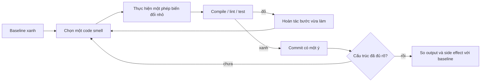

# Tái cấu trúc theo bước nhỏ và giữ nguyên hành vi

> [!abstract] Câu hỏi trung tâm
> Một thay đổi chỉ được gọi là refactor khi cấu trúc bên trong đổi nhưng hành vi quan sát được vẫn giữ nguyên. Ý định tốt không đủ: cần một oracle hành vi, chuỗi bước luôn chạy được và bằng chứng so sánh trước-sau.

## 1. Bốn loại thay đổi phải tách nhau

| Loại | Cấu trúc | Hành vi ngoài | Cách nghiệm thu |
|---|---:|---:|---|
| Refactor | đổi | giữ nguyên | regression suite và output chuẩn không đổi |
| Sửa lỗi | có thể đổi | cố ý đổi | test tái hiện lỗi đỏ trước, xanh sau |
| Thêm tính năng | có thể đổi | mở rộng | acceptance criteria mới |
| Rewrite | thay phần lớn | có thể đổi ngoài dự kiến | migration và parity plan riêng |

Một commit vừa di chuyển code, vừa đổi rule tính tiền, vừa tiện tay sửa dữ liệu rỗng không còn là bằng chứng refactor. Khi test hỏng, không xác định được nguyên nhân thuộc cấu trúc hay nghiệp vụ.

> [!source-fact]
> Hunt và Thomas định nghĩa refactoring là kỹ thuật có kỷ luật để thay đổi cấu trúc bên trong mà không đổi hành vi ngoài; họ yêu cầu không trộn thêm chức năng, có test tốt và tiến bằng bước ngắn. *The Pragmatic Programmer*, Topic 40, PDF 276-280.

## 2. Giữ nguyên hành vi nghĩa là giữ cái gì?

Hành vi không chỉ là giá trị trả về. Với pipeline dữ liệu, contract quan sát được có thể gồm:

- bản ghi đầu ra, thứ tự nếu contract quy định thứ tự;
- schema, nullability, kiểu và precision;
- side effect: số file, transaction, checkpoint, offset;
- loại lỗi và điểm lỗi mà caller nhìn thấy;
- idempotency khi chạy lại cùng input;
- log hoặc metric chỉ khi downstream phụ thuộc chúng như interface vận hành;
- giới hạn tài nguyên nếu đó là SLO bắt buộc.

Trước khi sửa, viết một **behavior inventory**. Mỗi mục phải có cách quan sát. Code chạy đúng không phải một oracle; `sha256` của output chuẩn, tập assertion schema và danh sách side effect mới là oracle.

## 3. Safety net cho mã cũ

Mã chưa có test không buộc phải hiểu hết rồi mới bắt đầu. Dùng characterization test để ghi lại hành vi hiện tại:

1. Chọn input đại diện, biên và input từng gây lỗi.
2. Chạy bản gốc, lưu output cùng metadata môi trường.
3. Biến output đó thành golden master hoặc assertion có chủ đích.
4. Đánh dấu hành vi đáng ngờ nhưng chưa sửa trong commit refactor.
5. Chạy lại suite nhiều lần để phát hiện nondeterminism.

Characterization test nói hệ đang làm gì, chưa nói nghiệp vụ muốn gì. Nếu phát hiện hành vi sai, mở một thay đổi sửa lỗi riêng, có test thể hiện contract mong muốn.

## 4. Vòng lặp một bước



Một bước nhỏ phải có trạng thái hợp lệ ở cuối bước. Tách ba lớp trong ba ngày rồi mới chạy test là một batch rewrite. Ví dụ chuỗi tách pipeline 300 dòng:

1. đổi tên biến theo từ vựng miền;
2. extract function đọc input;
3. extract pure transform;
4. đưa I/O qua interface;
5. chuyển implementation thật vào adapter;
6. dựng composition root;
7. xóa đường gọi cũ sau khi mọi caller đã chuyển.

Mỗi bước compile được, test xanh và có thể revert độc lập.

## 5. Code smell là tín hiệu, không phải phán quyết

Ba tín hiệu nên điều tra:

- duplication khiến một rule phải sửa ở nhiều nơi;
- một thay đổi nghiệp vụ làm nhiều module không liên quan cùng đổi;
- hàm trộn orchestration, domain rule và I/O nên không kiểm thử riêng được.

Ba dấu hiệu refactor quá đà:

- thêm abstraction nhưng chưa có hai nhu cầu thật;
- generic hóa làm mất từ vựng miền;
- số lớp và indirection tăng nhưng change surface không giảm.

Mẫu thiết kế chỉ đáng đưa vào khi nó giải một lực ép đã quan sát. Tên mẫu không phải bằng chứng chất lượng.

## 6. Lịch sử Git là một phần của safety system

Commit nên mô tả phép biến đổi: `extract parser boundary`, `move validation into domain service`. Không dùng `cleanup` cho sáu thay đổi khác loại. Một commit refactor tốt có ba thuộc tính:

- diff tập trung;
- suite xanh ngay tại commit đó;
- revert không kéo theo thay đổi nghiệp vụ khác.

Rà soát theo chuỗi commit giúp reviewer kiểm tra invariant ở từng bước, thay vì suy đoán từ một diff lớn. Squash chỉ thực hiện sau khi đã dùng lịch sử chi tiết để review, nếu policy dự án yêu cầu.

## 7. Chứng minh trước-sau cho pipeline

Với cùng fixture và cùng dependency version, thu hai bộ bằng chứng:

```text
baseline/
  output.parquet.sha256
  schema.json
  rejected_rows.jsonl
  side_effects.json
candidate/
  ...
```

So sánh theo contract. Byte-equality chỉ phù hợp khi serialization deterministic; nếu timestamp kỹ thuật được phép đổi, normalize trường đó và ghi rõ. Không được xóa assertion chỉ để suite xanh.

> [!synthesis]
> Quy trình characterize → transform nhỏ → test → commit → parity check là tổng hợp phục vụ DE-L095 từ kỷ luật refactoring của Hunt/Thomas, regression testing của Sommerville và yêu cầu test boundary trong Newman. Không nguồn nào đặt đúng tên toàn bộ quy trình này.

## 8. Failure modes

- **Rewrite trá hình:** branch sống lâu, không có trạng thái deployable trung gian.
- **Test bám implementation:** đổi tên method là test hỏng dù contract ngoài không đổi.
- **Golden master mù:** snapshot quá lớn được cập nhật hàng loạt mà không review semantic diff.
- **Sửa bug lẫn refactor:** output khác nhưng commit message vẫn nói không đổi hành vi.
- **Nondeterminism:** thời gian, random seed hoặc thứ tự map làm parity check nhiễu.

## 9. Các phép biến đổi cơ bản và invariant của chúng

Refactoring lớn thường là chuỗi phép biến đổi nhỏ. Mỗi phép có một invariant cục bộ cần kiểm ngay, thay vì chờ đến cuối mới chạy toàn bộ regression suite.

| Phép biến đổi | Invariant cần giữ | Phép kiểm hẹp |
|---|---|---|
| Rename symbol | mọi reference trỏ tới cùng declaration | compile/type check và search tên cũ |
| Extract function | input, output và side effect giữ nguyên | unit/characterization test quanh đoạn được tách |
| Move function | dependency direction không đổi ngoài chủ đích | import graph và test caller |
| Introduce parameter object | mapping argument không mất hoặc đảo trường | test boundary với giá trị phân biệt |
| Replace conditional with polymorphism | mỗi nhánh cũ có implementation tương ứng | decision-table tests |
| Introduce port | core chỉ biết contract, adapter giữ I/O | architecture test và core tests |
| Split phase | dữ liệu trung gian giữ đủ thông tin | golden master ở ranh giới hai phase |

Tên phép biến đổi không đảm bảo an toàn. `Extract function` có thể làm thay đổi thời điểm đọc clock, thứ tự gọi API, transaction boundary hoặc exception stack. Invariant phải được viết theo hành vi của hệ đang sửa.

## 10. Seam và characterization test

Mã cũ thường không có điểm để thay dependency hoặc quan sát trạng thái. **Seam** là vị trí có thể đổi hành vi được dùng trong test mà không sửa logic đang kiểm, chẳng hạn function parameter, interface, process boundary hoặc file fixture. Tạo seam là refactor chuẩn bị; seam chỉ có giá trị khi làm một rủi ro cụ thể trở nên quan sát được.

Quy trình với một hàm vừa đọc CSV, chuẩn hóa, gọi API rồi ghi database:

1. Chụp output và side effect hiện tại trên bộ fixture.
2. Tách clock và HTTP client thành dependency nhưng giữ implementation thật làm default.
3. Tạo characterization test ở public entry point.
4. Tách pure normalization function và chuyển các case đã quan sát thành bảng test.
5. Tách persistence port, vẫn dùng adapter cũ.
6. Chạy parity check sau mỗi bước.

Không mock tất cả dependency ngay từ đầu. Nếu double được đưa vào trước khi hiểu boundary, test có thể đóng băng chính cấu trúc cần thay đổi.

## 11. Golden master có phạm vi và phép chuẩn hóa

Golden master phù hợp khi output lớn nhưng deterministic, ví dụ file kết quả hoặc tập record đã sắp xếp. Nó nguy hiểm khi snapshot chứa timestamp, UUID, thứ tự không được contract quy định hoặc message lỗi phụ thuộc runtime.

Một parity harness nên tách ba bước:

```text
raw output
  -> canonicalize fields được phép thay đổi
  -> compare semantic structure
  -> report smallest differing path
```

Phép chuẩn hóa phải được review như code production. Nếu xóa mọi trường đang khác, harness sẽ luôn xanh nhưng không còn chứng minh gì. Với số thực, ghi tolerance và lý do; với tập không có thứ tự, sort theo stable key; với timestamp, chỉ bỏ khi thời gian không thuộc contract.

## 12. Refactor quanh transaction và side effect

Thay đổi vị trí code có thể đổi transaction dù output cuối của happy path giống nhau. Cần kiểm thêm:

- transaction mở và commit ở cùng ranh giới use case;
- exception ở từng điểm gây rollback như trước;
- external call không bị chuyển vào transaction kéo dài;
- retry không làm side effect chạy thêm lần;
- event chỉ publish sau trạng thái dữ liệu thích hợp;
- resource vẫn được đóng trong cả success và failure path.

Ví dụ, chuyển lệnh gửi email lên trước `commit` làm khách hàng nhận email cho order cuối cùng bị rollback. Golden master chỉ so bảng output có thể bỏ sót lỗi này; cần side-effect ledger ghi thứ tự `begin → write → commit → publish`.

## 13. Performance có thuộc hành vi không?

Refactor thường được định nghĩa theo functional behavior, nhưng latency, memory hoặc query count có thể là contract vận hành. Nếu module đang có SLO hoặc giới hạn tài nguyên, baseline phải giữ cả những đại lượng đó. Ngược lại, không nên biến một microbenchmark tùy môi trường thành invariant tuyệt đối.

Chọn phép đo theo cơ chế:

- query count cho N+1;
- peak memory cho materialization;
- số lần gọi external API cho batching;
- throughput và p95/p99 cho hot path;
- kích thước artifact hoặc startup time nếu deployment phụ thuộc.

Ghi môi trường, warm-up, input và variance. Kết luận không chậm hơn chỉ hợp lệ trong phạm vi phép đo đã công bố.

## 14. Protocol review theo commit

Reviewer có thể đi theo thứ tự sau:

1. Đọc behavior inventory và baseline evidence trước diff.
2. Xác nhận commit chỉ thuộc refactor, bug fix hoặc feature; không trộn loại.
3. Với mỗi commit, gọi tên phép biến đổi và invariant.
4. Kiểm test có quan sát public behavior hay implementation detail.
5. Kiểm dependency graph và transaction/side-effect order.
6. Chạy suite ở từng commit hoặc ít nhất các checkpoint đã khai báo.
7. So parity report cuối với baseline.

Một diff dễ đọc nhưng không có baseline vẫn chưa đủ. Một suite xanh nhưng assertion bị xóa hoặc snapshot được cập nhật không giải thích cũng chưa đủ.

## 15. Case study: tách module nạp dữ liệu 300 dòng

Giả sử `run_import()` đang đọc file, parse, validate, gọi API enrichment, ghi PostgreSQL và gửi metric. Mục tiêu là tách application service cùng adapters mà không đổi contract CLI.

| Commit | Thay đổi | Bằng chứng |
|---|---|---|
| 1 | thêm characterization fixtures cho valid, invalid và partial input | output, exit code, rejected rows |
| 2 | extract `parse_rows` | fixture parity |
| 3 | extract `validate_record` | decision-table tests |
| 4 | đưa enrichment qua port | contract test cho adapter thật |
| 5 | đưa persistence qua port | integration test transaction |
| 6 | tạo application service | public CLI tests không đổi |
| 7 | chuyển wiring vào composition root | architecture/import test |
| 8 | xóa dead path | search, coverage và full parity |

Nếu commit 5 làm error class đổi từ `ImportFailed` sang driver exception, refactor đã làm rò abstraction. Nếu commit 6 thay thứ tự enrichment và validation, số lần gọi API có thể đổi dù output của fixture nhỏ vẫn giống; side-effect ledger phải phát hiện.

## 16. Bài tự kiểm tra

1. Vì sao test private method làm giảm khả năng refactor dù coverage tăng?
2. Khi nào byte-for-byte golden master chặt quá mức?
3. Vì sao sửa một bug đã biết phải nằm ngoài commit refactor?
4. Một thay đổi làm query count từ 10 xuống 1 nhưng output không đổi có còn là refactor không? Contract vận hành nào cần ghi?
5. Nếu old và new implementation cùng fail trên một input, parity có chứng minh cả hai đúng không?

## 17. Giới hạn

- Characterization test giữ hành vi hiện tại, kể cả hành vi sai chưa được nhận diện.
- Regression suite chỉ bao phủ observation đã mã hóa; không chứng minh tương đương cho mọi input.
- IDE refactoring tool giảm lỗi cơ học nhưng không hiểu transaction, performance và business semantics đầy đủ.
- Parity trên fixture không thay shadow traffic hoặc staged rollout khi rủi ro production cao.
- Lịch sử commit tốt giúp review và rollback; nó không bù cho thiếu test.

## 18. Checklist nghiệm thu DE-L095

- [ ] Có baseline chạy lại được và ghi tool/dependency version.
- [ ] Behavior inventory gồm output, schema, lỗi và side effect.
- [ ] Ít nhất sáu commit; mỗi commit compile và test xanh.
- [ ] Không commit nào trộn sửa lỗi hoặc feature.
- [ ] Output chuẩn trước-sau khớp theo rule đã công bố.
- [ ] Có danh sách hành vi đáng ngờ được hoãn sang change riêng.

## 19. Liên kết chương trình

- Tiền đề: [[Consumer-Provider Contract Testing|Kiểm thử hợp đồng giữa producer và consumer]].
- Bài áp dụng: `DE-L095`.
- Bài kế tiếp tự động hóa thêm các gate: [[Automated Code and Supply Chain Checks|Kiểm tự động cho mã và chuỗi cung ứng phần mềm]].

## Reference
1. [[SRC-HUNT-THOMAS-PRAGMATIC-PROGRAMMER-20AE]]: Topic 40, PDF 276-280.
2. [[SRC-SOMMERVILLE-SOFTWARE-ENGINEERING-10E]]: refactoring, regression testing và software evolution, PDF 82-88 và 255-270.
3. [[SRC-NEWMAN-BUILDING-MICROSERVICES-2E]]: test scope và refactoring support, PDF 353-372.

## Source coverage

| Source slice | Nội dung phải giữ | Vị trí trong note | Trạng thái |
|---|---|---|---|
| [[SRC-HUNT-THOMAS-PRAGMATIC-PROGRAMMER-20AE]], Topic 40 pp. 276-280 | refactor có kiểm soát, test trước và bước nhỏ | §§1-5, 9-10 | Đã trình bày loop và invariant của transformation |
| [[SRC-SOMMERVILLE-SOFTWARE-ENGINEERING-10E]], pp. 82-88, 255-270 | software evolution, regression testing và refactoring | §§2-4, 6-8, 16-18 | Đã trình bày baseline, regression safety net và evidence |
| [[SRC-NEWMAN-BUILDING-MICROSERVICES-2E]], Ch. 9 pp. 353-372 | test scope và support cho thay đổi cấu trúc | §§3, 10-14 | Đã trình bày seam, characterization, side effect và performance contract |
| Tổng hợp bài DE-L095 | quy trình commit, case module 300 dòng và checklist nghiệm thu | §§14-18 | Đã gắn `synthesis`; lịch sử commit mẫu chưa phải lab đã chạy |

Parity trên fixture không chứng minh equivalence cho mọi input. Note giữ giới hạn này và yêu cầu review behavior inventory trước khi gọi thay đổi là refactor.

## Key takeaways
- Refactor là một tuyên bố kiểm được về hành vi, không phải nhãn cho mọi hoạt động dọn code.
- Safety net phải quan sát contract ngoài; test implementation detail làm refactor khó hơn.
- Bước nhỏ có nghĩa là mỗi bước tạo một trạng thái chạy được, test xanh và revert độc lập.
- Bug fix và feature phải tách khỏi refactor để giữ bằng chứng và khả năng review.

<!-- ATOMIC-EXECUTION-CAPSULE:START -->

## Execution capsule: kiểm chứng `wiki.software-engineering.behavior-preserving-refactoring`

> [!important] Phân loại mệnh đề
> Với `wiki.software-engineering.behavior-preserving-refactoring`, sơ đồ, ví dụ và artifact về **Tái cấu trúc theo bước nhỏ và giữ nguyên hành vi** là **synthesis để kiểm chứng**; chúng không phải trích dẫn hay case nguyên văn của nguồn.

### Artifact thực thi tối thiểu

```python
from dataclasses import dataclass

@dataclass(frozen=True)
class WikiSoftwareEngineeringBehaviorPreservingReEvidence:
    boundary_declared: bool
    independent_oracle: bool
    reversal_trigger: str

    def accepted(self) -> bool:
        return (
            self.boundary_declared
            and self.independent_oracle
            and bool(self.reversal_trigger.strip())
        )

# Concept: Tái cấu trúc theo bước nhỏ và giữ nguyên hành vi
# Primary question: Làm sao thay đổi cấu trúc mã theo từng bước nhỏ mà chứng minh được hành vi quan sát từ bên ngoài không đổi?
evidence = WikiSoftwareEngineeringBehaviorPreservingReEvidence(
    boundary_declared=True,
    independent_oracle=True,
    reversal_trigger="Đảo quyết định khi hard constraint bị vi phạm",
)
assert evidence.accepted()
```

Artifact của `wiki.software-engineering.behavior-preserving-refactoring` buộc người dùng ghi boundary, oracle và reversal trigger cho **Tái cấu trúc theo bước nhỏ và giữ nguyên hành vi**. Các giá trị minh họa phải được thay bằng evidence thật trước khi dùng cho quyết định.

### Tự kiểm tra trước khi tái sử dụng

1. Bạn có thể trả lời `Làm sao thay đổi cấu trúc mã theo từng bước nhỏ mà chứng minh được hành vi quan sát từ bên ngoài không đổi?` bằng một câu mà không kéo thêm concept thứ hai không?
2. Source locator nào đỡ cho claim, và phần nào chỉ là synthesis trong note?
3. Observation nào khiến bạn dừng, thu hẹp hoặc đảo quyết định?
4. Artifact nào cho phép một reviewer độc lập tái hiện kết quả?

<!-- ATOMIC-EXECUTION-CAPSULE:END -->
