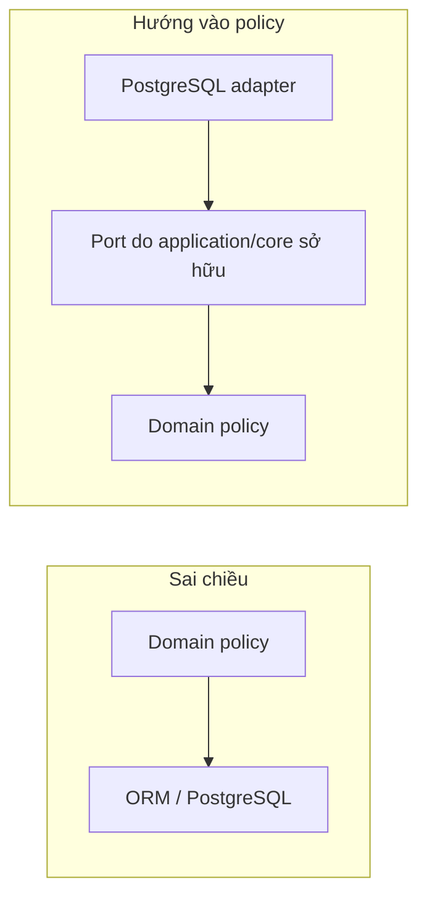
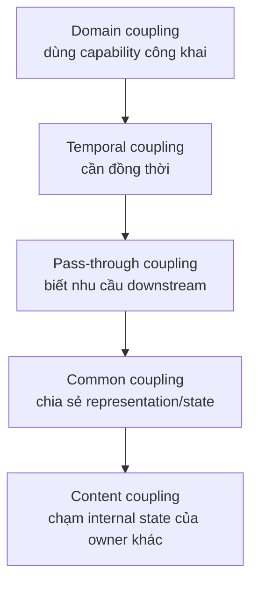
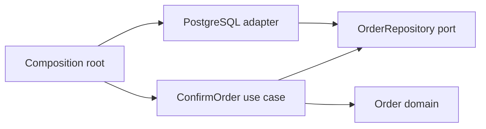

# Độ gắn kết, độ phụ thuộc và chiều phụ thuộc

> [!abstract] Câu hỏi trung tâm
> Một sơ đồ nhiều hộp chưa chứng minh hệ thống có mô-đun. Cần biết mã nào thay đổi cùng nhau, mô-đun nào đang biết chi tiết của mô-đun nào, và một thay đổi giả định sẽ lan qua bao nhiêu tệp. Chương này dùng import graph, edge ledger và replacement scenario để biến nhận xét “mã đang dính nhau” thành bằng chứng có thể kiểm tra.

## 1. Triệu chứng: thay database nhưng sửa cả lõi nghiệp vụ

Một pipeline ghi order vào PostgreSQL. Yêu cầu mới là chạy cùng logic trên tệp Parquet để replay dữ liệu lịch sử. Nhóm dự kiến chỉ thay adapter lưu trữ, nhưng phải sửa:

- service nghiệp vụ vì chữ ký nhận `SQLAlchemy Session`;
- domain model vì field mang type của ORM;
- unit test vì mọi test đều dựng PostgreSQL fixture;
- CLI vì tự tạo connection;
- API handler vì bắt exception của driver;
- batch job vì dùng câu SQL của service.

Sáu điểm sửa không phải sáu sự cố riêng. Chúng là bằng chứng rằng quyết định “lưu ở PostgreSQL” đã lọt qua boundary và trở thành assumption của nhiều mô-đun.

> [!source-fact]
> Newman dẫn lại cách nhìn của Parnas: kết nối giữa các mô-đun chính là những assumption mà chúng đặt lên nhau. Giảm số assumption làm thay đổi cục bộ hơn. *Building Microservices*, Chapter 2, PDF 59–60.

## 2. Ba câu hỏi khác nhau

### Cohesion — cái gì thuộc cùng một boundary?

Cohesion xét quan hệ giữa các phần **bên trong** một boundary. Cách diễn đạt thực dụng của Newman là “code thay đổi cùng nhau thì ở cùng nhau”. Related behavior được đặt gần nhau để một thay đổi nghiệp vụ không phải sửa nhiều mô-đun.

### Coupling — boundary này giả định gì về boundary khác?

Coupling xét quan hệ **qua** boundary. Một mô-đun coupled với mô-đun khác khi nó dựa vào tên, type, schema, thứ tự gọi, timing, trạng thái, failure hoặc implementation detail của mô-đun kia.

### Dependency direction — bên nào phải biết bên nào?

Direction hỏi source-level knowledge chạy theo hướng nào. Nếu policy nghiệp vụ import ORM và driver, lõi biết mechanism. Nếu adapter import interface/type do lõi công bố, mechanism biết policy. Hai hệ thống có thể tạo cùng runtime behavior nhưng mang khả năng thay đổi khác nhau.



Ba câu hỏi liên quan nhưng không đồng nhất. Mô-đun có cohesion cao vẫn có thể coupled chặt với database. Import graph sạch vẫn có temporal coupling qua chuỗi synchronous call. Dependency đúng chiều vẫn có thể tạo interface quá lớn khiến thay đổi lan rộng.

## 3. Information hiding quyết định boundary có thật hay không

Tạo thư mục `domain/`, `service/`, `repository/` chưa tạo information hiding. Boundary chỉ có tác dụng khi phần ngoài không dựa vào representation và decision nội bộ.

Một mô-đun cần công bố:

- operation nào được gọi;
- input/output và semantics;
- failure contract;
- invariant hoặc ordering constraint mà caller cần biết.

Nó nên giấu:

- table và column layout;
- ORM entity hoặc driver exception;
- cache key, query plan và retry loop nội bộ;
- helper function, state trung gian và thuật toán có thể đổi;
- dependency transitively không thuộc contract.

> [!source-fact]
> Sommerville yêu cầu interface nêu signature và semantics của service, nhưng không lộ data representation. Representation có thể đổi từ array sang list mà object dùng interface không đổi. *Software Engineering* 10e, Chapter 7, trang in 208–209, PDF 210–211.

### Assumption ledger

Với mỗi cạnh `A -> B`, ghi assumption cụ thể:

| Cạnh | Assumption | Nếu B đổi | Có thuộc contract? |
|---|---|---|---|
| `order_service -> sqlalchemy` | transaction dùng `Session` | service và test đổi | không |
| `api -> order_service` | `ConfirmOrder` trả `ConfirmedOrder` | API mapping có thể đổi | có |
| `postgres_adapter -> order_port` | adapter phải cài `save/load` | adapter đổi | có |
| `domain -> orders_table` | field domain trùng column | domain đổi theo schema | không |

Số cạnh chưa đủ. Cần biết assumption trên cạnh là ổn định hay volatile, công khai hay vô tình rò rỉ.

## 4. Cohesion được kiểm bằng lịch sử thay đổi

Một mô-đun cohesive khi các thành phần bên trong phục vụ cùng capability hoặc cùng lý do thay đổi. “Cùng là utility” hay “cùng dùng pandas” chưa phải lý do nghiệp vụ.

### Dấu hiệu cohesion mạnh

- một policy change chủ yếu chạm một mô-đun;
- type và operation trong mô-đun dùng cùng từ vựng miền;
- invariant được cưỡng chế tại một owner;
- test của capability nằm gần behavior và không dựng phần không liên quan;
- public surface nhỏ hơn đáng kể internal implementation.

### Dấu hiệu cohesion yếu

- một state transition được kiểm ở API, worker và SQL trigger khác nhau;
- class chỉ bọc CRUD, còn decision nằm ở caller;
- thư mục chia theo technical type (`models/`, `utils/`, `handlers/`) khiến một feature sửa khắp nơi;
- một mô-đun chứa nhiều nhóm tệp không bao giờ đổi cùng nhau;
- tên như `Common`, `Manager`, `Processor`, `Helper` không nói lý do thay đổi.

> [!source-fact]
> Newman cảnh báo service chỉ bọc CRUD có thể là dấu hiệu cohesion yếu và coupling chặt: behavior quản lý dữ liệu đã bị đẩy sang nhiều caller. Chapter 2, PDF 73–75.

### Co-change là bằng chứng, không phải phán quyết

Từ lịch sử Git, đếm hai tệp xuất hiện trong cùng commit có thể gợi ý boundary. Nhưng co-change còn do:

- format hoặc rename hàng loạt;
- migration tạm thời;
- một commit gom nhiều việc;
- generated code;
- test phải đổi vì behavior công khai đổi đúng chủ ý.

Vì thế, co-change dùng để đặt câu hỏi “tại sao hai thứ này luôn đổi cùng nhau?”, không tự động ra lệnh gộp mô-đun.

## 5. Coupling có nhiều lớp

Import graph chỉ bắt static/source dependency. Một audit có giá trị phải tìm thêm bốn lớp.

| Lớp | Cạnh nghĩa là gì | Ví dụ | Bằng chứng |
|---|---|---|---|
| Source/import | A cần symbol/package của B để build | domain import ORM | AST/import list |
| Runtime/control | A gọi B khi chạy | API gọi application service | trace/sequence diagram |
| Data/schema | A hiểu representation do B sở hữu | worker đọc thẳng table của service | query/schema usage |
| Temporal | A cần B sẵn sàng cùng lúc hoặc đúng thứ tự | synchronous inventory call | timeout/availability path |
| Change/co-change | thay B thường kéo A đổi | schema đổi và ba consumer đổi | Git history/change exercise |
| Ownership | thay đổi cần phối hợp qua team boundary | shared package do đội khác duyệt | CODEOWNERS/process evidence |

Một cạnh runtime không buộc source dependency cùng chiều. Core có thể gọi object được inject qua port; runtime control đi từ core tới adapter instance, còn source code của adapter phụ thuộc vào abstraction do core sở hữu.

> [!inference]
> Vì `DE-L090` yêu cầu đọc import để vẽ graph, kết quả bài chỉ chứng minh static dependency trừ khi học viên bổ sung trace, schema usage hoặc history. Không được dùng import graph để tuyên bố “không có coupling” ở các lớp còn lại.

## 6. Năm dạng coupling từ Newman

Taxonomy dưới đây được Newman tổng hợp cho microservice. Khi áp vào module trong cùng process, giữ ý nghĩa về assumption và change propagation; bỏ phần network-specific nếu không có network.

### 6.1 Domain coupling

A cần capability hợp lệ của B để hoàn thành use case. Đây thường là coupling không tránh được: Order cần Inventory xác nhận availability. Cảnh báo xuất hiện khi một coordinator biết quá nhiều downstream hoặc truyền payload quá phức tạp.

### 6.2 Temporal coupling

A chỉ hoàn tất nếu B hoạt động cùng thời điểm hoặc theo đúng thứ tự. Synchronous call là ví dụ rõ, nhưng temporal coupling không mặc nhiên xấu; cần ghi nhận ảnh hưởng tới availability và resource wait.

### 6.3 Pass-through coupling

A truyền dữ liệu qua B chỉ vì C cần nó. B bị kéo vào contract giữa A và C; thay schema ở C có thể bắt cả ba đổi. Cách giảm gồm gọi trực tiếp khi hợp lý, để B tự tạo representation cho C, hoặc để B chuyển blob mà không hiểu cấu trúc. Mỗi cách đổi một loại coupling khác.

### 6.4 Common coupling

Nhiều module đọc/ghi shared data. Shared reference data chỉ đọc và ít đổi có thể chấp nhận được; nhiều writer trên cùng state machine nguy hiểm hơn vì ownership và invariant bị phân tán.

### 6.5 Content coupling

A chạm thẳng internal state của B, chẳng hạn update table do B sở hữu. Khi đó database trở thành public contract nhưng không có public surface rõ. B không còn biết field nào được phép đổi. Newman khuyến nghị tránh dạng này.



Sơ đồ biểu diễn xu hướng assumption tăng trong taxonomy của nguồn, không phải thang điểm tuyệt đối cho mọi hệ thống.

## 7. Orthogonality và phép thử thay đổi

Hunt và Thomas dùng `orthogonality` để chỉ independence: đổi một thành phần không kéo phần không liên quan đổi theo. Phép thử chẩn đoán của họ hỏi: nếu yêu cầu đằng sau một function đổi mạnh, bao nhiêu module bị ảnh hưởng?

Các phép thử thực dụng:

1. Đổi database: domain và unit test có đổi không?
2. Đổi UI: schema lưu trữ có đổi không?
3. Chạy unit test: phải import hoặc khởi động bao nhiêu phần còn lại?
4. Sửa một bug: diff nằm một vùng hay rải toàn repo?
5. Đổi third-party library: type hoặc exception của library xuất hiện ở bao nhiêu signature?

> [!source-fact]
> *The Pragmatic Programmer* đề nghị đếm module bị ảnh hưởng khi đổi một requirement, quan sát lượng code phải import để chạy unit test và phân tích số source file chạm bởi mỗi bug fix. Topic 10, PDF 79–83.

Orthogonality không đồng nghĩa hoàn toàn độc lập. Module vẫn hợp tác qua contract. Mục tiêu là loại secondary effect giữa những thứ không liên quan.

## 8. Chiều phụ thuộc: phân biệt control flow và source edge

Giả sử application use case cần lưu order.

### Thiết kế lõi import adapter

```text
application/confirm_order.py
  imports adapters/postgres_order_repository.py
  imports sqlalchemy.orm.Session
```

Source edge: `application -> adapter -> driver`. Đổi storage có thể chạm application. Test application phải dựng mechanism hoặc mock type của mechanism.

### Thiết kế lõi sở hữu port

```text
application/order_repository.py   # port do use case cần
adapters/postgres_order_repository.py implements OrderRepository
composition.py wires adapter into ConfirmOrder
```

Source edges:

```text
adapters -> application port
composition -> application + adapters
application use case -> application port
```

Runtime call vẫn đi từ use case tới repository object. Source dependency của concrete adapter lại đi vào abstraction ổn định hơn do use case sở hữu.



### Khi nào cạnh được coi là sai chiều?

Trong boundary policy/mechanism đã tuyên bố, cạnh là sai khi:

- domain/application import framework, driver hoặc adapter;
- public core signature lộ type của mechanism;
- core bắt error concrete của driver;
- core gọi global singleton do outer layer khởi tạo;
- table/file representation quyết định tên và shape của domain model mà không có mapping boundary.

Đây là rule theo mục tiêu thay mechanism mà giữ policy. Với script một lần, plugin framework hoặc code generator có convention riêng, chi phí inversion có thể lớn hơn lợi ích. Phải ghi ngoại lệ và test replacement scenario thay vì áp luật bằng tên thư mục.

## 9. Dựng import graph từ kho mã

### 9.1 Chốt đơn vị node

Node có thể là file, package hoặc architectural module. Không trộn cấp trong cùng graph. Audit đầu tiên nên dùng package/module để graph đọc được; drill-down file-level chỉ cho boundary có vấn đề.

### 9.2 Chuẩn hóa edge

Chọn quy ước `A -> B` nghĩa là A import/depends on B. Ghi quy ước ngay trên sơ đồ. Nhiều công cụ vẽ ngược chiều; không ghi quy ước sẽ làm cả lớp tranh luận sai đối tượng.

### 9.3 Thu import bằng parser

Không dùng regex làm kết luận cuối nếu ngôn ngữ có alias, relative import, conditional import hoặc dynamic loading. Với Python, dùng AST; với Java/Go/TypeScript, dùng parser hoặc tool theo ecosystem.

Pseudo-code:

```python
for file in repository:
    module = architectural_owner(file)
    for imported_symbol in parse_imports(file):
        dependency = architectural_owner(resolve(imported_symbol))
        if module != dependency:
            add_edge(module, dependency, evidence=file_line)
```

### 9.4 Lưu edge ledger

| From | To | Loại | Bằng chứng | Allowed? | Lý do |
|---|---|---|---|---|---|
| application | domain | import | `confirm_order.py:4` | có | use case dùng policy |
| postgres_adapter | application | implements port | `postgres_repo.py:7` | có | mechanism phụ thuộc contract |
| domain | sqlalchemy | import | `order.py:2` | không | core lộ ORM |
| api | postgres_adapter | constructor | `routes.py:11` | xem lại | wiring nên ở composition root |

### 9.5 Tìm cycle

Collapse graph thành strongly connected components. Một component có hơn một node là cycle ở cấp đang xét. Cycle làm thứ tự build, test isolation và ownership khó hơn, nhưng không phải mọi cycle đều có cùng mức rủi ro; cần đọc cạnh và assumption.

### 9.6 So với policy

Viết policy trước khi đánh dấu lỗi, ví dụ:

```text
domain -> không import package nội bộ ngoài domain
application -> chỉ import domain và application-owned ports
adapters -> có thể import application ports và domain types công khai
composition -> có thể biết application và adapters
```

Không có policy, graph chỉ là inventory.

## 10. Các số đo và giới hạn

### 10.1 Fan-out và fan-in

- fan-out của A: số module khác mà A phụ thuộc trực tiếp;
- fan-in của A: số module khác phụ thuộc trực tiếp vào A.

Fan-out cao gợi ý A biết nhiều. Fan-in cao cho biết thay public contract của A có blast radius lớn. Hai con số không cho biết edge tốt hay xấu.

### 10.2 Afferent/efferent coupling và instability proxy

Ký hiệu `Ca` là số module ngoài phụ thuộc vào module đang xét, `Ce` là số module ngoài mà nó phụ thuộc. Một proxy thường dùng:

```text
I = Ce / (Ca + Ce)
```

`I` gần 0 mô tả module được nhiều nơi phụ thuộc nhưng ít phụ thuộc ra ngoài; `I` gần 1 mô tả module phụ thuộc nhiều nhưng ít nơi dựa vào nó. Đây là hình thái graph, không phải điểm chất lượng. Adapter thường có `I` cao theo chủ ý; core policy thường cần ổn định hơn.

> [!uncertainty]
> Công thức instability không nằm trong ba phạm vi nguồn đã đọc của lượt này. Nó được giữ như metric bổ sung cần owner xác nhận nguồn gốc trước khi dùng làm chuẩn đánh giá chính thức. `DE-L090` có thể hoàn tất chỉ bằng graph, edge classification và replacement count.

### 10.3 Change amplification

Với change scenario `s`, định nghĩa cục bộ:

```text
A(s) = số tệp phải sửa / số tệp chứa decision cần thay
```

Nếu decision “PostgreSQL” đáng lẽ nằm một adapter nhưng đổi nó chạm sáu tệp, amplification là `6/1`. Tỉ lệ này chỉ so được khi hai repo dùng cùng scenario và quy tắc đếm.

### 10.4 Co-change rate

```text
cochange(A,B) = commit chạm cả A và B / commit chạm A hoặc B
```

Loại merge, formatting, generated output và mechanical rename trước khi diễn giải. Không có ngưỡng phổ quát; dùng để chọn cặp cần đọc.

### 10.5 Import burden của unit test

Ghi số service, container, module hoặc fixture phải dựng để test một policy. Test “unit” cần database thật có thể là integration test bị đặt sai tên hoặc là core đã coupled vào storage.

## 11. Hai kho mã mẫu

Hai repo dưới đây là mô hình giảng dạy có cùng behavior: nhận order, kiểm invariant, lưu và trả kết quả. Chúng chưa phải benchmark trên repository thật.

### Repo A — mechanism xuyên qua lõi

```text
repo-a/
├── api/routes.py
├── domain/order.py
├── services/order_service.py
├── jobs/replay_orders.py
├── db/models.py
├── db/session.py
└── tests/test_order_service.py
```

Edges:

```text
api -> services
services -> domain
services -> db.models
services -> db.session
domain -> db.models
jobs -> services
tests -> services + db.session
```

Sai chiều: `domain -> db.models`, `services -> db.session`, public service nhận `Session`, test core phụ thuộc database fixture.

### Repo B — policy giữ port, wiring ở ngoài

```text
repo-b/
├── api/routes.py
├── domain/order.py
├── application/confirm_order.py
├── application/order_repository.py
├── adapters/postgres_order_repository.py
├── composition.py
├── tests/unit/test_confirm_order.py
└── tests/integration/test_postgres_repository.py
```

Edges:

```text
api -> application
application -> domain
application.confirm_order -> application.order_repository
adapters.postgres -> application.order_repository + domain
composition -> application + adapters
unit tests -> application + domain
integration tests -> adapters
```

Không có core edge tới PostgreSQL. Adapter vẫn coupled với driver theo chủ ý vì đó là responsibility của nó.

## 12. Replacement scenario: PostgreSQL sang Parquet

Quy tắc đếm:

- chỉ đếm source/test/config phải sửa để cùng use case chạy với Parquet;
- file mới được ghi riêng, không dùng để làm đẹp số tệp sửa;
- không tính generated file và lockfile;
- behavior và contract `ConfirmOrder` giữ nguyên;
- cùng bộ dữ liệu acceptance phải cho cùng business result.

### Repo A

| Tệp phải sửa | Lý do |
|---|---|
| `services/order_service.py` | chứa query và transaction type |
| `domain/order.py` | lộ ORM mapping |
| `jobs/replay_orders.py` | gọi SQL-specific path |
| `api/routes.py` | bắt driver exception |
| `tests/test_order_service.py` | dựng DB session |
| `db/session.py` | mechanism cũ bị thay |

Kết quả mô hình: 6 tệp sửa, unit test policy phải viết lại.

### Repo B

| Tệp phải sửa | Lý do |
|---|---|
| `composition.py` | chọn adapter mới |

Tệp mới: `adapters/parquet_order_repository.py`, `tests/integration/test_parquet_repository.py`. Core và unit test giữ nguyên.

Kết quả mô hình: 1 tệp sửa, 2 tệp mới; contract test cho repository chạy lại trên adapter mới.

> [!synthesis]
> So sánh trên kết hợp phép thử change isolation của Hunt–Thomas, information hiding của Newman và interface representation hiding của Sommerville. Các con số là kết quả của repo mẫu được mô tả ở đây, chưa phải số đo từ source repository của dự án.

## 13. Vì sao “ít tệp sửa” chưa đủ

Repo B có thể gian lận nếu:

- port được thiết kế theo SQL (`execute_query`, `commit_session`);
- adapter Parquet chỉ bọc một global database helper;
- domain type vẫn chứa ORM annotation;
- unit test mock mọi internal object và bỏ qua behavior;
- một file `composition.py` khổng lồ chứa toàn bộ policy;
- diff ít vì logic bị copy sang adapter mới.

Do đó replacement count phải đi cùng graph, contract review và behavior test.

## 14. Dependency rule không phải luật cho mọi dòng

Áp inversion tạo interface, mapping và wiring. Với script dùng một lần, transformation nhỏ hoặc code không có replacement pressure, abstraction có thể tốn hơn lợi ích.

Dùng inversion khi ít nhất một điều đúng:

- policy có vòng đời dài hơn mechanism;
- mechanism có khả năng thay hoặc cần fake độc lập;
- framework type đang rò vào business signature;
- cùng policy chạy qua nhiều input/output adapter;
- change history cho thấy mechanism change kéo core change;
- boundary thuộc hai owner khác nhau.

Chưa cần inversion khi:

- code disposable và phạm vi thật sự đóng;
- dependency là stable value/type không mang mechanism;
- interface chỉ copy y nguyên một class và chưa có consumer pressure;
- chi phí mapping lớn nhưng không có scenario thay đổi hợp lệ.

Quyết định phải ghi scenario và bằng chứng, tránh tranh luận theo trường phái.

## 15. Quy trình làm DE-L090

### Bước 1 — Chọn hai repo và cùng một scenario

Hai repo phải có behavior tương đương. Scenario thay database phải giữ business input/output và tiêu chí acceptance.

### Bước 2 — Chốt node và edge convention

Ghi `A -> B` là A phụ thuộc B. Chọn package-level, sau đó drill down boundary sai.

### Bước 3 — Parse import

Lưu file:line cho mỗi edge. Resolve alias, relative path và generated code policy.

### Bước 4 — Vẽ graph và tìm cycle

Đánh dấu strongly connected component, fan-in/fan-out và core/mechanism boundary.

### Bước 5 — Viết policy chiều phụ thuộc

Không đánh dấu “sai” trước khi có rule theo responsibility và change scenario.

### Bước 6 — Lập edge ledger

Với mỗi edge đáng ngờ, ghi assumption, volatility, contract status và hậu quả nếu dependency đổi.

### Bước 7 — Thực hiện replacement trên nhánh tạm hoặc simulation có diff

Đếm file sửa, file mới, test sửa và contract thay. Không chỉ ước lượng bằng mắt.

### Bước 8 — Chạy behavior tests

Chứng minh hai adapter cho cùng business outcome. Core tests của thiết kế tốt không được sửa chỉ để chấp nhận storage mới.

### Bước 9 — So sánh và giải thích

Nêu edge sai chiều, change amplification và exception. Không kết luận từ tổng số edge đơn thuần.

## 16. Gói bằng chứng

| Artifact | Nội dung tối thiểu | Fail khi |
|---|---|---|
| `dependency-graph.mmd` | node/edge convention, hai graph, cycle | vẽ tay không nối import evidence |
| `edge-ledger.csv` | from, to, file:line, assumption, allowed, reason | chỉ ghi “bad dependency” |
| `dependency-policy.md` | layer/module rule và ngoại lệ | rule được viết sau để hợp thức hóa graph |
| `replacement-scenario.md` | input, invariant, change, counting rule | hai repo nhận hai bài khác nhau |
| `changed-files.txt` | file sửa/mới/xóa và lý do | chỉ báo một tổng số |
| `test-evidence.txt` | command, exit status, business result | test core bị sửa mà không giải thích |
| `comparison.md` | edge sai chiều và số tệp chênh | kết luận “B tốt hơn” không có trace |

`DE-L090` hoàn tất khi graph đúng cho cả hai repo, mọi wrong-way edge có bằng chứng, và replacement scenario tạo chênh lệch số tệp sửa rõ rệt theo cùng quy tắc đếm.

## 17. Rubric rà soát

| Mã | Câu kiểm | Đạt khi |
|---|---|---|
| G1 | Node cùng cấp? | không trộn file, class, service tùy ý |
| G2 | Edge convention rõ? | người khác đọc cùng một chiều |
| G3 | Edge truy về import? | có file:line hoặc parser output |
| G4 | Cycle được tìm? | SCC được báo và đọc nguyên nhân |
| D1 | Policy có trước phán quyết? | mỗi lỗi vi phạm rule đã công bố |
| D2 | Control flow tách source dependency? | không đảo graph vì runtime call |
| C1 | Coupling ngoài import được ghi? | có data/temporal/change nếu liên quan |
| C2 | Assumption được nêu? | biết điều gì làm cạnh volatile |
| R1 | Scenario giống nhau? | cùng contract và acceptance data |
| R2 | Counting rule cố định? | file sửa và file mới tách riêng |
| R3 | Core test giữ nguyên? | storage replacement không sửa policy test |
| L1 | Giới hạn kết luận rõ? | không gọi proxy là proof |

## 18. Ngộ nhận thường gặp

### “Càng ít dependency càng tốt”

Không có dependency thì module không hợp tác. Cần giảm assumption không cần thiết và giữ edge theo responsibility, không săn con số bằng không.

### “Interface luôn làm coupling lỏng”

Interface chứa type của database, quá rộng hoặc thay liên tục vẫn tạo coupling chặt. Abstraction phải phản ánh nhu cầu của policy-owning consumer.

### “Runtime gọi ra ngoài nên source dependency phải đi ra ngoài”

Dependency inversion tách hai chiều: control flow có thể gọi adapter, source code của adapter phụ thuộc port do core sở hữu.

### “Tách microservice sẽ giảm coupling”

Boundary network có thể làm temporal, pass-through và schema coupling nặng hơn. Newman xem microservice là modular decomposition kèm thêm distributed-system cost.

### “Shared database luôn sai”

Nguồn giữ qualifier: shared static read-only data ít đổi có thể chấp nhận. Nhiều writer cùng quản lý state và invariant là tình huống rủi ro hơn.

### “Một commit chạm hai module nghĩa là phải gộp”

Mechanical change, migration và cross-cutting contract change cũng tạo co-change. Cần đọc lý do.

### “Layered folder nghĩa là dependency đúng chiều”

Tên thư mục không chặn import ngược, type leak hoặc global access. Graph lấy từ code mới là bằng chứng.

## 19. Câu hỏi tự kiểm tra

1. Cohesion và coupling xét quan hệ ở hai phía nào của boundary?
2. Vì sao import graph không phát hiện temporal coupling?
3. Assumption ledger thêm điều gì mà danh sách cạnh không có?
4. Runtime control flow và source dependency khác chiều trong thiết kế port/adapter ra sao?
5. Vì sao fan-out cao không mặc nhiên là lỗi?
6. Content coupling làm database biến thành contract ngoài ý muốn như thế nào?
7. Một shared reference table chỉ đọc khác shared mutable order table ở rủi ro nào?
8. Replacement count cần quy tắc nào để so hai repo công bằng?
9. Khi nào inversion tạo abstraction chưa cần thiết?
10. Bằng chứng nào xác nhận core policy chưa bị storage replacement làm đổi?

## Source coverage

| Source slice | Nội dung phải giữ | Vị trí trong note | Trạng thái |
|---|---|---|---|
| [[SRC-NEWMAN-BUILDING-MICROSERVICES-2E]], Ch. 2 pp. 57–77 | information hiding, cohesion, coupling và các dạng coupling | §§2–7 | Đã trình bày theo change boundary và assumption |
| [[SRC-HUNT-THOMAS-PRAGMATIC-PROGRAMMER-20AE]], Topic 10 pp. 76–83 | orthogonality và tác động của thay đổi cục bộ | §§7, 11–13 | Đã trình bày bằng replacement scenario |
| [[SRC-SOMMERVILLE-SOFTWARE-ENGINEERING-10E]], Ch. 7 pp. 208–212 | architectural decomposition, component relation và interface | §§3, 8–10, 14 | Đã trình bày dependency direction và giới hạn số đo |
| Tổng hợp bài DE-L090 | import graph, metric suite, hai repository case và evidence pack | §§9–17 | Đã gắn `synthesis`; metric không được dùng làm chân lý độc lập |

Các số đo coupling chỉ là proxy cho boundary. Note giữ lịch sử thay đổi, ownership và semantics như bằng chứng bổ sung thay vì hứa một threshold phổ quát.

## Key takeaways
- Cohesion hỏi code nào có cùng lý do thay đổi; coupling hỏi boundary này giả định gì về boundary khác.
- Information hiding giảm assumption, không chỉ giảm số method công khai.
- Import edge, runtime call, data sharing, temporal dependency và co-change là các lớp bằng chứng khác nhau.
- Dependency direction được đánh giá theo owner của policy và abstraction, không theo mũi tên runtime.
- Fan-in, fan-out, instability và số tệp sửa là proxy; edge semantics và scenario mới quyết định ý nghĩa.
- `DE-L090` cần graph truy được về code và một replacement experiment, không cần thuộc lòng định nghĩa.

## 21. Giới hạn của nguồn và của chương

- Hai repo là mô hình giảng dạy, chưa tồn tại thành source tree thực thi; số file là phép đếm trên mô hình.
- Chưa chạy AST parser, cycle detector hoặc replacement test trên repository thật.
- Taxonomy của Newman dành cho microservice; ánh xạ xuống module in-process được ghi là vận dụng, không phải phát biểu nguyên văn của tác giả.
- Công thức instability được đánh dấu provisional vì chưa có locator trong ba phạm vi nguồn.
- Co-change metric cần lịch sử commit sạch và convention commit; chưa kiểm trên repo này.
- Chưa đánh giá dynamic import, reflection, dependency injection configuration hoặc runtime plugin.
- Không có ngưỡng phổ quát cho fan-in, fan-out, cycle count hay changed-file count.

## 22. Liên kết chương trình

- Điều kiện đầu vào: [[From Use Cases to Entry-Point Contracts and Domain Vocabulary|Từ use case đến hợp đồng điểm vào và từ vựng miền]].
- Bài áp dụng trực tiếp: `DE-L090`.
- Bài kế tiếp sử dụng graph và direction policy: `DE-L091`.

## Reference
1. [[SRC-NEWMAN-BUILDING-MICROSERVICES-2E]] — Sam Newman, *Building Microservices*, Second Edition, Chapter 2, PDF 57–77.
2. [[SRC-HUNT-THOMAS-PRAGMATIC-PROGRAMMER-20AE]] — David Thomas và Andrew Hunt, *The Pragmatic Programmer*, 20th Anniversary Edition, Topic 10, PDF 76–83.
3. [[SRC-SOMMERVILLE-SOFTWARE-ENGINEERING-10E]] — Ian Sommerville, *Software Engineering*, 10th Global Edition, Chapter 7, PDF 208–212.

## Lịch sử biên tập

| Ngày | Trạng thái | Thay đổi |
|---|---|---|
| 2026-09-28 | `review` | Đọc 34 trang từ ba nguồn; xây mô hình cohesion/coupling, taxonomy edge, dependency-direction policy, graph workflow, metrics có giới hạn, hai repo mẫu và evidence pack DE-L090; biên tập Humanizer tiếng Việt |

<!-- ATOMIC-EXECUTION-CAPSULE:START -->

## Execution capsule — kiểm chứng `wiki.software-engineering.cohesion-coupling-dependency-direction`

> [!important] Phân loại mệnh đề
> Với `wiki.software-engineering.cohesion-coupling-dependency-direction`, sơ đồ, ví dụ và artifact về **Độ gắn kết, độ phụ thuộc và chiều phụ thuộc** là **synthesis để kiểm chứng**; chúng không phải trích dẫn hay case nguyên văn của nguồn.

### Tự kiểm tra trước khi tái sử dụng

1. Bạn có thể trả lời `Làm sao đọc một kho mã, dựng đồ thị phụ thuộc và chứng minh ranh giới nào làm thay đổi lan rộng hoặc khiến lõi nghiệp vụ phụ thuộc sai chiều?` bằng một câu mà không kéo thêm concept thứ hai không?
2. Source locator nào đỡ cho claim, và phần nào chỉ là synthesis trong note?
3. Observation nào khiến bạn dừng, thu hẹp hoặc đảo quyết định?
4. Artifact nào cho phép một reviewer độc lập tái hiện kết quả?

<!-- ATOMIC-EXECUTION-CAPSULE:END -->
